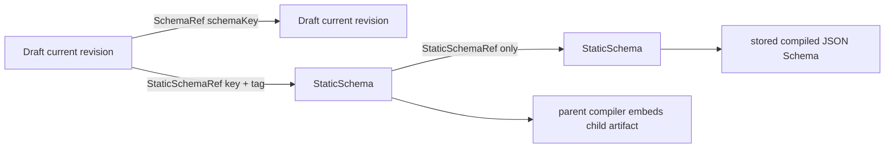
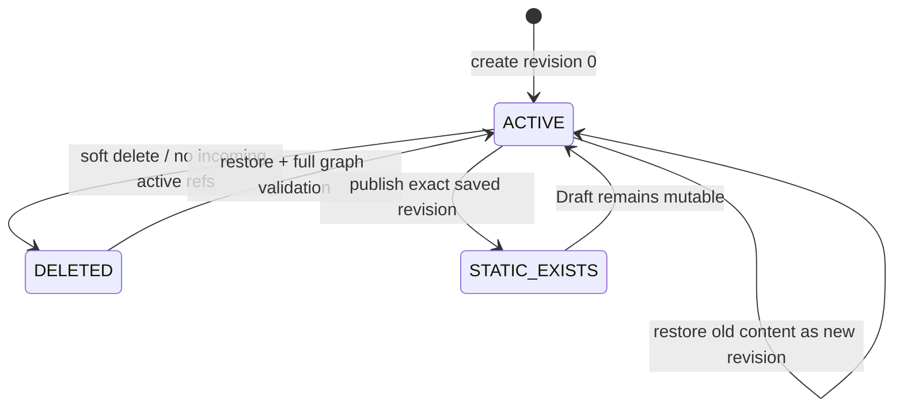
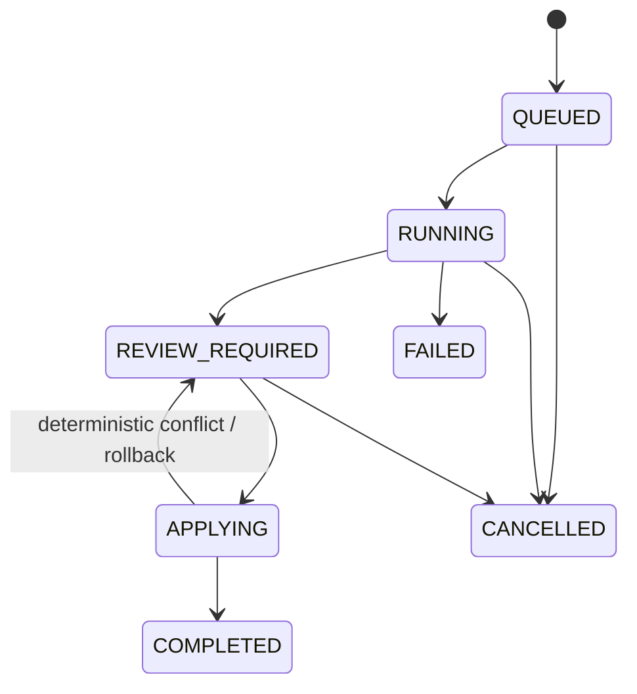

# RenderWeave v1 五维领域模型

- 状态：Approved baseline
- 日期：2026-08-07
- 权威需求：[`specs/renderweave-v1.md`](../../specs/renderweave-v1.md)
- 目的：把需求访谈中的对象、行为、事件、关系和规则变成可实现、可验证的领域边界。

## 1. 建模判断

本项目存在明确的长生命周期实体、不可变发布物、引用图和异步任务状态，因此五维建模适用。这里的事件表示可观察的领域状态迁移，不意味着采用 event sourcing；v1 的事实源仍是 PostgreSQL 当前状态、不可变 revision/StaticSchema 快照及事务日志。

## 2. Objects

| 对象 | 关键属性 | 生命周期/状态 | 所有权边界 |
|---|---|---|---|
| `SchemaDraft` | `schemaKey`, current revision, deleted state, timestamps | `ACTIVE` / `DELETED` | `schema` 聚合根；拥有当前指针，不拥有 StaticSchema |
| `DraftRevision` | `schemaKey`, `revision`, complete DSL snapshot, savedAt | append-only；0 开始递增 | `schema`；历史只读，restore 创建新 revision |
| `StaticSchema` | `schemaKey`, `versionTag`, source revision, DSL snapshot, compiled JSON Schema bytes, compilerVersion, releaseNote, publishedAt | 创建后永久不可变、不可删除 | `schema`；不依赖 Draft 后续存在 |
| `ReferenceEdge` | parent identity/revision, field occurrence, `SchemaRef` 或 `StaticSchemaRef` target | 随 Draft current revision 投影替换；Static 直接引用永不变 | `schema`；DSL 是事实源，edge 是事务内一致投影 |
| `SystemStaticSchema` | reserved key, `v1`, fixed DSL/artifact | 安装时一次创建；只读 | `schema`；和用户 Static 使用同一读取/引用模型 |
| `CompiledSchemaArtifact` | stable compact UTF-8 JSON text, compiler version | 与 StaticSchema 同生、同不可变 | `schema compiler`；只用于互操作/下载 |
| `RootDocument` | strict JSON object | request-scoped，不持久化 | `validation`；未知字段允许，但受全局解析预算 |
| `ValidationResult` | target snapshot, resolved dependency set, ordered problems, truncated | request-scoped | `validation`；不修改 Schema 或输入 |
| `InferenceProfile` | version, provider, model, prompts, structured schemas, budgets, certification | repo-versioned；只有 certified 可作为生产默认 | `inference`；API key 不进入 Profile |
| `InferenceRun` | runId, mode, state, sequence, profile snapshot, cost/usage, failure | 状态机驱动；用户可永久删除 | `inference`；Schema 只保留弱 `creationSource` |
| `NormalizedInputArtifact` | opaque locator, media metadata, normalized image or reduced JSON context | run 引用计数；最后引用删除后移除 | `inference BlobStore`；原始图片不持久化 |
| `InferenceCandidate` | original/current/final snapshots, candidate revision, graph, issues | original immutable；current autosave；apply 时 final immutable | `inference`；不是 RenderWeave DSL |
| `CandidateSchema` / `CandidateField` | run-local opaque IDs, proposed keys/definition, evidence, confidence, resolution status | 仅 run 内稳定；apply 后 ID 丢弃 | `inference candidate` |
| `Evidence` | source kind, image bbox or JSON Pointer, inferred flag, confidence | 与 original candidate 来源绑定 | `inference`；不证明业务真相 |
| `ProviderAttempt` | stage, attempt, request metadata, usage, safe failure | append-only audit；不保存 chain-of-thought | provider adapter 边界 |

## 3. Behaviors

| 行为 | 发起者 | 前置条件 | 结果 / 失败语义 | AC |
|---|---|---|---|---|
| 创建 Draft | 用户 / Candidate apply | key 未占用且从未复用；DSL 完整有效 | 创建 revision 0；任一问题零写 | AC-001, AC-002 |
| 保存 Draft | 用户 | `expectedRevision` 等于 current；本地编辑可暂时无效 | 新增完整 revision 并替换引用投影；冲突 409 | AC-001, AC-003 |
| 查看历史 | 用户 | Draft 存在或软删除 | 分页读取不可变 revision | AC-003 |
| 恢复 revision | 用户 | 目标历史存在；当前 revision 匹配；恢复后图有效 | 复制历史内容为新的 current revision | AC-003, AC-005 |
| 软删除 Draft | 用户 | current revision 匹配；无 active incoming Draft 引用 | Draft 进入 DELETED、出边停用；key 永久保留 | AC-002, AC-005 |
| 恢复 Draft | 用户 | key tombstone 属于该 Draft；引用重新可解析且 DAG | 新 revision + ACTIVE；失败保持 DELETED | AC-005 |
| 复制为新 Draft | 用户 | 来源 Draft revision 或 Static 存在；新 key 可用 | 只复制根定义、保留引用、revision 0 | AC-002 |
| 发布 StaticSchema | 用户 | exact saved revision；`expectedRevision` 匹配；只有 Static refs；tag 可用 | 同事务编译并写不可变发布物 | AC-006, AC-010 |
| 验证 RootDocument | 用户 / API consumer | 目标可解析；请求在预算内 | 返回确定性结果；不修改输入或 Schema | AC-011, AC-012 |
| 创建推断任务 | 用户 | 显式确认外部传输；输入、Profile、预算有效 | durable `QUEUED` run；幂等键重放返回原 run | AC-015, AC-020 |
| 执行推断阶段 | worker | 有效 lease；任务未取消；预算尚余 | checkpoint 或安全失败；模型无写权限 | AC-016, AC-019, AC-020 |
| 审核 Candidate | 用户 | run 为 REVIEW_REQUIRED；candidate revision 匹配 | current snapshot 更新；Draft 不受影响 | AC-017 |
| 应用 Candidate Bundle | 用户 | 所有 blocker 已解决；每个低置信项已处置；key 无冲突 | 单事务创建全部 Draft 并完成 run；失败回到 review | AC-018 |
| 取消推断 | 用户 | state 允许取消 | cooperative cancel；不产生部分 Schema | AC-019 |
| 自动恢复 worker | 系统 | lease 过期或进程重启 | 同 run 从安全 checkpoint 继续 | AC-019 |
| 人工重试终态任务 | 用户 | FAILED/CANCELLED；输入仍存在 | 新 run，记录 `retryOfRunId`，重新计费 | AC-019, AC-020 |
| 删除 InferenceRun | 用户 | 不在不可取消 APPLYING 事务内 | 擦除 run 详情及最后引用素材；Schema 不回滚 | AC-024 |

## 4. Events

| 事件 | 触发行为 | 最小载荷 | 订阅者 / 副作用 |
|---|---|---|---|
| `DraftCreated` | 创建 Draft | schemaKey, revision=0, creationSource | 列表查询、审计摘要 |
| `DraftRevisionSaved` | 保存/恢复 revision | schemaKey, revision, previousRevision | Web mutation response；缓存失效 |
| `DraftDeleted` / `DraftRestored` | 删除/恢复 | schemaKey, revision | 列表与引用选择器刷新 |
| `StaticSchemaPublished` | 发布 | StaticSchemaRef, sourceRevision, compilerVersion | Static 列表；未来 Template 消费边界（v1 无订阅者） |
| `InferenceRunQueued` | 创建任务 | runId, mode, sequence | PostgreSQL worker wake-up |
| `InferenceStageChanged` | stage checkpoint | runId, stage, sequence, safe progress | SSE 通知；客户端随后 GET snapshot |
| `CandidateReviewRequired` | 推断完成 | runId, candidateRevision, blocker counts | SSE 通知；审核页可进入 |
| `CandidateChanged` | 审核 autosave | runId, candidateRevision | 其他标签页失效提示；非实时协作 |
| `CandidateApplied` | 原子创建 | runId, created schema keys | Draft 列表刷新；run 完成 |
| `InferenceRunFailed` / `Cancelled` | worker/用户 | runId, safe code, sequence | SSE 通知、保留可诊断 snapshot |

事件通过事务状态和 SSE 序列暴露；SSE 是至少一次通知通道，不是事实源。客户端按 sequence 去重并重新获取数据库快照。

## 5. Relations

| 关系 | 基数 / 方向 | 更新与删除规则 |
|---|---|---|
| SchemaDraft → DraftRevision | 1 → 1..n | append-only；current 指向最大成功 revision |
| SchemaDraft → StaticSchema | 逻辑谱系 1 → 0..n | Static 只保存 `sourceDraftRevision`，Draft 删除不级联 |
| DraftRevision → SchemaRef | 1 → 0..n | live 解析目标 current revision；请求开始冻结 revision map |
| DraftRevision → StaticSchemaRef | 1 → 0..n | 精确版本；目标不可删除 |
| StaticSchema → StaticSchemaRef | 1 → 0..n | 只允许精确 Static；全图 DAG |
| InferenceRun → Candidate | 1 → original + current + optional final | 不保留每次编辑历史 |
| Candidate root → Candidate children | 恰好 1 root → 0..n reachable children | 所有新节点必须从 root 可达；无孤儿、无环 |
| Candidate item → Evidence | 1 → 0..n | AI 项必须有 evidence 或明确 inferred；用户新增项可为 0 |
| InferenceRun ↔ NormalizedArtifact | n ↔ n | 引用计数；最后引用 run 删除后删除文件 |
| Candidate apply → SchemaDraft | 1 → 1..n | create-only、全有或全无；Candidate ID 不复制 |

### 引用图



所有 Draft 图变化在同一 PostgreSQL 事务和 advisory lock 范围内检查；任何环、悬空引用或约束冲突都会让保存失败。

## 6. State models

### Draft



`STATIC_EXISTS` 是并行事实而非 Draft 状态；发布不会锁住 Draft。

### InferenceRun



### 低置信候选项

```text
UNRESOLVED → CONFIRMED
UNRESOLVED → RESOLVED_BY_EDIT
UNRESOLVED → REMOVED
```

不存在 confirm-all；每个低置信项必须单独结束在三个终态之一。

## 7. Rules

| Rule | 不变量 | 强制位置 | 失败行为 | AC |
|---|---|---|---|---|
| R-SCH-001 | 根 Schema 永远描述 object；RootDocument 根不是 scalar/array。 | domain + validator | `ROOT_TYPE_UNSUPPORTED` | AC-001, AC-011 |
| R-SCH-002 | 正式字段身份只由 key 组合和 occurrence path 构成，不保存 fieldId。 | DSL parser + DB model + architecture test | contract/build failure | AC-002 |
| R-SCH-003 | `schemaKey` 创建后不可改、删除后不可复用；`fieldKey` rename 是 delete+add。 | domain + unique/tombstone persistence | 409/problem | AC-002 |
| R-SCH-004 | Saved Draft 必须字段 key 非空唯一、引用可解析、约束无冲突、全图无环。 | domain before repository | zero write + ordered problems | AC-001, AC-004 |
| R-SCH-005 | 保存和图变更必须携带 expected revision，且 revision 只增不改。 | transaction service | 409 `REVISION_CONFLICT` | AC-003 |
| R-SCH-006 | 恢复不移动 current 指针到旧记录，而是创建新 revision。 | domain + repository | zero write | AC-003 |
| R-REF-001 | Draft 可保存 SchemaRef/StaticSchemaRef；Static 只能保存 StaticSchemaRef。 | DSL validator + publish gate | save/publish blocked | AC-004, AC-006 |
| R-REF-002 | 引用深度 ≤16，根计 1；图始终 DAG。 | graph validator | zero write | AC-004 |
| R-REF-003 | 有 active incoming Draft ref 时不能软删除目标 Draft。 | locked transaction | 409 + incoming summary | AC-005 |
| R-STA-001 | StaticSchema `{schemaKey,versionTag}` 唯一，内容/产物永不更新或删除。 | domain/repository; standard DB uniqueness | command unavailable / write refused | AC-006, AC-007 |
| R-STA-002 | 发布只消费调用时仍为 current 的已保存 revision，不隐式保存。 | publish transaction | 409 / validation problem | AC-006 |
| R-STA-003 | 同 revision 可用不同 tag 重复发布；同 tag 永不复用。 | domain + unique constraint | 409 | AC-006 |
| R-DSL-001 | `dslVersion` 固定 `renderweave-schema/1.0`；未知字段拒绝。 | parser | stable DSL problem | AC-008 |
| R-DSL-002 | 类型只允许 text/decimal/date/time/boolean/reference/array；array item 不得为 array/null。 | DSL validator | save blocked | AC-008, AC-009 |
| R-DSL-003 | 每种 constraint kind 最多一次；enum 与 const 互斥；所有值彼此一致。 | constraint validator | save blocked | AC-008 |
| R-DSL-004 | decimal 使用 lossless BigDecimal 语义，precision ≤128、normalized scale -64..64。 | strict parser + domain | input/save problem | AC-008 |
| R-DSL-005 | date=`YYYY-MM-DD`；time=`HH:mm:ss`，无时区/小数秒/闰秒。 | domain + validator | format problem | AC-008, AC-011 |
| R-DSL-006 | object array 不支持 uniqueItems；scalar array 才可启用。 | constraint validator | save blocked | AC-009 |
| R-CMP-001 | 发布时一次性自底向上编译、完全内联，产物最大 2 MiB。 | compiler + transaction | publication rollback | AC-010 |
| R-CMP-002 | 父编译器只嵌入已保存子 artifact，移除子 `$schema`，不重编译子节点。 | compiler golden tests | publication rollback | AC-010 |
| R-CMP-003 | own validator 是权威；无法标准表达的语义使用 `x-renderweave-*`。 | compiler + docs + architecture tests | interoperability diff failure | AC-010, AC-011 |
| R-VAL-001 | strict JSON、重复 object key 拒绝；未知字段允许任意 JSON。 | input parser | request rejected / problem | AC-011 |
| R-VAL-002 | 缺失与 null 不同；定义字段 present-null 永远无效。 | validator | ordered type/null problem | AC-011 |
| R-VAL-003 | 诊断按固定深度优先顺序，最多 100 条/文档；类型失败短路子约束。 | validator | deterministic truncated result | AC-012 |
| R-INF-001 | AI 输入、OCR/文本和模型输出均是不可信数据，不是指令。 | provider prompt + contract + tool manifest | stage failure | AC-015, AC-020 |
| R-INF-002 | Candidate 与正式 DSL 是不同类型；未解析项绝不能进入 Schema repository。 | module types + materializer | REVIEW_REQUIRED | AC-016, AC-018 |
| R-INF-003 | v1 AI 只创建新 Draft Bundle；任何 key/tombstone 冲突使整包零写。 | materializer transaction | REVIEW_REQUIRED + conflict | AC-018 |
| R-INF-004 | Agent tool surface 没有 publish/update/delete/SQL/filesystem/arbitrary HTTP。 | architecture + manifest tests | build/release gate failure | AC-018, AC-020 |
| R-INF-005 | 低置信项逐项确认/编辑/删除；Agent 永不发布。 | review policy + apply gate | apply blocked | AC-017, AC-018 |
| R-INF-006 | JSON concrete structure/type 在 combined 模式优先；图片只补语义，冲突不猜。 | deterministic merge policy | blocker | AC-016 |
| R-INF-007 | worker checkpoint/lease/idempotency 保证崩溃恢复不重复创建或调用已完成 stage。 | job store + transaction tests | safe retry/failure | AC-019 |
| R-INF-008 | 未认证 Profile 不可成为默认生产 Profile；评测按输入模式分别过门槛。 | profile registry + release evaluation | feature unavailable | AC-021 |
| R-UX-001 | Form/Map 使用同一 EditorSession reducer，切换不丢状态。 | frontend tests | UI gate failure | AC-013 |
| R-UX-002 | 保存显式；无浏览器本地 autosave；离开 dirty 页面必须拦截。 | UI | E2E failure | AC-013, AC-014 |
| R-UX-003 | 所有 map 操作都有表单/键盘等价路径；核心流程满足 WCAG 2.2 AA。 | components + axe + manual keyboard | gate failure | AC-014 |
| R-API-001 | `/api/v1` + OpenAPI 3.1.2 是 HTTP 事实源；错误使用 RFC 9457 扩展。 | contract lint + tests | contract gate failure | AC-022 |
| R-OPS-001 | 无 auth/multitenancy；可信部署或外部反向代理承担访问控制。 | topology + docs | unsupported config warning | AC-024 |
| R-OPS-002 | 常规日志不得包含原始素材、完整样本、模型完整 I/O、secret 或 chain-of-thought。 | logging policy + tests | release gate failure | AC-020, AC-024 |
| R-SCOPE-001 | v1 不出现 Template/Workspace/Adapter/Renderer 的表、API、页面或占位模块。 | spec + architecture/E2E review | scope gate failure | AC-025 |

## 8. 已主动排除的模型

- UUID/fieldId 作为正式字段身份。
- Draft 引用悬空后仍可保存。
- 自动 latest、自动发布或 publish tool。
- inline object、union、nullable、nested array。
- JSON Schema 导入或 raw DSL 编辑。
- 多租户、应用内身份/权限、消息中间件、微服务和 Redis。
- 为未来 renderer 预留无消费者的抽象或表。

