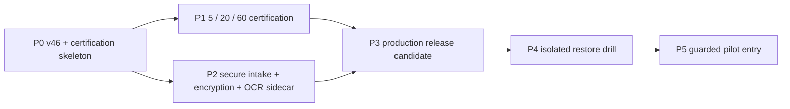

# RenderWeave IMAGE_ONLY Production Admission 实施计划 v1

- 状态：**in_progress**（P0=`automated_verified`；P1–P5 未开始，未进入认证 grant、发布或生产状态）
- 日期：2026-08-17
- Approved delta：[`specs/changes/20260817-image-only-production-admission.md`](../specs/changes/20260817-image-only-production-admission.md)
- 决策索引：[`plans/image-only-production-admission-blueprint-v1.md`](image-only-production-admission-blueprint-v1.md)
- 细节唯一权威：`.scratch/image-only-schema-production-admission/issues/01..16`；本计划只编排已经 resolved 的决定
- 规划基线：`main@ac7ef7e46acca142076cc44919f9ba3f59e2635f`（2026-08-17）
- 当前事实：product-v45=`ACTIVE_EXPERIMENTAL`；v46 已作为 hidden certification candidate 创建但未 grant；
  envelope encryption、OCR UDS sidecar、`ProductionLiveAuthority` 均未实现；无生产部署；全部既有 live
  authorization=`CLOSED`，v46 OPEN authorization 数量为 0
- 交付终点：完成首个 **guarded pilot entry/start**。它不是 limited/default，也不自动产生
  `ProductionUsable`
- 当前实施边界：已完成 P0-01..05 的 Provider-zero 实现；Provider attempts/reservations/cost/API-key reads 均为 0；
  `$implement` 工作流允许形成实现 commit，但不 push

若本计划与源票在数值、identity、术语、信任边界或生命周期上出现实质冲突，执行者必须暂停受影响任务，按
Blueprint 附录 A 开新票；不得在计划、代码或测试中静默改写决定。未受冲突影响的安全任务继续推进。

## 0. P0 执行 checkpoint（2026-08-17）

- 生命周期：`automated_verified`；G-P0-PROFILE=`PASS`。这不是 Profile Certification grant、J1 接受、发布或
  `ProductionUsable`。
- exact v46：`dashscope-qwen38-max-product-v46-hybrid-generic`；canonical SHA-256 =
  `22f561c88b30fabbf3ba660bcfe203fb570975f770ff122f2ce1c7216454ac0c`；只相对 v45 改
  `profileId`、`maximumTotalCalls=12`、`maximumEstimatedCostMicrosCny=6000000`，且未进入 product catalog。
- frozen synthetic dry-run manifest =
  `renderweave-image-only-certification-manifest/1.0:0d38c81b129c654342c50bc507e71c3518d32305a9745631469a7b14556294e2`；
  evaluator =
  `renderweave-image-only-certification-evaluator/1.0:ebdb6bf82083ab35d234d4ded07990848d0e28add6e468c9e5a7b6a90555c29e`。
  这些 P0 synthetic identities 证明 evaluator，不可冒充 P1 的 fresh owner case manifest。
- A1/A2：`tools/run-gate.ps1 -Gate image-only-p0` 绿色；Testcontainers PostgreSQL 覆盖 12-call/¥6 aggregate
  reservation 与 append-only event trigger；Python 独立重算 v46 diff/hash、60-case assignment、20 HOLDOUT、
  58 metrics、逐 case payload-free verdict 与 exact stage evidence identity。专用证据：
  `.sdlc/evidence/20260817-162343-image-only-p0/`；完整服务端回归证据：
  `.sdlc/evidence/20260817-160140-server/`。
- Provider-zero：attempts=0、reservations=0、cost=0、API-key reads=0；无 StaticSchema 发布或 apply。
- J1 边界：本轮会话给出的“全阶段、每模型 1M token、48h”只进入 preflight 的最大 token/time 约束，不能替代
  P1 每阶段在 fresh case hash、exact cycle/manifest、调用次数和费用形成后所需的新 scoped J1 JSON。当前只存在
  `PROPOSED` 且故意不可执行的模板，OPEN=0。P0 preflight 只返回 `grantsProviderEgress=false` 的 Provider-zero
  proof，并从 append-only event 投影取得唯一 next stage；原子 runs/calls/tokens/cost 消费与 CLOSED ledger 是
  IOPA-P1-01 的前置实现，不能由重复 P0 proof 替代。
- 下一恢复入口：IOPA-P1-01；需先取得 5 份 fresh `USER_PROVIDED+ORDINARY_DESIGN` 输入及与其 exact hashes/
  manifest/calls/cost 绑定的 canary J1。P1 阻塞期间可独立推进 P2 Provider-zero 实现。

## 1. 四维执行配置与能力契约

```text
规模：project
自主：copilot；确定性实现可连续推进，live/真实数据/恢复放行/生产 authority 为人工阻断
风险：guarded
并发：single-writer
```

理由：该 Goal 横跨 Profile、认证、网关、加密存储、OCR 容器、API/Web、数据库、恢复与发布门控；外部调用
不可逆且可能产生费用，数据与 authority 失败又不能仅靠 Git 恢复。当前仓库能捕获本地 A1；N9/R1 的严格
输入重放和 restore verifier 可提供限定范围 A2；没有外部强制 CI/production permission，因此没有 A3。

| Harness 能力 | 当前值 | 对计划的约束 |
|---|---|---|
| `evidence_capture` | available，`tools/run-gate.ps1` 机器捕获 | 本地 gate 可声称 A1，不把口头结果算证据 |
| `atomic_claim` | unavailable | 单写入者；不并发修改同一工作区/同一 migration 链 |
| `blocking_permission` | human | 每个 live stage、数据恢复放行和 pilot authority 等待精确 J1 |
| `independent_verify` | strict-scope only | N9/R1、restore reconciliation 与指定 release replay 可到 A2；其余不外推 |
| `isolated_workspace` | unavailable | 恢复演练用显式隔离 Compose/卷；不能把当前数据卷当演练目标 |

当前结论是 **Plan-ready，不是 Auto-ready**。升级条件是：所需实现和 Provider-zero 门控已绿色、精确 identity
已生成、对应阶段具备 fresh scoped J1，且执行环境能够隔离数据与记录 A1/A2。

## 2. 版本控制与生命周期策略

- 本 Goal 默认 `record-only`；本次因用户显式调用 `$implement`，按该工作流形成实现 commit。仍不建 tag、不 push。
- 每个任务完成时记录 working-tree diff、gate evidence 与 lifecycle event；后续 Git checkpoint 仍需同等明确授权。
- `planned → in_progress → automated_verified → independently_reviewed → human_accepted → released` 逐级诚实报告。
  自动 gate 绿色最多到 `automated_verified`；A2 后最多到 `independently_reviewed`；J0 仍不能报 accepted。
- 认证失败、restore 失败、release gate 失败和 rollout 失败都写 append-only negative terminal；后续新尝试使用新 identity。
- 历史 N7/R5/R5P/R5P2、旧授权、ledger、assignment 与 evidence 只读且不可调度。v45 保持
  `ACTIVE_EXPERIMENTAL`，直至单独的人类决定改变其状态。

### 2.1 执行 identity registry

| Identity | 当前/固定值 |
|---|---|
| Provider route/model | `https://dashscope.aliyuncs.com/compatible-mode/v1` / `qwen3.8-max` |
| Credential selector | `DASHSCOPE_API_KEY` 或只读 `_FILE`；只有 production Provider Adapter 可读 |
| Active experimental baseline | `dashscope-qwen38-max-product-v45-hybrid-generic` |
| v46 | `dashscope-qwen38-max-product-v46-hybrid-generic` / `22f561c88b30fabbf3ba660bcfe203fb570975f770ff122f2ce1c7216454ac0c`；hidden、未 grant；calls=12、run aggregate=¥6、output=8192、timeout=360s |
| OCR capability | `rapidocr-3.9.2-openvino-2026.0.0-ppocrv6-small-c05805399d7d10b1` |
| OCR images | `python:3.12-slim-bookworm` base digest 与 final sidecar digest 待 P2 exact build 固定 |
| Release app SHA | 待 P3 release candidate 固定；规划基线 SHA 不是 pilot identity |
| ProductionLiveAuthority | 不存在；只能在 G-P4-RESTORE 后按 P5 创建 |

## 3. 测试 Interface 与深 Module 边界

### 3.1 主验收 seam

```text
signed public live command
  → real Testcontainers PostgreSQL
  → ImageOnlyProductionAdmission
  → encrypted artifact store
  → fake Provider
  → durable REVIEW_REQUIRED
  → per-item manual review
  → atomic create-only Draft Bundle apply
```

这是唯一跨层主验收 seam。测试只观察 HTTP contract、持久事件、fake Provider 的有界调用、Candidate 状态与
Draft apply；不锁定 Controller、helper 或类间调用。`ImageOnlyProductionAdmission` 是深 Module：Controller、Web、
worker 不复制准入谓词；create、dequeue、每次 call 均从同一权威重新求值。

### 3.2 三个不可约专用 seam

1. `normalized ArtifactSet + AcquisitionPolicy → DocumentObservationIR/1.0`：复用 R0，验证 UDS sidecar 的
   behavior-equivalence、隔离和错误投影。
2. `FrozenCertificationCycle → ProfileCertificationRecord event`：复用 N9/R1 evaluator，验证 seeded
   assignment、5/20/60 阈值、人工 verdict、negative terminal 与 A2 重放。
3. `encrypted backup set → restored readiness decision`：验证 reconciliation、no-resurrection、corruption、
   tombstone 与 crypto-erasure；源码 checkout 不能替代此 seam。

### 3.3 通用测试规则

- PostgreSQL 语义只用 Testcontainers PostgreSQL；不引入 H2/SQLite。
- 默认 test/gate 使用 fake Provider 或 Provider-zero 演练，显式清空 Key/live authorization，并断言
  attempts、reservations、cost、API-key reads 全为 0。
- 日志、problem detail、metric、webhook、audit、evidence、stderr 与 restore report 全部做 payload scan。
- exact identity 和时间/预算边界测试 equality、`-1`、`+1`，并覆盖 missing/drift/tamper/replay/stale。
- Candidate 必须逐项 review；apply 只创建 Draft Bundle。任何自动 publish/update/delete StaticSchema 的路径都使 gate 失败。
- Candidate 局部 ID 必须在 apply 边界移除，Draft/Static/compiled 产物不得出现 fieldId；既有 StaticSchema bytes 与
  compiled JSON Schema identity/bytes 必须不变。Schema 判定使用 RenderWeave validator，不以通用 JSON Schema validator 代替。

## 4. Phase 路线与依赖 DAG

| Phase | 用户可验证增量 | 外部调用 | 退出门控 | 最高可报状态 |
|---|---|---:|---|---|
| P0 v46 与认证骨架 | exact v46 candidate、不可变 hash、认证 cycle/record 与 frozen dry-run | 0 | G-P0-PROFILE | `automated_verified` |
| P1 5/20/60 认证 | fresh 5/20/60 全周期、N9/R1 A2、production-policy J1、v46 grant | 有；逐阶段 J1 | G-P1-CERT | `human_accepted` |
| P2 Secure intake | gateway、逐 run 合同、信封加密、删除与 UDS OCR sidecar | 0 | G-P2-SECURE-INTAKE | `automated_verified` + capability license J1 |
| P3 Release candidate | production admission/authority、API/Web、遥测、备份工具、扩展 release gate | 0 | G-P3-PROD-RELEASE | `human_accepted` |
| P4 Restore proof | 隔离完整 restore、A2 对账与 ops J1 | 0 | G-P4-RESTORE | `human_accepted` |
| P5 Guarded pilot | 精确 60-day authority + 所有者首个 ordinary-design run | 有；fresh pilot J1 | G-P5-PILOT-ENTRY | `released`（pilot only） |



P1 等待 live J1 时，P2 的 Provider-zero 实现可继续；P3 同时依赖 P1 的 exact certification grant 与 P2 的
安全数据面。P5 只启动 pilot，不执行其至少 2 周/30 run 的 exit 周期。

## 5. P0 — v46 Profile 与认证 authority 骨架

### IOPA-P0-01 Canonical authority 与 prohibited reuse

- AC：AC-IOPA-001、AC-IOPA-033、AC-IOPA-034。
- 依赖：approved delta。
- 影响区域：Profile catalog/registry、历史 Goal/authorization ledger、release guard、plan/status 文档。
- 实施：建立机器可读 inventory，固定 product-v45=`ACTIVE_EXPERIMENTAL`、历史路线和所有旧 J1=`CLOSED`；
  新 cycle 引用旧 identity/assignment/ledger/evidence 时拒绝并产生 typed reason。
- 局部验证：正例当前 inventory；负例逐个引用 N7/R5/R5P/R5P2、旧 auth id、旧 assignment。
- Assurance：focused A1；纳入 release A2 prohibited-reuse replay。
- 完成信号：旧路线没有可调度边，Provider accounting=0。

### IOPA-P0-02 创建 immutable v46 candidate

- AC：AC-IOPA-002、AC-IOPA-003。
- 依赖：IOPA-P0-01。
- 影响区域：`renderweave-inference` Profile resource/loader/snapshot、预算 reservation、恢复兼容测试。
- 实施：从 v45 canonical semantics 只改变 profileId、`maximumTotalCalls=12`、
  `maximumEstimatedCostMicrosCny=6000000`；保持 output=8192、timeout=360、模型/route/prompt/pipeline/threshold/
  pricing/capability 不变。生成 canonical bytes SHA-256，认证前不进入普通 catalog。
- 局部验证：byte-semantic three-field diff、hash snapshot、tamper、registry hidden；run aggregate cost 对 settled +
  reserved 实施 ¥6 上限，单 attempt 估值也不得超过 ¥6；历史 snapshot 保持旧解释。
- Escalation：若 canonical serialization 迫使除三字段外的语义变化，开新票，不用格式化差异掩盖。
- Assurance：A1 + 独立 snapshot replay A2。
- 完成信号：v46 exact profileId/hash 被写入后续 cycle manifest，Provider accounting=0。

### IOPA-P0-03 Append-only certification domain

- AC：AC-IOPA-004、AC-IOPA-006。
- 依赖：IOPA-P0-02。
- 影响区域：domain model、application port、Flyway/PostgreSQL repository、OpenAPI internal/admin view。
- 实施：实现 `FrozenCertificationCycle`、stage event、manual case verdict、grant/revoke
  `ProfileCertificationRecord`；runtime role 无 UPDATE/DELETE，Profile bytes 不承载 certification 状态。
- 局部验证：Testcontainers append-only、duplicate/reorder/tamper、failure terminal、grant/revoke projection、migration rollback
  compatibility（forward-only）。
- ADR/Review：新增实现 ADR，解释 certification authority 与 Profile bytes 分离；Review 检查事件不可改写。
- Assurance：A1；release 时独立 event replay A2。
- 完成信号：空 cycle 可稳定创建、失败、grant、revoke，且不能原地修补。

### IOPA-P0-04 Frozen 5/20/60 evaluator adapter

- AC：AC-IOPA-005、AC-IOPA-006、AC-IOPA-008。
- 依赖：IOPA-P0-03。
- 影响区域：evaluation corpus manifest、N9/R1 Java/Python verifier、stage runner、evidence schema。
- 实施：在既有 60-case/58-metric skeleton 上创建认证专用 seeded assignment；冻结 case hash、DEV/HOLDOUT、
  thresholds、evaluator revision 与 review rubric。DEV 不可读取 20 个 HOLDOUT；5/5、18/20、54/60 是闭区间门槛。
- 局部验证：known-good manifest、seed drift、HOLDOUT leak、7999bps flag-only、snake_case、kebab人工归一、阶段失败
  no patch-rerun、Java/Python exact replay。
- Assurance：runner A1 + evaluator A2。
- 完成信号：全 synthetic/fake outcome dry-run 可形成正/负 record，Provider accounting=0。

### IOPA-P0-05 Live authorization schema 与零调用预演

- AC：AC-IOPA-007、AC-IOPA-034。
- 依赖：IOPA-P0-04。
- 影响区域：`plans/live-canary-authorizations/` schema/validator、live preflight、ledger verifier、gate scripts。
- 实施：定义每阶段所需 exact Profile hash、数据分类、case hashes、calls、cost、effective/expiry、owner J1 与
  CLOSED 规则；`approvedAt` 不得早于 cycle 创建，且 approval→expiry 不得超过 48h；只提供无效
  fixture/template，不创建 OPEN authorization。
- 局部验证：missing/expired/wrong-profile/wrong-class/over-count/over-cost/open-after-terminal 全拒绝；默认环境即使存在
  fake key 字符串也不能读取或调用 Provider。
- Assurance：A1 authorization/preflight evidence。
- 完成信号：G-P0-PROFILE 绿色，无 live J1、无 Key 读取、无 Provider 调用。

## 6. P1 — v46 5/20/60 Profile Certification

P1 每个 live 任务开始前都是独立阻断点。当前没有可用授权；计划文件绝不预授权未来调用。
Blueprint 给出的整周期量级估算是 ¥40–95（历史单 run ¥0.43–1.11），只用于筹划；每阶段仍必须在执行前按
exact case/call/profile/time 生成更窄的次数与费用 hard cap，不能把该区间当作 authorization。

### IOPA-P1-01 Fresh 5-case owner canary

- AC：AC-IOPA-005、AC-IOPA-006、AC-IOPA-007、AC-IOPA-008。
- 依赖：G-P0-PROFILE；所有者提供 5 份 fresh USER_PROVIDED+ORDINARY_DESIGN 输入及当次 scoped J1 JSON。
- 实施：preflight exact v46/hash、case hashes、route/model、≤12 calls/run、cycle/stage identity、总次数/费用/时限；运行
  5 cases，逐项人工 review，关闭 ledger。
- Gate：必须 5/5；任一失败写 cycle terminal 并停止后续 live stages，不 patch/rerun。
- Assurance：A1 live ledger + J1 case verdict；本阶段不声称 A2 final certification。

### IOPA-P1-02 Fresh 20-case DEV

- AC：AC-IOPA-005、AC-IOPA-006、AC-IOPA-007、AC-IOPA-008。
- 依赖：IOPA-P1-01 通过；全新 DEV-scoped J1，不能复用 canary 授权。
- 实施：只解锁 seeded DEV assignment，HOLDOUT 仍不可见；逐 case 到达 REVIEW_REQUIRED/COMPLETED 且人工接受才计分。
- Gate：≥18/20；阶段结束立即关闭 ledger。
- Assurance：A1 + J1；失败形成 immutable terminal。

### IOPA-P1-03 Fresh 60-case final 与独立复核

- AC：AC-IOPA-005、AC-IOPA-006、AC-IOPA-007、AC-IOPA-008。
- 依赖：IOPA-P1-02 通过；全新 final-scoped J1。
- 实施：冻结后才解锁完整 60-case assignment（含 20 HOLDOUT）；逐 case 人工 verdict；N9/R1 verifier 独立重算
  58 metrics、threshold 与 ledger identity。
- Gate：≥54/60、HOLDOUT 未泄漏、A1/A2 exact match、ledger CLOSED。
- Assurance：A1 + strict-scope A2 + J1 case review；失败形成 immutable terminal。

### IOPA-P1-04 Certification grant 与 production-policy J1

- AC：AC-IOPA-004、AC-IOPA-007、AC-IOPA-030。
- 依赖：IOPA-P1-03 全绿。
- 实施：汇编 exact v46/hash、cycle manifest、stage ledgers、人工 verdict、A2 report 与 negative-terminal scan；请求独立的
  production-policy J1，之后才 append certification grant。该 J1 不授权 pilot 或任何额外 Provider call。
- Gate：缺任一身份/证据/J1 则 J0；不把 v46 暴露为 production catalog 项。
- Assurance：A1/A2 + J1。
- 完成信号：exact grant 可被 production admission 查询；cycle 全部 authorization CLOSED。

## 7. P2 — Secure intake、信封加密与 OCR sidecar

### IOPA-P2-01 Deep admission interface 与 gateway identity

- AC：AC-IOPA-009、AC-IOPA-011、AC-IOPA-030。
- 依赖：G-P0-PROFILE；可与 P1 并行。
- 影响区域：gateway/app security、JWS verifier、mTLS internal listener、clock/replay store、admission application module。
- 实施：实现≤60秒 asymmetric GatewayAssertion、header stripping、actor/request/jti/method/path/idempotency digest、jti replay
  guard 与 internal Actuator mTLS；不建立 app account/RBAC。
- 局部验证：forged/client identity、wrong path/method/digest、expired/not-yet-valid、replay、clock unavailable、public actuator。
- ADR/Review：新增 production admission authority ADR；安全 review 聚焦 Interface 与 secret-domain 隔离。
- Assurance：A1 security integration + release human contract review J1。

### IOPA-P2-02 Classification、notice、manifest 与 confirmation

- AC：AC-IOPA-010、AC-IOPA-011、AC-IOPA-012、AC-IOPA-026。
- 依赖：IOPA-P2-01。
- 影响区域：upload/input normalizer、domain/application、PostgreSQL、API contract fixtures。
- 实施：只接受 USER_PROVIDED+ORDINARY_DESIGN 静态 PNG/JPEG；冻结 1–10、10MiB、25Mpx、32MiB；notice/policy/
  normalized manifest/Profile hash/caps/actor/deadline 与 run 同事务原子绑定；15min first attempt、2h calls-not-after；
  retry 新 run/fresh confirmation，Idempotency-Key same-fingerprint 可复用，drift 409。
- 局部验证：所有分类/格式/数值边界、stale notice、manifest byte drift、响应丢失重发、ambiguous attempt no blind replay。
- Assurance：Testcontainers A1 + fault/time A2 replay。

### IOPA-P2-03 Encrypted artifact store

- AC：AC-IOPA-015、AC-IOPA-025。
- 依赖：IOPA-P2-02。
- 影响区域：BlobStore adapter、artifact metadata/Flyway、orchestrator secret、migration/fault tests。
- 实施：每 artifact 随机 DEK + AEAD，ciphertext 写 Blob，wrapped DEK/algorithm/version/nonce/tag/integrity 写 PG；KEK
  不进入 DB/Blob/backup/log/evidence；rotation 只 re-wrap；KEK loss fail-closed/crypto-erasure。
- 局部验证：known-answer、nonce uniqueness、tamper/truncate/swap、missing DB/Blob/KEK、re-wrap、old-KEK refcount、crash points；
  plaintext signature/payload scan。
- ADR/Review：新增 envelope encryption/restore ADR；独立 crypto design review。
- Assurance：A1 vectors + PG/filesystem integration；release A2 review。

### IOPA-P2-04 Expiry、tombstone 与 delete worker

- AC：AC-IOPA-016、AC-IOPA-017、AC-IOPA-025。
- 依赖：IOPA-P2-03。
- 影响区域：run/artifact lifecycle、deletion queue/worker、read/retry/call/apply guards、readiness projection。
- 实施：expiry 从首次上传算 7 天且共享引用不延长；COMPLETED 立即排删，FAILED/CANCELLED≤24h；先 append tombstone
  逻辑阻断，再删 ciphertext+wrapped DEK；失败重试且 backlog>24h 关闭 ImageOnlyReadiness。
- 局部验证：tombstone-first crash、共享引用、expiry/retry、review expiry、delete retry、no read/call/apply after tombstone。
- Assurance：Testcontainers + filesystem fault A1，release replay A2。

### IOPA-P2-05 Payload-free audit chain 与双开关

- AC：AC-IOPA-014、AC-IOPA-023、AC-IOPA-024、AC-IOPA-032。
- 依赖：IOPA-P2-01、P2-04。
- 影响区域：audit event/repository、policy/egress ports、logging/problem/webhook/metrics filters。
- 实施：append-only sequence+digest chain；runtime role 禁 UPDATE/DELETE；`ImageOnlyAdmissionPolicy` 与
  `ProviderEgressPermit` 独立默认关闭；audit 不可写/链异常即停止新 call；只记录 opaque identity/digest/fixed code/usage/cost。
- 局部验证：chain reorder/delete/duplicate、DB permission、one-switch-only、secret/payload/case-name/filename/CoT canaries。
- Assurance：A1 + independent chain replay A2。

### IOPA-P2-06 No-IP UDS OCR sidecar

- AC：AC-IOPA-018、AC-IOPA-019、AC-IOPA-020。
- 依赖：IOPA-P2-02；exact base digest/locks/models 在构建时固定。
- 影响区域：OCR adapter/protocol、sidecar source/container/Compose、SBOM/license/attestation、R0 corpus/gates。
- 实施：HTTP/1.1 over UDS，无 IP；linux/amd64 CPython3.12、glibc≥2.28、AVX2、CPU-only；
  `python:3.12-slim-bookworm@sha256:<fixed-at-build>`、hash locks、exact ONNX、zero-download；read-only、nonroot、drop caps、
  2CPU/2GB/PID64/60s。lock 必须含 `omegaconf==2.3.0` 与固定 builder 产生的内部
  `antlr4-python3-runtime==4.9.3` wheel；三份 ONNX 从 wheel 提取并逐一校验。startup capability+synthetic probe
  阻断；资源长稳为 telemetry。
- 局部验证：R0 behavior-equivalence、UDS envelope/schema/version、network namespace、offline cold start、wrong arch/CPU/model/hash、
  timeout/OOM/crash、payload scan、deterministic service unaffected。
- ADR/Review：新增 UDS sidecar containment ADR；supply-chain 与 container security 双 review。
- 人工条件：完整 provenance/SBOM/CVE/malware/license/NOTICE/attestation 后，由所有者记录 Apache-2.0 主线及
  exact model/system-library disposition 的 license J1；J0 不准入。
- Assurance：A1 + R0 independent replay A2 + license J1。
- 完成信号：exact image digest 与既定 capability id 可被 authority 引用；DeepSeek-OCR=absent。

## 8. P3 — Production admission、API 迁移与 release gate

### IOPA-P3-01 Production admission 与 9-value readiness

- AC：AC-IOPA-013、AC-IOPA-014、AC-IOPA-030、AC-IOPA-031。
- 依赖：G-P1-CERT、G-P2-SECURE-INTAKE。
- 影响区域：`ImageOnlyProductionAdmission`、readiness/health、authority events/Flyway、worker orchestration。
- 实施：append-only `ProductionLiveAuthority` grant/revoke schema，先只实现无 grant 状态；create/dequeue/call 前验证 exact
  app SHA、v46 hash、route、sidecar digest/capability、actor/input/caps/time、certification、dual switches、audit、deletion、budget；
  ImageOnlyReadiness 使用完整 9 reason codes，ServiceReadiness 独立。
- 局部验证：每一谓词单独失败、one-field authority drift、expiry/revoke、reason priority/stability、deterministic routes stay ready。
- Assurance：Testcontainers/runtime A1 + independent release replay A2。

### IOPA-P3-02 Per-call authorization、budget 与 drain

- AC：AC-IOPA-003、AC-IOPA-012、AC-IOPA-014、AC-IOPA-021、AC-IOPA-022、AC-IOPA-032。
- 依赖：IOPA-P3-01。
- 影响区域：worker lease/dequeue/provider attempt/reservation、cost ledger、kill-switch/drain FSM、fake adapter。
- 实施：发送 bytes 前原子持久化 call authorization、attempt identity 与 reservation；每次 call 重验；v46 run ≤12 calls/¥6，
  日 ¥30 soft、月 ¥500 hard；ambiguous 先查询、绝不盲重放；stop/drain 终结 queued/running，保留 REVIEW_REQUIRED review/apply。
- 局部验证：concurrent reservation、crash before/after send、timeout/unknown result、switch during call、daily/monthly equality±1、drain replay。
- Assurance：A1 fake Provider + independent Provider-zero state replay A2。

### IOPA-P3-03 Capacity、telemetry、alert 与 runbook

- AC：AC-IOPA-021、AC-IOPA-022、AC-IOPA-023、AC-IOPA-024。
- 依赖：IOPA-P3-01、P3-02。
- 影响区域：admission counters、internal actuator snapshot、PG periodic telemetry、alert webhook、runbooks/capacity tests。
- 实施：≤20 run/day、并发2、输入/磁盘70/85/delete/PG/sidecar水位；E2E/enqueue/queue/first-attempt与99.5%/99%窗口；
  low-cardinality fixed labels；warning日报/page即时；audit 90天/13月归档，其余 retention 按源票。
- 局部验证：frozen clock/window、sample-size、restart/rebuild from PG、threshold equality±1、webhook payload scan、runbook code coverage。
- Assurance：A1 CapacityBaseline + telemetry verifier A2。

### IOPA-P3-04 Breaking OpenAPI/SDK/Web migration

- AC：AC-IOPA-026、AC-IOPA-027、AC-IOPA-028。
- 依赖：IOPA-P2-02、P3-01。
- 影响区域：OpenAPI/controllers/generated Web SDK/UI/browser E2E/security headers。
- 实施：删除 `externalTransferConfirmed`/`experimentalProfileConfirmed` authority；新增 notice/policy/manifest/Profile/classification；
  旧 booleans、Token Plan、catalog/caps/delete/public Actuator drift typed 410/422，不双格式；UI 展示精确 notice/readiness/delete；
  Candidate 仍逐项 review，bulk 固定拒绝。
- 局部验证：contract snapshots、SDK regen diff-clean、old-client negative matrix、CSP/same-origin/Secure/HttpOnly/SameSite=Strict/
  CSRF/Origin/Fetch-Metadata/no-store、Node24 build 与 Playwright journey。
- Assurance：A1 + 独立 contract human J1。

### IOPA-P3-05 Backup、reconciliation 与 no-resurrection 工具

- AC：AC-IOPA-025。
- 依赖：IOPA-P2-03、P2-04、P3-01。
- 影响区域：backup scripts/index、Compose isolated topology、PG/Blob reconciliation、restore validator/runbook。
- 实施：仅 encrypted state 可备份；每日 pg_dump + Blob ciphertext tar，7天滚动；KEK独立；实现 PG→Blob→reconcile→
  no-resurrection→validate，orphan删除、missing/corrupt稳定失败禁apply，重放 tombstone/expiry/confirmation/authority/J1/switch。
- 局部验证：synthetic backup fixtures、orphan/missing/corrupt、expired/revoked/CLOSED state、KEK absent、RPO/RTO reporting。
- Assurance：focused A1；真正数据恢复验收留 P4。

### IOPA-P3-06 扩展 production release gate

- AC：AC-IOPA-029、AC-IOPA-032、AC-IOPA-034。
- 依赖：IOPA-P3-02..05。
- 影响区域：`tools/run-gate.ps1`/support scripts、evidence manifest、Compose、release checklist。
- 实施：在现有 full family 叠加 breaking contract、SDK regen、security、Testcontainers migration/recovery compatibility、
  CapacityBaseline、sidecar supply chain、Provider-zero kill-switch/drain、payload scan 与 exact Node24；默认清空 live env/Key。
- 局部验证：每个子门故障注入必须使总 gate 非零；最终 assertions 包含 Provider attempts/reservations/cost/API-key reads=0。
- Review/J1：合同兼容与数据政策由两个独立人类轴复核；一人可拥有两个角色，但必须分别记录 verdict。
- Assurance：完整 A1 pack + 指定子集 A2 + dual-axis J1。
- 完成信号：G-P3-PROD-RELEASE 绿色；仍无 pilot authority/Provider call。

## 9. P4 — Encrypted restore drill

### IOPA-P4-01 隔离全量 restore

- AC：AC-IOPA-025、AC-IOPA-029。
- 依赖：G-P3-PROD-RELEASE；专用隔离 Compose/卷已解析为 workspace 内明确路径。
- 实施：从一个真实 encrypted backup set 执行 PG→Blob→reconciliation→no-resurrection→validation；测量 RPO≤24h、
  RTO≤4h；绝不覆盖当前开发/试用卷。
- 安全检查：执行任何递归清理前解析并验证隔离目标；KEK 离线输入且不写 evidence。
- Assurance：工具捕获 A1 restore report。

### IOPA-P4-02 独立 hash 与不可读复核

- AC：AC-IOPA-015、AC-IOPA-016、AC-IOPA-025。
- 依赖：IOPA-P4-01。
- 实施：独立 verifier 对 PG/Blob/hash/tag/refcount/tombstone/authority/confirmation/switch 做对账；证明 orphan 被删、
  missing/corrupt 禁 apply、expired/CLOSED/revoked 不复活、无 KEK ciphertext 不可读。
- Assurance：严格输入范围 A2；报告 payload-free，只含 opaque id/digest/fixed counts/codes。

### IOPA-P4-03 Ops acceptance 与 pilot identity pack

- AC：AC-IOPA-025、AC-IOPA-029、AC-IOPA-030。
- 依赖：IOPA-P4-02。
- 实施：汇编 restore A1/A2、release A1/A2、RPO/RTO、negative vectors、exact app SHA/v46 hash/route/sidecar digest/capability；
  请求 ops J1。J1 只接受恢复准备，不授权 pilot。
- 完成信号：G-P4-RESTORE=`human_accepted`；identity pack immutable 可供 P5 引用。

## 10. P5 — Guarded pilot entry/start

### IOPA-P5-01 Fresh pilot J1 与 ProductionLiveAuthority grant

- AC：AC-IOPA-030、AC-IOPA-031、AC-IOPA-033。
- 依赖：G-P4-RESTORE；所有 release/security/data-policy/ops/certification 证据仍有效。
- 实施：在 `plans/live-canary-authorizations/` 新建当次 JSON，精确绑定 app SHA、v46 hash、route、model、sidecar digest/
  capability、仅所有者、USER_PROVIDED+ORDINARY_DESIGN、≤5 run/day、并发≤2、阶段≤100 calls/≤¥50、effective/60-day
  expiry、最大数据/调用/费用与 owner J1；同时分别记录并引用 visual（v46人工质量）、business（所有者接受 pilot）、
  ops（release/restore/runbook）与 policy（数据政策/Provider残余风险）四个 J1 verdict。preflight 通过后 append 同范围
  `ProductionLiveAuthority` grant。
- 红线：不读取/输出 API Key；Agent/CI/eval/script/canary actor 不在 authority scope；authority 不签发 authority。
- Assurance：J1 + Testcontainers/runtime A1 + exact-authority A2 replay。

### IOPA-P5-02 首个 owner run 与人工 apply

- AC：AC-IOPA-010、AC-IOPA-011、AC-IOPA-012、AC-IOPA-013、AC-IOPA-014、AC-IOPA-026、
  AC-IOPA-028、AC-IOPA-031、AC-IOPA-034。
- 依赖：IOPA-P5-01 authority active；所有者为该 run 完成 exact notice/manifest confirmation。
- 实施：用 1 个有界 ordinary-design run 验证 admission、encrypted persistence、OCR、Provider、budget/audit、
  REVIEW_REQUIRED、逐项人工 review、Candidate 局部 ID 清除与 create-only/无-fieldId Draft Bundle apply；随后关闭本次
  run ledger，并证明 published StaticSchema/compiled artifact 数量、identity 与 bytes 均未改变。
- 失败：立即 stop/drain，保留已完成 Candidate，关闭或 revoke 受影响 authority；未知 Provider 结果不自动重放。
- Assurance：live A1 + owner J1 review；费用/attempt 只在授权 cap 内。

### IOPA-P5-03 宣布 guarded pilot started

- AC：AC-IOPA-031、AC-IOPA-032、AC-IOPA-033。
- 依赖：IOPA-P5-02 通过、无未关闭 incident、全部 evidence/ledger payload-free 且 authorization 状态正确。
- 实施：记录 lifecycle=`released:guarded-pilot`、监控窗口和撤销入口；不得写 limited/default/ProductionUsable。
- 后续但不属于本计划出口：pilot 至少运行 2 周且≥30 run、满足 SLO/零事件/A1/A2/restore/quad J1 才可开新的
  limited-promotion 计划；authority 到期不自动续签或晋级。

## 11. Gate 定义

| Gate | 必须绿色的证据 | 人工条件 | 失败后的安全状态 |
|---|---|---|---|
| G-P0-PROFILE | v46 minimal diff/hash、aggregate cap、append-only cycle、frozen evaluator、Provider-zero | 无 | v46 hidden，cycle 可丢弃/保留负终态 |
| G-P1-CERT | 5/5、≥18/20、≥54/60、HOLDOUT integrity、CLOSED ledgers、N9/R1 A2 | 每阶段 scoped J1 + case review + production-policy J1 | 不 grant；关闭 cycle；P2 可继续 |
| G-P2-SECURE-INTAKE | gateway/confirmation、crypto/tombstone/audit、UDS/R0、payload scan | owner license J1；security/data-policy review 可先 J0 | switches off，无 Provider egress |
| G-P3-PROD-RELEASE | contract/SDK/security/PG/capacity/sidecar/drain/full Provider-zero A1+A2 | contract J1 + data-policy J1 | 无 authority，无流量 |
| G-P4-RESTORE | isolated restore、hash reconcile、no-resurrection、crypto-erasure、RPO/RTO A1+A2 | ops J1 | production admission off |
| G-P5-PILOT-ENTRY | exact 60-day authority、首 run、review/apply、audit/budget/ledger | fresh pilot scoped J1 + owner run review | stop/drain/revoke；不晋级 |

局部验证按 focused → affected module → Phase → Goal 逐级扩大。未改动且 identity 完全相同的最近绿色 A1 可复用；
Profile bytes、evaluator、migration、sidecar digest、app SHA、合同或 policy 任一漂移都会使相应证据失效。

## 12. 人工阻断与授权账本

| 阻断点 | 所需人类动作 | 不授权的事项 |
|---|---|---|
| 5-case canary | exact input/profile/count/cost/time scoped J1 | DEV/final/pilot |
| 20-case DEV | 新 scoped J1 | HOLDOUT/final/pilot |
| 60-case final | 新 scoped J1 | production policy/pilot |
| Certification grant | production-policy J1 | Provider call/pilot |
| OCR capability admission | exact provenance/license/NOTICE bundle 的 owner license J1 | 其他 image/capability 或生产流量 |
| Release acceptance | contract compatibility J1 + data-policy J1 | production traffic |
| Restore acceptance | ops J1 | pilot traffic |
| Guarded pilot | fresh exact 60-day aggregate J1 + visual/business/ops/policy 四份独立 verdict + authority grant | Agent/CI/canary、续期、limited/default |

所有 paid live J1 JSON 必须位于 `plans/live-canary-authorizations/`，包含精确 Profile、evaluation identity、数据分类、
次数、费用和时限；完成或失败后为 `CLOSED`。历史 JSON 永不复用。产品 aggregate pilot authority 生效时，普通 owner
run 仍需 exact notice/manifest confirmation，但不要求每次点击重新签发 J1；超出 authority 范围必须新 J1。

## 13. 风险、恢复与熔断

| 风险 | 早期探针 | 处置 | 三轴恢复 |
|---|---|---|---|
| v46 语义漂移/预算误解 | three-field diff、aggregate reservation property | 停 P1/P3，按附录 A 开票 | source revert；PG event不改写；零 Provider |
| certification 偏差/HOLDOUT 泄漏 | frozen manifest、dual evaluator、access log | cycle negative terminal，不重跑 | 保留代码；append failure；close ledger/费用不可回滚 |
| 明文或 payload 泄漏 | signature scan、payload canary、backup inspection | stop admission，隔离/删除，安全复核 | source fix；tombstone/crypto erase；revoke/drain |
| audit/time/deletion 不健康 | 9-code readiness probes | fail-closed 新 call | source fix；PG append repair event；无新外部副作用 |
| sidecar supply-chain/隔离失败 | offline build、SBOM/attestation、no-IP probe | capability unavailable，Service 继续 | pin/rebuild；无业务数据迁移；无 Provider |
| Provider ambiguous/费用超限 | attempt query、reservation/settlement reconciliation | stop/drain、no blind replay | source fix；append ledger correction；费用/调用不可撤销 |
| restore resurrects state | independent no-resurrection verifier | 不开放流量，销毁隔离恢复卷后重演 | source/runbook fix；重建隔离数据；无 Provider |
| exact identity 漂移/authority 到期 | admission one-field-drift matrix | typed 503、revoke/drain | source unchanged；append authority event；新 J1 才可恢复 |

熔断触发条件：连续三次同一 focused failure、两次无信息量尝试、任何 payload/secret 暴露、任何意外 Provider attempt、
任何源票实质冲突或任何未授权生产状态变更。触发后停止受影响路径，保留证据与 negative terminal，继续其他独立安全任务；
只有不存在安全路径或需要新产品语义/外部授权时才合并询问所有者。

再锚定发生在：每个任务开始、每个 Phase gate 前后、compact/handoff 后、用户新指令后、identity 或 worktree 基线变化后。
最小再锚定包为 approved delta、Blueprint exact identity、对应源票、当前 task/deps、最新 A1/A2/J1、git diff/status。

## 14. ADR 与 Review 队列

| 项目 | 时机 | 固定决策/审查问题 |
|---|---|---|
| Certification authority ADR | P0 | Profile bytes 与 append-only grant/revoke 分离、failure terminal |
| Production admission ADR | P2 | 单一 deep Module、create/dequeue/call 重验、gateway/assertion/time authority |
| Envelope encryption/restore ADR | P2 | random DEK/AEAD、KEK boundary、re-wrap、tombstone/no-resurrection |
| OCR UDS containment ADR | P2 | no-IP/UDS/cgroup/exact supply chain/R0 behavior-equivalence |
| Security review | P2/P3 | secret domains、same-origin、audit/payload、dual switches、arbitrary capability absence |
| Contract review | P3 | breaking migration、typed 410/422、SDK diff、no double-run |
| Data-policy review | P3 | ordinary-design only、notice/confirmation、retention/delete、Provider unknowns |
| Ops review | P4 | backup/restore/RPO/RTO/no-resurrection/crypto-erasure |

ADR 只记录实现 seam 与不可逆技术选择，不能重开或改写已批准产品决定；出现实质变更先开 source ticket。

## 15. Plan-ready 验收 checklist

- [x] Approved delta 已将 16 张 resolved 票转为行为与 AC，且声明源票优先级。
- [x] 关键路径按 v46/认证 → secure intake/release → restore → pilot 编排，并允许 P1 阻塞时推进 P2。
- [x] 每个 task 有 AC、依赖、影响区、局部验证、Assurance 或人工条件与完成信号。
- [x] 主验收 seam 与三个不可约专用 seam 已冻结，测试观察 behavior 而非类结构。
- [x] Provider、真实数据、恢复放行、authority 与 pilot 均有明确 J1 阻断；当前没有 OPEN authorization。
- [x] payload-free、Testcontainers PostgreSQL、Candidate人工审核、Draft-only apply、Provider-zero默认 gate 已进入计划。
- [x] 三轴恢复、熔断、再锚定、A0/A1/A2/A3/J0/J1 与 record-only 版本控制已明确。
- [x] 计划出口只到 guarded pilot started，不声称 limited/default/ProductionUsable。
- [x] 实现开始时已重取 git baseline/status；IOPA-P0-01..05 已实现并达到 `automated_verified`。

## Decision

- 规划结论：**Plan-ready**；P0 execution checkpoint 已完成。
- 当前 lifecycle：Goal=`in_progress`，P0=`automated_verified`，P1–P5=`planned`。
- 自动执行上限：确定性、Provider-zero、可回滚实现可由 Agent 连续推进到 A1；限定 verifier 可到 A2。
- 人工保留：所有 live J1、真实数据、production-policy、release dual review、restore ops acceptance、pilot authority 与
  lifecycle 宣布。
- P0 实施未运行 Provider、未读取 Key、未创建 OPEN 授权、未部署生产；按用户显式 `$implement` 工作流形成
  本地实现 commit，不 push。
