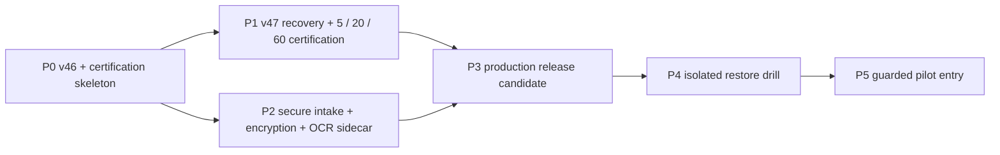

# RenderWeave IMAGE_ONLY Production Admission 实施计划 v1

- 状态：**active / stable_after_iopa_p2_06**（P0=`automated_verified`；历史 P1 diagnostics
  均已 immutable closed；P2-01..05=`automated_verified`；P2-06 实现 slice=`automated_verified`，OCR
  capability 产品准入被所有者 license J1 阻断（`J0_PENDING`），J1 批准前不得把 OCR 维度写成已准入，
  ImageOnlyReadiness 对 `DOCUMENT_VISION_UNAVAILABLE` 保持 fail-closed；下一唯一实施入口
  IOPA-P3-01 Production admission 与 9-value readiness=`not-started`；P1 scoring 未解锁，P3–P5 未完成；
  未 grant/发布/生产；按所有者要求停在稳定节点。接手先重锚定 `git status` 与工作树，保留现状再修改）
- 日期：2026-08-18（状态头更新 2026-09-03；p2-04/05/06 三份 handoff 已并入本头并归档至
  `docs/history/`）
- Approved delta：基线
  [`20260817-image-only-production-admission.md`](../specs/changes/20260817-image-only-production-admission.md)；
  successor
  [`20260817-image-only-v47-certification-successor.md`](../specs/changes/20260817-image-only-v47-certification-successor.md)；
  v48 recovery
  [`20260818-image-only-v48-region-recovery-successor.md`](../specs/changes/20260818-image-only-v48-region-recovery-successor.md)；
  v49 mixed fallback recovery
  [`20260818-image-only-v49-mixed-region-fallback-successor.md`](../specs/changes/20260818-image-only-v49-mixed-region-fallback-successor.md)；
  v50 local-ID recovery
  [`20260818-image-only-v50-local-id-canonicalization-successor.md`](../specs/changes/20260818-image-only-v50-local-id-canonicalization-successor.md)
- 决策索引：[`plans/image-only-production-admission-blueprint-v1.md`](image-only-production-admission-blueprint-v1.md)
- 细节唯一权威：已批准基线为 `.scratch/image-only-schema-production-admission/issues/01..16`；执行期 successor
  恢复权威为 resolved ticket
  [17](../.scratch/image-only-schema-production-admission/issues/17-freeze-v46-canary-failure-successor.md)；v48
  recovery 权威为 tickets 18–23，现均已 resolved；ticket 23 形成 immutable negative terminal。v49 recovery
  权威为 tickets 24–30，现均 resolved；v50 recovery tickets 31–33 现均 resolved。本计划只投影已批准
  结果；实质冲突仍按 Blueprint 附录 A 开新票
- 规划基线：`main@ac7ef7e46acca142076cc44919f9ba3f59e2635f`（2026-08-17）
- 当前事实：product-v45=`ACTIVE_EXPERIMENTAL`；v46–v51 successor diagnostics 均为 immutable negative terminal；
  v52 one-shot diagnostic 已 immutable closed 于 `REVIEW_REQUIRED`，仅等待所有者人工 verdict，未形成 certification
  credit。P2 secure admission、confirmation、envelope encryption、payload expiry/deletion seam、payload-free
  audit 双开关与 OCR UDS sidecar 已实现并默认关闭；`ProductionLiveAuthority` 尚未实现。无生产部署；全部既有
  live authorization=`CLOSED`，OPEN authorization=0。
- 交付终点：完成首个 **guarded pilot entry/start**。它不是 limited/default，也不自动产生
  `ProductionUsable`
- 当前实施边界：已完成 P0-01..05、v47–v52 bounded successor recovery 与 P2-01..06 实现 slice；
  IOPA-P3-01 是下一 Provider-zero frontier，但尚未启动。全部授权与 ledger 均 CLOSED，OPEN authorization=0；Goal aggregate live
  usage=159,069/1,500,000 model tokens，remaining=1,340,931；未 commit/push。
- Goal authority：所有者于 `2026-08-18T10:23:09+08:00` 启动持续 Goal，批准在既有 Wayfinder 范围内采用推荐决策
  与更窄 exact authorization；新 Goal live usage 的 aggregate model-token hard cap=`1,500,000`。该 standing approval
  按 ADR-0047 只能由逐 stage exact J1 JSON 实例化，不形成 wildcard permit，也不替代 Candidate 人工逐项审核。

若本计划与源票在数值、identity、术语、信任边界或生命周期上出现实质冲突，执行者必须暂停受影响任务，按
Blueprint 附录 A 开新票；不得在计划、代码或测试中静默改写决定。未受冲突影响的安全任务继续推进。

## 0. P0 执行 checkpoint（2026-08-17）

- 生命周期：`automated_verified`；G-P0-PROFILE=`PASS`。这不是 Profile Certification grant、J1 接受、发布或
  `ProductionUsable`。
- exact v46：`dashscope-qwen38-max-product-v46-hybrid-generic`；canonical SHA-256 =
  `22f561c88b30fabbf3ba660bcfe203fb570975f770ff122f2ce1c7216454ac0c`；只相对 v45 改
  `profileId`、`maximumTotalCalls=12`、`maximumEstimatedCostMicrosCny=6000000`，且未进入 product catalog。
- frozen synthetic dry-run manifest =
  `renderweave-image-only-certification-manifest/1.0:0d38c81b129c654342c50bc507e71c3518d32305a9745631469a7b14556294e2`；
  evaluator =
  `renderweave-image-only-certification-evaluator/1.0:ebdb6bf82083ab35d234d4ded07990848d0e28add6e468c9e5a7b6a90555c29e`。
  这些 P0 synthetic identities 证明 evaluator，不可冒充 P1 的 fresh owner case manifest。
- A1/A2：`tools/run-gate.ps1 -Gate image-only-p0` 绿色；Testcontainers PostgreSQL 覆盖 12-call/¥6 aggregate
  reservation 与 append-only event trigger；Python 独立重算 v46 diff/hash、60-case assignment、20 HOLDOUT、
  58 metrics、逐 case payload-free verdict 与 exact stage evidence identity。专用证据：
  `.sdlc/evidence/20260817-162343-image-only-p0/`；完整服务端回归证据：
  `.sdlc/evidence/20260817-160140-server/`。
- Provider-zero：attempts=0、reservations=0、cost=0、API-key reads=0；无 StaticSchema 发布或 apply。
- J1 边界：本轮会话给出的“全阶段、每模型 1M token、48h”只进入 preflight 的最大 token/time 约束，不能替代
  P1 每阶段在 fresh case hash、exact cycle/manifest、调用次数和费用形成后所需的新 scoped J1 JSON。当前只存在
  `PROPOSED` 且故意不可执行的模板，OPEN=0。P0 preflight 只返回 `grantsProviderEgress=false` 的 Provider-zero
  proof，并从 append-only event 投影取得唯一 next stage；原子 runs/calls/tokens/cost 消费与 CLOSED ledger 是
  IOPA-P1-01 的前置实现，不能由重复 P0 proof 替代。
- 该入口已经执行并形成下节 immutable negative terminal；当前恢复入口改为 ticket 17。P1 阻塞期间可独立推进
  P2 Provider-zero 实现。

## 0.1 P1-01 Provider-zero checkpoint（2026-08-17）

- 所有者提供目录已在本地只读校验为恰好 5 张 PNG；cycle artifact 只保存 case ID、SHA-256、bytes 与
  dimensions，不保存文件名、路径、图片或 OCR/模型 payload。cycle =
  `c3bde304-b0b2-43f8-ab7e-16896ff04aed`；fresh manifest =
  `renderweave-image-only-certification-manifest/1.0:0e8e93ebaf18b083992aa6110aa895e59219f6b34594e7dceb3d44f129bd5fb4`。
- 首阶段推荐 hard cap 已固化为 `maxRuns=5`、`maxProviderCalls=60`、`maxModelTokens=500000`、
  `maxCostMicrosCny=10000000`（¥10）、授权窗口 4 小时；它们都窄于会话所给 1M tokens/48h 总上限。
- 新增 PostgreSQL V018 certification stage ledger；exact authorization、case run、provider call 的 tokens/cost
  reservation 在同一事务中持久化并加锁后才签发 egress permit。provider wrapper 在外呼前强制预约、成功后按实际
  usage 结算；失败或 usage 不明保留保守预约。越界、过期、非 OPEN、case/profile/manifest 漂移均 fail-closed。
- authorization = `20260817-iopa-canary5-c3bde304`；所有者于 `2026-08-17T09:48:59Z` 签发 exact J1，窗口至
  `2026-08-17T13:48:59Z`，并显式绑定每 run `12 calls / ¥6`。这两个 per-run cap 已进入 strict authorization
  codec、V018 ledger 与动态 reservation 执法，不再只是实现常量。
- 更新后的 A1 Provider-zero gate `.sdlc/evidence/20260817-181159-image-only-p1-preflight/` PASS；冻结
  RapidOCR/OpenVINO capability canary `.sdlc/evidence/20260817-181056-document-vision/` PASS（1/1、19
  observations）。第一次 live 入口 `.sdlc/evidence/20260817-181304-image-only-p1-live/` 在 stage/open、reservation
  和 Provider egress 前因本地 OCR timeout=180 超出 60s 合同而被拒，usage=0；报告后修正为冻结的 60s，未形成
  case run 或 one-shot marker。
- 唯一实际批次证据 `.sdlc/evidence/20260817-181409-image-only-p1-live/`：case 1 在 5 calls 后到达
  `REVIEW_REQUIRED`；case 2 用满 12 calls 后以 `VISUAL_GROUNDING_PARENT_CONTAINMENT_INVALID` 失败；其余 3
  cases 未启动。总计 2/5 runs、17 calls、301,409 model tokens、¥6.338772、0 unsettled reservations；ledger
  `CLOSED/CANARY_PROVIDER_BATCH_HALTED`，Candidate applied=`false`，StaticSchema published=`false`。
- exact J1 已于 `2026-08-17T10:49:06.053985Z` 关闭，terminal record =
  `plans/image-only-certification-cycles/c3bde304-b0b2-43f8-ab7e-16896ff04aed-canary5-terminal.json`。case 1 的
  Candidate 仅隔离在 `.scratch/image-only-certification-reviews/20260817-iopa-canary5-c3bde304/` 等待所有者查看；
  其人工 verdict 不会把已失败的 stage 改写为通过，也不允许 apply/publish。
- CLOSED 后的完整 Provider-zero 服务端回归 `.sdlc/evidence/20260817-185255-server/` PASS（A1；Schema 20、
  Validation 13、Inference 362、App 267，0 failures/errors）；live test 默认 skip，未新增外部调用。
- 下一恢复入口：P1-02/P1-03 不解锁，禁止 patch/rerun。若要改变失败后的产品路径，必须按 Blueprint 附录 A
  开新票、形成新 cycle/授权决策；未受影响的 P2 Provider-zero 实现仍可继续。

## 0.2 P1 successor recovery checkpoint（2026-08-17）

- 已按 Blueprint 附录 A 将
  `.scratch/image-only-schema-production-admission/issues/17-freeze-v46-canary-failure-successor.md` resolve，并形成
  approved delta `specs/changes/20260817-image-only-v47-certification-successor.md`；旧 Blueprint v1、tickets 01..16、
  v46 bytes/cycle/authorization/ledger/terminal 均未改写。
- payload-free attempt telemetry 显示失败 case 的 12 次 OBSERVE 中，10 次精确达到 8192 output tokens 并以
  `VISUAL_GROUNDING_OUTPUT_TRUNCATED` 拒绝，2 次为 `VISUAL_GROUNDING_PARENT_CONTAINMENT_INVALID`。因此主导
  失败是假设不变的输出截断，不是 terminal record 最后一跳 code 所能完整表达的单一 containment 问题。
- exact v47 = `dashscope-qwen38-max-product-v47-hybrid-generic` / canonical SHA-256
  `a9fe98e1cfa4b7cc126db1f74601fdebe60526a1c999924daf189ed5f1ac5eb0`。它只相对 v46 改 profileId、
  `pipeline/4.29` 与 element Prompt `13.0`；8192 output、12-call/¥6 run boundary、route/model/OCR/threshold/pricing
  均不扩张。Prompt 13 固定每组≤3 representative ITEM、regions/elements 各≤32；pipeline 4.29 在同 run/stage
  同 code 的第 3 次 rejected attempt 落账后终止，不产生第 4 次 reservation/call。v46 新 grant 也被 typed
  `PROFILE_CERTIFICATION_PROFILE_SUPERSEDED` 拒绝。
- 非计分 diagnostic preparation = cycle `4ae94545-2c95-41dc-934e-1661aeb6c121`；manifest =
  `renderweave-image-only-profile-successor-diagnostic/1.0:5fc9b6517744f2c31a043c713d230e2b40667a62e6baf6d0486371913f17c78c`；
  evaluator =
  `renderweave-image-only-profile-successor-diagnostic-evaluator/1.0:b2167261ae9d1e3775c91d06d90c57c47c16284d11b685e81aa5073de655f37e`。
  它只绑定旧失败 artifact，caps 固定 1 run / 5 calls / 100,000 tokens / ¥3 / ≤2h，并与 5/20/60 scoring
  stage、grant、next-stage projection 隔离。
- `tools/run-gate.ps1 -Gate image-only-successor` 证据
  `.sdlc/evidence/20260817-204336-image-only-successor/` A1 PASS：独立 hash/identity replay、focused contracts、
  pipeline fake-provider、Testcontainers PostgreSQL V019/ledger 全绿；Provider attempts/reservations/cost/key reads
  均为 0。显式 live harness 默认 skip，只有 exact OPEN J1 才能创建单案 permit；Candidate 只进入隔离 review pack，
  不 auto apply/publish。
- 扩大验证：fast `.sdlc/evidence/20260817-204612-fast/` PASS；server
  `.sdlc/evidence/20260817-204629-server/` PASS（Schema 20、Validation 13、Inference 369、App 272，0
  failures/errors；live tests 默认 skip）。这些门控同样由 zero-paid wrapper 清空 live selector，未新增 Provider usage。
- Provider-zero checkpoint 当时 OPEN authorization=0；prepared authorization id =
  `20260817-iopa-v47-diagnostic-4ae94545`，状态为 `PENDING_J1`。该 preparation 保持不可变，实际 J1 与终态见下一节。

## 0.3 P1-R02 successor diagnostic terminal checkpoint（2026-08-17）

- 所有者签发 exact J1 `20260817-iopa-v47-diagnostic-4ae94545`，有效窗口
  `2026-08-17T12:59:44.808914Z..14:59:44.808914Z`，只允许旧失败 artifact 的 1 run / 5 calls /
  100,000 tokens / ¥3 non-scoring diagnostic。authorization 与 PostgreSQL ledger 均已 CLOSED；当前 OPEN=0。
- 唯一 run `4cc392fa-9bc4-4594-a426-9cc785809c05` 在 OBSERVE 连续 3 次以
  `VISUAL_GROUNDING_REGION_INVALID` rejected；pipeline 4.29 在第 3 次完整 settlement/attempt record 后终止，
  未签发第 4 次 reservation/call。总计 39,665 model tokens、¥0.661812、0 unsettled reservations。
- 终态为 `TERMINAL_CLOSED/FAILED`；0 Candidate、0 review pack、diagnostic PASS=false、certification credit=0、
  next stage unlocked=false、Candidate applied=false、StaticSchema published=false。不存在人工接受入口，也不允许
  自动重试。
- A1 live evidence = `.sdlc/evidence/20260817-210024-image-only-successor-diagnostic-live/`；payload-free summary
  SHA-256=`b65fe31de879986ce44128fbb42c8179ce650d0777d6bd5cdd007a3e5d5ccc68`。CLOSED authorization SHA-256=
  `3cad67afba29007bd00a3aaebd536f10c50dde4df04d425f09251a59bf126be3`；terminal record SHA-256=
  `5aad42165c1dd595d02e99c7c22c3c50cd2aeda83d08f6716cb8bd2081f7a664`。
- CLOSED 后的 Provider-zero replay `.sdlc/evidence/20260817-210606-image-only-successor/` PASS：strict codec
  重读 CLOSED J1/terminal、payload scan、NOT_OPEN preflight、v46/v47 identity、breaker 与 PostgreSQL ledger 全绿；
  未产生额外 Provider usage。
- P1-R03/R04 与 P1-02/P1-03 不解锁。任何 Profile/Prompt/pipeline/cap/assignment 变化或再次外传必须按 ticket 17
  的失败纪律开新 source ticket、形成新 immutable identity/cycle，并另取 fresh exact J1；不得 patch/rerun v47。

## 0.4 P1-R03..R07 v48 region-recovery checkpoint（2026-08-18）

- 所有者批准 ticket 18 的 Q1–Q4；approved delta =
  `specs/changes/20260818-image-only-v48-region-recovery-successor.md`。tickets 19–22 已按依赖顺序完成；该
  Provider-zero checkpoint 当时由 ticket 23 的 fresh exact J1 阻断，实际终态见下一节。
- exact v48 = `dashscope-qwen38-max-product-v48-hybrid-generic` / canonical SHA-256
  `22f40ef4c865e11778eef4558c20c383e6611e068d8d08be0d080650074d4470`；相对 v47 只改 profileId、pipeline
  `renderweave-inference-pipeline/4.30`、element Prompt `renderweave-visual-elements-prompt/14.0`。v48 hidden、
  experimental、ungranted、非 product-live；v47 Profile/CLOSED J1/terminal bytes 由独立 verifier 锁定未变。
- pipeline 4.30 只对 v48 opt in 七个 field-specific region codes。Prompt 14 明确覆盖的 allowlist code 才可纠正；
  generic、未知、未列或混合字段错误在 rejected attempt 落账后立即 fail；allowlist 同码仍在同 run/stage 第 3 次
  落账后熔断，不签发下一次 reservation。
- fresh non-scoring preparation cycle = `4e1f41b7-7c42-40d8-afd6-9fe3a35cc54d`；normalization =
  `renderweave-image-only-fresh-normalization/1.0:052e77dabb723f07e76b092e3da8afe1b5a56f7a40dc094451c18c42ee4f9aaa`；
  manifest = `renderweave-image-only-profile-successor-diagnostic/1.0:7d14e0b85bf07fc67ae20f0399e00be17a86511822fdae15d180a0a1171ecea7`；
  evaluator = `renderweave-image-only-profile-successor-diagnostic-evaluator/1.0:b2167261ae9d1e3775c91d06d90c57c47c16284d11b685e81aa5073de655f37e`。
- preparation 只绑定旧失败 case SHA
  `51942b84ac65efcb28d02fff359222f60b8550fe5b6d5e87389582fc5a48cfc8`、USER_PROVIDED +
  ORDINARY_DESIGN、1 run / 5 calls / 100,000 tokens / ¥3 / ≤2h，certification credit=0、grant=false、
  next stage=false。prepared authorization id=`20260818-iopa-v48-diagnostic-4e1f41b7`，在本 checkpoint 时状态
  为 `PENDING_J1`。
- A1 evidence = `.sdlc/evidence/20260818-015529-image-only-v48-successor/`：独立 identity/hash/input replay、
  inference 86/86、Testcontainers PostgreSQL ledger/worker 9/9、payload scan 全绿；Provider attempts/reservations/
  cost/API-key reads=0，OPEN authorization=0，Candidate 未 apply、StaticSchema 未发布。
- 扩大验证：`.sdlc/evidence/20260818-015856-fast/` PASS；
  `.sdlc/evidence/20260818-015929-server/` A1 PASS（Schema 20、Validation 13、Inference 377、App 276，0
  failures/errors；live tests 默认 skip）。server gate 实际 10:10 完成并由 metadata 记录 exitCode=0；调用侧 10 分钟
  等待先到时未据此误报失败。

## 0.5 P1-R08 v48 successor diagnostic terminal checkpoint（2026-08-18）

- 所有者签发 exact J1 `20260818-iopa-v48-diagnostic-4e1f41b7`，有效窗口
  `2026-08-18T00:46:36.8347501Z..02:46:36.8347501Z`，只允许已知失败 artifact 的 1 run / 5 calls /
  100,000 tokens / ¥3 non-scoring diagnostic，并允许同一 run 内仅由 Prompt 14 allowlist fixed code 驱动的
  bounded correction；不允许 run 级自动重跑。
- 唯一 run `049b109a-d6ce-4dc2-a943-1a6ed651c960` 只产生 1 次 OBSERVE attempt：Provider 返回
  `VISUAL_GROUNDING_REGION_INVALID`，attempt 以 `LIVE_VISUAL_ANALYSIS_REJECTED` 落账。该 generic code 不在
  field-specific correction allowlist，因此 pipeline 4.30 立即 terminal，未签发第 2 次 reservation/call。
- 终态为 `TERMINAL_CLOSED/FAILED`；1 run、1 call、13,394 model tokens、¥0.218928、0 unsettled reservations。
  0 Candidate、0 review pack、diagnostic PASS=false、certification credit=0、next stage=false、Candidate
  applied=false、StaticSchema published=false；不存在 owner-review 接受入口。
- A1 live evidence = `.sdlc/evidence/20260818-084802-image-only-v48-successor-diagnostic-live/`；live summary
  SHA-256=`ee1cdee1506ae0301aa7985b26c8728819f2f9d42a3606ee76e208ccb3f80ae1`。live gate 因预期正向
  `REVIEW_REQUIRED` 的断言未满足而报告 failed，但 payload-free summary 的 `harnessFailureCode=null`，ledger
  已正常 CLOSED；该结果按批准策略是有效 negative terminal，不是可重试 harness 故障。
- authorization 与 PostgreSQL ledger 均在 terminal 后 CLOSED，OPEN authorization=0。CLOSED authorization
  SHA-256=`6f102c53c6192fea00ef02f1a72256f85f73c0a6abb8faee67bf80100118437b`；terminal record =
  `plans/image-only-profile-successor-diagnostics/4e1f41b7-7c42-40d8-afd6-9fe3a35cc54d-terminal.json`，SHA-256=
  `316029ebdf55bb5cb1dabe193f4f44b2b87dc971cd145e564d1b0c3006df811c`。
- CLOSED 后 Provider-zero replay `.sdlc/evidence/20260818-085324-image-only-v48-successor/` PASS：独立 verifier
  4/4、inference 86/86、Testcontainers PostgreSQL 9/9；重算 v47/v48 immutable digests、J1/terminal/live-summary
  一致性及 OPEN=0，本 gate Provider attempts/reservations/cost/API-key reads=0。
- P1 scoring canary、P1-02/P1-03、grant、Candidate apply、StaticSchema 发布与生产路径均未解锁。任何再次 live 或
  Profile/Prompt/pipeline/cap/assignment 变化必须按 Blueprint 附录 A 开新 source ticket、新 identities/new cycle，
  并另取 fresh exact J1；不得 patch/rerun v48。

## 0.6 P1-R09 v49 mixed-region recovery decision checkpoint（2026-08-18）

- v48 immutable recovery baseline 已重放：Profile =
  `dashscope-qwen38-max-product-v48-hybrid-generic` / SHA-256
  `22f40ef4c865e11778eef4558c20c383e6611e068d8d08be0d080650074d4470`；cycle =
  `4e1f41b7-7c42-40d8-afd6-9fe3a35cc54d`；terminal/live-summary/CLOSED authorization SHA-256 分别为
  `316029ebdf55bb5cb1dabe193f4f44b2b87dc971cd145e564d1b0c3006df811c`、
  `ee1cdee1506ae0301aa7985b26c8728819f2f9d42a3606ee76e208ccb3f80ae1`、
  `6f102c53c6192fea00ef02f1a72256f85f73c0a6abb8faee67bf80100118437b`；authorization/ledger 均 CLOSED，
  OPEN authorization=0。
- 所有者于 `2026-08-18T09:54:40+08:00` 对 ticket 24 的 Q1–Q4 全部按推荐批准；source ticket 已 resolved，
  approved delta = `specs/changes/20260818-image-only-v49-mixed-region-fallback-successor.md`。该 J1 批准产品语义与
  Provider-zero recovery contract，不是 paid live J1。
- v49 known mixed primary 冻结为 `VISUAL_GROUNDING_REGION_FIELDS_INVALID`，detail 为七码 closed enum 中 2..7 个
  成员的去重、稳定排序集合；无法安全分类使用 `VISUAL_GROUNDING_REGION_UNCLASSIFIED` 且不带 detail。不得由
  legacy generic terminal 猜测字段、值、region 数量或模型根因。
- correction 只接受 Prompt 15 明确覆盖的 mixed detail set；相同 canonical set 在同 run/stage 第三次 rejected
  attempt 落账后 terminal，不签发下一次 permit；不同 set 分别计数。unclassified、未知、未列或 malformed
  envelope 首次落账后 terminal，全部 hard caps 优先。
- exact future successor = `dashscope-qwen38-max-product-v49-hybrid-generic` / pipeline
  `renderweave-inference-pipeline/4.31` / element Prompt `renderweave-visual-elements-prompt/15.0`；相对 v48 Profile
  只允许改变这三个 identity fields，最终 canonical SHA 必须从实际 resource bytes 计算。v49 当前不存在，未来仍须
  hidden、experimental、ungranted、uncertified、非 product-live。
- fresh diagnostic 仍只允许同一已知失败 ordinary-design artifact 作 regression probe，使用 fresh normalization/
  manifest/cycle/J1/ledger，caps≤1 run/5 calls/100,000 tokens/¥3、每 run 5 calls/¥3、≤2h。当前未创建 preparation
  或 OPEN authorization，Provider attempts/reservations/cost/API-key reads 新增均为 0；ticket 25 是唯一当前前沿，
  tickets 26–30 按依赖保持阻断。

## 0.7 P1-R10 v49 generic fallback provenance checkpoint（2026-08-18）

- 生命周期：ticket 25=`automated_verified/resolved`；ticket 26 成为唯一 ready frontier。该状态不是 v49 Profile、
  retry permission、paid-live J1、certification grant 或 production acceptance。
- 新增 successor-only deterministic classifier 与 13 个 payload-free fixtures；known mixed 稳定得到
  `VISUAL_GROUNDING_REGION_FIELDS_INVALID` + closed enum canonical detail set，unknown 得到
  `VISUAL_GROUNDING_REGION_UNCLASSIFIED` 且无 detail，合法输入行为与 v48 legacy generic 行为保持不变。
- A1 gate `.sdlc/evidence/20260818-101738-image-only-v49-provenance/` PASS：独立 verifier 重算 taxonomy、closed
  enum/order、v46/v47/v48 hashes 与历史 terminal/J1/live-summary digests；Java focused contracts 46/46 通过，
  fast `.sdlc/evidence/20260818-102357-fast/` PASS。
- gate summary 确认 fixtureCount=13、knownMixed=3、unclassified=2、`v49ProfileCreated=false`、OPEN=0、Provider
  attempts/reservations/cost/API-key reads=0、Candidate applied=false、StaticSchema published=false。
- ADR-0046 固化 successor-only typed envelope 的模块边界；ADR-0047 固化本 Goal 的 standing approval 只能通过
  exact per-stage JSON 实例化且新调用累计不得超过 1.5M model tokens。本 checkpoint 后续由 tickets 26–27
  依次贯通 envelope 与 bounded correction，均保持 Provider-zero。

## 0.8 P1-R11 v49 bounded rejection envelope checkpoint（2026-08-18）

- 生命周期：ticket 26=`automated_verified/resolved`；ticket 27 成为唯一 ready frontier。该状态没有创建 v49
  Profile/Prompt 15，不是 retry grant、paid-live J1、认证 grant 或 production acceptance。
- typed envelope 已从 classifier/codec 贯通 worker、attempt taxonomy、PostgreSQL append-only ledger、terminal、API/
  OpenAPI 与 Web execution log。terminal `failureCode` 只含 primary；detail 只作为 closed fixed-code/count，strict
  codec 与 V020 constraint 拒绝缺失、null、重复、未知、非 canonical、数量漂移及非法 stage/status/outcome。
- Testcontainers 证明 known-mixed/unclassified 都先落账后 terminal，Provider reservation 已 SETTLED、unsettled=0；
  lease 在 attempt 落账后崩溃时，replacement worker 直接以 persisted primary 关闭，不签发下一张 Provider permit。
- A1 gate `.sdlc/evidence/20260818-105626-image-only-v49-envelope/` PASS：独立 verifier、Java inference 49/49、
  PostgreSQL/API 6/6、Node 24 contract generation/typecheck、Web 77/77。summary 确认 v48 hash 不变、v49 Profile/
  Prompt 15 absent、OPEN=0、Provider attempts/reservations/model tokens/cost/key reads=0、Candidate unapplied、
  StaticSchema unpublished。
- ticket 27 才可在 Prompt-covered exact mixed set 上授予 bounded correction，并须证明 canonical set breaker；
  unclassified 与 malformed 继续首次落账即停。本 checkpoint 未调用真实模型，Goal live usage 仍为 0/1,500,000。

## 0.9 P1-R12 v49 bounded mixed-field correction checkpoint（2026-08-18）

- 生命周期：ticket 27=`automated_verified/resolved`；ticket 28 成为唯一 ready frontier。该状态只验证 ephemeral
  pipeline 4.31 contract，尚未创建 v49 Profile/Prompt 15，不是 paid-live J1、认证 grant 或 production acceptance。
- correction eligibility 只接受 `VISUAL_GROUNDING_REGION_FIELDS_INVALID`、OBSERVE earliest stage 与全部属于
  closed seven-code allowlist 的 canonical detail set；unclassified、未知、缺失、单成员或非 canonical set fail closed。
- retry task 只投影 fixed detail codes，不回显字段值、坐标、局部 ID 或历史 response。相同 exact canonical set 在
  同 run/stage 第三次 rejected attempt 先落账、结算后 terminal，不生成第 4 次 reservation；不同 set 独立计数，
  但总 calls/cost/time hard cap 始终优先。第三次落账后即使 worker 崩溃，replacement 也从 persisted envelope
  直接终止，Provider 调用为 0。
- 正向 scripted-provider tracer 经 mixed correction 完成 OBSERVE/HIERARCHY/BINDING 并到 `REVIEW_REQUIRED`；
  Candidate 保持 unapplied，StaticSchema count 不变。v47/v48 既有 breaker/correction semantics 已重放不变。
- A1 gate `.sdlc/evidence/20260818-110846-image-only-v49-correction/` PASS：独立 verifier 2/2、Java inference
  47/47、Testcontainers PostgreSQL 11/11；summary 确认 v48 hash 不变、v49 Profile/Prompt 15 absent、OPEN=0、
  Provider attempts/reservations/model tokens/cost/key reads=0。
- 本 checkpoint 未调用真实模型，Goal live usage 仍为 0/1,500,000；ticket 28 下一步创建 immutable hidden v49
  Profile 与 Prompt 15，并冻结 exact hash/diff，仍不产生 live authority。

## 0.10 P1-R13 immutable v49 successor checkpoint（2026-08-18）

- exact v49=`dashscope-qwen38-max-product-v49-hybrid-generic`；canonical SHA-256=
  `acffdd4dd56ca2f1f7260fc5d37aa48ca3da488a0ae2718f2095bf1530e86eaf`；pipeline 4.31；element Prompt 15
  raw SHA-256=`107edf6a5a2abf31e718fdc8245b640ec251a5dab9a496f502e38bbf396ceacf`。
- 独立 byte/semantic replay 证明 v48→v49 只改 `profileId`、`pipelineVersion`、`elementPromptVersion`；route/model/
  endpoint、8192 output、12 calls/¥6、360s、OCR、其他 Prompts、Candidate contract、pricing 与 certification 字段
  逐字段相同。v46/v47/v48 Profiles、CLOSED authorizations、terminals 与 live summaries 的固定 digests 重放一致。
- Prompt 15 继承 v14 全量结构约束，并明确 mixed primary、canonical seven-code detail set、联合纠正、unclassified
  terminal 与不得回显字段值/坐标/local ID/历史 response。v48 及更早 pipeline 不 opt in mixed semantics。
- Registry 将 v49 作为 hidden certification candidate 暴露给受控 tooling，但不加入 product-live catalog；Profile
  `EXPERIMENTAL`、certificationGranted=false、ungranted/uncertified，未产生 certification record。
- A1 dedicated gate `.sdlc/evidence/20260818-111558-image-only-v49-successor/` PASS（verifier 2/2、inference
  87/87、Testcontainers 10/10）；fast `.sdlc/evidence/20260818-111730-fast/` PASS。首轮 server negative evidence
  `.sdlc/evidence/20260818-111759-server/` 捕获 V020 migration-count stale assertion；修正后 focused 1/1，server
  `.sdlc/evidence/20260818-113122-server/` PASS（Schema 20、Validation 13、Inference 388、App 285，0 failures/
  errors）。
- 生命周期：ticket 28=`automated_verified/resolved`；ticket 29 为当前 Provider-zero frontier。OPEN=0、Provider/
  key usage=0、Goal live usage 0/1,500,000；未 apply/publish/deploy、未 commit/push。

## 0.11 P1-R14 fresh v49 diagnostic authority checkpoint（2026-08-18）

- fresh cycle=`432fdfeb-c5ab-4cff-92f4-e066a0d98c8c`；同一获批 artifact 重新做 static PNG identity verification，
  只记录 SHA-256、337855 bytes、3496×780、media type 与 normalization identity，不记录文件名、路径或 payload。
- normalization=`renderweave-image-only-fresh-normalization/1.0:3096deba42aeab03be175074e6717ccf6898d4a628950d19eaa6891674d62375`；
  manifest=`renderweave-image-only-profile-successor-diagnostic/1.0:8ff24a6161223f9e1c8bfb586ffd89421a1ee0ad393622e72870848509f0c8e2`；
  evaluator 继续为 `/1.0:b2167261ae9d1e3775c91d06d90c57c47c16284d11b685e81aa5073de655f37e`。
- proposed exact authority=`20260818-iopa-v49-diagnostic-432fdfeb`，caps=1 run / 5 calls / 100,000 model tokens /
  ¥3 / per-run 5 calls + ¥3 / ≤2h，绑定 exact v49 SHA、route/model/base URL、USER_PROVIDED + ORDINARY_DESIGN、
  单 case 与 non-scoring scope。checkpoint 状态为 `PENDING_J1`，没有创建 OPEN record。
- ADR-0048 采用 successor-only 显式 normalization binding：v49 J1 缺失或漂移在 reservation/Provider 前拒绝；
  v47/v48 CLOSED bytes/digests 不改。one-shot runner 默认 disabled，需 exact OPEN + 唯一 artifact + 显式 live gate，
  禁止 run 级自动重跑。
- A1 dedicated `.sdlc/evidence/20260818-115742-image-only-v49-diagnostic-preparation/` PASS（verifier 3/3、
  inference 50/50、Testcontainers 7/7）；fast `.sdlc/evidence/20260818-115934-fast/` PASS；server
  `.sdlc/evidence/20260818-120001-server/` PASS（Schema 20、Validation 13、Inference 389、App 287，0 failures/
  errors）。
- 生命周期：ticket 29=`automated_verified/resolved`；ticket 30 为 exact-live frontier。OPEN=0、Goal live usage
  0/1,500,000；certification credit=0、next stage=false，未 apply/publish/deploy/commit/push。

## 0.12 P1-R15 v49 diagnostic terminal 与 R16 recovery checkpoint（2026-08-18）

- exact J1 `20260818-iopa-v49-diagnostic-432fdfeb` 只执行一个 run。五次 OBSERVE 均 rejected；ordinals 0/3/4
  具有同一 canonical detail set：region ID、parent ID、repeat-group ID，第三次落账后停止，未产生第 6 次 permit。
  结果=`TERMINAL_CLOSED/FAILED`，5 calls / 67,373 tokens / ¥1.086900 / unsettled=0。
- live negative evidence `.sdlc/evidence/20260818-121611-image-only-v49-successor-diagnostic-live/` 如实为 gate failed
  （期望 REVIEW_REQUIRED、实际 FAILED）；payload-free summary SHA=`e8c8cfd4…6815e`。CLOSED authorization SHA=
  `3eabfef9…0c0fa`；terminal SHA=`77346355…2fb4b`。
- post-close `.sdlc/evidence/20260818-122337-image-only-v49-diagnostic-postclose/` PASS（verifier 3/3、inference
  19/19、Testcontainers 3/3），OPEN=0、unsettled=0、review pack=0、Candidate=0、credit=0、next stage=false；
  Goal usage=67,373/1,500,000，remaining=1,432,627。
- Blueprint Appendix A recovery ticket 31 已按 standing approval resolve；approved delta=
  `specs/changes/20260818-image-only-v50-local-id-canonicalization-successor.md`，ADR-0049 选择 successor-only lossless
  local-ID canonicalizer。它只保持 local declaration/reference graph，unknown/ambiguous fail closed，完整 validator 仍执行。
- v50 frozen future identity=`dashscope-qwen38-max-product-v50-hybrid-generic` / pipeline 4.32 / Prompt 16；相对 v49
  只许三 identity fields 变化。当前尚未创建 live authority，未 apply/publish/deploy/commit/push。

## 0.13 P1-R17..R18 v50 canonicalization successor checkpoint（2026-08-18）

- tickets 32–33=`automated_verified/resolved`。canonicalizer identity=
  `renderweave-image-only-local-id-canonicalizer/1.0`；只有 pipeline 4.32 opt in，在 strict construction 前按声明顺序
  把 region/element/repeat equality classes 映射为 bounded r/e/g IDs，并精确重写 parent/ownership references。
- ambiguity 全部 fail closed：null/blank/duplicate declaration、dangling ref、wrong type/shape 或 class bound 超限不猜测；
  coordinates/kind/multiplicity/readingOrder/evidence/semantic names 不变，完整 RenderWeave validator 继续执行。
- exact v50=`dashscope-qwen38-max-product-v50-hybrid-generic` / SHA=
  `62f333aee7096f09d6d04dea004641e8b0a9c425ee133d09a563594d81200691` / pipeline 4.32 / Prompt 16 SHA=
  `c01f11fb68d846b0fe6a71d42615dfb410d7d9945458f57b2f50748ef61451b5`。相对 v49 只改三个 identity fields；
  hidden、EXPERIMENTAL、ungranted、非 product-live。
- A1 dedicated `.sdlc/evidence/20260818-124217-image-only-v50-successor/` PASS：独立 verifier 2/2、inference
  79/79、Testcontainers PostgreSQL scripted Provider 3/3。scripted v50 以三 stage fake calls 进入 `REVIEW_REQUIRED`，
  OBSERVE 无 correction call；attempt 只含 fixed count，后续 task 不含 raw opaque labels。
- 独立 replay 锁定 v49 Profile/Prompt/CLOSED authorization/terminal/live summary；OPEN=0、Provider attempts/
  reservations/tokens/cost/key reads=0。Goal live usage 仍为 67,373/1,500,000；未 grant/apply/publish/deploy/
  commit/push。下一前沿是 fresh v50 diagnostic identities 与 exact J1 materialization。

## 0.14 v52 closeout 与 P2-02 confirmation checkpoint（2026-08-18）

- tickets 34–45 已按 Appendix A 完成 v50→v52 successor recovery；v52 one-shot diagnostic 已到达
  `REVIEW_REQUIRED` 并 CLOSED，manual verdict 仍 pending，因此 5-case scoring 尚未解锁；该人工门不阻塞
  Provider-zero P2。
- IOPA-P2-01 已由 ADR-0053、V022 与 `.sdlc/evidence/20260818-160325-image-only-p2-admission/`
  达到 `automated_verified`。IOPA-P2-02 新增唯一 `ImageOnlyProductionAdmission` create seam：只接受
  `USER_PROVIDED+ORDINARY_DESIGN`，冻结 1–10 PNG/JPEG、单图 10MiB/25Mpx、合计 32MiB，并用 ordered
  normalized manifest 绑定 server-owned notice/policy/Provider contract/Profile/caps/actor/deadline。
- V023 在一个 PostgreSQL transaction 内创建 run、append-only notice/manifest/confirmation；响应丢失用 fresh
  GatewayAssertion 与原 Idempotency-Key 重发时返回原 run/confirmation，semantic drift 为
  `LIVE_IDEMPOTENCY_CONFLICT`。fresh requestId/jti/generated IDs/time 不进入 fingerprint，但首次 actor/request 仍作为
  不可变事实保留。15min first-dispatch、2h call window、stale notice、manifest/Profile drift 与 ambiguous attempt 均
  fail closed；原文件名不持久化。ADR-0054 accepted。
- Provider-zero gate `.sdlc/evidence/20260818-163143-image-only-p2-confirmation/` PASS：independent verifier 2/2，
  inference 23/23，Testcontainers PostgreSQL 4/4；summary SHA-256=
  `f5d20b15c0e3a839c3a455cbd2de1ba54783eb8ab9d329d96f7c28357e6d68d1`，implementation=
  `renderweave-image-only-p2-confirmation/1.0:567838f09c41f29179f89dc5fcd0e6ed8bd59fdb85a7c7ddb779bcdee48ba110`。
  Provider attempts/reservations/tokens/cost/key reads=0；未创建生产 confirmation/authority，未 apply/publish/deploy/
  commit/push。下一 Provider-zero frontier=IOPA-P2-03 encrypted artifact store。

## 0.15 P2-03 envelope-encrypted artifact checkpoint（2026-08-18）

- IOPA-P2-03 已实现 per-artifact random 256-bit DEK + AES-256-GCM：Blob 仅保存 opaque ciphertext，V024
  PostgreSQL `inference_artifact_envelope` 保存 immutable payload nonce/tag/ciphertext digest 与 wrapped DEK；KEK
  仅从 orchestrator-mounted bounded read-only ring 加载，不进入 PG/Blob/backup/log/evidence。配置默认关闭，未形成
  production wiring 或 deployment。
- artifact-scoped PostgreSQL advisory transaction lock 串行化 write/delete/re-wrap；写入顺序使 crash 最多留下 encrypted
  orphan，retry 可安全清理并重建。读取对 ciphertext digest、wrapped DEK tag、payload tag 与 plaintext content identity
  分层校验；DB/Blob/KEK 任一缺失或 tamper/truncate/swap 均 fail closed。删除同时移除 wrapped DEK 与 ciphertext；P2-04
  将在其前面加入 authoritative tombstone、共享引用和 expiry worker。
- KEK rotation 只 unwrap/re-wrap DEK，payload ciphertext/nonce/tag 不变；旧 KEK 只有在 A1 refcount=0 后才可销毁；KEK
  loss 按已批准语义视为 crypto-erasure。ADR-0055 accepted；现有 `Encrypted Inference Artifact` 术语已覆盖该 seam，
  未向 `CONTEXT.md` 引入实现细节。
- Provider-zero gate `.sdlc/evidence/20260818-165229-image-only-p2-encryption/` PASS：NIST AES-256-GCM
  known-answer + key-ring unit 5/5，Testcontainers PostgreSQL/filesystem fault integration 9/9，verifier 2/2；summary
  SHA-256=`161cf4380b0cebce3c4c23eb05c1318a34d5d3a042540fcdc15e8cbb35f6c393`，implementation=
  `renderweave-image-only-p2-encryption/1.0:b1131f9b5130c331e4b041b3fcb01027f8b14c4b52c9f54f8341039b7ede950d`。
  Provider attempts/reservations/tokens/cost/key reads=0；OPEN authorization=0；未 grant/apply/publish/deploy/commit/push。
  下一 Provider-zero frontier=IOPA-P2-04 expiry/tombstone/delete worker。

## 0.16 P2-04 payload expiry、tombstone 与 delete worker checkpoint（2026-08-18）

- IOPA-P2-04 已实现 PostgreSQL V025 lifecycle authority：每个 confirmed live run 持有 immutable retention facts，
  normalized payload 从首次上传起最多保留 7 天；content-addressed shared reference 继承原 origin/expiry，retry 与
  response-loss replay 均不延长。剩余恰好 24 小时仍要求 fresh confirmation，少于 24 小时要求重新上传；bounded
  ingest lease 关闭 normalization→admission 间的删除竞态。
- 幂等删除先写 immutable `Payload Deletion Tombstone`，随即阻断 read/retry/Provider call/apply 并终止非 APPLYING
  run；COMPLETED 立即排删，FAILED/CANCELLED 最多 24 小时，REVIEW_REQUIRED 到第 7 天转为
  `LIVE_REVIEW_EXPIRED`。Candidate/Draft 与 payload-free audit/usage 不随 payload 删除。
- payload-free deletion queue 使用 PostgreSQL lease、`SKIP LOCKED`、backoff 与 artifact advisory lock；仅在无 active
  retained/unmanaged reference 与 ingest lease 后，通过 encrypted BlobStore 同时清除 ciphertext 与 wrapped DEK。
  tombstone 在物理删除失败和 worker crash 后仍为权威；pending/in-progress task 超过 24 小时投影
  `PAYLOAD_DELETION_UNHEALTHY` 并阻断新 live admission。scheduler 默认关闭，未形成 production activation。
- ADR-0056 accepted。Provider-zero A1 gate
  `.sdlc/evidence/20260818-173253-image-only-p2-payload-lifecycle/` PASS：verifier 2/2，Testcontainers PostgreSQL
  lifecycle 6/6，受影响回归 117/117，总计 123/123；summary SHA-256=
  `27b7473070563e205aadc5003fbddcd19071bd68368b2d53903ee697cce2e548`，implementation=
  `renderweave-image-only-p2-payload-lifecycle/1.0:bc91c3de4d54fc3eed3660d55dee9d40fc586d9963c4ac05ff0925d002a092ac`。
  Provider attempts/reservations/tokens/cost/key reads=0；OPEN authorization=0；未 grant/apply/publish/deploy/commit/push。
  下一 frontier=IOPA-P2-05 payload-free audit chain 与双开关；按所有者要求本轮不启动并停在此稳定节点。

## 0.17 P2-05 payload-free audit chain 与双开关 checkpoint（2026-08-18）

- IOPA-P2-05 已实现 V026 Live Admission Audit authority：逐 run 单调 sequence + domain-separated
  SHA-256 digest chain（genesis 常量 `f617f35d…d24fd`），event 只携带 opaque identity、digest、固定
  code、usage/cost 与时间；append-only 触发器 + Flyway owner/`renderweave_live_runtime` role 分离，
  runtime 对 audit/policy/call-authorization 事实只有 SELECT/INSERT。independent replay 对
  duplicate/reorder/delete/tamper/missing 全部 fail closed；audit 时间统一截断到微秒以匹配
  PostgreSQL timestamptz 分辨率。
- 原子 call authorization：`PostgresLiveProviderCallGate.authorizeCall` 在同一 PostgreSQL 事务中提交
  call authorization 行、attempt identity、费用 reservation 与 `CALL_AUTHORIZED` audit event，提交后才
  产生 Provider permit；crash-after-commit 的授权不被盲重放（同 ordinal 再授权 fail closed），
  authorization 插入失败时 reservation/audit 一并回滚。dispatch 结果经 `recordDispatchOutcome`
  原子结算并追加 outcome event。
- 双开关：`ImageOnlyAdmissionPolicy` 为 append-only 版本化表（version 1 默认关闭，closed reason set，
  变更历史本身即 payload-free audit）；`ProviderEgressPermit` 是 orchestrator-mounted 文件的只读 port，
  缺失/损坏即 disabled。credential/configured 状态不能开启任一开关；00/01/10 组合全部拒绝，仅 11 通过；
  QUEUED 在 dequeue/sweep 排空为稳定终态并追加 `RUN_DRAINED_*` 审计；重开不复活旧 run；
  REVIEW_REQUIRED 的 review/apply 不受阻断。audit 不可写或链异常经 `PostgresAuditIntegrityProbe`
  投影 `AUDIT_INTEGRITY_UNAVAILABLE`，create/dequeue/call 前 fail closed。
- payload scan：注入原文件名/图片签名/OCR/完整 response/PII/secret/CoT canary 后，audit chain、
  run event、attempt telemetry 与 run 投影全部零泄漏；`tools/verify_image_only_p2_audit_dual_switch.py`
  以独立 Python 实现重放 Java 导出的审计链并复扫 payload（A2）。ADR-0057 accepted。
- Provider-zero A1 gate `.sdlc/evidence/20260818-204141-image-only-p2-audit-dual-switch/` PASS：
  verifier 自检 3/3、inference 模块 15/15、app 受影响回归 149/149，总计 164/164；summary SHA-256=
  `7e6b06e3c09606ce1a8d5670b0cfbb4de11af246f0341228410f32349f8bc31c`，implementation=
  `renderweave-image-only-p2-audit-dual-switch/1.0:2bc701c58ce30c2c9d9dcf67b79e6649f57354fa996b6938e856c8a4ce80c87d`。
  Provider attempts/reservations/tokens/cost/key reads=0；OPEN authorization=0；未 grant/apply/publish/deploy/commit/push。
- 本阶段修改了 P2-04 material files（worker/controller/admission store 等），P2-04 implementation
  identity 由本 gate 的受影响回归（含 P2-04 全部受影响类）重验通过而接续；P2-04 frozen evidence 保留为
  历史快照。附带修复两处 dirty-tree 陈旧断言：v52 已按票 43 成为 hidden candidate（6 个），
  Flyway 迁移计数随 V021–V026 增至 26。
- 下一 frontier=IOPA-P2-06 No-IP UDS OCR sidecar（依赖 IOPA-P2-02 已满足）。

## 0.18 P2-06 No-IP UDS OCR sidecar checkpoint（2026-08-18）

- IOPA-P2-06 已实现生产 OCR sidecar：`docker/ocr-sidecar/` 构建上下文含 stdlib HTTP/1.1-over-UDS
  server（`/health`、`/capability`、`/ocr`，envelope 与 stdio 适配器逐字节同形）、启动阻塞层
  capability + 固定输出 synthetic probe（RW01/RW02，confidence≥9000）、构建期从 vendored RapidOCR
  wheel 提取三份 ONNX 并逐一 SHA-256 校验、non-root UID 10001、read-only 模型与 BLAS/OpenMP 单线程
  确定性环境。Java 侧新增 `UnixDomainSocketDocumentVisionRunner`（AF_UNIX + 看门狗超时），经
  `LocalProcessDocumentVisionPreprocessor.forUnixSocket` 复用全部 envelope/IR 映射；dev/offline stdio
  路径不变。compose 增加 `ocr-sidecar` 服务：`network_mode: none`、read-only rootfs、cap_drop ALL、
  no-new-privileges、2CPU/2GiB/PID64、tmpfs 与共享 socket 卷。
- 供应链冻结：base `python:3.12-slim-bookworm@sha256:356b0d18…` digest pin；20 个 vendored wheel
  全量 `--require-hashes` 离线安装（rapidocr 3.9.2 / openvino 2026.0.0 / omegaconf 2.3.0 / 内部
  antlr4-python3-runtime 4.9.3 wheel 等）；opencv-python-headless 5.0.0.93 确定性覆盖 opencv_python
  元数据（免 mesa/X 闭包）；`docker build --network=none` 强制零下载。镜像 ID=
  `sha256:76d836f38b392e762d927ff899badcce2a49d71a3cecfcc6558772dc4528f9a8`。
- R0 behavior-equivalence：容器内对同一请求分别走 stdio 适配器与 UDS sidecar，输出 **byte-identical**
  （2 artifacts / 4 lines，`byteIdentical=true`）。capability identity 保持
  `rapidocr-3.9.2-openvino-2026.0.0-ppocrv6-small-c05805399d7d10b1`。
- Provider-zero A1 gate `.sdlc/evidence/20260818-235714-image-only-p2-ocr-sidecar/` PASS：verifier
  自检 2/2、启动/UDS/等价/加固探针全绿、app 受影响回归 18/18；summary SHA-256=
  `419ec9aa993d5ce2c239d4768180e56666fec4833ce769a3e881c283f7017852`，implementation=
  `renderweave-image-only-p2-ocr-sidecar/1.0:eb7786df804c227584a3558bc65c94993bdc709d597a6cf3baac1df0d4f9ea5a`。
  Provider attempts/reservations/tokens/cost/key reads=0；OPEN authorization=0；未 grant/apply/publish/deploy/commit/push。
- **人工阻断未满足，capability 未准入**：RapidOCR wheel 缺 LICENSE/NOTICE、exact 转换模型与系统库
  disposition 仍需所有者 license J1（当前 `J0_PENDING`）；J1 前 ImageOnlyReadiness 对 OCR 维度保持
  fail-closed，SBOM/CVE/malware/attestation 归 release gate 链。ADR-0058 accepted。
- 下一 frontier=IOPA-P3-01 Production admission 与 9-value readiness。

## 1. 四维执行配置与能力契约

```text
规模：project
自主：auto；按所有者 standing approval 采用推荐决策并落 ADR，exact live scope 就绪后自动实例化更窄 J1 JSON
风险：guarded
并发：single-writer
```

理由：该 Goal 横跨 Profile、认证、网关、加密存储、OCR 容器、API/Web、数据库、恢复与发布门控；外部调用
不可逆且可能产生费用，数据与 authority 失败又不能仅靠 Git 恢复。当前仓库能捕获本地 A1；N9/R1 的严格
输入重放和 restore verifier 可提供限定范围 A2；没有外部强制 CI/production permission，因此没有 A3。

| Harness 能力 | 当前值 | 对计划的约束 |
|---|---|---|
| `evidence_capture` | available，`tools/run-gate.ps1` 机器捕获 | 本地 gate 可声称 A1，不把口头结果算证据 |
| `atomic_claim` | unavailable | 单写入者；不并发修改同一工作区/同一 migration 链 |
| `blocking_permission` | standing J1 + exact materialization | 不重复询问；每个 live stage、恢复与 pilot 仍须先落 exact identity/caps/time JSON 并机器校验 |
| `independent_verify` | strict-scope only | N9/R1、restore reconciliation 与指定 release replay 可到 A2；其余不外推 |
| `isolated_workspace` | unavailable | 恢复演练用显式隔离 Compose/卷；不能把当前数据卷当演练目标 |

当前结论是 **guarded auto-ready within exact gates**：所有者 standing approval 允许按 ADR-0047 自动实例化更窄
J1；每个 paid boundary 仍必须具备 fresh identity、短时 exact JSON、隔离数据与 A1/A2 记录，任何漂移 fail closed。

## 2. 版本控制与生命周期策略

- 本 Goal 保持 `record-only`；未经单独明确要求不 commit、不建 tag、不 push。
- 每个任务完成时记录 working-tree diff、gate evidence 与 lifecycle event；后续 Git checkpoint 仍需同等明确授权。
- `planned → in_progress → automated_verified → independently_reviewed → human_accepted → released` 逐级诚实报告。
  自动 gate 绿色最多到 `automated_verified`；A2 后最多到 `independently_reviewed`；J0 仍不能报 accepted。
- 认证失败、restore 失败、release gate 失败和 rollout 失败都写 append-only negative terminal；后续新尝试使用新 identity。
- 历史 N7/R5/R5P/R5P2、旧授权、ledger、assignment 与 evidence 只读且不可调度。v45 保持
  `ACTIVE_EXPERIMENTAL`，直至单独的人类决定改变其状态。

### 2.1 执行 identity registry

| Identity | 当前/固定值 |
|---|---|
| Provider route/model | `https://dashscope.aliyuncs.com/compatible-mode/v1` / `qwen3.8-max` |
| Credential selector | `DASHSCOPE_API_KEY` 或只读 `_FILE`；只有 production Provider Adapter 可读 |
| Active experimental baseline | `dashscope-qwen38-max-product-v45-hybrid-generic` |
| v46 | `dashscope-qwen38-max-product-v46-hybrid-generic` / `22f561c88b30fabbf3ba660bcfe203fb570975f770ff122f2ce1c7216454ac0c`；hidden、未 grant；calls=12、run aggregate=¥6、output=8192、timeout=360s |
| v49 | `dashscope-qwen38-max-product-v49-hybrid-generic` / `acffdd4dd56ca2f1f7260fc5d37aa48ca3da488a0ae2718f2095bf1530e86eaf`；pipeline 4.31、Prompt 15；hidden、EXPERIMENTAL、ungranted、非 product-live |
| OCR capability | `rapidocr-3.9.2-openvino-2026.0.0-ppocrv6-small-c05805399d7d10b1` |
| OCR images | `python:3.12-slim-bookworm` base digest 与 final sidecar digest 待 P2 exact build 固定 |
| Release app SHA | 待 P3 release candidate 固定；规划基线 SHA 不是 pilot identity |
| ProductionLiveAuthority | 不存在；只能在 G-P4-RESTORE 后按 P5 创建 |

## 3. 测试 Interface 与深 Module 边界

### 3.1 主验收 seam

```text
signed public live command
  → real Testcontainers PostgreSQL
  → ImageOnlyProductionAdmission
  → encrypted artifact store
  → fake Provider
  → durable REVIEW_REQUIRED
  → per-item manual review
  → atomic create-only Draft Bundle apply
```

这是唯一跨层主验收 seam。测试只观察 HTTP contract、持久事件、fake Provider 的有界调用、Candidate 状态与
Draft apply；不锁定 Controller、helper 或类间调用。`ImageOnlyProductionAdmission` 是深 Module：Controller、Web、
worker 不复制准入谓词；create、dequeue、每次 call 均从同一权威重新求值。

### 3.2 三个不可约专用 seam

1. `normalized ArtifactSet + AcquisitionPolicy → DocumentObservationIR/1.0`：复用 R0，验证 UDS sidecar 的
   behavior-equivalence、隔离和错误投影。
2. `FrozenCertificationCycle → ProfileCertificationRecord event`：复用 N9/R1 evaluator，验证 seeded
   assignment、5/20/60 阈值、人工 verdict、negative terminal 与 A2 重放。
3. `encrypted backup set → restored readiness decision`：验证 reconciliation、no-resurrection、corruption、
   tombstone 与 crypto-erasure；源码 checkout 不能替代此 seam。

### 3.3 通用测试规则

- PostgreSQL 语义只用 Testcontainers PostgreSQL；不引入 H2/SQLite。
- 默认 test/gate 使用 fake Provider 或 Provider-zero 演练，显式清空 Key/live authorization，并断言
  attempts、reservations、cost、API-key reads 全为 0。
- 日志、problem detail、metric、webhook、audit、evidence、stderr 与 restore report 全部做 payload scan。
- exact identity 和时间/预算边界测试 equality、`-1`、`+1`，并覆盖 missing/drift/tamper/replay/stale。
- Candidate 必须逐项 review；apply 只创建 Draft Bundle。任何自动 publish/update/delete StaticSchema 的路径都使 gate 失败。
- Candidate 局部 ID 必须在 apply 边界移除，Draft/Static/compiled 产物不得出现 fieldId；既有 StaticSchema bytes 与
  compiled JSON Schema identity/bytes 必须不变。Schema 判定使用 RenderWeave validator，不以通用 JSON Schema validator 代替。

## 4. Phase 路线与依赖 DAG

| Phase | 用户可验证增量 | 外部调用 | 退出门控 | 最高可报状态 |
|---|---|---:|---|---|
| P0 v46 与认证骨架 | exact v46 candidate、不可变 hash、认证 cycle/record 与 frozen dry-run | 0 | G-P0-PROFILE | `automated_verified` |
| P1 5/20/60 认证 | fresh 5/20/60 全周期、N9/R1 A2、production-policy J1、v46 grant | 有；逐阶段 J1 | G-P1-CERT | `human_accepted` |
| P2 Secure intake | gateway、逐 run 合同、信封加密、删除与 UDS OCR sidecar | 0 | G-P2-SECURE-INTAKE | `automated_verified` + capability license J1 |
| P3 Release candidate | production admission/authority、API/Web、遥测、备份工具、扩展 release gate | 0 | G-P3-PROD-RELEASE | `human_accepted` |
| P4 Restore proof | 隔离完整 restore、A2 对账与 ops J1 | 0 | G-P4-RESTORE | `human_accepted` |
| P5 Guarded pilot | 精确 60-day authority + 所有者首个 ordinary-design run | 有；fresh pilot J1 | G-P5-PILOT-ENTRY | `released`（pilot only） |



P1 等待 live J1 时，P2 的 Provider-zero 实现可继续；P3 同时依赖 P1 的 exact certification grant 与 P2 的
安全数据面。P5 只启动 pilot，不执行其至少 2 周/30 run 的 exit 周期。

## 5. P0 — v46 Profile 与认证 authority 骨架

### IOPA-P0-01 Canonical authority 与 prohibited reuse

- AC：AC-IOPA-001、AC-IOPA-033、AC-IOPA-034。
- 依赖：approved delta。
- 影响区域：Profile catalog/registry、历史 Goal/authorization ledger、release guard、plan/status 文档。
- 实施：建立机器可读 inventory，固定 product-v45=`ACTIVE_EXPERIMENTAL`、历史路线和所有旧 J1=`CLOSED`；
  新 cycle 引用旧 identity/assignment/ledger/evidence 时拒绝并产生 typed reason。
- 局部验证：正例当前 inventory；负例逐个引用 N7/R5/R5P/R5P2、旧 auth id、旧 assignment。
- Assurance：focused A1；纳入 release A2 prohibited-reuse replay。
- 完成信号：旧路线没有可调度边，Provider accounting=0。

### IOPA-P0-02 创建 immutable v46 candidate

- AC：AC-IOPA-002、AC-IOPA-003。
- 依赖：IOPA-P0-01。
- 影响区域：`renderweave-inference` Profile resource/loader/snapshot、预算 reservation、恢复兼容测试。
- 实施：从 v45 canonical semantics 只改变 profileId、`maximumTotalCalls=12`、
  `maximumEstimatedCostMicrosCny=6000000`；保持 output=8192、timeout=360、模型/route/prompt/pipeline/threshold/
  pricing/capability 不变。生成 canonical bytes SHA-256，认证前不进入普通 catalog。
- 局部验证：byte-semantic three-field diff、hash snapshot、tamper、registry hidden；run aggregate cost 对 settled +
  reserved 实施 ¥6 上限，单 attempt 估值也不得超过 ¥6；历史 snapshot 保持旧解释。
- Escalation：若 canonical serialization 迫使除三字段外的语义变化，开新票，不用格式化差异掩盖。
- Assurance：A1 + 独立 snapshot replay A2。
- 完成信号：v46 exact profileId/hash 被写入后续 cycle manifest，Provider accounting=0。

### IOPA-P0-03 Append-only certification domain

- AC：AC-IOPA-004、AC-IOPA-006。
- 依赖：IOPA-P0-02。
- 影响区域：domain model、application port、Flyway/PostgreSQL repository、OpenAPI internal/admin view。
- 实施：实现 `FrozenCertificationCycle`、stage event、manual case verdict、grant/revoke
  `ProfileCertificationRecord`；runtime role 无 UPDATE/DELETE，Profile bytes 不承载 certification 状态。
- 局部验证：Testcontainers append-only、duplicate/reorder/tamper、failure terminal、grant/revoke projection、migration rollback
  compatibility（forward-only）。
- ADR/Review：新增实现 ADR，解释 certification authority 与 Profile bytes 分离；Review 检查事件不可改写。
- Assurance：A1；release 时独立 event replay A2。
- 完成信号：空 cycle 可稳定创建、失败、grant、revoke，且不能原地修补。

### IOPA-P0-04 Frozen 5/20/60 evaluator adapter

- AC：AC-IOPA-005、AC-IOPA-006、AC-IOPA-008。
- 依赖：IOPA-P0-03。
- 影响区域：evaluation corpus manifest、N9/R1 Java/Python verifier、stage runner、evidence schema。
- 实施：在既有 60-case/58-metric skeleton 上创建认证专用 seeded assignment；冻结 case hash、DEV/HOLDOUT、
  thresholds、evaluator revision 与 review rubric。DEV 不可读取 20 个 HOLDOUT；5/5、18/20、54/60 是闭区间门槛。
- 局部验证：known-good manifest、seed drift、HOLDOUT leak、7999bps flag-only、snake_case、kebab人工归一、阶段失败
  no patch-rerun、Java/Python exact replay。
- Assurance：runner A1 + evaluator A2。
- 完成信号：全 synthetic/fake outcome dry-run 可形成正/负 record，Provider accounting=0。

### IOPA-P0-05 Live authorization schema 与零调用预演

- AC：AC-IOPA-007、AC-IOPA-034。
- 依赖：IOPA-P0-04。
- 影响区域：`plans/live-canary-authorizations/` schema/validator、live preflight、ledger verifier、gate scripts。
- 实施：定义每阶段所需 exact Profile hash、数据分类、case hashes、calls、cost、effective/expiry、owner J1 与
  CLOSED 规则；`approvedAt` 不得早于 cycle 创建，且 approval→expiry 不得超过 48h；只提供无效
  fixture/template，不创建 OPEN authorization。
- 局部验证：missing/expired/wrong-profile/wrong-class/over-count/over-cost/open-after-terminal 全拒绝；默认环境即使存在
  fake key 字符串也不能读取或调用 Provider。
- Assurance：A1 authorization/preflight evidence。
- 完成信号：G-P0-PROFILE 绿色，无 live J1、无 Key 读取、无 Provider 调用。

## 6. P1 — v47 successor recovery 与 5/20/60 Profile Certification

P1 每个 live 任务开始前都是独立阻断点。当前没有可用授权；v46 cycle、v47 diagnostic 与 v48 diagnostic
均已 terminal failed，不能重开、patch 或 rerun。当前没有获批的下一认证 successor；任何恢复路径必须按
Blueprint 附录 A 开新 source ticket，计划文件与 preparation 均不预授权未来调用。
Blueprint 给出的整周期量级估算是 ¥40–95（历史单 run ¥0.43–1.11），只用于筹划；每阶段仍必须在执行前按
exact case/call/profile/time 生成更窄的次数与费用 hard cap，不能把该区间当作 authorization。

### IOPA-P1-01 Fresh 5-case owner canary

- AC：AC-IOPA-005、AC-IOPA-006、AC-IOPA-007、AC-IOPA-008。
- 依赖：G-P0-PROFILE；所有者提供 5 份 fresh USER_PROVIDED+ORDINARY_DESIGN 输入及当次 scoped J1 JSON。
- 实施：preflight exact v46/hash、case hashes、route/model、≤12 calls/run、cycle/stage identity、总次数/费用/时限；运行
  5 cases，逐项人工 review，关闭 ledger。
- Gate：必须 5/5；任一失败写 cycle terminal 并停止后续 live stages，不 patch/rerun。
- Assurance：A1 live ledger + J1 case verdict；本阶段不声称 A2 final certification。
- 结果（2026-08-17）：`FAIL`，2/5 started、1 reviewable、1 failed、3 unstarted；terminal reason =
  `VISUAL_GROUNDING_PARENT_CONTAINMENT_INVALID`。J1/ledger 均 CLOSED，IOPA-P1-02 未解锁。

### IOPA-P1-R01 v47 successor Provider-zero implementation

- AC：successor delta AC-IOPA-S001..S010。
- 依赖：IOPA-P1-01 immutable terminal；resolved ticket 17 与 approved successor delta。
- 实施：创建 immutable v47、Prompt 13、pipeline 4.29 equivalent-reject breaker、v46 prohibited-grant、非计分
  diagnostic domain、V019 PostgreSQL ledger、strict J1 schema、payload-free verifier 与显式 live harness。
- Gate：exact v46/v47 diff/hash；同 run/stage/code 第 3 次拒绝后 0 fourth call；历史 4.28 行为不变；diagnostic
  不进入 `CertificationStage.scoredStages()`；默认 test/gate Provider-zero。
- 结果（2026-08-17）：`automated_verified`；A1 evidence =
  `.sdlc/evidence/20260817-204336-image-only-successor/`，0 Provider usage，OPEN authorization=0。

### IOPA-P1-R02 Exact one-case successor diagnostic

- AC：AC-IOPA-S006、S007、S009、S010。
- 依赖：IOPA-P1-R01；fresh exact J1
  `20260817-iopa-v47-diagnostic-4ae94545`，只绑定 preparation cycle/manifest/evaluator、旧失败 artifact、
  `USER_PROVIDED+ORDINARY_DESIGN`、DASHSCOPE/qwen3.8-max、1 run/5 calls/100,000 tokens/¥3/≤2h。
- 实施：只由 `image-only-successor-diagnostic-live` 显式 gate 运行一次；PostgreSQL reservation 先于 egress；
  第 3 次同码拒绝熔断；成功或失败均关闭 ledger 并写 payload-free summary，one-shot marker 禁止自动重试。
- Gate：Provider 结果必须到 `REVIEW_REQUIRED` 且存在隔离 Candidate review pack；此时仍是
  `manual_review_pending`、diagnostic PASS=false、certification credit=0。
- 结果（2026-08-17）：`TERMINAL_CLOSED/FAILED`；1 run、3 calls、39,665 tokens、¥0.661812，三次均以
  `VISUAL_GROUNDING_REGION_INVALID` rejected；breaker 禁止第 4 次 call。J1/ledger CLOSED、0 unsettled、
  0 Candidate、credit=0、next stage=false；禁止自动重试。

### IOPA-P1-R03 Diagnostic owner review

- AC：AC-IOPA-S007、S009、S010。
- 依赖：IOPA-P1-R02 到达 `REVIEW_REQUIRED`；所有者逐项查看隔离 Candidate/problems。
- 实施：人工 accept/reject 写 append-only diagnostic verdict；不 apply Draft、不发布 StaticSchema、不改写 v46
  terminal。只有 `REVIEW_REQUIRED + manuallyAccepted=true` 才产生 diagnostic PASS。
- Gate：PASS 只解锁创建 fresh v47 scoring canary 的准备工作；不得作为 5/20/60 case credit 或 grant evidence。
- 当前状态：`blocked_by_diagnostic_terminal`；没有 Candidate/review pack，因此不存在可签发的人工 accept verdict。

### IOPA-P1-R04 Fresh v47 5-case scoring canary

- AC：AC-IOPA-S007..S010 与基线 AC-IOPA-005..008。
- 依赖：IOPA-P1-R03 PASS；5 张全新 ordinary-design 图片；不同于 diagnostic 的 fresh cycle/manifest/evaluator
  与 CANARY_5-scoped exact J1。
- 实施：按 v47 exact identity 运行 5 cases 并人工 review；不得复用 v46 manifest/assignment/ledger/J1、旧失败
  artifact 或三个未启动 case。
- Gate：必须 5/5；任一失败形成新的 immutable negative terminal 并停止后续评分 stage。
- 当前状态：`blocked_by_diagnostic_terminal`；不得创建 v47 scoring cycle/J1。

### IOPA-P1-02 Fresh 20-case DEV

- AC：AC-IOPA-005、AC-IOPA-006、AC-IOPA-007、AC-IOPA-008。
- 依赖：IOPA-P1-R04 通过；全新 DEV-scoped J1，不能复用 canary 授权。
- 实施：只解锁 seeded DEV assignment，HOLDOUT 仍不可见；逐 case 到达 REVIEW_REQUIRED/COMPLETED 且人工接受才计分。
- Gate：≥18/20；阶段结束立即关闭 ledger。
- Assurance：A1 + J1；失败形成 immutable terminal。

### IOPA-P1-03 Fresh 60-case final 与独立复核

- AC：AC-IOPA-005、AC-IOPA-006、AC-IOPA-007、AC-IOPA-008。
- 依赖：IOPA-P1-02 通过；全新 final-scoped J1。
- 实施：冻结后才解锁完整 60-case assignment（含 20 HOLDOUT）；逐 case 人工 verdict；N9/R1 verifier 独立重算
  58 metrics、threshold 与 ledger identity。
- Gate：≥54/60、HOLDOUT 未泄漏、A1/A2 exact match、ledger CLOSED。
- Assurance：A1 + strict-scope A2 + J1 case review；失败形成 immutable terminal。

### IOPA-P1-04 Certification grant 与 production-policy J1

- AC：AC-IOPA-004、AC-IOPA-007、AC-IOPA-030。
- 依赖：IOPA-P1-03 全绿。
- 实施：汇编 exact v47/hash、cycle manifest、stage ledgers、人工 verdict、A2 report 与 negative-terminal scan；请求独立的
  production-policy J1，之后才 append certification grant。该 J1 不授权 pilot 或任何额外 Provider call。
- Gate：缺任一身份/证据/J1 则 J0；不把 v46 或未 grant 的 v47 暴露为 production catalog 项。
- Assurance：A1/A2 + J1。
- 完成信号：exact grant 可被 production admission 查询；cycle 全部 authorization CLOSED。

## 7. P2 — Secure intake、信封加密与 OCR sidecar

### IOPA-P2-01 Deep admission interface 与 gateway identity

- AC：AC-IOPA-009、AC-IOPA-011、AC-IOPA-030。
- 依赖：G-P0-PROFILE；可与 P1 并行。
- 影响区域：gateway/app security、JWS verifier、mTLS internal listener、clock/replay store、admission application module。
- 实施：实现≤60秒 asymmetric GatewayAssertion、header stripping、actor/request/jti/method/path/idempotency digest、jti replay
  guard 与 internal Actuator mTLS；不建立 app account/RBAC。
- 局部验证：forged/client identity、wrong path/method/digest、expired/not-yet-valid、replay、clock unavailable、public actuator。
- ADR/Review：新增 production admission authority ADR；安全 review 聚焦 Interface 与 secret-domain 隔离。
- Assurance：A1 security integration + release human contract review J1。

### IOPA-P2-02 Classification、notice、manifest 与 confirmation

- AC：AC-IOPA-010、AC-IOPA-011、AC-IOPA-012、AC-IOPA-026。
- 依赖：IOPA-P2-01。
- 影响区域：upload/input normalizer、domain/application、PostgreSQL、API contract fixtures。
- 实施：只接受 USER_PROVIDED+ORDINARY_DESIGN 静态 PNG/JPEG；冻结 1–10、10MiB、25Mpx、32MiB；notice/policy/
  normalized manifest/Profile hash/caps/actor/deadline 与 run 同事务原子绑定；15min first attempt、2h calls-not-after；
  retry 新 run/fresh confirmation，Idempotency-Key same-fingerprint 可复用，drift 409。
- 局部验证：所有分类/格式/数值边界、stale notice、manifest byte drift、响应丢失重发、ambiguous attempt no blind replay。
- Assurance：Testcontainers A1 + fault/time A2 replay。

### IOPA-P2-03 Encrypted artifact store

- AC：AC-IOPA-015、AC-IOPA-025。
- 依赖：IOPA-P2-02。
- 影响区域：BlobStore adapter、artifact metadata/Flyway、orchestrator secret、migration/fault tests。
- 实施：每 artifact 随机 DEK + AEAD，ciphertext 写 Blob，wrapped DEK/algorithm/version/nonce/tag/integrity 写 PG；KEK
  不进入 DB/Blob/backup/log/evidence；rotation 只 re-wrap；KEK loss fail-closed/crypto-erasure。
- 局部验证：known-answer、nonce uniqueness、tamper/truncate/swap、missing DB/Blob/KEK、re-wrap、old-KEK refcount、crash points；
  plaintext signature/payload scan。
- ADR/Review：新增 envelope encryption/restore ADR；独立 crypto design review。
- Assurance：A1 vectors + PG/filesystem integration；release A2 review。

### IOPA-P2-04 Expiry、tombstone 与 delete worker

- AC：AC-IOPA-016、AC-IOPA-017、AC-IOPA-025。
- 依赖：IOPA-P2-03。
- 影响区域：run/artifact lifecycle、deletion queue/worker、read/retry/call/apply guards、readiness projection。
- 实施：expiry 从首次上传算 7 天且共享引用不延长；COMPLETED 立即排删，FAILED/CANCELLED≤24h；先 append tombstone
  逻辑阻断，再删 ciphertext+wrapped DEK；失败重试且 backlog>24h 关闭 ImageOnlyReadiness。
- 局部验证：tombstone-first crash、共享引用、expiry/retry、review expiry、delete retry、no read/call/apply after tombstone。
- Assurance：Testcontainers + filesystem fault A1，release replay A2。

### IOPA-P2-05 Payload-free audit chain 与双开关

- AC：AC-IOPA-014、AC-IOPA-023、AC-IOPA-024、AC-IOPA-032。
- 依赖：IOPA-P2-01、P2-04。
- 影响区域：audit event/repository、policy/egress ports、logging/problem/webhook/metrics filters。
- 实施：append-only sequence+digest chain；runtime role 禁 UPDATE/DELETE；`ImageOnlyAdmissionPolicy` 与
  `ProviderEgressPermit` 独立默认关闭；audit 不可写/链异常即停止新 call；只记录 opaque identity/digest/fixed code/usage/cost。
- 局部验证：chain reorder/delete/duplicate、DB permission、one-switch-only、secret/payload/case-name/filename/CoT canaries。
- Assurance：A1 + independent chain replay A2。

### IOPA-P2-06 No-IP UDS OCR sidecar

- AC：AC-IOPA-018、AC-IOPA-019、AC-IOPA-020。
- 依赖：IOPA-P2-02；exact base digest/locks/models 在构建时固定。
- 影响区域：OCR adapter/protocol、sidecar source/container/Compose、SBOM/license/attestation、R0 corpus/gates。
- 实施：HTTP/1.1 over UDS，无 IP；linux/amd64 CPython3.12、glibc≥2.28、AVX2、CPU-only；
  `python:3.12-slim-bookworm@sha256:<fixed-at-build>`、hash locks、exact ONNX、zero-download；read-only、nonroot、drop caps、
  2CPU/2GB/PID64/60s。lock 必须含 `omegaconf==2.3.0` 与固定 builder 产生的内部
  `antlr4-python3-runtime==4.9.3` wheel；三份 ONNX 从 wheel 提取并逐一校验。startup capability+synthetic probe
  阻断；资源长稳为 telemetry。
- 局部验证：R0 behavior-equivalence、UDS envelope/schema/version、network namespace、offline cold start、wrong arch/CPU/model/hash、
  timeout/OOM/crash、payload scan、deterministic service unaffected。
- ADR/Review：新增 UDS sidecar containment ADR；supply-chain 与 container security 双 review。
- 人工条件：完整 provenance/SBOM/CVE/malware/license/NOTICE/attestation 后，由所有者记录 Apache-2.0 主线及
  exact model/system-library disposition 的 license J1；J0 不准入。
- Assurance：A1 + R0 independent replay A2 + license J1。
- 完成信号：exact image digest 与既定 capability id 可被 authority 引用；DeepSeek-OCR=absent。

## 8. P3 — Production admission、API 迁移与 release gate

### IOPA-P3-01 Production admission 与 9-value readiness

- AC：AC-IOPA-013、AC-IOPA-014、AC-IOPA-030、AC-IOPA-031。
- 依赖：G-P1-CERT、G-P2-SECURE-INTAKE。
- 影响区域：`ImageOnlyProductionAdmission`、readiness/health、authority events/Flyway、worker orchestration。
- 实施：append-only `ProductionLiveAuthority` grant/revoke schema，先只实现无 grant 状态；create/dequeue/call 前验证 exact
  app SHA、v46 hash、route、sidecar digest/capability、actor/input/caps/time、certification、dual switches、audit、deletion、budget；
  ImageOnlyReadiness 使用完整 9 reason codes，ServiceReadiness 独立。
- 局部验证：每一谓词单独失败、one-field authority drift、expiry/revoke、reason priority/stability、deterministic routes stay ready。
- Assurance：Testcontainers/runtime A1 + independent release replay A2。

### IOPA-P3-02 Per-call authorization、budget 与 drain

- AC：AC-IOPA-003、AC-IOPA-012、AC-IOPA-014、AC-IOPA-021、AC-IOPA-022、AC-IOPA-032。
- 依赖：IOPA-P3-01。
- 影响区域：worker lease/dequeue/provider attempt/reservation、cost ledger、kill-switch/drain FSM、fake adapter。
- 实施：发送 bytes 前原子持久化 call authorization、attempt identity 与 reservation；每次 call 重验；v46 run ≤12 calls/¥6，
  日 ¥30 soft、月 ¥500 hard；ambiguous 先查询、绝不盲重放；stop/drain 终结 queued/running，保留 REVIEW_REQUIRED review/apply。
- 局部验证：concurrent reservation、crash before/after send、timeout/unknown result、switch during call、daily/monthly equality±1、drain replay。
- Assurance：A1 fake Provider + independent Provider-zero state replay A2。

### IOPA-P3-03 Capacity、telemetry、alert 与 runbook

- AC：AC-IOPA-021、AC-IOPA-022、AC-IOPA-023、AC-IOPA-024。
- 依赖：IOPA-P3-01、P3-02。
- 影响区域：admission counters、internal actuator snapshot、PG periodic telemetry、alert webhook、runbooks/capacity tests。
- 实施：≤20 run/day、并发2、输入/磁盘70/85/delete/PG/sidecar水位；E2E/enqueue/queue/first-attempt与99.5%/99%窗口；
  low-cardinality fixed labels；warning日报/page即时；audit 90天/13月归档，其余 retention 按源票。
- 局部验证：frozen clock/window、sample-size、restart/rebuild from PG、threshold equality±1、webhook payload scan、runbook code coverage。
- Assurance：A1 CapacityBaseline + telemetry verifier A2。

### IOPA-P3-04 Breaking OpenAPI/SDK/Web migration

- AC：AC-IOPA-026、AC-IOPA-027、AC-IOPA-028。
- 依赖：IOPA-P2-02、P3-01。
- 影响区域：OpenAPI/controllers/generated Web SDK/UI/browser E2E/security headers。
- 实施：删除 `externalTransferConfirmed`/`experimentalProfileConfirmed` authority；新增 notice/policy/manifest/Profile/classification；
  旧 booleans、Token Plan、catalog/caps/delete/public Actuator drift typed 410/422，不双格式；UI 展示精确 notice/readiness/delete；
  Candidate 仍逐项 review，bulk 固定拒绝。
- 局部验证：contract snapshots、SDK regen diff-clean、old-client negative matrix、CSP/same-origin/Secure/HttpOnly/SameSite=Strict/
  CSRF/Origin/Fetch-Metadata/no-store、Node24 build 与 Playwright journey。
- Assurance：A1 + 独立 contract human J1。

### IOPA-P3-05 Backup、reconciliation 与 no-resurrection 工具

- AC：AC-IOPA-025。
- 依赖：IOPA-P2-03、P2-04、P3-01。
- 影响区域：backup scripts/index、Compose isolated topology、PG/Blob reconciliation、restore validator/runbook。
- 实施：仅 encrypted state 可备份；每日 pg_dump + Blob ciphertext tar，7天滚动；KEK独立；实现 PG→Blob→reconcile→
  no-resurrection→validate，orphan删除、missing/corrupt稳定失败禁apply，重放 tombstone/expiry/confirmation/authority/J1/switch。
- 局部验证：synthetic backup fixtures、orphan/missing/corrupt、expired/revoked/CLOSED state、KEK absent、RPO/RTO reporting。
- Assurance：focused A1；真正数据恢复验收留 P4。

### IOPA-P3-06 扩展 production release gate

- AC：AC-IOPA-029、AC-IOPA-032、AC-IOPA-034。
- 依赖：IOPA-P3-02..05。
- 影响区域：`tools/run-gate.ps1`/support scripts、evidence manifest、Compose、release checklist。
- 实施：在现有 full family 叠加 breaking contract、SDK regen、security、Testcontainers migration/recovery compatibility、
  CapacityBaseline、sidecar supply chain、Provider-zero kill-switch/drain、payload scan 与 exact Node24；默认清空 live env/Key。
- 局部验证：每个子门故障注入必须使总 gate 非零；最终 assertions 包含 Provider attempts/reservations/cost/API-key reads=0。
- Review/J1：合同兼容与数据政策由两个独立人类轴复核；一人可拥有两个角色，但必须分别记录 verdict。
- Assurance：完整 A1 pack + 指定子集 A2 + dual-axis J1。
- 完成信号：G-P3-PROD-RELEASE 绿色；仍无 pilot authority/Provider call。

## 9. P4 — Encrypted restore drill

### IOPA-P4-01 隔离全量 restore

- AC：AC-IOPA-025、AC-IOPA-029。
- 依赖：G-P3-PROD-RELEASE；专用隔离 Compose/卷已解析为 workspace 内明确路径。
- 实施：从一个真实 encrypted backup set 执行 PG→Blob→reconciliation→no-resurrection→validation；测量 RPO≤24h、
  RTO≤4h；绝不覆盖当前开发/试用卷。
- 安全检查：执行任何递归清理前解析并验证隔离目标；KEK 离线输入且不写 evidence。
- Assurance：工具捕获 A1 restore report。

### IOPA-P4-02 独立 hash 与不可读复核

- AC：AC-IOPA-015、AC-IOPA-016、AC-IOPA-025。
- 依赖：IOPA-P4-01。
- 实施：独立 verifier 对 PG/Blob/hash/tag/refcount/tombstone/authority/confirmation/switch 做对账；证明 orphan 被删、
  missing/corrupt 禁 apply、expired/CLOSED/revoked 不复活、无 KEK ciphertext 不可读。
- Assurance：严格输入范围 A2；报告 payload-free，只含 opaque id/digest/fixed counts/codes。

### IOPA-P4-03 Ops acceptance 与 pilot identity pack

- AC：AC-IOPA-025、AC-IOPA-029、AC-IOPA-030。
- 依赖：IOPA-P4-02。
- 实施：汇编 restore A1/A2、release A1/A2、RPO/RTO、negative vectors、exact app SHA/v46 hash/route/sidecar digest/capability；
  请求 ops J1。J1 只接受恢复准备，不授权 pilot。
- 完成信号：G-P4-RESTORE=`human_accepted`；identity pack immutable 可供 P5 引用。

## 10. P5 — Guarded pilot entry/start

### IOPA-P5-01 Fresh pilot J1 与 ProductionLiveAuthority grant

- AC：AC-IOPA-030、AC-IOPA-031、AC-IOPA-033。
- 依赖：G-P4-RESTORE；所有 release/security/data-policy/ops/certification 证据仍有效。
- 实施：在 `plans/live-canary-authorizations/` 新建当次 JSON，精确绑定 app SHA、v46 hash、route、model、sidecar digest/
  capability、仅所有者、USER_PROVIDED+ORDINARY_DESIGN、≤5 run/day、并发≤2、阶段≤100 calls/≤¥50、effective/60-day
  expiry、最大数据/调用/费用与 owner J1；同时分别记录并引用 visual（v46人工质量）、business（所有者接受 pilot）、
  ops（release/restore/runbook）与 policy（数据政策/Provider残余风险）四个 J1 verdict。preflight 通过后 append 同范围
  `ProductionLiveAuthority` grant。
- 红线：不读取/输出 API Key；Agent/CI/eval/script/canary actor 不在 authority scope；authority 不签发 authority。
- Assurance：J1 + Testcontainers/runtime A1 + exact-authority A2 replay。

### IOPA-P5-02 首个 owner run 与人工 apply

- AC：AC-IOPA-010、AC-IOPA-011、AC-IOPA-012、AC-IOPA-013、AC-IOPA-014、AC-IOPA-026、
  AC-IOPA-028、AC-IOPA-031、AC-IOPA-034。
- 依赖：IOPA-P5-01 authority active；所有者为该 run 完成 exact notice/manifest confirmation。
- 实施：用 1 个有界 ordinary-design run 验证 admission、encrypted persistence、OCR、Provider、budget/audit、
  REVIEW_REQUIRED、逐项人工 review、Candidate 局部 ID 清除与 create-only/无-fieldId Draft Bundle apply；随后关闭本次
  run ledger，并证明 published StaticSchema/compiled artifact 数量、identity 与 bytes 均未改变。
- 失败：立即 stop/drain，保留已完成 Candidate，关闭或 revoke 受影响 authority；未知 Provider 结果不自动重放。
- Assurance：live A1 + owner J1 review；费用/attempt 只在授权 cap 内。

### IOPA-P5-03 宣布 guarded pilot started

- AC：AC-IOPA-031、AC-IOPA-032、AC-IOPA-033。
- 依赖：IOPA-P5-02 通过、无未关闭 incident、全部 evidence/ledger payload-free 且 authorization 状态正确。
- 实施：记录 lifecycle=`released:guarded-pilot`、监控窗口和撤销入口；不得写 limited/default/ProductionUsable。
- 后续但不属于本计划出口：pilot 至少运行 2 周且≥30 run、满足 SLO/零事件/A1/A2/restore/quad J1 才可开新的
  limited-promotion 计划；authority 到期不自动续签或晋级。

## 11. Gate 定义

| Gate | 必须绿色的证据 | 人工条件 | 失败后的安全状态 |
|---|---|---|---|
| G-P0-PROFILE | v46 minimal diff/hash、aggregate cap、append-only cycle、frozen evaluator、Provider-zero | 无 | v46 hidden，cycle 可丢弃/保留负终态 |
| G-P1-CERT | 5/5、≥18/20、≥54/60、HOLDOUT integrity、CLOSED ledgers、N9/R1 A2 | 每阶段 scoped J1 + case review + production-policy J1 | 不 grant；关闭 cycle；P2 可继续 |
| G-P2-SECURE-INTAKE | gateway/confirmation、crypto/tombstone/audit、UDS/R0、payload scan | owner license J1；security/data-policy review 可先 J0 | switches off，无 Provider egress |
| G-P3-PROD-RELEASE | contract/SDK/security/PG/capacity/sidecar/drain/full Provider-zero A1+A2 | contract J1 + data-policy J1 | 无 authority，无流量 |
| G-P4-RESTORE | isolated restore、hash reconcile、no-resurrection、crypto-erasure、RPO/RTO A1+A2 | ops J1 | production admission off |
| G-P5-PILOT-ENTRY | exact 60-day authority、首 run、review/apply、audit/budget/ledger | fresh pilot scoped J1 + owner run review | stop/drain/revoke；不晋级 |

局部验证按 focused → affected module → Phase → Goal 逐级扩大。未改动且 identity 完全相同的最近绿色 A1 可复用；
Profile bytes、evaluator、migration、sidecar digest、app SHA、合同或 policy 任一漂移都会使相应证据失效。

## 12. 人工阻断与授权账本

| 阻断点 | 所需人类动作 | 不授权的事项 |
|---|---|---|
| 5-case canary | exact input/profile/count/cost/time scoped J1 | DEV/final/pilot |
| 20-case DEV | 新 scoped J1 | HOLDOUT/final/pilot |
| 60-case final | 新 scoped J1 | production policy/pilot |
| Certification grant | production-policy J1 | Provider call/pilot |
| OCR capability admission | exact provenance/license/NOTICE bundle 的 owner license J1 | 其他 image/capability 或生产流量 |
| Release acceptance | contract compatibility J1 + data-policy J1 | production traffic |
| Restore acceptance | ops J1 | pilot traffic |
| Guarded pilot | fresh exact 60-day aggregate J1 + visual/business/ops/policy 四份独立 verdict + authority grant | Agent/CI/canary、续期、limited/default |

所有 paid live J1 JSON 必须位于 `plans/live-canary-authorizations/`，包含精确 Profile、evaluation identity、数据分类、
次数、费用和时限；完成或失败后为 `CLOSED`。历史 JSON 永不复用。产品 aggregate pilot authority 生效时，普通 owner
run 仍需 exact notice/manifest confirmation，但不要求每次点击重新签发 J1；超出 authority 范围必须新 J1。

## 13. 风险、恢复与熔断

| 风险 | 早期探针 | 处置 | 三轴恢复 |
|---|---|---|---|
| v46 语义漂移/预算误解 | three-field diff、aggregate reservation property | 停 P1/P3，按附录 A 开票 | source revert；PG event不改写；零 Provider |
| certification 偏差/HOLDOUT 泄漏 | frozen manifest、dual evaluator、access log | cycle negative terminal，不重跑 | 保留代码；append failure；close ledger/费用不可回滚 |
| 同 stage 等价拒绝反复消耗 | attempt taxonomy、output-token ceiling、无新 hypothesis 计数 | 停止旧 cycle；执行 ticket 17 批准的第 3 次等价拒绝熔断 | 旧 Profile/source 不改；ledger/费用不可回滚；新 live 需新 J1 |
| 明文或 payload 泄漏 | signature scan、payload canary、backup inspection | stop admission，隔离/删除，安全复核 | source fix；tombstone/crypto erase；revoke/drain |
| audit/time/deletion 不健康 | 9-code readiness probes | fail-closed 新 call | source fix；PG append repair event；无新外部副作用 |
| sidecar supply-chain/隔离失败 | offline build、SBOM/attestation、no-IP probe | capability unavailable，Service 继续 | pin/rebuild；无业务数据迁移；无 Provider |
| Provider ambiguous/费用超限 | attempt query、reservation/settlement reconciliation | stop/drain、no blind replay | source fix；append ledger correction；费用/调用不可撤销 |
| restore resurrects state | independent no-resurrection verifier | 不开放流量，销毁隔离恢复卷后重演 | source/runbook fix；重建隔离数据；无 Provider |
| exact identity 漂移/authority 到期 | admission one-field-drift matrix | typed 503、revoke/drain | source unchanged；append authority event；新 J1 才可恢复 |

熔断触发条件：连续三次同一 focused failure、两次无信息量尝试、任何 payload/secret 暴露、任何意外 Provider attempt、
任何源票实质冲突或任何未授权生产状态变更。触发后停止受影响路径，保留证据与 negative terminal，继续其他独立安全任务；
只有不存在安全路径或需要新产品语义/外部授权时才合并询问所有者。

再锚定发生在：每个任务开始、每个 Phase gate 前后、compact/handoff 后、用户新指令后、identity 或 worktree 基线变化后。
最小再锚定包为 approved delta、Blueprint exact identity、对应源票、当前 task/deps、最新 A1/A2/J1、git diff/status。

## 14. ADR 与 Review 队列

| 项目 | 时机 | 固定决策/审查问题 |
|---|---|---|
| Certification authority ADR | P0 | Profile bytes 与 append-only grant/revoke 分离、failure terminal |
| Production admission ADR | P2 | 单一 deep Module、create/dequeue/call 重验、gateway/assertion/time authority |
| Envelope encryption/restore ADR | P2 | random DEK/AEAD、KEK boundary、re-wrap、tombstone/no-resurrection |
| OCR UDS containment ADR | P2 | no-IP/UDS/cgroup/exact supply chain/R0 behavior-equivalence |
| Security review | P2/P3 | secret domains、same-origin、audit/payload、dual switches、arbitrary capability absence |
| Contract review | P3 | breaking migration、typed 410/422、SDK diff、no double-run |
| Data-policy review | P3 | ordinary-design only、notice/confirmation、retention/delete、Provider unknowns |
| Ops review | P4 | backup/restore/RPO/RTO/no-resurrection/crypto-erasure |

ADR 只记录实现 seam 与不可逆技术选择，不能重开或改写已批准产品决定；出现实质变更先开 source ticket。

## 15. Plan-ready 验收 checklist

- [x] Approved delta 已将 16 张 resolved 票转为行为与 AC，且声明源票优先级。
- [x] 关键路径按 v46 negative terminal → v47 recovery/认证 → secure intake/release → restore → pilot 编排，并允许
  P1 等待 J1 时推进 P2。
- [x] 每个 task 有 AC、依赖、影响区、局部验证、Assurance 或人工条件与完成信号。
- [x] 主验收 seam 与三个不可约专用 seam 已冻结，测试观察 behavior 而非类结构。
- [x] Provider、真实数据、恢复放行、authority 与 pilot 均有明确 J1 阻断；当前没有 OPEN authorization。
- [x] payload-free、Testcontainers PostgreSQL、Candidate人工审核、Draft-only apply、Provider-zero默认 gate 已进入计划。
- [x] 三轴恢复、熔断、再锚定、A0/A1/A2/A3/J0/J1 与 record-only 版本控制已明确。
- [x] 计划出口只到 guarded pilot started，不声称 limited/default/ProductionUsable。
- [x] 实现开始时已重取 git baseline/status；IOPA-P0-01..05 已实现并达到 `automated_verified`。
- [x] ticket 17、successor delta、v47 exact identity、非计分 diagnostic 与 live J1 seam 已落地；Provider-zero
  successor gate 为 A1 PASS。
- [x] tickets 18–23、v48 approved delta、field-specific taxonomy、bounded correction、immutable v48、fresh
  non-scoring preparation、exact live seam 与 immutable negative terminal 已落地；post-close gate 为 A1 PASS。
- [x] ticket 24 的 v49 mixed/unclassified taxonomy、bounded detail-set correction/breaker、exact successor 与 fresh
  diagnostic boundary 已获所有者 J1 并形成 approved delta。
- [x] ticket 25 已穷举 generic fallback provenance 并通过 A1 gate；v49 尚未创建，ticket 26 为 Provider-zero 前沿。
- [x] ticket 26 已贯通 strict bounded envelope、PostgreSQL crash/replay 与 payload-free API/Web 投影并通过 A1 gate；
  v49 尚未创建，ticket 27 为 Provider-zero 前沿。
- [x] tickets 27–45 已按 Appendix A successor discipline 完成 v49→v52 的 bounded recovery；v52 exact one-shot
  diagnostic 到达 `REVIEW_REQUIRED` 并已不可变关闭。review pack 只在隔离目录等待所有者人工 verdict，未计入
  certification、未 apply/publish。
- [x] IOPA-P2-01 已实现单一 `GatewayAssertionAuthority`、Ed25519 exact key ring、60s/30s time boundary、
  method/path/idempotency digest binding、V022 PostgreSQL mutation jti atomic consume、mTLS certificate fingerprint
  seams 与公共 Actuator 404；ADR-0053 accepted，Provider-zero A1 gate PASS。
- [x] IOPA-P2-02 已实现 closed classification、immutable notice、ordered normalized manifest、per-run confirmation、
  15min/2h deadline guard、response-loss idempotency、drift 409 domain code 与 ambiguous no-blind-replay；V023
  Testcontainers 原子性/append-only gate 与 independent known-answer replay PASS，ADR-0054 accepted。
- [x] IOPA-P2-03 已实现 random-DEK AES-256-GCM envelope、ciphertext/PG/KEK 分域、V024 payload-metadata immutability、
  fail-closed read、encrypted orphan retry reconciliation、re-wrap-only rotation 与 old-KEK refcount；known-answer +
  Testcontainers/filesystem fault gate PASS，ADR-0055 accepted。
- [x] IOPA-P2-04 已实现 first-upload 7-day retention、shared-reference no-extension、24-hour retry/reupload boundary、
  immutable tombstone-first access cutoff、COMPLETED/terminal/review expiry、V025 deletion queue、ciphertext+wrapped-DEK
  erasure retry与 overdue readiness fail-closed；Testcontainers/fault gate 123/123 PASS，ADR-0056 accepted。
- [x] IOPA-P2-05 已实现 V026 append-only digest-chain audit、runtime-role UPDATE/DELETE 分离、原子
  call authorization+reservation+audit 单事务、双开关默认关闭与 00/01/10/11 矩阵、QUEUED 排空/不复活、
  REVIEW_REQUIRED 不受阻、`AUDIT_INTEGRITY_UNAVAILABLE` fail-closed、payload canary 零泄漏与独立链重放；
  Provider-zero gate 164/164 PASS，ADR-0057 accepted。
- [x] IOPA-P2-06 已实现 no-IP UDS OCR sidecar：stdlib HTTP-over-UDS server、启动阻塞 capability+
  synthetic probe、vendored offline lock 与模型构建期提取、non-root/read-only/cap-drop/资源上限、
  AF_UNIX Java runner 复用 ProcessRunner seam、R0 byte-identical equivalence；Provider-zero gate PASS，
  ADR-0058 accepted。**capability 准入仍被所有者 license J1 阻断（J0_PENDING），未外推为已准入。**

## Decision

- 规划结论：**Goal active，稳定停在 IOPA-P2-06 完成节点**；v49/v50/v51 negative terminals 与 v52 positive
  diagnostic terminal 均已冻结，P2-01..P2-06 实现 slice 已 automated_verified。OCR capability 的产品准入仍被
  所有者 license J1 阻断（`J0_PENDING`），SBOM/CVE/malware/attestation 归 release gate 链；v52 manual review
  是恢复 scoring 5-case 的人工门。下一唯一实施入口为 IOPA-P3-01 Production admission 与 9-value readiness。
- 当前 lifecycle：Goal=`active/stable_after_p2_ocr_sidecar`，P0=`automated_verified`，历史 P1-01/v47/v48/v49/v50/v51
  diagnostics=`terminal_failed`，v52 diagnostic=`terminal_closed/review_pending`，P1-02/P1-03=`not_unlocked`，
  P2-01/P2-02/P2-03/P2-04/P2-05/P2-06=`automated_verified`（P2-06 capability admission=`blocked_pending_license_J1`），
  P3-01=`ready-for-agent/not-started`，P3-02..P3-06=`planned`，P4–P5=`planned`。
- 自动执行上限：确定性、Provider-zero、可回滚实现可由 Agent 连续推进到 A1；限定 verifier 可到 A2。
- 人工保留：每次 live 仍须从 standing approval 实例化 exact J1；Candidate 逐项 review、尚未产生结果的 visual/business/
  ops/policy verdict、A3 production deployment 与 lifecycle 宣布不得由 Agent 自证替代。
- Goal Provider aggregate=159,069/1,500,000 model tokens，remaining=1,340,931；当前 OPEN authorization=0。
  P2-01 evidence=`.sdlc/evidence/20260818-160325-image-only-p2-admission/`，summary SHA-256=
  `65987841931e1ffc535fbc45ecb6c9a6166d79e2a37a4fa834a831b7a2973c13`，implementation=
  `renderweave-image-only-p2-admission/1.0:7986cbf7ef6b5f055b866c893086bed26f7f6fa87fd0ea7900adf624e27836d4`；
  P2-02 evidence=`.sdlc/evidence/20260818-163143-image-only-p2-confirmation/`，summary SHA-256=
  `f5d20b15c0e3a839c3a455cbd2de1ba54783eb8ab9d329d96f7c28357e6d68d1`，implementation=
  `renderweave-image-only-p2-confirmation/1.0:567838f09c41f29179f89dc5fcd0e6ed8bd59fdb85a7c7ddb779bcdee48ba110`；
  P2-03 evidence=`.sdlc/evidence/20260818-165229-image-only-p2-encryption/`，summary SHA-256=
  `161cf4380b0cebce3c4c23eb05c1318a34d5d3a042540fcdc15e8cbb35f6c393`，implementation=
  `renderweave-image-only-p2-encryption/1.0:b1131f9b5130c331e4b041b3fcb01027f8b14c4b52c9f54f8341039b7ede950d`；
  P2-04 evidence=`.sdlc/evidence/20260818-173253-image-only-p2-payload-lifecycle/`，summary SHA-256=
  `27b7473070563e205aadc5003fbddcd19071bd68368b2d53903ee697cce2e548`，implementation=
  `renderweave-image-only-p2-payload-lifecycle/1.0:bc91c3de4d54fc3eed3660d55dee9d40fc586d9963c4ac05ff0925d002a092ac`；
  P2-05 evidence=`.sdlc/evidence/20260818-204141-image-only-p2-audit-dual-switch/`，summary SHA-256=
  `7e6b06e3c09606ce1a8d5670b0cfbb4de11af246f0341228410f32349f8bc31c`，implementation=
  `renderweave-image-only-p2-audit-dual-switch/1.0:2bc701c58ce30c2c9d9dcf67b79e6649f57354fa996b6938e856c8a4ce80c87d`；
  P2-06 evidence=`.sdlc/evidence/20260818-235714-image-only-p2-ocr-sidecar/`，summary SHA-256=
  `419ec9aa993d5ce2c239d4768180e56666fec4833ce769a3e881c283f7017852`，implementation=
  `renderweave-image-only-p2-ocr-sidecar/1.0:eb7786df804c227584a3558bc65c94993bdc709d597a6cf3baac1df0d4f9ea5a`。
  本节点 Provider/key reads=0、未部署生产、未 apply/publish；按用户要求未 commit/push。
