# RenderWeave Template v1 Implementation Plan

- 状态：`in_progress`；TV1-T01/T02/T03/T04/T05/T06/T07/T08/T09/T10/T10b/T11/T12a/T12b/T13/T14/T14b/T15/T16/T17/T18/T19/T20/T22=`automated_verified`
  （T09 另含人工 J1），TV1-T21=`automated_verified`（首个 Rendering 纵切——renderweave-rendering
  首个 artifact、TemplateClosureAuthority/Evaluator stage 1–8/seal、CapabilityState 加密落盘、
  RenderNodeContract 向量语料 Java primary、端到端 assembly 证明）；TV1-T13 已完成 AssetResolver、加密
  selection recovery record、Renderer-only signed fetch lease、内部 exact-byte endpoint 与 Rendering bridge。
  TV1-T22 已完成首个 Rust daemon/process protocol/manifest/replay 与 `render` gate 纵切；Profile 保持
  NOT_REGISTERED，raster 仍 ABSENT，物理 Linux/J1/A3 不在本票。TV1-T23=`resolved/automated_verified`：exact
  RenderDocument/default/lowering 与 Java/Rust/Python validator 已完成；TV1-T24=`resolved/automated_verified`：exact
  surface preflight + PNG encoder kernel 已完成，daemon 仍未接线、Profile NOT_REGISTERED、raster ABSENT；
  TV1-T25=`resolved/automated_verified`：Layout Profile 静态可判定预检与 daemon defensive admission 已完成；
  TV1-T26=`resolved/automated_verified`：资源无关 definite ABSOLUTE binary64 local-box kernel 已完成，不接
  daemon output，未产生 world scene 或注册 Profile；TV1-T27=`resolved/automated_verified`：Editor E1 canonical
  open、显式 readiness 重检与未发布三模式 Product shell；TV1-T28=`resolved/automated_verified`：Editor E2
  canonical working copy、有界结构化 undo/redo 与 preview eligibility guard；TV1-T29=`resolved/automated_verified`：
  Editor E3 lossless save、conflict overwrite 与 revision 漂移重确认均已完成；TV1-T30=`resolved/automated_verified`：
  Editor E4a 当前依赖面 bounded problems、invalid-save confirmation、snapshot fence 与 hard-error 零写均已完成；
  TV1-T31=`resolved/automated_verified`：Editor E4b StaticSchema field-path/loop lexical context 与 child PUBLIC fill
  semantic dependency validator 已完成；TV1-T32=`resolved/automated_verified`：Editor E5 outcome-unknown Save
  reconciliation、显式 exact retry、锁纪律与 bare draft export 已完成；
  TV1-T33=`resolved/automated_verified`：资源无关 definite Stack/STACK child 的非 water-fill binary64 layout
  子闭包已完成；TV1-T34=`resolved/automated_verified`：ContentBox floor-zero 与 FIXED-track definite Grid 已完成；
  TV1-T35=`resolved/automated_verified`：Editor E7 versioned Local recovery、显式恢复/导出/放弃、漂移确认与
  outcome-unknown 跨刷新只读 reconciliation 已完成；TV1-T36=`resolved/automated_verified`：Editor E8 严格本地
  导入、Raw Repair/Compatibility 与 dirty replacement guard 已完成；TV1-T37=`resolved/automated_verified`：
  Editor E9 严格问题投影、摘要 focus、键盘树、最小 live delta 与有效宽度浏览器证据已完成；真实 200% zoom/
  人工 keyboard J1 pending，E6 仍受真实 Renderer output/public preview seam 阻塞；TV1-T38=
  `resolved/automated_verified`：definite Stack singleton main-axis FILL 的无 tolerance 子闭包已完成；TV1-T39=
  `resolved/automated_verified`：definite Grid 每轴至多一个 FRACTION 的无 tolerance 退化子闭包已完成；
  TV1-T40=`resolved/automated_verified`：definite Grid 每轴 singleton AUTO 的资源无关 FIXED-child contribution
  子闭包已完成；Rust/Python 45/45、137 checks；TV1-T41=`resolved/automated_verified`：definite Grid 每轴多
  AUTO、每条 span 至多覆盖一个 AUTO 的独立 constraint 子闭包已完成；Rust/Python 47/47、142 checks；
  TV1-T42=`resolved/automated_verified`：空 Frame/Stack/Grid/Group HUG intrinsic 的无需资源、child transform
  或 tolerance 退化子闭包已完成；Rust/Python 53/53、160 checks。TV1-T43=`resolved/automated_verified`：
  nonempty Stack 可由 FIXED、T42 空容器或递归 Stack child 独立测得的 HUG intrinsic 已完成；Rust/Python
  59/59、178 checks。TV1-T44=`resolved/automated_verified`：T42/T43 可独立测得的资源无关 HUG child 已接入
  definite Grid AUTO contribution；Rust/Python 61/61、184 checks；非空 Frame/Grid/Group、跨多个 AUTO 的平均
  deficit、multiple FILL/FRACTION 与资源/scene/RESULT 继续 fail closed。TV1-T45=`resolved/automated_verified`：
  非空 Grid 的 HUG 轴已复用 FIXED/independent AUTO/resource-free HUG contribution 与 authored gaps 求
  intrinsic；Rust/Python 64/64、193 checks。FRACTION-on-HUG、Frame/Group、resource/transform/tolerance/
  scene/RESULT 继续 fail closed。TV1-T46=`resolved/automated_verified`：RenderResource manifest 的 typed
  defensive admission、closed scalar/descriptor 与 fetch-before Ticket 19 静态容量已完成；Rust/Python 75/75、
  97 checks；actual HTTPS/bytes/decode/scene/RESULT 继续 fail closed。TV1-T47=`resolved/automated_verified`：
  Command deadline + 5000ms 对每个 typed resource lease 的覆盖准入与 manifest-order first error 已完成；
  Rust/Python 83/83、106 checks；URL/fetch/attempt-time checks/actual bytes/decode/scene/RESULT/Profile 继续
  fail closed。TV1-T48=`resolved/automated_verified`：request-local physical fetch byte budget 与 caller-supplied
  body 的 length→SHA-256 完整性 deep module 已完成；Rust/Python 15/15、34 checks；HTTPS/daemon/decode/Profile
  继续不接线，resource bytes 保持 UNFETCHED。TV1-T49=`resolved/automated_verified`：zero-rotation affine
  非空 Frame HUG intrinsic 子闭包已完成；Rust/Python 69/69、209 checks，任意非零 rotation/Group/resource/
  tolerance/scene/RESULT 继续 fail closed。TV1-T50=`resolved/automated_verified`：复用 T49 zero-rotation affine
  interval 实现非空 Group transformed union 与 union-min normalization；Rust/Python 77/77、232 checks，非零
  child rotation/resource/tolerance/scene/RESULT 继续 fail closed。TV1-T51=`resolved/automated_verified`：容量边界内
  exact-quarter-turn affine Frame/Group HUG AABB 已完成，Rust/Python 83/83、249 checks；非直角 rotation 与
  quarter-turn cross-axis FILL 继续 fail closed。TV1-T52=`resolved/automated_verified`：FIXED opposite-axis
  Frame 的 odd-quarter-turn cross-axis FILL ContentBox offer 子闭包已完成，Rust/Python 88/88、264 checks；一般
  parent-offer、非直角 rotation、resource/tolerance/scene/RESULT 继续 fail closed。TV1-T53=`resolved/automated_verified`：
  already-definite ABSOLUTE parent ContentBox offer 沿 HUG Frame opposite-axis FILL 的单向传播已完成；Rust/Python
  93/93、279 checks，Stack/Grid/general constraint/非直角 rotation/resource/tolerance/scene/RESULT 继续 fail closed。
  TV1-T54=`resolved/automated_verified`：definite Stack cross-axis resolved outer offer → direct Frame
  main-HUG/opposite-FILL 已完成；Rust/Python 97/97、291 checks，main-FILL 回馈/nested Stack/Grid/general
  constraint/非直角 rotation/resource/tolerance/scene/RESULT 继续 fail closed。TV1-T55=
  `resolved/automated_verified`：singleton Stack main-FILL 最终 outer size → direct Frame cross-HUG 单次重测已完成；
  Rust/Python 101/101、303 checks，multiple FILL/nested Stack/Grid/general constraint/非直角 rotation/resource/
  tolerance/scene/RESULT 继续 fail closed。TV1-T56=`resolved/automated_verified`：同轴 nested Stack 链逐层消费已解析
  main outer offer，每层只执行 singleton main allocation → cross-HUG single remeasure；shared `/19`
  105 cases/315 checks，Grid/multiple FILL/general constraint/tolerance/scene/RESULT 保持 fail closed。TV1-T57=
  `resolved/automated_verified`：columns-first Grid cell opposite-axis resolved outer offer → direct Frame HUG，以及
  row AUTO 对已完成 column cell width 的单向消费已完成；shared `/20` 110 cases/329 checks。column AUTO
  future-row feedback 与一般 constraint/tolerance 保持 fail closed。TV1-T58=`resolved/automated_verified`：ROW Stack
  singleton main-FILL 已解析 outer width 扣除 Grid stroke/padding 后，可驱动 columns-first Grid cross HUG 单次重测；
  shared `/21` 114 cases/341 checks。ABSOLUTE parent→Grid、Grid-in-Grid owning offer、rows→columns feedback 与一般
  constraint/tolerance 继续 fail closed。TV1-T59=`resolved/automated_verified`：ABSOLUTE
  `widthMode=FILL,heightMode=HUG_CONTENT` Grid 已可从 `AbsoluteParentContent` 解析 final outer width，再扣自身
  stroke/padding 并严格 columns→rows；shared `/22` 118 cases/353 checks。Grid-in-Grid owning offer、反向
  feedback 与一般 constraint/tolerance 保持 fail closed。TV1-T60=`resolved/automated_verified`：只让
  row-after-columns 的 direct GRID Grid 消费 final cell `ResolvedOuter`，逐层扣 ContentBox 并严格 columns→rows；
  shared `/23` 122 cases/365 checks。Grid→Stack、反向 feedback 与一般 constraint/tolerance 保持 fail closed。
  TV1-T61=`resolved/automated_verified`：只让 row-after-columns 的 direct GRID ROW Stack 消费 final cell
  `ResolvedOuter`，复用 main-first singleton-FILL allocation 后的一次 cross-HUG 重测；shared `/24` 126
  cases/377 checks 已由 Rust/Python exact-bit A1/A2 验证。方向改变、反向 feedback 与一般 constraint/tolerance
  保持 fail closed。TV1-T62/T63=`resolved/automated_verified`：direction-changing 与 recursive nested Stack 已可
  逐层消费 resolved opposite offer；shared `/26` 132 cases/395 checks。TV1-T64=`resolved/automated_verified`：只闭包
  COLUMN Stack resolved width → columns-first Grid terminal；shared `/27` 134 cases/401 checks，rows→columns/general
  constraint/tolerance 保持 fail closed。TV1-T65=`resolved/automated_verified`：definite multi-FRACTION 已按
  authored-order 前 `n-1` weighted share + last remainder 完成 finite/nonnegative 子闭包；shared `/28` 136
  cases/409 checks。TV1-T66=`resolved/automated_verified`：跨多 AUTO span 已按 stable constraint order 与
  authored-order equal-share + last-remainder 完成；shared `/29` 139 cases/419 checks。TV1-T67=
  `resolved/automated_verified`：owning-axis 无 min/max bound 的 multiple Stack main-FILL 已完成 proportional
  last-remainder 与逐项 deferred cross-HUG remeasure；shared `/30` 142 cases/429 checks。iterative bounded water
  filling、rows→columns 与 Profile tolerance 继续 fail closed。TV1-T68=`resolved/automated_verified`：第一轮
  weighted share 已满足全部 owning-axis min/max 的 inactive-bound 子闭包已完成；shared `/31` 146 cases/
  440 checks，active bound 继续 fail closed。
- 日期：2026-08-20
- Approved delta：[`specs/changes/20260817-template-v1-implementation-authority.md`](../specs/changes/20260817-template-v1-implementation-authority.md)
- Frozen checkpoint：`0b485f4a13de9d754a81d07f464730776e13c14b`
- Code base anchor：`main@7848c821aa9b809dd8cadb2b5e28f40f6947a90e`
- Tracker：`.scratch/renderweave-template-v1-implementation/map.md`
- Branch/worktree：`feature/template-v1` / adjacent isolated worktree；worktree-local `core.autocrlf=false`
- Lifecycle：整个 Template v1 仍为 `planned/in_progress`；Editor、Renderer 与 release 均未 READY

## 1. 四维执行配置

```text
规模：project
自主：copilot
风险：standard（外部授权、生产、真实数据、Renderer 认证等局部 guarded）
协作：single-writer
```

该 effort 跨 Java/Web/Rust、合同、数据库与浏览器验收，需要可恢复的长期 DAG。当前没有原子 claim、CI 分支
保护或 A3，因此不启用并发写入；Wayfinder 子票的 `Status`/`Claimed by` 是调度事实源。确定性且可逆的票据可在
已批准语义内连续推进；产品语义必变、新外部授权、真实数据、付费、生产或难恢复动作仍由人决定。

## 2. Harness 能力与保证上限

```yaml
capabilities:
  evidence_capture: tool
  atomic_claim: none
  blocking_permission: human
  independent_verify: limited
  isolated_workspace: available
binding: generic + project-local tools/run-gate.ps1 + Wayfinder markdown tracker
```

| 能力 | 当前事实 | 调度影响 |
|---|---|---|
| evidence capture | gate 捕获 revision、diff hash、输入 manifest、原始输出与 exit | 普通结果上限 A1 |
| independent verify | Editor/SPEC_REGISTRY 与部分既有视觉证据有独立 Python replay | 只在 exact 输入范围内记 A2，不外推产品 |
| isolated workspace | Template 使用相邻 worktree，dirty main 不参与写入 | 允许 `feature/template-v1` 单 writer |
| atomic claim | 无；Markdown claim 非原子 | 同时只 claim 一个 frontier ticket |
| external hard gate | 无 CI/branch protection | 不存在 A3；release 另需外部门控 |

## 3. Phase、增量与退出门

| Phase | Tickets | 可观察增量 | 退出门 |
|---|---|---|---|
| TV1-P0 Authority | 01 | 隔离分支、additive spec、LF authority、离线 static gate 与恢复边界 | G-TV1-AUTHORITY：`template` + `fast` + Git/product-surface audit；A1，registry 范围 A2 |
| TV1-P1 Kernel | 02 → 03 | deep interface/依赖 ADR 后，最小 DesignDSL canonical kernel 和独立 vectors | G-TV1-KERNEL：focused TDD + Java primary/Python replay + `template`；不得登记 partial Profile available |
| TV1-P2 Aggregates | 04、05、06 | Template/Asset interface 决策；随后仅实现 Template create/read/save PostgreSQL 纵切 | G-TV1-TEMPLATE：server/Testcontainers/OpenAPI + contract/full；无占位 Asset 产品 |
| TV1-P2b Asset slices | 10 → 11 → 12a → 12b、13 | Asset acceptance kernel、S3/PostgreSQL 持久化纵切、replace/delete/restore 与 Resolver/lease 纵切 | 逐票 gate：T10 kernel replay；T11 Testcontainers PostgreSQL+MinIO/OpenAPI；12b 依赖 Template 投影票；13 随 P3；gate 组成由各票冻结，不预建 |
| TV1-P2c DesignDSL full-Profile atoms | 14 → 15/16 → 17/18 → 19 → 20 | NodeContract/Property Identity、Definition、Binding、Repeat、Conditional、TemplateUse 的静态 admission/canonical 原子与 Template 依赖投影 | 逐票 exact vectors + template gate 扩展；全部语义原子通过前 Profile 不登记 available |
| TV1-P3 Rendering seam | 07 → 08 | Evaluator/RenderDocument ownership 与独立 Rust process/certification protocol | G-TV1-RENDER-SEAM：closed protocol vectors、failure boundaries、supply-chain plan；不等于 Renderer READY |
| TV1-P4 Editor validation | 09 | 基于真实 Template/Rendering seam 的 throwaway Product Editor 状态原型结论 | G-TV1-EDITOR-ARCH：自动观察 A1/A2 + 人工 J1；不开放产品 route |
| TV1-P5a Renderer process | 22 | Rust UDS daemon、Java process Adapter、machine manifest、跨语言 replay 与 `render` gate | 协议纵切 A1/A2；Profile NOT_REGISTERED；不等于 raster/物理 Linux certification |
| TV1-P5b Document handoff | 23 | exact RenderDocument/default/lowering + Java/Rust/Python validator | 文档合同 A1/A2；Profile 仍 NOT_REGISTERED；无 layout/raster |
| TV1-P5c Exact PNG kernel | 24 | Canvas/bleed/DPI surface preflight + byte-exact PNG encoder | Rust/Python exact-vector A1/A2；不接线 daemon、不注册 Profile、raster ABSENT |
| TV1-P5d Layout static preflight | 25 | exact RenderDocument 上的 size/cycle/Stack/Grid/Text/QR 静态约束 deep kernel | Rust/Python exact-vector A1/A2 + daemon defensive admission；无 measure/arrange/Profile/RESULT |
| TV1-P5e Definite local boxes | 26 | Canvas→Frame/无资源叶子的 FIXED/FILL + ABSOLUTE binary64 local LayoutBox/ContentBox | Rust/Python exact-bit A1/A2；unsupported 不外泄；无 HUG/Stack/Grid/resource/world scene/RESULT |
| TV1-P5f Definite Stack boxes | 33 | definite Stack + STACK child 的 margin/gap/justify/cross-axis arrange | Rust/Python exact-bit A1/A2；main-axis FILL/HUG fail closed；无 scene/resource/RESULT |
| TV1-P5g Definite FIXED Grid boxes | 34 | ContentBox floor-zero + FIXED-track Grid/GRID child arrange | Rust/Python exact-bit A1/A2；AUTO/FRACTION/HUG fail closed；无 scene/resource/RESULT |
| TV1-P5h Definite singleton Stack FILL | 38 | 每个 definite Stack 至多一个 main-axis FILL 的 exact allocation/min-max/justify | Rust/Python exact-bit A1/A2；multiple FILL/HUG/AUTO/FRACTION fail closed；无 scene/resource/RESULT |
| TV1-P5i Definite singleton Grid FRACTION | 39 | 每个 definite Grid 轴至多一个 FRACTION 的 exact positive-remainder allocation | Rust/Python exact-bit A1/A2；AUTO/multiple FRACTION/HUG fail closed；无 scene/resource/RESULT |
| TV1-P5j Definite singleton Grid AUTO | 40 | 每个 definite Grid 轴至多一个 AUTO 的 FIXED-child contribution 与 singleton-FRACTION 组合 | Rust/Python exact-bit A1/A2；intrinsic/multiple AUTO/FRACTION fail closed；无 scene/resource/RESULT |
| TV1-P5k Definite independent multi-AUTO Grid | 41 | 每个 definite Grid 轴允许多 AUTO，但每条 FIXED-child span constraint 至多覆盖一个 AUTO | Rust/Python exact-bit A1/A2；跨多个 AUTO/intrinsic/multiple FRACTION fail closed；无 scene/resource/RESULT |
| TV1-P5l Definite empty-container HUG | 42 | 空 Frame/Stack/Grid/Group 的无资源 intrinsic；Grid FIXED/AUTO-zero tracks 与 gaps | Rust/Python exact-bit A1/A2；非空 HUG/transform/resource/tolerance fail closed；无 scene/RESULT |
| TV1-P5m Resource-free Stack HUG | 43 | 非空 Stack 的 cursor/MarginExtent intrinsic；FIXED、空容器与递归 Stack child | Rust/Python exact-bit A1/A2；Frame/Grid/Group/resource/tolerance fail closed；无 scene/RESULT |
| TV1-P5n Grid HUG child AUTO contribution | 44 | definite Grid AUTO 消费 T42/T43 资源无关 HUG intrinsic | Rust/Python exact-bit A1/A2；跨多 AUTO/Frame/Grid/Group/resource/tolerance fail closed；无 scene/RESULT |
| TV1-P5o Resource-free Grid HUG | 45 | 非空 Grid HUG 轴复用 FIXED/independent AUTO/HUG child contribution 与 gaps | Rust/Python exact-bit A1/A2；FRACTION-on-HUG/跨多 AUTO/Frame/Group/resource/tolerance fail closed；无 scene/RESULT |
| TV1-P5p RenderResource manifest admission | 46 | typed sealed resource + closed scalar/descriptor + fetch-before static budgets | Rust/Python A1/A2；无 HTTPS/actual bytes/decode/cache/scene/RESULT/Profile |
| TV1-P5q Command/resource lease admission | 47 | typed Command deadline 与 manifest lease 的 +5000ms 覆盖证明、first error | Rust/Python A1/A2；无 URL/fetch/attempt-time expiry/scene/RESULT/Profile |
| TV1-P5r Resource body integrity kernel | 48 | request-local physical fetch byte budget + caller-supplied body length/SHA-256 | Rust/Python A1/A2；module UNWIRED、resource bytes UNFETCHED；无 HTTPS/decode/Profile |
| TV1-P5s Zero-rotation affine Frame HUG | 49 | 非空 Frame 以 zero-rotation direct child transformed LayoutBox 最远正端求 resource-free HUG | Rust/Python exact-bit 69/69、209 checks A1/A2；非零 rotation/Group/resource/tolerance fail closed；无 scene/RESULT |
| TV1-P5t Zero-rotation affine Group HUG | 50 | 非空 Group 以 zero-rotation direct child transformed LayoutBox union 求 HUG，并以 union min 归一化派生 child layout | Rust/Python exact-bit 77/77、232 checks A1/A2；非零 child rotation/resource/tolerance fail closed；无 scene/RESULT |
| TV1-P5u Exact-quarter-turn affine Frame/Group HUG | 51 | 精确 90 度倍数的 clockwise transformed LayoutBox AABB，复用 Frame extent 与 Group union/normalization | Rust/Python exact-bit 83/83、249 checks A1/A2；非直角 rotation/cross-axis FILL/resource/tolerance fail closed；无 scene/RESULT |
| TV1-P5v FIXED opposite-axis Frame cross FILL | 52 | FIXED opposite-axis ContentBox offer 驱动 odd-quarter-turn direct child cross-axis FILL | Rust/Python exact-bit 88/88、264 checks A1/A2；一般 parent-offer/非直角 rotation/resource/tolerance fail closed；无 scene/RESULT |
| TV1-P5w Definite ABSOLUTE parent offer | 53 | already-definite parent ContentBox cross offer 驱动 HUG Frame opposite-axis FILL，并沿 ABSOLUTE Frame 链单向传播 | Rust/Python exact-bit 93/93、279 checks A1/A2；Stack/Grid/general constraint/非直角 rotation/resource/tolerance fail closed；无 scene/RESULT |
| TV1-P5x Definite Stack cross offer | 54 | definite Stack cross interval 驱动 direct Frame main-HUG/opposite-FILL | Rust/Python exact-bit 97/97、291 checks A1/A2；main-FILL 回馈/nested Stack/Grid/general constraint/非直角 rotation/resource/tolerance fail closed；无 scene/RESULT |
| TV1-P5y Stack main-FILL cross-HUG remeasure | 55 | singleton main-FILL 分配后以最终 outer size 单次重测 direct Frame cross-HUG | Rust/Python exact-bit A1/A2；multiple FILL/nested Stack/Grid/general constraint/非直角 rotation/resource/tolerance fail closed；无 scene/RESULT |
| TV1-P5z Nested Stack main-offer propagation | 56 | 同轴 nested Stack 链逐层消费最终 main outer offer并单次重测 cross-HUG | Rust/Python exact-bit A1/A2；Grid/multiple FILL/general constraint/非直角 rotation/resource/tolerance fail closed；无 scene/RESULT |
| TV1-P5aa Columns-first Grid cell offer | 57 | direct GRID Frame 消费 opposite-axis resolved cell outer offer；row AUTO 单向读取已完成 column width | Rust/Python exact-bit 110/110、329 checks A1/A2；column-from-row/nested Stack→Grid/general constraint/tolerance fail closed；无 scene/RESULT |
| TV1-P5ab Stack main offer → columns-first Grid cross HUG | 58 | ROW Stack singleton main-FILL final outer width 驱动 Grid columns-first cross-HUG 单次重测 | Rust/Python exact-bit 114/114、341 checks A1/A2；ABSOLUTE parent→Grid/Grid-in-Grid owning offer/rows→columns/general constraint/tolerance fail closed；无 scene/RESULT |
| TV1-P5ac ABSOLUTE parent offer → columns-first Grid cross HUG | 59 | ABSOLUTE FILL outer width 经 inset/min-max/ContentBox 驱动 Grid columns-first cross-HUG | Rust/Python exact-bit 118/118、353 checks A1/A2；Grid-in-Grid owning offer/rows→columns/general constraint/tolerance fail closed；无 scene/RESULT |
| TV1-P5ad Grid cell offer → columns-first nested Grid cross HUG | 60 | row-after-columns final cell outer width 驱动 nested Grid columns-first cross-HUG | Rust/Python exact-bit 122/122、365 checks A1/A2；Grid→Stack/rows→columns/general constraint/tolerance fail closed；无 scene/RESULT |
| TV1-P5ae Grid cell offer → ROW Stack main-first cross HUG | 61 | row-after-columns final cell outer width 驱动 ROW Stack main allocation 后单次 cross-HUG 重测 | Rust/Python exact-bit 126/126、377 checks A1/A2；direction change/rows→columns/general constraint/tolerance fail closed；无 scene/RESULT |
| TV1-P6a Editor E1 | 27 | trusted canonical current baseline + 显式 readiness recheck + 三模式 Canvas Focus shell | Java/Web/OpenAPI A1；组件未发布，禁止 save/preview/recovery 占位与 READY 声明 |
| TV1-P6b Editor E2 | 28 | canonical working copy + 结构化本地编辑/undo/redo + preview generation/eligibility guard | Node 24 Web A1；无 API/route/save/preview action，baseline immutable |
| TV1-P6c Editor E3 | 29 | lossless save + conflict overwrite offer/confirm/reconfirm + conservative unknown lock | Node 24 Web A1；复用既有 API；无 E4–E9/route/reconciliation |
| TV1-P6d Editor E4a | 30 | T20 AssetRef/TemplateRef bounded dependency problems + invalid-save confirmation + hard zero-write | Java/PostgreSQL/OpenAPI/Node 24 Web A1；完整 field-path/child-fill validator 与 E5–E9 另切 |
| TV1-P6e Editor E4b | 31 | StaticSchema field-path/type/presence、loop lexical context、TemplateUse exact Schema 与 PUBLIC fill validator | Java/Schema/PostgreSQL A1；复用 0.15.0 generic problem/confirmation，无 migration/API/route；E5–E9 另切 |
| TV1-P6f Editor E5 | 32 | outcome-unknown attempt + trusted-current 五分类 reconciliation + exact explicit retry/lock/export | Node 24 Web A1；复用 GET/PUT/410，无 Java/API/migration/route；E6–E9 另切 |
| TV1-P6g Editor E7 | 35 | versioned per-Template Local recovery + 7-day lifecycle + explicit restore/export/discard + cross-refresh reconciliation | Node 24 Web A1；浏览器 best-effort，不同步/不自动提交；无 Java/API/migration/route |
| TV1-P6h Editor E8 | 36 | strict local import + Raw Repair/Compatibility + shared dirty replacement guard | Node 24 Web A1；文件 identity/schema 不覆盖目标；无 registered migration profile/action、API/route |
| TV1-P6i Editor E9 | 37 | strict problem projection + summary focus + roving tree/live delta + 1024/1280/1440/200% effective viewport | Node 24 Web + Playwright/axe A1；无 route/E6；人工 keyboard/zoom J1 pending |
| TV1-P6+ Product completion | 49 后按真实依赖另切票 | 完整 Renderer layout/resource/raster/JPEG/Engine output、公开产品面、Editor E6 与 formal registry records | 逐纵切 gate + product target/executor + J1/A3/物理 Linux 认证；不预建未知下游票 |

## 4. 当前 ticket DAG

```mermaid
flowchart LR
  T01[01 Authority] --> T02[02 Module interfaces]
  T01 --> T05[05 Asset interface]
  T02 --> T03[03 Canonical kernel]
  T02 --> T04[04 Template aggregate]
  T02 --> T05
  T03 --> T04
  T03 --> T06[06 Template CRUD]
  T04 --> T06
  T03 --> T07[07 Evaluator seam]
  T04 --> T07
  T05 --> T07
  T02 --> T08[08 Rust protocol]
  T07 --> T08
  T06 --> T09[09 Editor architecture]
  T07 --> T09
  T08 --> T09
  T05 --> T10[10 Asset kernel]
  T05 --> T11[11 Asset persistence]
  T10 --> T10b[10b canonical sRGB ICC]
  T10 --> T11
  T10b --> T11
  T11 --> T12a[12a replace/restore]
  T11 --> T12b[12b delete/restore]
  T11 --> T13[13 Resolver/lease]
  T07 --> T13
  T08 --> T13
  T03 --> T14[14 NodeContract/Property Identity]
  T14 --> T15[15 Definition/ValueSource]
  T14 --> T16[16 Binding/Policy]
  T14 --> T17[17 Repeat]
  T14 --> T18[18 Conditional]
  T15 --> T17
  T15 --> T18
  T14 --> T19[19 TemplateUse]
  T15 --> T19
  T16 --> T19
  T14 --> T20[20 依赖投影]
  T19 --> T20
  T20 --> T12b
  T07 --> T21[21 Rendering seam 物化]
  T08 --> T21
  T20 --> T21
  T21 --> T13
  T08 --> T22[22 Renderer process vertical]
  T13 --> T22
  T21 --> T22
  T13 --> T23[23 RenderDocument contract/defaults]
  T21 --> T23
  T22 --> T23
  T22 --> T24[24 Surface + exact PNG kernel]
  T23 --> T24
  T22 --> T25[25 Layout static preflight]
  T23 --> T25
  T23 --> T26[26 Definite ABSOLUTE boxes]
  T25 --> T26
  T26 --> T33[33 Definite Stack boxes]
  T33 --> T34[34 Definite FIXED Grid boxes]
  T34 --> T38[38 Definite singleton Stack FILL]
  T38 --> T39[39 Definite singleton Grid FRACTION]
  T39 --> T40[40 Definite singleton Grid AUTO]
  T40 --> T41[41 Definite independent multi-AUTO Grid]
  T41 --> T42[42 Definite empty-container HUG]
  T42 --> T43[43 Resource-free Stack HUG]
  T43 --> T44[44 Grid HUG child AUTO contribution]
  T44 --> T45[45 Resource-free Grid HUG]
  T13 --> T46[46 RenderResource manifest admission]
  T23 --> T46
  T22 --> T47[47 Command/resource lease admission]
  T46 --> T47
  T46 --> T48[48 Resource body integrity kernel]
  T47 --> T48
  T26 --> T49[49 Zero-rotation affine Frame HUG]
  T42 --> T49
  T43 --> T49
  T45 --> T49
  T49 --> T50[50 Zero-rotation affine Group HUG]
  T50 --> T51[51 Exact-quarter-turn affine Frame/Group HUG]
  T51 --> T52[52 FIXED opposite-axis Frame cross FILL]
  T52 --> T53[53 Definite ABSOLUTE parent offer]
  T53 --> T54[54 Definite Stack cross offer]
  T54 --> T55[55 Stack main-FILL cross-HUG remeasure]
  T55 --> T56[56 Nested Stack main-offer propagation]
  T56 --> T57[57 Columns-first Grid cell offer]
  T57 --> T58[58 Stack main offer to Grid cross HUG]
  T58 --> T59[59 ABSOLUTE parent offer to Grid cross HUG]
  T59 --> T60[60 Grid cell offer to nested Grid cross HUG]
  T60 --> T61[61 Grid cell offer to ROW Stack cross HUG]
  T06 --> T27[27 Editor E1 canonical open]
  T09 --> T27
  T20 --> T27
  T09 --> T28[28 Editor E2 local canonical history]
  T27 --> T28
  T09 --> T29[29 Editor E3 save/conflict overwrite]
  T28 --> T29
  T04 --> T30[30 Editor E4a invalid-save confirmation]
  T20 --> T30
  T09 --> T30
  T29 --> T30
  T07 --> T31[31 Editor E4b semantic dependency validator]
  T15 --> T31
  T17 --> T31
  T19 --> T31
  T20 --> T31
  T30 --> T31
  T09 --> T32[32 Editor E5 save reconciliation]
  T29 --> T32
  T30 --> T32
  T31 --> T32
  T09 --> T35[35 Editor E7 Local recovery]
  T27 --> T35
  T28 --> T35
  T29 --> T35
  T32 --> T35
  T09 --> T36[36 Editor E8 import + modes]
  T27 --> T36
  T28 --> T36
  T29 --> T36
  T32 --> T36
  T35 --> T36
  T09 --> T37[37 Editor E9 accessibility + locator]
  T27 --> T37
  T28 --> T37
  T30 --> T37
  T31 --> T37
  T32 --> T37
  T35 --> T37
  T36 --> T37
```



| Ticket | 类型 | 状态 | Blocked by | 本票退出事实 |
|---|---|---|---|---|
| 01 | task | `resolved` / `automated_verified` | none | 实施权威与反馈闭环；无产品代码 |
| 02 | grilling | `resolved` / `automated_verified` | 01 | ADR-0041、零 split package 与非空转 architecture test |
| 03 | task | `resolved` / `automated_verified` | 01, 02 | 最小 canonical kernel；TDD + independent replay |
| 04 | grilling | `resolved` / `automated_verified` | 02, 03 | ADR-0042 与 Template aggregate/persistence contract；无 migration |
| 05 | grilling | `resolved` / `automated_verified` | 01, 02 | ADR-0043 Asset admission/resolution deep interface 与 S3 Blob seam；无 Java/migration/route |
| 06 | task | `resolved` / `automated_verified` | 03, 04 | Template create/read/save PostgreSQL 纵切；V018 + OpenAPI 0.10.0 + Web SDK + `full` 15/15 |
| 07 | grilling | `resolved` / `automated_verified` | 03, 04, 05 | ADR-0044：closure authority/Evaluator/RenderOutput/CapabilityStateStore/RenderEngine port/语料纪律与 T08 边界 |
| 08 | grilling | `resolved` / `automated_verified` | 02, 07 | ADR-0045：常驻 daemon/UDS 帧协议/registry/fetch/cancel/构建与四级认证计划 |
| 09 | prototype | `resolved` / `automated_verified`（J1） | 06, 07, 08 | throwaway 状态机原型 10 场景 37/37 断言 + 人工 J1；Verdict 与 E1–E9 纵切分解 |
| 10 | task | `resolved` / `automated_verified` | 05 | Asset acceptance kernel；38 vectors Java/Python 38/38（A2）；`asset` gate 入 full |
| 10b | task | `resolved` / `automated_verified` | 10 | canonical sRGB ICC 字节等值接受原子；41 vectors Java/Python 41/41 |
| 11 | task | `resolved` / `automated_verified` | 05, 10, 10b | Asset create/current/catalog PostgreSQL+S3 纵切；V019 + OpenAPI 0.11.0/Web SDK + MinIO + `full` 15/15 |
| 12a | task | `resolved` / `automated_verified` | 05, 11 | content replace/旧内容恢复；V020 审计事件 + OpenAPI 0.12.0 + `full` 16/16 |
| 12b | task | `resolved` / `automated_verified` | 05, 11, 20 | delete/restore + AssetReferencePort/确认 token 编排 |
| 13 | task | `resolved` / `automated_verified` | 05, 07, 08, 11, 21 | AssetResolver + 加密 selection recovery + Renderer-only signed fetch lease + Rendering bridge；V024 |
| 14 | task | `resolved` | 03 | NodeContractCatalog 与 Node/Property Identity 原子（容器增量：canvas/group/frame/stack/grid 递归 admission/canonical，manifest v2 57 vectors） |
| 14b | task | `resolved` | 03, 14 | visual leaf Node kinds（text/image/rect/ellipse/line/polygon/polyline/path/qrCode/barcode）与 BindingPolicyCatalog 基础登记，manifest v5 152 vectors |
| 15 | task | `resolved` | 03, 14 | Definition/ValueSource 原子（custom/mapping/expression + lexical domains，manifest v3 94 vectors） |
| 16 | task | `resolved` | 03, 14 | Binding 与 BindingPolicyCatalog 原子（manifest v6 176 vectors） |
| 17 | task | `resolved` | 03, 14, 15 | Repeat 原子（items/PACK/packing/loopId，manifest v4 116 vectors） |
| 18 | task | `resolved` | 03, 14, 15 | Conditional 原子（condition/absent policy/剪枝，manifest v8 211 vectors） |
| 19 | task | `resolved` | 03, 14, 15, 16 | TemplateUse 原子（ContextSelector/fills/closure 边，manifest v7 197 vectors） |
| 20 | task | `resolved` / `automated_verified` | 04, 05, 14, 19 | Template 依赖投影（AssetRef/反向索引/STALE 消费）；T12b 的 blocker |
| 21 | task | `resolved` / `automated_verified` | 07, 08, 20 | 首个 Rendering 纵切：TemplateClosureAuthority/Evaluator stage 1–8/seal + RenderNodeContractCatalog 与向量语料（Java primary）；V023 + app Adapter；无公开 route |
| 22 | task | `resolved` / `automated_verified` | 08, 13, 21 | Rust UDS daemon + strict frame/manifest/registry + Java process Adapter + Java/Rust/Python/Linux replay；`render` gate 入 full；Profile NOT_REGISTERED |
| 23 | task | `resolved` / `automated_verified` | 13, 21, 22 | exact RenderDocument catalog/default/lowering + Java/Rust/Python validator；无 layout/raster/Profile registration |
| 24 | task | `resolved` / `automated_verified` | 22, 23 | exact surface preflight + PNG encoder kernel；daemon 未接线、Profile NOT_REGISTERED、raster ABSENT |
| 25 | task | `resolved` / `automated_verified` | 22, 23 | static layout constraints deep kernel + daemon defensive admission；无 measure/arrange/Profile/RESULT |
| 26 | task | `resolved` / `automated_verified` | 23, 25 | resource-free definite ABSOLUTE binary64 local boxes；无 daemon success/Profile |
| 27 | task | `resolved` / `automated_verified` | 06, 09, 20 | canonical baseline + 显式 readiness recheck + 未发布三模式 Product shell；无 save/preview/recovery/route |
| 28 | task | `resolved` / `automated_verified` | 09, 27 | canonical working copy + 结构化 name edit/undo/redo + preview generation/eligibility guard；Node 24 Web/Fast/Full 17/17 |
| 29 | task | `resolved` / `automated_verified` | 09, 28 | lossless expectedRevision save + conflict overwrite confirm/reconfirm；Node 24 Web/Fast/Full 17/17，unknown 保守锁定，无 E5 reconciliation |
| 30 | task | `resolved` / `automated_verified` | 04, 09, 20, 29 | 当前 AssetRef/TemplateRef dependency surface 的 bounded problems + 5 分钟 invalid-save confirmation + SERIALIZABLE snapshot fence/hard zero-write；完整 field-path/child-fill validator 另切 |
| 31 | task | `resolved` / `automated_verified` | 07, 15, 17, 19, 20, 30 | StaticSchema field-path/type/presence、loop lexical context 与 TemplateUse exact Schema/PUBLIC fill 语义依赖校验；复用 T30 confirmation/fence，无 API/migration/route |
| 32 | task | `resolved` / `automated_verified` | 09, 29, 30, 31 | outcome-unknown attempt + trusted-current adopted/retryable/conflict/deleted/fail-closed；Web-only，无 API/migration/route |
| 33 | task | `resolved` / `automated_verified` | 23, 25, 26 | definite Stack 非 water-fill arrange；Rust/Python 31/31、97 checks；HUG/main-axis FILL 与 scene/raster/RESULT 保持 fail closed |
| 34 | task | `resolved` / `automated_verified` | 23, 25, 26, 33 | ContentBox floor-zero + FIXED-track definite Grid；Rust/Python 34/34、105 checks；AUTO/FRACTION/HUG fail closed |
| 35 | task | `resolved` / `automated_verified` | 09, 27, 28, 29, 32 | Web-only Local recovery 生命周期与 E5 unknown 跨刷新 reconciliation；无 route/API/migration |
| 36 | task | `resolved` / `automated_verified` | 09, 27, 28, 29, 32, 35 | Web-only strict local import、Raw Repair/Compatibility 与 dirty replacement guard；无 API/route/migration action |
| 37 | task | `resolved` / `automated_verified` | 09, 27, 28, 30, 31, 32, 35, 36 | Web-only strict problem projection、keyboard/live-region 与有效宽度浏览器证据；Web 212、E2E 23/1 skip；无 route/E6；J1 pending |
| 38 | task | `resolved` / `automated_verified` | 23, 25, 26, 33, 34 | definite Stack singleton main-axis FILL；Rust/Python 39/39、120 checks；multiple FILL/HUG/resource/scene/RESULT 保持 fail closed |
| 39 | task | `resolved` / `automated_verified` | 23, 25, 26, 33, 34, 38 | definite Grid 每轴 singleton FRACTION；Rust/Python 42/42、128 checks；AUTO/multiple FRACTION/HUG/resource/scene/RESULT 保持 fail closed |
| 40 | task | `resolved` / `automated_verified` | 23, 25, 26, 34, 39 | definite Grid 每轴 singleton AUTO 的 FIXED-child contribution；Rust/Python 45/45、137 checks；一般 intrinsic/multiple AUTO/FRACTION/resource/scene/RESULT 保持 fail closed |
| 41 | task | `resolved` / `automated_verified` | 23, 25, 26, 34, 40 | definite Grid 多 AUTO、每条 span 至多覆盖一个 AUTO 的独立 FIXED-child constraint 子闭包；Rust/Python 47/47、142 checks；跨多个 AUTO/intrinsic/multiple FRACTION/resource/scene/RESULT 保持 fail closed |
| 42 | task | `resolved` / `automated_verified` | 23, 25, 26, 33, 34, 41 | 空 Frame/Stack/Grid/Group HUG intrinsic 退化子闭包；Rust/Python 53/53、160 checks；非空 HUG/transform/resource/tolerance 保持 fail closed |
| 43 | task | `resolved` / `automated_verified` | 23, 25, 26, 33, 34, 38, 42 | 非空 Stack 的资源无关 HUG intrinsic；Rust/Python 59/59、178 checks；Frame/Grid/Group/transform/resource/tolerance 保持 fail closed |
| 44 | task | `resolved` / `automated_verified` | 23, 25, 26, 34, 40, 41, 42, 43 | definite Grid AUTO 消费资源无关 HUG child contribution；Rust/Python 61/61、184 checks；跨多 AUTO/Frame/Grid/Group/resource/tolerance 保持 fail closed |
| 45 | task | `resolved` / `automated_verified` | 23, 25, 26, 34, 40, 41, 42, 43, 44 | 非空 Grid 的资源无关 HUG intrinsic；Rust/Python 64/64、193 checks；FRACTION-on-HUG/跨多 AUTO/Frame/Group/resource/tolerance 保持 fail closed |
| 46 | task | `resolved` / `automated_verified` | 13, 23；消费 T19 已冻结资源容量 cells | RenderResource typed manifest defensive admission；closed fields/descriptors/static budgets；无 HTTPS/actual bytes/decode/RESULT |
| 47 | task | `resolved` / `automated_verified` | 13, 22, 23, 46；消费 T19 已冻结 lease margin cell | Command deadline + 5000ms 对每项 typed lease 的覆盖准入与 manifest-order resourceId；Rust/Python 83/83、106 checks；无 URL/fetch/RESULT/Profile |
| 48 | task | `resolved` / `automated_verified` | 13, 22, 23, 46, 47；消费 T19 已冻结 physical fetch bytes cell | shared request-local physical-byte budget + caller-supplied body length/SHA-256 deep module；Rust/Python 15/15、34 checks；无 HTTPS/decode/daemon output/Profile |
| 49 | task | `resolved` / `automated_verified` | 23, 25, 26, 42, 43, 45 | zero-rotation affine 非空 Frame HUG；Rust/Python 69/69、209 checks；任意非零 rotation/resource/tolerance/scene/RESULT 保持 fail closed |
| 50 | task | `resolved` / `automated_verified` | 23, 25, 26, 42, 43, 45, 49 | zero-rotation affine 非空 Group transformed union/normalization；Rust/Python 77/77、232 checks；非零 child rotation/resource/tolerance/scene/RESULT 保持 fail closed |
| 51 | task | `resolved` / `automated_verified` | 23, 25, 26, 42, 43, 45, 49, 50 | exact-quarter-turn affine Frame/Group HUG AABB；shared `/14` Rust/Python 83/83、249 checks；非直角 rotation/cross-axis FILL/resource/tolerance/scene/RESULT 保持 fail closed |
| 52 | task | `resolved` / `automated_verified` | 23, 25, 26, 42, 43, 45, 49, 50, 51 | FIXED opposite-axis Frame 的 odd-quarter-turn child cross-axis FILL；shared `/15` Rust/Python 88/88、264 checks；一般 parent-offer/非直角 rotation/resource/tolerance/scene/RESULT 保持 fail closed |
| 53 | task | `resolved` / `automated_verified` | 23, 25, 26, 42, 43, 45, 49, 50, 51, 52 | definite ABSOLUTE parent cross offer → HUG Frame opposite-axis FILL 单向传播；shared `/16` Rust/Python 93/93、279 checks；Stack/Grid/general constraint/非直角 rotation/resource/tolerance/scene/RESULT 保持 fail closed |
| 54 | task | `resolved` / `automated_verified` | 23, 25, 26, 33, 38, 43, 49, 50, 51, 52, 53 | definite Stack cross interval → direct Frame main-HUG/opposite-FILL；shared `/17` Rust/Python 97/97、291 checks；main-FILL 回馈/nested Stack/Grid/general constraint/非直角 rotation/resource/tolerance/scene/RESULT 保持 fail closed |
| 55 | task | `resolved` / `automated_verified` | 23, 25, 26, 33, 38, 43, 49, 50, 51, 52, 53, 54 | singleton Stack main-FILL 最终 outer size → direct Frame cross-HUG 单次重测；shared `/18` Rust/Python 101/101、303 checks；multiple FILL/nested Stack/Grid/general constraint/非直角 rotation/resource/tolerance/scene/RESULT 保持 fail closed |
| 56 | task | `resolved` / `automated_verified` | 23, 25, 26, 33, 38, 43, 49, 50, 51, 52, 53, 54, 55 | 同轴 nested Stack 链逐层 main offer → cross-HUG 单次重测；shared `/19` Rust/Python 105/105、315 checks；Grid/multiple FILL/general constraint/非直角 rotation/resource/tolerance/scene/RESULT 保持 fail closed |
| 57 | task | `resolved` / `automated_verified` | 23, 25, 26, 34, 39, 40, 41, 44, 45, 49, 50, 51, 52, 53, 56 | direct GRID Frame typed cell outer offer + columns-first row AUTO contribution；shared `/20` Rust/Python 110/110、329 checks；reverse feedback/nested Stack→Grid/general constraint/tolerance 保持 fail closed |
| 58 | task | `resolved / automated_verified` | 23, 25, 26, 33, 34, 38, 39, 40, 41, 44, 45, 49, 50, 51, 52, 53, 54, 55, 56, 57 | ROW Stack singleton main-FILL resolved outer width → Grid ContentBox → columns-first rows 的一次 cross-HUG 重测；shared `/21` Rust/Python 114/114、341 checks；ABSOLUTE parent→Grid/Grid-in-Grid owning offer/reverse feedback/general constraint/tolerance 保持 fail closed |
| 59 | task | `resolved / automated_verified` | 23, 25, 26, 34, 39, 40, 41, 44, 45, 49, 50, 51, 52, 53, 57, 58 | ABSOLUTE parent ContentBox width → Grid FILL outer inset/min-max → ContentBox → columns-first rows；shared `/22` Rust/Python 118/118、353 checks；Grid-in-Grid owning offer/reverse feedback/general constraint/tolerance 保持 fail closed |
| 60 | task | `resolved / automated_verified` | 23, 25, 26, 34, 39, 40, 41, 44, 45, 49, 50, 51, 52, 53, 57, 59 | row-after-columns Grid cell resolved outer → nested Grid ContentBox → columns-first rows；shared `/23` Rust/Python 122/122、365 checks；Grid→Stack/reverse feedback/general constraint/tolerance 保持 fail closed |
| 61 | task | `resolved / automated_verified` | 23, 25, 26, 33, 34, 38, 39, 40, 41, 43, 44, 45, 49, 50, 51, 52, 53, 54, 55, 56, 57, 58, 60 | row-after-columns Grid cell resolved outer → ROW Stack main-first singleton-FILL allocation → single cross-HUG remeasure；shared `/24` Rust/Python 126/126、377 checks；direction change/reverse feedback/general constraint/tolerance 保持 fail closed |
| 62 | task | `resolved / automated_verified` | 23, 25, 26, 33, 38, 43, 49, 50, 51, 52, 53, 54, 55, 56, 57, 61 | direct direction-changing nested Stack 把父 final main outer 当作 definite cross outer，再一次求 main HUG；shared `/25` Rust/Python 129/129、386 checks；递归第二 link/main-HUG 内 FILL/general constraint/tolerance 保持 fail closed |
| 63 | task | `resolved / automated_verified` | 23, 25, 26, 33, 38, 43, 49, 50, 51, 52, 53, 54, 55, 56, 57, 58, 61, 62 | direct nested Stack 消费 already-resolved opposite-axis FILL outer，并按自身 direction 结构递归 main-HUG/cross-HUG；shared `/26` Rust/Python 132/132、395 checks；Grid/general constraint/tolerance 保持 fail closed |
| 64 | task | `resolved / automated_verified` | 23, 25, 26, 33, 34, 38, 39, 40, 41, 43, 44, 45, 49, 50, 51, 52, 53, 54, 55, 56, 57, 58, 59, 60, 61, 62, 63 | COLUMN Stack already-resolved width → direct Grid ContentBox → strict columns-first HUG rows；shared `/27` Rust/Python 134/134、401 checks；rows→columns/general constraint/tolerance 保持 fail closed |
| 65 | task | `resolved / automated_verified` | 23, 25, 26, 34, 39, 40, 41, 44, 45, 57, 58, 59, 60, 64 | definite Grid FIXED→AUTO→multi-FRACTION，authored-order 前 n-1 weighted share + last remainder；shared `/28` Rust/Python 136/136、409 checks；跨多 AUTO deficit/Stack water filling/Profile tolerance 保持 fail closed |
| 66 | task | `resolved / automated_verified` | 23, 25, 26, 34, 40, 41, 44, 45, 65 | stable-sorted Grid span constraint 对 covered AUTO tracks 做 authored-order average increase，前 n-1 equal share + last remainder；shared `/29` Rust/Python 139/139、419 checks；不做 convergence；Stack water filling/rows→columns/Profile tolerance 保持 fail closed |
| 67 | task | `active / claimed` | 23, 25, 26, 33, 38, 43, 55, 56, 65, 66 | definite Stack 多 main-FILL 仅在 owning-axis 全无 min/max 时按 positive fillWeight 做 authored-order weighted share + last remainder；bound freeze/redistribution 与 residual tolerance 保持 fail closed |

每次只 claim 一个 unblocked ticket；一票 resolved 后才由其 `Blocked by` 关系产生下一 frontier。未知实现切片留在
map 的 `Not yet specified`，不为排满计划提前发明接口、migration 或 Profile identity。

TV1-T07/T08/T09 已 resolve（ADR-0044/0045 与 Editor 状态原型，T09 含人工 J1）；TV1-T14 容器增量已
resolve（NodeContractCatalog + 递归容器 admission/canonical，manifest v2 57 vectors）；TV1-T14b visual
leaf kinds 与 BindingPolicyCatalog 基础登记已 resolve（manifest v5 152 vectors）；TV1-T15
Definition/ValueSource 原子已 resolve（manifest v3 94 vectors）；TV1-T17 Repeat 原子已 resolve（PACK
placement + loopId namespace + RepeatPackingSpec，manifest v4 116 vectors）；TV1-T16 Binding 与
BindingPolicyCatalog 消费已 resolve（manifest v6 176 vectors）；TV1-T19 TemplateUse 原子已 resolve
（manifest v7 197 vectors）；TV1-T18 Conditional 原子已 resolve（manifest v8 211 vectors——v1 全部
kind 已 admission，Java/Python 211/211，Profile 仍 NOT_REGISTERED）；TV1-T20（Template 依赖投影，
T12b 的 blocker）已 resolve（AssetRef/TemplateUse 原子提取 + current-only 投影物化 + 反向 proof +
STALE 消费 + readiness recheck，template gate 含 A2 提取重放，V021）；TV1-T12b（被引用 Asset 删除
确认与恢复编排）已 resolve（AssetReferencePort 桥接 + 5 分钟单次确认 token + 独占 reservation 零写
重验 + 软删除/恢复 + assetId 排序读 reservation，V022 + OpenAPI 0.13.0 + Web SDK）；首个 Rendering
实现票 TV1-T21 已 resolve（renderweave-rendering 首个 artifact：TemplateClosureAuthority/
Evaluator stage 1–8/seal + RenderNodeContract 向量语料 Java primary + CapabilityState 加密落盘 +
端到端 assembly 证明）；TV1-T13（AssetResolver/Renderer-only lease 纵切）已 resolve（单事务 selection
幂等 + AES-GCM recovery record + signed internal exact-byte fetch + Rendering bridge，V024）；TV1-T22 已
resolve（offline Cargo workspace + Linux UDS daemon + strict frame/manifest/registry + Java process Adapter/
Supervisor + Java/Rust/Python/Linux replay，`render` 已入 17-step `full`）。TV1-T23 已 resolve：同一 catalog
  驱动 Java default/lowering，Rust daemon 在 Profile lookup 前独立验证 exact document，Python 再以标准库重放
  共同语料，Rust Engine 不再需要猜测 DesignDSL default。TV1-T24 也已 resolve（exact surface/PNG kernel）；
  T25 static layout preflight 与 T26 definite ABSOLUTE local-box kernel 现均已 resolve；仍未预建公开 render
  route、tolerance-dependent HUG/Stack/Grid、resource/raster/JPEG/daemon output Profile。TV1-T27 已从
  Editor E1–E9 中单独登记并完成；TV1-T28 也已从 E2 frontier 单独登记并完成；TV1-T29 已从 E3 save +
  conflict overwrite frontier 单独登记并完成。TV1-T30 已从 E4 拆出当前真实 dependency surface 的 E4a 并完成；
  TV1-T31 已完成 field-path/child-fill semantic dependency validator。产品 route 仍待后续闭环，
  不在 E1–E4 提前开放。

## 5. TV1-T01 执行卡

- AC：AC-TV1-001..006。
- 允许影响：specs、governance、plans、tracker、frozen registry LF repair、gate scripts、evidence。
- 禁止影响：Java/Web/Rust 产品源码、OpenAPI、migration、产品 route/page/table、Profile available registration。
- 局部验证：PowerShell parse、frozen file hash、registry path/hash walker、product-surface inventory。
- 受影响验证：`tools/run-gate.ps1 -Gate template`、`-Gate fast`、`git diff --check`。
- 本票不运行：browser/E2E/runtime/Web service/J1/provider；`full` 已静态包含 template step，但不以本票越权启动。
- 保证等级：gate A1；SPEC_REGISTRY independent replay 对其 strict inputs 为 A2；无 A3/J1。
- 完成信号：Ticket 01 resolved、map 仅登记其上下文指针、Ticket 02 成为唯一 unblocked frontier、形成一个
  `agent-commit`，worktree clean；不 push/tag/PR。

## 6. TV1-T02 执行卡

- 决策：ADR-0041；provider-owned public contracts、consumer-owned reverse/Host/process Seams、单向 staged
  Maven graph、context-local closed outcomes 与 `api/spi/internal` ownership。
- 允许影响：ADR、CONTEXT/tracker/plan/log、architecture tests、app Adapter package 迁移及保证冻结 legacy
  resource checkout bytes 的 `.gitattributes`。
- 禁止影响：新 Template/Asset/Rendering artifact 或占位 Interface、DesignDSL/product API、migration、Web route、
  Rust wire、Profile registration、产品语义变化。
- 局部验证：Architecture 4/4、Validation PostgreSQL/API 3/3、legacy corpus identity 5/5。
- 受影响验证：完整 `server`、`template`、`fast` 与 `git diff --check`；不运行 browser/E2E/runtime/J1/provider。
- 保证等级：自动 gate A1；本票没有产品 execution-class A2、A3 或 J1。
- 完成信号：Ticket 02 resolved、ADR/CONTEXT/architecture gate 一致、零 split package、形成一个 verified
  `agent-commit` 且 worktree clean；不 push/tag/PR。

## 7. TV1-T03 执行卡

- 决策：新增首个真实 `renderweave-template` artifact；唯一 public top-level Interface 为
  `DesignDslAuthority.admit(rawUtf8)` closed outcome，Implementation 与 JSON model/canonical writer 全部 internal。
- 允许影响：root reactor、新 Template module、TDD/ArchUnit/public-surface tests、exact vector fixture、独立 Python
  replay、template/full gate composition、CONTEXT/tracker/plan/log/NOTES。
- 禁止影响：app wiring、OpenAPI、migration/table、Template/Asset aggregate、产品 route/page、Renderer/Rust、
  Profile available registration、DB/网络/浏览器/Web 服务/provider/J1。
- admission 原子：exact versions + root metadata + empty definitions + single Canvas + empty bindings/children；
  non-empty set/semantic arrays 以 `DESIGN_KERNEL_SCOPE_UNSUPPORTED` fail closed，不推断未知 wire。
- 局部验证：TDD red/green、Template module 17 tests、app architecture 4/4、Java primary/Python independent 33/33。
- 受影响验证：完整 `server`、`template`、`fast`、`git diff --check` 与 product-surface/Git audit；不运行
  browser/E2E/runtime/full/provider。
- 保证等级：Java/module/gate 为 A1；Python 对 exact manifest/Java report 的独立重放为 A2；无 A3/J1。
- 完成信号：Ticket 03 resolved/`automated_verified`、Profile 仍 `NOT_REGISTERED`、形成一个 verified
  `agent-commit` 且 implementation worktree clean；不 push/tag/PR。

## 8. TV1-T04 执行卡

- 决策：ADR-0042；一个 authoring `TemplateApplication`、专用 snapshot/reference provider Interfaces、
  Template-owned `OwnerScopeAuthority` 与 transaction-sized `TemplatePersistence` outbound seams。
- 允许影响：ADR、CONTEXT、tracker/plan/log/NOTES；只冻结 closed command/outcome、authority disclosure、
  aggregate/revision state、trusted read、confirmation 和 forward-only persistence/test invariants。
- 禁止影响：Java Interface/Implementation、POM dependency、OpenAPI、migration/table、route/page、Asset/
  Rendering product seam、Profile registration、DB/网络/浏览器/Provider/J1。
- T06 首个真实 surface 限于 create/current-read/save；copy/restore/delete/history/export/confirmation/snapshot/
  reference proof 只能与真实 consumer/behavior 同票进入，不能用 unsupported placeholder 预建。
- 局部验证：authority/ADR/CONTEXT cross-check、`git diff --check`、product-surface inventory。
- 受影响验证：`template` composite 与 `fast`；DesignDSL kernel/static authority 输入未改时必须 byte-identical。
- 保证等级：文档/静态 gate A1；既有 kernel/registry exact inputs 的 independent replay 仍只在原边界为 A2；
  本票没有 Template aggregate product execution、A3 或 J1。
- 完成信号：Ticket 04 resolved/`automated_verified`、ADR/CONTEXT/plan 一致、零新增 product surface，形成一个
  verified `agent-commit` 且 worktree clean；不 push/tag/PR。

## 9. TV1-T06 执行卡

- 决策：物化 ADR-0042 已冻结且真实接线的 Template create/current-read/save 纵切；`TemplateModule` 是 app 可
  import 的唯一 Template `.internal` assembly seam（ADR-0041 窄例外）。
- 允许影响：renderweave-template api/internal/spi、renderweave-schema `StaticSchemaAuthority`、
  renderweave-app Adapter/Controller/Config、V018 migration、OpenAPI/Web SDK、contract/public-surface/
  architecture/API/persistence 测试、E2E 清理加固、tracker/plan/log/NOTES/evidence。
- 禁止影响：Editor/Asset/Evaluator/Renderer 产品 surface、placeholder 表/接口/route、DesignDSL Profile
  available 注册、Workspace/org auth、付费 provider/真实数据。
- 局部验证：Template module contract/public-surface/architecture；app API permission/媒体类型/冲突、
  persistence same-hash 追加/并发只一胜/零部分写入/terminal DELETED；Testcontainers PostgreSQL。
- 受影响验证：`template`、`server`、`web` 与完整 `full` 15/15；draft-browser-e2e 与 inference-browser-e2e
  旅程和进程清理均通过（清理已加固为 CIM 瞬断可重试且不吞旅程结果）。
- 保证等级：自动 gate A1；kernel/registry exact replay 在原边界为 A2；无 A3/J1。
- 完成信号：Ticket 06 resolved/`automated_verified`、full gate 绿、形成 verified `agent-commit` 且 worktree
  clean；push 已获用户明确授权，在收口提交后执行（不建 tag/PR）。

## 10. TV1-T05 执行卡

- 决策：ADR-0043；renderweave-asset 三个 provider-owned Interface + `AssetPersistence`/`AssetBlobPersistence`
  SPI + Asset-owned Host facet；acceptance kernel 先行（独立 Python replay）；S3 协议 Blob seam（生产 OSS、
  本地与测试 MinIO、AWS SDK v2）；事务容量计数器；`AssetFetchEndpoint` Port；T10–T13 切片顺序。
- 允许影响：ADR、tracker/plan/log/NOTES、新票 T10–T13 登记、CONTEXT 术语核对。
- 禁止影响：Java/Web/Rust 产品源码、OpenAPI、migration、route/page、gate 组成、S3/MinIO/compose、AWS SDK
  依赖、Profile available 注册。
- 局部验证：ADR/tracker/plan/NOTES 交叉一致、`git diff --check`、product-surface inventory（零新增）。
- 受影响验证：`template` composite 与 `fast`（docs-only，输入未变复用已有绿）。
- 保证等级：文档/静态 gate A1；本票没有产品 execution-class A2、A3 或 J1。
- 完成信号：Ticket 05 resolved/`automated_verified`、T10 成为唯一 unblocked frontier、形成一个 verified
  `agent-commit` 且 worktree clean；push 待用户另行授权。

## 11. TV1-T10 执行卡

- 决策：ADR-0043 的 admission kernel 物化为 renderweave-asset 首个 artifact；唯一 public Interface
  `AssetAcceptanceAuthority.admit(rawBytes, kind)` closed union；PNG/JPEG/WebP/TTF/OTF 全切片；WebP 像素解码
  用 webp-imageio 0.2.0（libwebp 绑定，无纯 Java 替代）；38 冻结 vectors + `asset` gate（Java primary +
  Pillow/fontTools 独立重放 A2）纳入 `full`。
- 允许影响：root reactor、renderweave-asset 源码/测试/vectors、tools（ensure/generate/verify/run-asset-kernel-
  gate、run-gate 组成）、CONTEXT/tracker/plan/log/NOTES/evidence。
- 禁止影响：DB、网络、S3/MinIO、Template/Asset 聚合、产品 route/OpenAPI、acceptance Profile available
  注册、T11 的 Adapter/迁移。
- 局部验证：TDD red/green、module 53 tests、public-surface/ArchUnit 锁、冻结 vectors Java primary 重放。
- 受影响验证：`asset` composite（Java=38/38 Python=38/38，A2）与 `fast`；`full` 已含 asset-kernel-replay。
- 保证等级：gate A1；exact vectors 的独立 Python 重放为 A2；无 A3/J1。
- 完成信号：Ticket 10 resolved/`automated_verified`、T10b/T11 解锁、形成一个 verified `agent-commit` 且
  worktree clean；push 待用户另行授权。T10b（canonical sRGB ICC 等值原子）已并入本 kernel（41 vectors，
  Java/Python 41/41）。

## 12. Gate 与证据策略

`template` gate 顺序固定为 repository diff → DesignDSL kernel Java primary/Python independent exact-vector replay
（T20 起追加 AssetRef/TemplateUse 依赖投影提取的 Java primary/Python independent exact-fixture replay）
→ 临时副本 Editor generator/independent/A2 → registry target refresh/Node primary/Python independent/A2 → 全树
byte comparison → frozen counts/readiness assertions。任何命令失败或相同输入生成 diff 都失败；仓库 authority
不被重写。kernel report 必须保持 211/211（vectorVersion `renderweave-template-canonical-kernel-v1/8`，
v1 全部 DesignDSL kind 已 admission——容器、visual leaves、Definition/ValueSource、Repeat/PACK、
Binding、TemplateUse 与 Conditional）、Profile=`NOT_REGISTERED`；static replay 的冻结 counts 不变。

后续票据遵守 focused → affected → Phase → Goal。新增 Maven module、root POM、OpenAPI、lockfile、migration、
process protocol 或 `full` 组成变化属于共享面，必须提前扩大回归。自动 green 只把对应任务推进到
`automated_verified`；体验/业务选择是 J0/J1，独立机器 replay 是 A2，物理 Linux/CI policy 才可能形成外部门。

## 13. Version、恢复与熔断

- 每个已验证 Template ticket 在 `feature/template-v1` 独立提交；不 rewrite/cherry-pick 到 dirty main，不 push/tag/PR。
- Ticket 01/02 无数据或外部副作用，恢复为回退对应单一提交或删除新 worktree；不得用 `reset --hard` 清理用户 worktree。
- 后续 migration 一律 forward-only，只有真实纵切接线时选择当时下一个版本，并用 PostgreSQL/Testcontainers 验证。
- provider/API key/真实数据/生产权限默认关闭。Renderer 的 hermetic build、ELF closure、portable tricky-font 与
  双物理 Linux CPU-family pixel replay未完成前持续 fail-closed。
- 触发熔断：authority replay diff、产品语义冲突、依赖循环、test-only bypass、partial Profile availability、
  migration/route placeholder、越界外部副作用或 readiness 夸大。停止受影响票，保留证据；其他安全 frontier 继续。

## 14. 当前边界

- Ticket 19 保持 open；Capacity formal records=0。
- Formal Editor Case/Oracle=0/0；47 个 EditorContentSource slots 仅 1 exact、46 UNBOUND。
- Template/Editor/Renderer 未 READY；静态 replay 不等于产品执行、浏览器观察、人工验收或外部认证。

## 15. TV1-T11 执行卡

- 决策：物化 ADR-0043 冻结的 Asset create/current/catalog 纵切；`AssetModule` 是 app 可 import 的唯一
  Asset `.internal` assembly seam（与 `TemplateModule` 同为 ADR-0041 窄例外）。
- 允许影响：renderweave-asset api/internal/spi、renderweave-app Adapter/Controller/Config、V019 migration、
  OpenAPI/Web SDK（0.11.0）、compose.yaml（minio + minio-init + api env）、multipart transport 上限与
  inference app 层权威预算、contract/public-surface/architecture/API/persistence 测试、
  tracker/plan/log/NOTES/evidence。
- 禁止影响：replace/delete/restore、AssetResolver/lease、Asset UI、placeholder 表/接口/route、
  acceptance Profile available 注册、Template/Evaluator/Renderer surface、付费 provider/真实数据。
- 局部验证：Asset module contract/public-surface/architecture；app HTTP API（multipart 幂等 create、
  catalog 过滤与稳定游标、metadata 409、versions/download/preview、problem 面、无效请求零写入）、
  persistence（幂等 replay/conflict、容量水位、零部分写入）、fail-closed 不装配；Testcontainers
  PostgreSQL+MinIO。
- 受影响验证：`asset`、`server`、`web` 与完整 `full` 16/16；draft/inference browser E2E 旅程与进程清理
  均通过。
- 保证等级：自动 gate A1；kernel/registry exact replay 在原边界为 A2；无 A3/J1。
- 完成信号：Ticket 11 resolved/`automated_verified`、T12a 成为唯一 unblocked frontier、形成一个 verified
  `agent-commit` 且 worktree clean；push 待用户另行授权。

## 16. TV1-T12a 执行卡

- 决策：物化 ADR-0043 §7 的 content replace/旧内容恢复切片；`appendContent` 事务内零部分写入并逐事务追加
  有界审计事件（`asset_audit_event` 即可靠可重放 STALE 事实流，Template 依赖投影票消费）；相同内容
  no-op 不增加 revision/事件/STALE，且 no-op 判定先于 revision 校验。
- 允许影响：renderweave-asset api/internal/spi、renderweave-app Adapter/Controller/Config、V020 migration、
  OpenAPI/Web SDK（0.12.0）、contract/public-surface/architecture/API/persistence 测试、
  tracker/plan/log/NOTES/evidence。
- 禁止影响：delete/restore、确认 token、AssetReferencePort、AssetResolver/lease、Asset UI、
  placeholder 表/接口/route、acceptance Profile available 注册、Template/Evaluator/Renderer surface、
  付费 provider/真实数据。
- 局部验证：Asset module contract（replace/restore closed outcomes、no-op、audit 事件）、app HTTP API
  （PUT content/POST restore、409/404/422/507、无效请求零写入）、persistence（事务内追加/切换/审计、
  容量只计新建 Blob、恢复复用不计数）；Testcontainers PostgreSQL+MinIO。
- 受影响验证：`asset`、`server`、`web` 与完整 `full` 16/16；draft/inference browser E2E 旅程与进程清理
  均通过。
- 保证等级：自动 gate A1；kernel/registry exact replay 在原边界为 A2；无 A3/J1。
- 完成信号：Ticket 12a resolved/`automated_verified`、形成一个 verified `agent-commit` 且 worktree clean；
  T12b 仍以 Template 依赖投影票为 blocker；push 待用户另行授权。

## 17. TV1-T07 执行卡

- 决策：ADR-0044（两轮 HITL 对答 Q1–Q12 逐项按推荐采纳）：Template-owned `TemplateClosureAuthority`
  （render 专用 `freezeClosure`；AssetRef-atom 提取依赖 DesignDSL full-Profile，不预建方法）、单一窄
  `Evaluator.evaluate` → closed outcome（input admission 在 Rendering 内部）、caller 只选 bounded output
  而 rendererProfile 服务端冻结、`RenderOutput` 携带最终图片 bytes+描述、`CapabilityStateStore` spi
  closed 三操作 + app 加密落盘、`RenderEngine.execute` 单次五态 outcome、诊断 sidecar 内部持有 + 有权限
  投影、problem 基础形态 + 九值 stage enum（容量 oracle 归 Ticket 19）、跨语言 contract/向量语料纪律
  （首 task 票落向量，T08 后 Rust independent + `render` gate）、T07/T08 边界与 READY 纪律。
- 允许影响：ADR、CONTEXT 术语核对、tracker/plan/log/NOTES。
- 禁止影响：Java/Web/Rust 产品源码、OpenAPI、migration、route/page、gate 组成、Profile available
  注册、DB/网络/浏览器/Provider/J1。
- 局部验证：ADR/tracker/plan/NOTES 交叉一致、`git diff --check`、product-surface inventory（零新增）。
- 受影响验证：`template` composite 与 `fast`（docs-only，输入未变可复用既有绿）。
- 保证等级：文档/静态 gate A1；既有 kernel/registry exact inputs 的独立 replay 仍只在原边界为 A2；
  本票没有 Rendering 产品执行、A3 或 J1。
- 完成信号：Ticket 07 resolved/`automated_verified`、T08 成为唯一 unblocked frontier、形成一个 verified
  `agent-commit` 且 worktree clean；不 push/tag/PR。

## 18. TV1-T08 执行卡

- 决策：ADR-0045（两轮 HITL 对答 Q1–Q12 逐项按推荐采纳）：常驻 Rust daemon + UDS（单连接 requestId
  多路复用）、握手（协议版本 + certified manifest + capability）+ 类型化 4 字节大端 length 前缀帧
  （COMMAND/CANCEL strict JSON、RESULT closed JSON + 分帧 raw image bytes、PROBLEM closed JSON；
  stdout/stderr 仅日志、exit code 固定）、registry 全在 daemon 内存（Java 只映射 ADR-0044 五态，崩溃=
  Unknown→原 deadline 重发→terminal）、FIFO queue/slot 全在 daemon（数值归 Ticket 19）、daemon 侧
  manifest order HTTPS fetch app origin（rustls/allowlist/复验/5xx backoff，app 只经 AssetFetchEndpoint）、
  CANCEL 帧 + 固定 cooperative checkpoint + 原子 seal 后单一 RESULT 帧、adapter 监督生命周期 + 握手
  manifest 校验 + 固定 backoff 重启、仓库内 `renderer/` cargo workspace（不进 Maven reactor）钉死
  工具链/lockfile/vendor/manifest/唯一 CPU 路径、Linux-only 认证、四级认证阶梯（仓库内 replay →
  双物理 Linux CPU-family → J1/A3 → Ticket 19 数值）、Windows/WSL/scripted 永不升级 READY、帧编码
  向量格式冻结（实际向量随首个实现票）。
- 允许影响：ADR、CONTEXT 术语核对、tracker/plan/log/NOTES。
- 禁止影响：Rust/Java/Web 产品源码、OpenAPI、migration、route/page、gate 组成、Profile available
  注册、DB/网络/浏览器/Provider/J1/物理机认证执行。
- 局部验证：ADR/tracker/plan/NOTES 交叉一致、`git diff --check`、product-surface inventory（零新增）。
- 受影响验证：`template` composite 与 `fast`（docs-only，输入未变可复用既有绿）。
- 保证等级：文档/静态 gate A1；既有 kernel/registry exact inputs 的独立 replay 仍只在原边界为 A2；
  本票没有 Rendering/Rust 产品执行、A3 或 J1。
- 完成信号：Ticket 08 resolved/`automated_verified`、Rendering 侧无 unblocked grilling、形成一个
  verified `agent-commit` 且 worktree clean；不 push/tag/PR。

## 19. TV1-T09 执行卡

- 决策：throwaway 逻辑原型（`web/src/prototype/editor-state-model/`，路由 `/prototype/editor-state-model`，
  明确非产品代码）把冻结编辑器规则编码为确定性 fixture 状态机；验证 revision-aware baseline、
  三模式、dirty guard、Local recovery、conflict/unknown reconciliation、current-only 权威预览与
  generation guard、失败撤下与可访问性流；结论复用 T17 Canvas Focus IA/视觉决定、丢弃无契约内存状态
  模型、给出 E1–E9 占位-free 实施纵切分解。
- 允许影响：`web/src/prototype/editor-state-model/`、`web/src/app/App.tsx`（仅 throwaway route）、
  `tools/editor_state_model_audit.py`、tracker/plan/log/NOTES/evidence。
- 禁止影响：产品 route/page/组件、Template/Asset/Rendering API、migration、OpenAPI、gate 组成、
  Editor 产品代码或 READY 声明。
- 局部验证：web typecheck/lint/unit tests；Playwright 驱动 10 场景 37/37 断言 + 自由操作冒烟 + 键盘
  焦点检查（A1，evidence `.sdlc/evidence/t09-prototype-observation/`）；人工 J1。
- 受影响验证：`fast` 与 `web`（web-node24：npm ci + api:generate + typecheck + lint + test + build）。
- 保证等级：浏览器自动观察 A1；叠加人工 J1；无独立 A2 重放、无 A3；不开放产品 route。
- 完成信号：Ticket 09 resolved/`automated_verified`（J1）、E1–E9 作为后续 Editor 实施票的前置分解登记、
  形成一个 verified `agent-commit` 且 worktree clean；不 push/tag/PR。

## 20. TV1-T21 执行卡

- 决策：物化 ADR-0044 冻结 seam 的首个 Rendering 纵切（`renderweave-rendering` 首个 artifact）：
  Template-owned `TemplateClosureAuthority.freezeClosure`（integrity 复核/递归闭包/逐 snapshot 权威
  重检/漂移有界重试）、单一窄 `Evaluator.evaluate` stage 1–8 first-fail 串行（REQUEST_ADMISSION →
  DOCUMENT_SEAL，含 expression 完整求值、Repeat/Conditional/TemplateUse 展开、Asset 预准入与串行
  resolve、CapabilityState Clock/Random exact 派生）、RenderNodeContractCatalog 驱动的 lowering 与
  原子 seal（occurrenceId 先序/c14n canonical/四个 domain digest/Renderer Command 构造）、
  `CapabilityStateStore` 三操作 + app AES-GCM 加密落盘（派生 nonce，V023）、`RenderEngine` 五态 port
  合同（scripted adapter）、Rendering-owned `AssetResolutionPort` consumer seam（生产 bridge 随
  T13）、problem 基础形态 + 九值 stage enum + closed limitId 结构容量、请求级诊断 sidecar；
  RenderDSL canonical/digest/Command/capability 向量语料镜像 T03/T10 manifest 格式，Java primary
  重放（A1；Rust independent 与 `render` gate 入 `full` 随 T08 实现票）。
- 允许影响：root reactor 与 app POM compile edges、renderweave-rendering 源码/测试/vectors、
  renderweave-template api/internal（closure authority + TemplateModule factory）、renderweave-app
  Adapter/Configuration/V023 migration、contract/public-surface/architecture/canary 测试、
  CONTEXT/tracker/plan/log/NOTES/evidence。
- 禁止影响：公开 render/preview/diagnostic route 与 OpenAPI/Web SDK 变更（contractVersion 保持
  0.13.0）、AssetResolver/lease/fetch endpoint 实现（T13）、Rust 工程与 process adapter（T08 实现
  票）、`render` gate 入 `full`、Profile available 注册、容量数值 oracle/registry（Ticket 19）、
  Editor 产品代码、真实 Engine 执行或 synthetic raster、付费 provider/真实数据。
- 局部验证：TDD red/green；rendering 模块 contract/public-surface/architecture；closure integrity/
  漂移重试/`TEMPLATE_CLOSURE_UNSTABLE`；input admission typed-view 与 Custom 消解；expression exact
  语义（typing/ERROR/lazy/memoize）；Repeat/Conditional/TemplateUse 展开与剪枝；capability HMAC
  exact 派生/demand/fingerprint/conflict；seal occurrenceId/c14n/digests/Command；scripted engine
  Unknown 重发；Asset port 缺席 fail-closed 与 scripted 在场全链路；Testcontainers PostgreSQL。
- 受影响验证：`template`、`asset`、`server`、`web` 与完整 `full` 16/16（canary 迁移数 22→23）。
- 保证等级：gate A1；向量 Java primary 重放（独立重放缺位，A2 随 Rust independent）；无 A3/J1。
- 完成信号：Ticket 21 resolved/`automated_verified`、T13 成为唯一 unblocked frontier、形成 verified
  commit 且 worktree clean；push 待用户另行授权。

## 21. TV1-T22 执行卡

- 决策：按 ADR-0045 首个实现票约束，一票原子物化 `renderer/` Cargo workspace、常驻 Linux UDS daemon、
  exact manifest handshake、typed frame codec、内存 request registry、Java `RenderEngine` process Adapter/
  Supervisor、Java/Rust/Python exact replay 与 Linux 容器 UDS round-trip；`render` gate 同票纳入 `full`。
- 允许影响：`renderer/**`、Rendering request/engine contract hardening、app process Adapter/配置/测试、共享
  vectors、render gate/独立 verifier、architecture/public-surface 测试与 tracker/plan/log/NOTES/evidence。
- 禁止影响：layout/shaping/decode/raster/PNG/JPEG 或 synthetic image；公开 render/preview route 与
  OpenAPI/Web SDK；Editor；Profile registration、Ticket 19 数值、双物理 Linux/J1/A3/READY、外部 provider。
- TDD：先用共同 vector manifest 让 Java/Rust/Python replay RED；再实现 codec/manifest/registry/daemon；随后
  Adapter persistent UDS/multiplex/result/problem/Unknown 与 supervisor；最后 Linux `--network none` UDS replay。
- 受影响验证：focused rendering/app → `render` → `server`/`fast` → 完整 `full`（17 steps）。
- 保证上限：tool-captured A1；三实现 exact-vector + Linux Docker UDS 输入边界 A2；Docker/Windows/WSL 不构成
  物理 Linux certification，无 A3/J1。Profile 始终 NOT_REGISTERED、certification NOT_CERTIFIED。
- 完成信号：Ticket 22 `resolved / automated_verified`、`render` 已入 full、合法 Command 在空 Profile manifest
  下稳定 terminal fail-closed、verified local commit 且 worktree clean；不 push/tag/PR。
- 结果：已按上述边界完成；分级证据与不可自指的最终 full 记录策略见 `plans/logs/TV1-T22.md`。

## 22. TV1-T23 执行卡

- 决策：以同一 machine-readable RenderNodeContract 驱动 Java default/lowering 与 Rust specialized validator，
  补齐 Ticket 15 已冻结但 T21 明确保留的 exact RenderDocument handoff；daemon path 仍无成功图片。
- 允许影响：Rendering catalog/sealer/materializer、共享 vectors、Rust document crate/daemon、render gate/独立
  verifier、tracker/plan/log/NOTES/evidence。
- 禁止影响：layout/shaping/fetch/decode/raster/PNG/JPEG、公开 route/OpenAPI/Editor、Profile registration、
  Ticket 19 records、物理 Linux/J1/A3/READY、provider/真实数据/API Key。
- TDD：共同语料 Java/Rust/Python 先 RED；随后 catalog/default materialization、完整 lowering、Rust closed
  validator 与 daemon 接线；最后 Linux `--network none` replay。
- 受影响验证：focused Rendering/app + Cargo → `render` → `server`/`fast` → 完整 `full`。
- 保证上限：文档合同工具 A1、三实现 exact replay + Linux daemon path A2；无 A3/J1，Profile 始终
  NOT_REGISTERED、certification NOT_CERTIFIED、raster ABSENT。
- 完成信号：Ticket 23 `resolved / automated_verified`、document 无 default omission/authored residue、validator
  接入真实 daemon path、verified local commit 且 worktree clean；不 push/tag/PR。
- 结果：已按上述边界完成；catalog/default/lowering、三实现共同语料、daemon admission、分级 gate 与 exact
  identity 见 `plans/logs/TV1-T23.md`。最终 full 目录按不可自指策略只在提交交接中报告。

## 23. TV1-T24 执行卡

- 决策：新增 workspace-internal Rust output-PNG deep kernel，以 checked decimal6/i128 对 T23 Canvas trim、
  bleed 与 effective DPI 做整体 `ROUND_HALF_UP` surface preflight；随后只对已完成 raster/unpremultiply 的
  canonical straight RGBA8 surface执行冻结 `renderweave-output-png/1.0` stored-DEFLATE/IDAT/CRC/Adler 编码。
- 允许影响：`renderer/` workspace/output crate与共同 vectors、Python independent verifier、`render` gate、
  tracker/plan/log/NOTES/evidence；必要时只收紧与该 kernel 边界直接相关的测试/manifest断言。
- 禁止影响：daemon RESULT/success path与process HELLO capability、Profile registration、layout/shaping/fetch/
  decode/premultiply/paint/raster/JPEG/QR/Barcode、公开 route/OpenAPI/Web/Editor、Ticket 19 formal records、
  physical Linux/J1/A3/READY、provider/真实数据/API Key。
- TDD：先让缺位 crate/API 的共享 vector test RED；再实现 exact surface/capacity与流式 PNG；最后以 Python
  标准库独立重算全部 bytes、chunk boundaries、CRC/Adler、SHA 与尺寸。
- 受影响验证：focused Cargo/Python → `render` → `server`/`fast` → 完整 `full`。
- 保证上限：Rust/kernel/gate A1；Rust+Python exact-vector A2；生成 RGBA fixture只证明encoder输入边界，
  不构成 raster/pixel/物理 Linux certification，无 A3/J1。
- 完成信号：Ticket 24 `resolved / automated_verified`、process manifest仍为rendererProfiles空集合/
  NOT_REGISTERED/NOT_CERTIFIED/raster ABSENT、verified local commit且worktree clean；不 push/tag/PR。
- 结果：已按上述边界完成；10 surface + 6 PNG exact vectors、Rust/Python independent replay、容量/字节合同、
  分级 gate 与 exact identity 见 `plans/logs/TV1-T24.md`。最终 full 目录按不可自指策略只在提交交接中报告。

## 24. TV1-T25 执行卡

- 决策：新增 workspace-internal Rust layout deep kernel，只消费 T23 `AdmittedRenderDocument`，在任何 resource、
  measure 或 allocation 前按 frozen DFS 对 statically-decidable layout constraints 做 defensive preflight；产物仅为
  immutable counts summary 或 closed stable problem，不是 `LaidOutScene`。
- 允许影响：`renderer/` workspace/layout crate与共同 vectors、daemon document-admission 接线、Python independent
  verifier、`render` gate、tracker/plan/log/NOTES/evidence；必要时只收紧与该 preflight identity 直接相关的
  process manifest/HELLO assertions。
- 禁止影响：binary64 tolerance、measure/arrange/boxes、resource fetch/decode、shaping、paint/raster/codec、daemon
  RESULT/success、Renderer/Profile registration、公开 route/OpenAPI/Web/Editor、formal Case/Oracle、physical Linux/
  J1/A3/READY、provider/真实数据/API Key。
- TDD：先让缺位 crate/API 与 independent verifier RED；再实现 decimal6、kind/mode/min-max、HUG/FILL cycle、
  Stack/Grid/Text/QR 静态规则；最后证明每个 negative document 通过 T23 admission 后才由 T25 精确拒绝。
- 受影响验证：focused Cargo/Python → `render` → `server`/`fast` → 完整 `full`。
- 保证上限：Rust/kernel/daemon/gate A1；Rust+Python exact-vector A2；无真实 layout/pixel/物理 Linux certification，
  无 A3/J1。
- 完成信号：Ticket 25 `resolved / automated_verified`、process manifest仍为rendererProfiles空集合/
  NOT_REGISTERED/NOT_CERTIFIED/raster ABSENT、verified local commit且worktree clean；不 push/tag/PR。
- 结果：已按上述边界完成；7 positive + 25 negative 的共同语料、Rust/Python 32/32 与 77 checks、daemon
  document-admission 折叠、分级 gate 与 exact identity 见 `plans/logs/TV1-T25.md`。最终 full 目录按不可自指
  策略只在提交交接中报告。

## 25. TV1-T26 执行卡

- 决策：深化现有 Rust layout crate，新增只消费 `AdmittedRenderDocument` 的 definite ABSOLUTE box seam；入口先
  通过 T25 preflight，再以 binary64 固定顺序计算 Canvas、Frame 与无资源视觉叶子的 pre-transform local
  LayoutBox/ContentBox。
- 允许影响：T26 tracker/plan/NOTES/log、layout crate/tests、shared fixture/vector、Python independent verifier、
  `render` gate与必要 evidence；process manifest/capability/daemon不因本票变化。
- 禁止影响：Layout tolerance、HUG intrinsic、Group/Stack/Grid/compositionViewport、Text/Image resource path、
  world transform/bounds、clip/paint/scene、fetch/decode/shaping/raster/PNG/JPEG、daemon RESULT/success、公开
  route/OpenAPI/Web/Editor、Profile/formal record/physical Linux/J1/A3/READY、provider/真实数据/API Key。
- TDD：先冻结 shared vectors并捕获缺位 API/verifier RED；实现 FIXED/FILL、min/max、Frame inward stroke/padding
  与 authored preorder；Rust/Python 对输出 binary64 bits 和 internal unsupported first boundary独立重放。
- 受影响验证：focused Cargo/Python → workspace fmt/clippy/test → `render` → `server`/`fast` → 完整 `full`。
- 完成信号：Ticket 26 `resolved / automated_verified`、Profile/daemon/raster边界不变、verified local commit且
  worktree clean；不 push/tag/PR。
- 结果：已按上述边界完成；6 laid-out + 9 unsupported 的共同语料、Rust/Python exact binary64 replay 15/15、
  50 checks、同解析 preflight/layout 与分级 gate 见 `plans/logs/TV1-T26.md`。最终 full 目录按不可自指策略只在
  提交交接中报告。

## 26. TV1-T27 执行卡

- 决策：物化 T09 E1；GET 保持只读，新增 TemplateApplication 显式 current readiness recheck 与 HTTP operation；
  Web 从 raw response lossless 校验 canonical contentHash，按 current identity generation guard 完成打开编排，
  并形成可挂载但未发布的 Canvas Focus 三模式 Product shell。
- 允许影响：Template authoring API/internal 与测试、app controller/contract 测试、OpenAPI/Web generated SDK、
  Web template-editor feature/tests/CSS，以及 T27 tracker/plan/log/NOTES/evidence。
- 禁止影响：Template GET 隐式 mutation、save/conflict/invalid confirmation/reconciliation/preview/recovery/import/
  migration 实现、产品 route、prototype 状态机复用、Renderer/Profile/formal record/physical Linux/J1/A3/READY、
  provider/真实数据/API Key。
- TDD：先 application/controller RED，再 Web raw integrity/drift/mode/DOM RED；有界 current 漂移、完整错误映射、
  keyboard/focus/loading/retry 与 unsupported-width 均需直接断言。
- 受影响验证：focused Java/Vitest → OpenAPI generated diff + `template` → `server`/`web`/`fast` → 完整 `full`。
- 完成信号：Ticket 27 `resolved / automated_verified`、E1 shell 无虚假能力且仍未发布 route、verified local commit
  且 worktree clean；不 push/tag/PR。
- 结果：已按上述边界完成；GET side-effect-free、显式 current readiness recheck 与有界漂移重试、lossless
  canonical open/generation guard、三模式 Canvas Focus shell、OpenAPI `0.14.0` 及分级 gate 见
  `plans/logs/TV1-T27.md`。最终 full 目录按不可自指策略只在提交交接中报告；无产品 route、J1/A3 或 READY 升级。

## 27. TV1-T28 执行卡

- 决策：物化 T09 E2；Structured session 在 E1 immutable canonical baseline 上持有 canonical working copy，首个
  closed structural command 只编辑 required top-level `displayName`，canonical dirty 仅比较工作/基线规范化字节；
  history 最大 100，任何有效 edit/undo/redo 都递增 preview generation。
- 允许影响：Web template-editor model/session/shell/tests/CSS，以及 T28 tracker/plan/log/NOTES/evidence。
- 禁止影响：Java/OpenAPI/migration、baseline mutation、save/conflict/overwrite、dependency confirmation、
  reconciliation、preview endpoint/action/result、recovery/import/Asset picker、产品 route、prototype 状态复用、
  Renderer/Profile/formal record/physical Linux/J1/A3/READY、provider/真实数据/API Key。
- TDD：先纯 session RED（canonical Unicode/decimal/int64、trim、validation、dirty/no-op、100-history、branch、
  generation/guard），再 DOM RED（编辑/undo/redo、working projections、dirty retry 保护、same-baseline readiness 更新）。
- 受影响验证：focused Vitest → Web test/typecheck/lint/build → `web`/`fast` → 完整 `full`。
- 完成信号：Ticket 28 `resolved / automated_verified`、baseline 与 E3–E9 边界不变、verified local commit 且
  worktree clean；不 push/tag/PR。
- 结果：Structured canonical working copy、精确 name command、canonical dirty、100 条 bounded history、
  preview generation/eligibility guard 与 Canvas Focus 本地编辑/可访问状态均已完成；同 baseline readiness 更新
  保留 dirty draft，revision/contentHash 改变才清空 session。focused 4 files / 28 tests；正式 Node 24 Web
  18 files / 104 tests、SDK/typecheck/lint/2144-module build、`web`/`fast` 与最终 `full` 17/17 全绿。未新增
  Java/OpenAPI/migration/API/route 或 E3–E9 placeholder，生命周期为 `automated_verified`，不声明 READY。

## 28. TV1-T29 执行卡

- 决策：物化 T09 E3；复用既有 Template PUT/GET，但 Editor transport 以 lossless decimal token 发送 int64
  expectedRevision。初次 save 只允许 canonical dirty + mutation idle；成功响应重新核验 hash/identity/+1 revision/
  exact canonical 后重建 baseline并清 history。
- conflict offer 绑定 `{offeredRevision, draftCanonical, previewGeneration}`；确认后先重读 trusted current，revision
  漂移或第二次 409 都只更新 offer并要求重新确认。PUT 的 network/500/503/malformed success 进入不可盲重试的
  outcome-unknown lock，E5 才增加 reconciliation。
- 允许影响：Web template-editor save transport/coordinator/session/shell/tests/CSS，以及 T29 tracker/plan/log/NOTES/evidence。
- 禁止影响：Java/OpenAPI/generated SDK/migration、服务端语义、E4 dependency confirmation/problem projection、E5
  reconciliation、E6 preview、E7 recovery、E8 import、E9 完整 a11y、产品 route、Renderer/Profile/formal record/
  physical Linux/J1/A3/READY、provider/真实数据/API Key。
- TDD：先纯 coordinator RED（int64/body/success/conflict/GET→PUT/reconfirm/generation/known reject/unknown），再 DOM
  RED（save/pending lock/adoption/conflict confirm/cancel/reconfirm/unknown no retry）。
- 受影响验证：focused Vitest → Web test/typecheck/lint/build + generated diff → `web`/`fast` → 完整 `full`。
- 结果：Ticket 29 已为 `resolved / automated_verified`。closed save coordinator 与 shell 实现 lossless int64
  expectedRevision、exact canonical PUT、严格 success adoption、409 offer/GET→PUT/reconfirm、known rejection 和
  outcome-unknown lock；focused 5 files / 43 tests。
- 正式 Node 24 Web 为 19 files / 119 tests，SDK generation/typecheck/lint/2144-module build 全绿；`web`
  `.sdlc/evidence/20260821-094726-web/`、`fast` `.sdlc/evidence/20260821-094809-fast/` 与最终 `full`
  `.sdlc/evidence/20260821-094832-full/` 全绿，Full 17/17 steps、1048.706s。
- E4–E9 边界保持不变；没有 Java/OpenAPI/generated SDK/migration/API/route 差异，没有 provider/真实数据/API Key
  外部副作用，不 push/tag/PR，不声明 Editor、Renderer 或 Template v1 READY。

## 29. TV1-T30 执行卡

- 决策：物化 T09 E4 的首个真实 E4a；只对 T20 已物化 AssetRef/TemplateRef dependency surface 完成二阶段
  invalid-save confirmation，不把尚未实现的 StaticSchema field-path/child-fill validator 冒充已覆盖。
- 服务端：bounded canonical problem set（200/199+marker、4096 bytes/item、262144 total、1024 marker reserve）；
  cycle/cross-scope/integrity/closure limit/hard/truncated 零写且无 token；完整 dependency ERROR 才签发 5 分钟 opaque
  token，绑定 operation/actor/scope/target/Schema/revision/content/problem/dependency fingerprints。
- concurrency：confirmed request 重交 exact body/revision/token并 fresh revalidate；PostgreSQL SERIALIZABLE commit 比较
  exact Asset/Template dependency snapshot，drift/invalid/expired/stale 全部零写并重新确认。READY create/save/recheck 同样
  使用 snapshot fence，修补 T20 precheck→commit race。
- Web：confirmation offer 绑定 token/expectedRevision/draft canonical/generation/problems/expiry；具名 INVALID confirm/cancel，
  pending lock 与 E3 success/conflict/unknown 纪律不变；不实现 generic force、shortcut、E9 locator/focus panel。
- 允许影响：Template api/spi/internal/tests、app PostgreSQL/V025/Controller/API tests/canary、OpenAPI 0.15.0/generated SDK、
  Web template-editor coordinator/shell/tests/CSS、tracker/plan/log/NOTES/evidence。
- 禁止影响：完整 field-path/child-fill validator 的虚假声明、copy/restore confirmation、E5 reconciliation、E6 preview、
  E7 recovery、E8 import、E9 完整问题面板、产品 route、Renderer/Profile/formal records/J1/A3/READY、provider/真实数据/API Key。
- TDD 与验证：Template pure RED → Testcontainers/App/API RED → Web coordinator/DOM RED；focused → `template`/`server` →
  Node 24 `web` → `fast` → 最终 `full`。完成状态最高为 `automated_verified`，不 push/tag/PR。
- 结果：Template problem budget/evaluator/confirmation contract、V025 + PostgreSQL authority/snapshot fence、API 0.15.0、
  generated SDK 与 Canvas Focus 具名确认均已实现；正常 READY drift 重算，confirmed INVALID drift 零写并重新确认。
- 受影响 A1：`template` `.sdlc/evidence/20260821-115240-template/`（Schema 20、Template 67、Java/Python
  211/211）、Node 24 `web` `.sdlc/evidence/20260821-115304-web/`（19 files/127 tests + SDK/typecheck/lint/build）、
  `fast` `.sdlc/evidence/20260821-120546-fast/`、`server` `.sdlc/evidence/20260821-120603-server/`
  （8/8 reactor、App 342 tests/15 controlled skips）。最终 `full` 用本卡与完整 diff 的 exact manifest 重放；目录仅记入
  commit handoff，不反写本卡以免改变已验证输入。
- 生命周期：T30=`resolved/automated_verified`；完整 E4 field-path/child-fill validator、E5–E9、产品 route、Editor J1、
  Renderer/Profile/formal record/READY 均未声明完成，下一 frontier 继续按真实依赖另票登记。

## 30. TV1-T31 执行卡

- 决策：物化 T30 留出的 E4b dependency semantics；Template 自己解释 admitted canonical DesignDSL，Schema provider
  提供 exact immutable `SchemaDefinition`，App/Rendering 不复制 field-path 或 child-fill 规则。
- 语义面：全部 context source 的 exact path/type/presence proof；Repeat 父域 items 与 ancestor-only loop context；
  Conditional boolean；TemplateUse empty/reference selector exact child StaticSchema；child current PUBLIC Custom fill
  target/type。Schema/child 漂移为 dependency ERROR，lexical/integrity/cycle/cross-scope/limit 为 hard。
- 并发与产品：复用 T30 problem/token/fresh revalidation/SERIALIZABLE snapshot fence；StaticSchema ref 不可变且 child
  revision/contentHash/staticSchema 已入 snapshot，因此无 migration/API/generated SDK 变化；Web 只回归 generic problem flow。
- 允许影响：Schema exact-definition authority、Template api/spi/internal/tests、App Template adapters/config/tests、T31
  tracker/plan/log/NOTES/evidence。
- 禁止影响：StaticSchema mutation/recompile、通用 JSON Schema validator 替代、E5–E9、copy/restore confirmation、产品
  route、Renderer/Profile/formal records/J1/A3/READY、provider/真实数据/API Key/付费外部调用。
- TDD 与验证：Template pure RED → App/Testcontainers RED → focused → `template` → `server`/Node 24 `web` → `fast` →
  最终 `full`。完成状态最高为 `automated_verified`，不 push/tag/PR。
- 结果：Template-owned semantic validator 已覆盖 exact StaticSchema traversal/type/presence、Repeat parent/ancestor
  lexical scope、Conditional/binding/definition consumers、TemplateUse selector 与 PUBLIC fills；child canonical
  admission/contentHash integrity hard，Schema/child drift 复用 T30 可确认 dependency problem。
- App 只深化 exact definition/canonical child facts 与 snapshot fence；runtime migration count 仍为 25，API contract
  仍为 `0.15.0`，Web 只回归 generic problem/confirmation。无产品 route、generated SDK 或 Renderer 差异。
- 受影响 A1：`template` `.sdlc/evidence/20260821-140538-template/`（Schema 20、Template 78、Java/Python
  211/211）、`server` `.sdlc/evidence/20260821-134445-server/`（App 344）、Node 24 `web`
  `.sdlc/evidence/20260821-135643-web/`（19 files/127 tests + build）、`fast`
  `.sdlc/evidence/20260821-135722-fast/`。最终 `full` 对治理收口后的 exact diff 重放，目录仅记入 commit handoff。
- 生命周期：T31=`resolved/automated_verified`；T30+T31 只证明 E4 dependency-save 语义，不证明 E5–E9、产品
  route、Editor J1、Renderer/Profile/formal record/READY。Provider/API Key/真实数据/付费调用均未发生。

## 31. TV1-T32 执行卡

- 决策：物化 T09 已获 J1 的 E5；任何 PUT 前先冻结 expected trusted current、expectedRevision、exact draft、
  proposed contentHash、preview generation、required readiness 与可选 INVALID token，unknown 后只读 GET trusted current。
- 五分类：前进且 proposed hash/canonical 收敛则采用但不归因；原 revision 且 baseline 未漂移才开放显式 exact retry；
  前进且不同 hash 进入既有 overwrite；精确 `410/TEMPLATE_DELETED` 进入只读/导出；rollback、identity/integrity/
  canonical mismatch 与无法解释状态 fail closed。network/503 保持 unknown 并可重新核验。
- 允许影响：Web template save/reconciliation coordinator、Canvas Focus shell/tests/CSS、T32 tracker/plan/log/NOTES/evidence。
- 禁止影响：Java/migration/OpenAPI/generated SDK/API version/route、自动重试/请求归因、E6 preview、E7 persistence、
  E8 import、E9 完整定位/a11y、Renderer/Profile/formal records/J1/A3/READY、provider/真实数据/API Key/付费调用。
- TDD 与验证：pure coordinator RED → DOM RED → focused Node 24 → `web` → `fast` → 最终 `full`。完成状态最高为
  `automated_verified`，不 push/tag/PR。
- 结果：三种 mutation 均在 PUT 前冻结并复核 expected current + proposed hash attempt；unknown 后 GET trusted current
  完成五分类，network/503 保持 unknown，精确 `410/TEMPLATE_DELETED` 才删除，其他不可解释状态 fail closed。
- UI 自动只读核验，只有 retryable 暴露具名 exact retry；收敛 adoption 不归因并要求重新检查 readiness；全部 unknown
  状态保持 mutation lock 与 exact bare draft export。E7 跨刷新 recovery 未伪装完成。
- 受影响 A1：Node 24 `web` `.sdlc/evidence/20260821-145017-web/`（20 files/139 tests + SDK/typecheck/lint/
  2144-module build）、`fast` `.sdlc/evidence/20260821-145156-fast/`；focused 3 files/44 tests，`git diff --check` 通过。
- 生命周期：T32=`resolved/automated_verified`；无 Java/migration/OpenAPI/generated SDK/API version/route 差异，不证明
  E6–E9、产品 route、Editor J1、Renderer/Profile/formal record/A3/READY。Provider/API Key/真实数据/付费调用均未发生。

## 32. TV1-T33 执行卡

- 决策：深化唯一 Rust layout deep module，把 T26 的 arrange 入口演进为资源无关 definite layout；新增 definite
  Stack/STACK child，完整实现 signed margin、gap、六种 justify、cross align/FILL 与递归 Frame/Stack/叶子。
- 允许影响：T33 tracker/plan/NOTES/log、layout crate/tests、definite fixture/vector、Python independent verifier、
  `render` gate identity/assertions/evidence。
- 禁止影响：HUG intrinsic、Stack main-axis FILL water filling/tolerance、Grid、resource/fetch/decode/font shaping、world
  scene/paint/raster/JPEG、daemon RESULT/success、Profile registration、Java/OpenAPI/migration/Web/Editor/产品 route、
  formal records、physical Linux certification/J1/A3/READY、provider/真实数据/API Key/付费调用。
- TDD：先以升级后的 shared vectors 让 Rust 与 Python 同时 RED；再实现固定 binary64 arrange，并复核 authored DFS
  first-unsupported、exact bits、single-child/distributed-space 与 output cardinality。
- 验证：focused Rust/Python → workspace fmt/clippy `-D warnings`/test → `render` → `server`/`fast` → 最终 `full`；
  最高 `automated_verified`，不 push/tag/PR。
- 结果：`resolved / automated_verified`。入口已演进为 `layout_definite_resource_free`；ROW/COLUMN、signed margin、
  materialized-adjacent gap、六种 justify、cross-axis FILL/min-max/align、nested Stack 与 authored DFS
  first-error 均已实现，main-axis FILL 稳定返回 `STACK_MAIN_FILL`。
- TDD/独立重放：shared fixture/vector identity `/2`，21 laid-out + 10 unsupported；Rust primary 与 Python stdlib
  independent 为 31/31、97 checks。向量 SHA-256 为 `0cca763c...d3d891`，fixture SHA-256 为
  `25772e29...95c8f`。
- 受影响 A1/A2：`render` `.sdlc/evidence/20260821-160137-render/`（gate 1.4、Java 26、Rust Windows/Linux UDS、
  Python 110+14+32+31+16）、`server` `.sdlc/evidence/20260821-154146-server/`（8/8 reactor、App 344、
  0 failure/15 controlled skips）、`fast` `.sdlc/evidence/20260821-154123-fast/`；最终 full 目录仅在 commit
  handoff 报告。
- 保证上限：Profile 仍 NOT_REGISTERED、certification NOT_CERTIFIED、world scene/raster ABSENT、daemon output
  UNWIRED；无 Java/OpenAPI/migration/Web/route 差异，不证明 HUG/water filling/Grid/resource/scene/pixel、A3、
  J1 或 READY。Provider/API Key/真实数据/付费调用均未发生，未 push/tag/PR。

## 33. TV1-T34 执行卡

- 决策：继续深化唯一 Rust layout deep module；落实 frozen ContentBox 逐项扣除 floor-zero，并新增不依赖 intrinsic
  measure 或 residual tolerance 的 FIXED-track definite Grid/GRID child 子闭包。
- 允许影响：T34 tracker/plan/NOTES/log、layout crate/tests、definite fixture/vector、Python independent verifier、
  `render` gate identity/assertions/evidence。
- 禁止影响：Grid AUTO/FRACTION、HUG intrinsic、Stack main-axis FILL water filling/tolerance、resource/fetch/decode/
  font shaping、world scene/paint/raster/JPEG、daemon RESULT/success、Profile registration、Java/OpenAPI/migration/
  Web/Editor/产品 route、formal records、physical Linux certification/J1/A3/READY、provider/真实数据/API Key/付费调用。
- 精确语义：FIXED tracks 按 authored order 从 ContentBox 左/上排列、相邻 gap 保留、extra 留右/下；span 含内部 gaps；
  signed margins 定义 interval；FIXED 依各轴 START/CENTER/END 对齐，FILL 从 interval 起点取 max(0) 后 min/max；
  overlap 与输出顺序保持 authored order。ContentBox 每次负剩余量 floor 为正零。
- TDD：升级 shared vectors，使 Rust/Python 同时 RED；覆盖 degenerate inset、track gap/span、signed margins、双轴
  FIXED/FILL/min-max/alignment、overlap/nesting、AUTO/FRACTION 与 DFS unsupported 后再实现。
- 验证：focused Rust/Python → workspace fmt/clippy `-D warnings`/test → `render` → `server`/`fast` → 最终 `full`；
  最高 `automated_verified`，不 push/tag/PR。
- 结果：`resolved / automated_verified`。ContentBox 逐项扣除已 floor-zero；全 FIXED Grid 已实现 columns-first、
  authored track/gap/span、signed margin、双轴 FIXED/FILL/min-max/alignment、overlap 与 nested Grid，AUTO/FRACTION/
  HUG 继续分别 fail closed。
- TDD/独立重放：shared fixture/vector/verifier identity `/3`，23 laid-out + 11 unsupported；Rust primary 与 Python
  stdlib independent 为 34/34、105 checks。向量 SHA-256 为 `322adeb2...c9a5e6`，fixture SHA-256 为
  `a11475bc...1df669`。
- 受影响 A1/A2：`render` `.sdlc/evidence/20260821-164544-render/`（gate 1.5、Java 26、Rust Windows/Linux UDS、
  Python 110+14+32+34+16）、`server` `.sdlc/evidence/20260821-164614-server/`（8/8 reactor、App 344、
  0 failure/15 controlled skips）、串行 `fast` `.sdlc/evidence/20260821-170305-fast/`；最终 full 目录仅在 commit
  handoff 报告。首次并发 fast 的共享 Maven `target` 竞争不作为绿色证据。
- 保证上限：Profile 仍 NOT_REGISTERED、certification NOT_CERTIFIED、world scene/raster ABSENT、daemon output
  UNWIRED；无 Java/OpenAPI/migration/Web/route 差异，不证明 AUTO/FRACTION/HUG、完整 Layout Profile、resource/
  scene/pixel、A3、新 J1 或 READY。Provider/API Key/真实数据/付费调用均未发生，未 push/tag/PR。

## 34. TV1-T35 执行卡

- 决策：E6 因真实 Renderer output/public preview seam 缺位继续阻塞；沿独立安全 frontier 实现 E7。新增 Web-owned
  versioned Local recovery deep module，以当前设备每 Template 一份的 best-effort 记录承载 exact canonical draft、
  base identity、最小 UI 状态、7 天生命周期与可选 E5 unknown attempt。
- 允许影响：T35 tracker/plan/NOTES/log、`web/src/features/template-editor` recovery/session/shell/tests/CSS；不修改
  Java、OpenAPI、generated SDK、migration、API version、产品 route 或 renderer。
- 禁止影响：服务端 autosave/Patch、跨设备同步、自动采用/提交/覆盖 recovery、RootDocument/customValues/preview image/
  Asset bytes 持久化、E6 preview、E8 import/migration、E9 完整问题定位/a11y、formal records、physical Linux
  certification/J1/A3/READY、provider/真实数据/API Key/付费调用。
- 精确语义：envelope exact-key + domain hash/identity 校验；dirty change 500ms debounce + beforeunload best-effort；
  clean save/explicit discard/expiry 清理；普通 recovery 只显式恢复/导出/放弃，base drift 先确认且首次保存走 overwrite；
  unknown attempt 即时持久化，刷新后先恢复锁定 session并自动只读 reconciliation，绝不自动重发 PUT。
- TDD：先写 pure/DOM RED，再实现 storage/session/UI；focused Node 24 → `web` → `fast` → 最终 `full`。最高
  `automated_verified`；不 push/tag/PR。
- 结果：新增单一 `template-recovery` deep module，并把普通 recovery offer、漂移具名确认、exact bare draft export、
  显式放弃、500ms debounce、`beforeunload` best-effort 与 E5 attempt observer 接入 Canvas Focus shell/save；strict
  parser 在装载前复核 exact keys、identity、canonical/hash、revision/timestamp 与 unknown attempt shape，装载后深冻结。
- TDD/审查：focused pure + DOM 2 files/17 tests，完整 Editor 8 files/79 tests；正式 Node 24 Web 为 22 files/156
  tests，SDK generation/typecheck/lint/production build 全绿。自审与 diff audit 确认 Java/OpenAPI/generated SDK/
  migration/API version/route 零增量，也未持久化禁区数据。
- 证据：Web `.sdlc/evidence/20260821-175915-web/`、Fast `.sdlc/evidence/20260821-175957-fast/` 与最终 full
  17/17 全绿；最终 full exact-manifest 目录只在 commit handoff 报告，避免治理文件反写改变已验证输入。Server
  Testcontainers 结束后的既存 Hikari/定时任务清理噪声未改变 Maven 0 failures 与 overall exit 0。
- 生命周期：`resolved / automated_verified`。浏览器存储仍是 best-effort，不构成跨设备或持久性承诺；不证明 E6、
  E8/E9、产品 route、Editor J1、Renderer/Profile/formal records/A3/READY。Provider attempts、API Key reads、open
  authorization、paid external calls 均为 0，未发送真实数据，未 push/tag/PR。

## 35. TV1-T36 执行卡

- 决策：T35 verified commit 后审计 E8/E9；E6 仍缺真实 Renderer output/public preview seam，而 E8 的输入 envelope、
  三模式路由与 dirty guard 已由 T08/T09 J1 冻结且只依赖已完成 Editor session/save/reconciliation/recovery，因此先沿
  E8 安全 frontier。当前没有 registered migration profile，Compatibility 只 exact export 并如实说明不可迁移。
- 允许影响：T36 tracker/plan/NOTES/log、`web/src/features/template-editor` import/canonical/session/shell/tests/CSS；
  可读取 canonical kernel vectors 作为测试语料，不修改 Java、OpenAPI、generated SDK、migration、API version、产品
  route 或 renderer。
- 禁止影响：文件 identity/schema 覆盖当前目标、不透明 partial round-trip、import 自动 PUT、raw import bytes recovery
  落盘、伪 migration action、E6 preview、E9 完整问题定位/a11y、formal records、physical Linux certification/J1/A3/
  READY、provider/真实数据/API Key/付费调用。
- 精确语义：strict fatal UTF-8/JSON/duplicate/limit 与 lossless canonicalization；bare DesignDSL + exact closed revision
  export/hash；Structured/Raw Repair/Compatibility 互斥；Structured adoption 锚定原 baseline、清 history、dirty/no-op；
  import/recovery 共享 save/export-or-preserve/discard/cancel replacement guard，unknown/recovery lock 期间禁止替换。
- TDD：先写 pure/DOM RED，再实现 parser/canonical/closed-wire detector/session/UI/download adapter；focused Node 24 →
  完整 Editor → `web` → `fast` → 最终 `full`。最高 `automated_verified`；不 push/tag/PR。
- 结果：strict import deep module、exact revision envelope/hash、三模式、target identity preservation、dirty 四分支 guard、
  unknown/recovery lock、Raw Repair 原始/修复稿下载与 Compatibility exact export 已落地。focused 3 files/47 tests、
  Editor 10 files/119 tests、Node 24 Web 24 files/195 tests 与 2144-module build 全绿；证据见
  `.sdlc/evidence/20260821-190823-web/`、`.sdlc/evidence/20260821-190918-fast/` 和 `plans/logs/TV1-T36.md`。
- 生命周期：`resolved / automated_verified`；无 registered migration profile/action，无 Java/API/migration/route/Renderer
  增量，不推进 E6/E9/formal records/J1/A3/READY，未 push/tag/PR。

## 36. TV1-T37 执行卡

- 决策：T36 verified commit 后重算 DAG；E6 仍缺真实 Renderer output/public preview seam，E9 只依赖已完成的
  Editor 状态/保存/依赖问题/reconciliation/recovery/import 纵切，因此成为唯一安全 frontier。以 strict RFC 6901
  closed projection 把服务端问题映射到等价 form/tree target，未知或 malformed pointer 不猜测。
- 允许影响：T37 tracker/plan/NOTES/log、`web/src/features/template-editor` locator/session/shell/tests/CSS，以及
  `web/e2e` 下无产品 route 的测试 fixture/spec；可使用既有 `@axe-core/playwright`，不新增运行时 UI library。
- 禁止影响：Java/OpenAPI/generated SDK/migration/API version、`App.tsx` 产品或 prototype route、E6 preview action/result、
  Renderer/Profile/formal records/physical Linux/J1/A3/READY、provider/真实数据/API Key/付费调用。
- 精确语义：invalid-save 摘要程序聚焦；pointer 严格解码与 bounded exact walk，只定位 display name、最深稳定 authored
  node、definitions 或 unavailable；tree roving tab/Arrow/Home/End；single central polite delta；1024 drawer 与 1280/1440
  full operation；等效 200%/1024 CSS viewport；低于 1024 unsupported 且编辑控件不进入 Tab 序列。
- TDD：pure locator RED → DOM focus/tree/live RED → Playwright/axe fixture RED；focused Node 24 → 完整 Editor → Web
  typecheck/lint/build → `web` → `fast` → 最终 `full`。最高 `automated_verified`，人工 keyboard/zoom J1 pending；不
  push/tag/PR。
- 结果：strict locator 14/14、DOM E9 3/3、完整 Editor 12 files/136 tests；Node 24 Web 26 files/212 tests 与
  2144-module build 全绿；无产品 route fixture 的 E9 浏览器 4/4，完整 E2E 23 passed/1 live-provider skip，
  1440/1280/1024、2x effective viewport 与 900 unsupported 下 axe serious/critical、overflow、console/page error
  均为 0。证据见 `.sdlc/evidence/20260821-200839-web/`、`.sdlc/evidence/20260821-200647-e2e/` 与
  `plans/logs/TV1-T37.md`。
- 生命周期：`resolved / automated_verified`；真实浏览器 200% zoom 与完整人工键盘 J1 仍 pending；未修改
  Java/OpenAPI/migration/`App.tsx`/产品 route/Renderer，未推进 E6/formal records/A3/READY，未 push/tag/PR。

## 37. TV1-T38 执行卡

- 决策：T37 verified commit 后复算 DAG；E6 仍受真实 Renderer output/public preview seam 阻塞。剩余 layout 中
  multiple Stack FILL 与 Grid FRACTION/AUTO 依赖尚无数值的 residual tolerance，但每个 Stack 恰好一个 main-axis
  FILL 是冻结 weighted water-filling 的无歧义退化形式，因此选为唯一安全 frontier。
- 允许影响：T38 tracker/plan/NOTES/log、layout crate/tests、definite vector、Python independent verifier、`render`
  gate identity/assertions/evidence；既有 fixture bytes 未变时保持 fixture identity `/3`。
- 禁止影响：multiple-FILL water filling/tolerance、HUG intrinsic、Grid AUTO/FRACTION、resource/fetch/decode/font
  shaping、world scene/paint/raster/JPEG、daemon RESULT/success、Profile registration、Java/OpenAPI/migration/Web/
  Editor/产品 route、formal records、physical Linux certification/J1/A3/READY、provider/真实数据/API Key/付费调用。
- 精确语义：先扣 gap、全部 signed main margins 与非 FILL definite size；唯一 FILL 获得正剩余后按 min/max clamp；
  max 留余进入六种 justify，min overflow 时 free=0；多个 FILL 仍以第一个 authored occurrence 返回
  `STACK_MAIN_FILL`，不得因 sibling 预量改变 DFS first error。
- TDD：vector identity `/4` 先 RED，覆盖 row/column、min/max、justify、nested singleton 与 multiple first occurrence；
  Rust/Python 同构但独立重放后运行 focused → `render` → `server`/`fast` → 最终 `full`。最高
  `automated_verified`；不 push/tag/PR。
- 结果：`resolved / automated_verified`。Rust primary 与 Python independent 均实现 singleton allocation；max clamp
  后 justify、min overflow、row/column、nested Stack 与 multiple-FILL first authored occurrence 均被 exact vectors
  固定，失败继续全有或全无。
- TDD/独立重放：vector/verifier identity `/4`、fixture identity `/3`；28 laid-out + 11 unsupported，39/39、
  120 checks。vector SHA-256 为 `640c53afb1a19605ce7318fd40d991c5934de32dae6699c79306eee1e05227d4`，
  fixture SHA-256 为 `a11475bcebad7e1c35cb0acd7018419d94afcb4b37d7f1df7346a055ad1df669`。
- 受影响 A1/A2：最终一致 `render` `.sdlc/evidence/20260821-211731-render/`、`server`
  `.sdlc/evidence/20260821-205133-server/`、治理前 `fast` `.sdlc/evidence/20260821-210938-fast/`；完整细节见
  `plans/logs/TV1-T38.md`，治理后的最终 Fast/Full exact 目录仅在 commit handoff 报告。
- 生命周期：`resolved / automated_verified`；multiple FILL/HUG/AUTO/FRACTION/resource/world scene/raster/JPEG/
  daemon RESULT/Profile/certification/E6 仍未实现，未推进 A3/J1/READY，未 push/tag/PR。

## 38. TV1-T39 执行卡

- 决策：T38 verified commit 后复算 DAG；完整 multiple Stack FILL 与 multiple Grid FRACTION 仍依赖尚无数值的
  residual tolerance，AUTO/HUG 仍依赖资源测量。definite Grid 每轴至多一个 FRACTION 时 weight 相消，尺寸只是
  扣除 FIXED 与全部相邻 gaps 后的正剩余，因此选为唯一安全 frontier。
- 允许影响：T39 tracker/plan/NOTES/log、layout crate/tests、definite vector、Python independent verifier、`render`
  gate identity/assertions/evidence；既有 fixture bytes 未变时保持 fixture identity `/3`。
- 禁止影响：AUTO/intrinsic measure、multiple-FRACTION residual tolerance、multiple Stack FILL、HUG、resource/
  fetch/decode/font shaping、world scene/paint/raster/JPEG、daemon RESULT/success、Profile registration、Java/OpenAPI/
  migration/Web/Editor/产品 route、formal records、physical Linux certification/J1/A3/READY、provider/真实数据/
  API Key/付费调用。
- 精确语义：每轴 FIXED → AUTO → FRACTION；AUTO 存在时优先 `GRID_AUTO_TRACK`，否则多 FRACTION 返回
  `GRID_FRACTION_TRACK`。singleton size=`max(0, available-fixedSizes-allDeclaredAdjacentGaps)`；columns-first、
  authored origins、zero remainder 与既有 GRID child arrange 保持确定。
- TDD：vector/verifier identity `/5` 先 RED，覆盖双轴 singleton、overflow-to-zero、AUTO-before-FRACTION 与
  multiple-FRACTION columns-first；Rust/Python 同构但独立重放后运行 focused → `render` → `server`/`fast` →
  最终 `full`。最高 `automated_verified`；不 push/tag/PR。
- 结果：`resolved / automated_verified`。Rust primary 与 Python independent 均实现每轴 singleton FRACTION
  positive-remainder allocation；FIXED → AUTO → FRACTION 阶段顺序、columns-first、authored origins、zero
  remainder gaps 与既有 GRID child arrange 均由 exact vectors 固定，失败继续全有或全无。
- TDD/独立重放：vector/verifier identity `/5`、fixture identity `/3`；30 laid-out + 12 unsupported，42/42、
  128 checks。vector SHA-256 为 `6e2c08f42b0aa7bc237dd9ad5d24a53584a59489fa432ed75192e8ceca99edfb`，
  fixture SHA-256 为 `a11475bcebad7e1c35cb0acd7018419d94afcb4b37d7f1df7346a055ad1df669`。
- 受影响 A1/A2：最终一致 `render` `.sdlc/evidence/20260821-215633-render/`、`server`
  `.sdlc/evidence/20260821-215659-server/`、治理前 `fast` `.sdlc/evidence/20260821-221708-fast/`；完整细节见
  `plans/logs/TV1-T39.md`，治理后的最终 Fast/Full exact 目录仅在 commit handoff 报告。
- 生命周期：`resolved / automated_verified`；AUTO/multiple FRACTION/multiple Stack FILL/HUG/resource/world scene/
  raster/JPEG/daemon RESULT/Profile/certification/E6 仍未实现，未推进 A3/J1/READY，未 push/tag/PR。

## 39. TV1-T40 执行卡

- 决策：T39 verified commit 后复算原始 Ticket 10/16/19 与实施 DAG；multiple Stack FILL/multiple FRACTION
  仍依赖未给数值的 residual tolerance，完整 HUG/AUTO 又依赖资源 measurement。每轴 singleton AUTO 且其
  contribution 只来自 direct GRID child 的 FIXED axis size 时，单轨 max 与唯一 AUTO deficit 均无需资源、
  平均分配或 tolerance，因此选为当前 single-writer frontier。
- 允许影响：T40 tracker/plan/NOTES/log、layout crate/tests、definite vector、Python independent verifier、
  `render` gate identity/assertions/evidence；既有 fixture bytes 未变时保持 fixture identity `/3`。
- 禁止影响：一般 intrinsic/HUG、multiple AUTO、multiple-FRACTION residual tolerance、multiple Stack FILL、
  Group/compositionViewport、Text/Image resource path、resource fetch/decode/font shaping、world scene/paint/raster/
  JPEG、daemon RESULT/success、Profile registration、Java/OpenAPI/migration/Web/Editor/产品 route、formal records、
  physical Linux certification/J1/A3/READY、provider/真实数据/API Key/付费调用。
- 精确语义：每轴至多一个 AUTO；FIXED child contribution=`max(0,size+leadingMargin+trailingMargin)`；跨轨
  constraint 先扣 FIXED sizes 与内部 gaps，FRACTION 在 AUTO 阶段为零，唯一 AUTO 接收正 deficit；无贡献为
  正零。columns-first、FIXED → AUTO → FRACTION、authored origins 与 zero-size gaps 保持确定。
- TDD：vector/verifier identity `/6` 先 RED，覆盖 empty AUTO、singleton FRACTION + AUTO row、signed margin/
  multi-track deficit、multiple-AUTO 与 HUG contribution；Rust/Python 同构但独立重放后运行 focused →
  `render` → `server`/`fast` → 最终 `full`。最高 `automated_verified`；不 push/tag/PR。
- 实施：Rust deep module 与 Python independent mirror 均完成 singleton AUTO contribution、稳定 constraint order、
  columns-first stage/error order 与 singleton FRACTION residual 组合；vector/verifier `/6`、fixture `/3`，33
  laid-out + 12 unsupported、45/45、137 checks。vector SHA-256 为
  `b54a2ac0795be29c7ac22764f7765cca52273b74af33de715e1dbeb61e9aac29`，fixture SHA-256 为
  `a11475bcebad7e1c35cb0acd7018419d94afcb4b37d7f1df7346a055ad1df669`。
- 证据：focused fmt/clippy/workspace test/Python A2/diff-check 全绿；`render`
  `.sdlc/evidence/20260821-230451-render/`、`server` `.sdlc/evidence/20260821-230527-server/`、治理前 `fast`
  `.sdlc/evidence/20260821-232407-fast/`。完整执行记录见 `plans/logs/TV1-T40.md`，治理后的最终 Fast/Full exact
  目录仅在 commit handoff 报告。
- 生命周期：`resolved / automated_verified`；一般 intrinsic/HUG、multiple AUTO/FRACTION、multiple Stack FILL、
  resource/world scene/raster/JPEG/daemon RESULT/Profile/certification/E6 仍未实现，未推进 A3/J1/READY，未
  push/tag/PR。

## 40. TV1-T41 执行卡

- 决策：T40 verified commit 后复算原始 Ticket 10/16/19 与实施 DAG；Group transformed union、一般 HUG/
  resource、multiple Stack FILL 与 multiple FRACTION 仍依赖尚未物化的 transform conformance、measurement 或
  residual tolerance。多 AUTO 中若每条 FIXED-child span constraint 至多覆盖一个 AUTO，则无需跨 AUTO 平均或
  tolerance，因此选为当前 single-writer frontier。
- 允许影响：T41 tracker/plan/NOTES/log、layout crate/tests、definite vector、Python independent verifier、
  `render` gate identity/assertions/evidence；既有 fixture bytes 未变时保持 fixture identity `/3`。
- 禁止影响：跨多个 AUTO 的 deficit 平均、一般 intrinsic/HUG、multiple-FRACTION residual tolerance、multiple
  Stack FILL、Group/compositionViewport、Text/Image resource path、resource fetch/decode/font shaping、world
  scene/paint/raster/JPEG、daemon RESULT/success、Profile registration、Java/OpenAPI/migration/Web/Editor/产品
  route、formal records、physical Linux certification/J1/A3/READY、provider/真实数据/API Key/付费调用。
- 精确语义：每轴允许多 AUTO；每条 constraint 覆盖恰好一个 AUTO 时，按全局
  `(spanLength,startIndex,materializedOrder)` 排序，以 FIXED size + signed margins 形成非负 contribution，扣除
  span 内已结算 tracks/gaps 后让该 AUTO 接收正 deficit。覆盖多个 AUTO 继续 `GRID_AUTO_TRACK`；全部 AUTO
  完成后才结算 singleton FRACTION，columns-first 与 authored origins 不变。
- TDD：vector/verifier identity `/7` 先 RED，覆盖非首 AUTO contribution、空 AUTO、跨多 AUTO unsupported 与
  columns-first stage progression；Rust/Python 同构但独立重放后运行 focused → `render` → `server`/`fast` →
  最终 `full`。最高 `automated_verified`；不 push/tag/PR。
- 实施：Rust deep module 与 Python independent mirror 均完成多 AUTO 独立 constraint 的全局稳定排序与目标轨
  deficit 更新；vector/verifier `/7`、fixture `/3`，34 laid-out + 13 unsupported、47/47、142 checks。vector
  SHA-256 为 `f1e02f5286fcad390b2c62a9e2899dfb9ac94668e9e1e73245217dfb8b3ccbfe`，fixture SHA-256 为
  `a11475bcebad7e1c35cb0acd7018419d94afcb4b37d7f1df7346a055ad1df669`。
- 证据：focused fmt/clippy/workspace test/Python A2/diff-check 全绿；`render`
  `.sdlc/evidence/20260822-001001-render/`、`server` `.sdlc/evidence/20260822-001028-server/`、治理前 `fast`
  `.sdlc/evidence/20260822-002942-fast/`。完整执行记录见 `plans/logs/TV1-T41.md`，治理后的最终 Fast/Full exact
  目录仅在 commit handoff 报告。
- 生命周期：`resolved / automated_verified`；跨多个 AUTO 的平均 deficit、一般 intrinsic/HUG、multiple
  FRACTION、multiple Stack FILL、resource/world scene/raster/JPEG/daemon RESULT/Profile/certification/E6 仍未
  实现，未推进 A3/J1/READY，未 push/tag/PR。

## 41. TV1-T42 执行卡

- 决策：T41 verified commit 后复算原始 Ticket 10/16/19 与实施 DAG。跨多个 AUTO、multiple FRACTION 与
  multiple Stack FILL 依赖未物化 residual tolerance；非空 Frame/Group HUG 需要 child transform conformance；
  Text/Image 需要资源准备。冻结规格对空 Frame/Stack/Grid/Group 给出无需上述前置的精确 intrinsic 退化结果，
  因此选为当前 single-writer frontier。
- 允许影响：T42 tracker/plan/NOTES/log、layout crate/tests、definite vector、Python independent verifier、
  `render` gate identity/assertions/evidence；既有 fixture bytes 未变时保持 fixture identity `/3`。
- 禁止影响：非空容器 HUG、child transform union、Text/Image/Vector intrinsic、multiple Stack FILL、跨多个 AUTO
  平均、multiple FRACTION、resource/fetch/decode/shaping、world scene/paint/raster/JPEG、daemon RESULT/Profile、
  Java/OpenAPI/migration/Web/route、formal records、physical Linux/J1/A3/READY 与任何外部副作用。
- 精确语义：空 Frame/Stack 的 HUG 轴为双侧 inward stroke+padding；空 Grid 的 HUG 轴为 FIXED tracks、零 AUTO、
  所有声明 gaps、stroke 与 padding；Frame/Stack/Grid 的 HUG 轴再按 min→max clamp；空 Group 遵守 T25
  禁止 min/max 的冻结约束并退化为零，另一轴继续既有 definite
  语义，ContentBox floor-zero 不变。
- TDD：vector/verifier `/8` 先 RED，覆盖四种空容器与嵌套 STACK/GRID placement；Rust/Python 独立重放后按
  focused → `render` → `server`/`fast` → 最终 `full` 扩大。最高 `automated_verified`；不 push/tag/PR。
- 实施：Rust deep module 与 Python independent mirror 均只对空 Frame/Stack/Grid/Group 消费 HUG；ABSOLUTE、
  STACK 与 GRID placement 复用同一 measure。vector/verifier `/8`、fixture `/3`，40 laid-out + 13 unsupported、
  53/53、160 checks。vector SHA-256 为
  `25e0a8d2ba97bcef3a3fb03a70fc140093b80c967ae64658b129c5d28a8decfb`，fixture SHA-256 为
  `a11475bcebad7e1c35cb0acd7018419d94afcb4b37d7f1df7346a055ad1df669`。
- 证据：focused fmt/clippy/workspace test/Python A2/py_compile/JSON inventory/diff-check 全绿；`render`
  `.sdlc/evidence/20260822-012213-render/`、`server` `.sdlc/evidence/20260822-012240-server/`、治理前 `fast`
  `.sdlc/evidence/20260822-014339-fast/`。完整执行记录见 `plans/logs/TV1-T42.md`，治理后的最终 Fast/Full exact
  目录仅在 commit handoff 报告。
- 生命周期：`resolved / automated_verified`；非空容器 HUG、transform union、Text/Image/Vector measurement、
  multiple FILL/FRACTION、跨多个 AUTO 平均、resource/world scene/raster/JPEG/daemon RESULT/Profile/
  certification/E6 仍未实现，未推进 A3/J1/READY，未 push/tag/PR。

## 42. TV1-T43 执行卡

- 决策：T42 verified commit 后复算原始 Ticket 10/16/19 与实施 DAG。multiple Stack FILL、multiple
  FRACTION 与跨多个 AUTO 平均仍依赖未物化 residual tolerance；非空 Frame/Group 需要 transformed child
  LayoutBox union，非空 Grid HUG 还要 AUTO contribution，Text/Image 需要资源准备。Stack HUG 明确不消费
  transform，FIXED、T42 空容器及递归 Stack child 则可独立测量，因此选为当前 single-writer frontier。
- 允许影响：T43 tracker/plan/NOTES/log、layout crate/tests、definite vector、Python independent verifier、
  `render` gate identity/assertions/evidence；既有 fixture bytes 未变时保持 fixture identity `/3`。
- 禁止影响：非空 Frame/Grid/Group HUG、child transform union、Text/Image/Vector intrinsic、multiple Stack FILL、
  跨多个 AUTO 平均、multiple FRACTION、resource/fetch/decode/shaping、world scene/paint/raster/JPEG、daemon
  RESULT/Profile、Java/OpenAPI/migration/Web/route、formal records、physical Linux/J1/A3/READY 与外部副作用。
- 精确语义：Stack HUG main axis 按 stable-zero cursor 的 leading margin → child size → trailing margin → gap
  逐项更新 farthest positive end；cross axis 按 child MarginExtent farthest positive end；随后按 leading/trailing
  padding、双侧 inward stroke、min→max 求 outer size。父 HUG/子 FILL 继续由 preflight 作为 cycle 拒绝，
  Stack transform 不反馈 HUG。
- TDD：vector/verifier `/9` 先 RED，覆盖 ROW/COLUMN、signed margins、one-axis/both-axis HUG、T42 empty child
  与 nested Stack；Rust/Python 同构但独立重放后按 focused → `render` → `server`/`fast` → 最终 `full` 扩大。
  最高 `automated_verified`；不 push/tag/PR。
- 实施：Rust deep module 与 Python independent mirror 均完成 resource-free Stack HUG measurement，并复用既有
  definite Stack arrange；vector/verifier `/9`、fixture `/3`，46 laid-out + 13 unsupported、59/59、178 checks。
  vector SHA-256 为 `da3d08b54943b6bb7707301a067e98688651a1adeda1524a2463be5dddeca6d2`，fixture SHA-256 为
  `a11475bcebad7e1c35cb0acd7018419d94afcb4b37d7f1df7346a055ad1df669`。
- 证据：focused fmt/clippy/workspace test/Python A2/py_compile/JSON inventory/diff-check 全绿；`render`
  `.sdlc/evidence/20260822-022705-render/`、`server` `.sdlc/evidence/20260822-022750-server/`、治理前 `fast`
  `.sdlc/evidence/20260822-024756-fast/`。完整执行记录见 `plans/logs/TV1-T43.md`，治理后的最终 Fast/Full exact
  目录仅在 commit handoff 报告。
- 生命周期：`resolved / automated_verified`；非空 Frame/Grid/Group HUG、transform union、Text/Image/Vector
  measurement、multiple FILL/FRACTION、跨多个 AUTO 平均、resource/world scene/raster/JPEG/daemon RESULT/
  Profile/certification/E6 仍未实现，未推进 A3/J1/READY，未 push/tag/PR。

## 43. TV1-T44 执行卡

- 决策：T43 最终 `full` 17/17 并以 verified commit `d891ae0` 收口后复算原始 Ticket 10/16/19 与实施 DAG。
  multiple Stack FILL、multiple FRACTION 与跨多个 AUTO 平均仍依赖未物化 residual tolerance；非空
  Frame/Group HUG 仍需要 transform union，Text/Image 需要资源准备。T40/T41 的 independent AUTO solver 现在
  可消费 T42/T43 已独立测得的空容器/递归 Stack HUG child，因此选为当前 single-writer frontier。
- 允许影响：T44 tracker/plan/NOTES/log、layout crate/tests、definite vector、Python independent verifier、
  `render` gate identity/assertions/evidence；既有 fixture bytes 未变时保持 fixture identity `/3`。
- 禁止影响：owning Grid 的非空 HUG axis、非空 Frame/Grid/Group HUG、child transform union、Text/Image/Vector
  intrinsic、multiple Stack FILL、跨多个 AUTO 平均、multiple FRACTION、resource/fetch/decode/shaping、world
  scene/paint/raster/JPEG、daemon RESULT/Profile、Java/OpenAPI/migration/Web/route、formal records、physical
  Linux/J1/A3/READY 与任何外部副作用。
- 精确语义：AUTO child HUG 只调用 T42/T43 resource-free intrinsic；随后按固定顺序执行 size + leading signed
  margin + trailing signed margin 并取非负 contribution。每条 span 仍至多覆盖一个 AUTO，constraint 继续按
  `(spanLength,startIndex,materializedOrder)` 排序并只接收正 deficit；FIXED → AUTO → singleton FRACTION、
  columns-first 与 arrange 路径不变。
- TDD：vector/verifier `/10` 先 RED，覆盖 empty container、recursive Stack、signed margin/multi-track、unsupported
  propagation 与 stage order；Rust/Python 独立重放后按 focused → `render` → `server`/`fast` → 最终 `full`
  扩大。最高 `automated_verified`；不 push/tag/PR。
- 实施：Rust deep module 与 Python independent mirror 均让 Grid AUTO consumption 调用既有 resource-free HUG
  intrinsic，并保持 independent constraint 与 arrange 路径不变；vector/verifier `/10`、fixture `/3`，48 laid-out +
  13 unsupported、61/61、184 checks。vector SHA-256 为
  `9b0b94366bd160ae89525f6dc180196e7c495c7dee245c1815754f6871a562a5`，fixture SHA-256 为
  `a11475bcebad7e1c35cb0acd7018419d94afcb4b37d7f1df7346a055ad1df669`。
- 证据：focused fmt/clippy/workspace test/Python A2/py_compile/JSON inventory/diff-check 全绿；`render`
  `.sdlc/evidence/20260822-040342-render/`、`server` `.sdlc/evidence/20260822-040418-server/`、治理前 `fast`
  `.sdlc/evidence/20260822-042308-fast/`。完整执行记录见 `plans/logs/TV1-T44.md`，治理后的最终 Fast/Full exact
  目录仅在 commit handoff 报告。
- 生命周期：`resolved / automated_verified`；owning Grid 的非空 HUG axis、非空 Frame/Grid/Group HUG、transform
  union、Text/Image/Vector measurement、multiple FILL/FRACTION、跨多个 AUTO 平均、resource/world scene/raster/
  JPEG/daemon RESULT/Profile/certification/E6 仍未实现，未推进 A3/J1/READY，未 push/tag/PR。

## 44. TV1-T45 执行卡

- 决策：T44 最终 `full` 17/17 并以 verified commit `8338e0f` 收口后复算原始 Ticket 10/16/19、当前 DAG、
  preflight 与 Rust/Python layout deep module。multiple Stack FILL、multiple FRACTION 与跨多个 AUTO 平均仍依赖
  未物化 residual tolerance；非空 Frame/Group HUG 仍需要 transformed child LayoutBox union，Text/Image 仍需要
  资源准备。Grid HUG 轴已禁止 FRACTION，且 T34/T40/T41/T44 已覆盖 FIXED、independent AUTO、gap 与
  resource-free HUG contribution，因此选择 owning Grid intrinsic 为当前 single-writer frontier。
- 允许影响：T45 tracker/plan/NOTES/log、layout crate/tests、definite vector、Python independent verifier、
  `render` gate identity/assertions/evidence；既有 fixture bytes 未变时保持 fixture identity `/3`。
- 禁止影响：非空 Frame/Group HUG、child transform union、Text/Image/Vector intrinsic、multiple Stack FILL、
  跨多个 AUTO 平均、multiple FRACTION、resource/fetch/decode/shaping、world scene/paint/raster/JPEG、daemon
  RESULT/Profile、Java/OpenAPI/migration/Web/route、formal records、physical Linux/J1/A3/READY 与任何外部副作用。
- 精确语义：HUG 轴完整扫描 authored FIXED/AUTO tracks；AUTO 复用 T40/T41/T44 的 stable independent
  constraints，随后按 track size → 相邻 gap 累加 content extent，再按 padding → inward stroke → min→max 得到
  outer size。FRACTION-on-HUG 继续由 preflight 拒绝；不使用父 offer、epsilon、FMA 或 residual tolerance。
- TDD：vector/verifier `/11` 先 RED，覆盖 FIXED tracks/gaps/padding/stroke、both-axis AUTO/HUG contribution 与
  recursive Grid HUG contribution；Rust/Python 独立重放后按 focused → `render` → `server`/`fast` → 最终 `full`
  扩大。最高 `automated_verified`；不 push/tag/PR。
- 实现与证据：shared vector/verifier identity 已升级 `/11`，fixture `/3` 不变；Rust primary 与 Python
  independent replay 为 51 laid-out + 13 unsupported、64/64、193 checks，vector SHA-256 为
  `6d60decd4955ba2dad26c7bf827169145ee9cd4cb9424af5996d27c72ac53530`，fixture SHA-256 为
  `a11475bcebad7e1c35cb0acd7018419d94afcb4b37d7f1df7346a055ad1df669`。focused fmt/clippy/workspace test/
  py_compile/JSON inventory/diff-check 全绿；`render` `.sdlc/evidence/20260822-050553-render/`、`server`
  `.sdlc/evidence/20260822-050639-server/`、治理前 `fast` `.sdlc/evidence/20260822-052538-fast/`。治理后的最终
  Fast/Full exact 目录仅在 commit handoff 报告。
- 生命周期：`resolved / automated_verified`；Profile 继续 NOT_REGISTERED、certification NOT_CERTIFIED、world
  scene/raster ABSENT、daemon output UNWIRED；非空 Frame/Group、resource/transform/tolerance 与其他剩余闭包仍
  fail closed，未推进 A3/J1/READY，未 push/tag/PR。

## 45. TV1-T46 执行卡

- 决策：T45 verified commit `ae2ac046` 后复算 Ticket 13/15/16/19 与当前 Rust document/daemon seam。document
  admission 已验证 canonical/closed shape 与 resource/tree 双射，但 manifest scalar、kind/media、descriptor 和
  fetch-before capacity 尚未成为 Engine typed invariant；这些语义与数值均已冻结，且不依赖 tolerance、网络、
  decoder、raster dependency tree 或外部授权，因此登记为当前 single-writer frontier。
- 允许影响：T46 tracker/plan/NOTES/log、Rust document crate/tests、RenderDocument/resource shared vectors、Python
  independent verifier、`render` gate identity/assertions/evidence。
- 禁止影响：canonical HTTPS/allowlist、lease 对 command deadline、actual fetch/response/retry、bytes/hash/magic/
  decode/cache/cancel、Text shaping/Image HUG、world scene/paint/raster/JPEG、daemon RESULT/Profile、Java/OpenAPI/
  migration/Web/route、formal records、physical Linux/J1/A3/READY 与任何外部副作用。
- 精确语义：entry 顺序与 demand 双射不变；字段、profile、kind/media 与 IMAGE/FONT descriptor closed；以
  `(kind,sha256,byteLength,mediaType)` 计 unique exact content，并按 encounter order checked 累计 T19 entries/
  occurrence/unique raw+pixels+font/manifest+URL 静态预算；相同 exact-content key 的 descriptor 必须一致。
- TDD：shared vector/verifier `/2` 先 RED，覆盖 scalar、descriptor、per-content 与 compact aggregate boundaries；
  Rust/Python 独立重放后按 focused → `render` → `server`/`fast` → 最终 `full` 扩大。最高
  `automated_verified`；不 push/tag/PR。
- 实施结果：`AdmittedRenderDocument` 现携带 immutable typed resource；admission 以 checked integer 原子重验
  closed scalar/descriptor、8 orientations、font closed facts、per-content 与 occurrence/unique exact-content/
  manifest/URL budgets，同 exact-content key 的 descriptor 必须完全一致；不读取 actual bytes。
- 共同语料：vector/verifier identity `/2`，14 document + 42 scalar/descriptor + 19 aggregate = 75/75 cases、
  97 checks；vector SHA-256 `29dc9ef7f6c5430d8845fd87be3d9188e9a56ef2e9571d40cf3e5bc0a9e58e57`，
  all-kinds fixture SHA-256 保持 `1b83a605c13837b0fa6d3a3cbf5e84fb97c71116ba8a81942cf97a3d7df9b031`。
- 证据：focused fmt/clippy/workspace test/py_compile/JSON inventory/diff-check 全绿；`render`
  `.sdlc/evidence/20260822-064735-render/`、`server` `.sdlc/evidence/20260822-064836-server/`、治理前 `fast`
  `.sdlc/evidence/20260822-070814-fast/`。治理后的最终 Fast/Full exact 目录仅在 commit handoff 报告。
- 生命周期：`resolved / automated_verified`；Profile NOT_REGISTERED、certification NOT_CERTIFIED、resource bytes
  UNFETCHED、world scene/raster ABSENT、daemon output UNWIRED；未推进 A3/J1/READY，未 push/tag/PR。

## 46. TV1-T47 执行卡

- 决策：T46 verified commit `d32512f` 后复算 Ticket 13/16/19 与 Rust protocol/document/daemon seam。canonical
  HTTPS 仍缺 daemon 侧 app-origin 部署 identity，actual fetch/decode 又依赖未注册 Renderer Profile；但
  Command 的 exact millisecond deadline、typed resource 的 epoch-second expiry 与 Ticket 19 的 5000ms minimum
  inclusive oracle 已全部冻结，因此把这一个跨边界 invariant 登记为唯一 single-writer frontier。
- 允许影响：T47 tracker/plan/NOTES/log、Rust document/protocol/daemon crate/tests、RenderDocument/resource
  shared vectors、Python independent verifier 与 `render` gate identity/assertions/evidence。
- 禁止影响：canonical HTTPS/app-origin/path-prefix、DNS/egress、actual fetch/response/retry、attempt-time checks、
  bytes/hash/media/magic/decode/cache/cancel、Text/Image measurement、world scene/paint/raster/JPEG、daemon RESULT/
  Profile、Java/OpenAPI/migration/Web/route、formal records、physical Linux/J1/A3/READY 与任何外部副作用。
- 精确语义：按 manifest order 在足够宽的整数域验证
  `expiresAtEpochSecond * 1000 >= deadlineEpochMillis + 5000`；5000 精确接受、4999 拒绝。首个不足 lease 返回
  `RESOURCE_LEASE_EXPIRED/COMMAND_ADMISSION` + opaque `resourceId`，parameters 为空且不泄漏 URL/时间/hash。
- TDD：shared vector/verifier `/3` 先 RED，覆盖 resource-free、below/at/above、Java ceil-second、first-error 与
  max-epoch overflow safety；Rust/Python 独立重放后按 focused → `render` → `server`/`fast` → 最终 `full`
  扩大。最高 `automated_verified`；不 push/tag/PR。
- 实施结果：document deep module 以纯函数和 `i128` 精确比较 typed expiry 与 Command deadline + 5000ms；
  protocol 只序列化 canonical resource problem，daemon 在 layout/fetch/raster/RESULT 前按 manifest order 返回首个
  不足 resourceId 并缓存 exact replay。未读取 Clock、网络、Resolver、Profile 或 actual bytes。
- 共同语料：vector/verifier identity `/3`，14 document + 42 scalar/descriptor + 19 aggregate + 8 lease =
  83/83 cases、106 checks；vector SHA-256
  `ba0680eb5506062b887674f513ad4f9026d56a974c5b541f28ff6098c4c8de3a`，all-kinds fixture SHA-256 保持
  `1b83a605c13837b0fa6d3a3cbf5e84fb97c71116ba8a81942cf97a3d7df9b031`。
- 证据：focused fmt/clippy/workspace test/Java contract/py_compile/JSON inventory/diff-check 全绿；`render`
  `.sdlc/evidence/20260822-075544-render/`、`server` `.sdlc/evidence/20260822-075614-server/`、治理前 `fast`
  `.sdlc/evidence/20260822-081600-fast/`。完整执行记录见 `plans/logs/TV1-T47.md`，治理后的最终 Fast/Full exact
  目录仅在 commit handoff 报告。
- 生命周期：`resolved / automated_verified`；Profile NOT_REGISTERED、certification NOT_CERTIFIED、resource bytes
  UNFETCHED、world scene/raster ABSENT、daemon output UNWIRED；canonical URL/fetch/attempt-time checks/actual bytes/
  decode/cache 与其他剩余闭包仍未实现，未推进 A3/J1/READY，未 push/tag/PR。

## 47. TV1-T48 执行卡

- 决策：T47 最终 `full` 17/17 并以 verified commit `6898b2c` 收口后复算 Ticket 13/16/19、ADR-0045 与当前
  typed resource seam。canonical HTTPS 仍缺 daemon 侧 app-origin/allowlist deployment identity，decoder/raster
  dependency tree 与 Profile 也未注册；但 T19 的 `536_870_912` physical fetch byte inclusive limit、chunk-before-
  accept reservation point，以及 T16 的 length→lowercase SHA-256 顺序均已冻结，可形成不依赖 I/O 的纯流式子闭包。
- Interface/seam：新增 workspace-internal resource-preparation deep module；body Interface 只消费 typed
  `AdmittedRenderResource`、共享 request-local `PhysicalFetchBudget` 与有序 caller-supplied chunks，返回 verified
  token 或 closed problem。budget Interface 也可单独计入未来 5xx/transport retry body；不引入只有一个 Adapter 的
  假 seam，不重新解析 manifest。
- 允许影响：T48 tracker/plan/NOTES/log、Rust workspace/resource module/tests、shared resource-body vector、Python
  independent verifier、process manifest/protocol handshake identity 与 `render` gate identity/assertions/evidence。
- 禁止影响：canonical URL/app-origin/path-prefix、DNS/egress、HTTP/status/header/retry/backoff、Clock/attempt-time
  expiry、magic/media/descriptor/decode/cache、Text/Image measurement、world scene/paint/raster/JPEG、daemon RESULT/
  success/Profile、Java/OpenAPI/migration/Web/route、formal records、physical Linux/J1/A3/READY 与外部副作用。
- 精确语义：每个 chunk 先对共享 physical-byte counter 原子预留；exact limit 接受，越界 counter 不变并返回
  `RESOURCE_BUDGET_EXCEEDED` + 唯一 limitId。成功 body 随后累计 actual length/hash；overlong 立即、short 在 EOF
  返回 `LENGTH_MISMATCH`，仅 exact length 才比较 SHA-256 并可能返回 `HASH_MISMATCH`。失败已接收 bytes 不退款。
- TDD：按 budget at/above → exact body → length/hash/error-order 的纵向 slice 逐轮 RED→GREEN；Rust tests 只跨公开
  Interface，shared literals 由 Python stdlib 独立重放。随后 focused → `render` → `server`/`fast` → 最终 `full`
  扩大。最高 `automated_verified`；module 保持 UNWIRED/resource bytes UNFETCHED，不 push/tag/PR。
- 实现：新增 `renderweave-renderer-resource` crate；`PhysicalFetchBudget` 在接受每个 chunk 前 checked reserve，exact
  `536_870_912` 接受、越界与 `u64` overflow 原子拒绝。`verify_resource_body` 随后按 declared length → lowercase
  SHA-256 返回 opaque verified token 或 closed problem；安全 review 将 budget Interface 收紧为只接受 typed resource。
- 共同语料：resource-body vector `/1` 为 6 budget + 9 body cases；Rust primary 与 Python stdlib independent replay
  15/15、34 checks，vector SHA-256
  `a7273a49325f79416795ad2a1ad953464dd2449ae2174af48b026263d2aa9c7d`。Cargo.lock/process manifest SHA-256 分别为
  `7c7130d920fe5c680cffdd474de9f2383a75110ef71a127bdbdf1cb10349497b` /
  `6fa063ac1584295852b96846ce634ce6408e804c9aae0a790a0270b4fe227607`，process exact replay 保持 110 checks。
- 证据：focused fmt/clippy `-D warnings`/workspace test/metadata/py_compile/JSON inventory/diff-check 全绿；`render`
  `.sdlc/evidence/20260822-091324-render/`、`server` `.sdlc/evidence/20260822-091356-server/`、治理前 `fast`
  `.sdlc/evidence/20260822-093316-fast/`。完整执行记录见 `plans/logs/TV1-T48.md`，治理后的最终 Fast/Full exact
  目录仅在 commit handoff 报告。
- 生命周期：`resolved / automated_verified`；module/daemon success path UNWIRED、resource bytes UNFETCHED、Profile
  NOT_REGISTERED、certification NOT_CERTIFIED、world scene/raster ABSENT；canonical HTTPS/actual fetch/decode/cache 与
  其他剩余闭包仍未实现，未推进 A3/J1/READY，未 push/tag/PR。

## 48. TV1-T49 执行卡

- 决策：T48 最终 `full` 17/17 并以 verified commit `162dcd8` 收口后复算 Ticket 10/16/19 与当前 layout
  deep module。multiple FILL/FRACTION、跨多 AUTO 平均仍依赖未物化 residual tolerance；actual fetch 仍缺
  deployment identity；任意 rotation 的 transformed AABB 又依赖尚未冻结的跨平台三角函数 tolerance。冻结规格
  对 `rotationDeg == 0` 的 direct child transformed LayoutBox 则可只用 binary64 加乘与 min/max 精确求得，因此
  登记为当前 single-writer frontier。
- Interface/seam：只深化 `layout_definite_resource_free(&AdmittedRenderDocument)`；非空 Frame HUG 测量 direct
  ABSOLUTE child 的资源无关 definite/HUG size，并在当前轴应用 zero-rotation scale/flip/origin。返回仍是同一
  全有或全无 `DefiniteLayout`，不新增 crate/parser/route/Profile/daemon seam。
- 允许影响：T49 tracker/plan/NOTES/log、layout Rust module/tests、shared definite-layout vector `/12`、Python
  independent verifier、render gate identity/assertions/evidence。
- 禁止影响：任意非零 rotation 的三角函数近似/tolerance、Group union/normalization、Text/Image/Vector intrinsic、
  multiple Stack FILL、跨多 AUTO 平均、multiple FRACTION、resource fetch/decode/cache、world transform/scene/paint/
  raster/JPEG、daemon RESULT/success/Profile、Java/OpenAPI/migration/Web/route、formal records、physical Linux/J1/A3/
  READY 与外部副作用。
- 精确语义：每轴按 `originRatio×size` → `position+originOffset` → transformed near/far 的显式公式求 child
  axis AABB 最远端；Frame 从稳定零原点按 authored order 取最远正端，负端只 overflow，再沿用 padding → inward
  stroke → min→max。非零 rotation 在实际 direct child 返回 closed internal `CHILD_ROTATION`。
- TDD：shared vector/verifier `/12` 先把既有 Frame unsupported case 转为 positive，并加入 scale/flip/origin、
  signed offset、单轴/递归/min-max 与 rotation fail-closed；Rust/Python RED 后分别实现独立语义，最终为 57
  laid-out + 12 unsupported、69/69、209 checks，vector SHA-256
  `b77d4428d346af37d8f16974e522a507f07d38b092391d232c5e5a79e270a973`。
- 验证：focused fmt/clippy `-D warnings`/workspace tests/py_compile/JSON inventory/diff-check 全绿；`render`
  `.sdlc/evidence/20260822-112051-render/`、`server` `.sdlc/evidence/20260822-112132-server/`、受影响 `fast`
  `.sdlc/evidence/20260822-114137-fast/`、Goal 级 `full` `.sdlc/evidence/20260822-114421-full/` 与治理后
  final `fast` `.sdlc/evidence/20260822-121536-fast/` 全绿。
- 生命周期：`resolved / automated_verified`；Profile NOT_REGISTERED、certification NOT_CERTIFIED、resource bytes
  UNFETCHED、world scene/raster ABSENT、daemon output UNWIRED；provider attempts/API Key reads/真实数据/付费调用
  均保持 0。未推进 A3/J1/READY，未 push/tag/PR。

## 49. TV1-T50 执行卡

- 决策：T49 最终 `full` 与治理后 `fast` 均绿并以 verified commit `2521265` 收口后，复算 Ticket 10/16/19、
  `RW-T10-S5-012`、`RW-T10-S6-019..022` 与当前 deep module。multiple FILL/FRACTION、跨多 AUTO 平均、任意
  rotation 与 actual HTTPS 仍分别受 tolerance/deployment identity 阻塞；zero-rotation Group union/normalization
  可完全复用 T49 affine interval，因此登记为当前 single-writer frontier。
- Interface/seam：只深化 `layout_definite_resource_free(&AdmittedRenderDocument)`；非空 Group 两轴测量
  resource-free direct ABSOLUTE child 的 transformed interval union，并在 arrange 时用 union min 归一化派生
  child layout。返回仍是同一全有或全无 `DefiniteLayout`，不新增 crate/parser/route/Profile/daemon seam。
- 允许影响：T50 tracker/plan/NOTES/log、layout Rust module/tests、shared definite-layout vector `/13`、Python
  independent verifier、render gate identity/assertions/evidence。
- 禁止影响：任意非零 child rotation 的三角函数近似/tolerance、Text/Image/Vector intrinsic、multiple Stack
  FILL、跨多 AUTO 平均、multiple FRACTION、resource fetch/decode/cache、world transform/scene/paint/raster/JPEG、
  daemon RESULT/success/Profile、Java/OpenAPI/migration/Web/route、formal records、physical Linux/J1/A3/READY 与
  外部副作用。
- 精确语义：T49 的 zero-rotation helper 扩为 `[min(near,far), max(near,far)]`；Group 每轴从首个 child
  interval 建 union，不注入稳定零，size=`unionMax-unionMin`。Group LayoutBox 由 owning placement 放置，direct
  child 派生原点固定按 `groupOrigin-unionMin` 后再加 authored position；Group 自身 transform 不反馈布局。
- TDD：shared vector/verifier `/13` 先 RED，覆盖 basic/signed/all-negative union、multi-child、scale/flip/origin、
  nested Group、Frame/Stack/Grid consumption、own-transform non-feedback、authored-first unsupported 与 nonzero
  child rotation；Rust/Python 分别实现独立语义后按 focused → `render` → `server`/`fast` → 最终 `full` 扩大。
  最高 `automated_verified`；不 push/tag/PR。
- 实现：在同一 layout deep module 内增加 Group 专用 child visitor 与从首 child 初始化的 axis union，T49 affine
  helper 扩为完整 near/far interval；arrange 通过 synthetic parent origin 复用唯一 ABSOLUTE writer。Group 无
  ContentBox/padding/stroke/min-max，自身 transform 不反馈自身测量；所有 union/normalization 中间值继续 finite-check。
- TDD 结果：Rust primary 与带 report 的 Python independent verifier 先对 nonempty Group RED，随后分别 GREEN；
  focused replay 发现并修正旧 authored-first unsupported vector 的 rotation 漂移。shared `/13` 最终为 64
  laid-out + 13 unsupported，共 77/77、232 checks，vector SHA-256
  `423db2e4c40095887e6be25ac921b449ec96a2105a9fa2a5be14e986288eb6d6`；fixture `/3` SHA-256 保持
  `a11475bcebad7e1c35cb0acd7018419d94afcb4b37d7f1df7346a055ad1df669`。
- 证据：focused fmt/clippy/workspace test/Python A2/py_compile/JSON inventory/diff-check 全绿；`render`
  `.sdlc/evidence/20260822-123909-render/`、`server` `.sdlc/evidence/20260822-123938-server/`、受影响 `fast`
  `.sdlc/evidence/20260822-130014-fast/`、Goal `full` `.sdlc/evidence/20260822-130154-full/` 全绿；治理后的 final
  `fast` `.sdlc/evidence/20260822-133232-fast/` 全绿。
- 生命周期：`resolved / automated_verified`；Profile NOT_REGISTERED、certification NOT_CERTIFIED、resource bytes
  UNFETCHED、world scene/raster ABSENT、daemon output UNWIRED；provider attempts/API Key reads/真实数据/付费调用均为
  0。任意非零 rotation、multiple FILL/FRACTION、跨多 AUTO 平均、resource fetch/decode 与 tolerance-dependent
  语义仍未实现；未推进 A3/J1/READY，未 push/tag/PR。

## 50. TV1-T51 执行卡

- 决策：T50 以 verified commit `f90e127` 收口且 worktree clean 后，复算 Ticket 10/16/19、
  `RW-T10-S5-011..015`、`RW-T10-S6-014..022` 与当前 layout deep module。容量已冻结 rotation 为
  `[-360,360]`；精确 90 度倍数可完全避开三角函数与 tolerance，因此登记为当前 single-writer frontier。
- Interface/seam：只深化 `layout_definite_resource_free(&AdmittedRenderDocument)`；从 exact authored rotation 派生
  clockwise quadrant，计算 resource-free direct ABSOLUTE child transformed LayoutBox axis interval，并复用既有
  Frame extent 与 Group union/normalization。返回仍是同一全有或全无 `DefiniteLayout`。
- 允许影响：T51 tracker/plan/NOTES/log、layout Rust module/tests、shared definite-layout vector `/14`、Python
  independent verifier、render gate identity/assertions/evidence。
- 禁止影响：三角函数/epsilon/tolerance、quarter-turn cross-axis FILL offer 求解、Text/Image/Vector intrinsic、
  multiple Stack FILL、跨多 AUTO 平均、multiple FRACTION、resource fetch/decode/cache、world transform/scene/paint/
  raster/JPEG、daemon RESULT/success/Profile、Java/OpenAPI/migration/Web/route、formal records、physical Linux/J1/
  A3/READY 与外部副作用。
- 精确语义：只接受 `-360/-270/-180/-90/0/90/180/270/360`；top-left canvas 中 scale 后 delta 的 clockwise
  quadrant 映射依次为 `(u,v)`、`(-v,u)`、`(-u,-v)`、`(v,-u)`。authored value 不归一化，只派生 quadrant；
  q0 保持 T49/T50 原求值顺序。奇数 quadrant 的 cross axis 必须 FIXED 或 independently resource-free HUG，
  FILL 稳定 `CHILD_ROTATION`。
- TDD：shared vector/verifier `/14` 先 RED，覆盖 Frame/Group 的 ±90/180/270/±360、signed position、origin、scale/
  flip、nested/cross-axis HUG、Frame/Stack/Grid consumption、normalization、q0 regression、cross-axis FILL 与 45 度
  fail-closed；Rust/Python 分别实现后按 focused → `render` → `server`/`fast` → `full` 扩大。最高
  `automated_verified`；不 push/tag/PR。
- 实现：Rust primary 与 Python independent verifier 已分别实现精确 quadrant classifier、axis-preserving/quarter-turn
  interval 与 cross-axis resource-free geometry；authored rotation 不归一化，q0 保持旧运算路径，odd quadrant
  cross-axis FILL 稳定 `CHILD_ROTATION`。shared `/14` 为 69 laid-out + 14 unsupported，83/83、249 checks。
- 验证：focused fmt/clippy `-D warnings`/workspace tests/Python/JSON/diff-check 全绿；A1 `render`
  `20260822-135159-render`、`server` `20260822-135229-server`、affected `fast` `20260822-141047-fast` 与 Goal
  `full` `20260822-141108-full` 全绿。full metadata `result=passed`，17 steps exit 0；其中 Node 24 Web
  26 files/212 tests、runtime canary 与 browser E2E 均通过；resolution 后 final `fast`
  `20260822-144154-fast` 也通过。
- 生命周期：`resolved / automated_verified`。Profile NOT_REGISTERED、certification NOT_CERTIFIED、resource bytes
  UNFETCHED、world scene/raster ABSENT、daemon output UNWIRED；provider attempts/API Key reads/真实数据/付费调用
  均为 0，未推进 A3/J1/READY，未 push/tag/PR。

## 51. TV1-T52 执行卡

- 决策：T51 以 verified commit `3b78202` 收口且 worktree clean 后，复算 `RW-T10-S5-008..015`、
  `RW-T10-S6-014..022` 与当前 layout deep module。一般 parent-offer 传播与 arbitrary rotation 仍分别需要新 seam
  和 tolerance；但 owning Frame opposite axis 为 FIXED 时，cross ContentBox offer 可由既有 exact box 运算独立
  派生，因此登记为当前 single-writer frontier。
- Interface/seam：只深化 `layout_definite_resource_free(&AdmittedRenderDocument)`；HUG Frame 从自己的 FIXED
  opposite outer size 派生 ContentBox size，供 odd-quarter-turn direct ABSOLUTE child 的 cross-axis FILL 使用。
  返回仍是同一全有或全无 `DefiniteLayout`。
- 允许影响：T52 tracker/plan/NOTES/log、layout Rust module/tests、shared definite-layout vector `/15`、Python
  independent verifier、render gate identity/assertions/evidence。
- 禁止影响：Frame 自身 opposite-axis FILL 的 parent-offer 传播、三角函数/epsilon/tolerance、Text/Image/Vector
  intrinsic、multiple Stack FILL、跨多 AUTO 平均、multiple FRACTION、resource fetch/decode/cache、world transform/
  scene/paint/raster/JPEG、daemon RESULT/success/Profile、Java/OpenAPI/migration/Web/route、formal records、physical
  Linux/J1/A3/READY 与外部副作用。
- 精确语义：owning Frame FIXED cross outer size 依次扣两次 inward stroke 与 leading/trailing padding并逐步
  floor-to-positive-zero；child cross FILL 复用 `(offer-start)-endInset`、positive-zero、min 后 max clamp，再进入
  T51 clockwise odd-quarter-turn endpoint/AABB。q0、half-turn、Group 与旧 independently measurable path 不变。
- TDD：shared vector/verifier `/15` 先 RED，覆盖 Width/Height 对称、±90/270、inset floor-zero、min/max、nested
  resource-free Frame、旧 q0 regression 与 owning opposite-axis FILL 继续 fail-closed；Rust/Python 分别实现后按
  focused → `render` → `server`/`fast` → `full` 扩大。最高 `automated_verified`；不 push/tag/PR。
- 实现：Rust primary 与 Python independent verifier 已分别实现 FIXED opposite-axis ContentBox offer 及 odd
  quadrant cross-axis FILL；Frame 按 stroke/padding floor-zero 派生 offer，child 按 end inset、positive-zero、min 后
  max clamp 求 cross size，再复用 T51 exact-quarter-turn affine AABB。Frame opposite-axis FILL 缺一般 parent offer 时
  仍稳定 `CHILD_ROTATION`。shared `/15` 为 74 laid-out + 14 unsupported，88/88、264 checks。
- TDD/验证：Rust 与 Python 均先在首个新增 positive case 以 `CHILD_ROTATION` RED，再独立 GREEN；focused
  fmt/clippy `-D warnings`/workspace tests/Python/`py_compile`/JSON inventory/diff-check 全绿。A1 `render`
  `20260822-145743-render`、affected `fast` `20260822-145813-fast`、顺序 `server` `20260822-145856-server` 与 Goal
  `full` `20260822-151938-full` 全绿。full metadata `result=passed`，17 steps exit 0；Node 24 Web 26 files/212 tests、
  runtime canary、23 passed + 1 skipped Playwright E2E 与 browser journeys 均通过；resolution 后 final `fast`
  `20260822-155132-fast` 也已通过。
- 门控诊断：最初把 `fast` 与 `server` 并发运行，`20260822-145813-server` 因双方争用共享 Maven `target` 而失败；
  随后不改源码顺序重放 server 并通过，因此该记录是 gate 调用失误，不是产品回归，后续 Maven gate 保持串行。
- identity/边界：vector SHA-256
  `464cf2eb85ad0b0a03970ceb3285f7b6a0e3dc545a7ee883f5e8d8ad9c5c8da0`；fixture `/3` SHA-256 保持
  `a11475bcebad7e1c35cb0acd7018419d94afcb4b37d7f1df7346a055ad1df669`。Profile NOT_REGISTERED、certification
  NOT_CERTIFIED、resource bytes UNFETCHED、world scene/raster ABSENT、daemon output UNWIRED；provider attempts/API
  Key reads/reservations/cost、真实数据与付费调用均为 0，未推进 A3/J1/READY，未 push/tag/PR。

## 52. TV1-T53 执行卡

- 决策：T52 以 verified commit `f7fc1c6` 收口且 worktree clean 后，复算 `RW-T10-S5-008..015`、
  `RW-T10-S6-014..022` 与 layout 调用图。任意角度、multi-FILL/multi-AUTO/multi-FRACTION 仍依赖未冻结 tolerance；
  resource/scene/raster 会扩大到新模块。already-definite ABSOLUTE parent cross offer 则可在现有 box writer 内单向
  传播，不引入 fixed point，因此登记为当前 frontier。
- Interface/seam：只给 `resource_free_hug_axis` 的内部测量上下文增加可选 opposite-axis parent ContentBox offer；
  `layout_definite_resource_free` public 入口、全有或全无 `DefiniteLayout` 与 admission/preflight 不变。
- 允许影响：T53 tracker/plan/NOTES/log、layout Rust module/tests、shared definite-layout vector `/16`、Python
  independent verifier、render gate identity/assertions/evidence。
- 禁止影响：Stack/Grid cell offer、通用 `UNBOUNDED/AT_MOST/EXACT` constraint engine、双向 HUG、三角函数/
  epsilon/tolerance、Text/Image/Vector intrinsic、multiple Stack FILL、跨多 AUTO 平均、multiple FRACTION、resource
  fetch/decode/cache、world transform/scene/paint/raster/JPEG、daemon RESULT/success/Profile、Java/OpenAPI/migration/
  Web/route、formal records、physical Linux/J1/A3/READY 与外部副作用。
- 精确语义：HUG Width 只消费 definite parent ContentBox Height，HUG Height 对称消费 Width；owning opposite FILL
  先按 `(parentContentSize-start)-endInset`、positive-zero、min 后 max 求 outer size，再按 stroke/padding floor-zero
  派生 cross ContentBox offer，并沿 direct ABSOLUTE Frame 链递归传递。无 offer 时不猜测、不迭代。
- TDD：shared vector/verifier `/16` 先 RED，覆盖现有 owning-FILL negative 转 positive、Width/Height 对称、owning
  FILL floor-zero/min/max、nested ABSOLUTE Frame chain、q0/half-turn regression 与 Stack/Grid/missing-offer 继续
  fail-closed；Rust/Python 分别实现后按 focused → `render` → 顺序 `fast`/`server` → `full` 扩大。最高
  `automated_verified`；不 push/tag/PR。
- 实现：Rust primary 给 resource-free HUG axis 增加 typed optional parent offer，并由 ABSOLUTE writer 提供 parent
  ContentBox opposite dimension；Frame 的 FIXED/FILL opposite outer size 统一经现有 definite-axis inset/min-max writer
  求值，再扣 stroke/padding 得到 cross ContentBox offer并递归传给 ABSOLUTE Frame child。Python independent
  verifier 以独立结构镜像冻结语义；Stack/Grid callsite 显式传递无 offer，旧错误顺序保持不变。
- TDD/验证：Rust 与 Python 均先在新增 positive vectors 以 `CHILD_ROTATION` RED，再分别 GREEN；focused
  fmt/clippy `-D warnings`/workspace tests/Python/`py_compile`/JSON inventory/diff-check 全绿。shared `/16` 为
  79 laid-out + 14 unsupported、93/93、279 checks。A1 `render` `20260822-160707-render`、affected `fast`
  `20260822-160736-fast`、顺序 `server` `20260822-160752-server` 与 Goal `full` `20260822-162713-full` 全绿。
  full metadata `result=passed`，17 steps exit 0；Node 24 Web 26 files/212 tests、runtime canary、23 passed + 1 skipped
  Playwright E2E 与 browser journeys 均通过；resolution 后 final `fast` `20260822-165827-fast` 也通过。
- identity/边界：vector SHA-256
  `8b27b3c01bb8135bc62d08e33313e825b2bf3b55f6fca325e09a2aaa94c28f9b`；fixture `/3` SHA-256 保持
  `a11475bcebad7e1c35cb0acd7018419d94afcb4b37d7f1df7346a055ad1df669`。Profile NOT_REGISTERED、certification
  NOT_CERTIFIED、resource bytes UNFETCHED、world scene/raster ABSENT、daemon output UNWIRED；provider attempts/API
  Key reads/reservations/cost、真实数据与付费调用均为 0，未推进 A3/J1/READY，未 push/tag/PR。

## 53. TV1-T54 执行卡

- 决策：T53 以 verified commit `687c6f1` 收口且 worktree clean 后，复算 Stack frozen order 与 layout 调用图。
  多 main-axis FILL 仍依赖 residual tolerance，Grid cell offer 与 nested Stack 需要各自顺序；但 direct STACK Frame
  的 cross-axis FILL outer size 可由 definite parent ContentBox、signed margins、positive-zero 与 min/max 单向求得，
  因此登记为当前 frontier。
- Interface/seam：把内部 HUG opposite-axis offer 深化为 closed typed source：ABSOLUTE parent ContentBox 或已解析
  Stack outer size；`layout_definite_resource_free` public 入口、全有或全无 `DefiniteLayout` 与 admission/preflight
  不变。
- 允许影响：T54 tracker/plan/NOTES/log、layout Rust module/tests、shared definite-layout vector `/17`、Python
  independent verifier、render gate identity/assertions/evidence。
- 禁止影响：main-FILL→cross-HUG 回馈、nested Stack/Grid cell offer、通用 `UNBOUNDED/AT_MOST/EXACT` constraint
  engine、双向 HUG、三角函数/epsilon/tolerance、Text/Image/Vector intrinsic、multiple Stack FILL/AUTO/FRACTION、
  resource fetch/decode/cache、world scene/paint/raster/JPEG、daemon RESULT/success/Profile、Java/OpenAPI/migration/
  Web/route、formal records、physical Linux/J1/A3/READY 与外部副作用。
- 精确语义：ROW direct Frame 仅在 width HUG + height FILL 时，先按 Stack signed vertical margins 求 resolved
  height outer size；COLUMN 对称。negative remainder 先 positive-zero，再 min 后 max；Frame 再扣 stroke/padding
  得到 cross ContentBox offer，复用 T52/T51 odd-quarter-turn child FILL/AABB。无单向 offer 时不猜测、不二次测量。
- TDD：shared vector/verifier `/17` 先 RED，覆盖现有 Stack negative 转 positive、ROW/COLUMN 对称、negative
  remainder + min、max 与 main-FILL→cross-HUG 继续 fail closed；Rust/Python 分别实现后按 focused → `render` →
  顺序 `fast`/`server` → `full` 扩大。最高 `automated_verified`；不 push/tag/PR。
- 实施：Rust 使用 closed `HugOppositeAxisOffer::{AbsoluteParentContent,ResolvedOuter}`，Python independent
  verifier 以独立 typed source 镜像冻结语义。Stack 只解析 direct Frame main-HUG/opposite-FILL 的 cross outer
  size，并将同一 resolved outer offer 交给 Frame HUG；main-FILL→cross-HUG 与 nested Stack/Grid 继续 fail closed。
- TDD/验证：新增 positive vectors 在 Rust/Python 先共同以 `CHILD_ROTATION` RED，再分别 GREEN；focused
  fmt/clippy `-D warnings`/workspace tests/Python/`py_compile`/JSON inventory/diff-check 全绿。shared `/17` 为
  83 laid-out + 14 unsupported、97/97、291 checks。A1 `render` `20260822-170957-render`、affected `fast`
  `20260822-171038-fast`、顺序 `server` `20260822-171128-server` 与 Goal `full` `20260822-173019-full` 全绿。
  full metadata `result=passed`，17 steps exit 0；Node 24 Web 26 files/212 tests、runtime canary、23 passed + 1 skipped
  Playwright E2E 与 browser journeys 均通过；resolution 后 final `fast` `20260822-180122-fast` 也通过。
- identity/边界：vector SHA-256
  `ea96632db65804335c35d16963096ea4605617876606bdef08a63b1ef6e2df97`；fixture `/3` SHA-256 保持
  `a11475bcebad7e1c35cb0acd7018419d94afcb4b37d7f1df7346a055ad1df669`。layout implementation identity 为
  `RESOURCE_FREE_DEFINITE_ABSOLUTE_STACK_SINGLE_MAIN_FILL_AND_FIXED_SINGLE_FRACTION_INDEPENDENT_MULTI_AUTO_GRID_EMPTY_CONTAINER_STACK_HUG_GRID_AUTO_HUG_CONTRIBUTION_GRID_HUG_EXACT_QUARTER_TURN_AFFINE_FRAME_GROUP_HUG_FIXED_OPPOSITE_AXIS_CROSS_FILL_DEFINITE_ABSOLUTE_PARENT_OFFER_DEFINITE_STACK_CROSS_OUTER_OFFER_NORMALIZATION_BOX_KERNEL`；
  Profile NOT_REGISTERED、resource bytes UNFETCHED、scene/raster ABSENT、daemon output UNWIRED；provider attempts/API
  Key reads/reservations/cost、真实数据与付费调用均为 0，未推进 A3/J1/READY，未 push/tag/PR。

## 54. TV1-T55 执行卡

- 决策：T54 以 verified commit `96e73c7` 收口且 worktree clean 后，复算 Stack frozen order 与 layout 调用图。
  `renderweave-layout/1.0` 已明确 Stack 先解主轴、再以最终主轴重测 cross HUG 一次且不反算主轴；T38 已有
  singleton main FILL 确定性分配，因此 direct Frame 的该单向反馈不需要 residual tolerance 或 fixed point。
- Interface/seam：在内部 `StackChildMeasurement` 中显式标记仅 direct Frame 可延迟的 cross HUG，并在 singleton
  main FILL 完成后以 T54 closed typed `ResolvedOuter` offer 重测；`layout_definite_resource_free` public 入口、全有
  或全无 `DefiniteLayout` 与 admission/preflight 不变。
- 允许影响：T55 tracker/plan/NOTES/log、layout Rust module/tests、shared definite-layout vector `/18`、Python
  independent verifier、render gate identity/assertions/evidence。
- 禁止影响：multiple main FILL water filling/tolerance、nested Stack/Grid cell offer、一般
  `UNBOUNDED/AT_MOST/EXACT` constraint engine、双向 HUG、三角函数/epsilon/tolerance、Text/Image/Vector intrinsic、
  multiple AUTO/FRACTION、resource fetch/decode/cache、world scene/paint/raster/JPEG、daemon RESULT/success/Profile、
  Java/OpenAPI/migration/Web/route、formal records、physical Linux/J1/A3/READY 与外部副作用。
- 精确语义：ROW direct Frame width FILL + height HUG、COLUMN 对称；先按 T38 positive-zero/min→max 得到 main
  outer size，再将其作为 `ResolvedOuter` 传入 cross HUG。Frame 扣 stroke/padding 后复用 T52/T51 child
  FILL/AABB；cross 结果不反馈 main allocation/justify/sibling。延迟重测错误写回原 measurement slot，保持 authored
  DFS first error。
- TDD：shared vector/verifier `/18` 先 RED，覆盖现有 negative 转 positive、ROW/COLUMN、main min overflow、main
  max + justify 与 nested Stack 继续 fail closed；Rust/Python 分别实现后按 focused → `render` → 顺序
  `fast`/`server` → `full` 扩大。最高 `automated_verified`；不 push/tag/PR。
- 实施：Rust `StackChildMeasurement` 显式携带 deferred cross-HUG 标记与 `with_cross_size` 更新；singleton main
  FILL 分配后，helper 以最终 main outer size 调用一次 resource-free HUG axis，并把成功或错误都写回原 slot。
  Python independent verifier 以独立 dataclass flag/helper 镜像冻结语义，保持 authored DFS first-error 顺序。
- TDD/验证：四个新 positive vectors 在 Rust/Python 先共同以 `CHILD_ROTATION` RED，再分别到 exact-box GREEN；
  focused Rust 3/3 与 Python 101/101、303 checks，workspace fmt/clippy `-D warnings`/tests、`py_compile`、JSON
  inventory 与 diff-check 全绿。A1 `render` `20260822-181454-render`、affected `fast` `20260822-181539-fast`、
  顺序 `server` `20260822-181559-server` 与 Goal `full` `20260822-183516-full` 全绿；full 17 steps 均 exit 0。
  resolution 后 fast `20260822-190500-fast` 也通过。
- identity/边界：vector SHA-256
  `e21f55d9a2ac308512c4fd2b59d6e05fe7e12ff328ff9cb4f68a68d9f7dbbf0b`；fixture `/3` SHA-256 保持
  `a11475bcebad7e1c35cb0acd7018419d94afcb4b37d7f1df7346a055ad1df669`。layout implementation identity 追加
  `STACK_MAIN_FILL_CROSS_HUG_REMEASURE`；Profile NOT_REGISTERED、resource bytes UNFETCHED、scene/raster ABSENT、
  daemon output UNWIRED；provider attempts/API Key reads/reservations/cost、真实数据与付费调用均为 0，未推进
  A3/J1/READY，未 push/tag/PR。

## 55. TV1-T56 执行卡

- 决策：T55 以 verified commit `ccd9247` 收口且 worktree clean 后，复算 frozen Stack 顺序与调用图。T55 已有
  typed `ResolvedOuter`，缺口仅是 Stack HUG 丢弃 opposite-axis offer；同轴 nested Stack 可在每层以有限树深度
  单向消费，无需 tolerance、一般 fixed point 或新公开接口，因此登记为当前 single-writer frontier。
- Interface/seam：抽取实际 arrange 与 nested HUG measurement 共用的 authored-order Stack child measure +
  singleton-FILL allocation helper；helper 显式区分 definite cross extent 与 cross-HUG measurement。现有
  `layout_definite_resource_free`、admission/preflight、全有或全无输出不变。
- 允许影响：T56 tracker/plan/NOTES/log、layout Rust module/tests、shared definite-layout vector `/19`、Python
  independent verifier、render gate identity/assertions/evidence。
- 禁止影响：Grid offer/columns-first row feedback、multiple main FILL water filling/tolerance、一般
  `UNBOUNDED/AT_MOST/EXACT` constraint engine、双向 HUG、三角函数/epsilon/tolerance、Text/Image/Vector intrinsic、
  resource fetch/decode/cache、world scene/paint/raster/JPEG、daemon RESULT/success/Profile、Java/OpenAPI/migration/
  Web/route、formal records、physical Linux/J1/A3/READY 与外部副作用。
- 精确语义：只允许 owning 与 nested Stack direction 相同，nested placement 为 main FILL/cross HUG；父层最终
  main outer size 逐次扣 stroke 与 main padding得到 content offer，本层完成至多一个 main FILL 后只重测 cross
  HUG 一次，结果不反算 main/justify/sibling。错误保存在原 authored slot，Grid link 与 multiple FILL fail closed。
- TDD：shared vector/verifier `/19` 先共同 RED；覆盖 ROW/COLUMN、padding/stroke + fixed sibling/gap/min-max、两层
  递归链与 nested Grid negative，目标 91 laid-out + 14 unsupported、105 cases/315 checks。Rust/Python 分别实现后
  按 focused → `render` → 顺序 `fast`/`server` → `full` 扩大。最高 `automated_verified`；不 push/tag/PR。
- 实施：Rust 以 `StackMeasurementSpace` 的 optional width/height 区分 definite cross extent 与 cross-HUG unknown，
  并抽取 `measure_and_allocate_stack_children` 供实际 arrange 与 nested HUG 共用；同 direction nested Stack 只消费
  typed `ResolvedOuter`，逐层扣 stroke/padding 后递归复用 shared resolver。Python independent verifier 以独立
  dataclass/helper 镜像冻结语义，保持 authored DFS first-error 与全有或全无输出。
- TDD/验证：四个新 positive vectors 在 Rust/Python 先共同以 `CHILD_ROTATION` RED，再分别到 exact-bit GREEN；
  nested Grid negative 继续 fail closed。focused Rust 3/3 与 Python 105/105、315 checks，workspace fmt/clippy
  `-D warnings`/tests、`py_compile`、JSON inventory 与 diff-check 全绿。A1 `render` `20260822-192544-render`、
  affected `fast` `20260822-192615-fast`、顺序 `server` `20260822-192635-server` 与 Goal `full`
  `20260822-194530-full` 全绿；full 17 steps 均 exit 0。resolution 后 fast `20260822-201742-fast` 也通过。
- identity/边界：vector SHA-256
  `b83a7f8c13d94262d0c403b94d89f6b92d3b96d3b6fadfaf7c4211294140644d`；fixture `/3` SHA-256 保持
  `a11475bcebad7e1c35cb0acd7018419d94afcb4b37d7f1df7346a055ad1df669`。layout implementation identity 追加
  `NESTED_STACK_MAIN_OFFER_PROPAGATION`；Profile NOT_REGISTERED、resource bytes UNFETCHED、scene/raster ABSENT、
  daemon output UNWIRED；provider attempts/API Key reads/reservations/cost、真实数据与付费调用均为 0，未推进
  A3/J1/READY，未 push/tag/PR。

## 56. TV1-T57 执行卡

- 决策：T56 以 verified commit `78b8c25` 收口且 worktree clean 后，复算冻结 Layout Profile §5/§8 与 Grid
  调用图。multiple FILL/FRACTION、跨多 AUTO 平均与非直角 rotation 仍依赖未冻结 tolerance；但 Grid 明确固定
  columns-first，最终 cell span 与 signed-margin FILL outer size 均可复用现有 exact writer。row AUTO 只读取已经
  完成的 column cell width 是单向有限过程，因此登记为当前 single-writer frontier。
- Interface/seam：深化 `definite_grid_axis`/`grid_axis_arrangement` 的内部 typed measurement context；最终 arrange
  可把 opposite resolved cell outer size 交给 direct Frame HUG，row AUTO 可读取已完成 columns。现有
  `layout_definite_resource_free`、admission/preflight、全有或全无输出不变。
- 允许影响：T57 tracker/plan/NOTES/log、layout Rust module/tests、shared definite-layout vector `/20`、Python
  independent verifier、render gate identity/assertions/evidence。
- 禁止影响：column AUTO 读取 future rows、nested Stack→Grid main offer、跨多 AUTO 平均、multiple main FILL/
  FRACTION、一般 `UNBOUNDED/AT_MOST/EXACT` constraint engine、双向 HUG、三角函数/epsilon/tolerance、
  Text/Image/Vector intrinsic、resource fetch/decode/cache、world scene/paint/raster/JPEG、daemon RESULT/success/
  Profile、Java/OpenAPI/migration/Web/route、formal records、physical Linux/J1/A3/READY 与外部副作用。
- 精确语义：两轴 track 均已解析时，direct GRID Frame 的 HUG 轴只消费 opposite `FILL` 轴按 cell span、signed
  margins、positive-zero、min→max 得到的 final outer size。row AUTO contribution 在 columns 完成后可对
  width-FILL/height-HUG Frame 使用同一 width outer offer；column AUTO 不读取 row height，rows 不反推 columns。
  Frame 继续扣 stroke/padding并复用 T52/T51 exact-quarter-turn AABB；track/sibling 不因 cross result重算。
- TDD：shared vector/verifier `/20` 先共同 RED；新增 fixed-cell ROW/COLUMN 对称、columns-first row AUTO、
  margin/stroke/padding/min + following-row-origin 四个 positive，以及 column AUTO future-row negative。目标
  95 laid-out + 15 unsupported、110 cases/329 checks。Rust/Python 分别实现后按 focused → `render` → 顺序
  `fast`/`server` → `full` 扩大。最高 `automated_verified`；不 push/tag/PR。
- 实施：Rust 以 `GridAxisMeasurementSpace` 显式区分 independent columns 与 rows-after-columns；最终 arrange
  预先解析 direct Frame 的 opposite-axis FILL outer size，row AUTO 只对 width-FILL/height-HUG Frame 消费已完成
  column offer。owning Grid HUG 仍以 independent space 测量，nested Stack→Grid 保持 unsupported。Python
  independent verifier 以独立参数与 helper 镜像同一 columns-first 单向顺序，保持 authored DFS first-error。
- TDD/验证：四个 positive vectors 在 Rust/Python 先共同以 `CHILD_ROTATION` RED，再分别到 exact-bit GREEN；
  column AUTO future-row negative 继续 fail closed。focused Rust 3/3 与 Python 110/110、329 checks，workspace
  fmt/clippy `-D warnings`/tests、`py_compile`、JSON inventory 与 diff-check 全绿。A1 `render`
  `20260822-203630-render`、affected `fast` `20260822-203701-fast`、顺序 `server`
  `20260822-203717-server` 与 Goal `full` `20260822-205619-full` 全绿；full 17 steps 均 exit 0，resolution 后
  fast `20260822-212626-fast` 也通过。
- identity/边界：vector SHA-256
  `1ff3bc0fba97641322fdbdd04fbed53c332482787b4a07c749124187cdebcfa1`；fixture `/3` SHA-256 保持
  `a11475bcebad7e1c35cb0acd7018419d94afcb4b37d7f1df7346a055ad1df669`。layout implementation identity 追加
  `COLUMNS_FIRST_GRID_CELL_OUTER_OFFER`；Profile NOT_REGISTERED、resource bytes UNFETCHED、scene/raster ABSENT、
  daemon output UNWIRED；provider attempts/API Key reads/reservations/cost、真实数据与付费调用均为 0，未推进
  A3/J1/READY，未 push/tag/PR。

## 57. TV1-T58 执行卡

- 决策：T57 以 verified commit `2935bd5` 收口且 worktree clean 后，复算冻结 Layout Profile §5/§8、unsupported
  corpus 与 Stack/Grid 调用图。multiple FILL/FRACTION、跨多 AUTO 平均与非直角 rotation 仍依赖未冻结 tolerance；
  但 ROW Stack singleton main-FILL 的 final outer width 已由 T55/T56 精确解析，Grid 又由 T57 固定为
  columns-first，因此两者可组成单向有限过程，登记为当前 single-writer frontier。
- Interface/seam：只深化 `measure_stack_child` 与 `resource_free_grid_hug_content_extent` 的内部 typed offer；
  role=Grid 的 ROW main-FILL/cross-HUG 在 allocation 后只重测一次，把 `ResolvedOuter` 扣除 Grid stroke/padding 后
  作为 definite column content offer，再以 rows-after-columns 求 HUG height。现有 `layout_definite_resource_free`、
  admission/preflight 与全有或全无输出不变。
- 允许影响：T58 tracker/plan/NOTES、layout Rust module/tests、shared definite-layout vector `/21`、Python independent
  verifier、render gate identity/assertions/evidence。
- 禁止影响：`AbsoluteParentContent`→Grid、Grid-in-Grid owning offer、column AUTO 读取 future rows、跨多 AUTO 平均、
  multiple main FILL/FRACTION、一般 `UNBOUNDED/AT_MOST/EXACT` constraint engine、双向 HUG、三角函数/epsilon/
  tolerance、Text/Image/Vector intrinsic、resource fetch/decode/cache、world scene/paint/raster/JPEG、daemon
  RESULT/success/Profile、Java/OpenAPI/migration/Web/route、formal records、physical Linux/J1/A3/READY 与外部副作用。
- 精确语义：仅 ROW Stack 的 Grid `widthMode=FILL,heightMode=HUG_CONTENT` 标记为 deferred；singleton FILL 分配
  完成后将 final outer width 作为 `ResolvedOuter` 交给 Grid。Grid 按既有 ContentBox floor-zero 规则求 content
  width，先完整求 columns，再以 `RowsAfterColumns` 一次求 rows；cross result 不重算 main allocation、sibling、gap
  或 column tracks。同 direction nested Stack 只通过 T56 逐层组合；COLUMN Stack 不新增延迟路径。
- TDD：shared vector/verifier `/21` 先共同 RED；现有 nested Stack→Grid negative 转 positive，新增 sibling/gap/
  margins + Grid stroke/padding/single-FRACTION、same-direction nested Stack、main-width clamp 三个 positive，以及
  ABSOLUTE parent offer 不得扩散到 Grid 的 negative。目标 99 laid-out + 15 unsupported、114 cases/341 checks。
  Rust/Python 分别实现后按 focused → `render` → 顺序 `fast`/`server` → `full` 扩大。最高
  `automated_verified`；不 push/tag/PR。
- 实施：Rust 将 ROW Stack 的 deferred child role 扩展到 Grid，并让 `resource_free_grid_hug_content_extent` 仅从
  `ResolvedOuter` 提取 Grid content width；columns 在该 definite offer 下完整求解后，rows 才进入
  `RowsAfterColumns`。同轴 nested Stack 继续经 T56 组合，COLUMN Stack 与 `AbsoluteParentContent` 不新增路径。
  Python independent verifier 以独立 source discriminator 与控制流镜像同一单向顺序，保持 authored DFS
  first-error 与全有或全无输出。
- TDD/验证：四个 positive vectors 在 Rust/Python 先共同以 `CHILD_ROTATION` RED，再分别到 exact-bit GREEN；
  ABSOLUTE parent→Grid negative 继续 fail closed。focused Rust 3/3 与 Python 114/114、341 checks，workspace
  fmt/clippy `-D warnings`/tests、`py_compile`、JSON inventory 与 diff-check 全绿。A1 `render`
  `20260822-214121-render`、affected `fast` `20260822-214159-fast`、顺序 `server`
  `20260822-214217-server` 与 Goal `full` `20260822-220227-full` 全绿；full 17 steps 均 exit 0，resolution 后
  fast `20260822-223121-fast` 也通过。
- identity/边界：vector SHA-256
  `d656a94621b159d5ef00d16ec8bc2013d5d176b66e2f87e1ff6ecc0c0dc3cb3e`；fixture `/3` SHA-256 保持
  `a11475bcebad7e1c35cb0acd7018419d94afcb4b37d7f1df7346a055ad1df669`。layout implementation identity 追加
  `STACK_MAIN_OFFER_COLUMNS_FIRST_GRID_CROSS_HUG`；Profile NOT_REGISTERED、resource bytes UNFETCHED、scene/raster
  ABSENT、daemon output UNWIRED；provider attempts/API Key reads/reservations/cost、真实数据与付费调用均为 0，
  未推进 A3/J1/READY，未 push/tag/PR。

## 58. TV1-T59 执行卡

- 决策：T58 以 verified commit `c9da61f` 收口且 worktree clean 后，复算原始 Ticket 10 §5/§8、
  `RW-T10-S5-006..009`、剩余 unsupported corpus 与 layout 调用图。multiple FILL/FRACTION、跨多 AUTO 平均、
  arbitrary rotation 与 resource/scene 分别仍依赖 tolerance 或执行身份；already-definite ABSOLUTE parent
  ContentBox width 则可复用 T53 typed offer 与 T57/T58 columns-first writer，不需要 fixed point，因此登记为当前
  single-writer frontier。
- Interface/seam：只深化 `definite_grid_column_content_offer` 的 source-specific outer-width 解析；
  `AbsoluteParentContent` 先按 ABSOLUTE x/right inset、positive-zero、min→max 得到 Grid outer width，随后与
  `ResolvedOuter` 共用既有 Grid ContentBox floor-zero 与 columns→rows 流程。public 入口、admission/preflight、
  authored DFS 与全有或全无输出不变。
- 允许影响：T59 tracker/plan/NOTES、layout Rust module/tests、shared definite-layout vector `/22`、Python
  independent verifier、render gate identity/assertions/evidence。
- 禁止影响：Grid-in-Grid owning offer、column AUTO 读取 future rows、跨多 AUTO 平均、multiple Stack FILL/
  FRACTION、一般 `UNBOUNDED/AT_MOST/EXACT` constraint engine、双向 HUG、三角函数/epsilon/tolerance、
  Text/Image/Vector intrinsic、resource fetch/decode/cache、world scene/paint/raster/JPEG、daemon RESULT/success/
  Profile、Java/OpenAPI/migration/Web/route、formal records、physical Linux/J1/A3/READY 与外部副作用。
- 精确语义：仅 ABSOLUTE Grid `widthMode=FILL,heightMode=HUG_CONTENT` 消费
  `AbsoluteParentContent(parentContent.width)`；outer width 固定为
  `clamp(max(0,parentWidth-xPt-rightInsetPt),minWidthPt,maxWidthPt)`，再扣 Grid inward stroke/padding并 floor-zero。
  columns 完整求解后 rows 才以 `RowsAfterColumns` 求值；rows 不回写 columns/outer width。T53 ABSOLUTE Frame
  链可组合；Grid cell `ResolvedOuter` 仍只对 direct Frame 开放。
- TDD：shared vector/verifier `/22` 先共同 RED；既有 ABSOLUTE parent→Grid negative 转 positive，新增 final
  inset/clamp + Grid ContentBox、nested ABSOLUTE Frame、negative remainder + min clamp 三个 positive，并新增
  Grid-in-Grid owning offer negative。目标 103 laid-out + 15 unsupported、118 cases/353 checks。Rust/Python
  分别实现后按 focused → `render` → 顺序 `fast`/`server` → `full` 扩大；最高 `automated_verified`，不
  push/tag/PR。
- 实施：Rust 只在 `definite_grid_column_content_offer` 的 `AbsoluteParentContent` source 分支复用既有
  `definite_axis_size`，以 parent content width、x/right inset、positive-zero 与 min→max 得到 final Grid outer
  width，再与 `ResolvedOuter` 共用 Grid ContentBox floor-zero 和 columns→`RowsAfterColumns` 流程。Python
  independent verifier 以独立 source discriminator 与自身 `definite_axis_size` 分支复演；public API、writer role、
  admission/preflight、authored DFS 与全有或全无输出均未改变。
- TDD/验证：四个 positive vectors 在 Rust/Python 先共同以 `CHILD_ROTATION` RED，再分别到 exact-bit GREEN；
  Grid-in-Grid owning offer negative 继续 fail closed。focused Rust 3/3 与 Python 118/118、353 checks，workspace
  fmt/clippy `-D warnings`/tests、`py_compile`、JSON inventory 与 diff-check 全绿。A1 `render`
  `20260822-224329-render`、affected `fast` `20260822-224357-fast`、顺序 `server`
  `20260822-224415-server` 与 Goal `full` `20260822-230253-full` 全绿；full 17 steps 均 exit 0，resolution 后 fast
  `20260822-233225-fast` 也通过。
- identity/边界：vector SHA-256
  `badb4f416c1d8720237e643d68d37b8c8e4df1e96c3d2b05fbfedeb6eb47e348`；fixture `/3` SHA-256 保持
  `a11475bcebad7e1c35cb0acd7018419d94afcb4b37d7f1df7346a055ad1df669`。layout implementation identity 追加
  `ABSOLUTE_PARENT_OFFER_COLUMNS_FIRST_GRID_CROSS_HUG`；Profile NOT_REGISTERED、resource bytes UNFETCHED、
  scene/raster ABSENT、daemon output UNWIRED；provider attempts/API Key reads/reservations/cost、真实数据与付费调用
  均为 0，未推进 A3/J1/READY，未 push/tag/PR。

## 59. TV1-T60 执行卡

- 决策：T59 以 verified commit `5c8c280` 收口且 worktree clean 后，复算原始 Ticket 10 §5/§8、
  `RW-T10-S5-006..010`、`RW-T10-S8-001..019`、剩余 unsupported corpus 与 Grid offer writer。multiple
  FILL/FRACTION、跨多 AUTO 平均与非直角 rotation 仍依赖未冻结 tolerance；resource/scene 需要执行身份。现有
  Grid-in-Grid boundary negative 则只需把 T57 row-after-columns typed offer writer 从 Frame 扩展到 Grid，并复用
  T59 columns-first consumer，不需要 fixed point，因此登记为当前 single-writer frontier。
- Interface/seam：只深化 `grid_auto_hug_opposite_axis_offer` 的 closed role predicate；direct GRID Grid 的
  `widthMode=FILL,heightMode=HUG_CONTENT` 从已完成 column cell span、signed margins、positive-zero 与 min→max
  得到 final `ResolvedOuter`。`resource_free_grid_hug_content_extent`、public 入口、admission/preflight、authored
  DFS 与全有或全无输出不变。
- 允许影响：T60 tracker/plan/NOTES、layout Rust module/tests、shared definite-layout vector `/23`、Python
  independent verifier、render gate identity/assertions/evidence。
- 禁止影响：Grid cell→Stack、column AUTO 读取 future rows、跨多 AUTO 平均、multiple Stack FILL/FRACTION、一般
  `UNBOUNDED/AT_MOST/EXACT` constraint engine、双向 HUG、三角函数/epsilon/tolerance、Text/Image/Vector
  intrinsic、resource fetch/decode/cache、world scene/paint/raster/JPEG、daemon RESULT/success/Profile、Java/
  OpenAPI/migration/Web/route、formal records、physical Linux/J1/A3/READY 与外部副作用。
- 精确语义：仅 `RowsAfterColumns` 下 role=Grid、width FILL 的 row AUTO HUG contribution 获得 final cell outer
  offer；child Grid 扣自身 ContentBox 后完整求 columns，再求 rows。相同 nested Grid 链可沿有限 authored tree
  递归组合；每层 rows 都不回写自身或祖先 columns/outer width/siblings/tracks，column measurement 保持 independent。
- TDD：shared vector/verifier `/23` 先共同 RED；既有 Grid-in-Grid negative 转 positive，新增 margins/clamp/
  ContentBox、recursive Grid chain、positive-zero→min width 三个 positive，并新增 Grid cell→Stack boundary
  negative。目标 107 laid-out + 15 unsupported、122 cases/365 checks。Rust/Python 分别实现后按 focused →
  `render` → 顺序 `fast`/`server` → `full` 扩大；最高 `automated_verified`，不 push/tag/PR。
- 实现：`grid_auto_hug_opposite_axis_offer` 的 row-after-columns role predicate 与 final GRID cell arrange 的 y-axis
  HUG opposite offer 均从 Frame 精确扩到 Frame|Grid；x-axis/column 路径保持 Frame-only。nested Grid 逐层消费
  cell span、signed margins、positive-zero、min→max 后的 typed `ResolvedOuter`，扣自身 ContentBox，再严格
  columns→rows；public interface、admission/preflight、authored DFS 与全有或全无输出不变。
- RED/诊断：Rust/Python `/23` 先共同在首个 positive 的 `CHILD_ROTATION rwocc_...0004` RED；第一次只修改
  row AUTO writer 后同点仍 RED，定位到 final cell arrange 的第二个 Frame-only guard。只对 y-axis 对称修正后，
  四个新 positive exact-bit GREEN，Grid cell→Stack boundary negative 继续 fail closed。
- 验证：focused Rust 3/3、Python 122/122（365 checks）、fmt/clippy `-D warnings`/workspace test、`py_compile`、
  JSON inventory 与 `git diff --check` 均通过。vector SHA-256
  `3ad9f32967855079692c890a279c0570673be3a829e92fd189be5809e236d013`；fixture `/3` SHA-256 保持
  `a11475bcebad7e1c35cb0acd7018419d94afcb4b37d7f1df7346a055ad1df669`。
- A1 evidence：`render` `.sdlc/evidence/20260822-234434-render/`、affected `fast`
  `.sdlc/evidence/20260822-234500-fast/`、顺序 `server` `.sdlc/evidence/20260822-234518-server/`、Goal `full`
  `.sdlc/evidence/20260823-000315-full/`；full metadata 17/17 step exit 0，Node v24.12.0 Web 26 files/212 tests、
  runtime canary、23 passed + 1 skipped Playwright E2E 与 Draft/Inference browser journeys 均通过。R0/R1/P0
  provider attempts=0，P0 API Key reads/reservations/cost=0；resolution 后 fast
  `.sdlc/evidence/20260823-003224-fast/` 也通过。Grid→Stack、reverse feedback、一般 constraint/tolerance、
  resource/scene/raster/RESULT/Profile 继续 fail closed，未推进 A3/J1/READY，未 push/tag/PR。

## 60. TV1-T61 执行卡

- 决策：T60 以 verified commit `5c542b9` 收口且 worktree clean 后，复算原始 Ticket 10 §5/§7/§8、
  `RW-T10-S5-006..010`、`RW-T10-S7-017..019`、`RW-T10-S8-001..019`、15 个 remaining unsupported cases 与
  Grid/Stack offer call graph。multiple FILL/FRACTION、跨多 AUTO 平均、非直角 rotation 与 resource/scene 分别仍
  依赖 tolerance 或执行身份；现有 Grid cell→Stack negative 则可复用 T55/T56 main-first cross-HUG consumer 与
  T58 Stack→Grid 组合，不需要 fixed point，因此登记为当前 single-writer frontier。
- Interface/seam：只深化 row-after-columns Grid resolved-width offer 的 closed consumer predicate，并让 row AUTO
  contribution 与 final cell arrange 复用同一内部判定。Frame/Grid 保持 T57/T60 行为；Stack 仅在
  `direction=ROW,widthMode=FILL,heightMode=HUG_CONTENT` 时加入。public 入口、admission/preflight、authored DFS
  与全有或全无输出不变。
- 允许影响：T61 tracker/plan/NOTES、layout Rust module/tests、shared definite-layout vector `/24`、Python
  independent verifier、render gate identity/assertions/evidence。
- 禁止影响：direction-changing Stack、column AUTO 读取 future rows、跨多 AUTO 平均、multiple Stack FILL/
  FRACTION、一般 `UNBOUNDED/AT_MOST/EXACT` constraint engine、双向 HUG、三角函数/epsilon/tolerance、Text/
  Image/Vector intrinsic、resource fetch/decode/cache、world scene/paint/raster/JPEG、daemon RESULT/success/Profile、
  Java/OpenAPI/migration/Web/route、formal records、physical Linux/J1/A3/READY 与外部副作用。
- 精确语义：cell span、signed margins、positive-zero 与 min→max 先得到 Stack final outer width；Stack 再扣
  inward stroke/padding 得到 definite main ContentBox width，复用既有 authored-order singleton main-FILL helper，
  只重测 cross HUG 一次。相同方向 nested ROW Stack 与末端 Grid 可分别经 T56/T58 有限组合；任何 cross 结果不
  回写祖先/本层 main allocation、siblings、gaps、tracks 或 outer width。
- TDD：shared vector/verifier `/24` 先共同 RED；既有 Grid cell→Stack negative 转 positive，新增 margins/clamp/
  ContentBox、same-direction nested Stack chain、Stack→Grid columns-first composition 三个 positive，并新增
  direction-changing nested Stack boundary negative。Rust/Python 先在首个新增 positive 的同一
  `CHILD_ROTATION rwocc_...0004` 边界共同 RED，再共同 GREEN；最终为 111 laid-out + 15 unsupported、
  126/126 cases、377 checks，vector SHA-256
  `ffda20a3d5197fc340be6acfabe3fe4faa30ed829025a8617263e6c6c8a4df83`，fixture `/3` SHA-256 保持
  `a11475bcebad7e1c35cb0acd7018419d94afcb4b37d7f1df7346a055ad1df669`。
- 验证：focused Cargo/Python、fmt、clippy `-D warnings`、workspace tests、`py_compile`、JSON inventory 与
  `git diff --check` 均通过；`render` `.sdlc/evidence/20260823-004517-render/`、affected `fast`
  `.sdlc/evidence/20260823-004600-fast/`、顺序 `server` `.sdlc/evidence/20260823-004624-server/` 与
  `full` `.sdlc/evidence/20260823-010507-full/` 全绿。full 17 steps 均 exit 0，Node 24 Web 26 files/212 tests、
  runtime canary、23 passed + 1 skipped Playwright E2E、Draft/Inference browser journeys 与最终 inference
  replay E2E 1/1 均通过；resolution 后 fast `.sdlc/evidence/20260823-013443-fast/` 的 3 steps 也均 exit 0。
  R0/R1/P0 provider attempts=0，P0 API Key reads/reservations/cost=0。最高
  `automated_verified`；未推进 A3/J1/READY，未 push/tag/PR。

## 61. TV1-T62 执行卡

- 决策：T61 以 verified commit `4fdf5e5` 收口且 worktree clean 后，复算原始 Ticket 10 §5/§7/§8、
  `RW-T10-S5-006..010`、`RW-T10-S7-017..019`、`RW-T10-S8-001..019`、15 个 remaining unsupported cases 与
  Stack/Grid offer call graph。multiple FILL/FRACTION、跨多 AUTO 平均、非直角 rotation 与 resource/scene 仍依赖
  tolerance 或执行身份；现有 Grid cell→ROW→COLUMN negative 可有限组合 T61 的 parent main offer 与 T54 的
  definite-cross consumer，不需要 fixed point，因此登记为 single-writer frontier。
- Interface/seam：只给内部 `StackMeasurementSpace` 增加 definite-cross/main-unknown 构造，并让 Stack 的 authored
  measurement 与 arrange 继续复用 `measure_stack_child`。public `layout_definite_resource_free` 入口、admission/
  preflight、authored DFS、first-error 与全有或全无输出不变。
- 允许影响：T62 tracker/plan/NOTES、layout Rust module/tests、shared definite-layout vector `/25`、Python
  independent verifier、render gate identity/assertions/evidence。
- 禁止影响：第二个 direction-changing Stack link、main-HUG 内 main-FILL、Grid terminal、multiple Stack FILL/
  FRACTION、一般 `UNBOUNDED/AT_MOST/EXACT` constraint engine、双向回写/fixed point、三角函数/epsilon/tolerance、
  Text/Image/Vector intrinsic、resource fetch/decode/cache、world scene/paint/raster/JPEG、daemon RESULT/success/
  Profile、Java/OpenAPI/migration/Web/route、formal records、physical Linux/J1/A3/READY 与外部副作用。
- 精确语义：owning Stack 先按 singleton main-FILL 得到 direct opposite-direction Stack 的 final main outer；该值
  只成为子 Stack 的 definite cross outer，逐步扣 inward stroke/cross padding 并 floor-to-positive-zero 后，按
  authored order 测量子 Stack main HUG 一次。终点 direct Frame 必须 cross-FILL/main-HUG，复用 T54 的 signed
  margin、min→max clamp、ContentBox 与 exact-quarter-turn affine；结果不回写祖先 allocation、siblings 或 gaps。
- TDD：shared vector/verifier `/25` 先共同 RED；既有 Grid cell→ROW→COLUMN boundary negative 转 positive，新增
  COLUMN→ROW 对称与 ContentBox/margins/clamp positive，并新增第二个 direction-changing Stack link boundary
  negative。Rust/Python 在首个新增 positive 的同一 `CHILD_ROTATION rwocc_...0006` 共同 RED，再共同 GREEN；
  最终 114 laid-out + 15 unsupported、129/129 cases、386 checks，vector SHA-256
  `c44896325fa6ff0cd85c2143d9d9c2a4dbeeeea98153deede21e013772069bb5`，fixture `/3` SHA-256 保持
  `a11475bcebad7e1c35cb0acd7018419d94afcb4b37d7f1df7346a055ad1df669`。
- 验证：focused Cargo/Python、fmt、clippy `-D warnings`、workspace tests、`py_compile`、JSON inventory 与
  `git diff --check` 均通过；`render` `.sdlc/evidence/20260823-015141-render/`、affected `fast`
  `.sdlc/evidence/20260823-015207-fast/`、顺序 `server` `.sdlc/evidence/20260823-015224-server/` 与 `full`
  `.sdlc/evidence/20260823-021028-full/` 全绿。full 17 steps 均 exit 0，Node v24.12.0 Web 26 files/212 tests、
  runtime canary、23 passed + 1 controlled skip Playwright E2E、Draft/Inference browser journeys 与最终 inference
  replay E2E 1/1 均通过；resolution 后 `fast` `.sdlc/evidence/20260823-024051-fast/` 的 3 steps 也均 exit 0。
  R0/R1/P0 provider attempts=0，P0 API Key reads/reservations/cost=0；Profile `NOT_REGISTERED`、certification
  `NOT_CERTIFIED`、Raster `ABSENT`、daemon `UNWIRED`。最高
  `automated_verified`；未推进 A3/J1/READY，未 push/tag/PR。

## 62. TV1-T63 执行卡

- 决策：T62 以 verified commit `98b6b22` 收口且 worktree clean 后，复算原始 Ticket 10 §5/§7/§8、
  `RW-T10-S5-006..010`、`RW-T10-S7-017..019`、`RW-T10-S8-001..019`、15 个 remaining unsupported cases 与
  Stack offer call graph。multiple FILL/FRACTION、跨多 AUTO 平均、非直角 rotation 与 resource/scene 仍依赖
  tolerance 或执行身份；现有 second-Stack-link negative 只需让 direct nested Stack 消费 already-resolved
  opposite-axis offer，不需要 fixed point，因此登记为 single-writer frontier。
- Interface/seam：只把 `measure_stack_child` 中 resolved-opposite-offer 的 closed role predicate 从 `Frame` 扩为
  `Frame | Stack`；Python independent verifier 以独立控制流做对称扩展。public 入口、admission/preflight、
  `StackMeasurementSpace` 类型、authored DFS、first-error 与全有或全无输出不变。
- 允许影响：T63 tracker/plan/NOTES、layout Rust module/tests、shared definite-layout vector `/26`、Python
  independent verifier、render gate identity/assertions/evidence。
- 禁止影响：Grid terminal、unresolved/cyclic FILL、multiple Stack FILL/FRACTION、跨多个 AUTO 的平均 deficit、
  一般 `UNBOUNDED/AT_MOST/EXACT` constraint engine、双向回写/fixed point、三角函数/epsilon/tolerance、Text/
  Image/Vector intrinsic、resource fetch/decode/cache、world scene/paint/raster/JPEG、daemon RESULT/success/Profile、
  Java/OpenAPI/migration/Web/route、formal records、physical Linux/J1/A3/READY 与外部副作用。
- 精确语义：direct Stack child 的一个物理轴为 FILL、另一个为 HUG，且 owning measurement space 已解析该 FILL
  轴 outer 时，child 按 signed margins、positive-zero 与 min→max 得到 final outer；随后按自身 direction 进入
  T62 definite-cross→main-HUG 或 T55/T56 definite-main→cross-HUG seam。每层递归都严格进入 direct authored child，
  不从 HUG result/sibling/gap/ancestor 反推，也不回写 parent allocation。
- TDD：shared vector/verifier `/26` 先共同 RED；既有 second-Stack negative 转 positive，新增 COLUMN-root 对称、
  margins/ContentBox/clamp positives，并新增 Grid terminal negative。Rust/Python 在首个 recursive positive 的同一
  `CHILD_ROTATION rwocc_0000000000000006` 共同 RED（Rust exit 101、Python exit 1），再共同 GREEN；最终为
  117 laid-out + 15 unsupported、132/132 cases、395 checks。vector SHA-256
  `063f8d08e0411fce2ff82dd1177e436cda183937cc05845d52a7a56e6e505fcb`，fixture `/3` SHA-256 保持
  `a11475bcebad7e1c35cb0acd7018419d94afcb4b37d7f1df7346a055ad1df669`。
- 验证：focused Cargo/Python、fmt、clippy `-D warnings`、workspace tests、`py_compile`、JSON inventory 与
  `git diff --check` 均通过；`render` `.sdlc/evidence/20260823-025201-render/`、affected `fast`
  `.sdlc/evidence/20260823-025246-fast/`、顺序 `server` `.sdlc/evidence/20260823-025303-server/` 与 `full`
  `.sdlc/evidence/20260823-031212-full/` 全绿。full 17 steps 均 exit 0，Node v24.12.0 Web 26 files/212 tests、
  runtime canary、23 passed + 1 controlled skip Playwright E2E、prototype/Draft/Inference browser journeys 与最终
  inference replay E2E 1/1 均通过；resolution 后 fast `.sdlc/evidence/20260823-034326-fast/` 的 3 steps 也均 exit 0。R0/R1/P0 provider attempts=0，
  P0 API Key reads/reservations/cost=0；Profile `NOT_REGISTERED`、certification `NOT_CERTIFIED`、Raster `ABSENT`、
  daemon `UNWIRED`。最高 `automated_verified`；未推进 A3/J1/READY，未 push/tag/PR。

## 63. TV1-T64 执行卡

- 决策：T63 以 verified commit `d75291f` 收口且 worktree clean 后，复算原始 Ticket 10 §5/§7/§8、
  `RW-T10-S5-006..010`、`RW-T10-S7-017..019`、`RW-T10-S8-001..019`、15 个 remaining unsupported cases 与
  Stack/Grid offer call graph。multiple FILL/FRACTION、跨多 AUTO 平均、非直角 rotation 与 resource/scene 仍依赖
  tolerance 或执行身份；现有 Grid-terminal negative 只需把 T63 resolved width writer 与 T59/T60 columns-first
  Grid consumer 组合，不需要 fixed point，因此登记为 single-writer frontier。
- Interface/seam：只把 `measure_stack_child` 中 `direction=COLUMN,widthMode=FILL,heightMode=HUG_CONTENT` 的
  resolved-opposite closed role predicate从 `Frame | Stack` 扩为 `Frame | Stack | Grid`；ROW branch 不扩 Grid。
  Python independent verifier 以独立控制流做同一非对称扩展；public API、admission/preflight、typed offer、authored
  DFS、first-error 与全有或全无 output 不变。
- 允许影响：T64 tracker/plan/NOTES、layout Rust module/tests、shared definite-layout vector `/27`、Python
  independent verifier、render gate identity/assertions/evidence。
- 禁止影响：ROW-side rows→columns feedback、unresolved/cyclic FILL、multiple Stack main FILL、跨多个 AUTO 的
  平均 deficit、multiple FRACTION、一般 `UNBOUNDED/AT_MOST/EXACT` constraint engine、双向回写/fixed point、
  三角函数/epsilon/tolerance、Text/Image/Vector intrinsic、resource fetch/decode/cache、world scene/raster/JPEG、
  daemon RESULT/Profile、Java/OpenAPI/migration/Web/route、formal records、physical Linux/J1/A3/READY 与外部副作用。
- 精确语义：COLUMN Stack measurement space 已解析 direct Grid 的 physical width interval 时，先按 signed margins、
  positive-zero 与 min→max 得到 final outer width；Grid 再扣 inward stroke/padding，完整解 columns 后以
  `RowsAfterColumns` 解 rows。每层只沿 direct authored child 下降；row result 不回写 columns、Stack allocation、
  siblings、gaps 或 ancestors。
- TDD：shared vector/verifier `/27` 先共同 RED；既有 Grid-terminal negative 转 positive，新增 Grid margins/
  ContentBox/clamp positive，并新增 resolved height 不得驱动 rows→columns boundary negative。目标 119 laid-out +
  15 unsupported、134/134 cases、401 checks，fixture `/3` bytes 不变。
- 验证：先 focused Rust/Python、fmt、clippy `-D warnings`、workspace tests、`py_compile`、JSON inventory 与
  `git diff --check`；再依次 `render`、affected `fast`、顺序 `server`、Goal `full`。最高只可
  `automated_verified`；不推进 A3/J1/READY，不 push/tag/PR，不运行 provider，不读取 API Key。
- 收口：shared `/27` 先在 `CHILD_ROTATION rwocc_0000000000000006` 共同 RED，后由 Rust/Python 达到 119 laid-out +
  15 unsupported、134/134 cases、401 checks；vector SHA-256
  `59af024709bddec8eefb5cae666b6a2fddeb39589ff908f357a27d8ad8e41dc5`，fixture `/3` SHA-256 保持
  `a11475bcebad7e1c35cb0acd7018419d94afcb4b37d7f1df7346a055ad1df669`。`render`
  `.sdlc/evidence/20260823-044653-render/`、affected `fast` `.sdlc/evidence/20260823-035754-fast/`、顺序 `server`
  `.sdlc/evidence/20260823-035812-server/` 与 Goal `full` `.sdlc/evidence/20260823-044748-full/` 均通过；full 17
  steps 均 exit 0，Node v24.12.0 Web 26 files/212 tests、runtime canary、23 passed + 1 controlled skip Playwright、
  browser journeys 与最终 inference replay E2E 1/1 均通过；resolution 后 fast
  `.sdlc/evidence/20260823-051519-fast/` 的 3 steps 也均 exit 0。
  R0/R1/P0 provider attempts=0，P0 API Key reads/reservations/cost=0；Profile `NOT_REGISTERED`、certification
  `NOT_CERTIFIED`、Raster `ABSENT`、daemon `UNWIRED`。最高 `automated_verified`；未推进 A3/J1/READY，未
  push/tag/PR。

## 64. TV1-T65 执行卡

- 决策：T64 以 verified commit `2d29bbc` 收口且 worktree clean 后，复算原始 Ticket 10 §3/§8、
  `RW-T10-S3-012..016`、`RW-T10-S8-001..019`、15 个 remaining unsupported cases 与 Grid axis call graph。
  非直角 rotation、resource-dependent kinds、compositionViewport、multiple Stack FILL 与跨多 AUTO deficit 分别
  依赖 tolerance/resource/scene 或 water filling；现有两个 multi-FRACTION negatives 只需深化既有 definite
  FIXED→AUTO→FRACTION stage，因此登记为唯一 single-writer frontier。
- Interface/seam：只在 `definite_grid_axis` 内把 FRACTION scan 从 indices 深化为 authored-order `(index,weight)`，
  复用既有 independent AUTO 结果后计算 remaining；Rust/Python 保持不同控制流但共享冻结 vectors。public API、
  admission/preflight、columns-first、arrange、DFS first-error 与全有或全无 output 不变。
- 精确语义：finite `totalWeight`；前 `n-1` 固定按 `remaining * weight / totalWeight`，最后一项接收
  `remaining - allocatedBeforeLast`；intermediate/last 非 finite 或 last<0 时稳定 `GRID_FRACTION_TRACK`。FIXED/
  AUTO+gaps overflow 时 remaining=0，所有 fractions=0。
- 允许影响：T65 tracker/plan/NOTES、layout Rust module/tests、shared definite-layout vector `/28`、Python
  independent verifier、render gate identity/assertions/evidence。
- 禁止影响：跨多 AUTO 平均、multiple Stack FILL/min-max water filling、epsilon/tolerance/public numeric error、
  HUG-FRACTION、rows→columns、一般 constraints、任意非直角 rotation、Text/Image/Vector intrinsic、resource/
  scene/raster/JPEG、daemon RESULT/Profile、Java/OpenAPI/migration/Web/route、formal records、physical Linux/J1/A3/
  READY 与外部副作用。
- TDD：把两个现有 multi-FRACTION boundary negatives 转 positive，并新增 mixed FIXED/gaps/weights/last remainder
  与 fixed-overflow-zero positives；shared `/28` 先共同 RED，目标 123 laid-out + 13 unsupported、136 cases、
  409 checks，layout-preflight fixture bytes 不变。canonical decimal6 的 checked `i128` 准入与文档容量使
  binary64 weight-sum overflow 对 admitted document 不可达，不伪造越过准入的 shared negative。
- 验证：focused Rust/Python、fmt、clippy `-D warnings`、workspace tests、`py_compile`、JSON inventory、SHA 与
  `git diff --check`；再依次 `render`、affected `fast`、顺序 `server`、Goal `full`、resolution `fast`。最高只可
  `automated_verified`；不推进 A3/J1/READY，不 push/tag/PR，不运行 provider，不读取 API Key。
- 实施：Rust `definite_grid_axis` 保存 authored `(index,weight)` 并以稳定 last-remainder 分配 multi-FRACTION；
  Python independent verifier 以独立控制流实现同一冻结语义。singleton、FIXED→AUTO→FRACTION stage order、
  overflow-zero、columns-first、admission/preflight、arrange、authored DFS first-error 与全有或全无 output 不变。
- TDD/identity：两个既有 multi-FRACTION negatives 转为 positive，补 mixed FIXED/gaps/`1fr+3fr` last remainder
  与 fixed-overflow-zero；shared `/28` 的 Rust/Python 先共同 RED，再达到 123 laid-out + 13 unsupported、
  136/136 cases、409 checks。vector SHA-256
  `55e1f99966a386897bd3b9f727342634f11a346ff1675e2920e6ad3a751c2cd6`，fixture `/3` SHA-256 保持
  `a11475bcebad7e1c35cb0acd7018419d94afcb4b37d7f1df7346a055ad1df669`。
- 分级 gate：`render` `.sdlc/evidence/20260823-053418-render/`、affected `fast`
  `.sdlc/evidence/20260823-053443-fast/`、顺序 `server` `.sdlc/evidence/20260823-053502-server/`、Goal `full`
  `.sdlc/evidence/20260823-055512-full/` 均通过；full 17 steps 均 exit 0、总耗时 1749.85 秒，Maven App
  344 tests/0 failures/0 errors/15 skipped，Node 24 Web 26 files/212 tests、runtime canary、23 passed +
  1 controlled skip Playwright、browser journeys 与最终 inference replay E2E 1/1 均通过；resolution 后 fast
  `.sdlc/evidence/20260823-062823-fast/` 的 3 steps 也均 exit 0。
- 边界：R0/R1/P0 provider attempts=0，P0 API Key reads/reservations/cost=0；Profile `NOT_REGISTERED`、
  certification `NOT_CERTIFIED`、Raster `ABSENT`、daemon `UNWIRED`。跨多 AUTO deficit、Stack water filling、
  general constraint/tolerance、resource/scene/pixel 与完整 Renderer 保持 fail closed；最高
  `automated_verified`，未推进 A3/J1/READY，未 push/tag/PR。

## 65. TV1-T66 执行卡

- 决策：T65 以 verified commit `21b4d39` 收口且 worktree clean 后，复算原始 Ticket 10 §3/§8、
  `RW-T10-S3-012..016`、`RW-T10-S8-001..019` 与 13 个 remaining unsupported cases。反向轴 feedback、非直角
  rotation、resource/scene 与 Stack water filling 仍依赖关闭能力；既有跨两个 AUTO span negative 则可复用
  T41/T44 constraint collector 和 T65 last-remainder 数值原语，因此登记为当前 single-writer frontier。
- Interface/seam：只把内部 `GridAutoConstraint.auto_index` 深化为 authored/physical order 的 `auto_indices`；
  Rust/Python 保持独立控制流但共享冻结 vectors。public API、admission/preflight、FIXED→AUTO→FRACTION、
  columns-first、arrange、DFS first-error 与全有或全无 output 不变。
- 精确语义：constraint 仍按 `(spanLength,startIndex,materializedOrder)` stable-sort 且各处理一次；以当前 tracks+
  internal gaps 求 occupied。正 finite deficit 对覆盖的 AUTO tracks 平均增加，前 `n-1` 各取
  `deficit/autoCount`，最后一项接收 `deficit-allocatedBeforeLast`；finite/nonnegative guard 失败继续 internal
  `GRID_AUTO_TRACK`，不选择 epsilon 或迭代。
- 允许影响：T66 tracker/plan/NOTES、layout Rust module/tests、shared definite-layout vector `/29`、Python
  independent verifier、render gate identity/assertions/evidence。
- 禁止影响：Stack multi-FILL/min-max water filling、rows→columns/future-row feedback、一般 fixed point/constraint、
  tolerance/public numeric error、非直角 rotation、Text/Image intrinsic、resource fetch/decode、scene/raster/JPEG、
  daemon RESULT/Profile、Java/OpenAPI/migration/Web/route、physical Linux/J1/A3/READY 与外部副作用。
- TDD：既有跨两 AUTO negative 转 positive，新增三 AUTO last remainder、FIXED+gap+signed-margin 混合 span 与
  broad-before-narrow stable-order positives；shared `/29` 先共同 RED，目标 127 laid-out + 12 unsupported、
  139 cases/419 checks，fixture `/3` bytes 不变。
- 验证：focused Rust/Python、fmt、clippy `-D warnings`、workspace tests、`py_compile`、JSON inventory/SHA/unique、
  `git diff --check`；再依次 `render`、affected `fast`、顺序 `server`、Goal `full`、resolution `fast`。最高只可
  `automated_verified`；不推进 A3/J1/READY，不 push/tag/PR，不运行 provider，不读取 API Key。

- Resolution evidence：shared `/30` Rust/Python 从同一首个转正 case 共同 RED 后达到 131 laid-out + 11
  unsupported、142/142 cases/429 checks exact-bit GREEN；vector SHA-256
  `af92241729657fc2cd1170c86e1d09903284fcaea69c83bb69784cdde6dd3b33`，fixture `/3` SHA-256 保持
  `a11475bcebad7e1c35cb0acd7018419d94afcb4b37d7f1df7346a055ad1df669`。focused Rust 3/3、Python 142/142、
  workspace fmt/clippy/tests、`py_compile`、JSON inventory/hash/unique 与 `git diff --check` 全绿。
- Gate evidence：`render` `.sdlc/evidence/20260823-075005-render/`、affected `fast`
  `.sdlc/evidence/20260823-075139-fast/`、顺序 `server` `.sdlc/evidence/20260823-075200-server/`、17-step `full`
  `.sdlc/evidence/20260823-081142-full/` 与 resolution `fast` `.sdlc/evidence/20260823-085000-fast/` 全绿；full
  总耗时 1699.912 秒，App 344 tests/0 failures/0 errors/15 skipped，Node 24 Web 26 files/212 tests，runtime
  canary、23 passed + 1 controlled skip Playwright、browser journeys 与最终 inference replay E2E 1/1 均通过。
- 边界：R0/R1/P0 provider attempts=0，P0 API Key reads/reservations/cost=0；Profile `NOT_REGISTERED`、
  certification `NOT_CERTIFIED`、Raster `ABSENT`、daemon `UNWIRED`。bounded Stack water filling、rows→columns、
  general constraint/tolerance、resource/scene/pixel 与完整 Renderer 仍 fail closed；最高
  `automated_verified`，未推进 A3/J1/READY，未 push/tag/PR。
- 实施：Rust collector 以 `auto_indices` 保存 covered AUTO tracks，并用 staged updates 实现 fixed-order equal
  share + last remainder；Python independent verifier 以独立控制流镜像冻结语义。constraint stable-sort、每条
  只处理一次、singleton bit behavior、FIXED → AUTO → FRACTION、columns-first 与 closed error boundary 不变。
- TDD/identity：既有跨两 AUTO negative 与三个新增边界 positives 先令 Rust/Python 在同一案例共同 RED，再达到
  127 laid-out + 12 unsupported、139/139 cases、419 checks。vector `/29` SHA-256
  `9d49f578af85c73661cbee76b9115248ad6c5b966409ca86d00f43ad3b1f5435`；fixture `/3` SHA-256 保持
  `a11475bcebad7e1c35cb0acd7018419d94afcb4b37d7f1df7346a055ad1df669`。
- 分级 gate：`render` `.sdlc/evidence/20260823-064212-render/`、affected `fast`
  `.sdlc/evidence/20260823-064302-fast/`、顺序 `server` `.sdlc/evidence/20260823-064318-server/` 与 Goal `full`
  `.sdlc/evidence/20260823-070309-full/` 均通过；full 17 steps 均 exit 0、总耗时 1802.731 秒，Maven App
  344 tests/0 failures/0 errors/15 skipped，Node 24 Web 26 files/212 tests、runtime canary、23 passed +
  1 controlled skip Playwright、browser journeys 与最终 inference replay E2E 1/1 均通过；resolution 后 fast
  `.sdlc/evidence/20260823-073620-fast/` 的 3 steps 也均 exit 0。
- 边界：R0/R1/P0 provider attempts=0，P0 API Key reads/reservations/cost=0；Profile `NOT_REGISTERED`、
  certification `NOT_CERTIFIED`、Raster `ABSENT`、daemon `UNWIRED`。Stack water filling、rows→columns、general
  constraint/tolerance、resource/scene/pixel 与完整 Renderer 保持 fail closed；最高 `automated_verified`，未推进
  A3/J1/READY，未 push/tag/PR。

## 66. TV1-T67 执行卡

- 决策：T66 以 verified commit `a6fabe5` 收口且 worktree clean 后，复算原始 Ticket 10 §3/§7、
  `RW-T10-S3-012..016`、`RW-T10-S7-004..012` 与 12 个 remaining unsupported cases。五个任意角 rotation、四个
  resource-dependent、一个 compositionViewport 仍依赖 tolerance、执行身份或 scene；两个 multiple-FILL
  negatives 的 owning-axis 均无 min/max，可把 water filling 退化为一次 proportional allocation，复用 T65
  last-remainder 而无需选择 tolerance，因此登记为当前 single-writer frontier。
- Interface/seam：只深化 `measure_and_allocate_stack_children`；保留 `StackChildMeasurement`、同一
  `measure_stack_child`/arrange writer 与 public admission/preflight。Rust/Python 使用独立控制流但共享冻结 vectors。
- 精确语义：扣除 gaps、signed margins 与 non-FILL sizes 后取 nonnegative remaining；stable positive-weight sum；
  前 `n-1` 项取 `remaining*weight/totalWeight`，最后项接收余量。finite/nonnegative guard 失败稳定
  `STACK_MAIN_FILL`；每个分配后的 FILL 仅执行一次 deferred cross-HUG remeasure。
- 允许影响：T67 tracker/plan/NOTES、layout Rust module/tests、shared definite-layout vector `/30`、Python
  independent verifier、render gate identity/assertions/evidence。
- 禁止影响：任一 owning-axis min/max 的 iterative bound freeze/redistribution、residual tolerance/public numeric
  error、HUG-main FILL cycle、rows→columns、任意非直角 rotation、Text/Image/compositionViewport、resource fetch/
  decode、scene/raster/JPEG、daemon RESULT/Profile、Java/OpenAPI/migration/Web/route、J1/A3/READY 与外部副作用。
- TDD：两个既有 multiple-FILL negatives 转 positive，新增 three-way last remainder、overflow-zero 与 bounded
  negative；shared `/30` 先共同 RED，目标 131 laid-out + 11 unsupported、142 cases/429 checks，fixture `/3`
  bytes 不变。
- 验证：focused Rust/Python、fmt、clippy `-D warnings`、workspace tests、`py_compile`、JSON inventory/SHA/unique、
  `git diff --check`；再依次 `render`、affected `fast`、顺序 `server`、Goal `full`、resolution `fast`。最高只可
  `automated_verified`；不推进 A3/J1/READY，不 push/tag/PR，不运行 provider，不读取 API Key。

## 67. TV1-T68 执行卡

- 决策：T67 以 verified commit `fe108ff` 收口且 worktree clean 后，复算 Ticket 10 §3/§7、
  `RW-T10-S3-012..016`、`RW-T10-S7-004..012` 与 11 个 remaining unsupported cases。五个任意角 rotation、
  四个 resource-dependent 与一个 compositionViewport 仍依赖 tolerance、资源执行身份或 scene；唯一 bounded
  multi-FILL case 的 min=10 不命中既有 weighted share，可形成无需第二轮与 residual tolerance 的严格退化闭包。
- Interface/seam：只深化 T67 `bound_free_stack_main_fill_allocations` 的内部 bound admission；public API、
  admission/preflight、`StackChildMeasurement`、arrange、authored DFS first-error 与全有或全无 output 不变。
  Rust/Python 使用独立控制流但共享冻结 vectors。
- 精确语义：先按 T67 stable weight sum + authored-order last remainder 算出全部 shares；逐项读取 owning-axis
  optional min/max。`share < min || share > max` 即在首个 authored FILL occurrence 返回 `STACK_MAIN_FILL`；
  equality 接受。全部 shares/bounds 通过后才逐项执行一次 deferred cross-HUG remeasure；不 clamp/freeze/redistribute。
- 允许影响：T68 tracker/plan/NOTES、layout Rust module/tests、shared definite-layout vector `/31`、Python
  independent verifier、render gate identity/assertions/evidence。
- 禁止影响：active-bound freeze/redistribution、多轮 water filling、epsilon/tolerance/public numeric error、
  HUG-main FILL cycle、rows→columns、任意非直角 rotation、Text/Image/compositionViewport、resource fetch/decode、
  scene/raster/JPEG、daemon RESULT/Profile、Java/OpenAPI/migration/Web/route、J1/A3/READY 与外部副作用。
- TDD：既有 inactive-min negative 转 positive，新增 inactive-max 与 exact-equality positives、active-min 与
  active-max negatives；shared `/31` 先共同 RED，目标 134 laid-out + 12 unsupported、146 cases/440 checks，
  fixture `/3` bytes 不变。
- 验证：focused Rust/Python、fmt、clippy `-D warnings`、workspace tests、`py_compile`、JSON inventory/SHA/unique、
  `git diff --check`；再依次 `render`、affected `fast`、顺序 `server`、Goal `full`、resolution `fast`。最高只可
  `automated_verified`；不推进 A3/J1/READY，不 push/tag/PR，不运行 provider，不读取 API Key。

### TV1-T68 resolution evidence

- shared `/31` 的 Rust primary 与 Python independent verifier 先在同一首个转正 case 共同 RED，分别实现后
  达到 134 laid-out + 12 unsupported、146/146 cases、440 checks；vector SHA-256 为
  `959ead298d556d2bf0d4a9e713ef37199e8c56a22bd650a1be183fa0b35e4b8f`，fixture `/3` SHA-256 保持
  `a11475bcebad7e1c35cb0acd7018419d94afcb4b37d7f1df7346a055ad1df669`。
- focused Rust 3/3、Python independent 146/146、workspace fmt/clippy/tests、`py_compile`、JSON inventory/SHA/
  unique 与 `git diff --check` 全绿；分级证据为 `render` `.sdlc/evidence/20260823-090018-render/`、affected
  `fast` `.sdlc/evidence/20260823-090045-fast/`、顺序 `server` `.sdlc/evidence/20260823-090110-server/` 与 Goal
  `full` `.sdlc/evidence/20260823-092021-full/`；resolution 后 fast `.sdlc/evidence/20260823-095202-fast/`
  的 3 steps 也均 exit 0。
- full 17 steps 均 exit 0、总耗时 1725.698 秒；App 344 tests/0 failures/0 errors/15 skipped，Node 24 Web
  26 files/212 tests、runtime canary、23 passed + 1 controlled skip Playwright、browser journeys 与最终 inference
  replay E2E 1/1 均通过。R0/R1/P0 provider attempts=0，P0 API Key reads/reservations/cost=0；Profile 仍
  `NOT_REGISTERED`、certification `NOT_CERTIFIED`、Raster `ABSENT`、daemon `UNWIRED`，未推进 A3/J1/READY。

## 68. TV1-T69 执行卡

- 决策：T68 以 verified commit `a7f1ce8` 收口且 worktree clean 后，复算 Ticket 10 §3/§7、
  `RW-T10-S3-012..016`、`RW-T10-S7-004..012` 与 12 个 remaining unsupported cases。五个 rotation/error-order、
  四个 resource-dependent 与一个 compositionViewport 仍依赖未冻结 tolerance、资源执行身份或 scene；两个
  active-bound two-FILL cases 在冻结唯一 bound 后只剩一个未冻结项，可直接接收 exact remainder，因此登记为
  当前 single-writer frontier。
- Interface/seam：只深化 T68 `inactive_bound_stack_main_fill_allocations` 内部 seam；public API、
  admission/preflight、`StackChildMeasurement`、arrange、authored DFS first-error 与全有或全无 output 不变。
  Rust/Python 使用独立控制流但共享冻结 vectors。
- 精确语义：先按 T67/T68 stable weight sum + authored-order last remainder staging 首轮 shares；只接受恰好两个
  main FILL、恰好一个 active min/max、另一项 owning-axis min/max 均 absent，且 frozen bound finite、非负并
  `<= remaining`。active child 取 bound，唯一未冻结项取 `remaining-bound`；随后按 authored order各执行一次
  deferred cross-HUG remeasure，不再 division 或迭代。
- 允许影响：T69 tracker/plan/NOTES、layout Rust module/tests、shared definite-layout vector `/32`、Python
  independent verifier、render gate identity/assertions/evidence。
- 禁止影响：min overflow、另一项带 bound、三个及以上 FILL active-bound、多 active/cascading freeze、一般多轮
  water filling、epsilon/tolerance/public numeric error、HUG-main FILL cycle、rows→columns、任意非直角 rotation、
  Text/Image/compositionViewport、resource fetch/decode、scene/raster/JPEG、daemon RESULT/Profile、Java/OpenAPI/
  migration/Web/route、J1/A3/READY 与外部副作用。
- TDD：既有 active-min/active-max negatives 转 positives，新增 owning Height、cross-HUG remeasure、exact-total-min
  positives，并保留 min overflow、other-bound cascade 与 three-FILL active negatives；shared `/32` 先共同 RED，
  目标 139 laid-out + 13 unsupported、152 cases/457 checks，fixture `/3` bytes 不变。
- 验证：focused Rust/Python、fmt、clippy `-D warnings`、workspace tests、`py_compile`、JSON inventory/SHA/unique、
  `git diff --check`；再依次 `render`、affected `fast`、顺序 `server`、Goal `full`、resolution `fast`。最高只可
  `automated_verified`；不推进 A3/J1/READY，不 push/tag/PR，不运行 provider，不读取 API Key。

### TV1-T69 resolution evidence

- shared `/32` 的 Rust primary 与 Python independent verifier 先在同一首个转正 case 共同 RED；分别实现后
  达到 139 laid-out + 13 unsupported、152/152 cases、457 checks；vector SHA-256 为
  `5dfe649d0583b71e342eb9ec0a6c464214fa4cbb138b0d12daaf5be582866234`，fixture `/3` SHA-256 保持
  `a11475bcebad7e1c35cb0acd7018419d94afcb4b37d7f1df7346a055ad1df669`。
- `stack_main_fill_allocations` 保留 inactive-bound fast path，并只对 exactly-two/one-active/other-unbounded/
  finite-nonnegative-bound-not-exceeding-remaining 执行一次 freeze + exact remainder；min overflow、other bound、
  three-or-more active-bound FILL 与 cascading/multiple active 继续 fail closed。
- focused Rust 3/3、Python independent 152/152、workspace fmt/clippy/tests、`py_compile`、JSON inventory/SHA/
  unique 与 `git diff --check` 全绿；分级证据为 `render` `.sdlc/evidence/20260823-100349-render/`、affected
  `fast` `.sdlc/evidence/20260823-100422-fast/`、顺序 `server` `.sdlc/evidence/20260823-100439-server/` 与 Goal
  `full` `.sdlc/evidence/20260823-102333-full/`；resolution 后 fast
  `.sdlc/evidence/20260823-105540-fast/` 的 3 steps 也均 exit 0（A1，12.618 秒）。
- full 17 steps 均 exit 0、总耗时 1673.539 秒；App 344 tests/0 failures/0 errors/15 skipped，Node 24 Web
  26 files/212 tests、runtime canary、23 passed + 1 controlled skip Playwright、browser journeys 与最终
  inference replay E2E 1/1 均通过。R0/R1/P0 provider attempts=0，P0 API Key reads/reservations/cost=0；Profile
  仍 `NOT_REGISTERED`、certification `NOT_CERTIFIED`、Raster `ABSENT`、daemon `UNWIRED`，未推进 A3/J1/READY。

## 69. TV1-T70 执行卡

- 决策：T69 以 verified commit `1c90b17` 收口且 worktree clean 后，复算 Ticket 10 §3/§7、
  `RW-T10-S3-012..016`、`RW-T10-S7-004..012` 与 13 个 unsupported cases。五个 rotation/error-order、四个
  resource-dependent 与一个 compositionViewport 仍依赖未冻结 tolerance、资源执行身份或 scene；剩余三个
  Stack cases 中，single min > remaining 可直接应用“min 总和超空间时允许 overflow”且只有一个未冻结项，
  比 second freeze 与 three-FILL redistribution 更窄，因此登记为当前 single-writer frontier。
- Interface/seam：只深化 T69 `stack_main_fill_allocations`；public API、admission/preflight、
  `StackChildMeasurement`、arrange、authored DFS first-error 与全有或全无 output 不变。Rust/Python 使用独立
  控制流但共享冻结 vectors。
- 精确语义：只接受恰好两个 main FILL、恰好一个 active min、另一项 owning-axis min/max 均 absent，且
  frozen min finite、非负并严格 `> remaining`。active child 取 min，唯一未冻结项取正零；不执行负 subtraction、
  division 或下一轮。occupied 可 overflow，既有 free-space floor-zero 使 justify extra 为零。
- 允许影响：T70 tracker/plan/NOTES、layout Rust module/tests、shared definite-layout vector `/33`、Python
  independent verifier、render gate identity/assertions/evidence。
- 禁止影响：other-bound cascading/second freeze、三个及以上 FILL redistribution、多 active、一般多轮 water
  filling、epsilon/tolerance/public numeric error、HUG-main FILL cycle、rows→columns、任意非直角 rotation、
  Text/Image/compositionViewport、resource fetch/decode、scene/raster/JPEG、daemon RESULT/Profile、Java/
  OpenAPI/migration/Web/route、J1/A3/READY 与外部副作用。
- TDD：现有 min-overflow negative 转 positive，新增 active-first、COLUMN、cross-HUG remeasure 与
  initial-remaining-zero positives；shared `/33` 先共同 RED，目标 144 laid-out + 12 unsupported、156 cases/
  470 checks，fixture `/3` bytes 不变。
- 验证：focused Rust/Python、fmt、clippy `-D warnings`、workspace tests、`py_compile`、JSON inventory/SHA/unique、
  `git diff --check`；再依次 `render`、affected `fast`、顺序 `server`、Goal `full`、resolution `fast`。最高只可
  `automated_verified`；不推进 A3/J1/READY，不 push/tag/PR，不运行 provider，不读取 API Key。

### TV1-T70 resolution evidence

- shared `/33` 的 Rust primary 与 Python independent verifier 先在同一首个转正 min-overflow case 共同 RED；
  分别实现后达到 144 laid-out + 12 unsupported、156/156 cases、470 checks；vector SHA-256 为
  `478624aa567fb559364c8117a1ab55a9f1b0a7a673c8e5a00be17de18b5ddce2`，fixture `/3` SHA-256 保持
  `a11475bcebad7e1c35cb0acd7018419d94afcb4b37d7f1df7346a055ad1df669`。
- `stack_main_fill_allocations` 保留 T69 within-remaining exact-remainder 路径；只对 exactly-two/one-active-min/
  other-unbounded/min-strictly-over-remaining 执行一次 min freeze + positive-zero remainder。second freeze、
  three-or-more FILL redistribution、multiple active 与 tolerance 继续 fail closed。
- focused Rust 3/3、Python independent 156/156、workspace fmt/clippy/tests、`py_compile`、JSON inventory/SHA/
  unique 与 `git diff --check` 全绿；分级证据为 `render` `.sdlc/evidence/20260823-110718-render/`、affected
  `fast` `.sdlc/evidence/20260823-110800-fast/`、顺序 `server` `.sdlc/evidence/20260823-110816-server/` 与 Goal
  `full` `.sdlc/evidence/20260823-112808-full/`；resolution 后 fast
  `.sdlc/evidence/20260823-115754-fast/` 的 3 steps 也均 exit 0（A1，10.057 秒）。
- full 17 steps 均 exit 0、总耗时 1631.439 秒；App 344 tests/0 failures/0 errors/15 skipped，Node 24 Web
  26 files/212 tests、runtime canary、23 passed + 1 controlled skip Playwright、browser journeys 与最终
  inference replay E2E 1/1 均通过。R0/R1/P0 provider attempts=0，P0 API Key reads/reservations/cost=0；Profile
  仍 `NOT_REGISTERED`、certification `NOT_CERTIFIED`、Raster `ABSENT`、daemon `UNWIRED`，未推进 A3/J1/READY。

## 70. TV1-T71 执行卡

- 决策：T70 以 verified commit `22f9ca9` 收口且 worktree clean 后，复算 Ticket 10 §3/§7、
  `RW-T10-S3-012..016`、`RW-T10-S7-004..012` 与 12 个 remaining unsupported cases。五个 rotation/error-order、
  四个 resource-dependent 与一个 compositionViewport 仍依赖未冻结 tolerance、资源执行身份或 scene；两个 Stack
  cases 中，three-FILL 唯一 active max 且另两项无 bound，可退化为一次 freeze + 两项 stable redistribution，
  不需要第二轮 bound decision 或 tolerance，因此登记为当前 single-writer frontier。
- Interface/seam：只深化 T70 `stack_main_fill_allocations`；public API、admission/preflight、
  `StackChildMeasurement`、arrange、authored DFS first-error 与全有或全无 output 不变。Rust/Python 使用独立控制流但
  共享冻结 vectors。
- 精确语义：只接受恰好三个 main FILL、第一轮恰好一个 active finite/nonnegative min 或 max、另两项 owning-axis
  min/max 均 absent，且 frozen bound 不超过 remaining。冻结 active child 后，另两项按原 positive fillWeight 求一次
  weight sum；authored-order 第一项取 weighted share，第二项接收 exact remainder。不重查 bound，不做下一轮。
- 允许影响：T71 tracker/plan/NOTES、layout Rust module/tests、shared definite-layout vector `/34`、Python independent
  verifier、render gate identity/assertions/evidence。
- 禁止影响：two-FILL other-bound cascading/second freeze、three-FILL active-min overflow、任何 unfrozen bound、多个
  active、four-or-more active-bound FILL、一般多轮 water filling、epsilon/tolerance/public numeric error、HUG-main
  FILL cycle、rows→columns、任意非直角 rotation、Text/Image/compositionViewport、resource fetch/decode、scene/
  raster/JPEG、daemon RESULT/Profile、Java/OpenAPI/migration/Web/route、J1/A3/READY 与外部副作用。
- TDD：现有 three-FILL active-bound negative 转 positive，新增 active-middle/active-last、COLUMN 与 cross-HUG
  positives，并新增 unfrozen inactive-bound、two-active、min-overflow 与 four-FILL negatives；shared `/34` 先共同
  RED，目标 149 laid-out + 15 unsupported、164 cases/491 checks，fixture `/3` bytes 不变。
- 验证：focused Rust/Python、fmt、clippy `-D warnings`、workspace tests、`py_compile`、JSON inventory/SHA/unique、
  `git diff --check`；再依次 `render`、affected `fast`、顺序 `server`、Goal `full`、resolution `fast`。最高只可
  `automated_verified`；不推进 A3/J1/READY，不 push/tag/PR，不运行 provider，不读取 API Key。

### TV1-T71 resolution evidence

- shared `/34` 的 Rust primary 与 Python independent verifier 先在同一首个转正 three-FILL case 共同 RED；
  分别实现后达到 149 laid-out + 15 unsupported、164/164 cases、491 checks；vector SHA-256 为
  `455f24b380886c205e09b37279a866a0253723717a029db75c1a3c5f29150558`，fixture `/3` SHA-256 保持
  `a11475bcebad7e1c35cb0acd7018419d94afcb4b37d7f1df7346a055ad1df669`。
- `stack_main_fill_allocations` 只对 exactly-three/one-active-bound/other-two-unbounded/bound-within-remaining
  执行一次 freeze + stable weighted-share/exact-remainder redistribution；second freeze、unfrozen bound、多 active、
  min-overflow、four-or-more FILL、一般 water filling 与 tolerance 继续 fail closed。
- focused Rust 3/3、Python independent 164/164、workspace fmt/clippy/tests、`py_compile`、JSON inventory/SHA/
  unique 与 `git diff --check` 全绿；分级证据为 `render` `.sdlc/evidence/20260823-130323-render/`、affected
  `fast` `.sdlc/evidence/20260823-121321-fast/`、顺序 `server` `.sdlc/evidence/20260823-121339-server/` 与 Goal
  `full` `.sdlc/evidence/20260823-130437-full/`。
- full 17 steps 均 exit 0、总耗时 1591.368 秒；App 344 tests/0 failures/0 errors/15 skipped，Node 24 Web
  26 files/212 tests、runtime canary、23 passed + 1 controlled skip Playwright、browser journeys 与最终 inference
  replay E2E 1/1 均通过。R0/R1/P0 provider attempts=0，P0 API Key reads/reservations/cost=0；Profile 仍
  `NOT_REGISTERED`、certification `NOT_CERTIFIED`、Raster `ABSENT`、daemon `UNWIRED`，未推进 A3/J1/READY。
- 本状态更新后的 resolution `fast` `.sdlc/evidence/20260823-133203-fast/` 3 steps 也均 exit 0
  （A1，10.368 秒）。

## 71. TV1-T72 执行卡

- 决策：T71 以 verified commit `d66d1f9` 收口且 worktree clean 后，复算 Ticket 10 §3/§7、
  `RW-T10-S3-012..016`、`RW-T10-S7-004..012` 与 15 个 remaining unsupported cases。10 个 rotation、
  rows→columns、resource/composition/error-order cases 仍依赖未冻结能力；五个 Stack cases 中，exactly-two、双方
  min-only、首轮唯一 active min 且第一次冻结后唯一余量严格低于另一 min 的 case 可退化为固定两轮 freeze，最终
  min-sum overflow，无需 residual tolerance 或一般 N 项循环，因此登记为当前 single-writer frontier。
- Interface/seam：只深化 T71 `stack_main_fill_allocations`；public API、admission/preflight、
  `StackChildMeasurement`、arrange、authored DFS first-error 与全有或全无 output 不变。Rust/Python 使用独立控制流但
  共享冻结 vectors。
- 精确语义：只接受 exactly-two main FILL、双方 owning-axis min finite/nonnegative 且 max absent；第一轮恰好一个
  share 严格低于 min，active min 不超过 remaining，另一项第一轮满足 min。冻结 active min 后，若
  `remaining - activeMin` 严格低于另一 min，则第二项也冻结到 min；最终不缩小 min，既有 occupied/free/justify
  负责 overflow-zero 与 START fallback。不做第二轮 division、epsilon 或 tolerance 判定。
- 允许影响：T72 tracker/plan/NOTES、layout Rust module/tests、shared definite-layout vector `/35`、Python independent
  verifier、render gate identity/assertions/evidence。
- 禁止影响：首轮两个 active、max/mixed cascade、active min 大于 remaining 且另一项带 bound、第二轮未命中 min、
  three-or-more cascade、一般多轮 water filling、epsilon/tolerance/public numeric error、HUG-main FILL cycle、
  rows→columns、任意非直角 rotation、Text/Image/compositionViewport、resource fetch/decode、scene/raster/JPEG、
  daemon RESULT/Profile、Java/OpenAPI/migration/Web/route、J1/A3/READY 与外部副作用。
- TDD：现有 second-freeze negative 转 positive，新增 active-first、COLUMN 与 cross-HUG positives，并新增
  exactly-two second-max 与 exactly-three second-min negatives；shared `/35` 先共同 RED，目标 153 laid-out +
  16 unsupported、169 cases/505 checks，fixture `/3` bytes 不变。
- 验证：focused Rust/Python、fmt、clippy `-D warnings`、workspace tests、`py_compile`、JSON inventory/SHA/unique、
  `git diff --check`；再依次 `render`、affected `fast`、顺序 `server`、Goal `full`、resolution `fast`。最高只可
  `automated_verified`；不推进 A3/J1/READY，不 push/tag/PR，不运行 provider，不读取 API Key。

### TV1-T72 resolution evidence

- shared `/35` 共同 RED 后，Rust primary 与 Python independent verifier 分别实现并达到 153 laid-out +
  16 unsupported、169/169 cases、505 checks；vector SHA-256 为
  `3573ca66421733dd21b6d36f55011c218b07c3326dc55835d421c0861d928ff2`，fixture `/3` SHA-256 保持
  `a11475bcebad7e1c35cb0acd7018419d94afcb4b37d7f1df7346a055ad1df669`。
- `stack_main_fill_allocations` 只对 exactly-two/two-min-only/one-first-active/second-residual-below-min 执行固定
  两次 min freeze；不做第二轮 division、epsilon/tolerance 或一般循环。max/mixed、active-min-over-remaining with
  bounded other、three-or-more cascade 与一般 water filling 继续 fail closed。
- focused Rust 3/3、Python independent 169/169、workspace fmt/clippy `-D warnings`/tests、`py_compile`、JSON
  inventory/SHA/unique 与 `git diff --check` 全绿；分级 A1 证据为 `render`
  `.sdlc/evidence/20260823-134353-render/`（20.955 秒）、affected `fast`
  `.sdlc/evidence/20260823-134421-fast/`（10.530 秒）、顺序 `server`
  `.sdlc/evidence/20260823-134438-server/`（1119.224 秒）与 17-step `full`
  `.sdlc/evidence/20260823-140409-full/`（1710.808 秒），全部 exit 0。
- `full` 中 App 344 tests/0 failures/0 errors/15 skipped、Node 24 Web 26 files/212 tests、runtime canary、
  23 passed + 1 controlled skip Playwright、browser journeys 与 inference replay E2E 1/1 均通过；R0/R1/P0
  provider attempts=0，P0 API Key reads/reservations/cost=0。Profile `NOT_REGISTERED`、certification
  `NOT_CERTIFIED`、world transform/scene/raster `ABSENT`、daemon output `UNWIRED`，未推进 A3/J1/READY。
- 本状态更新后的 resolution `fast` `.sdlc/evidence/20260823-143436-fast/` 3 steps 也均 exit 0
  （A1，10.035 秒）。
