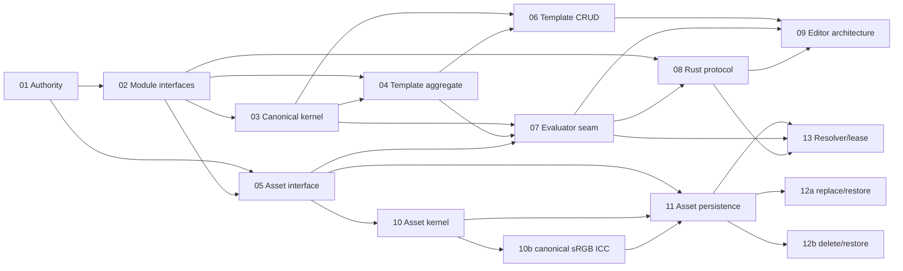

# RenderWeave Template v1 Implementation Plan

- 状态：`in_progress`；TV1-T01/T02/T03/T04/T05/T06/T10/T10b=`automated_verified`，下一 frontier TV1-T11
- 日期：2026-08-19
- Approved delta：[`specs/changes/20260817-template-v1-implementation-authority.md`](../specs/changes/20260817-template-v1-implementation-authority.md)
- Frozen checkpoint：`0b485f4a13de9d754a81d07f464730776e13c14b`
- Code base anchor：`main@7848c821aa9b809dd8cadb2b5e28f40f6947a90e`
- Tracker：`.scratch/renderweave-template-v1-implementation/map.md`
- Branch/worktree：`feature/template-v1` / adjacent isolated worktree；worktree-local `core.autocrlf=false`
- Lifecycle：整个 Template v1 仍为 `planned/in_progress`；Editor、Renderer 与 release 均未 READY

## 1. 四维执行配置

```text
规模：project
自主：copilot
风险：standard（外部授权、生产、真实数据、Renderer 认证等局部 guarded）
协作：single-writer
```

该 effort 跨 Java/Web/Rust、合同、数据库与浏览器验收，需要可恢复的长期 DAG。当前没有原子 claim、CI 分支
保护或 A3，因此不启用并发写入；Wayfinder 子票的 `Status`/`Claimed by` 是调度事实源。确定性且可逆的票据可在
已批准语义内连续推进；产品语义必变、新外部授权、真实数据、付费、生产或难恢复动作仍由人决定。

## 2. Harness 能力与保证上限

```yaml
capabilities:
  evidence_capture: tool
  atomic_claim: none
  blocking_permission: human
  independent_verify: limited
  isolated_workspace: available
binding: generic + project-local tools/run-gate.ps1 + Wayfinder markdown tracker
```

| 能力 | 当前事实 | 调度影响 |
|---|---|---|
| evidence capture | gate 捕获 revision、diff hash、输入 manifest、原始输出与 exit | 普通结果上限 A1 |
| independent verify | Editor/SPEC_REGISTRY 与部分既有视觉证据有独立 Python replay | 只在 exact 输入范围内记 A2，不外推产品 |
| isolated workspace | Template 使用相邻 worktree，dirty main 不参与写入 | 允许 `feature/template-v1` 单 writer |
| atomic claim | 无；Markdown claim 非原子 | 同时只 claim 一个 frontier ticket |
| external hard gate | 无 CI/branch protection | 不存在 A3；release 另需外部门控 |

## 3. Phase、增量与退出门

| Phase | Tickets | 可观察增量 | 退出门 |
|---|---|---|---|
| TV1-P0 Authority | 01 | 隔离分支、additive spec、LF authority、离线 static gate 与恢复边界 | G-TV1-AUTHORITY：`template` + `fast` + Git/product-surface audit；A1，registry 范围 A2 |
| TV1-P1 Kernel | 02 → 03 | deep interface/依赖 ADR 后，最小 DesignDSL canonical kernel 和独立 vectors | G-TV1-KERNEL：focused TDD + Java primary/Python replay + `template`；不得登记 partial Profile available |
| TV1-P2 Aggregates | 04、05、06 | Template/Asset interface 决策；随后仅实现 Template create/read/save PostgreSQL 纵切 | G-TV1-TEMPLATE：server/Testcontainers/OpenAPI + contract/full；无占位 Asset 产品 |
| TV1-P2b Asset slices | 10 → 11 → 12a → 12b、13 | Asset acceptance kernel、S3/PostgreSQL 持久化纵切、replace/delete/restore 与 Resolver/lease 纵切 | 逐票 gate：T10 kernel replay；T11 Testcontainers PostgreSQL+MinIO/OpenAPI；12b 依赖 Template 投影票；13 随 P3；gate 组成由各票冻结，不预建 |
| TV1-P3 Rendering seam | 07 → 08 | Evaluator/RenderDocument ownership 与独立 Rust process/certification protocol | G-TV1-RENDER-SEAM：closed protocol vectors、failure boundaries、supply-chain plan；不等于 Renderer READY |
| TV1-P4 Editor validation | 09 | 基于真实 Template/Rendering seam 的 throwaway Product Editor 状态原型结论 | G-TV1-EDITOR-ARCH：自动观察 A1/A2 + 人工 J1；不开放产品 route |
| TV1-P5+ Product completion | 待上述真实 seam 后另切票 | 完整 DSL、Asset、Evaluator、Renderer、Product Editor 与 formal registry records | 逐纵切 gate + product target/executor + J1/A3/物理 Linux 认证；当前未调度 |

## 4. 当前 ticket DAG



| Ticket | 类型 | 状态 | Blocked by | 本票退出事实 |
|---|---|---|---|---|
| 01 | task | `resolved` / `automated_verified` | none | 实施权威与反馈闭环；无产品代码 |
| 02 | grilling | `resolved` / `automated_verified` | 01 | ADR-0041、零 split package 与非空转 architecture test |
| 03 | task | `resolved` / `automated_verified` | 01, 02 | 最小 canonical kernel；TDD + independent replay |
| 04 | grilling | `resolved` / `automated_verified` | 02, 03 | ADR-0042 与 Template aggregate/persistence contract；无 migration |
| 05 | grilling | `resolved` / `automated_verified` | 01, 02 | ADR-0043 Asset admission/resolution deep interface 与 S3 Blob seam；无 Java/migration/route |
| 06 | task | `resolved` / `automated_verified` | 03, 04 | Template create/read/save PostgreSQL 纵切；V018 + OpenAPI 0.10.0 + Web SDK + `full` 15/15 |
| 07 | grilling | `open` | 03, 04, 05 | Evaluator/RenderDocument seam |
| 08 | grilling | `open` | 02, 07 | Rust process protocol与外部认证计划 |
| 09 | prototype | `open` | 06, 07, 08 | Editor 状态/恢复/预览架构验证；不进产品 route |
| 10 | task | `resolved` / `automated_verified` | 05 | Asset acceptance kernel；38 vectors Java/Python 38/38（A2）；`asset` gate 入 full |
| 10b | task | `resolved` / `automated_verified` | 10 | canonical sRGB ICC 字节等值接受原子；41 vectors Java/Python 41/41 |
| 11 | task | `open` | 05, 10, 10b | Asset create/current/catalog PostgreSQL+S3 纵切；V019 + OpenAPI/Web SDK + MinIO |
| 12a | task | `open` | 05, 11 | content replace/旧内容恢复 + 审计与 STALE 事实 |
| 12b | task | `open` | 05, 11, Template 依赖投影票 | delete/restore + AssetReferencePort/确认 token 编排 |
| 13 | task | `open` | 05, 07, 08, 11 | AssetResolver/Renderer-only lease 纵切 |

每次只 claim 一个 unblocked ticket；一票 resolved 后才由其 `Blocked by` 关系产生下一 frontier。未知实现切片留在
map 的 `Not yet specified`，不为排满计划提前发明接口、migration 或 Profile identity。

TV1-T10 与 TV1-T10b 已完成；TV1-T11（Asset persistence 纵切）成为唯一 unblocked frontier。TV1-T12b 另以
Template 依赖投影票（未建，随 DesignDSL full-Profile 拆分登记）为 blocker；TV1-T13 被 TV1-T07/T08/T11 阻塞。
single-writer 不顺带 claim 或预建 Asset persistence 之外的 surface。

## 5. TV1-T01 执行卡

- AC：AC-TV1-001..006。
- 允许影响：specs、governance、plans、tracker、frozen registry LF repair、gate scripts、evidence。
- 禁止影响：Java/Web/Rust 产品源码、OpenAPI、migration、产品 route/page/table、Profile available registration。
- 局部验证：PowerShell parse、frozen file hash、registry path/hash walker、product-surface inventory。
- 受影响验证：`tools/run-gate.ps1 -Gate template`、`-Gate fast`、`git diff --check`。
- 本票不运行：browser/E2E/runtime/Web service/J1/provider；`full` 已静态包含 template step，但不以本票越权启动。
- 保证等级：gate A1；SPEC_REGISTRY independent replay 对其 strict inputs 为 A2；无 A3/J1。
- 完成信号：Ticket 01 resolved、map 仅登记其上下文指针、Ticket 02 成为唯一 unblocked frontier、形成一个
  `agent-commit`，worktree clean；不 push/tag/PR。

## 6. TV1-T02 执行卡

- 决策：ADR-0041；provider-owned public contracts、consumer-owned reverse/Host/process Seams、单向 staged
  Maven graph、context-local closed outcomes 与 `api/spi/internal` ownership。
- 允许影响：ADR、CONTEXT/tracker/plan/log、architecture tests、app Adapter package 迁移及保证冻结 legacy
  resource checkout bytes 的 `.gitattributes`。
- 禁止影响：新 Template/Asset/Rendering artifact 或占位 Interface、DesignDSL/product API、migration、Web route、
  Rust wire、Profile registration、产品语义变化。
- 局部验证：Architecture 4/4、Validation PostgreSQL/API 3/3、legacy corpus identity 5/5。
- 受影响验证：完整 `server`、`template`、`fast` 与 `git diff --check`；不运行 browser/E2E/runtime/J1/provider。
- 保证等级：自动 gate A1；本票没有产品 execution-class A2、A3 或 J1。
- 完成信号：Ticket 02 resolved、ADR/CONTEXT/architecture gate 一致、零 split package、形成一个 verified
  `agent-commit` 且 worktree clean；不 push/tag/PR。

## 7. TV1-T03 执行卡

- 决策：新增首个真实 `renderweave-template` artifact；唯一 public top-level Interface 为
  `DesignDslAuthority.admit(rawUtf8)` closed outcome，Implementation 与 JSON model/canonical writer 全部 internal。
- 允许影响：root reactor、新 Template module、TDD/ArchUnit/public-surface tests、exact vector fixture、独立 Python
  replay、template/full gate composition、CONTEXT/tracker/plan/log/NOTES。
- 禁止影响：app wiring、OpenAPI、migration/table、Template/Asset aggregate、产品 route/page、Renderer/Rust、
  Profile available registration、DB/网络/浏览器/Web 服务/provider/J1。
- admission 原子：exact versions + root metadata + empty definitions + single Canvas + empty bindings/children；
  non-empty set/semantic arrays 以 `DESIGN_KERNEL_SCOPE_UNSUPPORTED` fail closed，不推断未知 wire。
- 局部验证：TDD red/green、Template module 17 tests、app architecture 4/4、Java primary/Python independent 33/33。
- 受影响验证：完整 `server`、`template`、`fast`、`git diff --check` 与 product-surface/Git audit；不运行
  browser/E2E/runtime/full/provider。
- 保证等级：Java/module/gate 为 A1；Python 对 exact manifest/Java report 的独立重放为 A2；无 A3/J1。
- 完成信号：Ticket 03 resolved/`automated_verified`、Profile 仍 `NOT_REGISTERED`、形成一个 verified
  `agent-commit` 且 implementation worktree clean；不 push/tag/PR。

## 8. TV1-T04 执行卡

- 决策：ADR-0042；一个 authoring `TemplateApplication`、专用 snapshot/reference provider Interfaces、
  Template-owned `OwnerScopeAuthority` 与 transaction-sized `TemplatePersistence` outbound seams。
- 允许影响：ADR、CONTEXT、tracker/plan/log/NOTES；只冻结 closed command/outcome、authority disclosure、
  aggregate/revision state、trusted read、confirmation 和 forward-only persistence/test invariants。
- 禁止影响：Java Interface/Implementation、POM dependency、OpenAPI、migration/table、route/page、Asset/
  Rendering product seam、Profile registration、DB/网络/浏览器/Provider/J1。
- T06 首个真实 surface 限于 create/current-read/save；copy/restore/delete/history/export/confirmation/snapshot/
  reference proof 只能与真实 consumer/behavior 同票进入，不能用 unsupported placeholder 预建。
- 局部验证：authority/ADR/CONTEXT cross-check、`git diff --check`、product-surface inventory。
- 受影响验证：`template` composite 与 `fast`；DesignDSL kernel/static authority 输入未改时必须 byte-identical。
- 保证等级：文档/静态 gate A1；既有 kernel/registry exact inputs 的 independent replay 仍只在原边界为 A2；
  本票没有 Template aggregate product execution、A3 或 J1。
- 完成信号：Ticket 04 resolved/`automated_verified`、ADR/CONTEXT/plan 一致、零新增 product surface，形成一个
  verified `agent-commit` 且 worktree clean；不 push/tag/PR。

## 9. TV1-T06 执行卡

- 决策：物化 ADR-0042 已冻结且真实接线的 Template create/current-read/save 纵切；`TemplateModule` 是 app 可
  import 的唯一 Template `.internal` assembly seam（ADR-0041 窄例外）。
- 允许影响：renderweave-template api/internal/spi、renderweave-schema `StaticSchemaAuthority`、
  renderweave-app Adapter/Controller/Config、V018 migration、OpenAPI/Web SDK、contract/public-surface/
  architecture/API/persistence 测试、E2E 清理加固、tracker/plan/log/NOTES/evidence。
- 禁止影响：Editor/Asset/Evaluator/Renderer 产品 surface、placeholder 表/接口/route、DesignDSL Profile
  available 注册、Workspace/org auth、付费 provider/真实数据。
- 局部验证：Template module contract/public-surface/architecture；app API permission/媒体类型/冲突、
  persistence same-hash 追加/并发只一胜/零部分写入/terminal DELETED；Testcontainers PostgreSQL。
- 受影响验证：`template`、`server`、`web` 与完整 `full` 15/15；draft-browser-e2e 与 inference-browser-e2e
  旅程和进程清理均通过（清理已加固为 CIM 瞬断可重试且不吞旅程结果）。
- 保证等级：自动 gate A1；kernel/registry exact replay 在原边界为 A2；无 A3/J1。
- 完成信号：Ticket 06 resolved/`automated_verified`、full gate 绿、形成 verified `agent-commit` 且 worktree
  clean；push 已获用户明确授权，在收口提交后执行（不建 tag/PR）。

## 10. TV1-T05 执行卡

- 决策：ADR-0043；renderweave-asset 三个 provider-owned Interface + `AssetPersistence`/`AssetBlobPersistence`
  SPI + Asset-owned Host facet；acceptance kernel 先行（独立 Python replay）；S3 协议 Blob seam（生产 OSS、
  本地与测试 MinIO、AWS SDK v2）；事务容量计数器；`AssetFetchEndpoint` Port；T10–T13 切片顺序。
- 允许影响：ADR、tracker/plan/log/NOTES、新票 T10–T13 登记、CONTEXT 术语核对。
- 禁止影响：Java/Web/Rust 产品源码、OpenAPI、migration、route/page、gate 组成、S3/MinIO/compose、AWS SDK
  依赖、Profile available 注册。
- 局部验证：ADR/tracker/plan/NOTES 交叉一致、`git diff --check`、product-surface inventory（零新增）。
- 受影响验证：`template` composite 与 `fast`（docs-only，输入未变复用已有绿）。
- 保证等级：文档/静态 gate A1；本票没有产品 execution-class A2、A3 或 J1。
- 完成信号：Ticket 05 resolved/`automated_verified`、T10 成为唯一 unblocked frontier、形成一个 verified
  `agent-commit` 且 worktree clean；push 待用户另行授权。

## 11. TV1-T10 执行卡

- 决策：ADR-0043 的 admission kernel 物化为 renderweave-asset 首个 artifact；唯一 public Interface
  `AssetAcceptanceAuthority.admit(rawBytes, kind)` closed union；PNG/JPEG/WebP/TTF/OTF 全切片；WebP 像素解码
  用 webp-imageio 0.2.0（libwebp 绑定，无纯 Java 替代）；38 冻结 vectors + `asset` gate（Java primary +
  Pillow/fontTools 独立重放 A2）纳入 `full`。
- 允许影响：root reactor、renderweave-asset 源码/测试/vectors、tools（ensure/generate/verify/run-asset-kernel-
  gate、run-gate 组成）、CONTEXT/tracker/plan/log/NOTES/evidence。
- 禁止影响：DB、网络、S3/MinIO、Template/Asset 聚合、产品 route/OpenAPI、acceptance Profile available
  注册、T11 的 Adapter/迁移。
- 局部验证：TDD red/green、module 53 tests、public-surface/ArchUnit 锁、冻结 vectors Java primary 重放。
- 受影响验证：`asset` composite（Java=38/38 Python=38/38，A2）与 `fast`；`full` 已含 asset-kernel-replay。
- 保证等级：gate A1；exact vectors 的独立 Python 重放为 A2；无 A3/J1。
- 完成信号：Ticket 10 resolved/`automated_verified`、T10b/T11 解锁、形成一个 verified `agent-commit` 且
  worktree clean；push 待用户另行授权。T10b（canonical sRGB ICC 等值原子）已并入本 kernel（41 vectors，
  Java/Python 41/41）。

## 12. Gate 与证据策略

`template` gate 顺序固定为 repository diff → DesignDSL kernel Java primary/Python independent exact-vector replay
→ 临时副本 Editor generator/independent/A2 → registry target refresh/Node primary/Python independent/A2 → 全树
byte comparison → frozen counts/readiness assertions。任何命令失败或相同输入生成 diff 都失败；仓库 authority
不被重写。kernel report 必须保持 33/33、Profile=`NOT_REGISTERED`；static replay 的冻结 counts 不变。

后续票据遵守 focused → affected → Phase → Goal。新增 Maven module、root POM、OpenAPI、lockfile、migration、
process protocol 或 `full` 组成变化属于共享面，必须提前扩大回归。自动 green 只把对应任务推进到
`automated_verified`；体验/业务选择是 J0/J1，独立机器 replay 是 A2，物理 Linux/CI policy 才可能形成外部门。

## 13. Version、恢复与熔断

- 每个已验证 Template ticket 在 `feature/template-v1` 独立提交；不 rewrite/cherry-pick 到 dirty main，不 push/tag/PR。
- Ticket 01/02 无数据或外部副作用，恢复为回退对应单一提交或删除新 worktree；不得用 `reset --hard` 清理用户 worktree。
- 后续 migration 一律 forward-only，只有真实纵切接线时选择当时下一个版本，并用 PostgreSQL/Testcontainers 验证。
- provider/API key/真实数据/生产权限默认关闭。Renderer 的 hermetic build、ELF closure、portable tricky-font 与
  双物理 Linux CPU-family pixel replay未完成前持续 fail-closed。
- 触发熔断：authority replay diff、产品语义冲突、依赖循环、test-only bypass、partial Profile availability、
  migration/route placeholder、越界外部副作用或 readiness 夸大。停止受影响票，保留证据；其他安全 frontier 继续。

## 14. 当前边界

- Ticket 19 保持 open；Capacity formal records=0。
- Formal Editor Case/Oracle=0/0；47 个 EditorContentSource slots 仅 1 exact、46 UNBOUND。
- Template/Editor/Renderer 未 READY；静态 replay 不等于产品执行、浏览器观察、人工验收或外部认证。
