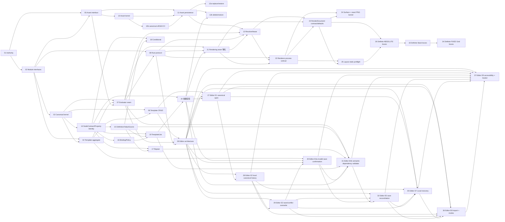

# RenderWeave Template v1 Implementation Plan

- 状态：`in_progress`；TV1-T01/T02/T03/T04/T05/T06/T07/T08/T09/T10/T10b/T11/T12a/T12b/T13/T14/T14b/T15/T16/T17/T18/T19/T20/T22=`automated_verified`
  （T09 另含人工 J1），TV1-T21=`automated_verified`（首个 Rendering 纵切——renderweave-rendering
  首个 artifact、TemplateClosureAuthority/Evaluator stage 1–8/seal、CapabilityState 加密落盘、
  RenderNodeContract 向量语料 Java primary、端到端 assembly 证明）；TV1-T13 已完成 AssetResolver、加密
  selection recovery record、Renderer-only signed fetch lease、内部 exact-byte endpoint 与 Rendering bridge。
  TV1-T22 已完成首个 Rust daemon/process protocol/manifest/replay 与 `render` gate 纵切；Profile 保持
  NOT_REGISTERED，raster 仍 ABSENT，物理 Linux/J1/A3 不在本票。TV1-T23=`resolved/automated_verified`：exact
  RenderDocument/default/lowering 与 Java/Rust/Python validator 已完成；TV1-T24=`resolved/automated_verified`：exact
  surface preflight + PNG encoder kernel 已完成，daemon 仍未接线、Profile NOT_REGISTERED、raster ABSENT；
  TV1-T25=`resolved/automated_verified`：Layout Profile 静态可判定预检与 daemon defensive admission 已完成；
  TV1-T26=`resolved/automated_verified`：资源无关 definite ABSOLUTE binary64 local-box kernel 已完成，不接
  daemon output，未产生 world scene 或注册 Profile；TV1-T27=`resolved/automated_verified`：Editor E1 canonical
  open、显式 readiness 重检与未发布三模式 Product shell；TV1-T28=`resolved/automated_verified`：Editor E2
  canonical working copy、有界结构化 undo/redo 与 preview eligibility guard；TV1-T29=`resolved/automated_verified`：
  Editor E3 lossless save、conflict overwrite 与 revision 漂移重确认均已完成；TV1-T30=`resolved/automated_verified`：
  Editor E4a 当前依赖面 bounded problems、invalid-save confirmation、snapshot fence 与 hard-error 零写均已完成；
  TV1-T31=`resolved/automated_verified`：Editor E4b StaticSchema field-path/loop lexical context 与 child PUBLIC fill
  semantic dependency validator 已完成；TV1-T32=`resolved/automated_verified`：Editor E5 outcome-unknown Save
  reconciliation、显式 exact retry、锁纪律与 bare draft export 已完成；
  TV1-T33=`resolved/automated_verified`：资源无关 definite Stack/STACK child 的非 water-fill binary64 layout
  子闭包已完成；TV1-T34=`resolved/automated_verified`：ContentBox floor-zero 与 FIXED-track definite Grid 已完成；
  TV1-T35=`resolved/automated_verified`：Editor E7 versioned Local recovery、显式恢复/导出/放弃、漂移确认与
  outcome-unknown 跨刷新只读 reconciliation 已完成；TV1-T36=`resolved/automated_verified`：Editor E8 严格本地
  导入、Raw Repair/Compatibility 与 dirty replacement guard 已完成；TV1-T37=`resolved/automated_verified`：
  Editor E9 严格问题投影、摘要 focus、键盘树、最小 live delta 与有效宽度浏览器证据已完成；真实 200% zoom/
  人工 keyboard J1 pending，E6 仍受真实 Renderer output/public preview seam 阻塞
- 日期：2026-08-20
- Approved delta：[`specs/changes/20260817-template-v1-implementation-authority.md`](../specs/changes/20260817-template-v1-implementation-authority.md)
- Frozen checkpoint：`0b485f4a13de9d754a81d07f464730776e13c14b`
- Code base anchor：`main@7848c821aa9b809dd8cadb2b5e28f40f6947a90e`
- Tracker：`.scratch/renderweave-template-v1-implementation/map.md`
- Branch/worktree：`feature/template-v1` / adjacent isolated worktree；worktree-local `core.autocrlf=false`
- Lifecycle：整个 Template v1 仍为 `planned/in_progress`；Editor、Renderer 与 release 均未 READY

## 1. 四维执行配置

```text
规模：project
自主：copilot
风险：standard（外部授权、生产、真实数据、Renderer 认证等局部 guarded）
协作：single-writer
```

该 effort 跨 Java/Web/Rust、合同、数据库与浏览器验收，需要可恢复的长期 DAG。当前没有原子 claim、CI 分支
保护或 A3，因此不启用并发写入；Wayfinder 子票的 `Status`/`Claimed by` 是调度事实源。确定性且可逆的票据可在
已批准语义内连续推进；产品语义必变、新外部授权、真实数据、付费、生产或难恢复动作仍由人决定。

## 2. Harness 能力与保证上限

```yaml
capabilities:
  evidence_capture: tool
  atomic_claim: none
  blocking_permission: human
  independent_verify: limited
  isolated_workspace: available
binding: generic + project-local tools/run-gate.ps1 + Wayfinder markdown tracker
```

| 能力 | 当前事实 | 调度影响 |
|---|---|---|
| evidence capture | gate 捕获 revision、diff hash、输入 manifest、原始输出与 exit | 普通结果上限 A1 |
| independent verify | Editor/SPEC_REGISTRY 与部分既有视觉证据有独立 Python replay | 只在 exact 输入范围内记 A2，不外推产品 |
| isolated workspace | Template 使用相邻 worktree，dirty main 不参与写入 | 允许 `feature/template-v1` 单 writer |
| atomic claim | 无；Markdown claim 非原子 | 同时只 claim 一个 frontier ticket |
| external hard gate | 无 CI/branch protection | 不存在 A3；release 另需外部门控 |

## 3. Phase、增量与退出门

| Phase | Tickets | 可观察增量 | 退出门 |
|---|---|---|---|
| TV1-P0 Authority | 01 | 隔离分支、additive spec、LF authority、离线 static gate 与恢复边界 | G-TV1-AUTHORITY：`template` + `fast` + Git/product-surface audit；A1，registry 范围 A2 |
| TV1-P1 Kernel | 02 → 03 | deep interface/依赖 ADR 后，最小 DesignDSL canonical kernel 和独立 vectors | G-TV1-KERNEL：focused TDD + Java primary/Python replay + `template`；不得登记 partial Profile available |
| TV1-P2 Aggregates | 04、05、06 | Template/Asset interface 决策；随后仅实现 Template create/read/save PostgreSQL 纵切 | G-TV1-TEMPLATE：server/Testcontainers/OpenAPI + contract/full；无占位 Asset 产品 |
| TV1-P2b Asset slices | 10 → 11 → 12a → 12b、13 | Asset acceptance kernel、S3/PostgreSQL 持久化纵切、replace/delete/restore 与 Resolver/lease 纵切 | 逐票 gate：T10 kernel replay；T11 Testcontainers PostgreSQL+MinIO/OpenAPI；12b 依赖 Template 投影票；13 随 P3；gate 组成由各票冻结，不预建 |
| TV1-P2c DesignDSL full-Profile atoms | 14 → 15/16 → 17/18 → 19 → 20 | NodeContract/Property Identity、Definition、Binding、Repeat、Conditional、TemplateUse 的静态 admission/canonical 原子与 Template 依赖投影 | 逐票 exact vectors + template gate 扩展；全部语义原子通过前 Profile 不登记 available |
| TV1-P3 Rendering seam | 07 → 08 | Evaluator/RenderDocument ownership 与独立 Rust process/certification protocol | G-TV1-RENDER-SEAM：closed protocol vectors、failure boundaries、supply-chain plan；不等于 Renderer READY |
| TV1-P4 Editor validation | 09 | 基于真实 Template/Rendering seam 的 throwaway Product Editor 状态原型结论 | G-TV1-EDITOR-ARCH：自动观察 A1/A2 + 人工 J1；不开放产品 route |
| TV1-P5a Renderer process | 22 | Rust UDS daemon、Java process Adapter、machine manifest、跨语言 replay 与 `render` gate | 协议纵切 A1/A2；Profile NOT_REGISTERED；不等于 raster/物理 Linux certification |
| TV1-P5b Document handoff | 23 | exact RenderDocument/default/lowering + Java/Rust/Python validator | 文档合同 A1/A2；Profile 仍 NOT_REGISTERED；无 layout/raster |
| TV1-P5c Exact PNG kernel | 24 | Canvas/bleed/DPI surface preflight + byte-exact PNG encoder | Rust/Python exact-vector A1/A2；不接线 daemon、不注册 Profile、raster ABSENT |
| TV1-P5d Layout static preflight | 25 | exact RenderDocument 上的 size/cycle/Stack/Grid/Text/QR 静态约束 deep kernel | Rust/Python exact-vector A1/A2 + daemon defensive admission；无 measure/arrange/Profile/RESULT |
| TV1-P5e Definite local boxes | 26 | Canvas→Frame/无资源叶子的 FIXED/FILL + ABSOLUTE binary64 local LayoutBox/ContentBox | Rust/Python exact-bit A1/A2；unsupported 不外泄；无 HUG/Stack/Grid/resource/world scene/RESULT |
| TV1-P5f Definite Stack boxes | 33 | definite Stack + STACK child 的 margin/gap/justify/cross-axis arrange | Rust/Python exact-bit A1/A2；main-axis FILL/HUG fail closed；无 scene/resource/RESULT |
| TV1-P5g Definite FIXED Grid boxes | 34 | ContentBox floor-zero + FIXED-track Grid/GRID child arrange | Rust/Python exact-bit A1/A2；AUTO/FRACTION/HUG fail closed；无 scene/resource/RESULT |
| TV1-P6a Editor E1 | 27 | trusted canonical current baseline + 显式 readiness recheck + 三模式 Canvas Focus shell | Java/Web/OpenAPI A1；组件未发布，禁止 save/preview/recovery 占位与 READY 声明 |
| TV1-P6b Editor E2 | 28 | canonical working copy + 结构化本地编辑/undo/redo + preview generation/eligibility guard | Node 24 Web A1；无 API/route/save/preview action，baseline immutable |
| TV1-P6c Editor E3 | 29 | lossless save + conflict overwrite offer/confirm/reconfirm + conservative unknown lock | Node 24 Web A1；复用既有 API；无 E4–E9/route/reconciliation |
| TV1-P6d Editor E4a | 30 | T20 AssetRef/TemplateRef bounded dependency problems + invalid-save confirmation + hard zero-write | Java/PostgreSQL/OpenAPI/Node 24 Web A1；完整 field-path/child-fill validator 与 E5–E9 另切 |
| TV1-P6e Editor E4b | 31 | StaticSchema field-path/type/presence、loop lexical context、TemplateUse exact Schema 与 PUBLIC fill validator | Java/Schema/PostgreSQL A1；复用 0.15.0 generic problem/confirmation，无 migration/API/route；E5–E9 另切 |
| TV1-P6f Editor E5 | 32 | outcome-unknown attempt + trusted-current 五分类 reconciliation + exact explicit retry/lock/export | Node 24 Web A1；复用 GET/PUT/410，无 Java/API/migration/route；E6–E9 另切 |
| TV1-P6g Editor E7 | 35 | versioned per-Template Local recovery + 7-day lifecycle + explicit restore/export/discard + cross-refresh reconciliation | Node 24 Web A1；浏览器 best-effort，不同步/不自动提交；无 Java/API/migration/route |
| TV1-P6h Editor E8 | 36 | strict local import + Raw Repair/Compatibility + shared dirty replacement guard | Node 24 Web A1；文件 identity/schema 不覆盖目标；无 registered migration profile/action、API/route |
| TV1-P6i Editor E9 | 37 | strict problem projection + summary focus + roving tree/live delta + 1024/1280/1440/200% effective viewport | Node 24 Web + Playwright/axe A1；无 route/E6；人工 keyboard/zoom J1 pending |
| TV1-P6+ Product completion | 33 后按真实依赖另切票 | 完整 Renderer layout/resource/raster/JPEG/Engine output、公开产品面、Editor E6 与 formal registry records | 逐纵切 gate + product target/executor + J1/A3/物理 Linux 认证；不预建未知下游票 |

## 4. 当前 ticket DAG



| Ticket | 类型 | 状态 | Blocked by | 本票退出事实 |
|---|---|---|---|---|
| 01 | task | `resolved` / `automated_verified` | none | 实施权威与反馈闭环；无产品代码 |
| 02 | grilling | `resolved` / `automated_verified` | 01 | ADR-0041、零 split package 与非空转 architecture test |
| 03 | task | `resolved` / `automated_verified` | 01, 02 | 最小 canonical kernel；TDD + independent replay |
| 04 | grilling | `resolved` / `automated_verified` | 02, 03 | ADR-0042 与 Template aggregate/persistence contract；无 migration |
| 05 | grilling | `resolved` / `automated_verified` | 01, 02 | ADR-0043 Asset admission/resolution deep interface 与 S3 Blob seam；无 Java/migration/route |
| 06 | task | `resolved` / `automated_verified` | 03, 04 | Template create/read/save PostgreSQL 纵切；V018 + OpenAPI 0.10.0 + Web SDK + `full` 15/15 |
| 07 | grilling | `resolved` / `automated_verified` | 03, 04, 05 | ADR-0044：closure authority/Evaluator/RenderOutput/CapabilityStateStore/RenderEngine port/语料纪律与 T08 边界 |
| 08 | grilling | `resolved` / `automated_verified` | 02, 07 | ADR-0045：常驻 daemon/UDS 帧协议/registry/fetch/cancel/构建与四级认证计划 |
| 09 | prototype | `resolved` / `automated_verified`（J1） | 06, 07, 08 | throwaway 状态机原型 10 场景 37/37 断言 + 人工 J1；Verdict 与 E1–E9 纵切分解 |
| 10 | task | `resolved` / `automated_verified` | 05 | Asset acceptance kernel；38 vectors Java/Python 38/38（A2）；`asset` gate 入 full |
| 10b | task | `resolved` / `automated_verified` | 10 | canonical sRGB ICC 字节等值接受原子；41 vectors Java/Python 41/41 |
| 11 | task | `resolved` / `automated_verified` | 05, 10, 10b | Asset create/current/catalog PostgreSQL+S3 纵切；V019 + OpenAPI 0.11.0/Web SDK + MinIO + `full` 15/15 |
| 12a | task | `resolved` / `automated_verified` | 05, 11 | content replace/旧内容恢复；V020 审计事件 + OpenAPI 0.12.0 + `full` 16/16 |
| 12b | task | `resolved` / `automated_verified` | 05, 11, 20 | delete/restore + AssetReferencePort/确认 token 编排 |
| 13 | task | `resolved` / `automated_verified` | 05, 07, 08, 11, 21 | AssetResolver + 加密 selection recovery + Renderer-only signed fetch lease + Rendering bridge；V024 |
| 14 | task | `resolved` | 03 | NodeContractCatalog 与 Node/Property Identity 原子（容器增量：canvas/group/frame/stack/grid 递归 admission/canonical，manifest v2 57 vectors） |
| 14b | task | `resolved` | 03, 14 | visual leaf Node kinds（text/image/rect/ellipse/line/polygon/polyline/path/qrCode/barcode）与 BindingPolicyCatalog 基础登记，manifest v5 152 vectors |
| 15 | task | `resolved` | 03, 14 | Definition/ValueSource 原子（custom/mapping/expression + lexical domains，manifest v3 94 vectors） |
| 16 | task | `resolved` | 03, 14 | Binding 与 BindingPolicyCatalog 原子（manifest v6 176 vectors） |
| 17 | task | `resolved` | 03, 14, 15 | Repeat 原子（items/PACK/packing/loopId，manifest v4 116 vectors） |
| 18 | task | `resolved` | 03, 14, 15 | Conditional 原子（condition/absent policy/剪枝，manifest v8 211 vectors） |
| 19 | task | `resolved` | 03, 14, 15, 16 | TemplateUse 原子（ContextSelector/fills/closure 边，manifest v7 197 vectors） |
| 20 | task | `resolved` / `automated_verified` | 04, 05, 14, 19 | Template 依赖投影（AssetRef/反向索引/STALE 消费）；T12b 的 blocker |
| 21 | task | `resolved` / `automated_verified` | 07, 08, 20 | 首个 Rendering 纵切：TemplateClosureAuthority/Evaluator stage 1–8/seal + RenderNodeContractCatalog 与向量语料（Java primary）；V023 + app Adapter；无公开 route |
| 22 | task | `resolved` / `automated_verified` | 08, 13, 21 | Rust UDS daemon + strict frame/manifest/registry + Java process Adapter + Java/Rust/Python/Linux replay；`render` gate 入 full；Profile NOT_REGISTERED |
| 23 | task | `resolved` / `automated_verified` | 13, 21, 22 | exact RenderDocument catalog/default/lowering + Java/Rust/Python validator；无 layout/raster/Profile registration |
| 24 | task | `resolved` / `automated_verified` | 22, 23 | exact surface preflight + PNG encoder kernel；daemon 未接线、Profile NOT_REGISTERED、raster ABSENT |
| 25 | task | `resolved` / `automated_verified` | 22, 23 | static layout constraints deep kernel + daemon defensive admission；无 measure/arrange/Profile/RESULT |
| 26 | task | `resolved` / `automated_verified` | 23, 25 | resource-free definite ABSOLUTE binary64 local boxes；无 daemon success/Profile |
| 27 | task | `resolved` / `automated_verified` | 06, 09, 20 | canonical baseline + 显式 readiness recheck + 未发布三模式 Product shell；无 save/preview/recovery/route |
| 28 | task | `resolved` / `automated_verified` | 09, 27 | canonical working copy + 结构化 name edit/undo/redo + preview generation/eligibility guard；Node 24 Web/Fast/Full 17/17 |
| 29 | task | `resolved` / `automated_verified` | 09, 28 | lossless expectedRevision save + conflict overwrite confirm/reconfirm；Node 24 Web/Fast/Full 17/17，unknown 保守锁定，无 E5 reconciliation |
| 30 | task | `resolved` / `automated_verified` | 04, 09, 20, 29 | 当前 AssetRef/TemplateRef dependency surface 的 bounded problems + 5 分钟 invalid-save confirmation + SERIALIZABLE snapshot fence/hard zero-write；完整 field-path/child-fill validator 另切 |
| 31 | task | `resolved` / `automated_verified` | 07, 15, 17, 19, 20, 30 | StaticSchema field-path/type/presence、loop lexical context 与 TemplateUse exact Schema/PUBLIC fill 语义依赖校验；复用 T30 confirmation/fence，无 API/migration/route |
| 32 | task | `resolved` / `automated_verified` | 09, 29, 30, 31 | outcome-unknown attempt + trusted-current adopted/retryable/conflict/deleted/fail-closed；Web-only，无 API/migration/route |
| 33 | task | `resolved` / `automated_verified` | 23, 25, 26 | definite Stack 非 water-fill arrange；Rust/Python 31/31、97 checks；HUG/main-axis FILL 与 scene/raster/RESULT 保持 fail closed |
| 34 | task | `resolved` / `automated_verified` | 23, 25, 26, 33 | ContentBox floor-zero + FIXED-track definite Grid；Rust/Python 34/34、105 checks；AUTO/FRACTION/HUG fail closed |
| 35 | task | `resolved` / `automated_verified` | 09, 27, 28, 29, 32 | Web-only Local recovery 生命周期与 E5 unknown 跨刷新 reconciliation；无 route/API/migration |
| 36 | task | `resolved` / `automated_verified` | 09, 27, 28, 29, 32, 35 | Web-only strict local import、Raw Repair/Compatibility 与 dirty replacement guard；无 API/route/migration action |
| 37 | task | `resolved` / `automated_verified` | 09, 27, 28, 30, 31, 32, 35, 36 | Web-only strict problem projection、keyboard/live-region 与有效宽度浏览器证据；Web 212、E2E 23/1 skip；无 route/E6；J1 pending |

每次只 claim 一个 unblocked ticket；一票 resolved 后才由其 `Blocked by` 关系产生下一 frontier。未知实现切片留在
map 的 `Not yet specified`，不为排满计划提前发明接口、migration 或 Profile identity。

TV1-T07/T08/T09 已 resolve（ADR-0044/0045 与 Editor 状态原型，T09 含人工 J1）；TV1-T14 容器增量已
resolve（NodeContractCatalog + 递归容器 admission/canonical，manifest v2 57 vectors）；TV1-T14b visual
leaf kinds 与 BindingPolicyCatalog 基础登记已 resolve（manifest v5 152 vectors）；TV1-T15
Definition/ValueSource 原子已 resolve（manifest v3 94 vectors）；TV1-T17 Repeat 原子已 resolve（PACK
placement + loopId namespace + RepeatPackingSpec，manifest v4 116 vectors）；TV1-T16 Binding 与
BindingPolicyCatalog 消费已 resolve（manifest v6 176 vectors）；TV1-T19 TemplateUse 原子已 resolve
（manifest v7 197 vectors）；TV1-T18 Conditional 原子已 resolve（manifest v8 211 vectors——v1 全部
kind 已 admission，Java/Python 211/211，Profile 仍 NOT_REGISTERED）；TV1-T20（Template 依赖投影，
T12b 的 blocker）已 resolve（AssetRef/TemplateUse 原子提取 + current-only 投影物化 + 反向 proof +
STALE 消费 + readiness recheck，template gate 含 A2 提取重放，V021）；TV1-T12b（被引用 Asset 删除
确认与恢复编排）已 resolve（AssetReferencePort 桥接 + 5 分钟单次确认 token + 独占 reservation 零写
重验 + 软删除/恢复 + assetId 排序读 reservation，V022 + OpenAPI 0.13.0 + Web SDK）；首个 Rendering
实现票 TV1-T21 已 resolve（renderweave-rendering 首个 artifact：TemplateClosureAuthority/
Evaluator stage 1–8/seal + RenderNodeContract 向量语料 Java primary + CapabilityState 加密落盘 +
端到端 assembly 证明）；TV1-T13（AssetResolver/Renderer-only lease 纵切）已 resolve（单事务 selection
幂等 + AES-GCM recovery record + signed internal exact-byte fetch + Rendering bridge，V024）；TV1-T22 已
resolve（offline Cargo workspace + Linux UDS daemon + strict frame/manifest/registry + Java process Adapter/
Supervisor + Java/Rust/Python/Linux replay，`render` 已入 17-step `full`）。TV1-T23 已 resolve：同一 catalog
  驱动 Java default/lowering，Rust daemon 在 Profile lookup 前独立验证 exact document，Python 再以标准库重放
  共同语料，Rust Engine 不再需要猜测 DesignDSL default。TV1-T24 也已 resolve（exact surface/PNG kernel）；
  T25 static layout preflight 与 T26 definite ABSOLUTE local-box kernel 现均已 resolve；仍未预建公开 render
  route、tolerance-dependent HUG/Stack/Grid、resource/raster/JPEG/daemon output Profile。TV1-T27 已从
  Editor E1–E9 中单独登记并完成；TV1-T28 也已从 E2 frontier 单独登记并完成；TV1-T29 已从 E3 save +
  conflict overwrite frontier 单独登记并完成。TV1-T30 已从 E4 拆出当前真实 dependency surface 的 E4a 并完成；
  TV1-T31 已完成 field-path/child-fill semantic dependency validator。产品 route 仍待后续闭环，
  不在 E1–E4 提前开放。

## 5. TV1-T01 执行卡

- AC：AC-TV1-001..006。
- 允许影响：specs、governance、plans、tracker、frozen registry LF repair、gate scripts、evidence。
- 禁止影响：Java/Web/Rust 产品源码、OpenAPI、migration、产品 route/page/table、Profile available registration。
- 局部验证：PowerShell parse、frozen file hash、registry path/hash walker、product-surface inventory。
- 受影响验证：`tools/run-gate.ps1 -Gate template`、`-Gate fast`、`git diff --check`。
- 本票不运行：browser/E2E/runtime/Web service/J1/provider；`full` 已静态包含 template step，但不以本票越权启动。
- 保证等级：gate A1；SPEC_REGISTRY independent replay 对其 strict inputs 为 A2；无 A3/J1。
- 完成信号：Ticket 01 resolved、map 仅登记其上下文指针、Ticket 02 成为唯一 unblocked frontier、形成一个
  `agent-commit`，worktree clean；不 push/tag/PR。

## 6. TV1-T02 执行卡

- 决策：ADR-0041；provider-owned public contracts、consumer-owned reverse/Host/process Seams、单向 staged
  Maven graph、context-local closed outcomes 与 `api/spi/internal` ownership。
- 允许影响：ADR、CONTEXT/tracker/plan/log、architecture tests、app Adapter package 迁移及保证冻结 legacy
  resource checkout bytes 的 `.gitattributes`。
- 禁止影响：新 Template/Asset/Rendering artifact 或占位 Interface、DesignDSL/product API、migration、Web route、
  Rust wire、Profile registration、产品语义变化。
- 局部验证：Architecture 4/4、Validation PostgreSQL/API 3/3、legacy corpus identity 5/5。
- 受影响验证：完整 `server`、`template`、`fast` 与 `git diff --check`；不运行 browser/E2E/runtime/J1/provider。
- 保证等级：自动 gate A1；本票没有产品 execution-class A2、A3 或 J1。
- 完成信号：Ticket 02 resolved、ADR/CONTEXT/architecture gate 一致、零 split package、形成一个 verified
  `agent-commit` 且 worktree clean；不 push/tag/PR。

## 7. TV1-T03 执行卡

- 决策：新增首个真实 `renderweave-template` artifact；唯一 public top-level Interface 为
  `DesignDslAuthority.admit(rawUtf8)` closed outcome，Implementation 与 JSON model/canonical writer 全部 internal。
- 允许影响：root reactor、新 Template module、TDD/ArchUnit/public-surface tests、exact vector fixture、独立 Python
  replay、template/full gate composition、CONTEXT/tracker/plan/log/NOTES。
- 禁止影响：app wiring、OpenAPI、migration/table、Template/Asset aggregate、产品 route/page、Renderer/Rust、
  Profile available registration、DB/网络/浏览器/Web 服务/provider/J1。
- admission 原子：exact versions + root metadata + empty definitions + single Canvas + empty bindings/children；
  non-empty set/semantic arrays 以 `DESIGN_KERNEL_SCOPE_UNSUPPORTED` fail closed，不推断未知 wire。
- 局部验证：TDD red/green、Template module 17 tests、app architecture 4/4、Java primary/Python independent 33/33。
- 受影响验证：完整 `server`、`template`、`fast`、`git diff --check` 与 product-surface/Git audit；不运行
  browser/E2E/runtime/full/provider。
- 保证等级：Java/module/gate 为 A1；Python 对 exact manifest/Java report 的独立重放为 A2；无 A3/J1。
- 完成信号：Ticket 03 resolved/`automated_verified`、Profile 仍 `NOT_REGISTERED`、形成一个 verified
  `agent-commit` 且 implementation worktree clean；不 push/tag/PR。

## 8. TV1-T04 执行卡

- 决策：ADR-0042；一个 authoring `TemplateApplication`、专用 snapshot/reference provider Interfaces、
  Template-owned `OwnerScopeAuthority` 与 transaction-sized `TemplatePersistence` outbound seams。
- 允许影响：ADR、CONTEXT、tracker/plan/log/NOTES；只冻结 closed command/outcome、authority disclosure、
  aggregate/revision state、trusted read、confirmation 和 forward-only persistence/test invariants。
- 禁止影响：Java Interface/Implementation、POM dependency、OpenAPI、migration/table、route/page、Asset/
  Rendering product seam、Profile registration、DB/网络/浏览器/Provider/J1。
- T06 首个真实 surface 限于 create/current-read/save；copy/restore/delete/history/export/confirmation/snapshot/
  reference proof 只能与真实 consumer/behavior 同票进入，不能用 unsupported placeholder 预建。
- 局部验证：authority/ADR/CONTEXT cross-check、`git diff --check`、product-surface inventory。
- 受影响验证：`template` composite 与 `fast`；DesignDSL kernel/static authority 输入未改时必须 byte-identical。
- 保证等级：文档/静态 gate A1；既有 kernel/registry exact inputs 的 independent replay 仍只在原边界为 A2；
  本票没有 Template aggregate product execution、A3 或 J1。
- 完成信号：Ticket 04 resolved/`automated_verified`、ADR/CONTEXT/plan 一致、零新增 product surface，形成一个
  verified `agent-commit` 且 worktree clean；不 push/tag/PR。

## 9. TV1-T06 执行卡

- 决策：物化 ADR-0042 已冻结且真实接线的 Template create/current-read/save 纵切；`TemplateModule` 是 app 可
  import 的唯一 Template `.internal` assembly seam（ADR-0041 窄例外）。
- 允许影响：renderweave-template api/internal/spi、renderweave-schema `StaticSchemaAuthority`、
  renderweave-app Adapter/Controller/Config、V018 migration、OpenAPI/Web SDK、contract/public-surface/
  architecture/API/persistence 测试、E2E 清理加固、tracker/plan/log/NOTES/evidence。
- 禁止影响：Editor/Asset/Evaluator/Renderer 产品 surface、placeholder 表/接口/route、DesignDSL Profile
  available 注册、Workspace/org auth、付费 provider/真实数据。
- 局部验证：Template module contract/public-surface/architecture；app API permission/媒体类型/冲突、
  persistence same-hash 追加/并发只一胜/零部分写入/terminal DELETED；Testcontainers PostgreSQL。
- 受影响验证：`template`、`server`、`web` 与完整 `full` 15/15；draft-browser-e2e 与 inference-browser-e2e
  旅程和进程清理均通过（清理已加固为 CIM 瞬断可重试且不吞旅程结果）。
- 保证等级：自动 gate A1；kernel/registry exact replay 在原边界为 A2；无 A3/J1。
- 完成信号：Ticket 06 resolved/`automated_verified`、full gate 绿、形成 verified `agent-commit` 且 worktree
  clean；push 已获用户明确授权，在收口提交后执行（不建 tag/PR）。

## 10. TV1-T05 执行卡

- 决策：ADR-0043；renderweave-asset 三个 provider-owned Interface + `AssetPersistence`/`AssetBlobPersistence`
  SPI + Asset-owned Host facet；acceptance kernel 先行（独立 Python replay）；S3 协议 Blob seam（生产 OSS、
  本地与测试 MinIO、AWS SDK v2）；事务容量计数器；`AssetFetchEndpoint` Port；T10–T13 切片顺序。
- 允许影响：ADR、tracker/plan/log/NOTES、新票 T10–T13 登记、CONTEXT 术语核对。
- 禁止影响：Java/Web/Rust 产品源码、OpenAPI、migration、route/page、gate 组成、S3/MinIO/compose、AWS SDK
  依赖、Profile available 注册。
- 局部验证：ADR/tracker/plan/NOTES 交叉一致、`git diff --check`、product-surface inventory（零新增）。
- 受影响验证：`template` composite 与 `fast`（docs-only，输入未变复用已有绿）。
- 保证等级：文档/静态 gate A1；本票没有产品 execution-class A2、A3 或 J1。
- 完成信号：Ticket 05 resolved/`automated_verified`、T10 成为唯一 unblocked frontier、形成一个 verified
  `agent-commit` 且 worktree clean；push 待用户另行授权。

## 11. TV1-T10 执行卡

- 决策：ADR-0043 的 admission kernel 物化为 renderweave-asset 首个 artifact；唯一 public Interface
  `AssetAcceptanceAuthority.admit(rawBytes, kind)` closed union；PNG/JPEG/WebP/TTF/OTF 全切片；WebP 像素解码
  用 webp-imageio 0.2.0（libwebp 绑定，无纯 Java 替代）；38 冻结 vectors + `asset` gate（Java primary +
  Pillow/fontTools 独立重放 A2）纳入 `full`。
- 允许影响：root reactor、renderweave-asset 源码/测试/vectors、tools（ensure/generate/verify/run-asset-kernel-
  gate、run-gate 组成）、CONTEXT/tracker/plan/log/NOTES/evidence。
- 禁止影响：DB、网络、S3/MinIO、Template/Asset 聚合、产品 route/OpenAPI、acceptance Profile available
  注册、T11 的 Adapter/迁移。
- 局部验证：TDD red/green、module 53 tests、public-surface/ArchUnit 锁、冻结 vectors Java primary 重放。
- 受影响验证：`asset` composite（Java=38/38 Python=38/38，A2）与 `fast`；`full` 已含 asset-kernel-replay。
- 保证等级：gate A1；exact vectors 的独立 Python 重放为 A2；无 A3/J1。
- 完成信号：Ticket 10 resolved/`automated_verified`、T10b/T11 解锁、形成一个 verified `agent-commit` 且
  worktree clean；push 待用户另行授权。T10b（canonical sRGB ICC 等值原子）已并入本 kernel（41 vectors，
  Java/Python 41/41）。

## 12. Gate 与证据策略

`template` gate 顺序固定为 repository diff → DesignDSL kernel Java primary/Python independent exact-vector replay
（T20 起追加 AssetRef/TemplateUse 依赖投影提取的 Java primary/Python independent exact-fixture replay）
→ 临时副本 Editor generator/independent/A2 → registry target refresh/Node primary/Python independent/A2 → 全树
byte comparison → frozen counts/readiness assertions。任何命令失败或相同输入生成 diff 都失败；仓库 authority
不被重写。kernel report 必须保持 211/211（vectorVersion `renderweave-template-canonical-kernel-v1/8`，
v1 全部 DesignDSL kind 已 admission——容器、visual leaves、Definition/ValueSource、Repeat/PACK、
Binding、TemplateUse 与 Conditional）、Profile=`NOT_REGISTERED`；static replay 的冻结 counts 不变。

后续票据遵守 focused → affected → Phase → Goal。新增 Maven module、root POM、OpenAPI、lockfile、migration、
process protocol 或 `full` 组成变化属于共享面，必须提前扩大回归。自动 green 只把对应任务推进到
`automated_verified`；体验/业务选择是 J0/J1，独立机器 replay 是 A2，物理 Linux/CI policy 才可能形成外部门。

## 13. Version、恢复与熔断

- 每个已验证 Template ticket 在 `feature/template-v1` 独立提交；不 rewrite/cherry-pick 到 dirty main，不 push/tag/PR。
- Ticket 01/02 无数据或外部副作用，恢复为回退对应单一提交或删除新 worktree；不得用 `reset --hard` 清理用户 worktree。
- 后续 migration 一律 forward-only，只有真实纵切接线时选择当时下一个版本，并用 PostgreSQL/Testcontainers 验证。
- provider/API key/真实数据/生产权限默认关闭。Renderer 的 hermetic build、ELF closure、portable tricky-font 与
  双物理 Linux CPU-family pixel replay未完成前持续 fail-closed。
- 触发熔断：authority replay diff、产品语义冲突、依赖循环、test-only bypass、partial Profile availability、
  migration/route placeholder、越界外部副作用或 readiness 夸大。停止受影响票，保留证据；其他安全 frontier 继续。

## 14. 当前边界

- Ticket 19 保持 open；Capacity formal records=0。
- Formal Editor Case/Oracle=0/0；47 个 EditorContentSource slots 仅 1 exact、46 UNBOUND。
- Template/Editor/Renderer 未 READY；静态 replay 不等于产品执行、浏览器观察、人工验收或外部认证。

## 15. TV1-T11 执行卡

- 决策：物化 ADR-0043 冻结的 Asset create/current/catalog 纵切；`AssetModule` 是 app 可 import 的唯一
  Asset `.internal` assembly seam（与 `TemplateModule` 同为 ADR-0041 窄例外）。
- 允许影响：renderweave-asset api/internal/spi、renderweave-app Adapter/Controller/Config、V019 migration、
  OpenAPI/Web SDK（0.11.0）、compose.yaml（minio + minio-init + api env）、multipart transport 上限与
  inference app 层权威预算、contract/public-surface/architecture/API/persistence 测试、
  tracker/plan/log/NOTES/evidence。
- 禁止影响：replace/delete/restore、AssetResolver/lease、Asset UI、placeholder 表/接口/route、
  acceptance Profile available 注册、Template/Evaluator/Renderer surface、付费 provider/真实数据。
- 局部验证：Asset module contract/public-surface/architecture；app HTTP API（multipart 幂等 create、
  catalog 过滤与稳定游标、metadata 409、versions/download/preview、problem 面、无效请求零写入）、
  persistence（幂等 replay/conflict、容量水位、零部分写入）、fail-closed 不装配；Testcontainers
  PostgreSQL+MinIO。
- 受影响验证：`asset`、`server`、`web` 与完整 `full` 16/16；draft/inference browser E2E 旅程与进程清理
  均通过。
- 保证等级：自动 gate A1；kernel/registry exact replay 在原边界为 A2；无 A3/J1。
- 完成信号：Ticket 11 resolved/`automated_verified`、T12a 成为唯一 unblocked frontier、形成一个 verified
  `agent-commit` 且 worktree clean；push 待用户另行授权。

## 16. TV1-T12a 执行卡

- 决策：物化 ADR-0043 §7 的 content replace/旧内容恢复切片；`appendContent` 事务内零部分写入并逐事务追加
  有界审计事件（`asset_audit_event` 即可靠可重放 STALE 事实流，Template 依赖投影票消费）；相同内容
  no-op 不增加 revision/事件/STALE，且 no-op 判定先于 revision 校验。
- 允许影响：renderweave-asset api/internal/spi、renderweave-app Adapter/Controller/Config、V020 migration、
  OpenAPI/Web SDK（0.12.0）、contract/public-surface/architecture/API/persistence 测试、
  tracker/plan/log/NOTES/evidence。
- 禁止影响：delete/restore、确认 token、AssetReferencePort、AssetResolver/lease、Asset UI、
  placeholder 表/接口/route、acceptance Profile available 注册、Template/Evaluator/Renderer surface、
  付费 provider/真实数据。
- 局部验证：Asset module contract（replace/restore closed outcomes、no-op、audit 事件）、app HTTP API
  （PUT content/POST restore、409/404/422/507、无效请求零写入）、persistence（事务内追加/切换/审计、
  容量只计新建 Blob、恢复复用不计数）；Testcontainers PostgreSQL+MinIO。
- 受影响验证：`asset`、`server`、`web` 与完整 `full` 16/16；draft/inference browser E2E 旅程与进程清理
  均通过。
- 保证等级：自动 gate A1；kernel/registry exact replay 在原边界为 A2；无 A3/J1。
- 完成信号：Ticket 12a resolved/`automated_verified`、形成一个 verified `agent-commit` 且 worktree clean；
  T12b 仍以 Template 依赖投影票为 blocker；push 待用户另行授权。

## 17. TV1-T07 执行卡

- 决策：ADR-0044（两轮 HITL 对答 Q1–Q12 逐项按推荐采纳）：Template-owned `TemplateClosureAuthority`
  （render 专用 `freezeClosure`；AssetRef-atom 提取依赖 DesignDSL full-Profile，不预建方法）、单一窄
  `Evaluator.evaluate` → closed outcome（input admission 在 Rendering 内部）、caller 只选 bounded output
  而 rendererProfile 服务端冻结、`RenderOutput` 携带最终图片 bytes+描述、`CapabilityStateStore` spi
  closed 三操作 + app 加密落盘、`RenderEngine.execute` 单次五态 outcome、诊断 sidecar 内部持有 + 有权限
  投影、problem 基础形态 + 九值 stage enum（容量 oracle 归 Ticket 19）、跨语言 contract/向量语料纪律
  （首 task 票落向量，T08 后 Rust independent + `render` gate）、T07/T08 边界与 READY 纪律。
- 允许影响：ADR、CONTEXT 术语核对、tracker/plan/log/NOTES。
- 禁止影响：Java/Web/Rust 产品源码、OpenAPI、migration、route/page、gate 组成、Profile available
  注册、DB/网络/浏览器/Provider/J1。
- 局部验证：ADR/tracker/plan/NOTES 交叉一致、`git diff --check`、product-surface inventory（零新增）。
- 受影响验证：`template` composite 与 `fast`（docs-only，输入未变可复用既有绿）。
- 保证等级：文档/静态 gate A1；既有 kernel/registry exact inputs 的独立 replay 仍只在原边界为 A2；
  本票没有 Rendering 产品执行、A3 或 J1。
- 完成信号：Ticket 07 resolved/`automated_verified`、T08 成为唯一 unblocked frontier、形成一个 verified
  `agent-commit` 且 worktree clean；不 push/tag/PR。

## 18. TV1-T08 执行卡

- 决策：ADR-0045（两轮 HITL 对答 Q1–Q12 逐项按推荐采纳）：常驻 Rust daemon + UDS（单连接 requestId
  多路复用）、握手（协议版本 + certified manifest + capability）+ 类型化 4 字节大端 length 前缀帧
  （COMMAND/CANCEL strict JSON、RESULT closed JSON + 分帧 raw image bytes、PROBLEM closed JSON；
  stdout/stderr 仅日志、exit code 固定）、registry 全在 daemon 内存（Java 只映射 ADR-0044 五态，崩溃=
  Unknown→原 deadline 重发→terminal）、FIFO queue/slot 全在 daemon（数值归 Ticket 19）、daemon 侧
  manifest order HTTPS fetch app origin（rustls/allowlist/复验/5xx backoff，app 只经 AssetFetchEndpoint）、
  CANCEL 帧 + 固定 cooperative checkpoint + 原子 seal 后单一 RESULT 帧、adapter 监督生命周期 + 握手
  manifest 校验 + 固定 backoff 重启、仓库内 `renderer/` cargo workspace（不进 Maven reactor）钉死
  工具链/lockfile/vendor/manifest/唯一 CPU 路径、Linux-only 认证、四级认证阶梯（仓库内 replay →
  双物理 Linux CPU-family → J1/A3 → Ticket 19 数值）、Windows/WSL/scripted 永不升级 READY、帧编码
  向量格式冻结（实际向量随首个实现票）。
- 允许影响：ADR、CONTEXT 术语核对、tracker/plan/log/NOTES。
- 禁止影响：Rust/Java/Web 产品源码、OpenAPI、migration、route/page、gate 组成、Profile available
  注册、DB/网络/浏览器/Provider/J1/物理机认证执行。
- 局部验证：ADR/tracker/plan/NOTES 交叉一致、`git diff --check`、product-surface inventory（零新增）。
- 受影响验证：`template` composite 与 `fast`（docs-only，输入未变可复用既有绿）。
- 保证等级：文档/静态 gate A1；既有 kernel/registry exact inputs 的独立 replay 仍只在原边界为 A2；
  本票没有 Rendering/Rust 产品执行、A3 或 J1。
- 完成信号：Ticket 08 resolved/`automated_verified`、Rendering 侧无 unblocked grilling、形成一个
  verified `agent-commit` 且 worktree clean；不 push/tag/PR。

## 19. TV1-T09 执行卡

- 决策：throwaway 逻辑原型（`web/src/prototype/editor-state-model/`，路由 `/prototype/editor-state-model`，
  明确非产品代码）把冻结编辑器规则编码为确定性 fixture 状态机；验证 revision-aware baseline、
  三模式、dirty guard、Local recovery、conflict/unknown reconciliation、current-only 权威预览与
  generation guard、失败撤下与可访问性流；结论复用 T17 Canvas Focus IA/视觉决定、丢弃无契约内存状态
  模型、给出 E1–E9 占位-free 实施纵切分解。
- 允许影响：`web/src/prototype/editor-state-model/`、`web/src/app/App.tsx`（仅 throwaway route）、
  `tools/editor_state_model_audit.py`、tracker/plan/log/NOTES/evidence。
- 禁止影响：产品 route/page/组件、Template/Asset/Rendering API、migration、OpenAPI、gate 组成、
  Editor 产品代码或 READY 声明。
- 局部验证：web typecheck/lint/unit tests；Playwright 驱动 10 场景 37/37 断言 + 自由操作冒烟 + 键盘
  焦点检查（A1，evidence `.sdlc/evidence/t09-prototype-observation/`）；人工 J1。
- 受影响验证：`fast` 与 `web`（web-node24：npm ci + api:generate + typecheck + lint + test + build）。
- 保证等级：浏览器自动观察 A1；叠加人工 J1；无独立 A2 重放、无 A3；不开放产品 route。
- 完成信号：Ticket 09 resolved/`automated_verified`（J1）、E1–E9 作为后续 Editor 实施票的前置分解登记、
  形成一个 verified `agent-commit` 且 worktree clean；不 push/tag/PR。

## 20. TV1-T21 执行卡

- 决策：物化 ADR-0044 冻结 seam 的首个 Rendering 纵切（`renderweave-rendering` 首个 artifact）：
  Template-owned `TemplateClosureAuthority.freezeClosure`（integrity 复核/递归闭包/逐 snapshot 权威
  重检/漂移有界重试）、单一窄 `Evaluator.evaluate` stage 1–8 first-fail 串行（REQUEST_ADMISSION →
  DOCUMENT_SEAL，含 expression 完整求值、Repeat/Conditional/TemplateUse 展开、Asset 预准入与串行
  resolve、CapabilityState Clock/Random exact 派生）、RenderNodeContractCatalog 驱动的 lowering 与
  原子 seal（occurrenceId 先序/c14n canonical/四个 domain digest/Renderer Command 构造）、
  `CapabilityStateStore` 三操作 + app AES-GCM 加密落盘（派生 nonce，V023）、`RenderEngine` 五态 port
  合同（scripted adapter）、Rendering-owned `AssetResolutionPort` consumer seam（生产 bridge 随
  T13）、problem 基础形态 + 九值 stage enum + closed limitId 结构容量、请求级诊断 sidecar；
  RenderDSL canonical/digest/Command/capability 向量语料镜像 T03/T10 manifest 格式，Java primary
  重放（A1；Rust independent 与 `render` gate 入 `full` 随 T08 实现票）。
- 允许影响：root reactor 与 app POM compile edges、renderweave-rendering 源码/测试/vectors、
  renderweave-template api/internal（closure authority + TemplateModule factory）、renderweave-app
  Adapter/Configuration/V023 migration、contract/public-surface/architecture/canary 测试、
  CONTEXT/tracker/plan/log/NOTES/evidence。
- 禁止影响：公开 render/preview/diagnostic route 与 OpenAPI/Web SDK 变更（contractVersion 保持
  0.13.0）、AssetResolver/lease/fetch endpoint 实现（T13）、Rust 工程与 process adapter（T08 实现
  票）、`render` gate 入 `full`、Profile available 注册、容量数值 oracle/registry（Ticket 19）、
  Editor 产品代码、真实 Engine 执行或 synthetic raster、付费 provider/真实数据。
- 局部验证：TDD red/green；rendering 模块 contract/public-surface/architecture；closure integrity/
  漂移重试/`TEMPLATE_CLOSURE_UNSTABLE`；input admission typed-view 与 Custom 消解；expression exact
  语义（typing/ERROR/lazy/memoize）；Repeat/Conditional/TemplateUse 展开与剪枝；capability HMAC
  exact 派生/demand/fingerprint/conflict；seal occurrenceId/c14n/digests/Command；scripted engine
  Unknown 重发；Asset port 缺席 fail-closed 与 scripted 在场全链路；Testcontainers PostgreSQL。
- 受影响验证：`template`、`asset`、`server`、`web` 与完整 `full` 16/16（canary 迁移数 22→23）。
- 保证等级：gate A1；向量 Java primary 重放（独立重放缺位，A2 随 Rust independent）；无 A3/J1。
- 完成信号：Ticket 21 resolved/`automated_verified`、T13 成为唯一 unblocked frontier、形成 verified
  commit 且 worktree clean；push 待用户另行授权。

## 21. TV1-T22 执行卡

- 决策：按 ADR-0045 首个实现票约束，一票原子物化 `renderer/` Cargo workspace、常驻 Linux UDS daemon、
  exact manifest handshake、typed frame codec、内存 request registry、Java `RenderEngine` process Adapter/
  Supervisor、Java/Rust/Python exact replay 与 Linux 容器 UDS round-trip；`render` gate 同票纳入 `full`。
- 允许影响：`renderer/**`、Rendering request/engine contract hardening、app process Adapter/配置/测试、共享
  vectors、render gate/独立 verifier、architecture/public-surface 测试与 tracker/plan/log/NOTES/evidence。
- 禁止影响：layout/shaping/decode/raster/PNG/JPEG 或 synthetic image；公开 render/preview route 与
  OpenAPI/Web SDK；Editor；Profile registration、Ticket 19 数值、双物理 Linux/J1/A3/READY、外部 provider。
- TDD：先用共同 vector manifest 让 Java/Rust/Python replay RED；再实现 codec/manifest/registry/daemon；随后
  Adapter persistent UDS/multiplex/result/problem/Unknown 与 supervisor；最后 Linux `--network none` UDS replay。
- 受影响验证：focused rendering/app → `render` → `server`/`fast` → 完整 `full`（17 steps）。
- 保证上限：tool-captured A1；三实现 exact-vector + Linux Docker UDS 输入边界 A2；Docker/Windows/WSL 不构成
  物理 Linux certification，无 A3/J1。Profile 始终 NOT_REGISTERED、certification NOT_CERTIFIED。
- 完成信号：Ticket 22 `resolved / automated_verified`、`render` 已入 full、合法 Command 在空 Profile manifest
  下稳定 terminal fail-closed、verified local commit 且 worktree clean；不 push/tag/PR。
- 结果：已按上述边界完成；分级证据与不可自指的最终 full 记录策略见 `plans/logs/TV1-T22.md`。

## 22. TV1-T23 执行卡

- 决策：以同一 machine-readable RenderNodeContract 驱动 Java default/lowering 与 Rust specialized validator，
  补齐 Ticket 15 已冻结但 T21 明确保留的 exact RenderDocument handoff；daemon path 仍无成功图片。
- 允许影响：Rendering catalog/sealer/materializer、共享 vectors、Rust document crate/daemon、render gate/独立
  verifier、tracker/plan/log/NOTES/evidence。
- 禁止影响：layout/shaping/fetch/decode/raster/PNG/JPEG、公开 route/OpenAPI/Editor、Profile registration、
  Ticket 19 records、物理 Linux/J1/A3/READY、provider/真实数据/API Key。
- TDD：共同语料 Java/Rust/Python 先 RED；随后 catalog/default materialization、完整 lowering、Rust closed
  validator 与 daemon 接线；最后 Linux `--network none` replay。
- 受影响验证：focused Rendering/app + Cargo → `render` → `server`/`fast` → 完整 `full`。
- 保证上限：文档合同工具 A1、三实现 exact replay + Linux daemon path A2；无 A3/J1，Profile 始终
  NOT_REGISTERED、certification NOT_CERTIFIED、raster ABSENT。
- 完成信号：Ticket 23 `resolved / automated_verified`、document 无 default omission/authored residue、validator
  接入真实 daemon path、verified local commit 且 worktree clean；不 push/tag/PR。
- 结果：已按上述边界完成；catalog/default/lowering、三实现共同语料、daemon admission、分级 gate 与 exact
  identity 见 `plans/logs/TV1-T23.md`。最终 full 目录按不可自指策略只在提交交接中报告。

## 23. TV1-T24 执行卡

- 决策：新增 workspace-internal Rust output-PNG deep kernel，以 checked decimal6/i128 对 T23 Canvas trim、
  bleed 与 effective DPI 做整体 `ROUND_HALF_UP` surface preflight；随后只对已完成 raster/unpremultiply 的
  canonical straight RGBA8 surface执行冻结 `renderweave-output-png/1.0` stored-DEFLATE/IDAT/CRC/Adler 编码。
- 允许影响：`renderer/` workspace/output crate与共同 vectors、Python independent verifier、`render` gate、
  tracker/plan/log/NOTES/evidence；必要时只收紧与该 kernel 边界直接相关的测试/manifest断言。
- 禁止影响：daemon RESULT/success path与process HELLO capability、Profile registration、layout/shaping/fetch/
  decode/premultiply/paint/raster/JPEG/QR/Barcode、公开 route/OpenAPI/Web/Editor、Ticket 19 formal records、
  physical Linux/J1/A3/READY、provider/真实数据/API Key。
- TDD：先让缺位 crate/API 的共享 vector test RED；再实现 exact surface/capacity与流式 PNG；最后以 Python
  标准库独立重算全部 bytes、chunk boundaries、CRC/Adler、SHA 与尺寸。
- 受影响验证：focused Cargo/Python → `render` → `server`/`fast` → 完整 `full`。
- 保证上限：Rust/kernel/gate A1；Rust+Python exact-vector A2；生成 RGBA fixture只证明encoder输入边界，
  不构成 raster/pixel/物理 Linux certification，无 A3/J1。
- 完成信号：Ticket 24 `resolved / automated_verified`、process manifest仍为rendererProfiles空集合/
  NOT_REGISTERED/NOT_CERTIFIED/raster ABSENT、verified local commit且worktree clean；不 push/tag/PR。
- 结果：已按上述边界完成；10 surface + 6 PNG exact vectors、Rust/Python independent replay、容量/字节合同、
  分级 gate 与 exact identity 见 `plans/logs/TV1-T24.md`。最终 full 目录按不可自指策略只在提交交接中报告。

## 24. TV1-T25 执行卡

- 决策：新增 workspace-internal Rust layout deep kernel，只消费 T23 `AdmittedRenderDocument`，在任何 resource、
  measure 或 allocation 前按 frozen DFS 对 statically-decidable layout constraints 做 defensive preflight；产物仅为
  immutable counts summary 或 closed stable problem，不是 `LaidOutScene`。
- 允许影响：`renderer/` workspace/layout crate与共同 vectors、daemon document-admission 接线、Python independent
  verifier、`render` gate、tracker/plan/log/NOTES/evidence；必要时只收紧与该 preflight identity 直接相关的
  process manifest/HELLO assertions。
- 禁止影响：binary64 tolerance、measure/arrange/boxes、resource fetch/decode、shaping、paint/raster/codec、daemon
  RESULT/success、Renderer/Profile registration、公开 route/OpenAPI/Web/Editor、formal Case/Oracle、physical Linux/
  J1/A3/READY、provider/真实数据/API Key。
- TDD：先让缺位 crate/API 与 independent verifier RED；再实现 decimal6、kind/mode/min-max、HUG/FILL cycle、
  Stack/Grid/Text/QR 静态规则；最后证明每个 negative document 通过 T23 admission 后才由 T25 精确拒绝。
- 受影响验证：focused Cargo/Python → `render` → `server`/`fast` → 完整 `full`。
- 保证上限：Rust/kernel/daemon/gate A1；Rust+Python exact-vector A2；无真实 layout/pixel/物理 Linux certification，
  无 A3/J1。
- 完成信号：Ticket 25 `resolved / automated_verified`、process manifest仍为rendererProfiles空集合/
  NOT_REGISTERED/NOT_CERTIFIED/raster ABSENT、verified local commit且worktree clean；不 push/tag/PR。
- 结果：已按上述边界完成；7 positive + 25 negative 的共同语料、Rust/Python 32/32 与 77 checks、daemon
  document-admission 折叠、分级 gate 与 exact identity 见 `plans/logs/TV1-T25.md`。最终 full 目录按不可自指
  策略只在提交交接中报告。

## 25. TV1-T26 执行卡

- 决策：深化现有 Rust layout crate，新增只消费 `AdmittedRenderDocument` 的 definite ABSOLUTE box seam；入口先
  通过 T25 preflight，再以 binary64 固定顺序计算 Canvas、Frame 与无资源视觉叶子的 pre-transform local
  LayoutBox/ContentBox。
- 允许影响：T26 tracker/plan/NOTES/log、layout crate/tests、shared fixture/vector、Python independent verifier、
  `render` gate与必要 evidence；process manifest/capability/daemon不因本票变化。
- 禁止影响：Layout tolerance、HUG intrinsic、Group/Stack/Grid/compositionViewport、Text/Image resource path、
  world transform/bounds、clip/paint/scene、fetch/decode/shaping/raster/PNG/JPEG、daemon RESULT/success、公开
  route/OpenAPI/Web/Editor、Profile/formal record/physical Linux/J1/A3/READY、provider/真实数据/API Key。
- TDD：先冻结 shared vectors并捕获缺位 API/verifier RED；实现 FIXED/FILL、min/max、Frame inward stroke/padding
  与 authored preorder；Rust/Python 对输出 binary64 bits 和 internal unsupported first boundary独立重放。
- 受影响验证：focused Cargo/Python → workspace fmt/clippy/test → `render` → `server`/`fast` → 完整 `full`。
- 完成信号：Ticket 26 `resolved / automated_verified`、Profile/daemon/raster边界不变、verified local commit且
  worktree clean；不 push/tag/PR。
- 结果：已按上述边界完成；6 laid-out + 9 unsupported 的共同语料、Rust/Python exact binary64 replay 15/15、
  50 checks、同解析 preflight/layout 与分级 gate 见 `plans/logs/TV1-T26.md`。最终 full 目录按不可自指策略只在
  提交交接中报告。

## 26. TV1-T27 执行卡

- 决策：物化 T09 E1；GET 保持只读，新增 TemplateApplication 显式 current readiness recheck 与 HTTP operation；
  Web 从 raw response lossless 校验 canonical contentHash，按 current identity generation guard 完成打开编排，
  并形成可挂载但未发布的 Canvas Focus 三模式 Product shell。
- 允许影响：Template authoring API/internal 与测试、app controller/contract 测试、OpenAPI/Web generated SDK、
  Web template-editor feature/tests/CSS，以及 T27 tracker/plan/log/NOTES/evidence。
- 禁止影响：Template GET 隐式 mutation、save/conflict/invalid confirmation/reconciliation/preview/recovery/import/
  migration 实现、产品 route、prototype 状态机复用、Renderer/Profile/formal record/physical Linux/J1/A3/READY、
  provider/真实数据/API Key。
- TDD：先 application/controller RED，再 Web raw integrity/drift/mode/DOM RED；有界 current 漂移、完整错误映射、
  keyboard/focus/loading/retry 与 unsupported-width 均需直接断言。
- 受影响验证：focused Java/Vitest → OpenAPI generated diff + `template` → `server`/`web`/`fast` → 完整 `full`。
- 完成信号：Ticket 27 `resolved / automated_verified`、E1 shell 无虚假能力且仍未发布 route、verified local commit
  且 worktree clean；不 push/tag/PR。
- 结果：已按上述边界完成；GET side-effect-free、显式 current readiness recheck 与有界漂移重试、lossless
  canonical open/generation guard、三模式 Canvas Focus shell、OpenAPI `0.14.0` 及分级 gate 见
  `plans/logs/TV1-T27.md`。最终 full 目录按不可自指策略只在提交交接中报告；无产品 route、J1/A3 或 READY 升级。

## 27. TV1-T28 执行卡

- 决策：物化 T09 E2；Structured session 在 E1 immutable canonical baseline 上持有 canonical working copy，首个
  closed structural command 只编辑 required top-level `displayName`，canonical dirty 仅比较工作/基线规范化字节；
  history 最大 100，任何有效 edit/undo/redo 都递增 preview generation。
- 允许影响：Web template-editor model/session/shell/tests/CSS，以及 T28 tracker/plan/log/NOTES/evidence。
- 禁止影响：Java/OpenAPI/migration、baseline mutation、save/conflict/overwrite、dependency confirmation、
  reconciliation、preview endpoint/action/result、recovery/import/Asset picker、产品 route、prototype 状态复用、
  Renderer/Profile/formal record/physical Linux/J1/A3/READY、provider/真实数据/API Key。
- TDD：先纯 session RED（canonical Unicode/decimal/int64、trim、validation、dirty/no-op、100-history、branch、
  generation/guard），再 DOM RED（编辑/undo/redo、working projections、dirty retry 保护、same-baseline readiness 更新）。
- 受影响验证：focused Vitest → Web test/typecheck/lint/build → `web`/`fast` → 完整 `full`。
- 完成信号：Ticket 28 `resolved / automated_verified`、baseline 与 E3–E9 边界不变、verified local commit 且
  worktree clean；不 push/tag/PR。
- 结果：Structured canonical working copy、精确 name command、canonical dirty、100 条 bounded history、
  preview generation/eligibility guard 与 Canvas Focus 本地编辑/可访问状态均已完成；同 baseline readiness 更新
  保留 dirty draft，revision/contentHash 改变才清空 session。focused 4 files / 28 tests；正式 Node 24 Web
  18 files / 104 tests、SDK/typecheck/lint/2144-module build、`web`/`fast` 与最终 `full` 17/17 全绿。未新增
  Java/OpenAPI/migration/API/route 或 E3–E9 placeholder，生命周期为 `automated_verified`，不声明 READY。

## 28. TV1-T29 执行卡

- 决策：物化 T09 E3；复用既有 Template PUT/GET，但 Editor transport 以 lossless decimal token 发送 int64
  expectedRevision。初次 save 只允许 canonical dirty + mutation idle；成功响应重新核验 hash/identity/+1 revision/
  exact canonical 后重建 baseline并清 history。
- conflict offer 绑定 `{offeredRevision, draftCanonical, previewGeneration}`；确认后先重读 trusted current，revision
  漂移或第二次 409 都只更新 offer并要求重新确认。PUT 的 network/500/503/malformed success 进入不可盲重试的
  outcome-unknown lock，E5 才增加 reconciliation。
- 允许影响：Web template-editor save transport/coordinator/session/shell/tests/CSS，以及 T29 tracker/plan/log/NOTES/evidence。
- 禁止影响：Java/OpenAPI/generated SDK/migration、服务端语义、E4 dependency confirmation/problem projection、E5
  reconciliation、E6 preview、E7 recovery、E8 import、E9 完整 a11y、产品 route、Renderer/Profile/formal record/
  physical Linux/J1/A3/READY、provider/真实数据/API Key。
- TDD：先纯 coordinator RED（int64/body/success/conflict/GET→PUT/reconfirm/generation/known reject/unknown），再 DOM
  RED（save/pending lock/adoption/conflict confirm/cancel/reconfirm/unknown no retry）。
- 受影响验证：focused Vitest → Web test/typecheck/lint/build + generated diff → `web`/`fast` → 完整 `full`。
- 结果：Ticket 29 已为 `resolved / automated_verified`。closed save coordinator 与 shell 实现 lossless int64
  expectedRevision、exact canonical PUT、严格 success adoption、409 offer/GET→PUT/reconfirm、known rejection 和
  outcome-unknown lock；focused 5 files / 43 tests。
- 正式 Node 24 Web 为 19 files / 119 tests，SDK generation/typecheck/lint/2144-module build 全绿；`web`
  `.sdlc/evidence/20260821-094726-web/`、`fast` `.sdlc/evidence/20260821-094809-fast/` 与最终 `full`
  `.sdlc/evidence/20260821-094832-full/` 全绿，Full 17/17 steps、1048.706s。
- E4–E9 边界保持不变；没有 Java/OpenAPI/generated SDK/migration/API/route 差异，没有 provider/真实数据/API Key
  外部副作用，不 push/tag/PR，不声明 Editor、Renderer 或 Template v1 READY。

## 29. TV1-T30 执行卡

- 决策：物化 T09 E4 的首个真实 E4a；只对 T20 已物化 AssetRef/TemplateRef dependency surface 完成二阶段
  invalid-save confirmation，不把尚未实现的 StaticSchema field-path/child-fill validator 冒充已覆盖。
- 服务端：bounded canonical problem set（200/199+marker、4096 bytes/item、262144 total、1024 marker reserve）；
  cycle/cross-scope/integrity/closure limit/hard/truncated 零写且无 token；完整 dependency ERROR 才签发 5 分钟 opaque
  token，绑定 operation/actor/scope/target/Schema/revision/content/problem/dependency fingerprints。
- concurrency：confirmed request 重交 exact body/revision/token并 fresh revalidate；PostgreSQL SERIALIZABLE commit 比较
  exact Asset/Template dependency snapshot，drift/invalid/expired/stale 全部零写并重新确认。READY create/save/recheck 同样
  使用 snapshot fence，修补 T20 precheck→commit race。
- Web：confirmation offer 绑定 token/expectedRevision/draft canonical/generation/problems/expiry；具名 INVALID confirm/cancel，
  pending lock 与 E3 success/conflict/unknown 纪律不变；不实现 generic force、shortcut、E9 locator/focus panel。
- 允许影响：Template api/spi/internal/tests、app PostgreSQL/V025/Controller/API tests/canary、OpenAPI 0.15.0/generated SDK、
  Web template-editor coordinator/shell/tests/CSS、tracker/plan/log/NOTES/evidence。
- 禁止影响：完整 field-path/child-fill validator 的虚假声明、copy/restore confirmation、E5 reconciliation、E6 preview、
  E7 recovery、E8 import、E9 完整问题面板、产品 route、Renderer/Profile/formal records/J1/A3/READY、provider/真实数据/API Key。
- TDD 与验证：Template pure RED → Testcontainers/App/API RED → Web coordinator/DOM RED；focused → `template`/`server` →
  Node 24 `web` → `fast` → 最终 `full`。完成状态最高为 `automated_verified`，不 push/tag/PR。
- 结果：Template problem budget/evaluator/confirmation contract、V025 + PostgreSQL authority/snapshot fence、API 0.15.0、
  generated SDK 与 Canvas Focus 具名确认均已实现；正常 READY drift 重算，confirmed INVALID drift 零写并重新确认。
- 受影响 A1：`template` `.sdlc/evidence/20260821-115240-template/`（Schema 20、Template 67、Java/Python
  211/211）、Node 24 `web` `.sdlc/evidence/20260821-115304-web/`（19 files/127 tests + SDK/typecheck/lint/build）、
  `fast` `.sdlc/evidence/20260821-120546-fast/`、`server` `.sdlc/evidence/20260821-120603-server/`
  （8/8 reactor、App 342 tests/15 controlled skips）。最终 `full` 用本卡与完整 diff 的 exact manifest 重放；目录仅记入
  commit handoff，不反写本卡以免改变已验证输入。
- 生命周期：T30=`resolved/automated_verified`；完整 E4 field-path/child-fill validator、E5–E9、产品 route、Editor J1、
  Renderer/Profile/formal record/READY 均未声明完成，下一 frontier 继续按真实依赖另票登记。

## 30. TV1-T31 执行卡

- 决策：物化 T30 留出的 E4b dependency semantics；Template 自己解释 admitted canonical DesignDSL，Schema provider
  提供 exact immutable `SchemaDefinition`，App/Rendering 不复制 field-path 或 child-fill 规则。
- 语义面：全部 context source 的 exact path/type/presence proof；Repeat 父域 items 与 ancestor-only loop context；
  Conditional boolean；TemplateUse empty/reference selector exact child StaticSchema；child current PUBLIC Custom fill
  target/type。Schema/child 漂移为 dependency ERROR，lexical/integrity/cycle/cross-scope/limit 为 hard。
- 并发与产品：复用 T30 problem/token/fresh revalidation/SERIALIZABLE snapshot fence；StaticSchema ref 不可变且 child
  revision/contentHash/staticSchema 已入 snapshot，因此无 migration/API/generated SDK 变化；Web 只回归 generic problem flow。
- 允许影响：Schema exact-definition authority、Template api/spi/internal/tests、App Template adapters/config/tests、T31
  tracker/plan/log/NOTES/evidence。
- 禁止影响：StaticSchema mutation/recompile、通用 JSON Schema validator 替代、E5–E9、copy/restore confirmation、产品
  route、Renderer/Profile/formal records/J1/A3/READY、provider/真实数据/API Key/付费外部调用。
- TDD 与验证：Template pure RED → App/Testcontainers RED → focused → `template` → `server`/Node 24 `web` → `fast` →
  最终 `full`。完成状态最高为 `automated_verified`，不 push/tag/PR。
- 结果：Template-owned semantic validator 已覆盖 exact StaticSchema traversal/type/presence、Repeat parent/ancestor
  lexical scope、Conditional/binding/definition consumers、TemplateUse selector 与 PUBLIC fills；child canonical
  admission/contentHash integrity hard，Schema/child drift 复用 T30 可确认 dependency problem。
- App 只深化 exact definition/canonical child facts 与 snapshot fence；runtime migration count 仍为 25，API contract
  仍为 `0.15.0`，Web 只回归 generic problem/confirmation。无产品 route、generated SDK 或 Renderer 差异。
- 受影响 A1：`template` `.sdlc/evidence/20260821-140538-template/`（Schema 20、Template 78、Java/Python
  211/211）、`server` `.sdlc/evidence/20260821-134445-server/`（App 344）、Node 24 `web`
  `.sdlc/evidence/20260821-135643-web/`（19 files/127 tests + build）、`fast`
  `.sdlc/evidence/20260821-135722-fast/`。最终 `full` 对治理收口后的 exact diff 重放，目录仅记入 commit handoff。
- 生命周期：T31=`resolved/automated_verified`；T30+T31 只证明 E4 dependency-save 语义，不证明 E5–E9、产品
  route、Editor J1、Renderer/Profile/formal record/READY。Provider/API Key/真实数据/付费调用均未发生。

## 31. TV1-T32 执行卡

- 决策：物化 T09 已获 J1 的 E5；任何 PUT 前先冻结 expected trusted current、expectedRevision、exact draft、
  proposed contentHash、preview generation、required readiness 与可选 INVALID token，unknown 后只读 GET trusted current。
- 五分类：前进且 proposed hash/canonical 收敛则采用但不归因；原 revision 且 baseline 未漂移才开放显式 exact retry；
  前进且不同 hash 进入既有 overwrite；精确 `410/TEMPLATE_DELETED` 进入只读/导出；rollback、identity/integrity/
  canonical mismatch 与无法解释状态 fail closed。network/503 保持 unknown 并可重新核验。
- 允许影响：Web template save/reconciliation coordinator、Canvas Focus shell/tests/CSS、T32 tracker/plan/log/NOTES/evidence。
- 禁止影响：Java/migration/OpenAPI/generated SDK/API version/route、自动重试/请求归因、E6 preview、E7 persistence、
  E8 import、E9 完整定位/a11y、Renderer/Profile/formal records/J1/A3/READY、provider/真实数据/API Key/付费调用。
- TDD 与验证：pure coordinator RED → DOM RED → focused Node 24 → `web` → `fast` → 最终 `full`。完成状态最高为
  `automated_verified`，不 push/tag/PR。
- 结果：三种 mutation 均在 PUT 前冻结并复核 expected current + proposed hash attempt；unknown 后 GET trusted current
  完成五分类，network/503 保持 unknown，精确 `410/TEMPLATE_DELETED` 才删除，其他不可解释状态 fail closed。
- UI 自动只读核验，只有 retryable 暴露具名 exact retry；收敛 adoption 不归因并要求重新检查 readiness；全部 unknown
  状态保持 mutation lock 与 exact bare draft export。E7 跨刷新 recovery 未伪装完成。
- 受影响 A1：Node 24 `web` `.sdlc/evidence/20260821-145017-web/`（20 files/139 tests + SDK/typecheck/lint/
  2144-module build）、`fast` `.sdlc/evidence/20260821-145156-fast/`；focused 3 files/44 tests，`git diff --check` 通过。
- 生命周期：T32=`resolved/automated_verified`；无 Java/migration/OpenAPI/generated SDK/API version/route 差异，不证明
  E6–E9、产品 route、Editor J1、Renderer/Profile/formal record/A3/READY。Provider/API Key/真实数据/付费调用均未发生。

## 32. TV1-T33 执行卡

- 决策：深化唯一 Rust layout deep module，把 T26 的 arrange 入口演进为资源无关 definite layout；新增 definite
  Stack/STACK child，完整实现 signed margin、gap、六种 justify、cross align/FILL 与递归 Frame/Stack/叶子。
- 允许影响：T33 tracker/plan/NOTES/log、layout crate/tests、definite fixture/vector、Python independent verifier、
  `render` gate identity/assertions/evidence。
- 禁止影响：HUG intrinsic、Stack main-axis FILL water filling/tolerance、Grid、resource/fetch/decode/font shaping、world
  scene/paint/raster/JPEG、daemon RESULT/success、Profile registration、Java/OpenAPI/migration/Web/Editor/产品 route、
  formal records、physical Linux certification/J1/A3/READY、provider/真实数据/API Key/付费调用。
- TDD：先以升级后的 shared vectors 让 Rust 与 Python 同时 RED；再实现固定 binary64 arrange，并复核 authored DFS
  first-unsupported、exact bits、single-child/distributed-space 与 output cardinality。
- 验证：focused Rust/Python → workspace fmt/clippy `-D warnings`/test → `render` → `server`/`fast` → 最终 `full`；
  最高 `automated_verified`，不 push/tag/PR。
- 结果：`resolved / automated_verified`。入口已演进为 `layout_definite_resource_free`；ROW/COLUMN、signed margin、
  materialized-adjacent gap、六种 justify、cross-axis FILL/min-max/align、nested Stack 与 authored DFS
  first-error 均已实现，main-axis FILL 稳定返回 `STACK_MAIN_FILL`。
- TDD/独立重放：shared fixture/vector identity `/2`，21 laid-out + 10 unsupported；Rust primary 与 Python stdlib
  independent 为 31/31、97 checks。向量 SHA-256 为 `0cca763c...d3d891`，fixture SHA-256 为
  `25772e29...95c8f`。
- 受影响 A1/A2：`render` `.sdlc/evidence/20260821-160137-render/`（gate 1.4、Java 26、Rust Windows/Linux UDS、
  Python 110+14+32+31+16）、`server` `.sdlc/evidence/20260821-154146-server/`（8/8 reactor、App 344、
  0 failure/15 controlled skips）、`fast` `.sdlc/evidence/20260821-154123-fast/`；最终 full 目录仅在 commit
  handoff 报告。
- 保证上限：Profile 仍 NOT_REGISTERED、certification NOT_CERTIFIED、world scene/raster ABSENT、daemon output
  UNWIRED；无 Java/OpenAPI/migration/Web/route 差异，不证明 HUG/water filling/Grid/resource/scene/pixel、A3、
  J1 或 READY。Provider/API Key/真实数据/付费调用均未发生，未 push/tag/PR。

## 33. TV1-T34 执行卡

- 决策：继续深化唯一 Rust layout deep module；落实 frozen ContentBox 逐项扣除 floor-zero，并新增不依赖 intrinsic
  measure 或 residual tolerance 的 FIXED-track definite Grid/GRID child 子闭包。
- 允许影响：T34 tracker/plan/NOTES/log、layout crate/tests、definite fixture/vector、Python independent verifier、
  `render` gate identity/assertions/evidence。
- 禁止影响：Grid AUTO/FRACTION、HUG intrinsic、Stack main-axis FILL water filling/tolerance、resource/fetch/decode/
  font shaping、world scene/paint/raster/JPEG、daemon RESULT/success、Profile registration、Java/OpenAPI/migration/
  Web/Editor/产品 route、formal records、physical Linux certification/J1/A3/READY、provider/真实数据/API Key/付费调用。
- 精确语义：FIXED tracks 按 authored order 从 ContentBox 左/上排列、相邻 gap 保留、extra 留右/下；span 含内部 gaps；
  signed margins 定义 interval；FIXED 依各轴 START/CENTER/END 对齐，FILL 从 interval 起点取 max(0) 后 min/max；
  overlap 与输出顺序保持 authored order。ContentBox 每次负剩余量 floor 为正零。
- TDD：升级 shared vectors，使 Rust/Python 同时 RED；覆盖 degenerate inset、track gap/span、signed margins、双轴
  FIXED/FILL/min-max/alignment、overlap/nesting、AUTO/FRACTION 与 DFS unsupported 后再实现。
- 验证：focused Rust/Python → workspace fmt/clippy `-D warnings`/test → `render` → `server`/`fast` → 最终 `full`；
  最高 `automated_verified`，不 push/tag/PR。
- 结果：`resolved / automated_verified`。ContentBox 逐项扣除已 floor-zero；全 FIXED Grid 已实现 columns-first、
  authored track/gap/span、signed margin、双轴 FIXED/FILL/min-max/alignment、overlap 与 nested Grid，AUTO/FRACTION/
  HUG 继续分别 fail closed。
- TDD/独立重放：shared fixture/vector/verifier identity `/3`，23 laid-out + 11 unsupported；Rust primary 与 Python
  stdlib independent 为 34/34、105 checks。向量 SHA-256 为 `322adeb2...c9a5e6`，fixture SHA-256 为
  `a11475bc...1df669`。
- 受影响 A1/A2：`render` `.sdlc/evidence/20260821-164544-render/`（gate 1.5、Java 26、Rust Windows/Linux UDS、
  Python 110+14+32+34+16）、`server` `.sdlc/evidence/20260821-164614-server/`（8/8 reactor、App 344、
  0 failure/15 controlled skips）、串行 `fast` `.sdlc/evidence/20260821-170305-fast/`；最终 full 目录仅在 commit
  handoff 报告。首次并发 fast 的共享 Maven `target` 竞争不作为绿色证据。
- 保证上限：Profile 仍 NOT_REGISTERED、certification NOT_CERTIFIED、world scene/raster ABSENT、daemon output
  UNWIRED；无 Java/OpenAPI/migration/Web/route 差异，不证明 AUTO/FRACTION/HUG、完整 Layout Profile、resource/
  scene/pixel、A3、新 J1 或 READY。Provider/API Key/真实数据/付费调用均未发生，未 push/tag/PR。

## 34. TV1-T35 执行卡

- 决策：E6 因真实 Renderer output/public preview seam 缺位继续阻塞；沿独立安全 frontier 实现 E7。新增 Web-owned
  versioned Local recovery deep module，以当前设备每 Template 一份的 best-effort 记录承载 exact canonical draft、
  base identity、最小 UI 状态、7 天生命周期与可选 E5 unknown attempt。
- 允许影响：T35 tracker/plan/NOTES/log、`web/src/features/template-editor` recovery/session/shell/tests/CSS；不修改
  Java、OpenAPI、generated SDK、migration、API version、产品 route 或 renderer。
- 禁止影响：服务端 autosave/Patch、跨设备同步、自动采用/提交/覆盖 recovery、RootDocument/customValues/preview image/
  Asset bytes 持久化、E6 preview、E8 import/migration、E9 完整问题定位/a11y、formal records、physical Linux
  certification/J1/A3/READY、provider/真实数据/API Key/付费调用。
- 精确语义：envelope exact-key + domain hash/identity 校验；dirty change 500ms debounce + beforeunload best-effort；
  clean save/explicit discard/expiry 清理；普通 recovery 只显式恢复/导出/放弃，base drift 先确认且首次保存走 overwrite；
  unknown attempt 即时持久化，刷新后先恢复锁定 session并自动只读 reconciliation，绝不自动重发 PUT。
- TDD：先写 pure/DOM RED，再实现 storage/session/UI；focused Node 24 → `web` → `fast` → 最终 `full`。最高
  `automated_verified`；不 push/tag/PR。
- 结果：新增单一 `template-recovery` deep module，并把普通 recovery offer、漂移具名确认、exact bare draft export、
  显式放弃、500ms debounce、`beforeunload` best-effort 与 E5 attempt observer 接入 Canvas Focus shell/save；strict
  parser 在装载前复核 exact keys、identity、canonical/hash、revision/timestamp 与 unknown attempt shape，装载后深冻结。
- TDD/审查：focused pure + DOM 2 files/17 tests，完整 Editor 8 files/79 tests；正式 Node 24 Web 为 22 files/156
  tests，SDK generation/typecheck/lint/production build 全绿。自审与 diff audit 确认 Java/OpenAPI/generated SDK/
  migration/API version/route 零增量，也未持久化禁区数据。
- 证据：Web `.sdlc/evidence/20260821-175915-web/`、Fast `.sdlc/evidence/20260821-175957-fast/` 与最终 full
  17/17 全绿；最终 full exact-manifest 目录只在 commit handoff 报告，避免治理文件反写改变已验证输入。Server
  Testcontainers 结束后的既存 Hikari/定时任务清理噪声未改变 Maven 0 failures 与 overall exit 0。
- 生命周期：`resolved / automated_verified`。浏览器存储仍是 best-effort，不构成跨设备或持久性承诺；不证明 E6、
  E8/E9、产品 route、Editor J1、Renderer/Profile/formal records/A3/READY。Provider attempts、API Key reads、open
  authorization、paid external calls 均为 0，未发送真实数据，未 push/tag/PR。

## 35. TV1-T36 执行卡

- 决策：T35 verified commit 后审计 E8/E9；E6 仍缺真实 Renderer output/public preview seam，而 E8 的输入 envelope、
  三模式路由与 dirty guard 已由 T08/T09 J1 冻结且只依赖已完成 Editor session/save/reconciliation/recovery，因此先沿
  E8 安全 frontier。当前没有 registered migration profile，Compatibility 只 exact export 并如实说明不可迁移。
- 允许影响：T36 tracker/plan/NOTES/log、`web/src/features/template-editor` import/canonical/session/shell/tests/CSS；
  可读取 canonical kernel vectors 作为测试语料，不修改 Java、OpenAPI、generated SDK、migration、API version、产品
  route 或 renderer。
- 禁止影响：文件 identity/schema 覆盖当前目标、不透明 partial round-trip、import 自动 PUT、raw import bytes recovery
  落盘、伪 migration action、E6 preview、E9 完整问题定位/a11y、formal records、physical Linux certification/J1/A3/
  READY、provider/真实数据/API Key/付费调用。
- 精确语义：strict fatal UTF-8/JSON/duplicate/limit 与 lossless canonicalization；bare DesignDSL + exact closed revision
  export/hash；Structured/Raw Repair/Compatibility 互斥；Structured adoption 锚定原 baseline、清 history、dirty/no-op；
  import/recovery 共享 save/export-or-preserve/discard/cancel replacement guard，unknown/recovery lock 期间禁止替换。
- TDD：先写 pure/DOM RED，再实现 parser/canonical/closed-wire detector/session/UI/download adapter；focused Node 24 →
  完整 Editor → `web` → `fast` → 最终 `full`。最高 `automated_verified`；不 push/tag/PR。
- 结果：strict import deep module、exact revision envelope/hash、三模式、target identity preservation、dirty 四分支 guard、
  unknown/recovery lock、Raw Repair 原始/修复稿下载与 Compatibility exact export 已落地。focused 3 files/47 tests、
  Editor 10 files/119 tests、Node 24 Web 24 files/195 tests 与 2144-module build 全绿；证据见
  `.sdlc/evidence/20260821-190823-web/`、`.sdlc/evidence/20260821-190918-fast/` 和 `plans/logs/TV1-T36.md`。
- 生命周期：`resolved / automated_verified`；无 registered migration profile/action，无 Java/API/migration/route/Renderer
  增量，不推进 E6/E9/formal records/J1/A3/READY，未 push/tag/PR。

## 36. TV1-T37 执行卡

- 决策：T36 verified commit 后重算 DAG；E6 仍缺真实 Renderer output/public preview seam，E9 只依赖已完成的
  Editor 状态/保存/依赖问题/reconciliation/recovery/import 纵切，因此成为唯一安全 frontier。以 strict RFC 6901
  closed projection 把服务端问题映射到等价 form/tree target，未知或 malformed pointer 不猜测。
- 允许影响：T37 tracker/plan/NOTES/log、`web/src/features/template-editor` locator/session/shell/tests/CSS，以及
  `web/e2e` 下无产品 route 的测试 fixture/spec；可使用既有 `@axe-core/playwright`，不新增运行时 UI library。
- 禁止影响：Java/OpenAPI/generated SDK/migration/API version、`App.tsx` 产品或 prototype route、E6 preview action/result、
  Renderer/Profile/formal records/physical Linux/J1/A3/READY、provider/真实数据/API Key/付费调用。
- 精确语义：invalid-save 摘要程序聚焦；pointer 严格解码与 bounded exact walk，只定位 display name、最深稳定 authored
  node、definitions 或 unavailable；tree roving tab/Arrow/Home/End；single central polite delta；1024 drawer 与 1280/1440
  full operation；等效 200%/1024 CSS viewport；低于 1024 unsupported 且编辑控件不进入 Tab 序列。
- TDD：pure locator RED → DOM focus/tree/live RED → Playwright/axe fixture RED；focused Node 24 → 完整 Editor → Web
  typecheck/lint/build → `web` → `fast` → 最终 `full`。最高 `automated_verified`，人工 keyboard/zoom J1 pending；不
  push/tag/PR。
- 结果：strict locator 14/14、DOM E9 3/3、完整 Editor 12 files/136 tests；Node 24 Web 26 files/212 tests 与
  2144-module build 全绿；无产品 route fixture 的 E9 浏览器 4/4，完整 E2E 23 passed/1 live-provider skip，
  1440/1280/1024、2x effective viewport 与 900 unsupported 下 axe serious/critical、overflow、console/page error
  均为 0。证据见 `.sdlc/evidence/20260821-200839-web/`、`.sdlc/evidence/20260821-200647-e2e/` 与
  `plans/logs/TV1-T37.md`。
- 生命周期：`resolved / automated_verified`；真实浏览器 200% zoom 与完整人工键盘 J1 仍 pending；未修改
  Java/OpenAPI/migration/`App.tsx`/产品 route/Renderer，未推进 E6/formal records/A3/READY，未 push/tag/PR。
