# RenderWeave Template v1 Implementation Plan

- 状态：`in_progress`；TV1-T01/T02/T03/T04/T05/T06/T07/T08/T09/T10/T10b/T11/T12a/T12b/T13/T14/T14b/T15/T16/T17/T18/T19/T20/T22=`automated_verified`
  （T09 另含人工 J1），TV1-T21=`automated_verified`（首个 Rendering 纵切——renderweave-rendering
  首个 artifact、TemplateClosureAuthority/Evaluator stage 1–8/seal、CapabilityState 加密落盘、
  RenderNodeContract 向量语料 Java primary、端到端 assembly 证明）；TV1-T13 已完成 AssetResolver、加密
  selection recovery record、Renderer-only signed fetch lease、内部 exact-byte endpoint 与 Rendering bridge。
  TV1-T22 已完成首个 Rust daemon/process protocol/manifest/replay 与 `render` gate 纵切；Profile 保持
  NOT_REGISTERED，raster 仍 ABSENT，物理 Linux/J1/A3 不在本票。TV1-T23=`resolved/automated_verified`：exact
  RenderDocument/default/lowering 与 Java/Rust/Python validator 已完成；TV1-T24=`resolved/automated_verified`：exact
  surface preflight + PNG encoder kernel 已完成，daemon 仍未接线、Profile NOT_REGISTERED、raster ABSENT；
  TV1-T25=`resolved/automated_verified`：Layout Profile 静态可判定预检与 daemon defensive admission 已完成；
  TV1-T26=`resolved/automated_verified`：资源无关 definite ABSOLUTE binary64 local-box kernel 已完成，不接
  daemon output，未产生 world scene 或注册 Profile；TV1-T27=`resolved/automated_verified`：Editor E1 canonical
  open、显式 readiness 重检与未发布三模式 Product shell；TV1-T28=`resolved/automated_verified`：Editor E2
  canonical working copy、有界结构化 undo/redo 与 preview eligibility guard；TV1-T29=`resolved/automated_verified`：
  Editor E3 lossless save、conflict overwrite 与 revision 漂移重确认均已完成；TV1-T30=`resolved/automated_verified`：
  Editor E4a 当前依赖面 bounded problems、invalid-save confirmation、snapshot fence 与 hard-error 零写均已完成；
  TV1-T31=`resolved/automated_verified`：Editor E4b StaticSchema field-path/loop lexical context 与 child PUBLIC fill
  semantic dependency validator 已完成；TV1-T32=`resolved/automated_verified`：Editor E5 outcome-unknown Save
  reconciliation、显式 exact retry、锁纪律与 bare draft export 已完成；
  TV1-T33=`resolved/automated_verified`：资源无关 definite Stack/STACK child 的非 water-fill binary64 layout
  子闭包已完成；TV1-T34=`resolved/automated_verified`：ContentBox floor-zero 与 FIXED-track definite Grid 已完成；
  TV1-T35=`resolved/automated_verified`：Editor E7 versioned Local recovery、显式恢复/导出/放弃、漂移确认与
  outcome-unknown 跨刷新只读 reconciliation 已完成；TV1-T36=`resolved/automated_verified`：Editor E8 严格本地
  导入、Raw Repair/Compatibility 与 dirty replacement guard 已完成；TV1-T37=`resolved/automated_verified`：
  Editor E9 严格问题投影、摘要 focus、键盘树、最小 live delta 与有效宽度浏览器证据已完成；真实 200% zoom/
  人工 keyboard J1 pending，E6 仍受真实 Renderer output/public preview seam 阻塞；TV1-T38=
  `resolved/automated_verified`：definite Stack singleton main-axis FILL 的无 tolerance 子闭包已完成；TV1-T39=
  `resolved/automated_verified`：definite Grid 每轴至多一个 FRACTION 的无 tolerance 退化子闭包已完成；
  TV1-T40=`resolved/automated_verified`：definite Grid 每轴 singleton AUTO 的资源无关 FIXED-child contribution
  子闭包已完成；Rust/Python 45/45、137 checks；TV1-T41=`resolved/automated_verified`：definite Grid 每轴多
  AUTO、每条 span 至多覆盖一个 AUTO 的独立 constraint 子闭包已完成；Rust/Python 47/47、142 checks；
  TV1-T42=`resolved/automated_verified`：空 Frame/Stack/Grid/Group HUG intrinsic 的无需资源、child transform
  或 tolerance 退化子闭包已完成；Rust/Python 53/53、160 checks。TV1-T43=`resolved/automated_verified`：
  nonempty Stack 可由 FIXED、T42 空容器或递归 Stack child 独立测得的 HUG intrinsic 已完成；Rust/Python
  59/59、178 checks。TV1-T44=`resolved/automated_verified`：T42/T43 可独立测得的资源无关 HUG child 已接入
  definite Grid AUTO contribution；Rust/Python 61/61、184 checks；非空 Frame/Grid/Group、跨多个 AUTO 的平均
  deficit、multiple FILL/FRACTION 与资源/scene/RESULT 继续 fail closed。TV1-T45=`resolved/automated_verified`：
  非空 Grid 的 HUG 轴已复用 FIXED/independent AUTO/resource-free HUG contribution 与 authored gaps 求
  intrinsic；Rust/Python 64/64、193 checks。FRACTION-on-HUG、Frame/Group、resource/transform/tolerance/
  scene/RESULT 继续 fail closed。TV1-T46=`resolved/automated_verified`：RenderResource manifest 的 typed
  defensive admission、closed scalar/descriptor 与 fetch-before Ticket 19 静态容量已完成；Rust/Python 75/75、
  97 checks；actual HTTPS/bytes/decode/scene/RESULT 继续 fail closed。TV1-T47=`resolved/automated_verified`：
  Command deadline + 5000ms 对每个 typed resource lease 的覆盖准入与 manifest-order first error 已完成；
  Rust/Python 83/83、106 checks；URL/fetch/attempt-time checks/actual bytes/decode/scene/RESULT/Profile 继续
  fail closed。TV1-T48=`resolved/automated_verified`：request-local physical fetch byte budget 与 caller-supplied
  body 的 length→SHA-256 完整性 deep module 已完成；Rust/Python 15/15、34 checks；HTTPS/daemon/decode/Profile
  继续不接线，resource bytes 保持 UNFETCHED。TV1-T49=`resolved/automated_verified`：zero-rotation affine
  非空 Frame HUG intrinsic 子闭包已完成；Rust/Python 69/69、209 checks，任意非零 rotation/Group/resource/
  tolerance/scene/RESULT 继续 fail closed。TV1-T50=`resolved/automated_verified`：复用 T49 zero-rotation affine
  interval 实现非空 Group transformed union 与 union-min normalization；Rust/Python 77/77、232 checks，非零
  child rotation/resource/tolerance/scene/RESULT 继续 fail closed。TV1-T51=`resolved/automated_verified`：容量边界内
  exact-quarter-turn affine Frame/Group HUG AABB 已完成，Rust/Python 83/83、249 checks；非直角 rotation 与
  quarter-turn cross-axis FILL 继续 fail closed。TV1-T52=`resolved/automated_verified`：FIXED opposite-axis
  Frame 的 odd-quarter-turn cross-axis FILL ContentBox offer 子闭包已完成，Rust/Python 88/88、264 checks；一般
  parent-offer、非直角 rotation、resource/tolerance/scene/RESULT 继续 fail closed。TV1-T53=`resolved/automated_verified`：
  already-definite ABSOLUTE parent ContentBox offer 沿 HUG Frame opposite-axis FILL 的单向传播已完成；Rust/Python
  93/93、279 checks，Stack/Grid/general constraint/非直角 rotation/resource/tolerance/scene/RESULT 继续 fail closed。
  TV1-T54=`resolved/automated_verified`：definite Stack cross-axis resolved outer offer → direct Frame
  main-HUG/opposite-FILL 已完成；Rust/Python 97/97、291 checks，main-FILL 回馈/nested Stack/Grid/general
  constraint/非直角 rotation/resource/tolerance/scene/RESULT 继续 fail closed。TV1-T55=
  `resolved/automated_verified`：singleton Stack main-FILL 最终 outer size → direct Frame cross-HUG 单次重测已完成；
  Rust/Python 101/101、303 checks，multiple FILL/nested Stack/Grid/general constraint/非直角 rotation/resource/
  tolerance/scene/RESULT 继续 fail closed。TV1-T56=`resolved/automated_verified`：同轴 nested Stack 链逐层消费已解析
  main outer offer，每层只执行 singleton main allocation → cross-HUG single remeasure；shared `/19`
  105 cases/315 checks，Grid/multiple FILL/general constraint/tolerance/scene/RESULT 保持 fail closed。TV1-T57=
  `resolved/automated_verified`：columns-first Grid cell opposite-axis resolved outer offer → direct Frame HUG，以及
  row AUTO 对已完成 column cell width 的单向消费已完成；shared `/20` 110 cases/329 checks。column AUTO
  future-row feedback 与一般 constraint/tolerance 保持 fail closed。TV1-T58=`resolved/automated_verified`：ROW Stack
  singleton main-FILL 已解析 outer width 扣除 Grid stroke/padding 后，可驱动 columns-first Grid cross HUG 单次重测；
  shared `/21` 114 cases/341 checks。ABSOLUTE parent→Grid、Grid-in-Grid owning offer、rows→columns feedback 与一般
  constraint/tolerance 继续 fail closed。TV1-T59=`resolved/automated_verified`：ABSOLUTE
  `widthMode=FILL,heightMode=HUG_CONTENT` Grid 已可从 `AbsoluteParentContent` 解析 final outer width，再扣自身
  stroke/padding 并严格 columns→rows；shared `/22` 118 cases/353 checks。Grid-in-Grid owning offer、反向
  feedback 与一般 constraint/tolerance 保持 fail closed。TV1-T60=`resolved/automated_verified`：只让
  row-after-columns 的 direct GRID Grid 消费 final cell `ResolvedOuter`，逐层扣 ContentBox 并严格 columns→rows；
  shared `/23` 122 cases/365 checks。Grid→Stack、反向 feedback 与一般 constraint/tolerance 保持 fail closed。
  TV1-T61=`resolved/automated_verified`：只让 row-after-columns 的 direct GRID ROW Stack 消费 final cell
  `ResolvedOuter`，复用 main-first singleton-FILL allocation 后的一次 cross-HUG 重测；shared `/24` 126
  cases/377 checks 已由 Rust/Python exact-bit A1/A2 验证。方向改变、反向 feedback 与一般 constraint/tolerance
  保持 fail closed。TV1-T62/T63=`resolved/automated_verified`：direction-changing 与 recursive nested Stack 已可
  逐层消费 resolved opposite offer；shared `/26` 132 cases/395 checks。TV1-T64=`resolved/automated_verified`：只闭包
  COLUMN Stack resolved width → columns-first Grid terminal；shared `/27` 134 cases/401 checks，rows→columns/general
  constraint/tolerance 保持 fail closed。TV1-T65=`resolved/automated_verified`：definite multi-FRACTION 已按
  authored-order 前 `n-1` weighted share + last remainder 完成 finite/nonnegative 子闭包；shared `/28` 136
  cases/409 checks。TV1-T66=`resolved/automated_verified`：跨多 AUTO span 已按 stable constraint order 与
  authored-order equal-share + last-remainder 完成；shared `/29` 139 cases/419 checks。TV1-T67=
  `resolved/automated_verified`：owning-axis 无 min/max bound 的 multiple Stack main-FILL 已完成 proportional
  last-remainder 与逐项 deferred cross-HUG remeasure；shared `/30` 142 cases/429 checks。iterative bounded water
  filling、rows→columns 与 Profile tolerance 继续 fail closed。TV1-T68=`resolved/automated_verified`：第一轮
  weighted share 已满足全部 owning-axis min/max 的 inactive-bound 子闭包已完成；shared `/31` 146 cases/
  440 checks，active bound 继续 fail closed。
- 日期：2026-08-20
- Approved delta：[`specs/changes/20260817-template-v1-implementation-authority.md`](../specs/changes/20260817-template-v1-implementation-authority.md)
- Frozen checkpoint：`0b485f4a13de9d754a81d07f464730776e13c14b`
- Code base anchor：`main@7848c821aa9b809dd8cadb2b5e28f40f6947a90e`
- Tracker：`.scratch/renderweave-template-v1-implementation/map.md`
- Branch/worktree：`feature/template-v1` / adjacent isolated worktree；worktree-local `core.autocrlf=false`
- Lifecycle：整个 Template v1 仍为 `planned/in_progress`；Editor、Renderer 与 release 均未 READY

## 1. 四维执行配置

```text
规模：project
自主：copilot
风险：standard（外部授权、生产、真实数据、Renderer 认证等局部 guarded）
协作：single-writer
```

该 effort 跨 Java/Web/Rust、合同、数据库与浏览器验收，需要可恢复的长期 DAG。当前没有原子 claim、CI 分支
保护或 A3，因此不启用并发写入；Wayfinder 子票的 `Status`/`Claimed by` 是调度事实源。确定性且可逆的票据可在
已批准语义内连续推进；产品语义必变、新外部授权、真实数据、付费、生产或难恢复动作仍由人决定。

## 2. Harness 能力与保证上限

```yaml
capabilities:
  evidence_capture: tool
  atomic_claim: none
  blocking_permission: human
  independent_verify: limited
  isolated_workspace: available
binding: generic + project-local tools/run-gate.ps1 + Wayfinder markdown tracker
```

| 能力 | 当前事实 | 调度影响 |
|---|---|---|
| evidence capture | gate 捕获 revision、diff hash、输入 manifest、原始输出与 exit | 普通结果上限 A1 |
| independent verify | Editor/SPEC_REGISTRY 与部分既有视觉证据有独立 Python replay | 只在 exact 输入范围内记 A2，不外推产品 |
| isolated workspace | Template 使用相邻 worktree，dirty main 不参与写入 | 允许 `feature/template-v1` 单 writer |
| atomic claim | 无；Markdown claim 非原子 | 同时只 claim 一个 frontier ticket |
| external hard gate | 无 CI/branch protection | 不存在 A3；release 另需外部门控 |

## 3. Phase、增量与退出门

| Phase | Tickets | 可观察增量 | 退出门 |
|---|---|---|---|
| TV1-P0 Authority | 01 | 隔离分支、additive spec、LF authority、离线 static gate 与恢复边界 | G-TV1-AUTHORITY：`template` + `fast` + Git/product-surface audit；A1，registry 范围 A2 |
| TV1-P1 Kernel | 02 → 03 | deep interface/依赖 ADR 后，最小 DesignDSL canonical kernel 和独立 vectors | G-TV1-KERNEL：focused TDD + Java primary/Python replay + `template`；不得登记 partial Profile available |
| TV1-P2 Aggregates | 04、05、06 | Template/Asset interface 决策；随后仅实现 Template create/read/save PostgreSQL 纵切 | G-TV1-TEMPLATE：server/Testcontainers/OpenAPI + contract/full；无占位 Asset 产品 |
| TV1-P2b Asset slices | 10 → 11 → 12a → 12b、13 | Asset acceptance kernel、S3/PostgreSQL 持久化纵切、replace/delete/restore 与 Resolver/lease 纵切 | 逐票 gate：T10 kernel replay；T11 Testcontainers PostgreSQL+MinIO/OpenAPI；12b 依赖 Template 投影票；13 随 P3；gate 组成由各票冻结，不预建 |
| TV1-P2c DesignDSL full-Profile atoms | 14 → 15/16 → 17/18 → 19 → 20 | NodeContract/Property Identity、Definition、Binding、Repeat、Conditional、TemplateUse 的静态 admission/canonical 原子与 Template 依赖投影 | 逐票 exact vectors + template gate 扩展；全部语义原子通过前 Profile 不登记 available |
| TV1-P3 Rendering seam | 07 → 08 | Evaluator/RenderDocument ownership 与独立 Rust process/certification protocol | G-TV1-RENDER-SEAM：closed protocol vectors、failure boundaries、supply-chain plan；不等于 Renderer READY |
| TV1-P4 Editor validation | 09 | 基于真实 Template/Rendering seam 的 throwaway Product Editor 状态原型结论 | G-TV1-EDITOR-ARCH：自动观察 A1/A2 + 人工 J1；不开放产品 route |
| TV1-P5a Renderer process | 22 | Rust UDS daemon、Java process Adapter、machine manifest、跨语言 replay 与 `render` gate | 协议纵切 A1/A2；Profile NOT_REGISTERED；不等于 raster/物理 Linux certification |
| TV1-P5b Document handoff | 23 | exact RenderDocument/default/lowering + Java/Rust/Python validator | 文档合同 A1/A2；Profile 仍 NOT_REGISTERED；无 layout/raster |
| TV1-P5c Exact PNG kernel | 24 | Canvas/bleed/DPI surface preflight + byte-exact PNG encoder | Rust/Python exact-vector A1/A2；不接线 daemon、不注册 Profile、raster ABSENT |
| TV1-P5d Layout static preflight | 25 | exact RenderDocument 上的 size/cycle/Stack/Grid/Text/QR 静态约束 deep kernel | Rust/Python exact-vector A1/A2 + daemon defensive admission；无 measure/arrange/Profile/RESULT |
| TV1-P5e Definite local boxes | 26 | Canvas→Frame/无资源叶子的 FIXED/FILL + ABSOLUTE binary64 local LayoutBox/ContentBox | Rust/Python exact-bit A1/A2；unsupported 不外泄；无 HUG/Stack/Grid/resource/world scene/RESULT |
| TV1-P5f Definite Stack boxes | 33 | definite Stack + STACK child 的 margin/gap/justify/cross-axis arrange | Rust/Python exact-bit A1/A2；main-axis FILL/HUG fail closed；无 scene/resource/RESULT |
| TV1-P5g Definite FIXED Grid boxes | 34 | ContentBox floor-zero + FIXED-track Grid/GRID child arrange | Rust/Python exact-bit A1/A2；AUTO/FRACTION/HUG fail closed；无 scene/resource/RESULT |
| TV1-P5h Definite singleton Stack FILL | 38 | 每个 definite Stack 至多一个 main-axis FILL 的 exact allocation/min-max/justify | Rust/Python exact-bit A1/A2；multiple FILL/HUG/AUTO/FRACTION fail closed；无 scene/resource/RESULT |
| TV1-P5i Definite singleton Grid FRACTION | 39 | 每个 definite Grid 轴至多一个 FRACTION 的 exact positive-remainder allocation | Rust/Python exact-bit A1/A2；AUTO/multiple FRACTION/HUG fail closed；无 scene/resource/RESULT |
| TV1-P5j Definite singleton Grid AUTO | 40 | 每个 definite Grid 轴至多一个 AUTO 的 FIXED-child contribution 与 singleton-FRACTION 组合 | Rust/Python exact-bit A1/A2；intrinsic/multiple AUTO/FRACTION fail closed；无 scene/resource/RESULT |
| TV1-P5k Definite independent multi-AUTO Grid | 41 | 每个 definite Grid 轴允许多 AUTO，但每条 FIXED-child span constraint 至多覆盖一个 AUTO | Rust/Python exact-bit A1/A2；跨多个 AUTO/intrinsic/multiple FRACTION fail closed；无 scene/resource/RESULT |
| TV1-P5l Definite empty-container HUG | 42 | 空 Frame/Stack/Grid/Group 的无资源 intrinsic；Grid FIXED/AUTO-zero tracks 与 gaps | Rust/Python exact-bit A1/A2；非空 HUG/transform/resource/tolerance fail closed；无 scene/RESULT |
| TV1-P5m Resource-free Stack HUG | 43 | 非空 Stack 的 cursor/MarginExtent intrinsic；FIXED、空容器与递归 Stack child | Rust/Python exact-bit A1/A2；Frame/Grid/Group/resource/tolerance fail closed；无 scene/RESULT |
| TV1-P5n Grid HUG child AUTO contribution | 44 | definite Grid AUTO 消费 T42/T43 资源无关 HUG intrinsic | Rust/Python exact-bit A1/A2；跨多 AUTO/Frame/Grid/Group/resource/tolerance fail closed；无 scene/RESULT |
| TV1-P5o Resource-free Grid HUG | 45 | 非空 Grid HUG 轴复用 FIXED/independent AUTO/HUG child contribution 与 gaps | Rust/Python exact-bit A1/A2；FRACTION-on-HUG/跨多 AUTO/Frame/Group/resource/tolerance fail closed；无 scene/RESULT |
| TV1-P5p RenderResource manifest admission | 46 | typed sealed resource + closed scalar/descriptor + fetch-before static budgets | Rust/Python A1/A2；无 HTTPS/actual bytes/decode/cache/scene/RESULT/Profile |
| TV1-P5q Command/resource lease admission | 47 | typed Command deadline 与 manifest lease 的 +5000ms 覆盖证明、first error | Rust/Python A1/A2；无 URL/fetch/attempt-time expiry/scene/RESULT/Profile |
| TV1-P5r Resource body integrity kernel | 48 | request-local physical fetch byte budget + caller-supplied body length/SHA-256 | Rust/Python A1/A2；module UNWIRED、resource bytes UNFETCHED；无 HTTPS/decode/Profile |
| TV1-P5s Zero-rotation affine Frame HUG | 49 | 非空 Frame 以 zero-rotation direct child transformed LayoutBox 最远正端求 resource-free HUG | Rust/Python exact-bit 69/69、209 checks A1/A2；非零 rotation/Group/resource/tolerance fail closed；无 scene/RESULT |
| TV1-P5t Zero-rotation affine Group HUG | 50 | 非空 Group 以 zero-rotation direct child transformed LayoutBox union 求 HUG，并以 union min 归一化派生 child layout | Rust/Python exact-bit 77/77、232 checks A1/A2；非零 child rotation/resource/tolerance fail closed；无 scene/RESULT |
| TV1-P5u Exact-quarter-turn affine Frame/Group HUG | 51 | 精确 90 度倍数的 clockwise transformed LayoutBox AABB，复用 Frame extent 与 Group union/normalization | Rust/Python exact-bit 83/83、249 checks A1/A2；非直角 rotation/cross-axis FILL/resource/tolerance fail closed；无 scene/RESULT |
| TV1-P5v FIXED opposite-axis Frame cross FILL | 52 | FIXED opposite-axis ContentBox offer 驱动 odd-quarter-turn direct child cross-axis FILL | Rust/Python exact-bit 88/88、264 checks A1/A2；一般 parent-offer/非直角 rotation/resource/tolerance fail closed；无 scene/RESULT |
| TV1-P5w Definite ABSOLUTE parent offer | 53 | already-definite parent ContentBox cross offer 驱动 HUG Frame opposite-axis FILL，并沿 ABSOLUTE Frame 链单向传播 | Rust/Python exact-bit 93/93、279 checks A1/A2；Stack/Grid/general constraint/非直角 rotation/resource/tolerance fail closed；无 scene/RESULT |
| TV1-P5x Definite Stack cross offer | 54 | definite Stack cross interval 驱动 direct Frame main-HUG/opposite-FILL | Rust/Python exact-bit 97/97、291 checks A1/A2；main-FILL 回馈/nested Stack/Grid/general constraint/非直角 rotation/resource/tolerance fail closed；无 scene/RESULT |
| TV1-P5y Stack main-FILL cross-HUG remeasure | 55 | singleton main-FILL 分配后以最终 outer size 单次重测 direct Frame cross-HUG | Rust/Python exact-bit A1/A2；multiple FILL/nested Stack/Grid/general constraint/非直角 rotation/resource/tolerance fail closed；无 scene/RESULT |
| TV1-P5z Nested Stack main-offer propagation | 56 | 同轴 nested Stack 链逐层消费最终 main outer offer并单次重测 cross-HUG | Rust/Python exact-bit A1/A2；Grid/multiple FILL/general constraint/非直角 rotation/resource/tolerance fail closed；无 scene/RESULT |
| TV1-P5aa Columns-first Grid cell offer | 57 | direct GRID Frame 消费 opposite-axis resolved cell outer offer；row AUTO 单向读取已完成 column width | Rust/Python exact-bit 110/110、329 checks A1/A2；column-from-row/nested Stack→Grid/general constraint/tolerance fail closed；无 scene/RESULT |
| TV1-P5ab Stack main offer → columns-first Grid cross HUG | 58 | ROW Stack singleton main-FILL final outer width 驱动 Grid columns-first cross-HUG 单次重测 | Rust/Python exact-bit 114/114、341 checks A1/A2；ABSOLUTE parent→Grid/Grid-in-Grid owning offer/rows→columns/general constraint/tolerance fail closed；无 scene/RESULT |
| TV1-P5ac ABSOLUTE parent offer → columns-first Grid cross HUG | 59 | ABSOLUTE FILL outer width 经 inset/min-max/ContentBox 驱动 Grid columns-first cross-HUG | Rust/Python exact-bit 118/118、353 checks A1/A2；Grid-in-Grid owning offer/rows→columns/general constraint/tolerance fail closed；无 scene/RESULT |
| TV1-P5ad Grid cell offer → columns-first nested Grid cross HUG | 60 | row-after-columns final cell outer width 驱动 nested Grid columns-first cross-HUG | Rust/Python exact-bit 122/122、365 checks A1/A2；Grid→Stack/rows→columns/general constraint/tolerance fail closed；无 scene/RESULT |
| TV1-P5ae Grid cell offer → ROW Stack main-first cross HUG | 61 | row-after-columns final cell outer width 驱动 ROW Stack main allocation 后单次 cross-HUG 重测 | Rust/Python exact-bit 126/126、377 checks A1/A2；direction change/rows→columns/general constraint/tolerance fail closed；无 scene/RESULT |
| TV1-P6a Editor E1 | 27 | trusted canonical current baseline + 显式 readiness recheck + 三模式 Canvas Focus shell | Java/Web/OpenAPI A1；组件未发布，禁止 save/preview/recovery 占位与 READY 声明 |
| TV1-P6b Editor E2 | 28 | canonical working copy + 结构化本地编辑/undo/redo + preview generation/eligibility guard | Node 24 Web A1；无 API/route/save/preview action，baseline immutable |
| TV1-P6c Editor E3 | 29 | lossless save + conflict overwrite offer/confirm/reconfirm + conservative unknown lock | Node 24 Web A1；复用既有 API；无 E4–E9/route/reconciliation |
| TV1-P6d Editor E4a | 30 | T20 AssetRef/TemplateRef bounded dependency problems + invalid-save confirmation + hard zero-write | Java/PostgreSQL/OpenAPI/Node 24 Web A1；完整 field-path/child-fill validator 与 E5–E9 另切 |
| TV1-P6e Editor E4b | 31 | StaticSchema field-path/type/presence、loop lexical context、TemplateUse exact Schema 与 PUBLIC fill validator | Java/Schema/PostgreSQL A1；复用 0.15.0 generic problem/confirmation，无 migration/API/route；E5–E9 另切 |
| TV1-P6f Editor E5 | 32 | outcome-unknown attempt + trusted-current 五分类 reconciliation + exact explicit retry/lock/export | Node 24 Web A1；复用 GET/PUT/410，无 Java/API/migration/route；E6–E9 另切 |
| TV1-P6g Editor E7 | 35 | versioned per-Template Local recovery + 7-day lifecycle + explicit restore/export/discard + cross-refresh reconciliation | Node 24 Web A1；浏览器 best-effort，不同步/不自动提交；无 Java/API/migration/route |
| TV1-P6h Editor E8 | 36 | strict local import + Raw Repair/Compatibility + shared dirty replacement guard | Node 24 Web A1；文件 identity/schema 不覆盖目标；无 registered migration profile/action、API/route |
| TV1-P6i Editor E9 | 37 | strict problem projection + summary focus + roving tree/live delta + 1024/1280/1440/200% effective viewport | Node 24 Web + Playwright/axe A1；无 route/E6；人工 keyboard/zoom J1 pending |
| TV1-P6+ Product completion | 49 后按真实依赖另切票 | 完整 Renderer layout/resource/raster/JPEG/Engine output、公开产品面、Editor E6 与 formal registry records | 逐纵切 gate + product target/executor + J1/A3/物理 Linux 认证；不预建未知下游票 |
| TV1-P6j Product surface substrate | 114 | Template ACTIVE catalog + 真实 list/create/editor page components（暂不接 App route） | Java/PostgreSQL/OpenAPI/Node 24 A1；E6 前 route CLOSED，无 fake preview |

## 4. 当前 ticket DAG

```mermaid
flowchart LR
  T01[01 Authority] --> T02[02 Module interfaces]
  T01 --> T05[05 Asset interface]
  T02 --> T03[03 Canonical kernel]
  T02 --> T04[04 Template aggregate]
  T02 --> T05
  T03 --> T04
  T03 --> T06[06 Template CRUD]
  T04 --> T06
  T03 --> T07[07 Evaluator seam]
  T04 --> T07
  T05 --> T07
  T02 --> T08[08 Rust protocol]
  T07 --> T08
  T06 --> T09[09 Editor architecture]
  T07 --> T09
  T08 --> T09
  T05 --> T10[10 Asset kernel]
  T05 --> T11[11 Asset persistence]
  T10 --> T10b[10b canonical sRGB ICC]
  T10 --> T11
  T10b --> T11
  T11 --> T12a[12a replace/restore]
  T11 --> T12b[12b delete/restore]
  T11 --> T13[13 Resolver/lease]
  T07 --> T13
  T08 --> T13
  T03 --> T14[14 NodeContract/Property Identity]
  T14 --> T15[15 Definition/ValueSource]
  T14 --> T16[16 Binding/Policy]
  T14 --> T17[17 Repeat]
  T14 --> T18[18 Conditional]
  T15 --> T17
  T15 --> T18
  T14 --> T19[19 TemplateUse]
  T15 --> T19
  T16 --> T19
  T14 --> T20[20 依赖投影]
  T19 --> T20
  T20 --> T12b
  T07 --> T21[21 Rendering seam 物化]
  T08 --> T21
  T20 --> T21
  T21 --> T13
  T08 --> T22[22 Renderer process vertical]
  T13 --> T22
  T21 --> T22
  T13 --> T23[23 RenderDocument contract/defaults]
  T21 --> T23
  T22 --> T23
  T22 --> T24[24 Surface + exact PNG kernel]
  T23 --> T24
  T22 --> T25[25 Layout static preflight]
  T23 --> T25
  T23 --> T26[26 Definite ABSOLUTE boxes]
  T25 --> T26
  T26 --> T33[33 Definite Stack boxes]
  T33 --> T34[34 Definite FIXED Grid boxes]
  T34 --> T38[38 Definite singleton Stack FILL]
  T38 --> T39[39 Definite singleton Grid FRACTION]
  T39 --> T40[40 Definite singleton Grid AUTO]
  T40 --> T41[41 Definite independent multi-AUTO Grid]
  T41 --> T42[42 Definite empty-container HUG]
  T42 --> T43[43 Resource-free Stack HUG]
  T43 --> T44[44 Grid HUG child AUTO contribution]
  T44 --> T45[45 Resource-free Grid HUG]
  T13 --> T46[46 RenderResource manifest admission]
  T23 --> T46
  T22 --> T47[47 Command/resource lease admission]
  T46 --> T47
  T46 --> T48[48 Resource body integrity kernel]
  T47 --> T48
  T26 --> T49[49 Zero-rotation affine Frame HUG]
  T42 --> T49
  T43 --> T49
  T45 --> T49
  T49 --> T50[50 Zero-rotation affine Group HUG]
  T50 --> T51[51 Exact-quarter-turn affine Frame/Group HUG]
  T51 --> T52[52 FIXED opposite-axis Frame cross FILL]
  T52 --> T53[53 Definite ABSOLUTE parent offer]
  T53 --> T54[54 Definite Stack cross offer]
  T54 --> T55[55 Stack main-FILL cross-HUG remeasure]
  T55 --> T56[56 Nested Stack main-offer propagation]
  T56 --> T57[57 Columns-first Grid cell offer]
  T57 --> T58[58 Stack main offer to Grid cross HUG]
  T58 --> T59[59 ABSOLUTE parent offer to Grid cross HUG]
  T59 --> T60[60 Grid cell offer to nested Grid cross HUG]
  T60 --> T61[61 Grid cell offer to ROW Stack cross HUG]
  T06 --> T27[27 Editor E1 canonical open]
  T09 --> T27
  T20 --> T27
  T09 --> T28[28 Editor E2 local canonical history]
  T27 --> T28
  T09 --> T29[29 Editor E3 save/conflict overwrite]
  T28 --> T29
  T04 --> T30[30 Editor E4a invalid-save confirmation]
  T20 --> T30
  T09 --> T30
  T29 --> T30
  T07 --> T31[31 Editor E4b semantic dependency validator]
  T15 --> T31
  T17 --> T31
  T19 --> T31
  T20 --> T31
  T30 --> T31
  T09 --> T32[32 Editor E5 save reconciliation]
  T29 --> T32
  T30 --> T32
  T31 --> T32
  T09 --> T35[35 Editor E7 Local recovery]
  T27 --> T35
  T28 --> T35
  T29 --> T35
  T32 --> T35
  T09 --> T36[36 Editor E8 import + modes]
  T27 --> T36
  T28 --> T36
  T29 --> T36
  T32 --> T36
  T35 --> T36
  T09 --> T37[37 Editor E9 accessibility + locator]
  T27 --> T37
  T28 --> T37
  T30 --> T37
  T31 --> T37
  T32 --> T37
  T35 --> T37
  T36 --> T37
```



| Ticket | 类型 | 状态 | Blocked by | 本票退出事实 |
|---|---|---|---|---|
| 01 | task | `resolved` / `automated_verified` | none | 实施权威与反馈闭环；无产品代码 |
| 02 | grilling | `resolved` / `automated_verified` | 01 | ADR-0041、零 split package 与非空转 architecture test |
| 03 | task | `resolved` / `automated_verified` | 01, 02 | 最小 canonical kernel；TDD + independent replay |
| 04 | grilling | `resolved` / `automated_verified` | 02, 03 | ADR-0042 与 Template aggregate/persistence contract；无 migration |
| 05 | grilling | `resolved` / `automated_verified` | 01, 02 | ADR-0043 Asset admission/resolution deep interface 与 S3 Blob seam；无 Java/migration/route |
| 06 | task | `resolved` / `automated_verified` | 03, 04 | Template create/read/save PostgreSQL 纵切；V018 + OpenAPI 0.10.0 + Web SDK + `full` 15/15 |
| 07 | grilling | `resolved` / `automated_verified` | 03, 04, 05 | ADR-0044：closure authority/Evaluator/RenderOutput/CapabilityStateStore/RenderEngine port/语料纪律与 T08 边界 |
| 08 | grilling | `resolved` / `automated_verified` | 02, 07 | ADR-0045：常驻 daemon/UDS 帧协议/registry/fetch/cancel/构建与四级认证计划 |
| 09 | prototype | `resolved` / `automated_verified`（J1） | 06, 07, 08 | throwaway 状态机原型 10 场景 37/37 断言 + 人工 J1；Verdict 与 E1–E9 纵切分解 |
| 10 | task | `resolved` / `automated_verified` | 05 | Asset acceptance kernel；38 vectors Java/Python 38/38（A2）；`asset` gate 入 full |
| 10b | task | `resolved` / `automated_verified` | 10 | canonical sRGB ICC 字节等值接受原子；41 vectors Java/Python 41/41 |
| 11 | task | `resolved` / `automated_verified` | 05, 10, 10b | Asset create/current/catalog PostgreSQL+S3 纵切；V019 + OpenAPI 0.11.0/Web SDK + MinIO + `full` 15/15 |
| 12a | task | `resolved` / `automated_verified` | 05, 11 | content replace/旧内容恢复；V020 审计事件 + OpenAPI 0.12.0 + `full` 16/16 |
| 12b | task | `resolved` / `automated_verified` | 05, 11, 20 | delete/restore + AssetReferencePort/确认 token 编排 |
| 13 | task | `resolved` / `automated_verified` | 05, 07, 08, 11, 21 | AssetResolver + 加密 selection recovery + Renderer-only signed fetch lease + Rendering bridge；V024 |
| 14 | task | `resolved` | 03 | NodeContractCatalog 与 Node/Property Identity 原子（容器增量：canvas/group/frame/stack/grid 递归 admission/canonical，manifest v2 57 vectors） |
| 14b | task | `resolved` | 03, 14 | visual leaf Node kinds（text/image/rect/ellipse/line/polygon/polyline/path/qrCode/barcode）与 BindingPolicyCatalog 基础登记，manifest v5 152 vectors |
| 15 | task | `resolved` | 03, 14 | Definition/ValueSource 原子（custom/mapping/expression + lexical domains，manifest v3 94 vectors） |
| 16 | task | `resolved` | 03, 14 | Binding 与 BindingPolicyCatalog 原子（manifest v6 176 vectors） |
| 17 | task | `resolved` | 03, 14, 15 | Repeat 原子（items/PACK/packing/loopId，manifest v4 116 vectors） |
| 18 | task | `resolved` | 03, 14, 15 | Conditional 原子（condition/absent policy/剪枝，manifest v8 211 vectors） |
| 19 | task | `resolved` | 03, 14, 15, 16 | TemplateUse 原子（ContextSelector/fills/closure 边，manifest v7 197 vectors） |
| 20 | task | `resolved` / `automated_verified` | 04, 05, 14, 19 | Template 依赖投影（AssetRef/反向索引/STALE 消费）；T12b 的 blocker |
| 21 | task | `resolved` / `automated_verified` | 07, 08, 20 | 首个 Rendering 纵切：TemplateClosureAuthority/Evaluator stage 1–8/seal + RenderNodeContractCatalog 与向量语料（Java primary）；V023 + app Adapter；无公开 route |
| 22 | task | `resolved` / `automated_verified` | 08, 13, 21 | Rust UDS daemon + strict frame/manifest/registry + Java process Adapter + Java/Rust/Python/Linux replay；`render` gate 入 full；Profile NOT_REGISTERED |
| 23 | task | `resolved` / `automated_verified` | 13, 21, 22 | exact RenderDocument catalog/default/lowering + Java/Rust/Python validator；无 layout/raster/Profile registration |
| 24 | task | `resolved` / `automated_verified` | 22, 23 | exact surface preflight + PNG encoder kernel；daemon 未接线、Profile NOT_REGISTERED、raster ABSENT |
| 25 | task | `resolved` / `automated_verified` | 22, 23 | static layout constraints deep kernel + daemon defensive admission；无 measure/arrange/Profile/RESULT |
| 26 | task | `resolved` / `automated_verified` | 23, 25 | resource-free definite ABSOLUTE binary64 local boxes；无 daemon success/Profile |
| 27 | task | `resolved` / `automated_verified` | 06, 09, 20 | canonical baseline + 显式 readiness recheck + 未发布三模式 Product shell；无 save/preview/recovery/route |
| 28 | task | `resolved` / `automated_verified` | 09, 27 | canonical working copy + 结构化 name edit/undo/redo + preview generation/eligibility guard；Node 24 Web/Fast/Full 17/17 |
| 29 | task | `resolved` / `automated_verified` | 09, 28 | lossless expectedRevision save + conflict overwrite confirm/reconfirm；Node 24 Web/Fast/Full 17/17，unknown 保守锁定，无 E5 reconciliation |
| 30 | task | `resolved` / `automated_verified` | 04, 09, 20, 29 | 当前 AssetRef/TemplateRef dependency surface 的 bounded problems + 5 分钟 invalid-save confirmation + SERIALIZABLE snapshot fence/hard zero-write；完整 field-path/child-fill validator 另切 |
| 31 | task | `resolved` / `automated_verified` | 07, 15, 17, 19, 20, 30 | StaticSchema field-path/type/presence、loop lexical context 与 TemplateUse exact Schema/PUBLIC fill 语义依赖校验；复用 T30 confirmation/fence，无 API/migration/route |
| 32 | task | `resolved` / `automated_verified` | 09, 29, 30, 31 | outcome-unknown attempt + trusted-current adopted/retryable/conflict/deleted/fail-closed；Web-only，无 API/migration/route |
| 33 | task | `resolved` / `automated_verified` | 23, 25, 26 | definite Stack 非 water-fill arrange；Rust/Python 31/31、97 checks；HUG/main-axis FILL 与 scene/raster/RESULT 保持 fail closed |
| 34 | task | `resolved` / `automated_verified` | 23, 25, 26, 33 | ContentBox floor-zero + FIXED-track definite Grid；Rust/Python 34/34、105 checks；AUTO/FRACTION/HUG fail closed |
| 35 | task | `resolved` / `automated_verified` | 09, 27, 28, 29, 32 | Web-only Local recovery 生命周期与 E5 unknown 跨刷新 reconciliation；无 route/API/migration |
| 36 | task | `resolved` / `automated_verified` | 09, 27, 28, 29, 32, 35 | Web-only strict local import、Raw Repair/Compatibility 与 dirty replacement guard；无 API/route/migration action |
| 37 | task | `resolved` / `automated_verified` | 09, 27, 28, 30, 31, 32, 35, 36 | Web-only strict problem projection、keyboard/live-region 与有效宽度浏览器证据；Web 212、E2E 23/1 skip；无 route/E6；J1 pending |
| 38 | task | `resolved` / `automated_verified` | 23, 25, 26, 33, 34 | definite Stack singleton main-axis FILL；Rust/Python 39/39、120 checks；multiple FILL/HUG/resource/scene/RESULT 保持 fail closed |
| 39 | task | `resolved` / `automated_verified` | 23, 25, 26, 33, 34, 38 | definite Grid 每轴 singleton FRACTION；Rust/Python 42/42、128 checks；AUTO/multiple FRACTION/HUG/resource/scene/RESULT 保持 fail closed |
| 40 | task | `resolved` / `automated_verified` | 23, 25, 26, 34, 39 | definite Grid 每轴 singleton AUTO 的 FIXED-child contribution；Rust/Python 45/45、137 checks；一般 intrinsic/multiple AUTO/FRACTION/resource/scene/RESULT 保持 fail closed |
| 41 | task | `resolved` / `automated_verified` | 23, 25, 26, 34, 40 | definite Grid 多 AUTO、每条 span 至多覆盖一个 AUTO 的独立 FIXED-child constraint 子闭包；Rust/Python 47/47、142 checks；跨多个 AUTO/intrinsic/multiple FRACTION/resource/scene/RESULT 保持 fail closed |
| 42 | task | `resolved` / `automated_verified` | 23, 25, 26, 33, 34, 41 | 空 Frame/Stack/Grid/Group HUG intrinsic 退化子闭包；Rust/Python 53/53、160 checks；非空 HUG/transform/resource/tolerance 保持 fail closed |
| 43 | task | `resolved` / `automated_verified` | 23, 25, 26, 33, 34, 38, 42 | 非空 Stack 的资源无关 HUG intrinsic；Rust/Python 59/59、178 checks；Frame/Grid/Group/transform/resource/tolerance 保持 fail closed |
| 44 | task | `resolved` / `automated_verified` | 23, 25, 26, 34, 40, 41, 42, 43 | definite Grid AUTO 消费资源无关 HUG child contribution；Rust/Python 61/61、184 checks；跨多 AUTO/Frame/Grid/Group/resource/tolerance 保持 fail closed |
| 45 | task | `resolved` / `automated_verified` | 23, 25, 26, 34, 40, 41, 42, 43, 44 | 非空 Grid 的资源无关 HUG intrinsic；Rust/Python 64/64、193 checks；FRACTION-on-HUG/跨多 AUTO/Frame/Group/resource/tolerance 保持 fail closed |
| 46 | task | `resolved` / `automated_verified` | 13, 23；消费 T19 已冻结资源容量 cells | RenderResource typed manifest defensive admission；closed fields/descriptors/static budgets；无 HTTPS/actual bytes/decode/RESULT |
| 47 | task | `resolved` / `automated_verified` | 13, 22, 23, 46；消费 T19 已冻结 lease margin cell | Command deadline + 5000ms 对每项 typed lease 的覆盖准入与 manifest-order resourceId；Rust/Python 83/83、106 checks；无 URL/fetch/RESULT/Profile |
| 48 | task | `resolved` / `automated_verified` | 13, 22, 23, 46, 47；消费 T19 已冻结 physical fetch bytes cell | shared request-local physical-byte budget + caller-supplied body length/SHA-256 deep module；Rust/Python 15/15、34 checks；无 HTTPS/decode/daemon output/Profile |
| 49 | task | `resolved` / `automated_verified` | 23, 25, 26, 42, 43, 45 | zero-rotation affine 非空 Frame HUG；Rust/Python 69/69、209 checks；任意非零 rotation/resource/tolerance/scene/RESULT 保持 fail closed |
| 50 | task | `resolved` / `automated_verified` | 23, 25, 26, 42, 43, 45, 49 | zero-rotation affine 非空 Group transformed union/normalization；Rust/Python 77/77、232 checks；非零 child rotation/resource/tolerance/scene/RESULT 保持 fail closed |
| 51 | task | `resolved` / `automated_verified` | 23, 25, 26, 42, 43, 45, 49, 50 | exact-quarter-turn affine Frame/Group HUG AABB；shared `/14` Rust/Python 83/83、249 checks；非直角 rotation/cross-axis FILL/resource/tolerance/scene/RESULT 保持 fail closed |
| 52 | task | `resolved` / `automated_verified` | 23, 25, 26, 42, 43, 45, 49, 50, 51 | FIXED opposite-axis Frame 的 odd-quarter-turn child cross-axis FILL；shared `/15` Rust/Python 88/88、264 checks；一般 parent-offer/非直角 rotation/resource/tolerance/scene/RESULT 保持 fail closed |
| 53 | task | `resolved` / `automated_verified` | 23, 25, 26, 42, 43, 45, 49, 50, 51, 52 | definite ABSOLUTE parent cross offer → HUG Frame opposite-axis FILL 单向传播；shared `/16` Rust/Python 93/93、279 checks；Stack/Grid/general constraint/非直角 rotation/resource/tolerance/scene/RESULT 保持 fail closed |
| 54 | task | `resolved` / `automated_verified` | 23, 25, 26, 33, 38, 43, 49, 50, 51, 52, 53 | definite Stack cross interval → direct Frame main-HUG/opposite-FILL；shared `/17` Rust/Python 97/97、291 checks；main-FILL 回馈/nested Stack/Grid/general constraint/非直角 rotation/resource/tolerance/scene/RESULT 保持 fail closed |
| 55 | task | `resolved` / `automated_verified` | 23, 25, 26, 33, 38, 43, 49, 50, 51, 52, 53, 54 | singleton Stack main-FILL 最终 outer size → direct Frame cross-HUG 单次重测；shared `/18` Rust/Python 101/101、303 checks；multiple FILL/nested Stack/Grid/general constraint/非直角 rotation/resource/tolerance/scene/RESULT 保持 fail closed |
| 56 | task | `resolved` / `automated_verified` | 23, 25, 26, 33, 38, 43, 49, 50, 51, 52, 53, 54, 55 | 同轴 nested Stack 链逐层 main offer → cross-HUG 单次重测；shared `/19` Rust/Python 105/105、315 checks；Grid/multiple FILL/general constraint/非直角 rotation/resource/tolerance/scene/RESULT 保持 fail closed |
| 57 | task | `resolved` / `automated_verified` | 23, 25, 26, 34, 39, 40, 41, 44, 45, 49, 50, 51, 52, 53, 56 | direct GRID Frame typed cell outer offer + columns-first row AUTO contribution；shared `/20` Rust/Python 110/110、329 checks；reverse feedback/nested Stack→Grid/general constraint/tolerance 保持 fail closed |
| 58 | task | `resolved / automated_verified` | 23, 25, 26, 33, 34, 38, 39, 40, 41, 44, 45, 49, 50, 51, 52, 53, 54, 55, 56, 57 | ROW Stack singleton main-FILL resolved outer width → Grid ContentBox → columns-first rows 的一次 cross-HUG 重测；shared `/21` Rust/Python 114/114、341 checks；ABSOLUTE parent→Grid/Grid-in-Grid owning offer/reverse feedback/general constraint/tolerance 保持 fail closed |
| 59 | task | `resolved / automated_verified` | 23, 25, 26, 34, 39, 40, 41, 44, 45, 49, 50, 51, 52, 53, 57, 58 | ABSOLUTE parent ContentBox width → Grid FILL outer inset/min-max → ContentBox → columns-first rows；shared `/22` Rust/Python 118/118、353 checks；Grid-in-Grid owning offer/reverse feedback/general constraint/tolerance 保持 fail closed |
| 60 | task | `resolved / automated_verified` | 23, 25, 26, 34, 39, 40, 41, 44, 45, 49, 50, 51, 52, 53, 57, 59 | row-after-columns Grid cell resolved outer → nested Grid ContentBox → columns-first rows；shared `/23` Rust/Python 122/122、365 checks；Grid→Stack/reverse feedback/general constraint/tolerance 保持 fail closed |
| 61 | task | `resolved / automated_verified` | 23, 25, 26, 33, 34, 38, 39, 40, 41, 43, 44, 45, 49, 50, 51, 52, 53, 54, 55, 56, 57, 58, 60 | row-after-columns Grid cell resolved outer → ROW Stack main-first singleton-FILL allocation → single cross-HUG remeasure；shared `/24` Rust/Python 126/126、377 checks；direction change/reverse feedback/general constraint/tolerance 保持 fail closed |
| 62 | task | `resolved / automated_verified` | 23, 25, 26, 33, 38, 43, 49, 50, 51, 52, 53, 54, 55, 56, 57, 61 | direct direction-changing nested Stack 把父 final main outer 当作 definite cross outer，再一次求 main HUG；shared `/25` Rust/Python 129/129、386 checks；递归第二 link/main-HUG 内 FILL/general constraint/tolerance 保持 fail closed |
| 63 | task | `resolved / automated_verified` | 23, 25, 26, 33, 38, 43, 49, 50, 51, 52, 53, 54, 55, 56, 57, 58, 61, 62 | direct nested Stack 消费 already-resolved opposite-axis FILL outer，并按自身 direction 结构递归 main-HUG/cross-HUG；shared `/26` Rust/Python 132/132、395 checks；Grid/general constraint/tolerance 保持 fail closed |
| 64 | task | `resolved / automated_verified` | 23, 25, 26, 33, 34, 38, 39, 40, 41, 43, 44, 45, 49, 50, 51, 52, 53, 54, 55, 56, 57, 58, 59, 60, 61, 62, 63 | COLUMN Stack already-resolved width → direct Grid ContentBox → strict columns-first HUG rows；shared `/27` Rust/Python 134/134、401 checks；rows→columns/general constraint/tolerance 保持 fail closed |
| 65 | task | `resolved / automated_verified` | 23, 25, 26, 34, 39, 40, 41, 44, 45, 57, 58, 59, 60, 64 | definite Grid FIXED→AUTO→multi-FRACTION，authored-order 前 n-1 weighted share + last remainder；shared `/28` Rust/Python 136/136、409 checks；跨多 AUTO deficit/Stack water filling/Profile tolerance 保持 fail closed |
| 66 | task | `resolved / automated_verified` | 23, 25, 26, 34, 40, 41, 44, 45, 65 | stable-sorted Grid span constraint 对 covered AUTO tracks 做 authored-order average increase，前 n-1 equal share + last remainder；shared `/29` Rust/Python 139/139、419 checks；不做 convergence；Stack water filling/rows→columns/Profile tolerance 保持 fail closed |
| 67 | task | `resolved / automated_verified` | 23, 25, 26, 33, 38, 43, 55, 56, 65, 66 | definite Stack 多 main-FILL 仅在 owning-axis 全无 min/max 时按 positive fillWeight 做 authored-order weighted share + last remainder；bound freeze/redistribution 与 residual tolerance 保持 fail closed |

每次只 claim 一个 unblocked ticket；一票 resolved 后才由其 `Blocked by` 关系产生下一 frontier。未知实现切片留在
map 的 `Not yet specified`，不为排满计划提前发明接口、migration 或 Profile identity。

TV1-T07/T08/T09 已 resolve（ADR-0044/0045 与 Editor 状态原型，T09 含人工 J1）；TV1-T14 容器增量已
resolve（NodeContractCatalog + 递归容器 admission/canonical，manifest v2 57 vectors）；TV1-T14b visual
leaf kinds 与 BindingPolicyCatalog 基础登记已 resolve（manifest v5 152 vectors）；TV1-T15
Definition/ValueSource 原子已 resolve（manifest v3 94 vectors）；TV1-T17 Repeat 原子已 resolve（PACK
placement + loopId namespace + RepeatPackingSpec，manifest v4 116 vectors）；TV1-T16 Binding 与
BindingPolicyCatalog 消费已 resolve（manifest v6 176 vectors）；TV1-T19 TemplateUse 原子已 resolve
（manifest v7 197 vectors）；TV1-T18 Conditional 原子已 resolve（manifest v8 211 vectors——v1 全部
kind 已 admission，Java/Python 211/211，Profile 仍 NOT_REGISTERED）；TV1-T20（Template 依赖投影，
T12b 的 blocker）已 resolve（AssetRef/TemplateUse 原子提取 + current-only 投影物化 + 反向 proof +
STALE 消费 + readiness recheck，template gate 含 A2 提取重放，V021）；TV1-T12b（被引用 Asset 删除
确认与恢复编排）已 resolve（AssetReferencePort 桥接 + 5 分钟单次确认 token + 独占 reservation 零写
重验 + 软删除/恢复 + assetId 排序读 reservation，V022 + OpenAPI 0.13.0 + Web SDK）；首个 Rendering
实现票 TV1-T21 已 resolve（renderweave-rendering 首个 artifact：TemplateClosureAuthority/
Evaluator stage 1–8/seal + RenderNodeContract 向量语料 Java primary + CapabilityState 加密落盘 +
端到端 assembly 证明）；TV1-T13（AssetResolver/Renderer-only lease 纵切）已 resolve（单事务 selection
幂等 + AES-GCM recovery record + signed internal exact-byte fetch + Rendering bridge，V024）；TV1-T22 已
resolve（offline Cargo workspace + Linux UDS daemon + strict frame/manifest/registry + Java process Adapter/
Supervisor + Java/Rust/Python/Linux replay，`render` 已入 17-step `full`）。TV1-T23 已 resolve：同一 catalog
  驱动 Java default/lowering，Rust daemon 在 Profile lookup 前独立验证 exact document，Python 再以标准库重放
  共同语料，Rust Engine 不再需要猜测 DesignDSL default。TV1-T24 也已 resolve（exact surface/PNG kernel）；
  T25 static layout preflight 与 T26 definite ABSOLUTE local-box kernel 现均已 resolve；仍未预建公开 render
  route、tolerance-dependent HUG/Stack/Grid、resource/raster/JPEG/daemon output Profile。TV1-T27 已从
  Editor E1–E9 中单独登记并完成；TV1-T28 也已从 E2 frontier 单独登记并完成；TV1-T29 已从 E3 save +
  conflict overwrite frontier 单独登记并完成。TV1-T30 已从 E4 拆出当前真实 dependency surface 的 E4a 并完成；
  TV1-T31 已完成 field-path/child-fill semantic dependency validator。产品 route 仍待后续闭环，
  不在 E1–E4 提前开放。

## 5. TV1-T01 执行卡

- AC：AC-TV1-001..006。
- 允许影响：specs、governance、plans、tracker、frozen registry LF repair、gate scripts、evidence。
- 禁止影响：Java/Web/Rust 产品源码、OpenAPI、migration、产品 route/page/table、Profile available registration。
- 局部验证：PowerShell parse、frozen file hash、registry path/hash walker、product-surface inventory。
- 受影响验证：`tools/run-gate.ps1 -Gate template`、`-Gate fast`、`git diff --check`。
- 本票不运行：browser/E2E/runtime/Web service/J1/provider；`full` 已静态包含 template step，但不以本票越权启动。
- 保证等级：gate A1；SPEC_REGISTRY independent replay 对其 strict inputs 为 A2；无 A3/J1。
- 完成信号：Ticket 01 resolved、map 仅登记其上下文指针、Ticket 02 成为唯一 unblocked frontier、形成一个
  `agent-commit`，worktree clean；不 push/tag/PR。

## 6. TV1-T02 执行卡

- 决策：ADR-0041；provider-owned public contracts、consumer-owned reverse/Host/process Seams、单向 staged
  Maven graph、context-local closed outcomes 与 `api/spi/internal` ownership。
- 允许影响：ADR、CONTEXT/tracker/plan/log、architecture tests、app Adapter package 迁移及保证冻结 legacy
  resource checkout bytes 的 `.gitattributes`。
- 禁止影响：新 Template/Asset/Rendering artifact 或占位 Interface、DesignDSL/product API、migration、Web route、
  Rust wire、Profile registration、产品语义变化。
- 局部验证：Architecture 4/4、Validation PostgreSQL/API 3/3、legacy corpus identity 5/5。
- 受影响验证：完整 `server`、`template`、`fast` 与 `git diff --check`；不运行 browser/E2E/runtime/J1/provider。
- 保证等级：自动 gate A1；本票没有产品 execution-class A2、A3 或 J1。
- 完成信号：Ticket 02 resolved、ADR/CONTEXT/architecture gate 一致、零 split package、形成一个 verified
  `agent-commit` 且 worktree clean；不 push/tag/PR。

## 7. TV1-T03 执行卡

- 决策：新增首个真实 `renderweave-template` artifact；唯一 public top-level Interface 为
  `DesignDslAuthority.admit(rawUtf8)` closed outcome，Implementation 与 JSON model/canonical writer 全部 internal。
- 允许影响：root reactor、新 Template module、TDD/ArchUnit/public-surface tests、exact vector fixture、独立 Python
  replay、template/full gate composition、CONTEXT/tracker/plan/log/NOTES。
- 禁止影响：app wiring、OpenAPI、migration/table、Template/Asset aggregate、产品 route/page、Renderer/Rust、
  Profile available registration、DB/网络/浏览器/Web 服务/provider/J1。
- admission 原子：exact versions + root metadata + empty definitions + single Canvas + empty bindings/children；
  non-empty set/semantic arrays 以 `DESIGN_KERNEL_SCOPE_UNSUPPORTED` fail closed，不推断未知 wire。
- 局部验证：TDD red/green、Template module 17 tests、app architecture 4/4、Java primary/Python independent 33/33。
- 受影响验证：完整 `server`、`template`、`fast`、`git diff --check` 与 product-surface/Git audit；不运行
  browser/E2E/runtime/full/provider。
- 保证等级：Java/module/gate 为 A1；Python 对 exact manifest/Java report 的独立重放为 A2；无 A3/J1。
- 完成信号：Ticket 03 resolved/`automated_verified`、Profile 仍 `NOT_REGISTERED`、形成一个 verified
  `agent-commit` 且 implementation worktree clean；不 push/tag/PR。

## 8. TV1-T04 执行卡

- 决策：ADR-0042；一个 authoring `TemplateApplication`、专用 snapshot/reference provider Interfaces、
  Template-owned `OwnerScopeAuthority` 与 transaction-sized `TemplatePersistence` outbound seams。
- 允许影响：ADR、CONTEXT、tracker/plan/log/NOTES；只冻结 closed command/outcome、authority disclosure、
  aggregate/revision state、trusted read、confirmation 和 forward-only persistence/test invariants。
- 禁止影响：Java Interface/Implementation、POM dependency、OpenAPI、migration/table、route/page、Asset/
  Rendering product seam、Profile registration、DB/网络/浏览器/Provider/J1。
- T06 首个真实 surface 限于 create/current-read/save；copy/restore/delete/history/export/confirmation/snapshot/
  reference proof 只能与真实 consumer/behavior 同票进入，不能用 unsupported placeholder 预建。
- 局部验证：authority/ADR/CONTEXT cross-check、`git diff --check`、product-surface inventory。
- 受影响验证：`template` composite 与 `fast`；DesignDSL kernel/static authority 输入未改时必须 byte-identical。
- 保证等级：文档/静态 gate A1；既有 kernel/registry exact inputs 的 independent replay 仍只在原边界为 A2；
  本票没有 Template aggregate product execution、A3 或 J1。
- 完成信号：Ticket 04 resolved/`automated_verified`、ADR/CONTEXT/plan 一致、零新增 product surface，形成一个
  verified `agent-commit` 且 worktree clean；不 push/tag/PR。

## 9. TV1-T06 执行卡

- 决策：物化 ADR-0042 已冻结且真实接线的 Template create/current-read/save 纵切；`TemplateModule` 是 app 可
  import 的唯一 Template `.internal` assembly seam（ADR-0041 窄例外）。
- 允许影响：renderweave-template api/internal/spi、renderweave-schema `StaticSchemaAuthority`、
  renderweave-app Adapter/Controller/Config、V018 migration、OpenAPI/Web SDK、contract/public-surface/
  architecture/API/persistence 测试、E2E 清理加固、tracker/plan/log/NOTES/evidence。
- 禁止影响：Editor/Asset/Evaluator/Renderer 产品 surface、placeholder 表/接口/route、DesignDSL Profile
  available 注册、Workspace/org auth、付费 provider/真实数据。
- 局部验证：Template module contract/public-surface/architecture；app API permission/媒体类型/冲突、
  persistence same-hash 追加/并发只一胜/零部分写入/terminal DELETED；Testcontainers PostgreSQL。
- 受影响验证：`template`、`server`、`web` 与完整 `full` 15/15；draft-browser-e2e 与 inference-browser-e2e
  旅程和进程清理均通过（清理已加固为 CIM 瞬断可重试且不吞旅程结果）。
- 保证等级：自动 gate A1；kernel/registry exact replay 在原边界为 A2；无 A3/J1。
- 完成信号：Ticket 06 resolved/`automated_verified`、full gate 绿、形成 verified `agent-commit` 且 worktree
  clean；push 已获用户明确授权，在收口提交后执行（不建 tag/PR）。

## 10. TV1-T05 执行卡

- 决策：ADR-0043；renderweave-asset 三个 provider-owned Interface + `AssetPersistence`/`AssetBlobPersistence`
  SPI + Asset-owned Host facet；acceptance kernel 先行（独立 Python replay）；S3 协议 Blob seam（生产 OSS、
  本地与测试 MinIO、AWS SDK v2）；事务容量计数器；`AssetFetchEndpoint` Port；T10–T13 切片顺序。
- 允许影响：ADR、tracker/plan/log/NOTES、新票 T10–T13 登记、CONTEXT 术语核对。
- 禁止影响：Java/Web/Rust 产品源码、OpenAPI、migration、route/page、gate 组成、S3/MinIO/compose、AWS SDK
  依赖、Profile available 注册。
- 局部验证：ADR/tracker/plan/NOTES 交叉一致、`git diff --check`、product-surface inventory（零新增）。
- 受影响验证：`template` composite 与 `fast`（docs-only，输入未变复用已有绿）。
- 保证等级：文档/静态 gate A1；本票没有产品 execution-class A2、A3 或 J1。
- 完成信号：Ticket 05 resolved/`automated_verified`、T10 成为唯一 unblocked frontier、形成一个 verified
  `agent-commit` 且 worktree clean；push 待用户另行授权。

## 11. TV1-T10 执行卡

- 决策：ADR-0043 的 admission kernel 物化为 renderweave-asset 首个 artifact；唯一 public Interface
  `AssetAcceptanceAuthority.admit(rawBytes, kind)` closed union；PNG/JPEG/WebP/TTF/OTF 全切片；WebP 像素解码
  用 webp-imageio 0.2.0（libwebp 绑定，无纯 Java 替代）；38 冻结 vectors + `asset` gate（Java primary +
  Pillow/fontTools 独立重放 A2）纳入 `full`。
- 允许影响：root reactor、renderweave-asset 源码/测试/vectors、tools（ensure/generate/verify/run-asset-kernel-
  gate、run-gate 组成）、CONTEXT/tracker/plan/log/NOTES/evidence。
- 禁止影响：DB、网络、S3/MinIO、Template/Asset 聚合、产品 route/OpenAPI、acceptance Profile available
  注册、T11 的 Adapter/迁移。
- 局部验证：TDD red/green、module 53 tests、public-surface/ArchUnit 锁、冻结 vectors Java primary 重放。
- 受影响验证：`asset` composite（Java=38/38 Python=38/38，A2）与 `fast`；`full` 已含 asset-kernel-replay。
- 保证等级：gate A1；exact vectors 的独立 Python 重放为 A2；无 A3/J1。
- 完成信号：Ticket 10 resolved/`automated_verified`、T10b/T11 解锁、形成一个 verified `agent-commit` 且
  worktree clean；push 待用户另行授权。T10b（canonical sRGB ICC 等值原子）已并入本 kernel（41 vectors，
  Java/Python 41/41）。

## 12. Gate 与证据策略

`template` gate 顺序固定为 repository diff → DesignDSL kernel Java primary/Python independent exact-vector replay
（T20 起追加 AssetRef/TemplateUse 依赖投影提取的 Java primary/Python independent exact-fixture replay）
→ 临时副本 Editor generator/independent/A2 → registry target refresh/Node primary/Python independent/A2 → 全树
byte comparison → frozen counts/readiness assertions。任何命令失败或相同输入生成 diff 都失败；仓库 authority
不被重写。kernel report 必须保持 211/211（vectorVersion `renderweave-template-canonical-kernel-v1/8`，
v1 全部 DesignDSL kind 已 admission——容器、visual leaves、Definition/ValueSource、Repeat/PACK、
Binding、TemplateUse 与 Conditional）、Profile=`NOT_REGISTERED`；static replay 的冻结 counts 不变。

后续票据遵守 focused → affected → Phase → Goal。新增 Maven module、root POM、OpenAPI、lockfile、migration、
process protocol 或 `full` 组成变化属于共享面，必须提前扩大回归。自动 green 只把对应任务推进到
`automated_verified`；体验/业务选择是 J0/J1，独立机器 replay 是 A2，物理 Linux/CI policy 才可能形成外部门。

## 13. Version、恢复与熔断

- 每个已验证 Template ticket 在 `feature/template-v1` 独立提交；不 rewrite/cherry-pick 到 dirty main，不 push/tag/PR。
- Ticket 01/02 无数据或外部副作用，恢复为回退对应单一提交或删除新 worktree；不得用 `reset --hard` 清理用户 worktree。
- 后续 migration 一律 forward-only，只有真实纵切接线时选择当时下一个版本，并用 PostgreSQL/Testcontainers 验证。
- provider/API key/真实数据/生产权限默认关闭。Renderer 的 hermetic build、ELF closure、portable tricky-font 与
  双物理 Linux CPU-family pixel replay未完成前持续 fail-closed。
- 触发熔断：authority replay diff、产品语义冲突、依赖循环、test-only bypass、partial Profile availability、
  migration/route placeholder、越界外部副作用或 readiness 夸大。停止受影响票，保留证据；其他安全 frontier 继续。

## 14. 当前边界

- Ticket 19 保持 open；Capacity formal records=0。
- Formal Editor Case/Oracle=0/0；47 个 EditorContentSource slots 仅 1 exact、46 UNBOUND。
- Template/Editor/Renderer 未 READY；静态 replay 不等于产品执行、浏览器观察、人工验收或外部认证。

## 15. TV1-T11 执行卡

- 决策：物化 ADR-0043 冻结的 Asset create/current/catalog 纵切；`AssetModule` 是 app 可 import 的唯一
  Asset `.internal` assembly seam（与 `TemplateModule` 同为 ADR-0041 窄例外）。
- 允许影响：renderweave-asset api/internal/spi、renderweave-app Adapter/Controller/Config、V019 migration、
  OpenAPI/Web SDK（0.11.0）、compose.yaml（minio + minio-init + api env）、multipart transport 上限与
  inference app 层权威预算、contract/public-surface/architecture/API/persistence 测试、
  tracker/plan/log/NOTES/evidence。
- 禁止影响：replace/delete/restore、AssetResolver/lease、Asset UI、placeholder 表/接口/route、
  acceptance Profile available 注册、Template/Evaluator/Renderer surface、付费 provider/真实数据。
- 局部验证：Asset module contract/public-surface/architecture；app HTTP API（multipart 幂等 create、
  catalog 过滤与稳定游标、metadata 409、versions/download/preview、problem 面、无效请求零写入）、
  persistence（幂等 replay/conflict、容量水位、零部分写入）、fail-closed 不装配；Testcontainers
  PostgreSQL+MinIO。
- 受影响验证：`asset`、`server`、`web` 与完整 `full` 16/16；draft/inference browser E2E 旅程与进程清理
  均通过。
- 保证等级：自动 gate A1；kernel/registry exact replay 在原边界为 A2；无 A3/J1。
- 完成信号：Ticket 11 resolved/`automated_verified`、T12a 成为唯一 unblocked frontier、形成一个 verified
  `agent-commit` 且 worktree clean；push 待用户另行授权。

## 16. TV1-T12a 执行卡

- 决策：物化 ADR-0043 §7 的 content replace/旧内容恢复切片；`appendContent` 事务内零部分写入并逐事务追加
  有界审计事件（`asset_audit_event` 即可靠可重放 STALE 事实流，Template 依赖投影票消费）；相同内容
  no-op 不增加 revision/事件/STALE，且 no-op 判定先于 revision 校验。
- 允许影响：renderweave-asset api/internal/spi、renderweave-app Adapter/Controller/Config、V020 migration、
  OpenAPI/Web SDK（0.12.0）、contract/public-surface/architecture/API/persistence 测试、
  tracker/plan/log/NOTES/evidence。
- 禁止影响：delete/restore、确认 token、AssetReferencePort、AssetResolver/lease、Asset UI、
  placeholder 表/接口/route、acceptance Profile available 注册、Template/Evaluator/Renderer surface、
  付费 provider/真实数据。
- 局部验证：Asset module contract（replace/restore closed outcomes、no-op、audit 事件）、app HTTP API
  （PUT content/POST restore、409/404/422/507、无效请求零写入）、persistence（事务内追加/切换/审计、
  容量只计新建 Blob、恢复复用不计数）；Testcontainers PostgreSQL+MinIO。
- 受影响验证：`asset`、`server`、`web` 与完整 `full` 16/16；draft/inference browser E2E 旅程与进程清理
  均通过。
- 保证等级：自动 gate A1；kernel/registry exact replay 在原边界为 A2；无 A3/J1。
- 完成信号：Ticket 12a resolved/`automated_verified`、形成一个 verified `agent-commit` 且 worktree clean；
  T12b 仍以 Template 依赖投影票为 blocker；push 待用户另行授权。

## 17. TV1-T07 执行卡

- 决策：ADR-0044（两轮 HITL 对答 Q1–Q12 逐项按推荐采纳）：Template-owned `TemplateClosureAuthority`
  （render 专用 `freezeClosure`；AssetRef-atom 提取依赖 DesignDSL full-Profile，不预建方法）、单一窄
  `Evaluator.evaluate` → closed outcome（input admission 在 Rendering 内部）、caller 只选 bounded output
  而 rendererProfile 服务端冻结、`RenderOutput` 携带最终图片 bytes+描述、`CapabilityStateStore` spi
  closed 三操作 + app 加密落盘、`RenderEngine.execute` 单次五态 outcome、诊断 sidecar 内部持有 + 有权限
  投影、problem 基础形态 + 九值 stage enum（容量 oracle 归 Ticket 19）、跨语言 contract/向量语料纪律
  （首 task 票落向量，T08 后 Rust independent + `render` gate）、T07/T08 边界与 READY 纪律。
- 允许影响：ADR、CONTEXT 术语核对、tracker/plan/log/NOTES。
- 禁止影响：Java/Web/Rust 产品源码、OpenAPI、migration、route/page、gate 组成、Profile available
  注册、DB/网络/浏览器/Provider/J1。
- 局部验证：ADR/tracker/plan/NOTES 交叉一致、`git diff --check`、product-surface inventory（零新增）。
- 受影响验证：`template` composite 与 `fast`（docs-only，输入未变可复用既有绿）。
- 保证等级：文档/静态 gate A1；既有 kernel/registry exact inputs 的独立 replay 仍只在原边界为 A2；
  本票没有 Rendering 产品执行、A3 或 J1。
- 完成信号：Ticket 07 resolved/`automated_verified`、T08 成为唯一 unblocked frontier、形成一个 verified
  `agent-commit` 且 worktree clean；不 push/tag/PR。

## 18. TV1-T08 执行卡

- 决策：ADR-0045（两轮 HITL 对答 Q1–Q12 逐项按推荐采纳）：常驻 Rust daemon + UDS（单连接 requestId
  多路复用）、握手（协议版本 + certified manifest + capability）+ 类型化 4 字节大端 length 前缀帧
  （COMMAND/CANCEL strict JSON、RESULT closed JSON + 分帧 raw image bytes、PROBLEM closed JSON；
  stdout/stderr 仅日志、exit code 固定）、registry 全在 daemon 内存（Java 只映射 ADR-0044 五态，崩溃=
  Unknown→原 deadline 重发→terminal）、FIFO queue/slot 全在 daemon（数值归 Ticket 19）、daemon 侧
  manifest order HTTPS fetch app origin（rustls/allowlist/复验/5xx backoff，app 只经 AssetFetchEndpoint）、
  CANCEL 帧 + 固定 cooperative checkpoint + 原子 seal 后单一 RESULT 帧、adapter 监督生命周期 + 握手
  manifest 校验 + 固定 backoff 重启、仓库内 `renderer/` cargo workspace（不进 Maven reactor）钉死
  工具链/lockfile/vendor/manifest/唯一 CPU 路径、Linux-only 认证、四级认证阶梯（仓库内 replay →
  双物理 Linux CPU-family → J1/A3 → Ticket 19 数值）、Windows/WSL/scripted 永不升级 READY、帧编码
  向量格式冻结（实际向量随首个实现票）。
- 允许影响：ADR、CONTEXT 术语核对、tracker/plan/log/NOTES。
- 禁止影响：Rust/Java/Web 产品源码、OpenAPI、migration、route/page、gate 组成、Profile available
  注册、DB/网络/浏览器/Provider/J1/物理机认证执行。
- 局部验证：ADR/tracker/plan/NOTES 交叉一致、`git diff --check`、product-surface inventory（零新增）。
- 受影响验证：`template` composite 与 `fast`（docs-only，输入未变可复用既有绿）。
- 保证等级：文档/静态 gate A1；既有 kernel/registry exact inputs 的独立 replay 仍只在原边界为 A2；
  本票没有 Rendering/Rust 产品执行、A3 或 J1。
- 完成信号：Ticket 08 resolved/`automated_verified`、Rendering 侧无 unblocked grilling、形成一个
  verified `agent-commit` 且 worktree clean；不 push/tag/PR。

## 19. TV1-T09 执行卡

- 决策：throwaway 逻辑原型（`web/src/prototype/editor-state-model/`，路由 `/prototype/editor-state-model`，
  明确非产品代码）把冻结编辑器规则编码为确定性 fixture 状态机；验证 revision-aware baseline、
  三模式、dirty guard、Local recovery、conflict/unknown reconciliation、current-only 权威预览与
  generation guard、失败撤下与可访问性流；结论复用 T17 Canvas Focus IA/视觉决定、丢弃无契约内存状态
  模型、给出 E1–E9 占位-free 实施纵切分解。
- 允许影响：`web/src/prototype/editor-state-model/`、`web/src/app/App.tsx`（仅 throwaway route）、
  `tools/editor_state_model_audit.py`、tracker/plan/log/NOTES/evidence。
- 禁止影响：产品 route/page/组件、Template/Asset/Rendering API、migration、OpenAPI、gate 组成、
  Editor 产品代码或 READY 声明。
- 局部验证：web typecheck/lint/unit tests；Playwright 驱动 10 场景 37/37 断言 + 自由操作冒烟 + 键盘
  焦点检查（A1，evidence `.sdlc/evidence/t09-prototype-observation/`）；人工 J1。
- 受影响验证：`fast` 与 `web`（web-node24：npm ci + api:generate + typecheck + lint + test + build）。
- 保证等级：浏览器自动观察 A1；叠加人工 J1；无独立 A2 重放、无 A3；不开放产品 route。
- 完成信号：Ticket 09 resolved/`automated_verified`（J1）、E1–E9 作为后续 Editor 实施票的前置分解登记、
  形成一个 verified `agent-commit` 且 worktree clean；不 push/tag/PR。

## 20. TV1-T21 执行卡

- 决策：物化 ADR-0044 冻结 seam 的首个 Rendering 纵切（`renderweave-rendering` 首个 artifact）：
  Template-owned `TemplateClosureAuthority.freezeClosure`（integrity 复核/递归闭包/逐 snapshot 权威
  重检/漂移有界重试）、单一窄 `Evaluator.evaluate` stage 1–8 first-fail 串行（REQUEST_ADMISSION →
  DOCUMENT_SEAL，含 expression 完整求值、Repeat/Conditional/TemplateUse 展开、Asset 预准入与串行
  resolve、CapabilityState Clock/Random exact 派生）、RenderNodeContractCatalog 驱动的 lowering 与
  原子 seal（occurrenceId 先序/c14n canonical/四个 domain digest/Renderer Command 构造）、
  `CapabilityStateStore` 三操作 + app AES-GCM 加密落盘（派生 nonce，V023）、`RenderEngine` 五态 port
  合同（scripted adapter）、Rendering-owned `AssetResolutionPort` consumer seam（生产 bridge 随
  T13）、problem 基础形态 + 九值 stage enum + closed limitId 结构容量、请求级诊断 sidecar；
  RenderDSL canonical/digest/Command/capability 向量语料镜像 T03/T10 manifest 格式，Java primary
  重放（A1；Rust independent 与 `render` gate 入 `full` 随 T08 实现票）。
- 允许影响：root reactor 与 app POM compile edges、renderweave-rendering 源码/测试/vectors、
  renderweave-template api/internal（closure authority + TemplateModule factory）、renderweave-app
  Adapter/Configuration/V023 migration、contract/public-surface/architecture/canary 测试、
  CONTEXT/tracker/plan/log/NOTES/evidence。
- 禁止影响：公开 render/preview/diagnostic route 与 OpenAPI/Web SDK 变更（contractVersion 保持
  0.13.0）、AssetResolver/lease/fetch endpoint 实现（T13）、Rust 工程与 process adapter（T08 实现
  票）、`render` gate 入 `full`、Profile available 注册、容量数值 oracle/registry（Ticket 19）、
  Editor 产品代码、真实 Engine 执行或 synthetic raster、付费 provider/真实数据。
- 局部验证：TDD red/green；rendering 模块 contract/public-surface/architecture；closure integrity/
  漂移重试/`TEMPLATE_CLOSURE_UNSTABLE`；input admission typed-view 与 Custom 消解；expression exact
  语义（typing/ERROR/lazy/memoize）；Repeat/Conditional/TemplateUse 展开与剪枝；capability HMAC
  exact 派生/demand/fingerprint/conflict；seal occurrenceId/c14n/digests/Command；scripted engine
  Unknown 重发；Asset port 缺席 fail-closed 与 scripted 在场全链路；Testcontainers PostgreSQL。
- 受影响验证：`template`、`asset`、`server`、`web` 与完整 `full` 16/16（canary 迁移数 22→23）。
- 保证等级：gate A1；向量 Java primary 重放（独立重放缺位，A2 随 Rust independent）；无 A3/J1。
- 完成信号：Ticket 21 resolved/`automated_verified`、T13 成为唯一 unblocked frontier、形成 verified
  commit 且 worktree clean；push 待用户另行授权。

## 21. TV1-T22 执行卡

- 决策：按 ADR-0045 首个实现票约束，一票原子物化 `renderer/` Cargo workspace、常驻 Linux UDS daemon、
  exact manifest handshake、typed frame codec、内存 request registry、Java `RenderEngine` process Adapter/
  Supervisor、Java/Rust/Python exact replay 与 Linux 容器 UDS round-trip；`render` gate 同票纳入 `full`。
- 允许影响：`renderer/**`、Rendering request/engine contract hardening、app process Adapter/配置/测试、共享
  vectors、render gate/独立 verifier、architecture/public-surface 测试与 tracker/plan/log/NOTES/evidence。
- 禁止影响：layout/shaping/decode/raster/PNG/JPEG 或 synthetic image；公开 render/preview route 与
  OpenAPI/Web SDK；Editor；Profile registration、Ticket 19 数值、双物理 Linux/J1/A3/READY、外部 provider。
- TDD：先用共同 vector manifest 让 Java/Rust/Python replay RED；再实现 codec/manifest/registry/daemon；随后
  Adapter persistent UDS/multiplex/result/problem/Unknown 与 supervisor；最后 Linux `--network none` UDS replay。
- 受影响验证：focused rendering/app → `render` → `server`/`fast` → 完整 `full`（17 steps）。
- 保证上限：tool-captured A1；三实现 exact-vector + Linux Docker UDS 输入边界 A2；Docker/Windows/WSL 不构成
  物理 Linux certification，无 A3/J1。Profile 始终 NOT_REGISTERED、certification NOT_CERTIFIED。
- 完成信号：Ticket 22 `resolved / automated_verified`、`render` 已入 full、合法 Command 在空 Profile manifest
  下稳定 terminal fail-closed、verified local commit 且 worktree clean；不 push/tag/PR。
- 结果：已按上述边界完成；分级证据与不可自指的最终 full 记录策略见 `plans/logs/TV1-T22.md`。

## 22. TV1-T23 执行卡

- 决策：以同一 machine-readable RenderNodeContract 驱动 Java default/lowering 与 Rust specialized validator，
  补齐 Ticket 15 已冻结但 T21 明确保留的 exact RenderDocument handoff；daemon path 仍无成功图片。
- 允许影响：Rendering catalog/sealer/materializer、共享 vectors、Rust document crate/daemon、render gate/独立
  verifier、tracker/plan/log/NOTES/evidence。
- 禁止影响：layout/shaping/fetch/decode/raster/PNG/JPEG、公开 route/OpenAPI/Editor、Profile registration、
  Ticket 19 records、物理 Linux/J1/A3/READY、provider/真实数据/API Key。
- TDD：共同语料 Java/Rust/Python 先 RED；随后 catalog/default materialization、完整 lowering、Rust closed
  validator 与 daemon 接线；最后 Linux `--network none` replay。
- 受影响验证：focused Rendering/app + Cargo → `render` → `server`/`fast` → 完整 `full`。
- 保证上限：文档合同工具 A1、三实现 exact replay + Linux daemon path A2；无 A3/J1，Profile 始终
  NOT_REGISTERED、certification NOT_CERTIFIED、raster ABSENT。
- 完成信号：Ticket 23 `resolved / automated_verified`、document 无 default omission/authored residue、validator
  接入真实 daemon path、verified local commit 且 worktree clean；不 push/tag/PR。
- 结果：已按上述边界完成；catalog/default/lowering、三实现共同语料、daemon admission、分级 gate 与 exact
  identity 见 `plans/logs/TV1-T23.md`。最终 full 目录按不可自指策略只在提交交接中报告。

## 23. TV1-T24 执行卡

- 决策：新增 workspace-internal Rust output-PNG deep kernel，以 checked decimal6/i128 对 T23 Canvas trim、
  bleed 与 effective DPI 做整体 `ROUND_HALF_UP` surface preflight；随后只对已完成 raster/unpremultiply 的
  canonical straight RGBA8 surface执行冻结 `renderweave-output-png/1.0` stored-DEFLATE/IDAT/CRC/Adler 编码。
- 允许影响：`renderer/` workspace/output crate与共同 vectors、Python independent verifier、`render` gate、
  tracker/plan/log/NOTES/evidence；必要时只收紧与该 kernel 边界直接相关的测试/manifest断言。
- 禁止影响：daemon RESULT/success path与process HELLO capability、Profile registration、layout/shaping/fetch/
  decode/premultiply/paint/raster/JPEG/QR/Barcode、公开 route/OpenAPI/Web/Editor、Ticket 19 formal records、
  physical Linux/J1/A3/READY、provider/真实数据/API Key。
- TDD：先让缺位 crate/API 的共享 vector test RED；再实现 exact surface/capacity与流式 PNG；最后以 Python
  标准库独立重算全部 bytes、chunk boundaries、CRC/Adler、SHA 与尺寸。
- 受影响验证：focused Cargo/Python → `render` → `server`/`fast` → 完整 `full`。
- 保证上限：Rust/kernel/gate A1；Rust+Python exact-vector A2；生成 RGBA fixture只证明encoder输入边界，
  不构成 raster/pixel/物理 Linux certification，无 A3/J1。
- 完成信号：Ticket 24 `resolved / automated_verified`、process manifest仍为rendererProfiles空集合/
  NOT_REGISTERED/NOT_CERTIFIED/raster ABSENT、verified local commit且worktree clean；不 push/tag/PR。
- 结果：已按上述边界完成；10 surface + 6 PNG exact vectors、Rust/Python independent replay、容量/字节合同、
  分级 gate 与 exact identity 见 `plans/logs/TV1-T24.md`。最终 full 目录按不可自指策略只在提交交接中报告。

## 24. TV1-T25 执行卡

- 决策：新增 workspace-internal Rust layout deep kernel，只消费 T23 `AdmittedRenderDocument`，在任何 resource、
  measure 或 allocation 前按 frozen DFS 对 statically-decidable layout constraints 做 defensive preflight；产物仅为
  immutable counts summary 或 closed stable problem，不是 `LaidOutScene`。
- 允许影响：`renderer/` workspace/layout crate与共同 vectors、daemon document-admission 接线、Python independent
  verifier、`render` gate、tracker/plan/log/NOTES/evidence；必要时只收紧与该 preflight identity 直接相关的
  process manifest/HELLO assertions。
- 禁止影响：binary64 tolerance、measure/arrange/boxes、resource fetch/decode、shaping、paint/raster/codec、daemon
  RESULT/success、Renderer/Profile registration、公开 route/OpenAPI/Web/Editor、formal Case/Oracle、physical Linux/
  J1/A3/READY、provider/真实数据/API Key。
- TDD：先让缺位 crate/API 与 independent verifier RED；再实现 decimal6、kind/mode/min-max、HUG/FILL cycle、
  Stack/Grid/Text/QR 静态规则；最后证明每个 negative document 通过 T23 admission 后才由 T25 精确拒绝。
- 受影响验证：focused Cargo/Python → `render` → `server`/`fast` → 完整 `full`。
- 保证上限：Rust/kernel/daemon/gate A1；Rust+Python exact-vector A2；无真实 layout/pixel/物理 Linux certification，
  无 A3/J1。
- 完成信号：Ticket 25 `resolved / automated_verified`、process manifest仍为rendererProfiles空集合/
  NOT_REGISTERED/NOT_CERTIFIED/raster ABSENT、verified local commit且worktree clean；不 push/tag/PR。
- 结果：已按上述边界完成；7 positive + 25 negative 的共同语料、Rust/Python 32/32 与 77 checks、daemon
  document-admission 折叠、分级 gate 与 exact identity 见 `plans/logs/TV1-T25.md`。最终 full 目录按不可自指
  策略只在提交交接中报告。

## 25. TV1-T26 执行卡

- 决策：深化现有 Rust layout crate，新增只消费 `AdmittedRenderDocument` 的 definite ABSOLUTE box seam；入口先
  通过 T25 preflight，再以 binary64 固定顺序计算 Canvas、Frame 与无资源视觉叶子的 pre-transform local
  LayoutBox/ContentBox。
- 允许影响：T26 tracker/plan/NOTES/log、layout crate/tests、shared fixture/vector、Python independent verifier、
  `render` gate与必要 evidence；process manifest/capability/daemon不因本票变化。
- 禁止影响：Layout tolerance、HUG intrinsic、Group/Stack/Grid/compositionViewport、Text/Image resource path、
  world transform/bounds、clip/paint/scene、fetch/decode/shaping/raster/PNG/JPEG、daemon RESULT/success、公开
  route/OpenAPI/Web/Editor、Profile/formal record/physical Linux/J1/A3/READY、provider/真实数据/API Key。
- TDD：先冻结 shared vectors并捕获缺位 API/verifier RED；实现 FIXED/FILL、min/max、Frame inward stroke/padding
  与 authored preorder；Rust/Python 对输出 binary64 bits 和 internal unsupported first boundary独立重放。
- 受影响验证：focused Cargo/Python → workspace fmt/clippy/test → `render` → `server`/`fast` → 完整 `full`。
- 完成信号：Ticket 26 `resolved / automated_verified`、Profile/daemon/raster边界不变、verified local commit且
  worktree clean；不 push/tag/PR。
- 结果：已按上述边界完成；6 laid-out + 9 unsupported 的共同语料、Rust/Python exact binary64 replay 15/15、
  50 checks、同解析 preflight/layout 与分级 gate 见 `plans/logs/TV1-T26.md`。最终 full 目录按不可自指策略只在
  提交交接中报告。

## 26. TV1-T27 执行卡

- 决策：物化 T09 E1；GET 保持只读，新增 TemplateApplication 显式 current readiness recheck 与 HTTP operation；
  Web 从 raw response lossless 校验 canonical contentHash，按 current identity generation guard 完成打开编排，
  并形成可挂载但未发布的 Canvas Focus 三模式 Product shell。
- 允许影响：Template authoring API/internal 与测试、app controller/contract 测试、OpenAPI/Web generated SDK、
  Web template-editor feature/tests/CSS，以及 T27 tracker/plan/log/NOTES/evidence。
- 禁止影响：Template GET 隐式 mutation、save/conflict/invalid confirmation/reconciliation/preview/recovery/import/
  migration 实现、产品 route、prototype 状态机复用、Renderer/Profile/formal record/physical Linux/J1/A3/READY、
  provider/真实数据/API Key。
- TDD：先 application/controller RED，再 Web raw integrity/drift/mode/DOM RED；有界 current 漂移、完整错误映射、
  keyboard/focus/loading/retry 与 unsupported-width 均需直接断言。
- 受影响验证：focused Java/Vitest → OpenAPI generated diff + `template` → `server`/`web`/`fast` → 完整 `full`。
- 完成信号：Ticket 27 `resolved / automated_verified`、E1 shell 无虚假能力且仍未发布 route、verified local commit
  且 worktree clean；不 push/tag/PR。
- 结果：已按上述边界完成；GET side-effect-free、显式 current readiness recheck 与有界漂移重试、lossless
  canonical open/generation guard、三模式 Canvas Focus shell、OpenAPI `0.14.0` 及分级 gate 见
  `plans/logs/TV1-T27.md`。最终 full 目录按不可自指策略只在提交交接中报告；无产品 route、J1/A3 或 READY 升级。

## 27. TV1-T28 执行卡

- 决策：物化 T09 E2；Structured session 在 E1 immutable canonical baseline 上持有 canonical working copy，首个
  closed structural command 只编辑 required top-level `displayName`，canonical dirty 仅比较工作/基线规范化字节；
  history 最大 100，任何有效 edit/undo/redo 都递增 preview generation。
- 允许影响：Web template-editor model/session/shell/tests/CSS，以及 T28 tracker/plan/log/NOTES/evidence。
- 禁止影响：Java/OpenAPI/migration、baseline mutation、save/conflict/overwrite、dependency confirmation、
  reconciliation、preview endpoint/action/result、recovery/import/Asset picker、产品 route、prototype 状态复用、
  Renderer/Profile/formal record/physical Linux/J1/A3/READY、provider/真实数据/API Key。
- TDD：先纯 session RED（canonical Unicode/decimal/int64、trim、validation、dirty/no-op、100-history、branch、
  generation/guard），再 DOM RED（编辑/undo/redo、working projections、dirty retry 保护、same-baseline readiness 更新）。
- 受影响验证：focused Vitest → Web test/typecheck/lint/build → `web`/`fast` → 完整 `full`。
- 完成信号：Ticket 28 `resolved / automated_verified`、baseline 与 E3–E9 边界不变、verified local commit 且
  worktree clean；不 push/tag/PR。
- 结果：Structured canonical working copy、精确 name command、canonical dirty、100 条 bounded history、
  preview generation/eligibility guard 与 Canvas Focus 本地编辑/可访问状态均已完成；同 baseline readiness 更新
  保留 dirty draft，revision/contentHash 改变才清空 session。focused 4 files / 28 tests；正式 Node 24 Web
  18 files / 104 tests、SDK/typecheck/lint/2144-module build、`web`/`fast` 与最终 `full` 17/17 全绿。未新增
  Java/OpenAPI/migration/API/route 或 E3–E9 placeholder，生命周期为 `automated_verified`，不声明 READY。

## 28. TV1-T29 执行卡

- 决策：物化 T09 E3；复用既有 Template PUT/GET，但 Editor transport 以 lossless decimal token 发送 int64
  expectedRevision。初次 save 只允许 canonical dirty + mutation idle；成功响应重新核验 hash/identity/+1 revision/
  exact canonical 后重建 baseline并清 history。
- conflict offer 绑定 `{offeredRevision, draftCanonical, previewGeneration}`；确认后先重读 trusted current，revision
  漂移或第二次 409 都只更新 offer并要求重新确认。PUT 的 network/500/503/malformed success 进入不可盲重试的
  outcome-unknown lock，E5 才增加 reconciliation。
- 允许影响：Web template-editor save transport/coordinator/session/shell/tests/CSS，以及 T29 tracker/plan/log/NOTES/evidence。
- 禁止影响：Java/OpenAPI/generated SDK/migration、服务端语义、E4 dependency confirmation/problem projection、E5
  reconciliation、E6 preview、E7 recovery、E8 import、E9 完整 a11y、产品 route、Renderer/Profile/formal record/
  physical Linux/J1/A3/READY、provider/真实数据/API Key。
- TDD：先纯 coordinator RED（int64/body/success/conflict/GET→PUT/reconfirm/generation/known reject/unknown），再 DOM
  RED（save/pending lock/adoption/conflict confirm/cancel/reconfirm/unknown no retry）。
- 受影响验证：focused Vitest → Web test/typecheck/lint/build + generated diff → `web`/`fast` → 完整 `full`。
- 结果：Ticket 29 已为 `resolved / automated_verified`。closed save coordinator 与 shell 实现 lossless int64
  expectedRevision、exact canonical PUT、严格 success adoption、409 offer/GET→PUT/reconfirm、known rejection 和
  outcome-unknown lock；focused 5 files / 43 tests。
- 正式 Node 24 Web 为 19 files / 119 tests，SDK generation/typecheck/lint/2144-module build 全绿；`web`
  `.sdlc/evidence/20260821-094726-web/`、`fast` `.sdlc/evidence/20260821-094809-fast/` 与最终 `full`
  `.sdlc/evidence/20260821-094832-full/` 全绿，Full 17/17 steps、1048.706s。
- E4–E9 边界保持不变；没有 Java/OpenAPI/generated SDK/migration/API/route 差异，没有 provider/真实数据/API Key
  外部副作用，不 push/tag/PR，不声明 Editor、Renderer 或 Template v1 READY。

## 29. TV1-T30 执行卡

- 决策：物化 T09 E4 的首个真实 E4a；只对 T20 已物化 AssetRef/TemplateRef dependency surface 完成二阶段
  invalid-save confirmation，不把尚未实现的 StaticSchema field-path/child-fill validator 冒充已覆盖。
- 服务端：bounded canonical problem set（200/199+marker、4096 bytes/item、262144 total、1024 marker reserve）；
  cycle/cross-scope/integrity/closure limit/hard/truncated 零写且无 token；完整 dependency ERROR 才签发 5 分钟 opaque
  token，绑定 operation/actor/scope/target/Schema/revision/content/problem/dependency fingerprints。
- concurrency：confirmed request 重交 exact body/revision/token并 fresh revalidate；PostgreSQL SERIALIZABLE commit 比较
  exact Asset/Template dependency snapshot，drift/invalid/expired/stale 全部零写并重新确认。READY create/save/recheck 同样
  使用 snapshot fence，修补 T20 precheck→commit race。
- Web：confirmation offer 绑定 token/expectedRevision/draft canonical/generation/problems/expiry；具名 INVALID confirm/cancel，
  pending lock 与 E3 success/conflict/unknown 纪律不变；不实现 generic force、shortcut、E9 locator/focus panel。
- 允许影响：Template api/spi/internal/tests、app PostgreSQL/V025/Controller/API tests/canary、OpenAPI 0.15.0/generated SDK、
  Web template-editor coordinator/shell/tests/CSS、tracker/plan/log/NOTES/evidence。
- 禁止影响：完整 field-path/child-fill validator 的虚假声明、copy/restore confirmation、E5 reconciliation、E6 preview、
  E7 recovery、E8 import、E9 完整问题面板、产品 route、Renderer/Profile/formal records/J1/A3/READY、provider/真实数据/API Key。
- TDD 与验证：Template pure RED → Testcontainers/App/API RED → Web coordinator/DOM RED；focused → `template`/`server` →
  Node 24 `web` → `fast` → 最终 `full`。完成状态最高为 `automated_verified`，不 push/tag/PR。
- 结果：Template problem budget/evaluator/confirmation contract、V025 + PostgreSQL authority/snapshot fence、API 0.15.0、
  generated SDK 与 Canvas Focus 具名确认均已实现；正常 READY drift 重算，confirmed INVALID drift 零写并重新确认。
- 受影响 A1：`template` `.sdlc/evidence/20260821-115240-template/`（Schema 20、Template 67、Java/Python
  211/211）、Node 24 `web` `.sdlc/evidence/20260821-115304-web/`（19 files/127 tests + SDK/typecheck/lint/build）、
  `fast` `.sdlc/evidence/20260821-120546-fast/`、`server` `.sdlc/evidence/20260821-120603-server/`
  （8/8 reactor、App 342 tests/15 controlled skips）。最终 `full` 用本卡与完整 diff 的 exact manifest 重放；目录仅记入
  commit handoff，不反写本卡以免改变已验证输入。
- 生命周期：T30=`resolved/automated_verified`；完整 E4 field-path/child-fill validator、E5–E9、产品 route、Editor J1、
  Renderer/Profile/formal record/READY 均未声明完成，下一 frontier 继续按真实依赖另票登记。

## 30. TV1-T31 执行卡

- 决策：物化 T30 留出的 E4b dependency semantics；Template 自己解释 admitted canonical DesignDSL，Schema provider
  提供 exact immutable `SchemaDefinition`，App/Rendering 不复制 field-path 或 child-fill 规则。
- 语义面：全部 context source 的 exact path/type/presence proof；Repeat 父域 items 与 ancestor-only loop context；
  Conditional boolean；TemplateUse empty/reference selector exact child StaticSchema；child current PUBLIC Custom fill
  target/type。Schema/child 漂移为 dependency ERROR，lexical/integrity/cycle/cross-scope/limit 为 hard。
- 并发与产品：复用 T30 problem/token/fresh revalidation/SERIALIZABLE snapshot fence；StaticSchema ref 不可变且 child
  revision/contentHash/staticSchema 已入 snapshot，因此无 migration/API/generated SDK 变化；Web 只回归 generic problem flow。
- 允许影响：Schema exact-definition authority、Template api/spi/internal/tests、App Template adapters/config/tests、T31
  tracker/plan/log/NOTES/evidence。
- 禁止影响：StaticSchema mutation/recompile、通用 JSON Schema validator 替代、E5–E9、copy/restore confirmation、产品
  route、Renderer/Profile/formal records/J1/A3/READY、provider/真实数据/API Key/付费外部调用。
- TDD 与验证：Template pure RED → App/Testcontainers RED → focused → `template` → `server`/Node 24 `web` → `fast` →
  最终 `full`。完成状态最高为 `automated_verified`，不 push/tag/PR。
- 结果：Template-owned semantic validator 已覆盖 exact StaticSchema traversal/type/presence、Repeat parent/ancestor
  lexical scope、Conditional/binding/definition consumers、TemplateUse selector 与 PUBLIC fills；child canonical
  admission/contentHash integrity hard，Schema/child drift 复用 T30 可确认 dependency problem。
- App 只深化 exact definition/canonical child facts 与 snapshot fence；runtime migration count 仍为 25，API contract
  仍为 `0.15.0`，Web 只回归 generic problem/confirmation。无产品 route、generated SDK 或 Renderer 差异。
- 受影响 A1：`template` `.sdlc/evidence/20260821-140538-template/`（Schema 20、Template 78、Java/Python
  211/211）、`server` `.sdlc/evidence/20260821-134445-server/`（App 344）、Node 24 `web`
  `.sdlc/evidence/20260821-135643-web/`（19 files/127 tests + build）、`fast`
  `.sdlc/evidence/20260821-135722-fast/`。最终 `full` 对治理收口后的 exact diff 重放，目录仅记入 commit handoff。
- 生命周期：T31=`resolved/automated_verified`；T30+T31 只证明 E4 dependency-save 语义，不证明 E5–E9、产品
  route、Editor J1、Renderer/Profile/formal record/READY。Provider/API Key/真实数据/付费调用均未发生。

## 31. TV1-T32 执行卡

- 决策：物化 T09 已获 J1 的 E5；任何 PUT 前先冻结 expected trusted current、expectedRevision、exact draft、
  proposed contentHash、preview generation、required readiness 与可选 INVALID token，unknown 后只读 GET trusted current。
- 五分类：前进且 proposed hash/canonical 收敛则采用但不归因；原 revision 且 baseline 未漂移才开放显式 exact retry；
  前进且不同 hash 进入既有 overwrite；精确 `410/TEMPLATE_DELETED` 进入只读/导出；rollback、identity/integrity/
  canonical mismatch 与无法解释状态 fail closed。network/503 保持 unknown 并可重新核验。
- 允许影响：Web template save/reconciliation coordinator、Canvas Focus shell/tests/CSS、T32 tracker/plan/log/NOTES/evidence。
- 禁止影响：Java/migration/OpenAPI/generated SDK/API version/route、自动重试/请求归因、E6 preview、E7 persistence、
  E8 import、E9 完整定位/a11y、Renderer/Profile/formal records/J1/A3/READY、provider/真实数据/API Key/付费调用。
- TDD 与验证：pure coordinator RED → DOM RED → focused Node 24 → `web` → `fast` → 最终 `full`。完成状态最高为
  `automated_verified`，不 push/tag/PR。
- 结果：三种 mutation 均在 PUT 前冻结并复核 expected current + proposed hash attempt；unknown 后 GET trusted current
  完成五分类，network/503 保持 unknown，精确 `410/TEMPLATE_DELETED` 才删除，其他不可解释状态 fail closed。
- UI 自动只读核验，只有 retryable 暴露具名 exact retry；收敛 adoption 不归因并要求重新检查 readiness；全部 unknown
  状态保持 mutation lock 与 exact bare draft export。E7 跨刷新 recovery 未伪装完成。
- 受影响 A1：Node 24 `web` `.sdlc/evidence/20260821-145017-web/`（20 files/139 tests + SDK/typecheck/lint/
  2144-module build）、`fast` `.sdlc/evidence/20260821-145156-fast/`；focused 3 files/44 tests，`git diff --check` 通过。
- 生命周期：T32=`resolved/automated_verified`；无 Java/migration/OpenAPI/generated SDK/API version/route 差异，不证明
  E6–E9、产品 route、Editor J1、Renderer/Profile/formal record/A3/READY。Provider/API Key/真实数据/付费调用均未发生。

## 32. TV1-T33 执行卡

- 决策：深化唯一 Rust layout deep module，把 T26 的 arrange 入口演进为资源无关 definite layout；新增 definite
  Stack/STACK child，完整实现 signed margin、gap、六种 justify、cross align/FILL 与递归 Frame/Stack/叶子。
- 允许影响：T33 tracker/plan/NOTES/log、layout crate/tests、definite fixture/vector、Python independent verifier、
  `render` gate identity/assertions/evidence。
- 禁止影响：HUG intrinsic、Stack main-axis FILL water filling/tolerance、Grid、resource/fetch/decode/font shaping、world
  scene/paint/raster/JPEG、daemon RESULT/success、Profile registration、Java/OpenAPI/migration/Web/Editor/产品 route、
  formal records、physical Linux certification/J1/A3/READY、provider/真实数据/API Key/付费调用。
- TDD：先以升级后的 shared vectors 让 Rust 与 Python 同时 RED；再实现固定 binary64 arrange，并复核 authored DFS
  first-unsupported、exact bits、single-child/distributed-space 与 output cardinality。
- 验证：focused Rust/Python → workspace fmt/clippy `-D warnings`/test → `render` → `server`/`fast` → 最终 `full`；
  最高 `automated_verified`，不 push/tag/PR。
- 结果：`resolved / automated_verified`。入口已演进为 `layout_definite_resource_free`；ROW/COLUMN、signed margin、
  materialized-adjacent gap、六种 justify、cross-axis FILL/min-max/align、nested Stack 与 authored DFS
  first-error 均已实现，main-axis FILL 稳定返回 `STACK_MAIN_FILL`。
- TDD/独立重放：shared fixture/vector identity `/2`，21 laid-out + 10 unsupported；Rust primary 与 Python stdlib
  independent 为 31/31、97 checks。向量 SHA-256 为 `0cca763c...d3d891`，fixture SHA-256 为
  `25772e29...95c8f`。
- 受影响 A1/A2：`render` `.sdlc/evidence/20260821-160137-render/`（gate 1.4、Java 26、Rust Windows/Linux UDS、
  Python 110+14+32+31+16）、`server` `.sdlc/evidence/20260821-154146-server/`（8/8 reactor、App 344、
  0 failure/15 controlled skips）、`fast` `.sdlc/evidence/20260821-154123-fast/`；最终 full 目录仅在 commit
  handoff 报告。
- 保证上限：Profile 仍 NOT_REGISTERED、certification NOT_CERTIFIED、world scene/raster ABSENT、daemon output
  UNWIRED；无 Java/OpenAPI/migration/Web/route 差异，不证明 HUG/water filling/Grid/resource/scene/pixel、A3、
  J1 或 READY。Provider/API Key/真实数据/付费调用均未发生，未 push/tag/PR。

## 33. TV1-T34 执行卡

- 决策：继续深化唯一 Rust layout deep module；落实 frozen ContentBox 逐项扣除 floor-zero，并新增不依赖 intrinsic
  measure 或 residual tolerance 的 FIXED-track definite Grid/GRID child 子闭包。
- 允许影响：T34 tracker/plan/NOTES/log、layout crate/tests、definite fixture/vector、Python independent verifier、
  `render` gate identity/assertions/evidence。
- 禁止影响：Grid AUTO/FRACTION、HUG intrinsic、Stack main-axis FILL water filling/tolerance、resource/fetch/decode/
  font shaping、world scene/paint/raster/JPEG、daemon RESULT/success、Profile registration、Java/OpenAPI/migration/
  Web/Editor/产品 route、formal records、physical Linux certification/J1/A3/READY、provider/真实数据/API Key/付费调用。
- 精确语义：FIXED tracks 按 authored order 从 ContentBox 左/上排列、相邻 gap 保留、extra 留右/下；span 含内部 gaps；
  signed margins 定义 interval；FIXED 依各轴 START/CENTER/END 对齐，FILL 从 interval 起点取 max(0) 后 min/max；
  overlap 与输出顺序保持 authored order。ContentBox 每次负剩余量 floor 为正零。
- TDD：升级 shared vectors，使 Rust/Python 同时 RED；覆盖 degenerate inset、track gap/span、signed margins、双轴
  FIXED/FILL/min-max/alignment、overlap/nesting、AUTO/FRACTION 与 DFS unsupported 后再实现。
- 验证：focused Rust/Python → workspace fmt/clippy `-D warnings`/test → `render` → `server`/`fast` → 最终 `full`；
  最高 `automated_verified`，不 push/tag/PR。
- 结果：`resolved / automated_verified`。ContentBox 逐项扣除已 floor-zero；全 FIXED Grid 已实现 columns-first、
  authored track/gap/span、signed margin、双轴 FIXED/FILL/min-max/alignment、overlap 与 nested Grid，AUTO/FRACTION/
  HUG 继续分别 fail closed。
- TDD/独立重放：shared fixture/vector/verifier identity `/3`，23 laid-out + 11 unsupported；Rust primary 与 Python
  stdlib independent 为 34/34、105 checks。向量 SHA-256 为 `322adeb2...c9a5e6`，fixture SHA-256 为
  `a11475bc...1df669`。
- 受影响 A1/A2：`render` `.sdlc/evidence/20260821-164544-render/`（gate 1.5、Java 26、Rust Windows/Linux UDS、
  Python 110+14+32+34+16）、`server` `.sdlc/evidence/20260821-164614-server/`（8/8 reactor、App 344、
  0 failure/15 controlled skips）、串行 `fast` `.sdlc/evidence/20260821-170305-fast/`；最终 full 目录仅在 commit
  handoff 报告。首次并发 fast 的共享 Maven `target` 竞争不作为绿色证据。
- 保证上限：Profile 仍 NOT_REGISTERED、certification NOT_CERTIFIED、world scene/raster ABSENT、daemon output
  UNWIRED；无 Java/OpenAPI/migration/Web/route 差异，不证明 AUTO/FRACTION/HUG、完整 Layout Profile、resource/
  scene/pixel、A3、新 J1 或 READY。Provider/API Key/真实数据/付费调用均未发生，未 push/tag/PR。

## 34. TV1-T35 执行卡

- 决策：E6 因真实 Renderer output/public preview seam 缺位继续阻塞；沿独立安全 frontier 实现 E7。新增 Web-owned
  versioned Local recovery deep module，以当前设备每 Template 一份的 best-effort 记录承载 exact canonical draft、
  base identity、最小 UI 状态、7 天生命周期与可选 E5 unknown attempt。
- 允许影响：T35 tracker/plan/NOTES/log、`web/src/features/template-editor` recovery/session/shell/tests/CSS；不修改
  Java、OpenAPI、generated SDK、migration、API version、产品 route 或 renderer。
- 禁止影响：服务端 autosave/Patch、跨设备同步、自动采用/提交/覆盖 recovery、RootDocument/customValues/preview image/
  Asset bytes 持久化、E6 preview、E8 import/migration、E9 完整问题定位/a11y、formal records、physical Linux
  certification/J1/A3/READY、provider/真实数据/API Key/付费调用。
- 精确语义：envelope exact-key + domain hash/identity 校验；dirty change 500ms debounce + beforeunload best-effort；
  clean save/explicit discard/expiry 清理；普通 recovery 只显式恢复/导出/放弃，base drift 先确认且首次保存走 overwrite；
  unknown attempt 即时持久化，刷新后先恢复锁定 session并自动只读 reconciliation，绝不自动重发 PUT。
- TDD：先写 pure/DOM RED，再实现 storage/session/UI；focused Node 24 → `web` → `fast` → 最终 `full`。最高
  `automated_verified`；不 push/tag/PR。
- 结果：新增单一 `template-recovery` deep module，并把普通 recovery offer、漂移具名确认、exact bare draft export、
  显式放弃、500ms debounce、`beforeunload` best-effort 与 E5 attempt observer 接入 Canvas Focus shell/save；strict
  parser 在装载前复核 exact keys、identity、canonical/hash、revision/timestamp 与 unknown attempt shape，装载后深冻结。
- TDD/审查：focused pure + DOM 2 files/17 tests，完整 Editor 8 files/79 tests；正式 Node 24 Web 为 22 files/156
  tests，SDK generation/typecheck/lint/production build 全绿。自审与 diff audit 确认 Java/OpenAPI/generated SDK/
  migration/API version/route 零增量，也未持久化禁区数据。
- 证据：Web `.sdlc/evidence/20260821-175915-web/`、Fast `.sdlc/evidence/20260821-175957-fast/` 与最终 full
  17/17 全绿；最终 full exact-manifest 目录只在 commit handoff 报告，避免治理文件反写改变已验证输入。Server
  Testcontainers 结束后的既存 Hikari/定时任务清理噪声未改变 Maven 0 failures 与 overall exit 0。
- 生命周期：`resolved / automated_verified`。浏览器存储仍是 best-effort，不构成跨设备或持久性承诺；不证明 E6、
  E8/E9、产品 route、Editor J1、Renderer/Profile/formal records/A3/READY。Provider attempts、API Key reads、open
  authorization、paid external calls 均为 0，未发送真实数据，未 push/tag/PR。

## 35. TV1-T36 执行卡

- 决策：T35 verified commit 后审计 E8/E9；E6 仍缺真实 Renderer output/public preview seam，而 E8 的输入 envelope、
  三模式路由与 dirty guard 已由 T08/T09 J1 冻结且只依赖已完成 Editor session/save/reconciliation/recovery，因此先沿
  E8 安全 frontier。当前没有 registered migration profile，Compatibility 只 exact export 并如实说明不可迁移。
- 允许影响：T36 tracker/plan/NOTES/log、`web/src/features/template-editor` import/canonical/session/shell/tests/CSS；
  可读取 canonical kernel vectors 作为测试语料，不修改 Java、OpenAPI、generated SDK、migration、API version、产品
  route 或 renderer。
- 禁止影响：文件 identity/schema 覆盖当前目标、不透明 partial round-trip、import 自动 PUT、raw import bytes recovery
  落盘、伪 migration action、E6 preview、E9 完整问题定位/a11y、formal records、physical Linux certification/J1/A3/
  READY、provider/真实数据/API Key/付费调用。
- 精确语义：strict fatal UTF-8/JSON/duplicate/limit 与 lossless canonicalization；bare DesignDSL + exact closed revision
  export/hash；Structured/Raw Repair/Compatibility 互斥；Structured adoption 锚定原 baseline、清 history、dirty/no-op；
  import/recovery 共享 save/export-or-preserve/discard/cancel replacement guard，unknown/recovery lock 期间禁止替换。
- TDD：先写 pure/DOM RED，再实现 parser/canonical/closed-wire detector/session/UI/download adapter；focused Node 24 →
  完整 Editor → `web` → `fast` → 最终 `full`。最高 `automated_verified`；不 push/tag/PR。
- 结果：strict import deep module、exact revision envelope/hash、三模式、target identity preservation、dirty 四分支 guard、
  unknown/recovery lock、Raw Repair 原始/修复稿下载与 Compatibility exact export 已落地。focused 3 files/47 tests、
  Editor 10 files/119 tests、Node 24 Web 24 files/195 tests 与 2144-module build 全绿；证据见
  `.sdlc/evidence/20260821-190823-web/`、`.sdlc/evidence/20260821-190918-fast/` 和 `plans/logs/TV1-T36.md`。
- 生命周期：`resolved / automated_verified`；无 registered migration profile/action，无 Java/API/migration/route/Renderer
  增量，不推进 E6/E9/formal records/J1/A3/READY，未 push/tag/PR。

## 36. TV1-T37 执行卡

- 决策：T36 verified commit 后重算 DAG；E6 仍缺真实 Renderer output/public preview seam，E9 只依赖已完成的
  Editor 状态/保存/依赖问题/reconciliation/recovery/import 纵切，因此成为唯一安全 frontier。以 strict RFC 6901
  closed projection 把服务端问题映射到等价 form/tree target，未知或 malformed pointer 不猜测。
- 允许影响：T37 tracker/plan/NOTES/log、`web/src/features/template-editor` locator/session/shell/tests/CSS，以及
  `web/e2e` 下无产品 route 的测试 fixture/spec；可使用既有 `@axe-core/playwright`，不新增运行时 UI library。
- 禁止影响：Java/OpenAPI/generated SDK/migration/API version、`App.tsx` 产品或 prototype route、E6 preview action/result、
  Renderer/Profile/formal records/physical Linux/J1/A3/READY、provider/真实数据/API Key/付费调用。
- 精确语义：invalid-save 摘要程序聚焦；pointer 严格解码与 bounded exact walk，只定位 display name、最深稳定 authored
  node、definitions 或 unavailable；tree roving tab/Arrow/Home/End；single central polite delta；1024 drawer 与 1280/1440
  full operation；等效 200%/1024 CSS viewport；低于 1024 unsupported 且编辑控件不进入 Tab 序列。
- TDD：pure locator RED → DOM focus/tree/live RED → Playwright/axe fixture RED；focused Node 24 → 完整 Editor → Web
  typecheck/lint/build → `web` → `fast` → 最终 `full`。最高 `automated_verified`，人工 keyboard/zoom J1 pending；不
  push/tag/PR。
- 结果：strict locator 14/14、DOM E9 3/3、完整 Editor 12 files/136 tests；Node 24 Web 26 files/212 tests 与
  2144-module build 全绿；无产品 route fixture 的 E9 浏览器 4/4，完整 E2E 23 passed/1 live-provider skip，
  1440/1280/1024、2x effective viewport 与 900 unsupported 下 axe serious/critical、overflow、console/page error
  均为 0。证据见 `.sdlc/evidence/20260821-200839-web/`、`.sdlc/evidence/20260821-200647-e2e/` 与
  `plans/logs/TV1-T37.md`。
- 生命周期：`resolved / automated_verified`；真实浏览器 200% zoom 与完整人工键盘 J1 仍 pending；未修改
  Java/OpenAPI/migration/`App.tsx`/产品 route/Renderer，未推进 E6/formal records/A3/READY，未 push/tag/PR。

## 37. TV1-T38 执行卡

- 决策：T37 verified commit 后复算 DAG；E6 仍受真实 Renderer output/public preview seam 阻塞。剩余 layout 中
  multiple Stack FILL 与 Grid FRACTION/AUTO 依赖尚无数值的 residual tolerance，但每个 Stack 恰好一个 main-axis
  FILL 是冻结 weighted water-filling 的无歧义退化形式，因此选为唯一安全 frontier。
- 允许影响：T38 tracker/plan/NOTES/log、layout crate/tests、definite vector、Python independent verifier、`render`
  gate identity/assertions/evidence；既有 fixture bytes 未变时保持 fixture identity `/3`。
- 禁止影响：multiple-FILL water filling/tolerance、HUG intrinsic、Grid AUTO/FRACTION、resource/fetch/decode/font
  shaping、world scene/paint/raster/JPEG、daemon RESULT/success、Profile registration、Java/OpenAPI/migration/Web/
  Editor/产品 route、formal records、physical Linux certification/J1/A3/READY、provider/真实数据/API Key/付费调用。
- 精确语义：先扣 gap、全部 signed main margins 与非 FILL definite size；唯一 FILL 获得正剩余后按 min/max clamp；
  max 留余进入六种 justify，min overflow 时 free=0；多个 FILL 仍以第一个 authored occurrence 返回
  `STACK_MAIN_FILL`，不得因 sibling 预量改变 DFS first error。
- TDD：vector identity `/4` 先 RED，覆盖 row/column、min/max、justify、nested singleton 与 multiple first occurrence；
  Rust/Python 同构但独立重放后运行 focused → `render` → `server`/`fast` → 最终 `full`。最高
  `automated_verified`；不 push/tag/PR。
- 结果：`resolved / automated_verified`。Rust primary 与 Python independent 均实现 singleton allocation；max clamp
  后 justify、min overflow、row/column、nested Stack 与 multiple-FILL first authored occurrence 均被 exact vectors
  固定，失败继续全有或全无。
- TDD/独立重放：vector/verifier identity `/4`、fixture identity `/3`；28 laid-out + 11 unsupported，39/39、
  120 checks。vector SHA-256 为 `640c53afb1a19605ce7318fd40d991c5934de32dae6699c79306eee1e05227d4`，
  fixture SHA-256 为 `a11475bcebad7e1c35cb0acd7018419d94afcb4b37d7f1df7346a055ad1df669`。
- 受影响 A1/A2：最终一致 `render` `.sdlc/evidence/20260821-211731-render/`、`server`
  `.sdlc/evidence/20260821-205133-server/`、治理前 `fast` `.sdlc/evidence/20260821-210938-fast/`；完整细节见
  `plans/logs/TV1-T38.md`，治理后的最终 Fast/Full exact 目录仅在 commit handoff 报告。
- 生命周期：`resolved / automated_verified`；multiple FILL/HUG/AUTO/FRACTION/resource/world scene/raster/JPEG/
  daemon RESULT/Profile/certification/E6 仍未实现，未推进 A3/J1/READY，未 push/tag/PR。

## 38. TV1-T39 执行卡

- 决策：T38 verified commit 后复算 DAG；完整 multiple Stack FILL 与 multiple Grid FRACTION 仍依赖尚无数值的
  residual tolerance，AUTO/HUG 仍依赖资源测量。definite Grid 每轴至多一个 FRACTION 时 weight 相消，尺寸只是
  扣除 FIXED 与全部相邻 gaps 后的正剩余，因此选为唯一安全 frontier。
- 允许影响：T39 tracker/plan/NOTES/log、layout crate/tests、definite vector、Python independent verifier、`render`
  gate identity/assertions/evidence；既有 fixture bytes 未变时保持 fixture identity `/3`。
- 禁止影响：AUTO/intrinsic measure、multiple-FRACTION residual tolerance、multiple Stack FILL、HUG、resource/
  fetch/decode/font shaping、world scene/paint/raster/JPEG、daemon RESULT/success、Profile registration、Java/OpenAPI/
  migration/Web/Editor/产品 route、formal records、physical Linux certification/J1/A3/READY、provider/真实数据/
  API Key/付费调用。
- 精确语义：每轴 FIXED → AUTO → FRACTION；AUTO 存在时优先 `GRID_AUTO_TRACK`，否则多 FRACTION 返回
  `GRID_FRACTION_TRACK`。singleton size=`max(0, available-fixedSizes-allDeclaredAdjacentGaps)`；columns-first、
  authored origins、zero remainder 与既有 GRID child arrange 保持确定。
- TDD：vector/verifier identity `/5` 先 RED，覆盖双轴 singleton、overflow-to-zero、AUTO-before-FRACTION 与
  multiple-FRACTION columns-first；Rust/Python 同构但独立重放后运行 focused → `render` → `server`/`fast` →
  最终 `full`。最高 `automated_verified`；不 push/tag/PR。
- 结果：`resolved / automated_verified`。Rust primary 与 Python independent 均实现每轴 singleton FRACTION
  positive-remainder allocation；FIXED → AUTO → FRACTION 阶段顺序、columns-first、authored origins、zero
  remainder gaps 与既有 GRID child arrange 均由 exact vectors 固定，失败继续全有或全无。
- TDD/独立重放：vector/verifier identity `/5`、fixture identity `/3`；30 laid-out + 12 unsupported，42/42、
  128 checks。vector SHA-256 为 `6e2c08f42b0aa7bc237dd9ad5d24a53584a59489fa432ed75192e8ceca99edfb`，
  fixture SHA-256 为 `a11475bcebad7e1c35cb0acd7018419d94afcb4b37d7f1df7346a055ad1df669`。
- 受影响 A1/A2：最终一致 `render` `.sdlc/evidence/20260821-215633-render/`、`server`
  `.sdlc/evidence/20260821-215659-server/`、治理前 `fast` `.sdlc/evidence/20260821-221708-fast/`；完整细节见
  `plans/logs/TV1-T39.md`，治理后的最终 Fast/Full exact 目录仅在 commit handoff 报告。
- 生命周期：`resolved / automated_verified`；AUTO/multiple FRACTION/multiple Stack FILL/HUG/resource/world scene/
  raster/JPEG/daemon RESULT/Profile/certification/E6 仍未实现，未推进 A3/J1/READY，未 push/tag/PR。

## 39. TV1-T40 执行卡

- 决策：T39 verified commit 后复算原始 Ticket 10/16/19 与实施 DAG；multiple Stack FILL/multiple FRACTION
  仍依赖未给数值的 residual tolerance，完整 HUG/AUTO 又依赖资源 measurement。每轴 singleton AUTO 且其
  contribution 只来自 direct GRID child 的 FIXED axis size 时，单轨 max 与唯一 AUTO deficit 均无需资源、
  平均分配或 tolerance，因此选为当前 single-writer frontier。
- 允许影响：T40 tracker/plan/NOTES/log、layout crate/tests、definite vector、Python independent verifier、
  `render` gate identity/assertions/evidence；既有 fixture bytes 未变时保持 fixture identity `/3`。
- 禁止影响：一般 intrinsic/HUG、multiple AUTO、multiple-FRACTION residual tolerance、multiple Stack FILL、
  Group/compositionViewport、Text/Image resource path、resource fetch/decode/font shaping、world scene/paint/raster/
  JPEG、daemon RESULT/success、Profile registration、Java/OpenAPI/migration/Web/Editor/产品 route、formal records、
  physical Linux certification/J1/A3/READY、provider/真实数据/API Key/付费调用。
- 精确语义：每轴至多一个 AUTO；FIXED child contribution=`max(0,size+leadingMargin+trailingMargin)`；跨轨
  constraint 先扣 FIXED sizes 与内部 gaps，FRACTION 在 AUTO 阶段为零，唯一 AUTO 接收正 deficit；无贡献为
  正零。columns-first、FIXED → AUTO → FRACTION、authored origins 与 zero-size gaps 保持确定。
- TDD：vector/verifier identity `/6` 先 RED，覆盖 empty AUTO、singleton FRACTION + AUTO row、signed margin/
  multi-track deficit、multiple-AUTO 与 HUG contribution；Rust/Python 同构但独立重放后运行 focused →
  `render` → `server`/`fast` → 最终 `full`。最高 `automated_verified`；不 push/tag/PR。
- 实施：Rust deep module 与 Python independent mirror 均完成 singleton AUTO contribution、稳定 constraint order、
  columns-first stage/error order 与 singleton FRACTION residual 组合；vector/verifier `/6`、fixture `/3`，33
  laid-out + 12 unsupported、45/45、137 checks。vector SHA-256 为
  `b54a2ac0795be29c7ac22764f7765cca52273b74af33de715e1dbeb61e9aac29`，fixture SHA-256 为
  `a11475bcebad7e1c35cb0acd7018419d94afcb4b37d7f1df7346a055ad1df669`。
- 证据：focused fmt/clippy/workspace test/Python A2/diff-check 全绿；`render`
  `.sdlc/evidence/20260821-230451-render/`、`server` `.sdlc/evidence/20260821-230527-server/`、治理前 `fast`
  `.sdlc/evidence/20260821-232407-fast/`。完整执行记录见 `plans/logs/TV1-T40.md`，治理后的最终 Fast/Full exact
  目录仅在 commit handoff 报告。
- 生命周期：`resolved / automated_verified`；一般 intrinsic/HUG、multiple AUTO/FRACTION、multiple Stack FILL、
  resource/world scene/raster/JPEG/daemon RESULT/Profile/certification/E6 仍未实现，未推进 A3/J1/READY，未
  push/tag/PR。

## 40. TV1-T41 执行卡

- 决策：T40 verified commit 后复算原始 Ticket 10/16/19 与实施 DAG；Group transformed union、一般 HUG/
  resource、multiple Stack FILL 与 multiple FRACTION 仍依赖尚未物化的 transform conformance、measurement 或
  residual tolerance。多 AUTO 中若每条 FIXED-child span constraint 至多覆盖一个 AUTO，则无需跨 AUTO 平均或
  tolerance，因此选为当前 single-writer frontier。
- 允许影响：T41 tracker/plan/NOTES/log、layout crate/tests、definite vector、Python independent verifier、
  `render` gate identity/assertions/evidence；既有 fixture bytes 未变时保持 fixture identity `/3`。
- 禁止影响：跨多个 AUTO 的 deficit 平均、一般 intrinsic/HUG、multiple-FRACTION residual tolerance、multiple
  Stack FILL、Group/compositionViewport、Text/Image resource path、resource fetch/decode/font shaping、world
  scene/paint/raster/JPEG、daemon RESULT/success、Profile registration、Java/OpenAPI/migration/Web/Editor/产品
  route、formal records、physical Linux certification/J1/A3/READY、provider/真实数据/API Key/付费调用。
- 精确语义：每轴允许多 AUTO；每条 constraint 覆盖恰好一个 AUTO 时，按全局
  `(spanLength,startIndex,materializedOrder)` 排序，以 FIXED size + signed margins 形成非负 contribution，扣除
  span 内已结算 tracks/gaps 后让该 AUTO 接收正 deficit。覆盖多个 AUTO 继续 `GRID_AUTO_TRACK`；全部 AUTO
  完成后才结算 singleton FRACTION，columns-first 与 authored origins 不变。
- TDD：vector/verifier identity `/7` 先 RED，覆盖非首 AUTO contribution、空 AUTO、跨多 AUTO unsupported 与
  columns-first stage progression；Rust/Python 同构但独立重放后运行 focused → `render` → `server`/`fast` →
  最终 `full`。最高 `automated_verified`；不 push/tag/PR。
- 实施：Rust deep module 与 Python independent mirror 均完成多 AUTO 独立 constraint 的全局稳定排序与目标轨
  deficit 更新；vector/verifier `/7`、fixture `/3`，34 laid-out + 13 unsupported、47/47、142 checks。vector
  SHA-256 为 `f1e02f5286fcad390b2c62a9e2899dfb9ac94668e9e1e73245217dfb8b3ccbfe`，fixture SHA-256 为
  `a11475bcebad7e1c35cb0acd7018419d94afcb4b37d7f1df7346a055ad1df669`。
- 证据：focused fmt/clippy/workspace test/Python A2/diff-check 全绿；`render`
  `.sdlc/evidence/20260822-001001-render/`、`server` `.sdlc/evidence/20260822-001028-server/`、治理前 `fast`
  `.sdlc/evidence/20260822-002942-fast/`。完整执行记录见 `plans/logs/TV1-T41.md`，治理后的最终 Fast/Full exact
  目录仅在 commit handoff 报告。
- 生命周期：`resolved / automated_verified`；跨多个 AUTO 的平均 deficit、一般 intrinsic/HUG、multiple
  FRACTION、multiple Stack FILL、resource/world scene/raster/JPEG/daemon RESULT/Profile/certification/E6 仍未
  实现，未推进 A3/J1/READY，未 push/tag/PR。

## 41. TV1-T42 执行卡

- 决策：T41 verified commit 后复算原始 Ticket 10/16/19 与实施 DAG。跨多个 AUTO、multiple FRACTION 与
  multiple Stack FILL 依赖未物化 residual tolerance；非空 Frame/Group HUG 需要 child transform conformance；
  Text/Image 需要资源准备。冻结规格对空 Frame/Stack/Grid/Group 给出无需上述前置的精确 intrinsic 退化结果，
  因此选为当前 single-writer frontier。
- 允许影响：T42 tracker/plan/NOTES/log、layout crate/tests、definite vector、Python independent verifier、
  `render` gate identity/assertions/evidence；既有 fixture bytes 未变时保持 fixture identity `/3`。
- 禁止影响：非空容器 HUG、child transform union、Text/Image/Vector intrinsic、multiple Stack FILL、跨多个 AUTO
  平均、multiple FRACTION、resource/fetch/decode/shaping、world scene/paint/raster/JPEG、daemon RESULT/Profile、
  Java/OpenAPI/migration/Web/route、formal records、physical Linux/J1/A3/READY 与任何外部副作用。
- 精确语义：空 Frame/Stack 的 HUG 轴为双侧 inward stroke+padding；空 Grid 的 HUG 轴为 FIXED tracks、零 AUTO、
  所有声明 gaps、stroke 与 padding；Frame/Stack/Grid 的 HUG 轴再按 min→max clamp；空 Group 遵守 T25
  禁止 min/max 的冻结约束并退化为零，另一轴继续既有 definite
  语义，ContentBox floor-zero 不变。
- TDD：vector/verifier `/8` 先 RED，覆盖四种空容器与嵌套 STACK/GRID placement；Rust/Python 独立重放后按
  focused → `render` → `server`/`fast` → 最终 `full` 扩大。最高 `automated_verified`；不 push/tag/PR。
- 实施：Rust deep module 与 Python independent mirror 均只对空 Frame/Stack/Grid/Group 消费 HUG；ABSOLUTE、
  STACK 与 GRID placement 复用同一 measure。vector/verifier `/8`、fixture `/3`，40 laid-out + 13 unsupported、
  53/53、160 checks。vector SHA-256 为
  `25e0a8d2ba97bcef3a3fb03a70fc140093b80c967ae64658b129c5d28a8decfb`，fixture SHA-256 为
  `a11475bcebad7e1c35cb0acd7018419d94afcb4b37d7f1df7346a055ad1df669`。
- 证据：focused fmt/clippy/workspace test/Python A2/py_compile/JSON inventory/diff-check 全绿；`render`
  `.sdlc/evidence/20260822-012213-render/`、`server` `.sdlc/evidence/20260822-012240-server/`、治理前 `fast`
  `.sdlc/evidence/20260822-014339-fast/`。完整执行记录见 `plans/logs/TV1-T42.md`，治理后的最终 Fast/Full exact
  目录仅在 commit handoff 报告。
- 生命周期：`resolved / automated_verified`；非空容器 HUG、transform union、Text/Image/Vector measurement、
  multiple FILL/FRACTION、跨多个 AUTO 平均、resource/world scene/raster/JPEG/daemon RESULT/Profile/
  certification/E6 仍未实现，未推进 A3/J1/READY，未 push/tag/PR。

## 42. TV1-T43 执行卡

- 决策：T42 verified commit 后复算原始 Ticket 10/16/19 与实施 DAG。multiple Stack FILL、multiple
  FRACTION 与跨多个 AUTO 平均仍依赖未物化 residual tolerance；非空 Frame/Group 需要 transformed child
  LayoutBox union，非空 Grid HUG 还要 AUTO contribution，Text/Image 需要资源准备。Stack HUG 明确不消费
  transform，FIXED、T42 空容器及递归 Stack child 则可独立测量，因此选为当前 single-writer frontier。
- 允许影响：T43 tracker/plan/NOTES/log、layout crate/tests、definite vector、Python independent verifier、
  `render` gate identity/assertions/evidence；既有 fixture bytes 未变时保持 fixture identity `/3`。
- 禁止影响：非空 Frame/Grid/Group HUG、child transform union、Text/Image/Vector intrinsic、multiple Stack FILL、
  跨多个 AUTO 平均、multiple FRACTION、resource/fetch/decode/shaping、world scene/paint/raster/JPEG、daemon
  RESULT/Profile、Java/OpenAPI/migration/Web/route、formal records、physical Linux/J1/A3/READY 与外部副作用。
- 精确语义：Stack HUG main axis 按 stable-zero cursor 的 leading margin → child size → trailing margin → gap
  逐项更新 farthest positive end；cross axis 按 child MarginExtent farthest positive end；随后按 leading/trailing
  padding、双侧 inward stroke、min→max 求 outer size。父 HUG/子 FILL 继续由 preflight 作为 cycle 拒绝，
  Stack transform 不反馈 HUG。
- TDD：vector/verifier `/9` 先 RED，覆盖 ROW/COLUMN、signed margins、one-axis/both-axis HUG、T42 empty child
  与 nested Stack；Rust/Python 同构但独立重放后按 focused → `render` → `server`/`fast` → 最终 `full` 扩大。
  最高 `automated_verified`；不 push/tag/PR。
- 实施：Rust deep module 与 Python independent mirror 均完成 resource-free Stack HUG measurement，并复用既有
  definite Stack arrange；vector/verifier `/9`、fixture `/3`，46 laid-out + 13 unsupported、59/59、178 checks。
  vector SHA-256 为 `da3d08b54943b6bb7707301a067e98688651a1adeda1524a2463be5dddeca6d2`，fixture SHA-256 为
  `a11475bcebad7e1c35cb0acd7018419d94afcb4b37d7f1df7346a055ad1df669`。
- 证据：focused fmt/clippy/workspace test/Python A2/py_compile/JSON inventory/diff-check 全绿；`render`
  `.sdlc/evidence/20260822-022705-render/`、`server` `.sdlc/evidence/20260822-022750-server/`、治理前 `fast`
  `.sdlc/evidence/20260822-024756-fast/`。完整执行记录见 `plans/logs/TV1-T43.md`，治理后的最终 Fast/Full exact
  目录仅在 commit handoff 报告。
- 生命周期：`resolved / automated_verified`；非空 Frame/Grid/Group HUG、transform union、Text/Image/Vector
  measurement、multiple FILL/FRACTION、跨多个 AUTO 平均、resource/world scene/raster/JPEG/daemon RESULT/
  Profile/certification/E6 仍未实现，未推进 A3/J1/READY，未 push/tag/PR。

## 43. TV1-T44 执行卡

- 决策：T43 最终 `full` 17/17 并以 verified commit `d891ae0` 收口后复算原始 Ticket 10/16/19 与实施 DAG。
  multiple Stack FILL、multiple FRACTION 与跨多个 AUTO 平均仍依赖未物化 residual tolerance；非空
  Frame/Group HUG 仍需要 transform union，Text/Image 需要资源准备。T40/T41 的 independent AUTO solver 现在
  可消费 T42/T43 已独立测得的空容器/递归 Stack HUG child，因此选为当前 single-writer frontier。
- 允许影响：T44 tracker/plan/NOTES/log、layout crate/tests、definite vector、Python independent verifier、
  `render` gate identity/assertions/evidence；既有 fixture bytes 未变时保持 fixture identity `/3`。
- 禁止影响：owning Grid 的非空 HUG axis、非空 Frame/Grid/Group HUG、child transform union、Text/Image/Vector
  intrinsic、multiple Stack FILL、跨多个 AUTO 平均、multiple FRACTION、resource/fetch/decode/shaping、world
  scene/paint/raster/JPEG、daemon RESULT/Profile、Java/OpenAPI/migration/Web/route、formal records、physical
  Linux/J1/A3/READY 与任何外部副作用。
- 精确语义：AUTO child HUG 只调用 T42/T43 resource-free intrinsic；随后按固定顺序执行 size + leading signed
  margin + trailing signed margin 并取非负 contribution。每条 span 仍至多覆盖一个 AUTO，constraint 继续按
  `(spanLength,startIndex,materializedOrder)` 排序并只接收正 deficit；FIXED → AUTO → singleton FRACTION、
  columns-first 与 arrange 路径不变。
- TDD：vector/verifier `/10` 先 RED，覆盖 empty container、recursive Stack、signed margin/multi-track、unsupported
  propagation 与 stage order；Rust/Python 独立重放后按 focused → `render` → `server`/`fast` → 最终 `full`
  扩大。最高 `automated_verified`；不 push/tag/PR。
- 实施：Rust deep module 与 Python independent mirror 均让 Grid AUTO consumption 调用既有 resource-free HUG
  intrinsic，并保持 independent constraint 与 arrange 路径不变；vector/verifier `/10`、fixture `/3`，48 laid-out +
  13 unsupported、61/61、184 checks。vector SHA-256 为
  `9b0b94366bd160ae89525f6dc180196e7c495c7dee245c1815754f6871a562a5`，fixture SHA-256 为
  `a11475bcebad7e1c35cb0acd7018419d94afcb4b37d7f1df7346a055ad1df669`。
- 证据：focused fmt/clippy/workspace test/Python A2/py_compile/JSON inventory/diff-check 全绿；`render`
  `.sdlc/evidence/20260822-040342-render/`、`server` `.sdlc/evidence/20260822-040418-server/`、治理前 `fast`
  `.sdlc/evidence/20260822-042308-fast/`。完整执行记录见 `plans/logs/TV1-T44.md`，治理后的最终 Fast/Full exact
  目录仅在 commit handoff 报告。
- 生命周期：`resolved / automated_verified`；owning Grid 的非空 HUG axis、非空 Frame/Grid/Group HUG、transform
  union、Text/Image/Vector measurement、multiple FILL/FRACTION、跨多个 AUTO 平均、resource/world scene/raster/
  JPEG/daemon RESULT/Profile/certification/E6 仍未实现，未推进 A3/J1/READY，未 push/tag/PR。

## 44. TV1-T45 执行卡

- 决策：T44 最终 `full` 17/17 并以 verified commit `8338e0f` 收口后复算原始 Ticket 10/16/19、当前 DAG、
  preflight 与 Rust/Python layout deep module。multiple Stack FILL、multiple FRACTION 与跨多个 AUTO 平均仍依赖
  未物化 residual tolerance；非空 Frame/Group HUG 仍需要 transformed child LayoutBox union，Text/Image 仍需要
  资源准备。Grid HUG 轴已禁止 FRACTION，且 T34/T40/T41/T44 已覆盖 FIXED、independent AUTO、gap 与
  resource-free HUG contribution，因此选择 owning Grid intrinsic 为当前 single-writer frontier。
- 允许影响：T45 tracker/plan/NOTES/log、layout crate/tests、definite vector、Python independent verifier、
  `render` gate identity/assertions/evidence；既有 fixture bytes 未变时保持 fixture identity `/3`。
- 禁止影响：非空 Frame/Group HUG、child transform union、Text/Image/Vector intrinsic、multiple Stack FILL、
  跨多个 AUTO 平均、multiple FRACTION、resource/fetch/decode/shaping、world scene/paint/raster/JPEG、daemon
  RESULT/Profile、Java/OpenAPI/migration/Web/route、formal records、physical Linux/J1/A3/READY 与任何外部副作用。
- 精确语义：HUG 轴完整扫描 authored FIXED/AUTO tracks；AUTO 复用 T40/T41/T44 的 stable independent
  constraints，随后按 track size → 相邻 gap 累加 content extent，再按 padding → inward stroke → min→max 得到
  outer size。FRACTION-on-HUG 继续由 preflight 拒绝；不使用父 offer、epsilon、FMA 或 residual tolerance。
- TDD：vector/verifier `/11` 先 RED，覆盖 FIXED tracks/gaps/padding/stroke、both-axis AUTO/HUG contribution 与
  recursive Grid HUG contribution；Rust/Python 独立重放后按 focused → `render` → `server`/`fast` → 最终 `full`
  扩大。最高 `automated_verified`；不 push/tag/PR。
- 实现与证据：shared vector/verifier identity 已升级 `/11`，fixture `/3` 不变；Rust primary 与 Python
  independent replay 为 51 laid-out + 13 unsupported、64/64、193 checks，vector SHA-256 为
  `6d60decd4955ba2dad26c7bf827169145ee9cd4cb9424af5996d27c72ac53530`，fixture SHA-256 为
  `a11475bcebad7e1c35cb0acd7018419d94afcb4b37d7f1df7346a055ad1df669`。focused fmt/clippy/workspace test/
  py_compile/JSON inventory/diff-check 全绿；`render` `.sdlc/evidence/20260822-050553-render/`、`server`
  `.sdlc/evidence/20260822-050639-server/`、治理前 `fast` `.sdlc/evidence/20260822-052538-fast/`。治理后的最终
  Fast/Full exact 目录仅在 commit handoff 报告。
- 生命周期：`resolved / automated_verified`；Profile 继续 NOT_REGISTERED、certification NOT_CERTIFIED、world
  scene/raster ABSENT、daemon output UNWIRED；非空 Frame/Group、resource/transform/tolerance 与其他剩余闭包仍
  fail closed，未推进 A3/J1/READY，未 push/tag/PR。

## 45. TV1-T46 执行卡

- 决策：T45 verified commit `ae2ac046` 后复算 Ticket 13/15/16/19 与当前 Rust document/daemon seam。document
  admission 已验证 canonical/closed shape 与 resource/tree 双射，但 manifest scalar、kind/media、descriptor 和
  fetch-before capacity 尚未成为 Engine typed invariant；这些语义与数值均已冻结，且不依赖 tolerance、网络、
  decoder、raster dependency tree 或外部授权，因此登记为当前 single-writer frontier。
- 允许影响：T46 tracker/plan/NOTES/log、Rust document crate/tests、RenderDocument/resource shared vectors、Python
  independent verifier、`render` gate identity/assertions/evidence。
- 禁止影响：canonical HTTPS/allowlist、lease 对 command deadline、actual fetch/response/retry、bytes/hash/magic/
  decode/cache/cancel、Text shaping/Image HUG、world scene/paint/raster/JPEG、daemon RESULT/Profile、Java/OpenAPI/
  migration/Web/route、formal records、physical Linux/J1/A3/READY 与任何外部副作用。
- 精确语义：entry 顺序与 demand 双射不变；字段、profile、kind/media 与 IMAGE/FONT descriptor closed；以
  `(kind,sha256,byteLength,mediaType)` 计 unique exact content，并按 encounter order checked 累计 T19 entries/
  occurrence/unique raw+pixels+font/manifest+URL 静态预算；相同 exact-content key 的 descriptor 必须一致。
- TDD：shared vector/verifier `/2` 先 RED，覆盖 scalar、descriptor、per-content 与 compact aggregate boundaries；
  Rust/Python 独立重放后按 focused → `render` → `server`/`fast` → 最终 `full` 扩大。最高
  `automated_verified`；不 push/tag/PR。
- 实施结果：`AdmittedRenderDocument` 现携带 immutable typed resource；admission 以 checked integer 原子重验
  closed scalar/descriptor、8 orientations、font closed facts、per-content 与 occurrence/unique exact-content/
  manifest/URL budgets，同 exact-content key 的 descriptor 必须完全一致；不读取 actual bytes。
- 共同语料：vector/verifier identity `/2`，14 document + 42 scalar/descriptor + 19 aggregate = 75/75 cases、
  97 checks；vector SHA-256 `29dc9ef7f6c5430d8845fd87be3d9188e9a56ef2e9571d40cf3e5bc0a9e58e57`，
  all-kinds fixture SHA-256 保持 `1b83a605c13837b0fa6d3a3cbf5e84fb97c71116ba8a81942cf97a3d7df9b031`。
- 证据：focused fmt/clippy/workspace test/py_compile/JSON inventory/diff-check 全绿；`render`
  `.sdlc/evidence/20260822-064735-render/`、`server` `.sdlc/evidence/20260822-064836-server/`、治理前 `fast`
  `.sdlc/evidence/20260822-070814-fast/`。治理后的最终 Fast/Full exact 目录仅在 commit handoff 报告。
- 生命周期：`resolved / automated_verified`；Profile NOT_REGISTERED、certification NOT_CERTIFIED、resource bytes
  UNFETCHED、world scene/raster ABSENT、daemon output UNWIRED；未推进 A3/J1/READY，未 push/tag/PR。

## 46. TV1-T47 执行卡

- 决策：T46 verified commit `d32512f` 后复算 Ticket 13/16/19 与 Rust protocol/document/daemon seam。canonical
  HTTPS 仍缺 daemon 侧 app-origin 部署 identity，actual fetch/decode 又依赖未注册 Renderer Profile；但
  Command 的 exact millisecond deadline、typed resource 的 epoch-second expiry 与 Ticket 19 的 5000ms minimum
  inclusive oracle 已全部冻结，因此把这一个跨边界 invariant 登记为唯一 single-writer frontier。
- 允许影响：T47 tracker/plan/NOTES/log、Rust document/protocol/daemon crate/tests、RenderDocument/resource
  shared vectors、Python independent verifier 与 `render` gate identity/assertions/evidence。
- 禁止影响：canonical HTTPS/app-origin/path-prefix、DNS/egress、actual fetch/response/retry、attempt-time checks、
  bytes/hash/media/magic/decode/cache/cancel、Text/Image measurement、world scene/paint/raster/JPEG、daemon RESULT/
  Profile、Java/OpenAPI/migration/Web/route、formal records、physical Linux/J1/A3/READY 与任何外部副作用。
- 精确语义：按 manifest order 在足够宽的整数域验证
  `expiresAtEpochSecond * 1000 >= deadlineEpochMillis + 5000`；5000 精确接受、4999 拒绝。首个不足 lease 返回
  `RESOURCE_LEASE_EXPIRED/COMMAND_ADMISSION` + opaque `resourceId`，parameters 为空且不泄漏 URL/时间/hash。
- TDD：shared vector/verifier `/3` 先 RED，覆盖 resource-free、below/at/above、Java ceil-second、first-error 与
  max-epoch overflow safety；Rust/Python 独立重放后按 focused → `render` → `server`/`fast` → 最终 `full`
  扩大。最高 `automated_verified`；不 push/tag/PR。
- 实施结果：document deep module 以纯函数和 `i128` 精确比较 typed expiry 与 Command deadline + 5000ms；
  protocol 只序列化 canonical resource problem，daemon 在 layout/fetch/raster/RESULT 前按 manifest order 返回首个
  不足 resourceId 并缓存 exact replay。未读取 Clock、网络、Resolver、Profile 或 actual bytes。
- 共同语料：vector/verifier identity `/3`，14 document + 42 scalar/descriptor + 19 aggregate + 8 lease =
  83/83 cases、106 checks；vector SHA-256
  `ba0680eb5506062b887674f513ad4f9026d56a974c5b541f28ff6098c4c8de3a`，all-kinds fixture SHA-256 保持
  `1b83a605c13837b0fa6d3a3cbf5e84fb97c71116ba8a81942cf97a3d7df9b031`。
- 证据：focused fmt/clippy/workspace test/Java contract/py_compile/JSON inventory/diff-check 全绿；`render`
  `.sdlc/evidence/20260822-075544-render/`、`server` `.sdlc/evidence/20260822-075614-server/`、治理前 `fast`
  `.sdlc/evidence/20260822-081600-fast/`。完整执行记录见 `plans/logs/TV1-T47.md`，治理后的最终 Fast/Full exact
  目录仅在 commit handoff 报告。
- 生命周期：`resolved / automated_verified`；Profile NOT_REGISTERED、certification NOT_CERTIFIED、resource bytes
  UNFETCHED、world scene/raster ABSENT、daemon output UNWIRED；canonical URL/fetch/attempt-time checks/actual bytes/
  decode/cache 与其他剩余闭包仍未实现，未推进 A3/J1/READY，未 push/tag/PR。

## 47. TV1-T48 执行卡

- 决策：T47 最终 `full` 17/17 并以 verified commit `6898b2c` 收口后复算 Ticket 13/16/19、ADR-0045 与当前
  typed resource seam。canonical HTTPS 仍缺 daemon 侧 app-origin/allowlist deployment identity，decoder/raster
  dependency tree 与 Profile 也未注册；但 T19 的 `536_870_912` physical fetch byte inclusive limit、chunk-before-
  accept reservation point，以及 T16 的 length→lowercase SHA-256 顺序均已冻结，可形成不依赖 I/O 的纯流式子闭包。
- Interface/seam：新增 workspace-internal resource-preparation deep module；body Interface 只消费 typed
  `AdmittedRenderResource`、共享 request-local `PhysicalFetchBudget` 与有序 caller-supplied chunks，返回 verified
  token 或 closed problem。budget Interface 也可单独计入未来 5xx/transport retry body；不引入只有一个 Adapter 的
  假 seam，不重新解析 manifest。
- 允许影响：T48 tracker/plan/NOTES/log、Rust workspace/resource module/tests、shared resource-body vector、Python
  independent verifier、process manifest/protocol handshake identity 与 `render` gate identity/assertions/evidence。
- 禁止影响：canonical URL/app-origin/path-prefix、DNS/egress、HTTP/status/header/retry/backoff、Clock/attempt-time
  expiry、magic/media/descriptor/decode/cache、Text/Image measurement、world scene/paint/raster/JPEG、daemon RESULT/
  success/Profile、Java/OpenAPI/migration/Web/route、formal records、physical Linux/J1/A3/READY 与外部副作用。
- 精确语义：每个 chunk 先对共享 physical-byte counter 原子预留；exact limit 接受，越界 counter 不变并返回
  `RESOURCE_BUDGET_EXCEEDED` + 唯一 limitId。成功 body 随后累计 actual length/hash；overlong 立即、short 在 EOF
  返回 `LENGTH_MISMATCH`，仅 exact length 才比较 SHA-256 并可能返回 `HASH_MISMATCH`。失败已接收 bytes 不退款。
- TDD：按 budget at/above → exact body → length/hash/error-order 的纵向 slice 逐轮 RED→GREEN；Rust tests 只跨公开
  Interface，shared literals 由 Python stdlib 独立重放。随后 focused → `render` → `server`/`fast` → 最终 `full`
  扩大。最高 `automated_verified`；module 保持 UNWIRED/resource bytes UNFETCHED，不 push/tag/PR。
- 实现：新增 `renderweave-renderer-resource` crate；`PhysicalFetchBudget` 在接受每个 chunk 前 checked reserve，exact
  `536_870_912` 接受、越界与 `u64` overflow 原子拒绝。`verify_resource_body` 随后按 declared length → lowercase
  SHA-256 返回 opaque verified token 或 closed problem；安全 review 将 budget Interface 收紧为只接受 typed resource。
- 共同语料：resource-body vector `/1` 为 6 budget + 9 body cases；Rust primary 与 Python stdlib independent replay
  15/15、34 checks，vector SHA-256
  `a7273a49325f79416795ad2a1ad953464dd2449ae2174af48b026263d2aa9c7d`。Cargo.lock/process manifest SHA-256 分别为
  `7c7130d920fe5c680cffdd474de9f2383a75110ef71a127bdbdf1cb10349497b` /
  `6fa063ac1584295852b96846ce634ce6408e804c9aae0a790a0270b4fe227607`，process exact replay 保持 110 checks。
- 证据：focused fmt/clippy `-D warnings`/workspace test/metadata/py_compile/JSON inventory/diff-check 全绿；`render`
  `.sdlc/evidence/20260822-091324-render/`、`server` `.sdlc/evidence/20260822-091356-server/`、治理前 `fast`
  `.sdlc/evidence/20260822-093316-fast/`。完整执行记录见 `plans/logs/TV1-T48.md`，治理后的最终 Fast/Full exact
  目录仅在 commit handoff 报告。
- 生命周期：`resolved / automated_verified`；module/daemon success path UNWIRED、resource bytes UNFETCHED、Profile
  NOT_REGISTERED、certification NOT_CERTIFIED、world scene/raster ABSENT；canonical HTTPS/actual fetch/decode/cache 与
  其他剩余闭包仍未实现，未推进 A3/J1/READY，未 push/tag/PR。

## 48. TV1-T49 执行卡

- 决策：T48 最终 `full` 17/17 并以 verified commit `162dcd8` 收口后复算 Ticket 10/16/19 与当前 layout
  deep module。multiple FILL/FRACTION、跨多 AUTO 平均仍依赖未物化 residual tolerance；actual fetch 仍缺
  deployment identity；任意 rotation 的 transformed AABB 又依赖尚未冻结的跨平台三角函数 tolerance。冻结规格
  对 `rotationDeg == 0` 的 direct child transformed LayoutBox 则可只用 binary64 加乘与 min/max 精确求得，因此
  登记为当前 single-writer frontier。
- Interface/seam：只深化 `layout_definite_resource_free(&AdmittedRenderDocument)`；非空 Frame HUG 测量 direct
  ABSOLUTE child 的资源无关 definite/HUG size，并在当前轴应用 zero-rotation scale/flip/origin。返回仍是同一
  全有或全无 `DefiniteLayout`，不新增 crate/parser/route/Profile/daemon seam。
- 允许影响：T49 tracker/plan/NOTES/log、layout Rust module/tests、shared definite-layout vector `/12`、Python
  independent verifier、render gate identity/assertions/evidence。
- 禁止影响：任意非零 rotation 的三角函数近似/tolerance、Group union/normalization、Text/Image/Vector intrinsic、
  multiple Stack FILL、跨多 AUTO 平均、multiple FRACTION、resource fetch/decode/cache、world transform/scene/paint/
  raster/JPEG、daemon RESULT/success/Profile、Java/OpenAPI/migration/Web/route、formal records、physical Linux/J1/A3/
  READY 与外部副作用。
- 精确语义：每轴按 `originRatio×size` → `position+originOffset` → transformed near/far 的显式公式求 child
  axis AABB 最远端；Frame 从稳定零原点按 authored order 取最远正端，负端只 overflow，再沿用 padding → inward
  stroke → min→max。非零 rotation 在实际 direct child 返回 closed internal `CHILD_ROTATION`。
- TDD：shared vector/verifier `/12` 先把既有 Frame unsupported case 转为 positive，并加入 scale/flip/origin、
  signed offset、单轴/递归/min-max 与 rotation fail-closed；Rust/Python RED 后分别实现独立语义，最终为 57
  laid-out + 12 unsupported、69/69、209 checks，vector SHA-256
  `b77d4428d346af37d8f16974e522a507f07d38b092391d232c5e5a79e270a973`。
- 验证：focused fmt/clippy `-D warnings`/workspace tests/py_compile/JSON inventory/diff-check 全绿；`render`
  `.sdlc/evidence/20260822-112051-render/`、`server` `.sdlc/evidence/20260822-112132-server/`、受影响 `fast`
  `.sdlc/evidence/20260822-114137-fast/`、Goal 级 `full` `.sdlc/evidence/20260822-114421-full/` 与治理后
  final `fast` `.sdlc/evidence/20260822-121536-fast/` 全绿。
- 生命周期：`resolved / automated_verified`；Profile NOT_REGISTERED、certification NOT_CERTIFIED、resource bytes
  UNFETCHED、world scene/raster ABSENT、daemon output UNWIRED；provider attempts/API Key reads/真实数据/付费调用
  均保持 0。未推进 A3/J1/READY，未 push/tag/PR。

## 49. TV1-T50 执行卡

- 决策：T49 最终 `full` 与治理后 `fast` 均绿并以 verified commit `2521265` 收口后，复算 Ticket 10/16/19、
  `RW-T10-S5-012`、`RW-T10-S6-019..022` 与当前 deep module。multiple FILL/FRACTION、跨多 AUTO 平均、任意
  rotation 与 actual HTTPS 仍分别受 tolerance/deployment identity 阻塞；zero-rotation Group union/normalization
  可完全复用 T49 affine interval，因此登记为当前 single-writer frontier。
- Interface/seam：只深化 `layout_definite_resource_free(&AdmittedRenderDocument)`；非空 Group 两轴测量
  resource-free direct ABSOLUTE child 的 transformed interval union，并在 arrange 时用 union min 归一化派生
  child layout。返回仍是同一全有或全无 `DefiniteLayout`，不新增 crate/parser/route/Profile/daemon seam。
- 允许影响：T50 tracker/plan/NOTES/log、layout Rust module/tests、shared definite-layout vector `/13`、Python
  independent verifier、render gate identity/assertions/evidence。
- 禁止影响：任意非零 child rotation 的三角函数近似/tolerance、Text/Image/Vector intrinsic、multiple Stack
  FILL、跨多 AUTO 平均、multiple FRACTION、resource fetch/decode/cache、world transform/scene/paint/raster/JPEG、
  daemon RESULT/success/Profile、Java/OpenAPI/migration/Web/route、formal records、physical Linux/J1/A3/READY 与
  外部副作用。
- 精确语义：T49 的 zero-rotation helper 扩为 `[min(near,far), max(near,far)]`；Group 每轴从首个 child
  interval 建 union，不注入稳定零，size=`unionMax-unionMin`。Group LayoutBox 由 owning placement 放置，direct
  child 派生原点固定按 `groupOrigin-unionMin` 后再加 authored position；Group 自身 transform 不反馈布局。
- TDD：shared vector/verifier `/13` 先 RED，覆盖 basic/signed/all-negative union、multi-child、scale/flip/origin、
  nested Group、Frame/Stack/Grid consumption、own-transform non-feedback、authored-first unsupported 与 nonzero
  child rotation；Rust/Python 分别实现独立语义后按 focused → `render` → `server`/`fast` → 最终 `full` 扩大。
  最高 `automated_verified`；不 push/tag/PR。
- 实现：在同一 layout deep module 内增加 Group 专用 child visitor 与从首 child 初始化的 axis union，T49 affine
  helper 扩为完整 near/far interval；arrange 通过 synthetic parent origin 复用唯一 ABSOLUTE writer。Group 无
  ContentBox/padding/stroke/min-max，自身 transform 不反馈自身测量；所有 union/normalization 中间值继续 finite-check。
- TDD 结果：Rust primary 与带 report 的 Python independent verifier 先对 nonempty Group RED，随后分别 GREEN；
  focused replay 发现并修正旧 authored-first unsupported vector 的 rotation 漂移。shared `/13` 最终为 64
  laid-out + 13 unsupported，共 77/77、232 checks，vector SHA-256
  `423db2e4c40095887e6be25ac921b449ec96a2105a9fa2a5be14e986288eb6d6`；fixture `/3` SHA-256 保持
  `a11475bcebad7e1c35cb0acd7018419d94afcb4b37d7f1df7346a055ad1df669`。
- 证据：focused fmt/clippy/workspace test/Python A2/py_compile/JSON inventory/diff-check 全绿；`render`
  `.sdlc/evidence/20260822-123909-render/`、`server` `.sdlc/evidence/20260822-123938-server/`、受影响 `fast`
  `.sdlc/evidence/20260822-130014-fast/`、Goal `full` `.sdlc/evidence/20260822-130154-full/` 全绿；治理后的 final
  `fast` `.sdlc/evidence/20260822-133232-fast/` 全绿。
- 生命周期：`resolved / automated_verified`；Profile NOT_REGISTERED、certification NOT_CERTIFIED、resource bytes
  UNFETCHED、world scene/raster ABSENT、daemon output UNWIRED；provider attempts/API Key reads/真实数据/付费调用均为
  0。任意非零 rotation、multiple FILL/FRACTION、跨多 AUTO 平均、resource fetch/decode 与 tolerance-dependent
  语义仍未实现；未推进 A3/J1/READY，未 push/tag/PR。

## 50. TV1-T51 执行卡

- 决策：T50 以 verified commit `f90e127` 收口且 worktree clean 后，复算 Ticket 10/16/19、
  `RW-T10-S5-011..015`、`RW-T10-S6-014..022` 与当前 layout deep module。容量已冻结 rotation 为
  `[-360,360]`；精确 90 度倍数可完全避开三角函数与 tolerance，因此登记为当前 single-writer frontier。
- Interface/seam：只深化 `layout_definite_resource_free(&AdmittedRenderDocument)`；从 exact authored rotation 派生
  clockwise quadrant，计算 resource-free direct ABSOLUTE child transformed LayoutBox axis interval，并复用既有
  Frame extent 与 Group union/normalization。返回仍是同一全有或全无 `DefiniteLayout`。
- 允许影响：T51 tracker/plan/NOTES/log、layout Rust module/tests、shared definite-layout vector `/14`、Python
  independent verifier、render gate identity/assertions/evidence。
- 禁止影响：三角函数/epsilon/tolerance、quarter-turn cross-axis FILL offer 求解、Text/Image/Vector intrinsic、
  multiple Stack FILL、跨多 AUTO 平均、multiple FRACTION、resource fetch/decode/cache、world transform/scene/paint/
  raster/JPEG、daemon RESULT/success/Profile、Java/OpenAPI/migration/Web/route、formal records、physical Linux/J1/
  A3/READY 与外部副作用。
- 精确语义：只接受 `-360/-270/-180/-90/0/90/180/270/360`；top-left canvas 中 scale 后 delta 的 clockwise
  quadrant 映射依次为 `(u,v)`、`(-v,u)`、`(-u,-v)`、`(v,-u)`。authored value 不归一化，只派生 quadrant；
  q0 保持 T49/T50 原求值顺序。奇数 quadrant 的 cross axis 必须 FIXED 或 independently resource-free HUG，
  FILL 稳定 `CHILD_ROTATION`。
- TDD：shared vector/verifier `/14` 先 RED，覆盖 Frame/Group 的 ±90/180/270/±360、signed position、origin、scale/
  flip、nested/cross-axis HUG、Frame/Stack/Grid consumption、normalization、q0 regression、cross-axis FILL 与 45 度
  fail-closed；Rust/Python 分别实现后按 focused → `render` → `server`/`fast` → `full` 扩大。最高
  `automated_verified`；不 push/tag/PR。
- 实现：Rust primary 与 Python independent verifier 已分别实现精确 quadrant classifier、axis-preserving/quarter-turn
  interval 与 cross-axis resource-free geometry；authored rotation 不归一化，q0 保持旧运算路径，odd quadrant
  cross-axis FILL 稳定 `CHILD_ROTATION`。shared `/14` 为 69 laid-out + 14 unsupported，83/83、249 checks。
- 验证：focused fmt/clippy `-D warnings`/workspace tests/Python/JSON/diff-check 全绿；A1 `render`
  `20260822-135159-render`、`server` `20260822-135229-server`、affected `fast` `20260822-141047-fast` 与 Goal
  `full` `20260822-141108-full` 全绿。full metadata `result=passed`，17 steps exit 0；其中 Node 24 Web
  26 files/212 tests、runtime canary 与 browser E2E 均通过；resolution 后 final `fast`
  `20260822-144154-fast` 也通过。
- 生命周期：`resolved / automated_verified`。Profile NOT_REGISTERED、certification NOT_CERTIFIED、resource bytes
  UNFETCHED、world scene/raster ABSENT、daemon output UNWIRED；provider attempts/API Key reads/真实数据/付费调用
  均为 0，未推进 A3/J1/READY，未 push/tag/PR。

## 51. TV1-T52 执行卡

- 决策：T51 以 verified commit `3b78202` 收口且 worktree clean 后，复算 `RW-T10-S5-008..015`、
  `RW-T10-S6-014..022` 与当前 layout deep module。一般 parent-offer 传播与 arbitrary rotation 仍分别需要新 seam
  和 tolerance；但 owning Frame opposite axis 为 FIXED 时，cross ContentBox offer 可由既有 exact box 运算独立
  派生，因此登记为当前 single-writer frontier。
- Interface/seam：只深化 `layout_definite_resource_free(&AdmittedRenderDocument)`；HUG Frame 从自己的 FIXED
  opposite outer size 派生 ContentBox size，供 odd-quarter-turn direct ABSOLUTE child 的 cross-axis FILL 使用。
  返回仍是同一全有或全无 `DefiniteLayout`。
- 允许影响：T52 tracker/plan/NOTES/log、layout Rust module/tests、shared definite-layout vector `/15`、Python
  independent verifier、render gate identity/assertions/evidence。
- 禁止影响：Frame 自身 opposite-axis FILL 的 parent-offer 传播、三角函数/epsilon/tolerance、Text/Image/Vector
  intrinsic、multiple Stack FILL、跨多 AUTO 平均、multiple FRACTION、resource fetch/decode/cache、world transform/
  scene/paint/raster/JPEG、daemon RESULT/success/Profile、Java/OpenAPI/migration/Web/route、formal records、physical
  Linux/J1/A3/READY 与外部副作用。
- 精确语义：owning Frame FIXED cross outer size 依次扣两次 inward stroke 与 leading/trailing padding并逐步
  floor-to-positive-zero；child cross FILL 复用 `(offer-start)-endInset`、positive-zero、min 后 max clamp，再进入
  T51 clockwise odd-quarter-turn endpoint/AABB。q0、half-turn、Group 与旧 independently measurable path 不变。
- TDD：shared vector/verifier `/15` 先 RED，覆盖 Width/Height 对称、±90/270、inset floor-zero、min/max、nested
  resource-free Frame、旧 q0 regression 与 owning opposite-axis FILL 继续 fail-closed；Rust/Python 分别实现后按
  focused → `render` → `server`/`fast` → `full` 扩大。最高 `automated_verified`；不 push/tag/PR。
- 实现：Rust primary 与 Python independent verifier 已分别实现 FIXED opposite-axis ContentBox offer 及 odd
  quadrant cross-axis FILL；Frame 按 stroke/padding floor-zero 派生 offer，child 按 end inset、positive-zero、min 后
  max clamp 求 cross size，再复用 T51 exact-quarter-turn affine AABB。Frame opposite-axis FILL 缺一般 parent offer 时
  仍稳定 `CHILD_ROTATION`。shared `/15` 为 74 laid-out + 14 unsupported，88/88、264 checks。
- TDD/验证：Rust 与 Python 均先在首个新增 positive case 以 `CHILD_ROTATION` RED，再独立 GREEN；focused
  fmt/clippy `-D warnings`/workspace tests/Python/`py_compile`/JSON inventory/diff-check 全绿。A1 `render`
  `20260822-145743-render`、affected `fast` `20260822-145813-fast`、顺序 `server` `20260822-145856-server` 与 Goal
  `full` `20260822-151938-full` 全绿。full metadata `result=passed`，17 steps exit 0；Node 24 Web 26 files/212 tests、
  runtime canary、23 passed + 1 skipped Playwright E2E 与 browser journeys 均通过；resolution 后 final `fast`
  `20260822-155132-fast` 也已通过。
- 门控诊断：最初把 `fast` 与 `server` 并发运行，`20260822-145813-server` 因双方争用共享 Maven `target` 而失败；
  随后不改源码顺序重放 server 并通过，因此该记录是 gate 调用失误，不是产品回归，后续 Maven gate 保持串行。
- identity/边界：vector SHA-256
  `464cf2eb85ad0b0a03970ceb3285f7b6a0e3dc545a7ee883f5e8d8ad9c5c8da0`；fixture `/3` SHA-256 保持
  `a11475bcebad7e1c35cb0acd7018419d94afcb4b37d7f1df7346a055ad1df669`。Profile NOT_REGISTERED、certification
  NOT_CERTIFIED、resource bytes UNFETCHED、world scene/raster ABSENT、daemon output UNWIRED；provider attempts/API
  Key reads/reservations/cost、真实数据与付费调用均为 0，未推进 A3/J1/READY，未 push/tag/PR。

## 52. TV1-T53 执行卡

- 决策：T52 以 verified commit `f7fc1c6` 收口且 worktree clean 后，复算 `RW-T10-S5-008..015`、
  `RW-T10-S6-014..022` 与 layout 调用图。任意角度、multi-FILL/multi-AUTO/multi-FRACTION 仍依赖未冻结 tolerance；
  resource/scene/raster 会扩大到新模块。already-definite ABSOLUTE parent cross offer 则可在现有 box writer 内单向
  传播，不引入 fixed point，因此登记为当前 frontier。
- Interface/seam：只给 `resource_free_hug_axis` 的内部测量上下文增加可选 opposite-axis parent ContentBox offer；
  `layout_definite_resource_free` public 入口、全有或全无 `DefiniteLayout` 与 admission/preflight 不变。
- 允许影响：T53 tracker/plan/NOTES/log、layout Rust module/tests、shared definite-layout vector `/16`、Python
  independent verifier、render gate identity/assertions/evidence。
- 禁止影响：Stack/Grid cell offer、通用 `UNBOUNDED/AT_MOST/EXACT` constraint engine、双向 HUG、三角函数/
  epsilon/tolerance、Text/Image/Vector intrinsic、multiple Stack FILL、跨多 AUTO 平均、multiple FRACTION、resource
  fetch/decode/cache、world transform/scene/paint/raster/JPEG、daemon RESULT/success/Profile、Java/OpenAPI/migration/
  Web/route、formal records、physical Linux/J1/A3/READY 与外部副作用。
- 精确语义：HUG Width 只消费 definite parent ContentBox Height，HUG Height 对称消费 Width；owning opposite FILL
  先按 `(parentContentSize-start)-endInset`、positive-zero、min 后 max 求 outer size，再按 stroke/padding floor-zero
  派生 cross ContentBox offer，并沿 direct ABSOLUTE Frame 链递归传递。无 offer 时不猜测、不迭代。
- TDD：shared vector/verifier `/16` 先 RED，覆盖现有 owning-FILL negative 转 positive、Width/Height 对称、owning
  FILL floor-zero/min/max、nested ABSOLUTE Frame chain、q0/half-turn regression 与 Stack/Grid/missing-offer 继续
  fail-closed；Rust/Python 分别实现后按 focused → `render` → 顺序 `fast`/`server` → `full` 扩大。最高
  `automated_verified`；不 push/tag/PR。
- 实现：Rust primary 给 resource-free HUG axis 增加 typed optional parent offer，并由 ABSOLUTE writer 提供 parent
  ContentBox opposite dimension；Frame 的 FIXED/FILL opposite outer size 统一经现有 definite-axis inset/min-max writer
  求值，再扣 stroke/padding 得到 cross ContentBox offer并递归传给 ABSOLUTE Frame child。Python independent
  verifier 以独立结构镜像冻结语义；Stack/Grid callsite 显式传递无 offer，旧错误顺序保持不变。
- TDD/验证：Rust 与 Python 均先在新增 positive vectors 以 `CHILD_ROTATION` RED，再分别 GREEN；focused
  fmt/clippy `-D warnings`/workspace tests/Python/`py_compile`/JSON inventory/diff-check 全绿。shared `/16` 为
  79 laid-out + 14 unsupported、93/93、279 checks。A1 `render` `20260822-160707-render`、affected `fast`
  `20260822-160736-fast`、顺序 `server` `20260822-160752-server` 与 Goal `full` `20260822-162713-full` 全绿。
  full metadata `result=passed`，17 steps exit 0；Node 24 Web 26 files/212 tests、runtime canary、23 passed + 1 skipped
  Playwright E2E 与 browser journeys 均通过；resolution 后 final `fast` `20260822-165827-fast` 也通过。
- identity/边界：vector SHA-256
  `8b27b3c01bb8135bc62d08e33313e825b2bf3b55f6fca325e09a2aaa94c28f9b`；fixture `/3` SHA-256 保持
  `a11475bcebad7e1c35cb0acd7018419d94afcb4b37d7f1df7346a055ad1df669`。Profile NOT_REGISTERED、certification
  NOT_CERTIFIED、resource bytes UNFETCHED、world scene/raster ABSENT、daemon output UNWIRED；provider attempts/API
  Key reads/reservations/cost、真实数据与付费调用均为 0，未推进 A3/J1/READY，未 push/tag/PR。

## 53. TV1-T54 执行卡

- 决策：T53 以 verified commit `687c6f1` 收口且 worktree clean 后，复算 Stack frozen order 与 layout 调用图。
  多 main-axis FILL 仍依赖 residual tolerance，Grid cell offer 与 nested Stack 需要各自顺序；但 direct STACK Frame
  的 cross-axis FILL outer size 可由 definite parent ContentBox、signed margins、positive-zero 与 min/max 单向求得，
  因此登记为当前 frontier。
- Interface/seam：把内部 HUG opposite-axis offer 深化为 closed typed source：ABSOLUTE parent ContentBox 或已解析
  Stack outer size；`layout_definite_resource_free` public 入口、全有或全无 `DefiniteLayout` 与 admission/preflight
  不变。
- 允许影响：T54 tracker/plan/NOTES/log、layout Rust module/tests、shared definite-layout vector `/17`、Python
  independent verifier、render gate identity/assertions/evidence。
- 禁止影响：main-FILL→cross-HUG 回馈、nested Stack/Grid cell offer、通用 `UNBOUNDED/AT_MOST/EXACT` constraint
  engine、双向 HUG、三角函数/epsilon/tolerance、Text/Image/Vector intrinsic、multiple Stack FILL/AUTO/FRACTION、
  resource fetch/decode/cache、world scene/paint/raster/JPEG、daemon RESULT/success/Profile、Java/OpenAPI/migration/
  Web/route、formal records、physical Linux/J1/A3/READY 与外部副作用。
- 精确语义：ROW direct Frame 仅在 width HUG + height FILL 时，先按 Stack signed vertical margins 求 resolved
  height outer size；COLUMN 对称。negative remainder 先 positive-zero，再 min 后 max；Frame 再扣 stroke/padding
  得到 cross ContentBox offer，复用 T52/T51 odd-quarter-turn child FILL/AABB。无单向 offer 时不猜测、不二次测量。
- TDD：shared vector/verifier `/17` 先 RED，覆盖现有 Stack negative 转 positive、ROW/COLUMN 对称、negative
  remainder + min、max 与 main-FILL→cross-HUG 继续 fail closed；Rust/Python 分别实现后按 focused → `render` →
  顺序 `fast`/`server` → `full` 扩大。最高 `automated_verified`；不 push/tag/PR。
- 实施：Rust 使用 closed `HugOppositeAxisOffer::{AbsoluteParentContent,ResolvedOuter}`，Python independent
  verifier 以独立 typed source 镜像冻结语义。Stack 只解析 direct Frame main-HUG/opposite-FILL 的 cross outer
  size，并将同一 resolved outer offer 交给 Frame HUG；main-FILL→cross-HUG 与 nested Stack/Grid 继续 fail closed。
- TDD/验证：新增 positive vectors 在 Rust/Python 先共同以 `CHILD_ROTATION` RED，再分别 GREEN；focused
  fmt/clippy `-D warnings`/workspace tests/Python/`py_compile`/JSON inventory/diff-check 全绿。shared `/17` 为
  83 laid-out + 14 unsupported、97/97、291 checks。A1 `render` `20260822-170957-render`、affected `fast`
  `20260822-171038-fast`、顺序 `server` `20260822-171128-server` 与 Goal `full` `20260822-173019-full` 全绿。
  full metadata `result=passed`，17 steps exit 0；Node 24 Web 26 files/212 tests、runtime canary、23 passed + 1 skipped
  Playwright E2E 与 browser journeys 均通过；resolution 后 final `fast` `20260822-180122-fast` 也通过。
- identity/边界：vector SHA-256
  `ea96632db65804335c35d16963096ea4605617876606bdef08a63b1ef6e2df97`；fixture `/3` SHA-256 保持
  `a11475bcebad7e1c35cb0acd7018419d94afcb4b37d7f1df7346a055ad1df669`。layout implementation identity 为
  `RESOURCE_FREE_DEFINITE_ABSOLUTE_STACK_SINGLE_MAIN_FILL_AND_FIXED_SINGLE_FRACTION_INDEPENDENT_MULTI_AUTO_GRID_EMPTY_CONTAINER_STACK_HUG_GRID_AUTO_HUG_CONTRIBUTION_GRID_HUG_EXACT_QUARTER_TURN_AFFINE_FRAME_GROUP_HUG_FIXED_OPPOSITE_AXIS_CROSS_FILL_DEFINITE_ABSOLUTE_PARENT_OFFER_DEFINITE_STACK_CROSS_OUTER_OFFER_NORMALIZATION_BOX_KERNEL`；
  Profile NOT_REGISTERED、resource bytes UNFETCHED、scene/raster ABSENT、daemon output UNWIRED；provider attempts/API
  Key reads/reservations/cost、真实数据与付费调用均为 0，未推进 A3/J1/READY，未 push/tag/PR。

## 54. TV1-T55 执行卡

- 决策：T54 以 verified commit `96e73c7` 收口且 worktree clean 后，复算 Stack frozen order 与 layout 调用图。
  `renderweave-layout/1.0` 已明确 Stack 先解主轴、再以最终主轴重测 cross HUG 一次且不反算主轴；T38 已有
  singleton main FILL 确定性分配，因此 direct Frame 的该单向反馈不需要 residual tolerance 或 fixed point。
- Interface/seam：在内部 `StackChildMeasurement` 中显式标记仅 direct Frame 可延迟的 cross HUG，并在 singleton
  main FILL 完成后以 T54 closed typed `ResolvedOuter` offer 重测；`layout_definite_resource_free` public 入口、全有
  或全无 `DefiniteLayout` 与 admission/preflight 不变。
- 允许影响：T55 tracker/plan/NOTES/log、layout Rust module/tests、shared definite-layout vector `/18`、Python
  independent verifier、render gate identity/assertions/evidence。
- 禁止影响：multiple main FILL water filling/tolerance、nested Stack/Grid cell offer、一般
  `UNBOUNDED/AT_MOST/EXACT` constraint engine、双向 HUG、三角函数/epsilon/tolerance、Text/Image/Vector intrinsic、
  multiple AUTO/FRACTION、resource fetch/decode/cache、world scene/paint/raster/JPEG、daemon RESULT/success/Profile、
  Java/OpenAPI/migration/Web/route、formal records、physical Linux/J1/A3/READY 与外部副作用。
- 精确语义：ROW direct Frame width FILL + height HUG、COLUMN 对称；先按 T38 positive-zero/min→max 得到 main
  outer size，再将其作为 `ResolvedOuter` 传入 cross HUG。Frame 扣 stroke/padding 后复用 T52/T51 child
  FILL/AABB；cross 结果不反馈 main allocation/justify/sibling。延迟重测错误写回原 measurement slot，保持 authored
  DFS first error。
- TDD：shared vector/verifier `/18` 先 RED，覆盖现有 negative 转 positive、ROW/COLUMN、main min overflow、main
  max + justify 与 nested Stack 继续 fail closed；Rust/Python 分别实现后按 focused → `render` → 顺序
  `fast`/`server` → `full` 扩大。最高 `automated_verified`；不 push/tag/PR。
- 实施：Rust `StackChildMeasurement` 显式携带 deferred cross-HUG 标记与 `with_cross_size` 更新；singleton main
  FILL 分配后，helper 以最终 main outer size 调用一次 resource-free HUG axis，并把成功或错误都写回原 slot。
  Python independent verifier 以独立 dataclass flag/helper 镜像冻结语义，保持 authored DFS first-error 顺序。
- TDD/验证：四个新 positive vectors 在 Rust/Python 先共同以 `CHILD_ROTATION` RED，再分别到 exact-box GREEN；
  focused Rust 3/3 与 Python 101/101、303 checks，workspace fmt/clippy `-D warnings`/tests、`py_compile`、JSON
  inventory 与 diff-check 全绿。A1 `render` `20260822-181454-render`、affected `fast` `20260822-181539-fast`、
  顺序 `server` `20260822-181559-server` 与 Goal `full` `20260822-183516-full` 全绿；full 17 steps 均 exit 0。
  resolution 后 fast `20260822-190500-fast` 也通过。
- identity/边界：vector SHA-256
  `e21f55d9a2ac308512c4fd2b59d6e05fe7e12ff328ff9cb4f68a68d9f7dbbf0b`；fixture `/3` SHA-256 保持
  `a11475bcebad7e1c35cb0acd7018419d94afcb4b37d7f1df7346a055ad1df669`。layout implementation identity 追加
  `STACK_MAIN_FILL_CROSS_HUG_REMEASURE`；Profile NOT_REGISTERED、resource bytes UNFETCHED、scene/raster ABSENT、
  daemon output UNWIRED；provider attempts/API Key reads/reservations/cost、真实数据与付费调用均为 0，未推进
  A3/J1/READY，未 push/tag/PR。

## 55. TV1-T56 执行卡

- 决策：T55 以 verified commit `ccd9247` 收口且 worktree clean 后，复算 frozen Stack 顺序与调用图。T55 已有
  typed `ResolvedOuter`，缺口仅是 Stack HUG 丢弃 opposite-axis offer；同轴 nested Stack 可在每层以有限树深度
  单向消费，无需 tolerance、一般 fixed point 或新公开接口，因此登记为当前 single-writer frontier。
- Interface/seam：抽取实际 arrange 与 nested HUG measurement 共用的 authored-order Stack child measure +
  singleton-FILL allocation helper；helper 显式区分 definite cross extent 与 cross-HUG measurement。现有
  `layout_definite_resource_free`、admission/preflight、全有或全无输出不变。
- 允许影响：T56 tracker/plan/NOTES/log、layout Rust module/tests、shared definite-layout vector `/19`、Python
  independent verifier、render gate identity/assertions/evidence。
- 禁止影响：Grid offer/columns-first row feedback、multiple main FILL water filling/tolerance、一般
  `UNBOUNDED/AT_MOST/EXACT` constraint engine、双向 HUG、三角函数/epsilon/tolerance、Text/Image/Vector intrinsic、
  resource fetch/decode/cache、world scene/paint/raster/JPEG、daemon RESULT/success/Profile、Java/OpenAPI/migration/
  Web/route、formal records、physical Linux/J1/A3/READY 与外部副作用。
- 精确语义：只允许 owning 与 nested Stack direction 相同，nested placement 为 main FILL/cross HUG；父层最终
  main outer size 逐次扣 stroke 与 main padding得到 content offer，本层完成至多一个 main FILL 后只重测 cross
  HUG 一次，结果不反算 main/justify/sibling。错误保存在原 authored slot，Grid link 与 multiple FILL fail closed。
- TDD：shared vector/verifier `/19` 先共同 RED；覆盖 ROW/COLUMN、padding/stroke + fixed sibling/gap/min-max、两层
  递归链与 nested Grid negative，目标 91 laid-out + 14 unsupported、105 cases/315 checks。Rust/Python 分别实现后
  按 focused → `render` → 顺序 `fast`/`server` → `full` 扩大。最高 `automated_verified`；不 push/tag/PR。
- 实施：Rust 以 `StackMeasurementSpace` 的 optional width/height 区分 definite cross extent 与 cross-HUG unknown，
  并抽取 `measure_and_allocate_stack_children` 供实际 arrange 与 nested HUG 共用；同 direction nested Stack 只消费
  typed `ResolvedOuter`，逐层扣 stroke/padding 后递归复用 shared resolver。Python independent verifier 以独立
  dataclass/helper 镜像冻结语义，保持 authored DFS first-error 与全有或全无输出。
- TDD/验证：四个新 positive vectors 在 Rust/Python 先共同以 `CHILD_ROTATION` RED，再分别到 exact-bit GREEN；
  nested Grid negative 继续 fail closed。focused Rust 3/3 与 Python 105/105、315 checks，workspace fmt/clippy
  `-D warnings`/tests、`py_compile`、JSON inventory 与 diff-check 全绿。A1 `render` `20260822-192544-render`、
  affected `fast` `20260822-192615-fast`、顺序 `server` `20260822-192635-server` 与 Goal `full`
  `20260822-194530-full` 全绿；full 17 steps 均 exit 0。resolution 后 fast `20260822-201742-fast` 也通过。
- identity/边界：vector SHA-256
  `b83a7f8c13d94262d0c403b94d89f6b92d3b96d3b6fadfaf7c4211294140644d`；fixture `/3` SHA-256 保持
  `a11475bcebad7e1c35cb0acd7018419d94afcb4b37d7f1df7346a055ad1df669`。layout implementation identity 追加
  `NESTED_STACK_MAIN_OFFER_PROPAGATION`；Profile NOT_REGISTERED、resource bytes UNFETCHED、scene/raster ABSENT、
  daemon output UNWIRED；provider attempts/API Key reads/reservations/cost、真实数据与付费调用均为 0，未推进
  A3/J1/READY，未 push/tag/PR。

## 56. TV1-T57 执行卡

- 决策：T56 以 verified commit `78b8c25` 收口且 worktree clean 后，复算冻结 Layout Profile §5/§8 与 Grid
  调用图。multiple FILL/FRACTION、跨多 AUTO 平均与非直角 rotation 仍依赖未冻结 tolerance；但 Grid 明确固定
  columns-first，最终 cell span 与 signed-margin FILL outer size 均可复用现有 exact writer。row AUTO 只读取已经
  完成的 column cell width 是单向有限过程，因此登记为当前 single-writer frontier。
- Interface/seam：深化 `definite_grid_axis`/`grid_axis_arrangement` 的内部 typed measurement context；最终 arrange
  可把 opposite resolved cell outer size 交给 direct Frame HUG，row AUTO 可读取已完成 columns。现有
  `layout_definite_resource_free`、admission/preflight、全有或全无输出不变。
- 允许影响：T57 tracker/plan/NOTES/log、layout Rust module/tests、shared definite-layout vector `/20`、Python
  independent verifier、render gate identity/assertions/evidence。
- 禁止影响：column AUTO 读取 future rows、nested Stack→Grid main offer、跨多 AUTO 平均、multiple main FILL/
  FRACTION、一般 `UNBOUNDED/AT_MOST/EXACT` constraint engine、双向 HUG、三角函数/epsilon/tolerance、
  Text/Image/Vector intrinsic、resource fetch/decode/cache、world scene/paint/raster/JPEG、daemon RESULT/success/
  Profile、Java/OpenAPI/migration/Web/route、formal records、physical Linux/J1/A3/READY 与外部副作用。
- 精确语义：两轴 track 均已解析时，direct GRID Frame 的 HUG 轴只消费 opposite `FILL` 轴按 cell span、signed
  margins、positive-zero、min→max 得到的 final outer size。row AUTO contribution 在 columns 完成后可对
  width-FILL/height-HUG Frame 使用同一 width outer offer；column AUTO 不读取 row height，rows 不反推 columns。
  Frame 继续扣 stroke/padding并复用 T52/T51 exact-quarter-turn AABB；track/sibling 不因 cross result重算。
- TDD：shared vector/verifier `/20` 先共同 RED；新增 fixed-cell ROW/COLUMN 对称、columns-first row AUTO、
  margin/stroke/padding/min + following-row-origin 四个 positive，以及 column AUTO future-row negative。目标
  95 laid-out + 15 unsupported、110 cases/329 checks。Rust/Python 分别实现后按 focused → `render` → 顺序
  `fast`/`server` → `full` 扩大。最高 `automated_verified`；不 push/tag/PR。
- 实施：Rust 以 `GridAxisMeasurementSpace` 显式区分 independent columns 与 rows-after-columns；最终 arrange
  预先解析 direct Frame 的 opposite-axis FILL outer size，row AUTO 只对 width-FILL/height-HUG Frame 消费已完成
  column offer。owning Grid HUG 仍以 independent space 测量，nested Stack→Grid 保持 unsupported。Python
  independent verifier 以独立参数与 helper 镜像同一 columns-first 单向顺序，保持 authored DFS first-error。
- TDD/验证：四个 positive vectors 在 Rust/Python 先共同以 `CHILD_ROTATION` RED，再分别到 exact-bit GREEN；
  column AUTO future-row negative 继续 fail closed。focused Rust 3/3 与 Python 110/110、329 checks，workspace
  fmt/clippy `-D warnings`/tests、`py_compile`、JSON inventory 与 diff-check 全绿。A1 `render`
  `20260822-203630-render`、affected `fast` `20260822-203701-fast`、顺序 `server`
  `20260822-203717-server` 与 Goal `full` `20260822-205619-full` 全绿；full 17 steps 均 exit 0，resolution 后
  fast `20260822-212626-fast` 也通过。
- identity/边界：vector SHA-256
  `1ff3bc0fba97641322fdbdd04fbed53c332482787b4a07c749124187cdebcfa1`；fixture `/3` SHA-256 保持
  `a11475bcebad7e1c35cb0acd7018419d94afcb4b37d7f1df7346a055ad1df669`。layout implementation identity 追加
  `COLUMNS_FIRST_GRID_CELL_OUTER_OFFER`；Profile NOT_REGISTERED、resource bytes UNFETCHED、scene/raster ABSENT、
  daemon output UNWIRED；provider attempts/API Key reads/reservations/cost、真实数据与付费调用均为 0，未推进
  A3/J1/READY，未 push/tag/PR。

## 57. TV1-T58 执行卡

- 决策：T57 以 verified commit `2935bd5` 收口且 worktree clean 后，复算冻结 Layout Profile §5/§8、unsupported
  corpus 与 Stack/Grid 调用图。multiple FILL/FRACTION、跨多 AUTO 平均与非直角 rotation 仍依赖未冻结 tolerance；
  但 ROW Stack singleton main-FILL 的 final outer width 已由 T55/T56 精确解析，Grid 又由 T57 固定为
  columns-first，因此两者可组成单向有限过程，登记为当前 single-writer frontier。
- Interface/seam：只深化 `measure_stack_child` 与 `resource_free_grid_hug_content_extent` 的内部 typed offer；
  role=Grid 的 ROW main-FILL/cross-HUG 在 allocation 后只重测一次，把 `ResolvedOuter` 扣除 Grid stroke/padding 后
  作为 definite column content offer，再以 rows-after-columns 求 HUG height。现有 `layout_definite_resource_free`、
  admission/preflight 与全有或全无输出不变。
- 允许影响：T58 tracker/plan/NOTES、layout Rust module/tests、shared definite-layout vector `/21`、Python independent
  verifier、render gate identity/assertions/evidence。
- 禁止影响：`AbsoluteParentContent`→Grid、Grid-in-Grid owning offer、column AUTO 读取 future rows、跨多 AUTO 平均、
  multiple main FILL/FRACTION、一般 `UNBOUNDED/AT_MOST/EXACT` constraint engine、双向 HUG、三角函数/epsilon/
  tolerance、Text/Image/Vector intrinsic、resource fetch/decode/cache、world scene/paint/raster/JPEG、daemon
  RESULT/success/Profile、Java/OpenAPI/migration/Web/route、formal records、physical Linux/J1/A3/READY 与外部副作用。
- 精确语义：仅 ROW Stack 的 Grid `widthMode=FILL,heightMode=HUG_CONTENT` 标记为 deferred；singleton FILL 分配
  完成后将 final outer width 作为 `ResolvedOuter` 交给 Grid。Grid 按既有 ContentBox floor-zero 规则求 content
  width，先完整求 columns，再以 `RowsAfterColumns` 一次求 rows；cross result 不重算 main allocation、sibling、gap
  或 column tracks。同 direction nested Stack 只通过 T56 逐层组合；COLUMN Stack 不新增延迟路径。
- TDD：shared vector/verifier `/21` 先共同 RED；现有 nested Stack→Grid negative 转 positive，新增 sibling/gap/
  margins + Grid stroke/padding/single-FRACTION、same-direction nested Stack、main-width clamp 三个 positive，以及
  ABSOLUTE parent offer 不得扩散到 Grid 的 negative。目标 99 laid-out + 15 unsupported、114 cases/341 checks。
  Rust/Python 分别实现后按 focused → `render` → 顺序 `fast`/`server` → `full` 扩大。最高
  `automated_verified`；不 push/tag/PR。
- 实施：Rust 将 ROW Stack 的 deferred child role 扩展到 Grid，并让 `resource_free_grid_hug_content_extent` 仅从
  `ResolvedOuter` 提取 Grid content width；columns 在该 definite offer 下完整求解后，rows 才进入
  `RowsAfterColumns`。同轴 nested Stack 继续经 T56 组合，COLUMN Stack 与 `AbsoluteParentContent` 不新增路径。
  Python independent verifier 以独立 source discriminator 与控制流镜像同一单向顺序，保持 authored DFS
  first-error 与全有或全无输出。
- TDD/验证：四个 positive vectors 在 Rust/Python 先共同以 `CHILD_ROTATION` RED，再分别到 exact-bit GREEN；
  ABSOLUTE parent→Grid negative 继续 fail closed。focused Rust 3/3 与 Python 114/114、341 checks，workspace
  fmt/clippy `-D warnings`/tests、`py_compile`、JSON inventory 与 diff-check 全绿。A1 `render`
  `20260822-214121-render`、affected `fast` `20260822-214159-fast`、顺序 `server`
  `20260822-214217-server` 与 Goal `full` `20260822-220227-full` 全绿；full 17 steps 均 exit 0，resolution 后
  fast `20260822-223121-fast` 也通过。
- identity/边界：vector SHA-256
  `d656a94621b159d5ef00d16ec8bc2013d5d176b66e2f87e1ff6ecc0c0dc3cb3e`；fixture `/3` SHA-256 保持
  `a11475bcebad7e1c35cb0acd7018419d94afcb4b37d7f1df7346a055ad1df669`。layout implementation identity 追加
  `STACK_MAIN_OFFER_COLUMNS_FIRST_GRID_CROSS_HUG`；Profile NOT_REGISTERED、resource bytes UNFETCHED、scene/raster
  ABSENT、daemon output UNWIRED；provider attempts/API Key reads/reservations/cost、真实数据与付费调用均为 0，
  未推进 A3/J1/READY，未 push/tag/PR。

## 58. TV1-T59 执行卡

- 决策：T58 以 verified commit `c9da61f` 收口且 worktree clean 后，复算原始 Ticket 10 §5/§8、
  `RW-T10-S5-006..009`、剩余 unsupported corpus 与 layout 调用图。multiple FILL/FRACTION、跨多 AUTO 平均、
  arbitrary rotation 与 resource/scene 分别仍依赖 tolerance 或执行身份；already-definite ABSOLUTE parent
  ContentBox width 则可复用 T53 typed offer 与 T57/T58 columns-first writer，不需要 fixed point，因此登记为当前
  single-writer frontier。
- Interface/seam：只深化 `definite_grid_column_content_offer` 的 source-specific outer-width 解析；
  `AbsoluteParentContent` 先按 ABSOLUTE x/right inset、positive-zero、min→max 得到 Grid outer width，随后与
  `ResolvedOuter` 共用既有 Grid ContentBox floor-zero 与 columns→rows 流程。public 入口、admission/preflight、
  authored DFS 与全有或全无输出不变。
- 允许影响：T59 tracker/plan/NOTES、layout Rust module/tests、shared definite-layout vector `/22`、Python
  independent verifier、render gate identity/assertions/evidence。
- 禁止影响：Grid-in-Grid owning offer、column AUTO 读取 future rows、跨多 AUTO 平均、multiple Stack FILL/
  FRACTION、一般 `UNBOUNDED/AT_MOST/EXACT` constraint engine、双向 HUG、三角函数/epsilon/tolerance、
  Text/Image/Vector intrinsic、resource fetch/decode/cache、world scene/paint/raster/JPEG、daemon RESULT/success/
  Profile、Java/OpenAPI/migration/Web/route、formal records、physical Linux/J1/A3/READY 与外部副作用。
- 精确语义：仅 ABSOLUTE Grid `widthMode=FILL,heightMode=HUG_CONTENT` 消费
  `AbsoluteParentContent(parentContent.width)`；outer width 固定为
  `clamp(max(0,parentWidth-xPt-rightInsetPt),minWidthPt,maxWidthPt)`，再扣 Grid inward stroke/padding并 floor-zero。
  columns 完整求解后 rows 才以 `RowsAfterColumns` 求值；rows 不回写 columns/outer width。T53 ABSOLUTE Frame
  链可组合；Grid cell `ResolvedOuter` 仍只对 direct Frame 开放。
- TDD：shared vector/verifier `/22` 先共同 RED；既有 ABSOLUTE parent→Grid negative 转 positive，新增 final
  inset/clamp + Grid ContentBox、nested ABSOLUTE Frame、negative remainder + min clamp 三个 positive，并新增
  Grid-in-Grid owning offer negative。目标 103 laid-out + 15 unsupported、118 cases/353 checks。Rust/Python
  分别实现后按 focused → `render` → 顺序 `fast`/`server` → `full` 扩大；最高 `automated_verified`，不
  push/tag/PR。
- 实施：Rust 只在 `definite_grid_column_content_offer` 的 `AbsoluteParentContent` source 分支复用既有
  `definite_axis_size`，以 parent content width、x/right inset、positive-zero 与 min→max 得到 final Grid outer
  width，再与 `ResolvedOuter` 共用 Grid ContentBox floor-zero 和 columns→`RowsAfterColumns` 流程。Python
  independent verifier 以独立 source discriminator 与自身 `definite_axis_size` 分支复演；public API、writer role、
  admission/preflight、authored DFS 与全有或全无输出均未改变。
- TDD/验证：四个 positive vectors 在 Rust/Python 先共同以 `CHILD_ROTATION` RED，再分别到 exact-bit GREEN；
  Grid-in-Grid owning offer negative 继续 fail closed。focused Rust 3/3 与 Python 118/118、353 checks，workspace
  fmt/clippy `-D warnings`/tests、`py_compile`、JSON inventory 与 diff-check 全绿。A1 `render`
  `20260822-224329-render`、affected `fast` `20260822-224357-fast`、顺序 `server`
  `20260822-224415-server` 与 Goal `full` `20260822-230253-full` 全绿；full 17 steps 均 exit 0，resolution 后 fast
  `20260822-233225-fast` 也通过。
- identity/边界：vector SHA-256
  `badb4f416c1d8720237e643d68d37b8c8e4df1e96c3d2b05fbfedeb6eb47e348`；fixture `/3` SHA-256 保持
  `a11475bcebad7e1c35cb0acd7018419d94afcb4b37d7f1df7346a055ad1df669`。layout implementation identity 追加
  `ABSOLUTE_PARENT_OFFER_COLUMNS_FIRST_GRID_CROSS_HUG`；Profile NOT_REGISTERED、resource bytes UNFETCHED、
  scene/raster ABSENT、daemon output UNWIRED；provider attempts/API Key reads/reservations/cost、真实数据与付费调用
  均为 0，未推进 A3/J1/READY，未 push/tag/PR。

## 59. TV1-T60 执行卡

- 决策：T59 以 verified commit `5c8c280` 收口且 worktree clean 后，复算原始 Ticket 10 §5/§8、
  `RW-T10-S5-006..010`、`RW-T10-S8-001..019`、剩余 unsupported corpus 与 Grid offer writer。multiple
  FILL/FRACTION、跨多 AUTO 平均与非直角 rotation 仍依赖未冻结 tolerance；resource/scene 需要执行身份。现有
  Grid-in-Grid boundary negative 则只需把 T57 row-after-columns typed offer writer 从 Frame 扩展到 Grid，并复用
  T59 columns-first consumer，不需要 fixed point，因此登记为当前 single-writer frontier。
- Interface/seam：只深化 `grid_auto_hug_opposite_axis_offer` 的 closed role predicate；direct GRID Grid 的
  `widthMode=FILL,heightMode=HUG_CONTENT` 从已完成 column cell span、signed margins、positive-zero 与 min→max
  得到 final `ResolvedOuter`。`resource_free_grid_hug_content_extent`、public 入口、admission/preflight、authored
  DFS 与全有或全无输出不变。
- 允许影响：T60 tracker/plan/NOTES、layout Rust module/tests、shared definite-layout vector `/23`、Python
  independent verifier、render gate identity/assertions/evidence。
- 禁止影响：Grid cell→Stack、column AUTO 读取 future rows、跨多 AUTO 平均、multiple Stack FILL/FRACTION、一般
  `UNBOUNDED/AT_MOST/EXACT` constraint engine、双向 HUG、三角函数/epsilon/tolerance、Text/Image/Vector
  intrinsic、resource fetch/decode/cache、world scene/paint/raster/JPEG、daemon RESULT/success/Profile、Java/
  OpenAPI/migration/Web/route、formal records、physical Linux/J1/A3/READY 与外部副作用。
- 精确语义：仅 `RowsAfterColumns` 下 role=Grid、width FILL 的 row AUTO HUG contribution 获得 final cell outer
  offer；child Grid 扣自身 ContentBox 后完整求 columns，再求 rows。相同 nested Grid 链可沿有限 authored tree
  递归组合；每层 rows 都不回写自身或祖先 columns/outer width/siblings/tracks，column measurement 保持 independent。
- TDD：shared vector/verifier `/23` 先共同 RED；既有 Grid-in-Grid negative 转 positive，新增 margins/clamp/
  ContentBox、recursive Grid chain、positive-zero→min width 三个 positive，并新增 Grid cell→Stack boundary
  negative。目标 107 laid-out + 15 unsupported、122 cases/365 checks。Rust/Python 分别实现后按 focused →
  `render` → 顺序 `fast`/`server` → `full` 扩大；最高 `automated_verified`，不 push/tag/PR。
- 实现：`grid_auto_hug_opposite_axis_offer` 的 row-after-columns role predicate 与 final GRID cell arrange 的 y-axis
  HUG opposite offer 均从 Frame 精确扩到 Frame|Grid；x-axis/column 路径保持 Frame-only。nested Grid 逐层消费
  cell span、signed margins、positive-zero、min→max 后的 typed `ResolvedOuter`，扣自身 ContentBox，再严格
  columns→rows；public interface、admission/preflight、authored DFS 与全有或全无输出不变。
- RED/诊断：Rust/Python `/23` 先共同在首个 positive 的 `CHILD_ROTATION rwocc_...0004` RED；第一次只修改
  row AUTO writer 后同点仍 RED，定位到 final cell arrange 的第二个 Frame-only guard。只对 y-axis 对称修正后，
  四个新 positive exact-bit GREEN，Grid cell→Stack boundary negative 继续 fail closed。
- 验证：focused Rust 3/3、Python 122/122（365 checks）、fmt/clippy `-D warnings`/workspace test、`py_compile`、
  JSON inventory 与 `git diff --check` 均通过。vector SHA-256
  `3ad9f32967855079692c890a279c0570673be3a829e92fd189be5809e236d013`；fixture `/3` SHA-256 保持
  `a11475bcebad7e1c35cb0acd7018419d94afcb4b37d7f1df7346a055ad1df669`。
- A1 evidence：`render` `.sdlc/evidence/20260822-234434-render/`、affected `fast`
  `.sdlc/evidence/20260822-234500-fast/`、顺序 `server` `.sdlc/evidence/20260822-234518-server/`、Goal `full`
  `.sdlc/evidence/20260823-000315-full/`；full metadata 17/17 step exit 0，Node v24.12.0 Web 26 files/212 tests、
  runtime canary、23 passed + 1 skipped Playwright E2E 与 Draft/Inference browser journeys 均通过。R0/R1/P0
  provider attempts=0，P0 API Key reads/reservations/cost=0；resolution 后 fast
  `.sdlc/evidence/20260823-003224-fast/` 也通过。Grid→Stack、reverse feedback、一般 constraint/tolerance、
  resource/scene/raster/RESULT/Profile 继续 fail closed，未推进 A3/J1/READY，未 push/tag/PR。

## 60. TV1-T61 执行卡

- 决策：T60 以 verified commit `5c542b9` 收口且 worktree clean 后，复算原始 Ticket 10 §5/§7/§8、
  `RW-T10-S5-006..010`、`RW-T10-S7-017..019`、`RW-T10-S8-001..019`、15 个 remaining unsupported cases 与
  Grid/Stack offer call graph。multiple FILL/FRACTION、跨多 AUTO 平均、非直角 rotation 与 resource/scene 分别仍
  依赖 tolerance 或执行身份；现有 Grid cell→Stack negative 则可复用 T55/T56 main-first cross-HUG consumer 与
  T58 Stack→Grid 组合，不需要 fixed point，因此登记为当前 single-writer frontier。
- Interface/seam：只深化 row-after-columns Grid resolved-width offer 的 closed consumer predicate，并让 row AUTO
  contribution 与 final cell arrange 复用同一内部判定。Frame/Grid 保持 T57/T60 行为；Stack 仅在
  `direction=ROW,widthMode=FILL,heightMode=HUG_CONTENT` 时加入。public 入口、admission/preflight、authored DFS
  与全有或全无输出不变。
- 允许影响：T61 tracker/plan/NOTES、layout Rust module/tests、shared definite-layout vector `/24`、Python
  independent verifier、render gate identity/assertions/evidence。
- 禁止影响：direction-changing Stack、column AUTO 读取 future rows、跨多 AUTO 平均、multiple Stack FILL/
  FRACTION、一般 `UNBOUNDED/AT_MOST/EXACT` constraint engine、双向 HUG、三角函数/epsilon/tolerance、Text/
  Image/Vector intrinsic、resource fetch/decode/cache、world scene/paint/raster/JPEG、daemon RESULT/success/Profile、
  Java/OpenAPI/migration/Web/route、formal records、physical Linux/J1/A3/READY 与外部副作用。
- 精确语义：cell span、signed margins、positive-zero 与 min→max 先得到 Stack final outer width；Stack 再扣
  inward stroke/padding 得到 definite main ContentBox width，复用既有 authored-order singleton main-FILL helper，
  只重测 cross HUG 一次。相同方向 nested ROW Stack 与末端 Grid 可分别经 T56/T58 有限组合；任何 cross 结果不
  回写祖先/本层 main allocation、siblings、gaps、tracks 或 outer width。
- TDD：shared vector/verifier `/24` 先共同 RED；既有 Grid cell→Stack negative 转 positive，新增 margins/clamp/
  ContentBox、same-direction nested Stack chain、Stack→Grid columns-first composition 三个 positive，并新增
  direction-changing nested Stack boundary negative。Rust/Python 先在首个新增 positive 的同一
  `CHILD_ROTATION rwocc_...0004` 边界共同 RED，再共同 GREEN；最终为 111 laid-out + 15 unsupported、
  126/126 cases、377 checks，vector SHA-256
  `ffda20a3d5197fc340be6acfabe3fe4faa30ed829025a8617263e6c6c8a4df83`，fixture `/3` SHA-256 保持
  `a11475bcebad7e1c35cb0acd7018419d94afcb4b37d7f1df7346a055ad1df669`。
- 验证：focused Cargo/Python、fmt、clippy `-D warnings`、workspace tests、`py_compile`、JSON inventory 与
  `git diff --check` 均通过；`render` `.sdlc/evidence/20260823-004517-render/`、affected `fast`
  `.sdlc/evidence/20260823-004600-fast/`、顺序 `server` `.sdlc/evidence/20260823-004624-server/` 与
  `full` `.sdlc/evidence/20260823-010507-full/` 全绿。full 17 steps 均 exit 0，Node 24 Web 26 files/212 tests、
  runtime canary、23 passed + 1 skipped Playwright E2E、Draft/Inference browser journeys 与最终 inference
  replay E2E 1/1 均通过；resolution 后 fast `.sdlc/evidence/20260823-013443-fast/` 的 3 steps 也均 exit 0。
  R0/R1/P0 provider attempts=0，P0 API Key reads/reservations/cost=0。最高
  `automated_verified`；未推进 A3/J1/READY，未 push/tag/PR。

## 61. TV1-T62 执行卡

- 决策：T61 以 verified commit `4fdf5e5` 收口且 worktree clean 后，复算原始 Ticket 10 §5/§7/§8、
  `RW-T10-S5-006..010`、`RW-T10-S7-017..019`、`RW-T10-S8-001..019`、15 个 remaining unsupported cases 与
  Stack/Grid offer call graph。multiple FILL/FRACTION、跨多 AUTO 平均、非直角 rotation 与 resource/scene 仍依赖
  tolerance 或执行身份；现有 Grid cell→ROW→COLUMN negative 可有限组合 T61 的 parent main offer 与 T54 的
  definite-cross consumer，不需要 fixed point，因此登记为 single-writer frontier。
- Interface/seam：只给内部 `StackMeasurementSpace` 增加 definite-cross/main-unknown 构造，并让 Stack 的 authored
  measurement 与 arrange 继续复用 `measure_stack_child`。public `layout_definite_resource_free` 入口、admission/
  preflight、authored DFS、first-error 与全有或全无输出不变。
- 允许影响：T62 tracker/plan/NOTES、layout Rust module/tests、shared definite-layout vector `/25`、Python
  independent verifier、render gate identity/assertions/evidence。
- 禁止影响：第二个 direction-changing Stack link、main-HUG 内 main-FILL、Grid terminal、multiple Stack FILL/
  FRACTION、一般 `UNBOUNDED/AT_MOST/EXACT` constraint engine、双向回写/fixed point、三角函数/epsilon/tolerance、
  Text/Image/Vector intrinsic、resource fetch/decode/cache、world scene/paint/raster/JPEG、daemon RESULT/success/
  Profile、Java/OpenAPI/migration/Web/route、formal records、physical Linux/J1/A3/READY 与外部副作用。
- 精确语义：owning Stack 先按 singleton main-FILL 得到 direct opposite-direction Stack 的 final main outer；该值
  只成为子 Stack 的 definite cross outer，逐步扣 inward stroke/cross padding 并 floor-to-positive-zero 后，按
  authored order 测量子 Stack main HUG 一次。终点 direct Frame 必须 cross-FILL/main-HUG，复用 T54 的 signed
  margin、min→max clamp、ContentBox 与 exact-quarter-turn affine；结果不回写祖先 allocation、siblings 或 gaps。
- TDD：shared vector/verifier `/25` 先共同 RED；既有 Grid cell→ROW→COLUMN boundary negative 转 positive，新增
  COLUMN→ROW 对称与 ContentBox/margins/clamp positive，并新增第二个 direction-changing Stack link boundary
  negative。Rust/Python 在首个新增 positive 的同一 `CHILD_ROTATION rwocc_...0006` 共同 RED，再共同 GREEN；
  最终 114 laid-out + 15 unsupported、129/129 cases、386 checks，vector SHA-256
  `c44896325fa6ff0cd85c2143d9d9c2a4dbeeeea98153deede21e013772069bb5`，fixture `/3` SHA-256 保持
  `a11475bcebad7e1c35cb0acd7018419d94afcb4b37d7f1df7346a055ad1df669`。
- 验证：focused Cargo/Python、fmt、clippy `-D warnings`、workspace tests、`py_compile`、JSON inventory 与
  `git diff --check` 均通过；`render` `.sdlc/evidence/20260823-015141-render/`、affected `fast`
  `.sdlc/evidence/20260823-015207-fast/`、顺序 `server` `.sdlc/evidence/20260823-015224-server/` 与 `full`
  `.sdlc/evidence/20260823-021028-full/` 全绿。full 17 steps 均 exit 0，Node v24.12.0 Web 26 files/212 tests、
  runtime canary、23 passed + 1 controlled skip Playwright E2E、Draft/Inference browser journeys 与最终 inference
  replay E2E 1/1 均通过；resolution 后 `fast` `.sdlc/evidence/20260823-024051-fast/` 的 3 steps 也均 exit 0。
  R0/R1/P0 provider attempts=0，P0 API Key reads/reservations/cost=0；Profile `NOT_REGISTERED`、certification
  `NOT_CERTIFIED`、Raster `ABSENT`、daemon `UNWIRED`。最高
  `automated_verified`；未推进 A3/J1/READY，未 push/tag/PR。

## 62. TV1-T63 执行卡

- 决策：T62 以 verified commit `98b6b22` 收口且 worktree clean 后，复算原始 Ticket 10 §5/§7/§8、
  `RW-T10-S5-006..010`、`RW-T10-S7-017..019`、`RW-T10-S8-001..019`、15 个 remaining unsupported cases 与
  Stack offer call graph。multiple FILL/FRACTION、跨多 AUTO 平均、非直角 rotation 与 resource/scene 仍依赖
  tolerance 或执行身份；现有 second-Stack-link negative 只需让 direct nested Stack 消费 already-resolved
  opposite-axis offer，不需要 fixed point，因此登记为 single-writer frontier。
- Interface/seam：只把 `measure_stack_child` 中 resolved-opposite-offer 的 closed role predicate 从 `Frame` 扩为
  `Frame | Stack`；Python independent verifier 以独立控制流做对称扩展。public 入口、admission/preflight、
  `StackMeasurementSpace` 类型、authored DFS、first-error 与全有或全无输出不变。
- 允许影响：T63 tracker/plan/NOTES、layout Rust module/tests、shared definite-layout vector `/26`、Python
  independent verifier、render gate identity/assertions/evidence。
- 禁止影响：Grid terminal、unresolved/cyclic FILL、multiple Stack FILL/FRACTION、跨多个 AUTO 的平均 deficit、
  一般 `UNBOUNDED/AT_MOST/EXACT` constraint engine、双向回写/fixed point、三角函数/epsilon/tolerance、Text/
  Image/Vector intrinsic、resource fetch/decode/cache、world scene/paint/raster/JPEG、daemon RESULT/success/Profile、
  Java/OpenAPI/migration/Web/route、formal records、physical Linux/J1/A3/READY 与外部副作用。
- 精确语义：direct Stack child 的一个物理轴为 FILL、另一个为 HUG，且 owning measurement space 已解析该 FILL
  轴 outer 时，child 按 signed margins、positive-zero 与 min→max 得到 final outer；随后按自身 direction 进入
  T62 definite-cross→main-HUG 或 T55/T56 definite-main→cross-HUG seam。每层递归都严格进入 direct authored child，
  不从 HUG result/sibling/gap/ancestor 反推，也不回写 parent allocation。
- TDD：shared vector/verifier `/26` 先共同 RED；既有 second-Stack negative 转 positive，新增 COLUMN-root 对称、
  margins/ContentBox/clamp positives，并新增 Grid terminal negative。Rust/Python 在首个 recursive positive 的同一
  `CHILD_ROTATION rwocc_0000000000000006` 共同 RED（Rust exit 101、Python exit 1），再共同 GREEN；最终为
  117 laid-out + 15 unsupported、132/132 cases、395 checks。vector SHA-256
  `063f8d08e0411fce2ff82dd1177e436cda183937cc05845d52a7a56e6e505fcb`，fixture `/3` SHA-256 保持
  `a11475bcebad7e1c35cb0acd7018419d94afcb4b37d7f1df7346a055ad1df669`。
- 验证：focused Cargo/Python、fmt、clippy `-D warnings`、workspace tests、`py_compile`、JSON inventory 与
  `git diff --check` 均通过；`render` `.sdlc/evidence/20260823-025201-render/`、affected `fast`
  `.sdlc/evidence/20260823-025246-fast/`、顺序 `server` `.sdlc/evidence/20260823-025303-server/` 与 `full`
  `.sdlc/evidence/20260823-031212-full/` 全绿。full 17 steps 均 exit 0，Node v24.12.0 Web 26 files/212 tests、
  runtime canary、23 passed + 1 controlled skip Playwright E2E、prototype/Draft/Inference browser journeys 与最终
  inference replay E2E 1/1 均通过；resolution 后 fast `.sdlc/evidence/20260823-034326-fast/` 的 3 steps 也均 exit 0。R0/R1/P0 provider attempts=0，
  P0 API Key reads/reservations/cost=0；Profile `NOT_REGISTERED`、certification `NOT_CERTIFIED`、Raster `ABSENT`、
  daemon `UNWIRED`。最高 `automated_verified`；未推进 A3/J1/READY，未 push/tag/PR。

## 63. TV1-T64 执行卡

- 决策：T63 以 verified commit `d75291f` 收口且 worktree clean 后，复算原始 Ticket 10 §5/§7/§8、
  `RW-T10-S5-006..010`、`RW-T10-S7-017..019`、`RW-T10-S8-001..019`、15 个 remaining unsupported cases 与
  Stack/Grid offer call graph。multiple FILL/FRACTION、跨多 AUTO 平均、非直角 rotation 与 resource/scene 仍依赖
  tolerance 或执行身份；现有 Grid-terminal negative 只需把 T63 resolved width writer 与 T59/T60 columns-first
  Grid consumer 组合，不需要 fixed point，因此登记为 single-writer frontier。
- Interface/seam：只把 `measure_stack_child` 中 `direction=COLUMN,widthMode=FILL,heightMode=HUG_CONTENT` 的
  resolved-opposite closed role predicate从 `Frame | Stack` 扩为 `Frame | Stack | Grid`；ROW branch 不扩 Grid。
  Python independent verifier 以独立控制流做同一非对称扩展；public API、admission/preflight、typed offer、authored
  DFS、first-error 与全有或全无 output 不变。
- 允许影响：T64 tracker/plan/NOTES、layout Rust module/tests、shared definite-layout vector `/27`、Python
  independent verifier、render gate identity/assertions/evidence。
- 禁止影响：ROW-side rows→columns feedback、unresolved/cyclic FILL、multiple Stack main FILL、跨多个 AUTO 的
  平均 deficit、multiple FRACTION、一般 `UNBOUNDED/AT_MOST/EXACT` constraint engine、双向回写/fixed point、
  三角函数/epsilon/tolerance、Text/Image/Vector intrinsic、resource fetch/decode/cache、world scene/raster/JPEG、
  daemon RESULT/Profile、Java/OpenAPI/migration/Web/route、formal records、physical Linux/J1/A3/READY 与外部副作用。
- 精确语义：COLUMN Stack measurement space 已解析 direct Grid 的 physical width interval 时，先按 signed margins、
  positive-zero 与 min→max 得到 final outer width；Grid 再扣 inward stroke/padding，完整解 columns 后以
  `RowsAfterColumns` 解 rows。每层只沿 direct authored child 下降；row result 不回写 columns、Stack allocation、
  siblings、gaps 或 ancestors。
- TDD：shared vector/verifier `/27` 先共同 RED；既有 Grid-terminal negative 转 positive，新增 Grid margins/
  ContentBox/clamp positive，并新增 resolved height 不得驱动 rows→columns boundary negative。目标 119 laid-out +
  15 unsupported、134/134 cases、401 checks，fixture `/3` bytes 不变。
- 验证：先 focused Rust/Python、fmt、clippy `-D warnings`、workspace tests、`py_compile`、JSON inventory 与
  `git diff --check`；再依次 `render`、affected `fast`、顺序 `server`、Goal `full`。最高只可
  `automated_verified`；不推进 A3/J1/READY，不 push/tag/PR，不运行 provider，不读取 API Key。
- 收口：shared `/27` 先在 `CHILD_ROTATION rwocc_0000000000000006` 共同 RED，后由 Rust/Python 达到 119 laid-out +
  15 unsupported、134/134 cases、401 checks；vector SHA-256
  `59af024709bddec8eefb5cae666b6a2fddeb39589ff908f357a27d8ad8e41dc5`，fixture `/3` SHA-256 保持
  `a11475bcebad7e1c35cb0acd7018419d94afcb4b37d7f1df7346a055ad1df669`。`render`
  `.sdlc/evidence/20260823-044653-render/`、affected `fast` `.sdlc/evidence/20260823-035754-fast/`、顺序 `server`
  `.sdlc/evidence/20260823-035812-server/` 与 Goal `full` `.sdlc/evidence/20260823-044748-full/` 均通过；full 17
  steps 均 exit 0，Node v24.12.0 Web 26 files/212 tests、runtime canary、23 passed + 1 controlled skip Playwright、
  browser journeys 与最终 inference replay E2E 1/1 均通过；resolution 后 fast
  `.sdlc/evidence/20260823-051519-fast/` 的 3 steps 也均 exit 0。
  R0/R1/P0 provider attempts=0，P0 API Key reads/reservations/cost=0；Profile `NOT_REGISTERED`、certification
  `NOT_CERTIFIED`、Raster `ABSENT`、daemon `UNWIRED`。最高 `automated_verified`；未推进 A3/J1/READY，未
  push/tag/PR。

## 64. TV1-T65 执行卡

- 决策：T64 以 verified commit `2d29bbc` 收口且 worktree clean 后，复算原始 Ticket 10 §3/§8、
  `RW-T10-S3-012..016`、`RW-T10-S8-001..019`、15 个 remaining unsupported cases 与 Grid axis call graph。
  非直角 rotation、resource-dependent kinds、compositionViewport、multiple Stack FILL 与跨多 AUTO deficit 分别
  依赖 tolerance/resource/scene 或 water filling；现有两个 multi-FRACTION negatives 只需深化既有 definite
  FIXED→AUTO→FRACTION stage，因此登记为唯一 single-writer frontier。
- Interface/seam：只在 `definite_grid_axis` 内把 FRACTION scan 从 indices 深化为 authored-order `(index,weight)`，
  复用既有 independent AUTO 结果后计算 remaining；Rust/Python 保持不同控制流但共享冻结 vectors。public API、
  admission/preflight、columns-first、arrange、DFS first-error 与全有或全无 output 不变。
- 精确语义：finite `totalWeight`；前 `n-1` 固定按 `remaining * weight / totalWeight`，最后一项接收
  `remaining - allocatedBeforeLast`；intermediate/last 非 finite 或 last<0 时稳定 `GRID_FRACTION_TRACK`。FIXED/
  AUTO+gaps overflow 时 remaining=0，所有 fractions=0。
- 允许影响：T65 tracker/plan/NOTES、layout Rust module/tests、shared definite-layout vector `/28`、Python
  independent verifier、render gate identity/assertions/evidence。
- 禁止影响：跨多 AUTO 平均、multiple Stack FILL/min-max water filling、epsilon/tolerance/public numeric error、
  HUG-FRACTION、rows→columns、一般 constraints、任意非直角 rotation、Text/Image/Vector intrinsic、resource/
  scene/raster/JPEG、daemon RESULT/Profile、Java/OpenAPI/migration/Web/route、formal records、physical Linux/J1/A3/
  READY 与外部副作用。
- TDD：把两个现有 multi-FRACTION boundary negatives 转 positive，并新增 mixed FIXED/gaps/weights/last remainder
  与 fixed-overflow-zero positives；shared `/28` 先共同 RED，目标 123 laid-out + 13 unsupported、136 cases、
  409 checks，layout-preflight fixture bytes 不变。canonical decimal6 的 checked `i128` 准入与文档容量使
  binary64 weight-sum overflow 对 admitted document 不可达，不伪造越过准入的 shared negative。
- 验证：focused Rust/Python、fmt、clippy `-D warnings`、workspace tests、`py_compile`、JSON inventory、SHA 与
  `git diff --check`；再依次 `render`、affected `fast`、顺序 `server`、Goal `full`、resolution `fast`。最高只可
  `automated_verified`；不推进 A3/J1/READY，不 push/tag/PR，不运行 provider，不读取 API Key。
- 实施：Rust `definite_grid_axis` 保存 authored `(index,weight)` 并以稳定 last-remainder 分配 multi-FRACTION；
  Python independent verifier 以独立控制流实现同一冻结语义。singleton、FIXED→AUTO→FRACTION stage order、
  overflow-zero、columns-first、admission/preflight、arrange、authored DFS first-error 与全有或全无 output 不变。
- TDD/identity：两个既有 multi-FRACTION negatives 转为 positive，补 mixed FIXED/gaps/`1fr+3fr` last remainder
  与 fixed-overflow-zero；shared `/28` 的 Rust/Python 先共同 RED，再达到 123 laid-out + 13 unsupported、
  136/136 cases、409 checks。vector SHA-256
  `55e1f99966a386897bd3b9f727342634f11a346ff1675e2920e6ad3a751c2cd6`，fixture `/3` SHA-256 保持
  `a11475bcebad7e1c35cb0acd7018419d94afcb4b37d7f1df7346a055ad1df669`。
- 分级 gate：`render` `.sdlc/evidence/20260823-053418-render/`、affected `fast`
  `.sdlc/evidence/20260823-053443-fast/`、顺序 `server` `.sdlc/evidence/20260823-053502-server/`、Goal `full`
  `.sdlc/evidence/20260823-055512-full/` 均通过；full 17 steps 均 exit 0、总耗时 1749.85 秒，Maven App
  344 tests/0 failures/0 errors/15 skipped，Node 24 Web 26 files/212 tests、runtime canary、23 passed +
  1 controlled skip Playwright、browser journeys 与最终 inference replay E2E 1/1 均通过；resolution 后 fast
  `.sdlc/evidence/20260823-062823-fast/` 的 3 steps 也均 exit 0。
- 边界：R0/R1/P0 provider attempts=0，P0 API Key reads/reservations/cost=0；Profile `NOT_REGISTERED`、
  certification `NOT_CERTIFIED`、Raster `ABSENT`、daemon `UNWIRED`。跨多 AUTO deficit、Stack water filling、
  general constraint/tolerance、resource/scene/pixel 与完整 Renderer 保持 fail closed；最高
  `automated_verified`，未推进 A3/J1/READY，未 push/tag/PR。

## 65. TV1-T66 执行卡

- 决策：T65 以 verified commit `21b4d39` 收口且 worktree clean 后，复算原始 Ticket 10 §3/§8、
  `RW-T10-S3-012..016`、`RW-T10-S8-001..019` 与 13 个 remaining unsupported cases。反向轴 feedback、非直角
  rotation、resource/scene 与 Stack water filling 仍依赖关闭能力；既有跨两个 AUTO span negative 则可复用
  T41/T44 constraint collector 和 T65 last-remainder 数值原语，因此登记为当前 single-writer frontier。
- Interface/seam：只把内部 `GridAutoConstraint.auto_index` 深化为 authored/physical order 的 `auto_indices`；
  Rust/Python 保持独立控制流但共享冻结 vectors。public API、admission/preflight、FIXED→AUTO→FRACTION、
  columns-first、arrange、DFS first-error 与全有或全无 output 不变。
- 精确语义：constraint 仍按 `(spanLength,startIndex,materializedOrder)` stable-sort 且各处理一次；以当前 tracks+
  internal gaps 求 occupied。正 finite deficit 对覆盖的 AUTO tracks 平均增加，前 `n-1` 各取
  `deficit/autoCount`，最后一项接收 `deficit-allocatedBeforeLast`；finite/nonnegative guard 失败继续 internal
  `GRID_AUTO_TRACK`，不选择 epsilon 或迭代。
- 允许影响：T66 tracker/plan/NOTES、layout Rust module/tests、shared definite-layout vector `/29`、Python
  independent verifier、render gate identity/assertions/evidence。
- 禁止影响：Stack multi-FILL/min-max water filling、rows→columns/future-row feedback、一般 fixed point/constraint、
  tolerance/public numeric error、非直角 rotation、Text/Image intrinsic、resource fetch/decode、scene/raster/JPEG、
  daemon RESULT/Profile、Java/OpenAPI/migration/Web/route、physical Linux/J1/A3/READY 与外部副作用。
- TDD：既有跨两 AUTO negative 转 positive，新增三 AUTO last remainder、FIXED+gap+signed-margin 混合 span 与
  broad-before-narrow stable-order positives；shared `/29` 先共同 RED，目标 127 laid-out + 12 unsupported、
  139 cases/419 checks，fixture `/3` bytes 不变。
- 验证：focused Rust/Python、fmt、clippy `-D warnings`、workspace tests、`py_compile`、JSON inventory/SHA/unique、
  `git diff --check`；再依次 `render`、affected `fast`、顺序 `server`、Goal `full`、resolution `fast`。最高只可
  `automated_verified`；不推进 A3/J1/READY，不 push/tag/PR，不运行 provider，不读取 API Key。

## 114. TV1-T114 执行卡

- 决策：T113 以 verified commit `e5c04a01` 收口且 worktree clean 后，按用户最终交付口径复算 E1–E9 与产品
  route 门槛。`TemplateEditorSurface` 已有真实 open/recheck/save/recovery/import/a11y 行为，但同 ownerScope
  Template 目录和正式 list/create/editor page wrapper 缺位；E6 仍被完整 Renderer Profile 阻塞。因此先登记不
  改变发布门的产品基座纵切，避免继续只扩张 renderer 边角，也不以半成品 route 冒充最终页面。
- Interface/seam：在 `TemplateApplication`、`OwnerScopeAuthority` 与 `TemplatePersistence` 内新增独立 catalog
  deep operation；`template.read` + trusted ownerScope 授权，ACTIVE-only，`updatedAt DESC/templateId ASC` 稳定
  cursor，返回安全 current 摘要。HTTP 为既有 `/api/v1/templates` GET；不新增表或 migration。
- Web：新增真实 `TemplateListPage`、`TemplateCreatePage` 与 `TemplateEditorPage` wrapper，复用 `design.md`、
  `ResourceFrame`、真实 StaticSchema 目录与 Template API。创建生成 exact minimal Canvas DesignDSL；本票不把组件
  加入 `App` 或导航，E6 后由独立激活票一次性开放正式 routes。
- 允许影响：T114 tracker/map/plan/NOTES、Template api/spi/internal、app authority/persistence/controller/tests、
  OpenAPI/generated Web SDK、web Template product components/tests/styles，以及对应 gate/evidence。
- 禁止影响：Template delete/history/copy/restore、Asset UI、public Render API、Authoritative Preview、Renderer
  manifest/Profile registration/certification、native build、migration/table、prototype 复用、fixture/fake data、
  disabled placeholder、App route activation、provider/API Key/真实数据/生产/J1/A3/READY。
- TDD/gates：Java contract/persistence/API 与 Web component tests 先 RED，再 GREEN；focused/local → `template` →
  sequential `server` → Node 24 `web` → `fast` → Goal `full` → resolution `fast`。Maven 不并发，精确 staging，
  不 push/tag/PR，`/prototype` 不计最终产品交付。

### TV1-T114 收口

- Template application/SPI、configured/fail-closed authority 与 PostgreSQL adapter 已形成真实 catalog deep
  operation：独立 `template.read`、trusted same-ownerScope、ACTIVE current only、`updatedAt DESC/templateId ASC`
  keyset cursor 与 `limit + 1` 查询；HTTP/OpenAPI 0.16.0/生成 SDK 已接通 `GET /api/v1/templates`。
- Web 新增真实 `TemplateListPage`、`TemplateCreatePage` 与 `TemplateEditorPage`。列表消费真实 cursor catalog；
  创建页消费真实 StaticSchema catalog、提交 exact minimal Canvas DSL 后导航 exact editor URL；wrapper 复用既有
  `TemplateEditorSurface`。因 E6 仍关闭，组件没有接入 `App` 或导航，也没有 fixture、fake raster、disabled
  preview、placeholder route 或 prototype 复用。
- focused TDD 覆盖 catalog contract/public surface、authority、PostgreSQL/API 与 Web 状态；其间捕获并修正损坏
  persistence summary 被 cursor parser 的宽 catch 误映射为 400 的问题，现在 storage corruption 为 503，而
  malformed client cursor 仍为 400 且零写入。
- 分级 A1 证据：`template` `.sdlc/evidence/20260825-161820-template/`、sequential `server`
  `.sdlc/evidence/20260825-161854-server/`、Node 24 `web` `.sdlc/evidence/20260825-163341-web/`、`fast`
  `.sdlc/evidence/20260825-163427-fast/` 与 17-step Goal `full` `.sdlc/evidence/20260825-163448-full/` 全部 exit 0。
  full 中 Web 217/217、Playwright 23 passed + 1 controlled skip，provider attempts/API Key reads/reservations/cost=0。
- 状态与证据回填后的 resolution `fast` `.sdlc/evidence/20260825-170428-fast/` 也以 3/3 steps exit 0。
- 状态为 `resolved / automated_verified`。完整 Profile `NOT_REGISTERED`、certification `NOT_CERTIFIED`、process
  raster `ABSENT`、public Rendering API 与正式产品 route `CLOSED`；未推进 J1/A3/READY，未 push/tag/PR。

## 115. TV1-T115 执行卡

- 决策：T114 以 verified commit `d05aeedf` 收口且 worktree clean 后，按最终产品门槛重新计算完整 Renderer
  frontier。Profile 不能以 partial/test-only 注册，native build 仍未获授权；现有 16 个 Layout unsupported 中，
  exactly-two mixed active-min 冻结后另一 mixed child 保持 inactive 的 case 不依赖 tolerance/native stack，因而是
  当前最短安全纵切。
- Interface/seam：只深化既有 `stack_main_fill_allocations`；public layout/Engine API、admission/preflight、
  `StackChildMeasurement`、arrange、authored DFS first-error 与全有或全无 output 不变。Rust/Python 使用独立控制流
  但共享冻结 vectors。
- 精确语义：恰好两个 main FILL、首轮恰好一个合法 mixed active-min，另一 mixed child 首轮 inactive；冻结 active
  min 后唯一 offer 仍在另一项 `[min,max]` 闭区间时直接分配并终止，不做第二轮 division、loop、epsilon 或
  residual tolerance。equality 接受。
- 允许影响：T115 tracker/map/plan/NOTES、layout Rust module/tests、shared definite-layout vector `/56`、Python
  independent verifier、render gate identity/assertions/evidence。
- 禁止影响：首轮多个 active、offer 再命中 bound、three-or-more/four-or-more 一般 water filling、rows→columns、
  任意非直角 rotation、Text/compositionViewport、scene/JPEG、Profile registration、native build、Java/OpenAPI/Web/
  正式产品 route、formal records、physical certification、J1/A3/READY 与外部副作用。
- TDD/gates：既有 terminal-inactive negative 转 positive，新增 active-first、COLUMN、cross-HUG/equality positives与
  exactly-two multiple-active negative；Rust/Python 共同 RED 后独立 GREEN。focused/local → `render` → affected
  `fast` → sequential `server` → Goal `full` → resolution `fast`；Maven 不并发，精确 staging，不 push/tag/PR。

### TV1-T115 收口

- shared definite-layout vector `/56` 已完成 256 laid-out + 16 unsupported、272/272 cases、814 checks；Rust
  focused 3/3 与 Python independent A2 精确一致，vector SHA-256 为
  `59930774870ae972d0122d36cec779d64ebb62506a6732ce30fc4f1649c7f751`。
- positive coverage 包含 inactive offer 区间内部与 equality、active-first、ROW/COLUMN、deferred cross-HUG；
  exactly-two 首轮多个 active bound 继续以 negative 关闭。未引入第二轮 division、loop、epsilon/tolerance。
- canonical `render` `.sdlc/evidence/20260825-172505-render/`、affected `fast`
  `.sdlc/evidence/20260825-172558-fast/`、sequential `server`
  `.sdlc/evidence/20260825-172621-server/` 与 17-step Goal `full`
  `.sdlc/evidence/20260825-174449-full/` 均 exit 0；full 17/17 steps、1611.192 秒，Node 24 Web 217/217、
  Playwright 23 passed + 1 controlled skip、runtime canary passed。
- 状态与证据回填后的 resolution `fast` `.sdlc/evidence/20260825-181334-fast/` 也以 3/3 steps exit 0。
- server/full 同时暴露测试上下文退出后 `TemplateAssetStaleConsumer` 继续访问已停止 Testcontainers PostgreSQL
  的生命周期噪声；不改写 T115 语义，下一票独立修复并验证生产默认调度仍开启、测试默认关闭且接线可复核。
- 状态为 `resolved / automated_verified`。Profile `NOT_REGISTERED`、certification `NOT_CERTIFIED`、process
  raster `ABSENT`、native stack `BUILD_NOT_AUTHORIZED`、public Rendering API 与正式产品 route `CLOSED`；
  provider attempts/API Key reads/reservations/cost/真实数据=0，未推进 J1/A3/READY，未 push/tag/PR。

## 116. TV1-T116 执行卡

- 触发：T115 的 sequential `server` 与 Goal `full` 断言虽绿，但缓存 Spring 测试上下文中的
  `TemplateAssetStaleConsumer.@Scheduled` 在各自 Testcontainers PostgreSQL 停止后继续运行，产生 transaction/
  connection-refused 错误，并令 Surefire 在正常 `System.exit(0)` 后强制结束 fork JVM。
- Interface/seam：保持 `TemplateAssetStaleConsumer.consumePending/recheckStale` 为可重放 work；新建只负责
  consume→recheck 的窄 poller adapter。`renderweave.template.stale-consumer.enabled` 缺省 true，生产 delay property
  不变；test resources 显式 false。
- TDD：轻量 context test 先冻结默认启用/显式禁用/consumer 常驻与调用顺序，再由真实 PostgreSQL Template slice
  证明 test property 生效且手动消费语义不变。先 RED 后最小 GREEN。
- 分级：focused configuration + Template dependency/delete-restore slices → `fast` → sequential `server` → Goal
  `full` → resolution `fast`。server/full 日志必须同时满足 stale scheduled exception=0、Surefire forced-kill=0。
- 边界：不修改 cursor/transaction/readiness、API/OpenAPI/Web/Renderer/Profile/正式产品 route；provider/API Key/
  费用/真实数据=0，不推进 J1/A3/READY，不 push/tag/PR。

### TV1-T116 收口

- `TemplateAssetStaleConsumer` 不再直接调度；`TemplateAssetStalePoller` 成为唯一窄 scheduling adapter，并按
  consume→recheck 顺序调用可重放 work。production 缺省/true 装配 poller，false 只移除 poller 而保留 consumer；
  主配置显式映射 enabled/delay，test resources 显式 false。
- TDD RED 为 production poller 尚不存在时 4 个 missing-symbol 编译错误；GREEN 为 configuration + projection
  16/16 与 delete/restore PostgreSQL+MinIO slice 5/5。affected `fast`
  `.sdlc/evidence/20260825-182011-fast/` 3/3 steps exit 0。
- sequential `server` `.sdlc/evidence/20260825-182031-server/` 为 `passed/A1`，354/0/0/15；Goal `full`
  `.sdlc/evidence/20260825-183237-full/` 为 17/17 steps、`passed/A1`、1133.441 秒，Node 24 Web
  217/217 + production build、runtime canary 与 Playwright 23 passed + 1 controlled skip 均绿。两份 server log 中
  stale consumer、scheduled-task error、Surefire forced-kill 与 `CannotCreateTransactionException` 计数均为 0。
- 状态与证据回填后的 resolution `fast` `.sdlc/evidence/20260825-185343-fast/` 以 3/3 steps exit 0。
- 状态为 `resolved / automated_verified`。既有一般 Hikari housekeeper 旧连接警告未由 STALE poller 触发，留作
  独立测试上下文清理问题；本票不改变 API/OpenAPI/Web/Renderer/Profile/正式产品 route。Profile
  `NOT_REGISTERED`、certification `NOT_CERTIFIED`、process raster `ABSENT`、public Rendering API 与产品 route
  `CLOSED`；最终产品 Template-v1 页面与真实功能仍未交付，`/prototype` 不计交付，未推进 J1/A3/READY。

## 117. TV1-T117 执行卡

- 决策：T116 以 verified commit `a50e2122` 收口且 worktree clean 后，按最终产品门槛复算完整 Renderer
  frontier。16 个 Layout unsupported 中，exactly-two mixed FILL 的首轮两个 share 同时严格命中各自 min，
  可直接按 authored position 冻结两个 minima；该终态不需要 native stack、第二轮 division、循环或 residual
  tolerance，因此登记为当前 single-writer frontier。
- Interface/seam：只深化既有 `stack_main_fill_allocations`；public layout/Engine Interface、admission/preflight、
  measurement/arrange、authored DFS first-error 与全有或全无 output 不变。Rust/Python 使用独立控制流但共享冻结
  vectors。
- 精确语义：恰好两个 positive-weight main FILL；两项都携带合法 finite/nonnegative mixed min/max 且
  `min <= max`；首轮 weighted share 都严格低于各自 min。按 authored position 提交两个 minima，max 必须继续
  满足；min-sum overflow 由既有 occupied/free/justify START fallback 消费。不计算负 residual，不做第二轮
  division、redistribution、epsilon 或 tolerance。
- 允许影响：T117 tracker/map/plan/NOTES、layout Rust module/tests、shared definite-layout vector `/57`、Python
  independent verifier、render-gate exact identity/assertions/evidence。
- 禁止影响：simultaneous min/max 或 max/max、three-or-more/four-or-more 一般 water filling、rows→columns、
  任意非直角 rotation、Text/compositionViewport、scene/JPEG、Profile registration、native build、Java/OpenAPI/Web/
  正式产品 route、formal records、physical certification、J1/A3/READY 与外部副作用。
- TDD/gates：既有 simultaneous-min negative 转 positive，新增 authored reverse、COLUMN、cross-HUG 与
  `min == max` positives，并新增 simultaneous min/max replacement negative；shared `/57` 先共同 RED，目标
  261 laid-out + 16 unsupported、277 cases/829 checks。focused/local → `render` → affected `fast` → sequential
  `server` → Goal `full` → resolution `fast`；Maven 不并发，精确 staging，不 push/tag/PR。

### TV1-T117 收口

- shared tracer 先令 Rust/Python 在同一 `STACK_MAIN_FILL` occurrence 共同 RED；最小 GREEN 只在 exactly-two、
  two-active-min、合法 mixed bounds 且 min-sum 严格 overflow 时按 authored position 提交两个 minima。reverse、
  COLUMN、deferred cross-HUG 与 `min == max` positives 通过，simultaneous min/max 仍 unsupported。
- vector `/57` 为 261 laid-out + 16 unsupported、277/277 cases、829 checks，SHA-256
  `26af3dceeab1dded86828037851af19d076ec3a45b65cc69f54ef0225b63ff94`；local Cargo workspace/
  Clippy `-D warnings`、Python independent replay、inventory/unique/SHA 与 diff checks 均绿。
- canonical `render` `.sdlc/evidence/20260825-191413-render/`、affected `fast`
  `.sdlc/evidence/20260825-191504-fast/`、sequential `server`
  `.sdlc/evidence/20260825-191522-server/` 与 Goal `full`
  `.sdlc/evidence/20260825-192555-full/` 均为 passed/A1；full 17/17 steps、1036.002 秒，Node 24 Web
  217/217、runtime canary 与 Playwright 23 passed + 1 controlled skip 均绿。状态与证据回填后的 resolution
  `fast` `.sdlc/evidence/20260825-194552-fast/` 也以 3/3 steps、passed/A1、12.559 秒通过。
- 状态为 `resolved / automated_verified`。Profile `NOT_REGISTERED`、certification `NOT_CERTIFIED`、process
  raster `ABSENT`、native stack `BUILD_NOT_AUTHORIZED`、public Rendering API 与正式产品 route `CLOSED`；
  最终产品 Template-v1 页面与真实功能仍未交付，`/prototype` 不计交付，provider/API Key/费用/真实数据=0，
  未推进 J1/A3/READY，未 push/tag/PR。

## 118. TV1-T118 执行卡

- 决策：T117 以 verified commit `4c58ba31` 收口且 worktree clean 后，复算 16 个 Layout unsupported。当前首项
  是 exactly-two mixed main FILL 的首轮一项 active-min、另一项 active-max，两个命中 bound 的和精确等于
  remaining；可形成无 residual 的确定终态，因此登记为当前 single-writer frontier。
- Interface/seam：继续只深化 `stack_main_fill_allocations`，经 public `layout_definite_resource_free` shared
  vector seam 与 Python independent replay 观察；不新增 solver、public API 或内部 mock。
- 精确语义：两项 positive-weight FILL 均有合法 finite/nonnegative mixed min/max；首轮恰好一个 MIN hit 与一个
  MAX hit。按 authored position 冻结到各自 bound，且顺序和必须 binary64 exact-equal remaining；不做第二次
  division、redistribution、epsilon、tolerance 或 residual clamp。
- 允许影响：T118 tracker/map/plan/NOTES、layout Rust module/tests、shared definite-layout vector `/58`、Python
  independent verifier、render-gate exact identity/assertions/evidence。
- 禁止影响：bound-sum 非 exact、simultaneous max/max、three-or-more/four-or-more 一般 water filling、
  rows→columns、任意非直角 rotation、Text/compositionViewport、native raster/Profile、Java/OpenAPI/Web/正式
  产品 route、formal records、physical certification、J1/A3/READY 与外部副作用。
- TDD/gates：先只转正现有 simultaneous mixed min/max tracer，让 Rust/Python 在同一 occurrence 共同 RED；最小
  GREEN 后逐项补 reverse、COLUMN、cross-HUG、exact-bound 与两类 residual negative。focused/local →
  `render` → affected `fast` → sequential `server` → Goal `full` → resolution `fast`；Maven 不并发，精确
  staging，不 push/tag/PR。

### TV1-T118 收口

- shared tracer 先令 Rust/Python 在同一 `STACK_MAIN_FILL` occurrence `rwocc_0000000000000002` 共同 RED；
  最小 GREEN 只接受 exactly-two、合法 mixed bounds、首轮恰好一项 MIN hit 与一项 MAX hit，且两个 frozen
  bound 按 authored position 顺序累加后 binary64 exact-equal remaining。未新增第二 solver、循环、第二次
  division、redistribution、epsilon、tolerance 或 residual clamp。
- reverse、COLUMN、deferred cross-HUG 与 `min == max` positives 均通过；bound-sum overflow 与 free-residual
  replacement negatives 继续 fail closed。shared vector `/58` 为 266 laid-out + 17 unsupported、283/283 cases、
  846 checks，SHA-256 `e556839c623a820c3dfe9277e604a8b9b79cde02f67e764c4dc7c36a0b55219f`；fixture
  SHA-256 `a11475bcebad7e1c35cb0acd7018419d94afcb4b37d7f1df7346a055ad1df669`。
- local Rust/Python independent/inventory/diff checks 均绿；canonical `render`
  `.sdlc/evidence/20260825-200559-render/`（42.299 秒）、affected `fast`
  `.sdlc/evidence/20260825-200708-fast/`（11.493 秒）、sequential `server`
  `.sdlc/evidence/20260825-200727-server/`（653.722 秒）与 Goal `full`
  `.sdlc/evidence/20260825-201835-full/`（17/17 steps、1069.938 秒）均 passed/A1。full 中 Node 24 Web
  217/217、runtime canary、Playwright 23 passed + 1 controlled skip、Draft 与 inference browser journeys 均绿；
  provider attempts/API Key reads/reservations/cost/open authorization=0。状态与证据回填后的 resolution `fast`
  `.sdlc/evidence/20260825-203838-fast/` 也以 3/3 steps、passed/A1、11.064 秒通过。
- 状态为 `resolved / automated_verified`。Profile `NOT_REGISTERED`、certification `NOT_CERTIFIED`、process
  raster `ABSENT`、native stack `BUILD_NOT_AUTHORIZED`、public Rendering API 与正式产品 route `CLOSED`；
  最终产品 Template-v1 页面与真实功能仍未交付，`/prototype` 不计交付，未推进 J1/A3/READY，未
  push/tag/PR。

## 119. TV1-T119 执行卡

- 决策：T118 以 verified commit `63527f52` 收口且 worktree clean 后，按用户“最终产品 Template-v1 页面与
  真实功能、非 prototype”口径复算链路。`compositionViewport` 已由 Evaluator/Sealer 真实 lowering，却仍是
  Layout 首个整 kind 缺口并直接阻断 TemplateUse authoritative render；它不依赖尚未授权的 native font/raster
  build，故优先于继续扩张 Stack residual 特例。
- Interface/seam：只深化既有 public `layout_definite_resource_free` 与 `render_png`；source child 在原始 trim
  子布局中完成，再以固定 binary64 CONTAIN/CENTER 映射至 host。Engine 按 viewport→sourceCanvas→children
  preorder 绘制 background/descendants，并执行 ancestor∩host∩source 双裁剪与 host opacity isolation。
- 允许影响：T119 tracker/map/plan/NOTES、Layout/Engine Rust module与 tests、shared definite-layout `/59`、
  resource-free Engine PNG `/1`、两套 Python independent verifiers、render-gate identity/assertions/evidence。
- 禁止影响：HUG host、任意 rotation、subpixel/AA、IMAGE resampling、Text/shape/vector/QR/Barcode、JPEG/
  LayoutTrace、daemon RequestRegistry success、partial/test-only Profile、native build、Java/OpenAPI/Web/正式 route、
  public Rendering API/E6、physical certification、J1/A3/READY 与外部副作用。
- TDD/gates：既有 composition layout negative 与新增 Engine tracer 先分别通过公开 seam RED，再最小 GREEN；
  后续每个 clip/opacity/nested/STACK/error-order regression 单独推进。focused/local → canonical `render` → affected
  `fast` → sequential `server` → Goal `full` → resolution `fast`；Maven 不并发，精确 staging，不 push/tag/PR。

### TV1-T119 收口

- Layout 已按 source Canvas 原始 trim 独立递归后统一执行 fixed binary64 CONTAIN/CENTER 映射；viewport、sourceCanvas
  与 descendants 保持 preorder，source overflow 在布局阶段不被错误 clamp，nested viewport、Stack host 与 authored
  DFS first-error 均已冻结。shared `/59` 的 Rust primary/Python independent replay 达到 271 laid-out + 17 unsupported、
  288/288 cases、861 checks；vector SHA-256 为
  `6c1b6dd1172a10bf223a477a4945a2b1fbe6e5d2bbe2dce8dc996e9196f4eadf`。
- Engine 在同一 public `render_png` seam 中按 viewport→sourceCanvas→children 消费布局，先绘制 source background，
  descendant clip 为 ancestor∩host∩mapped source trim，host opacity 只隔离整个 subtree 一次；nested/Stack-hosted
  viewport 与 subpixel fail-closed 已回归。resource-free `/1` 为 27 rendered + 11 unsupported、38/38 cases、118 checks；
  vector SHA-256 为 `55b76d93490c3ed8c01b3c81084781dea3d0856af81a8d495d92017ed28163e1`。
- 分级 A1 证据：canonical `render` `.sdlc/evidence/20260825-212203-render/`（46.647 秒）、affected `fast`
  `.sdlc/evidence/20260825-212302-fast/`（12.613 秒）、sequential `server`
  `.sdlc/evidence/20260825-212323-server/`（691.056 秒）与 17-step Goal `full`
  `.sdlc/evidence/20260825-213503-full/`（1156.803 秒）均通过。full 覆盖 Windows/Linux Renderer、8 个 Maven modules、
  Node 24 Web 28 files/217 tests、runtime canary、Playwright 23 passed + 1 controlled skip、Draft 与 inference browser
  journeys；provider attempts/API Key reads/reservations/cost/open authorization=0。状态回填后的 resolution `fast`
  `.sdlc/evidence/20260825-215741-fast/` 也以 3/3 steps、passed/A1、11.546 秒通过。
- 状态为 `resolved / automated_verified`。Profile `NOT_REGISTERED`、certification `NOT_CERTIFIED`、process raster
  `ABSENT`、native stack `BUILD_NOT_AUTHORIZED`、public Rendering API/E6/正式产品 route `CLOSED`；HUG host、任意
  rotation、subpixel/AA、IMAGE resampling、Text shaping 与最终产品接线继续后续 DAG，`/prototype` 不计交付。

## 120. TV1-T120 执行卡

- 决策：T119 以 verified commit `debef5db` 收口且 worktree clean 后，复算 Ticket 10 §3/§7 与 shared `/59`
  的 17 个 negatives。7 个 `STACK_MAIN_FILL` 已覆盖 simultaneous mixed bounds、multi-round、min overflow、
  four-FILL 与 all-max remainder；它们可由同一 bounded authored-order state machine一次闭合，不依赖 native
  raster，也不需要为这些 literal cases选择尚未物化数值的 residual tolerance。
- Interface/seam：只收敛 private `stack_main_fill_allocations`；public Layout/Engine/daemon API、admission、
  authored DFS first-error、全有或全无 layout 与 deferred cross-HUG seam 不变。Rust/Python 保持独立控制流。
- 精确语义：每轮按未冻结 positive weight 做 stable share/last remainder；严格 min/max hit 同轮按 authored order
  freeze，至少一项进展且总轮数不超过 `fillChildCount+1`。min-sum overflow不缩小 min，all-max 正余量交给既有
  justify；负 residual/tolerance-dependent 状态继续 fail closed，不引入 epsilon。
- 允许影响：T120 tracker/map/plan/NOTES、Layout Rust module/tests、shared definite-layout `/60`、Python independent
  verifier、render-gate exact identity/count/hash/evidence。
- 禁止影响：arbitrary rotation、rows→columns、Text/scene/subpixel/AA/IMAGE resampling/JPEG/LayoutTrace、Profile
  registration、RequestRegistry success、native build、Java/OpenAPI/Web/正式产品 route、public Rendering API/E6、
  formal records、physical certification、J1/A3/READY 与外部副作用。
- TDD/gates：7 个既有 negatives 逐项转 literal positives并补 bounded-round/cross-HUG regressions；Rust/Python共同
  RED 后独立 GREEN。focused/local → canonical `render` → affected `fast` → sequential `server` → Goal `full` →
  resolution `fast`；Maven不并发，精确 staging，不 push/tag/PR，`/prototype` 不计最终交付。
- 结果：Rust primary 与 Python independent verifier 已分别实现同一冻结语义、不同控制流的 bounded state machine，
  并删除逐形状特例；每轮 stable share/last remainder、同轮 strict bound freeze、`fillChildCount+1` 上限、
  min-overflow terminal 与 all-max remainder→justify 已闭合，非法/非 finite/无进展/未解释负 residual 继续 fail closed。
- shared `/60` 已把 7 个 `STACK_MAIN_FILL` negatives 全部转正，为 278 laid-out + 10 unsupported、288/288 cases、
  868 checks，vector SHA-256 `21267a5713ddcc68aa49d6c479e11c8776d54e14c08de74e2bb80e64ecaf3633`；fixture
  SHA-256 保持 `a11475bcebad7e1c35cb0acd7018419d94afcb4b37d7f1df7346a055ad1df669`。
- focused/local 与 canonical `render` `.sdlc/evidence/20260825-223119-render/`、affected `fast`
  `.sdlc/evidence/20260825-223241-fast/`、sequential `server` `.sdlc/evidence/20260825-223302-server/`、17-step Goal
  `full` `.sdlc/evidence/20260825-224520-full/` 均绿；full 为 1189.599 秒并覆盖 Windows/Linux Renderer、8 个 Maven
  modules、Node 24 Web 217/217、runtime canary、Playwright 23 passed + 1 controlled skip 与 Draft/inference journeys，
  provider attempts/API Key reads/reservations/cost/open authorization=0；状态回填后的 resolution `fast`
  `.sdlc/evidence/20260825-230732-fast/` 也以 3/3 steps、passed/A1、12.724 秒通过。
- 状态为 `resolved / automated_verified`。Profile `NOT_REGISTERED`、certification `NOT_CERTIFIED`、process raster
  `ABSENT`、native stack `BUILD_NOT_AUTHORIZED`、daemon success/public Rendering API/E6/正式产品 route `CLOSED`；
  Text shaping、world scene、JPEG 与最终产品接线继续后续 DAG，`/prototype` 不计交付。

## 121. TV1-T121 执行卡

- 决策：T120 以 verified commit `f453101b` 收口且 worktree clean 后，复算 Ticket 10 §6、Ticket 16 §5/§8/§12
  与 prepared IMAGE `/3` 的 3 个 negatives。Ticket 16 已冻结 half-integer pixel center、premultiplied RGBA8
  bilinear、nearest Profile tie 与 edge clamp；整数 device box 的零旋转 resampling 可在现有 Engine deep Interface
  内完整定义，不依赖未授权 native stack，因此登记为当前 single-writer frontier。
- Interface/seam：只深化 `render_png_with_prepared_resources` 内部 `PixelImage` mapping/sample；prepared resource、
  Layout、surface、alpha/source-over、PNG output 与 daemon seal public Interface 不变。Rust/Python 使用独立控制流，
  共享 frozen input/output vectors。
- 精确语义：`FILL` 两轴独立、`CONTAIN/COVER` exact ratio + centered mapping；目标 half-integer center 以有理数
  inverse-map 到 source edge coordinate。NEAREST 同距取较小 source index；LINEAR 对 premultiplied RGBA8 四邻域
  做一次 exact rational product-sum 与 HALF_UP；source edge clamp，CONTAIN bars 不绘制。
- 允许影响：T121 tracker/map/plan/NOTES、Engine Rust private command/raster/tests、prepared IMAGE shared vectors `/4`、
  Python independent verifier与 render-gate exact identity/count/hash/evidence。
- 禁止影响：subpixel box/coverage/AA、任意角度或 resampled rotation、ancestor transform、Text/vector/QR/Barcode、
  JPEG/LayoutTrace、native build、Profile registration/certification、RequestRegistry success、public Rendering API/E6、
  Java/OpenAPI/Web/正式 route、formal records、physical certification、J1/A3/READY 与外部副作用。
- TDD/gates：既有 width-resampling negative 先转 `FILL + LINEAR` positive，使 Rust/Python 在同一 case 共同 RED；
  GREEN 后补 NEAREST tie、LINEAR alpha、downsample、CONTAIN bars、COVER crop、clip/opacity positives，并保留 subpixel/
  45° negatives。focused/local → canonical `render` → affected `fast` → sequential `server` → Goal `full` →
  resolution `fast`；Maven 不并发，精确 staging，不 push/tag/PR，`/prototype` 不计最终产品交付。
- 结果：既有唯一 prepared-resource Engine Interface 已闭合零旋转整数 box 的 `CONTAIN | COVER | FILL` 与
  `LINEAR | NEAREST`；half-integer center exact rational inverse mapping、lower-index tie、edge clamp、premultiplied
  RGBA8 exact bilinear single HALF_UP、透明 bars/居中 crop、clip/opacity/source-over 均在同一 raster path 完成。
  exact 1:1 quarter-turn 回归保持，subpixel 与 45° rotation 仍 fail closed。
- shared `/4` 为 31 rendered + 2 unsupported、33/33 cases、195 independent checks，vector SHA-256
  `0165159dba1ad90c75faaef7e1e5d7254c8adff6e1c0e388fbea44d715148295`；focused Rust/Python、fmt/check/clippy、
  Windows/Linux workspace、JSON inventory/SHA/unique 与旧 Engine/daemon regression 均绿。
- 分级 A1：canonical `render` `.sdlc/evidence/20260825-233831-render/`（59.681 秒）、affected `fast`
  `.sdlc/evidence/20260825-233944-fast/`（11.123 秒）、sequential `server`
  `.sdlc/evidence/20260825-234002-server/`（673.432 秒）与 17-step Goal `full`
  `.sdlc/evidence/20260825-235123-full/`（1131.999 秒）均 passed；full 覆盖 Node 24 Web 217/217、runtime canary、
  Playwright 23 passed + 1 controlled skip 与 Draft/inference browser journeys，provider/API Key/费用/真实数据=0；
  状态回填后的 resolution `fast` `.sdlc/evidence/20260826-001253-fast/` 也以 3/3 steps、12.824 秒通过。
- 状态为 `resolved / automated_verified`。Profile `NOT_REGISTERED`、certification `NOT_CERTIFIED`、process raster
  `ABSENT`、native stack `BUILD_NOT_AUTHORIZED`、daemon success/public Rendering API/E6/正式 `/templates` route
  `CLOSED`；Text shaping、world scene、JPEG 与最终产品接线继续后续 DAG，`/prototype` 不计交付。

## 122. TV1-T122 执行卡

- 决策：T121 以 verified commit `9a09a14b` 收口且 worktree clean 后，按最终产品门槛复算 Java Rendering 路径。
  `Evaluator` 与 `RenderEngine` port 均真实存在，但 app 尚无授权→Profile availability→一次 Evaluation→同 Command
  恢复→结果释放前 recheck 的深编排；public API/E6 因而不能安全接线。该编排完全由既有冻结合同决定、不依赖
  未授权 native build，登记为当前 single-writer frontier。
- Interface/seam：新增 `RenderingApplication.render` closed public API；新增 Rendering-owned
  `RenderingAuthority` 与 `RendererProfileAuthority` outbound SPI；`RenderingModule` 只增加 assembly factory。
  app 提供 single-owner/fail-closed Host adapter 与默认 unavailable Profile adapter，不注册可用 Profile。
- 精确语义：public `renderOperationId` 与 Engine UUID v4 分离；public admission 一次展开 60 秒 absolute deadline，
  exact rendererProfile/deadline 同时进入 Evaluator 的 Asset lease audience 与唯一 immutable Renderer Command。
  Evaluator exactly once；`Unknown`/`RENDER_ENGINE_BUSY` 只在原 deadline 内重发同一 Command；所有内部结果释放前
  消费一次 recheck，权限漂移丢弃 bytes。Authoritative Preview 要求 `template.read + template.render`，正式输出只
  要求 `template.render`，opaque disclosure 不泄漏只读事实。
- 允许影响：T122 tracker/map/plan/NOTES、rendering api/spi/internal/tests、app rendering/template Host adapter、
  configuration/tests 与受影响 architecture contract。
- 禁止影响：HTTP/OpenAPI/generated SDK/Web/E6、cancel/LayoutTrace、daemon success、Profile registration/
  certification、native build、JPEG/Text/剩余 raster、formal conformance records、正式 `/templates` route、
  physical J1/A3/READY、provider/API Key/真实数据/费用与 push/tag/PR。
- TDD/gates：application contract 先 RED，覆盖授权矩阵、availability-before-evaluation、deadline/Profile 贯穿、
  identity 分离、Evaluator exactly once、Unknown/BUSY same-object resend、closed result mapping 与 auth drift；
  focused rendering/app → architecture/public surface → `fast` → sequential `server` → Goal `full` → resolution
  `fast`。最高只可 `automated_verified`，`/prototype` 不计最终产品交付。

### TV1-T122 收口

- `RenderingApplication`、`RenderingAuthority`、`RendererProfileAuthority` 与 `CanonicalRenderingApplication` 已物化；
  app 的 single-owner adapter 从 Template persistence 复核 ACTIVE/exact ownerScope/capability，默认 authority/Profile
  装配继续 fail closed。该 seam 是后续 public controller 可直接调用的生产业务服务，不是测试桩或占位 route。
- public operation/Engine request 使用独立 UUID v4；application admission 只生成一个 60 秒 absolute deadline，exact
  Layout/Renderer Profile 贯穿 Evaluation、Asset lease audience 与唯一 immutable Renderer Command。Evaluator 只调用
  一次；Unknown/`RENDER_ENGINE_BUSY` 只在原 deadline 内重发同一 Command；每个 authorized result 在释放前只消费一次
  recheck，权限或 metadata 漂移均丢弃内部 bytes 并折叠为有界结果。
- focused Rendering application 10 项、app authority/configuration 11 项、Rendering module 119 项与完整 app reactor
  回归均通过。A1 evidence：affected `fast` `.sdlc/evidence/20260826-010326-fast/`（23.363 秒）、sequential
  `server` `.sdlc/evidence/20260826-010400-server/`（987.113 秒）与 17-step Goal `full`
  `.sdlc/evidence/20260826-012058-full/`（17/17，1520.040 秒）均 passed。full 覆盖 Windows/Linux Renderer、8 个
  Maven modules、Node 24 Web 28 files/217 tests、runtime canary、Playwright 23 passed + 1 controlled skip、Draft 与
  inference browser journeys；R0/R1/P0 provider attempts=0，P0 API Key reads/reservations/cost/open authorization=0。
  状态回填后的 resolution `fast` `.sdlc/evidence/20260826-014841-fast/` 也以 3/3 steps 通过。
- 状态为 `resolved / automated_verified`。Profile `NOT_REGISTERED`、certification `NOT_CERTIFIED`、process raster
  `ABSENT`、native stack `BUILD_NOT_AUTHORIZED`、daemon success/public Rendering API/E6/正式 `/templates` route
  `CLOSED`；最终产品 Template-v1 页面与真实功能仍未交付，`/prototype` 不计交付，未推进 J1/A3/READY。

## 123. TV1-T123 执行卡

- 决策：T122 以 verified commit `777f8b6f` 收口且 worktree clean 后，Renderer 产品 frontier 仍受 native/Profile
  前置阻塞；standards audit 复核确认 Template STALE consumer 仍直接读取 Asset-owned audit table，构成可独立修复的
  unblocked quality frontier，因此由 Codex `/root` single-writer claim。
- Interface/seam：新增 Asset-owned `AssetAuditEventSource.readAfter` closed SPI 与 Postgres Asset adapter；Template
  consumer 只消费 mutation facts，自己的 cursor、projection lookup、STALE transaction 和 readiness recheck 不变。
- 禁止影响：reservation/delete 线性化、migration/OpenAPI/generated SDK/Web/Renderer/Profile/product route、
  provider/API Key/真实数据/费用、J1/A3/READY 与 push/tag/PR。
- TDD/gates：Asset adapter + Template consumer + architecture 先 RED，focused GREEN 后依次 `fast → server → full →
  resolution fast`，最高 `automated_verified`。
- 收口：Asset focused 8/8、Asset module 92/92、app focused 26/26；`fast`
  `.sdlc/evidence/20260828-114535-fast/`、`server` `.sdlc/evidence/20260828-115650-server/`（363 tests）与
  17-step `full` `.sdlc/evidence/20260828-123150-full/`（17/17）均 passed/A1。第一次 full 的单一 deployment
  chunk reload 波动已由 `.sdlc/evidence/20260828-123048-e2e/` 和第二次完整 full 排除。状态为
  `resolved / automated_verified`、J0；reservation/delete 线性化保持独立，未推进 J1/A3/READY。

## 124. TV1-T124 执行卡

- 决策：T123 以 verified commit `d1250906` 收口且 worktree clean 后，产品 route 仍被 Profile/native completion
  阻塞；standards audit 的剩余 hard violation 是 Template persistence 在自身事务内直接读取并锁定 Asset-owned
  `asset_aggregate`。冻结 Ticket 05 又明确要求 reservation 线性化但不共享表/事务，因此登记为当前 frontier。
- Interface/seam：app assembly 的 `PostgresAssetReferenceReservations` 在调用方既有 PostgreSQL transaction 内，
  对 domain-separated canonical assetId 获取 transaction-scoped advisory lock；Template 为有序 shared，Asset
  confirmed delete 为 exclusive。proof、aggregate 与 token 仍分别由 owning adapter 处理。
- 禁止影响：产品语义、migration/OpenAPI/Web/Renderer/Profile/native build/product route、restore/resolve/audit、
  provider/API Key/真实数据/费用、J1/A3/READY 与 push/tag/PR。
- TDD/gates：architecture + Testcontainers reservation concurrency 先 RED，focused GREEN 后依次
  `fast → server → full → resolution fast`，最高 `automated_verified`、J0。
- 收口：focused 25/25；`fast` `.sdlc/evidence/20260828-125749-fast/`、最终 `server`
  `.sdlc/evidence/20260828-130911-server/`（365 tests）与 17-step `full`
  `.sdlc/evidence/20260828-131919-full/`（17/17）均 passed/A1。首次 architecture RED 与首次 server isolated
  configuration RED 均保留证据；resolution `fast` `.sdlc/evidence/20260828-133630-fast/` 3/3 passed。状态为
  `resolved / automated_verified`、J0，未推进 J1/A3/READY。

## 111. TV1-T111 执行卡

- 决策：T110 以 verified commit `4cbc3b68` 收口且 worktree clean 后，复核 Ticket 10 §6、Ticket 16 §8 与
  Ticket 19 raster/RAM 预算；选择在同一 Engine deep Interface 一次完成当前支持场景的真实 subtree opacity
  isolation，不采用 leaf-only 特例、逐图元 opacity 或 partial/test-only Profile。
- Interface/seam：`render_png`、`render_png_with_prepared_resources` 与 T108 result seal 不变；内部 flat paint stream
  深化为 balanced begin-layer/paint/end-layer command stream。全部 resource/layout/scene prepare 成功后才分配 surface
  与 `surfaceWidth × 4 × maxPartialOpacityDepth` scanline scratch。
- 精确语义：exact 0 suppress、exact 1 fast path；其余六位 canonical decimal 按
  `floor((scaled6 × 255 + 500000) / 1000000)` 形成 opacity8。Rect/Image/Group/Frame/Stack/Grid 在透明层内完成
  self→clipped descendants，再统一缩放 premultiplied RGBA 四通道并 source-over 到父层；nested layers、authored
  sibling order、solid/image alpha 与 final single unpremultiply 保持确定。
- 允许影响：T111 tracker/map/plan/NOTES、Engine Rust module/tests、resource-free 与 prepared IMAGE shared vectors、
  两套 Python independent verifiers、render-gate frozen identity/assertions/evidence。
- 禁止影响：subpixel/rounded/stroke/vector/Text/QR/Barcode、resampling/transform、JPEG/LayoutTrace、Profile
  registration/certification、RequestRegistry 网络 success、Java/OpenAPI/migration/Web/正式 route、native build、
  physical certification、J1/A3/READY、provider/API Key/真实数据，以及 push/tag/PR。
- TDD：现有 Rect 与 prepared IMAGE partial-opacity negatives 先转 positive，并增加 overlapping group children、
  container fill→child、nested opacity、clip、transparent/opaque underlay exact vectors；Rust public Interface 必须先 RED，
  再由 Rust 与 Python 独立实现共同 GREEN。
- 验证：focused Rust/Python、daemon regression、fmt、clippy `-D warnings`、workspace tests、`py_compile`、JSON
  inventory/SHA/unique、`git diff --check`；再依次 `render`、affected `fast`、顺序 `server`、Goal `full`、resolution
  `fast`。最高只可 `automated_verified`，产品交付仍以最终正式 Template-v1 页面和真实功能为准。

### TV1-T111 收口

- Engine scene 已深化为 balanced begin-layer/paint/end-layer command stream；exact 0 suppression、exact 1 fast path 与
  authored partial isolation 分离。六位 decimal 按冻结公式降低到 opacity8，包含量化到 0/255 的 authored partial
  仍建立隔离层；scanline scratch 仅按 surface width × 最大嵌套深度分配并以 dirty interval 复用。
- resource-free corpus 为 23 rendered + 10 unsupported、33 cases/103 independent checks，vector SHA-256
  `b44706f739e08e464816d49a0a203050a36f0e8dba2d1b393796a7d69b9dc5a3`；prepared IMAGE corpus 为
  18 rendered + 3 unsupported、21 cases/135 independent checks，vector SHA-256
  `61b03097b1999942051785bb4754b488478ad3290de5f53faf2327db5ad5ea36`。focused Rust、两套 Python independent
  replay、daemon prepared-result integration 3/3、Windows/Linux workspace/fmt/clippy 均绿。
- 分级 A1 证据：canonical `render` `.sdlc/evidence/20260825-122036-render/`（55.458 秒）、affected `fast`
  `.sdlc/evidence/20260825-122142-fast/`（19.816 秒）、sequential `server`
  `.sdlc/evidence/20260825-122210-server/`（860.526 秒）与 Goal `full`
  `.sdlc/evidence/20260825-123646-full/`（17/17 steps，1222.540 秒）均通过。full 覆盖 8 个 Maven modules、
  Node 24 Web 26 files/212 tests、runtime canary、Playwright 23 passed + 1 controlled skip、Draft 与 inference browser journeys；
  状态回填后的 resolution `fast` `.sdlc/evidence/20260825-125907-fast/`（12.432 秒）亦通过；provider
  attempts/API Key reads/费用/真实数据=0。
- 状态为 `resolved / automated_verified`。Profile `NOT_REGISTERED`、certification `NOT_CERTIFIED`、process raster
  `ABSENT`、Product route `CLOSED`、native stack `BUILD_NOT_AUTHORIZED`；subpixel/rounded/stroke coverage、
  resampling/transform 与最终产品接线继续后续 DAG，`/prototype` 不计交付。

## 112. TV1-T112 执行卡

- 决策：T111 以 verified commit `c59f3566` 收口且 worktree clean 后，复算 Ticket 10 §3/§7、Ticket 16/19
  native/Profile 约束与 definite-layout 16 个 unsupported cases。rotation、resource、compositionViewport、subpixel/
  AA/sampling cases 依赖尚未授权能力；Stack 中 exactly-two mixed active-min + second mixed-min 可退化为固定两次
  freeze，不需 native stack、循环或 residual tolerance，因此登记为当前 single-writer frontier。
- Interface/seam：只深化 T78 `stack_main_fill_allocations`；public API、admission/preflight、measurement/arrange、
  authored DFS first-error 与全有或全无 output 不变。Rust/Python 使用独立控制流但共享冻结 vectors。
- 精确语义：恰好两项 positive-weight main FILL；首轮恰好一个合法 mixed child 严格命中 min，另一合法 mixed
  child 的 share 初始位于 `[min,max]`。冻结 active min 后唯一 offer 严格低于另一 min 时，再冻结到该 min；两项
  max 均保持满足，min-sum overflow 交给既有 occupied/free/justify START fallback。不做第二轮 division、循环、
  epsilon 或 tolerance。
- 允许影响：T112 tracker/map/plan/NOTES、layout Rust/tests、shared definite-layout vectors `/55`、Python independent
  verifier、render-gate exact identity/assertions/evidence。
- 禁止影响：second offer 未命中 min、active-max mixed cascade、首轮多个 active、three/four-or-more 一般
  active-bound FILL、rows→columns、任意非直角 rotation、Text/Image/compositionViewport、native raster/Profile
  registration/certification、Java/OpenAPI/Web/正式 route、J1/A3/READY 与外部副作用。
- TDD/gates：既有 mixed/mixed negative 先转 positive，使 Rust/Python 在同一 occurrence 共同 RED；GREEN 后补
  active-first、COLUMN、cross-HUG、equality positives 与 replacement negative。随后 focused/local → canonical
  `render` → affected `fast` → sequential `server` → Goal `full` → resolution `fast`。provider/API Key/费用/
  真实数据=0，不 push/tag/PR，`/prototype` 不计最终产品交付。

### TV1-T112 resolution evidence

- shared `/55` 的 Rust primary 与 Python independent verifier 先在首个转正 case、同一 `STACK_MAIN_FILL`
  occurrence `rwocc_0000000000000002` 共同 RED；独立实现后达到 252 laid-out + 16 unsupported、268/268 cases、
  802 checks。vector SHA-256 为 `d9c5b29a51f27a19f914b21eaad0512a12367161852fb6a4d1b6506880461116`，
  fixture `/3` SHA-256 保持 `a11475bcebad7e1c35cb0acd7018419d94afcb4b37d7f1df7346a055ad1df669`。
- exact branch 只接受 exactly-two、首轮唯一 mixed active-min、另一 mixed child 首轮 inactive 且 freeze 后 offer
  严格低于其 min；最终按 authored position 提交两个 minima。active-first、COLUMN、deferred cross-HUG、
  `min == max` positives 与“freeze 后仍 inactive”replacement negative 均已覆盖，未开放循环/tolerance/general
  water filling。
- focused Rust 3/3、Python 268/268、workspace fmt/check/clippy `-D warnings`/tests、`py_compile`、JSON
  inventory/SHA/unique 与 `git diff --check` 全绿。分级 A1 证据为 `render`
  `.sdlc/evidence/20260825-131815-render/`（46.932 秒）、affected `fast`
  `.sdlc/evidence/20260825-131909-fast/`（11.296 秒）、顺序 `server`
  `.sdlc/evidence/20260825-131931-server/`（788.337 秒）与 17-step `full`
  `.sdlc/evidence/20260825-133248-full/`（1181.533 秒），全部 exit 0。
- `full` 中 App 347 tests/0 failures/0 errors/15 skipped、Node 24 Web 26 files/212 tests、runtime canary、
  Playwright 23 passed + 1 controlled skip、Draft 与 inference browser journeys、inference E2E 1/1 均通过；
  R0/R1/P0 provider attempts=0，P0 API Key reads/reservations/cost=0。
- 本状态更新后的 resolution `fast` `.sdlc/evidence/20260825-135544-fast/` 3 steps 也均 exit 0
  （A1，11.633 秒）。
- 状态为 `resolved / automated_verified`。Profile `NOT_REGISTERED`、certification `NOT_CERTIFIED`、process raster
  `ABSENT`、Product route `CLOSED`、native stack `BUILD_NOT_AUTHORIZED`；最终产品接线继续后续 DAG，
  `/prototype` 不计交付。

## 113. TV1-T113 执行卡

- 决策：T112 以 verified commit `aab76e07` 收口且 worktree clean 后，复算 Ticket 10 §5/§6、Ticket 16
  §5/§8/§12 与 Renderer/Profile 缺口。剩余 Stack cases继续改善 layout 边角，但 prepared IMAGE 的非零 transform
  是真实输出能力缺口；exact quarter turn 可完全复用 T51、T107–T111 的整数 device box、PNG、alpha、clip 与
  opacity 内核，不依赖未授权 native stack，因此登记为当前 single-writer frontier。
- Interface/seam：只深化 `render_png_with_prepared_resources` 内部 `PixelImage` paint command；resource prepare、
  layout、surface、PNG output 与 daemon seal public Interface 不变。Rust/Python 使用独立 inverse-coordinate control
  flow，共享 frozen input/output vectors。
- 精确语义：既有 exact 1:1、integer-aligned prepared IMAGE；`origin=(0.5,0.5)`、`scale=(1,1)`、rotation 为
  `-360..360` 内 90° 倍数。非零 rotation 当前要求 source/device box 同尺寸方形；对 clipped destination 恢复
  unclipped local coordinate 后执行 clockwise inverse quarter-turn mapping，不做 resampling、trigonometry、AA 或
  tolerance。
- 允许影响：T113 tracker/map/plan/NOTES、Engine Rust private command/raster/tests、prepared IMAGE shared vectors
  `/3`、Python independent verifier 与 render-gate exact identity/count/hash/evidence。
- 禁止影响：non-square nonzero rotation、非中心 origin、negative/non-unit scale、任意角度、ancestor transform、
  resampling、subpixel/rounded/stroke/vector/Text/QR/Barcode、JPEG、native Skia/FreeType/HarfBuzz build、Profile
  registration/certification、RequestRegistry 网络 success、Java/OpenAPI/migration/Web/正式产品 route、formal
  records、physical certification、J1/A3/READY 与外部副作用。
- TDD/gates：既有 90° negative 先转 positive，使 Rust/Python 在同一 case 共同 RED；GREEN 后补 180°、270°、
  负 90°、ancestor clip + partial opacity positives 与 45° replacement negative。随后 focused/local → canonical
  `render` → affected `fast` → sequential `server` → Goal `full` → resolution `fast`。provider/API Key/费用/
  真实数据=0，不 push/tag/PR，`/prototype` 不计最终产品交付。

### TV1-T113 resolution evidence

- shared `/3` 的 Rust primary 与 Python independent verifier 先在
  `centered-unit-square-image-quarter-turn-clockwise` 共同 RED；独立实现后达到 23 rendered + 3 unsupported、
  26/26 cases、160 checks，vector SHA-256 为
  `a9f849611f0075e413eda281e0b40c4cec8efbae9bf607122e4d8975c0c480ec`。
- exact branch 只接受 centered origin、positive unit scale、integer-aligned exact 1:1 square 与
  `[-360,360]` 内 quarter turn；90°/180°/270°/-90°、surface clip + partial opacity 均有 positive regression，
  45° replacement negative 继续 `IMAGE_PAINT` fail closed。未开放 resampling/trigonometry/tolerance、arbitrary
  angle、non-square rotation、ancestor transform 或第二套 raster。
- focused Rust/Python、workspace fmt/check/clippy `-D warnings`/tests、`py_compile`、JSON inventory/SHA/unique 与
  `git diff --check` 全绿。分级 A1 证据为 `render` `.sdlc/evidence/20260825-141348-render/`（40.489 秒）、
  affected `fast` `.sdlc/evidence/20260825-141542-fast/`（11.958 秒）、顺序 `server`
  `.sdlc/evidence/20260825-141603-server/`（1084.247 秒）与重新执行的 17-step `full`
  `.sdlc/evidence/20260825-150934-full/`（1471.031 秒），全部 exit 0。
- 第一次 `full` `.sdlc/evidence/20260825-143420-full/` 在前 14 steps 通过后，产品 chunk-recovery heading 出现
  5 秒超时；isolated 1 次、exact parallel 20 次及 full-suite 5 轮均未复现，另 100 个 exact executions 均输出
  `ok` 后诊断进程在 teardown 挂起并被中止。未把该 teardown 诊断计作正式绿证据，也未做推测性代码修改；
  随后的 canonical `full` 中该用例 1.6 秒通过。
- `full` 中 App 347 tests/0 failures/0 errors/15 skipped、Node 24 Web 26 files/212 tests、runtime canary、
  Playwright 23 passed + 1 controlled skip、Draft 与 inference browser journeys、inference E2E 1/1 均通过；
  R0/R1/P0 provider attempts=0，P0 API Key reads/reservations/cost=0。
- 本状态更新后的 resolution `fast` `.sdlc/evidence/20260825-153729-fast/` 3 steps 均 exit 0
  （A1，11.146 秒）。
- 状态为 `resolved / automated_verified`。Profile `NOT_REGISTERED`、certification `NOT_CERTIFIED`、process raster
  `ABSENT`、Product route `CLOSED`、native stack `BUILD_NOT_AUTHORIZED`；最终产品接线继续后续 DAG，
  `/prototype` 不计交付。

### TV1-T74 resolution evidence

- shared `/37` 共同 RED 后，Rust primary 与 Python independent verifier 分别实现并达到 162 laid-out +
  16 unsupported、178/178 cases、532 checks；vector SHA-256 为
  `d864606199a87879c618e110ac439308c53eb8ec63e8cd85de6245c0736e9138`，fixture `/3` SHA-256 保持
  `a11475bcebad7e1c35cb0acd7018419d94afcb4b37d7f1df7346a055ad1df669`。
- `stack_main_fill_allocations` 只对 exactly-three/one-first-active-bound/other-two-post-redistribution-inactive
  执行一次 freeze、stable weighted-share/exact-remainder redistribution 与严格 bound 复核；不执行第二次
  freeze、division loop、epsilon/tolerance 或一般 water filling。重分配后任一 active bound 继续 fail closed。
- focused Rust 3/3、Python independent 178/178、workspace fmt/clippy `-D warnings`/tests、`py_compile`、JSON
  inventory/SHA/unique 与 `git diff --check` 全绿；分级 A1 证据为 `render`
  `.sdlc/evidence/20260823-155209-render/`（22.619 秒）、affected `fast`
  `.sdlc/evidence/20260823-155240-fast/`（10.020 秒）、顺序 `server`
  `.sdlc/evidence/20260823-155256-server/`（1137.272 秒）与 17-step `full`
  `.sdlc/evidence/20260823-161201-full/`（1714.113 秒），全部 exit 0。
- `full` 中 App 344 tests/0 failures/0 errors/15 skipped、Node 24 Web 26 files/212 tests、runtime canary、
  23 passed + 1 controlled skip Playwright、browser journeys 与 inference replay E2E 1/1 均通过；R0/R1/P0
  provider attempts=0，P0 API Key reads/reservations/cost=0。Profile `NOT_REGISTERED`、certification
  `NOT_CERTIFIED`、world transform/scene/raster `ABSENT`、daemon output `UNWIRED`，未推进 A3/J1/READY。
- 本状态更新后的 resolution `fast` `.sdlc/evidence/20260823-164256-fast/` 3 steps 也均 exit 0
  （A1，9.949 秒）。

## 74. TV1-T75 执行卡

- 决策：T74 以 verified commit `cf0ad88` 收口且 worktree clean 后，复算 Ticket 10 §3/§7、
  `RW-T10-S3-012..016`、`RW-T10-S7-004..012` 与 16 个 remaining unsupported cases。rotation、rows→columns、
  resource/composition/error-order 仍依赖关闭能力；Stack cases 中，exactly-three、首轮唯一 active min、第一次
  重分配后恰好一个第二 min active 且最后一项无界的 case 可退化为固定两次 freeze + 末项 exact remainder，
  无需第三轮 division、residual tolerance 或一般 N 项循环，因此登记为当前 single-writer frontier。
- Interface/seam：只深化 T74 `stack_main_fill_allocations` 的 exactly-three branch；public API、admission/
  preflight、`StackChildMeasurement`、arrange、authored DFS first-error 与全有或全无 output 不变。Rust/Python 使用
  独立控制流但共享冻结 vectors。
- 精确语义：恰好三个 main FILL；第一轮恰好一个 finite/nonnegative min-only active 且 first min 不大于
  remaining；另外两项中恰好一项 min-only 且第一轮 inactive，另一项无 bound。第一次 stable 重分配后 bounded
  share 必须严格低于 second min，且 `firstMin + secondMin <= remaining`；随后固定第二 min，唯一无界项直接接收
  `remaining - firstMin - secondMin`。equality 走 T74，不做第二轮 division/第三次 freeze/epsilon/tolerance。
- 允许影响：T75 tracker/plan/NOTES、layout Rust module/tests、shared definite-layout vector `/38`、Python independent
  verifier、render gate identity/assertions/evidence。
- 禁止影响：首轮多个 active、首个 active max、第二次 max/mixed/多个 active、two-min-sum overflow、末项 bound、
  active min overflow、four-or-more active-bound FILL、第三次 freeze、一般多轮 water filling、epsilon/tolerance/
  public numeric error、HUG-main FILL cycle、rows→columns、任意非直角 rotation、Text/Image/
  compositionViewport、resource fetch/decode、scene/raster/JPEG、daemon RESULT/Profile、Java/OpenAPI/migration/Web/
  route、J1/A3/READY 与外部副作用。
- TDD：既有 second-min negative 转 positive，新增 active-middle、active-last、COLUMN 与 cross-HUG positives，
  并新增 two-min-sum overflow negative。shared `/38` 先共同 RED，目标 167 laid-out + 16 unsupported、
  183 cases/547 checks，fixture `/3` bytes 不变。
- 验证：focused Rust/Python、fmt、clippy `-D warnings`、workspace tests、`py_compile`、JSON inventory/SHA/unique、
  `git diff --check`；再依次 `render`、affected `fast`、顺序 `server`、Goal `full`、resolution `fast`。最高只可
  `automated_verified`；不推进 A3/J1/READY，不 push/tag/PR，不运行 provider，不读取 API Key。

### TV1-T75 resolution evidence

- shared `/38` 共同 RED 后，Rust primary 与 Python independent verifier 分别实现并达到 167 laid-out +
  16 unsupported、183/183 cases、547 checks；vector SHA-256 为
  `3e0c9e682a357213ec72fcf29ec002c06939afc38def44554ec226d7da4eb15b`，fixture `/3` SHA-256 保持
  `a11475bcebad7e1c35cb0acd7018419d94afcb4b37d7f1df7346a055ad1df669`。
- `stack_main_fill_allocations` 只对 exactly-three/first-active-min/second-active-min/terminal-unbounded 子集执行
  固定两次 min freeze，并把最终 exact remainder 直接交给唯一无界项；不做第二轮 division、第三次 freeze、
  循环、epsilon/tolerance 或一般 water filling。能力值新增
  `OR_EXACT_THREE_FILL_SECOND_MIN_FREEZE_LAST_REMAINDER`。
- focused Rust 3/3、Python independent 183/183、workspace fmt/clippy `-D warnings`/tests、`py_compile`、JSON
  inventory/SHA/unique 与 `git diff --check` 全绿；分级 A1 证据为 `render`
  `.sdlc/evidence/20260823-165723-render/`（30.252 秒）、affected `fast`
  `.sdlc/evidence/20260823-165806-fast/`（10.183 秒）、顺序 `server`
  `.sdlc/evidence/20260823-165823-server/`（1110.102 秒）与 17-step `full`
  `.sdlc/evidence/20260823-171703-full/`（1696.359 秒），全部 step 均 exit 0。
- `full` 中 App 344 tests/0 failures/0 errors/15 skipped、Node 24 Web 26 files/212 tests、runtime canary、
  23 passed + 1 controlled skip Playwright、prototype/Draft browser journeys 与 inference replay E2E 1/1 均通过；
  R0/R1/P0 provider attempts=0，P0 API Key reads/reservations/cost=0。Profile `NOT_REGISTERED`、certification
  `NOT_CERTIFIED`、world transform/scene/raster `ABSENT`、daemon output `UNWIRED`，未推进 A3/J1/READY。
- second max/mixed、two-min-sum overflow、terminal bound、首轮多个 active、四项及以上、第三次 freeze 与一般
  water filling 继续 fail closed；未 push/tag/PR。
- 本状态更新后的 resolution `fast` `.sdlc/evidence/20260823-174746-fast/` 3 steps 也均 exit 0
  （A1，9.934 秒）。

## 75. TV1-T76 执行卡

- 决策：T75 以 verified commit `a5ab09a` 收口且 worktree clean 后，复算 Ticket 10 §3/§7、
  `RW-T10-S3-012..016`、`RW-T10-S7-004..012` 与 16 个 remaining unsupported cases。rotation、rows→columns、
  resource/composition/error-order 仍依赖关闭能力；六个 Stack cases 中，exactly-three、首轮唯一 active max、
  第一次重分配后恰好一个第二 max active 且最后一项无界的 case 可退化为固定两次 max freeze + 末项 exact
  remainder，无需第三轮 division、justify 特判、residual tolerance 或一般 N 项循环，因此登记为当前
  single-writer frontier。exactly-two mixed-bound case 保持独立，避免同票放宽 bound-shape admission。
- Interface/seam：只深化 T75 `stack_main_fill_allocations` 的 exactly-three branch；public API、admission/
  preflight、`StackChildMeasurement`、arrange、authored DFS first-error 与全有或全无 output 不变。Rust/Python 使用
  独立控制流但共享冻结 vectors。
- 精确语义：恰好三个 main FILL；第一轮恰好一个 finite/nonnegative max-only active；另外两项中恰好一项
  max-only 且第一轮 inactive，另一项无 bound。第一次 stable 重分配后 bounded share 必须严格高于 second max；
  随后固定第二 max，唯一无界项直接接收 `remaining - firstMax - secondMax`。两个 strict active hit 自身保证末项
  余量有限且非负；equality 走 T74，不做第二轮 division/第三次 freeze/justify 特判/epsilon/tolerance。
- 允许影响：T76 tracker/plan/NOTES、layout Rust module/tests、shared definite-layout vector `/39`、Python independent
  verifier、render gate identity/assertions/evidence。
- 禁止影响：首轮多个 active、首个 active min、第二次 min/mixed/多个 active、terminal bound、active min/max
  overflow、four-or-more active-bound FILL、第三次 freeze、一般多轮 water filling、epsilon/tolerance/public
  numeric error、HUG-main FILL cycle、rows→columns、任意非直角 rotation、Text/Image/compositionViewport、
  resource fetch/decode、scene/raster/JPEG、daemon RESULT/Profile、Java/OpenAPI/migration/Web/route、J1/A3/READY
  与外部副作用。
- TDD：既有 second-max negative 转 positive，新增 active-middle、active-last、COLUMN 与 cross-HUG positives，并
  新增 terminal-bound negative。shared `/39` 先共同 RED，目标 172 laid-out + 16 unsupported、188 cases/
  562 checks，fixture `/3` bytes 不变。
- 验证：focused Rust/Python、fmt、clippy `-D warnings`、workspace tests、`py_compile`、JSON inventory/SHA/unique、
  `git diff --check`；再依次 `render`、affected `fast`、顺序 `server`、Goal `full`、resolution `fast`。最高只可
  `automated_verified`；不推进 A3/J1/READY，不 push/tag/PR，不运行 provider，不读取 API Key。

- Resolution evidence：shared `/30` Rust/Python 从同一首个转正 case 共同 RED 后达到 131 laid-out + 11
  unsupported、142/142 cases/429 checks exact-bit GREEN；vector SHA-256
  `af92241729657fc2cd1170c86e1d09903284fcaea69c83bb69784cdde6dd3b33`，fixture `/3` SHA-256 保持
  `a11475bcebad7e1c35cb0acd7018419d94afcb4b37d7f1df7346a055ad1df669`。focused Rust 3/3、Python 142/142、
  workspace fmt/clippy/tests、`py_compile`、JSON inventory/hash/unique 与 `git diff --check` 全绿。
- Gate evidence：`render` `.sdlc/evidence/20260823-075005-render/`、affected `fast`
  `.sdlc/evidence/20260823-075139-fast/`、顺序 `server` `.sdlc/evidence/20260823-075200-server/`、17-step `full`
  `.sdlc/evidence/20260823-081142-full/` 与 resolution `fast` `.sdlc/evidence/20260823-085000-fast/` 全绿；full
  总耗时 1699.912 秒，App 344 tests/0 failures/0 errors/15 skipped，Node 24 Web 26 files/212 tests，runtime
  canary、23 passed + 1 controlled skip Playwright、browser journeys 与最终 inference replay E2E 1/1 均通过。
- 边界：R0/R1/P0 provider attempts=0，P0 API Key reads/reservations/cost=0；Profile `NOT_REGISTERED`、
  certification `NOT_CERTIFIED`、Raster `ABSENT`、daemon `UNWIRED`。bounded Stack water filling、rows→columns、
  general constraint/tolerance、resource/scene/pixel 与完整 Renderer 仍 fail closed；最高
  `automated_verified`，未推进 A3/J1/READY，未 push/tag/PR。
- 实施：Rust collector 以 `auto_indices` 保存 covered AUTO tracks，并用 staged updates 实现 fixed-order equal
  share + last remainder；Python independent verifier 以独立控制流镜像冻结语义。constraint stable-sort、每条
  只处理一次、singleton bit behavior、FIXED → AUTO → FRACTION、columns-first 与 closed error boundary 不变。
- TDD/identity：既有跨两 AUTO negative 与三个新增边界 positives 先令 Rust/Python 在同一案例共同 RED，再达到
  127 laid-out + 12 unsupported、139/139 cases、419 checks。vector `/29` SHA-256
  `9d49f578af85c73661cbee76b9115248ad6c5b966409ca86d00f43ad3b1f5435`；fixture `/3` SHA-256 保持
  `a11475bcebad7e1c35cb0acd7018419d94afcb4b37d7f1df7346a055ad1df669`。
- 分级 gate：`render` `.sdlc/evidence/20260823-064212-render/`、affected `fast`
  `.sdlc/evidence/20260823-064302-fast/`、顺序 `server` `.sdlc/evidence/20260823-064318-server/` 与 Goal `full`
  `.sdlc/evidence/20260823-070309-full/` 均通过；full 17 steps 均 exit 0、总耗时 1802.731 秒，Maven App
  344 tests/0 failures/0 errors/15 skipped，Node 24 Web 26 files/212 tests、runtime canary、23 passed +
  1 controlled skip Playwright、browser journeys 与最终 inference replay E2E 1/1 均通过；resolution 后 fast
  `.sdlc/evidence/20260823-073620-fast/` 的 3 steps 也均 exit 0。
- 边界：R0/R1/P0 provider attempts=0，P0 API Key reads/reservations/cost=0；Profile `NOT_REGISTERED`、
  certification `NOT_CERTIFIED`、Raster `ABSENT`、daemon `UNWIRED`。Stack water filling、rows→columns、general
  constraint/tolerance、resource/scene/pixel 与完整 Renderer 保持 fail closed；最高 `automated_verified`，未推进
  A3/J1/READY，未 push/tag/PR。

### TV1-T76 resolution evidence

- shared `/39` 共同 RED 后，Rust primary 与 Python independent verifier 分别实现并达到 172 laid-out +
  16 unsupported、188/188 cases、562 checks；vector SHA-256 为
  `c6f59cfa5bfceb366b708245b296934da8de7bf9bafe11c1806bd2ac9e99098e`，fixture `/3` SHA-256 保持
  `a11475bcebad7e1c35cb0acd7018419d94afcb4b37d7f1df7346a055ad1df669`。
- `stack_main_fill_allocations` 只对 exactly-three/first-active-max/second-active-max/terminal-unbounded 子集执行
  固定两次 max freeze，并把最终 exact remainder 交给唯一无界项；能力值新增
  `OR_EXACT_THREE_FILL_SECOND_MAX_FREEZE_LAST_REMAINDER`。第二轮 division、第三次 freeze、justify 特判、
  mixed/terminal bound、一般 water filling 与 epsilon/tolerance 继续 fail closed。
- focused Rust 3/3、Python independent 188/188、workspace fmt/clippy `-D warnings`/tests、`py_compile`、JSON
  inventory/SHA/unique 与 `git diff --check` 全绿；分级 A1 证据为 `render`
  `.sdlc/evidence/20260823-175710-render/`（19.746 秒）、affected `fast`
  `.sdlc/evidence/20260823-175805-fast/`（10.082 秒）、顺序 `server`
  `.sdlc/evidence/20260823-175822-server/`（1143.440 秒）与成功的 17-step `full`
  `.sdlc/evidence/20260823-184512-full/`（1746.114 秒），均 exit 0。
- 初次 `full` `.sdlc/evidence/20260823-181731-full/` 仅在并行 `prototype-e2e` 的恢复页动态 import abort
  5 秒时序上失败；固定 Node 24、单 worker 精确用例连续 3/3 通过，随后完整 `full` 17/17 steps 全绿，
  未修改 Web 产品或测试代码。
- 成功 `full` 中 App 344 tests/0 failures/0 errors/15 skipped、Node 24 Web 26 files/212 tests、runtime canary、
  23 passed + 1 controlled skip Playwright、prototype/Draft browser journeys 与 inference replay E2E 1/1 均通过；
  R0/R1/P0 provider attempts=0，P0 API Key reads/reservations/cost=0。Profile `NOT_REGISTERED`、certification
  `NOT_CERTIFIED`、world transform/scene/raster `ABSENT`、daemon output `UNWIRED`，未推进 A3/J1/READY，
  未 push/tag/PR。
- 本状态更新后的 resolution `fast` `.sdlc/evidence/20260823-191642-fast/` 3 steps 也均 exit 0
  （A1，11.044 秒）。

## 76. TV1-T77 执行卡

- 决策：T76 以 verified commit `ccc57ab` 收口且 worktree clean 后，复算 Ticket 10 §3/§7、
  `RW-T10-S3-012..016`、`RW-T10-S7-004..012` 与 16 个 remaining unsupported cases。rotation、rows→columns、
  resource/composition/error-order 仍依赖关闭能力；六个 Stack cases 中，exactly-two mixed-bound second-max
  case 的首个 child 仅在 max 上 active，其 min 在冻结前后都满足，另一 child 仍为 max-only。该路径可复用 T73
  固定两次 max freeze + justify，不需要新 division、循环、overflow 或 tolerance，因此登记为当前 single-writer
  frontier。
- Interface/seam：只深化 T73 `stack_main_fill_allocations` 的 exactly-two/two-max branch；public API、admission/
  preflight、`StackChildMeasurement`、arrange、authored DFS first-error 与全有或全无 output 不变。Rust/Python 使用
  独立控制流但共享冻结 vectors。
- 精确语义：恰好两个 main FILL；第一轮恰好一个 active bound，且该 child 的 finite/nonnegative
  `min <= max`，share 严格高于 max；另一个 child max-only，第一轮 share 不高于 max。冻结 first max 后，唯一
  offer 必须严格高于 second max，随后冻结 second max，正余量交给既有 justify。`min == max` 接受；不做第二轮
  division、epsilon/tolerance 或一般循环。
- 允许影响：T77 tracker/plan/NOTES、layout Rust module/tests、shared definite-layout vector `/40`、Python independent
  verifier、render gate identity/assertions/evidence。
- 禁止影响：mixed active-min、第二项 mixed、首轮多个 active、第二轮未严格超过 max、three-or-more cascade、
  terminal bound、active min/max overflow、four-or-more active-bound FILL、一般多轮 water filling、epsilon/
  tolerance/public numeric error、HUG-main FILL cycle、rows→columns、任意非直角 rotation、Text/Image/
  compositionViewport、resource fetch/decode、scene/raster/JPEG、daemon RESULT/Profile、Java/OpenAPI/migration/Web/
  route、J1/A3/READY 与外部副作用。
- TDD：既有 mixed second-max negative 转 positive，新增 active-last、COLUMN、cross-HUG 与 `min == max`
  positives，并新增 mixed active-min second-min negative。shared `/40` 先共同 RED，目标 177 laid-out +
  16 unsupported、193 cases/577 checks，fixture `/3` bytes 不变。
- 验证：focused Rust/Python、fmt、clippy `-D warnings`、workspace tests、`py_compile`、JSON inventory/SHA/unique、
  `git diff --check`；再依次 `render`、affected `fast`、顺序 `server`、Goal `full`、resolution `fast`。最高只可
  `automated_verified`；不推进 A3/J1/READY，不 push/tag/PR，不运行 provider，不读取 API Key。

### TV1-T77 resolution evidence

- shared `/40` 的 Rust primary 与 Python independent verifier 先在同一首个 mixed active-max second-max
  转正 case 共同 RED，分别实现后达到 177 laid-out + 16 unsupported、193/193 cases、577 checks；vector
  SHA-256 为 `75c36c665d033189afba36e1cbf0ca544015172c83c579736dacff5d9d449516`，fixture `/3` SHA-256
  保持 `a11475bcebad7e1c35cb0acd7018419d94afcb4b37d7f1df7346a055ad1df669`。
- `stack_main_fill_allocations` 仅对 exactly-two/first-mixed-active-max/second-max-only 子集执行固定两次 max
  freeze，并把正余量交给既有 justify；能力值新增
  `OR_EXACT_TWO_FILL_MIXED_ACTIVE_MAX_SECOND_MAX_FREEZE_FREE_JUSTIFY`。mixed active-min、第二项 mixed、
  第二轮 division、循环、一般 water filling 与 epsilon/tolerance 继续 fail closed。
- focused Rust 3/3、Python independent 193/193、workspace fmt/clippy `-D warnings`/tests、`py_compile`、JSON
  inventory/SHA/unique 与 `git diff --check` 全绿；分级 A1 证据为 `render`
  `.sdlc/evidence/20260823-192740-render/`（20.459 秒）、affected `fast`
  `.sdlc/evidence/20260823-192810-fast/`（9.544 秒）、顺序 `server`
  `.sdlc/evidence/20260823-192828-server/`（1181.649 秒）与 17-step `full`
  `.sdlc/evidence/20260823-194822-full/`（1710.624 秒），全部 step 均 exit 0。
- `full` 中 App 344 tests/0 failures/0 errors/15 skipped、Node 24 Web 26 files/212 tests、runtime canary、
  23 passed + 1 controlled skip Playwright、prototype/Draft browser journeys 与 inference replay E2E 1/1
  均通过。R0/R1/P0 provider attempts=0，P0 API Key reads/reservations/cost=0；Profile 仍
  `NOT_REGISTERED`、certification `NOT_CERTIFIED`、world transform/scene/raster `ABSENT`、daemon output
  `UNWIRED`，未推进 A3/J1/READY，未 push/tag/PR。
- 本状态更新后的 resolution `fast` `.sdlc/evidence/20260823-201920-fast/` 3 steps 也均 exit 0
  （A1，9.915 秒）。

## 77. TV1-T78 执行卡

- 决策：T77 以 verified commit `2eeb4e1` 收口且 worktree clean 后，复算 Ticket 10 §3/§7、
  `RW-T10-S3-012..016`、`RW-T10-S7-004..012` 与 16 个 remaining unsupported cases。rotation、rows→columns、
  resource/composition/error-order 仍依赖关闭能力；六个 Stack cases 中，exactly-two mixed-bound second-min
  case 的 active child 仅在 min 上 active，其 max 在冻结前后都满足，另一 child 仍为 min-only。该路径可复用
  T72 固定两次 min freeze + overflow，不需要新 division、循环或 tolerance，因此登记为当前 single-writer
  frontier。
- Interface/seam：只深化 T72 `stack_main_fill_allocations` 的 exactly-two/two-min branch；public API、admission/
  preflight、`StackChildMeasurement`、arrange、authored DFS first-error 与全有或全无 output 不变。Rust/Python 使用
  独立控制流但共享冻结 vectors。
- 精确语义：恰好两个 main FILL；第一轮恰好一个 active bound，且该 child 的 finite/nonnegative
  `min <= max`，share 严格低于 min；另一 child min-only，第一轮 share 不低于 min。冻结 first min 后，唯一
  offer 必须严格低于 second min，随后冻结 second min，min-sum overflow 交给既有 occupied/free/justify START
  fallback。`min == max` 接受；不做第二轮 division、epsilon/tolerance 或一般循环。
- 允许影响：T78 tracker/plan/NOTES、layout Rust module/tests、shared definite-layout vector `/41`、Python independent
  verifier、render gate identity/assertions/evidence。
- 禁止影响：另一 child mixed、首轮多个 active、第二轮未严格低于 min、three-or-more cascade、second-min
  sum overflow for three FILL、active min overflow for three FILL、terminal bound、four-or-more active-bound
  FILL、一般多轮 water filling、epsilon/tolerance/public numeric error、HUG-main FILL cycle、rows→columns、
  任意非直角 rotation、Text/Image/compositionViewport、resource fetch/decode、scene/raster/JPEG、daemon RESULT/
  Profile、Java/OpenAPI/migration/Web/route、J1/A3/READY 与外部副作用。
- TDD：既有 mixed active-min negative 转 positive，新增 active-first、COLUMN、cross-HUG 与 `min == max`
  positives，并新增另一 child 也为 mixed 的 negative。能力值新增
  `OR_EXACT_TWO_FILL_MIXED_ACTIVE_MIN_SECOND_MIN_FREEZE_OVERFLOW`；shared `/41` 先共同 RED，目标
  182 laid-out + 16 unsupported、198 cases/592 checks，fixture `/3` bytes 不变。
- 验证：focused Rust/Python、fmt、clippy `-D warnings`、workspace tests、`py_compile`、JSON inventory/SHA/unique、
  `git diff --check`；再依次 `render`、affected `fast`、顺序 `server`、Goal `full`、resolution `fast`。最高只可
  `automated_verified`；不推进 A3/J1/READY，不 push/tag/PR，不运行 provider，不读取 API Key。

### TV1-T78 resolution evidence

- shared `/41` 的 Rust primary 与 Python independent verifier 先在同一首个 mixed active-min second-min
  转正 case 共同 RED，分别实现后达到 182 laid-out + 16 unsupported、198/198 cases、592 checks；vector
  SHA-256 为 `5fb4ec185dd59e3f73ce1796eb93da65e280e21814885aa16c4580d40c72968d`，fixture `/3` SHA-256
  保持 `a11475bcebad7e1c35cb0acd7018419d94afcb4b37d7f1df7346a055ad1df669`。
- `stack_main_fill_allocations` 仅对 exactly-two/first-mixed-active-min/second-min-only 子集执行固定两次 min
  freeze，并把 min-sum overflow 交给既有 occupied/free-space 与 justify START fallback；能力值新增
  `OR_EXACT_TWO_FILL_MIXED_ACTIVE_MIN_SECOND_MIN_FREEZE_OVERFLOW`。另一项 mixed、第二轮 division、循环、
  一般 water filling 与 epsilon/tolerance 继续 fail closed。
- focused Rust 3/3、Python independent 198/198、workspace fmt/clippy `-D warnings`/tests、`py_compile`、JSON
  inventory/SHA/unique 与 `git diff --check` 全绿；分级 A1 证据为 `render`
  `.sdlc/evidence/20260823-203006-render/`（19.590 秒）、affected `fast`
  `.sdlc/evidence/20260823-203033-fast/`（11.539 秒）、顺序 `server`
  `.sdlc/evidence/20260823-203054-server/`（1144.788 秒）与 17-step `full`
  `.sdlc/evidence/20260823-205008-full/`（1806.514 秒），均 exit 0。
- `full` 中 App 344 tests/0 failures/0 errors/15 skipped、Node 24 Web 26 files/212 tests、runtime canary、
  23 passed + 1 controlled skip Playwright、prototype/Draft browser journeys 与 inference replay E2E 1/1
  均通过；R0/R1/P0 provider attempts=0，P0 API Key reads/reservations/cost=0。
- 诚实边界保持不变：Profile `NOT_REGISTERED`、certification `NOT_CERTIFIED`、world transform/scene/raster
  `ABSENT`、daemon output `UNWIRED`，未推进 A3/J1/READY，未 push/tag/PR。
- 本状态更新后的 resolution `fast` `.sdlc/evidence/20260823-212141-fast/` 3 steps 也均 exit 0
  （A1，10.985 秒）。

## 78. TV1-T79 执行卡

- 决策：T78 以 verified commit `754addd` 收口且 worktree clean 后，复算 Ticket 10 §3/§7、
  `RW-T10-S3-012..016`、`RW-T10-S7-004..012` 与 16 个 remaining unsupported cases。rotation、rows→columns、
  resource/composition/error-order 仍依赖关闭能力；六个 Stack cases 中，T78 新增的 second-mixed case 是刻意
  关闭的 bound-shape 边界。原有五项里，three-FILL second-max terminal-bound case 只需在 T76 两次 max freeze
  后复核唯一末项 min，既不新增 division/freeze/overflow，也不扩大 FILL 数量，因此登记为当前 single-writer
  frontier。
- Interface/seam：只深化 T76 `stack_main_fill_allocations` 的 exactly-three/second-max branch；public API、
  admission/preflight、`StackChildMeasurement`、arrange、authored DFS first-error 与全有或全无 output 不变。
  Rust/Python 使用独立控制流但共享冻结 vectors。
- 精确语义：恰好三个 main FILL；首轮唯一 active max-only，第一次重分配后唯一 second max-only active，最后
  一项仅携带 finite/nonnegative min-only，且在重分配 share 下 inactive。第二次 freeze 后复用既有 exact
  remainder，只有 final share 不低于 terminal min 才提交；不新增 division、第三次 freeze、循环或 tolerance。
- 允许影响：T79 tracker/plan/NOTES、layout Rust module/tests、shared definite-layout vector `/42`、Python
  independent verifier、render gate identity/assertions/evidence。
- 禁止影响：terminal max/mixed/active min、首轮多个 active、重分配后多个 active、首个 active min、second
  min/mixed、active-min overflow、second-min sum overflow、four-or-more active-bound FILL、第三次 freeze、一般
  多轮 water filling、epsilon/tolerance/public numeric error、HUG-main FILL cycle、rows→columns、任意非直角
  rotation、Text/Image/compositionViewport、resource fetch/decode、scene/raster/JPEG、daemon RESULT/Profile、
  Java/OpenAPI/migration/Web/route、J1/A3/READY 与外部副作用。
- TDD：保留 T76 五个 unbounded positives；新增 active-first、active-middle、active-last、COLUMN 与 cross-HUG
  terminal inactive-min positives，把既有 terminal-min negative 转 positive并新增 terminal max-only negative。
  能力值新增 `OR_EXACT_THREE_FILL_SECOND_MAX_FREEZE_TERMINAL_INACTIVE_MIN`；shared `/42` 先共同 RED，目标
  187 laid-out + 16 unsupported、203 cases/607 checks，fixture `/3` bytes 不变。
- 验证：focused Rust/Python、fmt、clippy `-D warnings`、workspace tests、`py_compile`、JSON inventory/SHA/unique、
  `git diff --check`；再依次 `render`、affected `fast`、顺序 `server`、Goal `full`、resolution `fast`。最高只可
  `automated_verified`；不推进 A3/J1/READY，不 push/tag/PR，不运行 provider，不读取 API Key。

### T79 resolution evidence

- shared `/42` 先在 Rust primary 与 Python independent verifier 的同一首个 terminal inactive-min case 共同
  RED，再分别达到 187 laid-out + 16 unsupported、203/203 cases、607 checks；vector SHA-256 为
  `871b3fe96fec15766298a9a155f314fa958fc9141231864b51e4d6b5fca5002f`，fixture `/3` SHA-256 保持
  `a11475bcebad7e1c35cb0acd7018419d94afcb4b37d7f1df7346a055ad1df669`。
- 实现只深化 T76 exactly-three/second-max branch：唯一 terminal min 必须 finite/nonnegative、在第二次重分配
  share 下 inactive，且 exact final remainder 不低于该 min；terminal max/mixed/active min、第三次 freeze 与
  一般循环继续 fail closed。能力值为 `OR_EXACT_THREE_FILL_SECOND_MAX_FREEZE_TERMINAL_INACTIVE_MIN`。
- focused Rust 3/3、Python independent 203/203、workspace fmt/clippy `-D warnings`/tests、`py_compile`、JSON
  inventory/SHA/unique 与 `git diff --check` 全绿；A1 `render`
  `.sdlc/evidence/20260823-213523-render/`（36.519 秒）、affected `fast`
  `.sdlc/evidence/20260823-213613-fast/`（12.435 秒）、顺序 `server`
  `.sdlc/evidence/20260823-213643-server/`（1157.837 秒）与 17-step `full`
  `.sdlc/evidence/20260823-215616-full/`（1801.285 秒）均 exit 0。
- `full` 中 App 344 tests/0 failures/0 errors/15 skipped、Node 24 Web 26 files/212 tests、runtime canary、
  23 passed + 1 controlled skip Playwright、prototype/Draft browser journeys 与 inference replay E2E 1/1
  均通过；R0/R1/P0 provider attempts=0，P0 API Key reads/reservations/cost=0。
- 状态为 `resolved / automated_verified`；Profile `NOT_REGISTERED`、certification `NOT_CERTIFIED`、world
  transform/scene/raster `ABSENT`、daemon output `UNWIRED`。未推进 A3/J1/READY，未 push/tag/PR。
- 本状态更新后的 resolution `fast` `.sdlc/evidence/20260823-222807-fast/` 3 steps 均 exit 0
  （A1，12.410 秒）。

## 79. TV1-T80 执行卡

- 决策：T79 以 verified commit `78681c1` 收口且 worktree clean 后，复算 Ticket 10 §3/§7、
  `RW-T10-S3-012..016`、`RW-T10-S7-004..012` 与 16 个 remaining unsupported cases。rotation、rows→columns、
  resource/composition/error-order 仍依赖关闭能力；六个 Stack cases 中，three-FILL second-max terminal-max
  case 仍位于 T76/T79 同一固定两次 max-freeze 分支，只需复核 final exact remainder 未越过末项 max，既不
  新增 division/freeze/overflow，也不扩大 FILL 数量，因此登记为当前 single-writer frontier。
- Interface/seam：只深化 T79 `stack_main_fill_allocations` 的 exactly-three/second-max branch；public API、
  admission/preflight、`StackChildMeasurement`、arrange、authored DFS first-error 与全有或全无 output 不变。
  Rust/Python 使用独立控制流但共享冻结 vectors。
- 精确语义：恰好三个 main FILL；首轮唯一 active max-only，第一次重分配后唯一 second max-only active，最后
  一项仅携带 finite/nonnegative max-only，且在重分配 share 下 inactive。第二次 freeze 后复用既有 exact
  remainder，只有 final share 不高于 terminal max 才提交，equality 接受；不新增 division、第三次 freeze、
  free-space/justify 特判、循环或 tolerance。
- 允许影响：T80 tracker/plan/NOTES、layout Rust module/tests、shared definite-layout vector `/43`、Python
  independent verifier、render gate identity/assertions/evidence。
- 禁止影响：terminal mixed/active max、首轮多个 active、重分配后多个 active、首个 active min、second
  min/mixed、active-min overflow、second-min sum overflow、four-or-more active-bound FILL、第三次 freeze、一般
  多轮 water filling、epsilon/tolerance/public numeric error、HUG-main FILL cycle、rows→columns、任意非直角
  rotation、Text/Image/compositionViewport、resource fetch/decode、scene/raster/JPEG、daemon RESULT/Profile、
  Java/OpenAPI/migration/Web/route、J1/A3/READY 与外部副作用。
- TDD：保留 T79 五个 terminal-min positives；新增 active-first、active-middle、active-last、COLUMN 与 cross-HUG
  terminal inactive-max positives，把既有 terminal-max negative 转 positive并新增 final remainder 越过 max 的
  negative。能力值新增 `OR_EXACT_THREE_FILL_SECOND_MAX_FREEZE_TERMINAL_INACTIVE_MAX`；shared `/43` 先共同
  RED，目标 192 laid-out + 16 unsupported、208 cases/622 checks，fixture `/3` bytes 不变。
- 验证：focused Rust/Python、fmt、clippy `-D warnings`、workspace tests、`py_compile`、JSON inventory/SHA/unique、
  `git diff --check`；再依次 `render`、affected `fast`、顺序 `server`、Goal `full`、resolution `fast`。最高只可
  `automated_verified`；不推进 A3/J1/READY，不 push/tag/PR，不运行 provider，不读取 API Key。

### T80 resolution evidence

- shared `/43` 的 Rust primary 与 Python independent verifier 先在同一首个 terminal inactive-max 转正 case、
  同一 `STACK_MAIN_FILL` occurrence 共同 RED，分别实现后达到 192 laid-out + 16 unsupported、208/208 cases、
  622 checks；vector SHA-256 为 `c2d23177f9ea1ca745c2e604aea673ba098ee08066e48dcbc72f9da225ddbbe3`，
  fixture `/3` SHA-256 保持 `a11475bcebad7e1c35cb0acd7018419d94afcb4b37d7f1df7346a055ad1df669`。
- `stack_main_fill_allocations` 仅在 exactly-three、固定两次 max freeze、terminal max-only 在重分配 share 与
  final exact remainder 下均 inactive 时提交，equality 接受；能力值新增
  `OR_EXACT_THREE_FILL_SECOND_MAX_FREEZE_TERMINAL_INACTIVE_MAX`。terminal mixed/active max、第三次 freeze、
  一般循环与 tolerance 均未开放。
- focused Rust exact-vector 1/1、Python independent 208/208、workspace fmt/clippy `-D warnings`/tests、
  `py_compile`、JSON inventory/SHA/unique 与 `git diff --check` 全绿；A1 证据为 `render`
  `.sdlc/evidence/20260823-233336-render/`（20.190 秒）、affected `fast`
  `.sdlc/evidence/20260823-233405-fast/`（12.343 秒）、顺序 `server`
  `.sdlc/evidence/20260823-233424-server/`（1189.469 秒）与 17-step `full`
  `.sdlc/evidence/20260823-235429-full/`（1786.332 秒），均 exit 0。
- 本状态更新后的 resolution `fast` `.sdlc/evidence/20260824-002615-fast/` 的 3 steps 也均 exit 0
  （A1，10.511 秒）。
- `full` 独立 verifier identity 为 `renderweave-definite-layout-python-independent/43`；App 344 tests/0
  failures/0 errors/15 skipped、Node 24 Web 26 files/212 tests、runtime canary、23 passed + 1 controlled skip
  Playwright、prototype/Draft browser journeys 与 inference replay E2E 1/1 均通过；R0/R1/P0 provider
  attempts=0，P0 API Key reads/reservations/cost=0。
- 诚实边界保持 Profile `NOT_REGISTERED`、certification `NOT_CERTIFIED`、world transform/scene/raster `ABSENT`、
  daemon output `UNWIRED`；未推进 A3/J1/READY，未 push/tag/PR。

## 80. TV1-T81 执行卡

- 决策：T80 以 verified commit `8cdb7b9` 收口且 worktree clean 后，复算 Ticket 10 §3/§7、
  `RW-T10-S3-012..016`、`RW-T10-S7-004..012` 与 16 个 remaining unsupported cases。rotation、rows→columns、
  resource/composition/error-order 仍依赖关闭能力；六个 Stack cases 中，terminal active-max 仍位于 T80 同一
  exactly-three 固定两次 max-freeze 分支。该 bound 在重分配 share 下 inactive、只在 final exact remainder 下
  active；此时三项都可直接冻结，正余量沿既有 justify 消费，不需再选择 active、division、循环或 tolerance，
  因此登记为当前 single-writer frontier。
- Interface/seam：只深化 T80 `stack_main_fill_allocations` 的 exactly-three/second-max branch；public API、
  admission/preflight、`StackChildMeasurement`、arrange、authored DFS first-error 与全有或全无 output 不变。
  Rust/Python 使用独立控制流但共享冻结 vectors。
- 精确语义：恰好三个 main FILL；首轮唯一 active max-only，第一次重分配后唯一 second max-only active；末项
  仅携带 finite/nonnegative max-only，在重分配 share 下 inactive、在 second freeze 后 final exact remainder 下
  严格 active。末项直接执行第三次最终 max freeze，allocation 总和留下的正 free-space 只走既有
  `justifyContent`；equality 继续走 T80，不新增 division、第四次 freeze、循环或 tolerance。
- 允许影响：T81 tracker/plan/NOTES、layout Rust module/tests、shared definite-layout vector `/44`、Python
  independent verifier、render gate identity/assertions/evidence。
- 禁止影响：terminal mixed/min、首轮多个 active、重分配后多个 active、首个 active min、second min/mixed、
  active-min overflow、second-min sum overflow、four-or-more active-bound FILL、一般多轮 water filling、
  epsilon/tolerance/public numeric error、HUG-main FILL cycle、rows→columns、任意非直角 rotation、Text/Image/
  compositionViewport、resource fetch/decode、scene/raster/JPEG、daemon RESULT/Profile、Java/OpenAPI/migration/
  Web/route、J1/A3/READY 与外部副作用。
- TDD：保留 T80 五个 terminal inactive-max positives；把既有 terminal active-max negative 转为 active-first/
  justify、active-middle、active-last、COLUMN 与 cross-HUG positives，并以 terminal mixed active-max negative
  替换。能力值新增 `OR_EXACT_THREE_FILL_THIRD_MAX_FREEZE_FREE_JUSTIFY`；shared `/44` 先共同 RED，目标
  197 laid-out + 16 unsupported、213 cases/637 checks，fixture `/3` bytes 不变。
- 验证：focused Rust/Python、fmt、clippy `-D warnings`、workspace tests、`py_compile`、JSON inventory/SHA/unique、
  `git diff --check`；再依次 `render`、affected `fast`、顺序 `server`、Goal `full`、resolution `fast`。最高只可
  `automated_verified`；不推进 A3/J1/READY，不 push/tag/PR，不运行 provider，不读取 API Key。

### T81 resolution evidence

- shared `/44` 的 Rust primary 与 Python independent verifier 先在同一首个 third-max case、同一
  `STACK_MAIN_FILL` occurrence 共同 RED；分别实现后达到 197 laid-out + 16 unsupported、213/213 cases、
  637 checks；vector SHA-256 为 `4690f1ed0493b9140b288d5648fa8cb54b1c9b9e909362233d01b1822e9e8f32`，
  fixture `/3` SHA-256 保持 `a11475bcebad7e1c35cb0acd7018419d94afcb4b37d7f1df7346a055ad1df669`。
- `stack_main_fill_allocations` 只对 exactly-three/first max-only/second max-only/terminal max-only 固定路径，在
  terminal max 只对 final exact remainder 严格 active 时执行第三次最终 freeze，并把正 free-space 交给既有
  justify；terminal mixed、第四次 freeze、循环与 tolerance 继续 fail closed。
- focused Rust exact-vector 1/1、Python independent 213/213、workspace fmt/clippy/tests、`py_compile`、JSON
  inventory/SHA/unique 与 `git diff --check` 全绿；分级证据为 `render`
  `.sdlc/evidence/20260824-004107-render/`（31.562 秒）、affected `fast`
  `.sdlc/evidence/20260824-004148-fast/`（10.429 秒）、顺序 `server`
  `.sdlc/evidence/20260824-004206-server/`（1209.609 秒）与 17-step `full`
  `.sdlc/evidence/20260824-010225-full/`（1662.402 秒），均 exit 0。
- full 中 App 344/0/0/15、Node 24 Web 26 files/212 tests、runtime canary、23 passed + 1 controlled skip
  Playwright、prototype/Draft journeys 与 inference replay E2E 1/1 均通过；R0/R1/P0 provider attempts=0，P0
  API Key reads/reservations/cost=0。Profile `NOT_REGISTERED`、certification `NOT_CERTIFIED`、world transform/
  scene/raster `ABSENT`、daemon output `UNWIRED`；未推进 A3/J1/READY，未 push/tag/PR。
- 本状态更新后的 resolution `fast` `.sdlc/evidence/20260824-013106-fast/` 3 steps 也均 exit 0
  （A1，10.322 秒）。

## 81. TV1-T82 执行卡

- 决策：T81 以 verified commit `5d913d7` 收口且 worktree clean 后，复算 Ticket 10 §3/§7、
  `RW-T10-S3-012..016`、`RW-T10-S7-004..012` 与 16 个 remaining unsupported cases。rotation、rows→columns、
  resource/composition/error-order 仍依赖关闭能力；六个 Stack cases 中，three-FILL single active-min overflow 可
  直接复用 T70 的 authored min + positive-zero 退化，而且比双 active、second-min sum overflow 与 four-FILL 更窄，
  不需 post-freeze redistribution、第二次 freeze、循环或 tolerance，因此登记为当前 single-writer frontier。
- Interface/seam：只深化 T71 `stack_main_fill_allocations` 的 exactly-three 入口；public API、admission/preflight、
  `StackChildMeasurement`、arrange、authored DFS first-error 与全有或全无 output 不变。Rust/Python 使用独立控制流
  但共享冻结 vectors。
- 精确语义：恰好三个 main FILL；首轮唯一 active finite/nonnegative min-only 严格大于 remaining；另两项
  owning-axis min/max 全 absent。active child 冻结到 authored min，另两项按 authored position 直接取正零；不算
  负 residual，不执行 post-freeze weight sum/share、redistribution、第二次 freeze、循环或 tolerance。overflow
  继续由既有 occupied/free-space/justify 路径消费。
- 允许影响：T82 tracker/plan/NOTES、layout Rust module/tests、shared definite-layout vector `/45`、Python
  independent verifier、render gate identity/assertions/evidence。
- 禁止影响：mixed active-min overflow、unfrozen bound、首轮多个 active、second-min sum overflow、four-or-more
  active-bound FILL、一般多轮 water filling、epsilon/tolerance/public numeric error、HUG-main FILL cycle、
  rows→columns、任意非直角 rotation、Text/Image/compositionViewport、resource fetch/decode、scene/raster/JPEG、
  daemon RESULT/Profile、Java/OpenAPI/migration/Web/route、J1/A3/READY 与外部副作用。
- TDD：把既有 active-min-overflow negative 转为 active-first positive，新增 active-middle、active-last、COLUMN 与
  cross-HUG positives，以 mixed active-min-overflow negative 替换。能力值新增
  `OR_EXACT_THREE_FILL_SINGLE_ACTIVE_MIN_OVERFLOW`；shared `/45` 先共同 RED，目标 202 laid-out + 16 unsupported、
  218 cases/652 checks，fixture `/3` bytes 不变。
- 验证：focused Rust/Python、fmt、clippy `-D warnings`、workspace tests、`py_compile`、JSON inventory/SHA/unique、
  `git diff --check`；再依次 `render`、affected `fast`、顺序 `server`、Goal `full`、resolution `fast`。最高只可
  `automated_verified`；不推进 A3/J1/READY，不 push/tag/PR，不运行 provider，不读取 API Key。

### T82 resolution evidence

- shared `/45` 先只改 vectors/identity，Rust primary 与 Python independent verifier 在首个 active-min-overflow
  转正 case、同一 `STACK_MAIN_FILL` occurrence 共同 RED；分别实现后达到 202 laid-out + 16 unsupported、218/218
  cases、652 checks。vector SHA-256 为
  `9e0a86fd5ba9240fc7c75743f235b48e4fe9d68aba111664d443adbcf85be83b`，fixture `/3` SHA-256 保持
  `a11475bcebad7e1c35cb0acd7018419d94afcb4b37d7f1df7346a055ad1df669`。
- `stack_main_fill_allocations` 只对 exactly-three/unique-active-min-only-overflow/unfrozen-unbounded 子集按 authored
  position 显式提交 `min/0/0`；Python 以独立控制流重放。能力值新增
  `OR_EXACT_THREE_FILL_SINGLE_ACTIVE_MIN_OVERFLOW`；不计算负 residual/post-freeze weight，不开放 redistribution、
  第二次 freeze、一般循环或 tolerance。mixed active-min、unfrozen bound、多个 active 与 four-or-more 继续 fail
  closed。
- focused Rust 1/1、Python independent 218/218、workspace fmt/check/clippy `-D warnings`/tests、`py_compile`、JSON
  inventory/SHA/unique 与 `git diff --check` 全绿；分级 A1 证据为 `render`
  `.sdlc/evidence/20260824-014002-render/`（20.899 秒）、affected `fast`
  `.sdlc/evidence/20260824-014029-fast/`（10.255 秒）、顺序 `server`
  `.sdlc/evidence/20260824-014052-server/`（1226.166 秒）与 17-step `full`
  `.sdlc/evidence/20260824-020133-full/`（1837.817 秒），全部 exit 0。
- full 中 definite-layout independent replay 218/218、652 checks；App 344/0/0/15、Node 24 Web 26 files/212 tests、
  runtime canary、23 passed + 1 controlled skip Playwright、prototype/Draft journeys 与 inference replay E2E 1/1
  均通过。R0/R1/P0 provider attempts=0，P0 API Key reads/reservations/cost=0；R1 A2 60 cases/58 metrics、J0，P0
  A2 60 cases（20 holdout）/58 metrics。Profile/scene/raster/daemon 与 A3/J1/READY 未推进，未 push/tag/PR。
- 本状态更新后的 resolution `fast` `.sdlc/evidence/20260824-023332-fast/` 的 3 steps 也均 exit 0（A1，
  10.598 秒）。

## 82. TV1-T83 执行卡

- 决策：T82 以 verified commit `8bfbcb9` 收口且 worktree clean 后，复算 Ticket 10 §3/§7、
  `RW-T10-S3-012..016`、`RW-T10-S7-004..012` 与 16 个 remaining unsupported cases。rotation、rows→columns、
  resource/composition/error-order 仍依赖关闭能力；剩余五个 Stack cases 中，three-FILL second-min sum overflow 可
  直接复用 T75 固定两次 min freeze 与 T72/T78 的 occupied overflow fallback，而且比双 active、mixed terminal 与
  four-FILL 更窄，不需第三轮 weight/share、freeze、循环或 tolerance，因此登记为当前 single-writer frontier。
- Interface/seam：只深化 T75 `stack_main_fill_allocations` 的 exactly-three/two-min 入口；public API、admission/
  preflight、`StackChildMeasurement`、arrange、authored DFS first-error 与全有或全无 output 不变。Rust/Python 使用独立
  控制流但共享冻结 vectors。
- 精确语义：恰好三个 main FILL；第一轮恰好一个 finite/nonnegative min-only active 且 first min 不大于 remaining；
  另两项中恰好一项 min-only 且第一轮 inactive，另一项无 bound。第一次 stable 重分配后 bounded share 严格低于
  second min，且 second min 严格大于 `remaining-firstMin`；随后提交 first min、second min 与 terminal 正零，不算
  负 last remainder，不执行第三轮 division/freeze/循环/tolerance。equality 继续走 T75。
- 允许影响：T83 tracker/plan/NOTES、layout Rust module/tests、shared definite-layout vector `/46`、Python independent
  verifier、render gate identity/assertions/evidence。
- 禁止影响：首轮多个 active、first/second mixed bound、首轮 active min 自身 overflow、第二轮未严格低于 min、
  terminal bound、second max/mixed/多个 active、four-or-more active-bound FILL、第三次 freeze/cascade、一般多轮
  water filling、epsilon/tolerance/public numeric error、HUG-main FILL cycle、rows→columns、任意非直角 rotation、
  Text/Image/compositionViewport、resource fetch/decode、scene/raster/JPEG、daemon RESULT/Profile、Java/OpenAPI/
  migration/Web/route、J1/A3/READY 与外部副作用。
- TDD：把既有 second-min-sum-overflow negative 转为 active-first positive，新增 active-middle、active-last、COLUMN
  与 cross-HUG positives，以 mixed-second-min negative 替换。能力值新增
  `OR_EXACT_THREE_FILL_SECOND_MIN_FREEZE_OVERFLOW`；shared `/46` 先共同 RED，目标 207 laid-out + 16 unsupported、
  223 cases/667 checks，fixture `/3` bytes 不变。
- 验证：focused Rust/Python、fmt、clippy `-D warnings`、workspace tests、`py_compile`、JSON inventory/SHA/unique、
  `git diff --check`；再依次 `render`、affected `fast`、顺序 `server`、Goal `full`、resolution `fast`。最高只可
  `automated_verified`；不推进 A3/J1/READY，不 push/tag/PR，不运行 provider，不读取 API Key。

### T83 resolution evidence

- shared `/46` 先只改 vectors/identity，Rust primary 与 Python independent verifier 在首个 second-min-sum-overflow
  转正 case、同一 `STACK_MAIN_FILL` occurrence 共同 RED；分别实现后达到 207 laid-out + 16 unsupported、223/223
  cases、667 checks。vector SHA-256 为
  `37c88c16ee31d40f1c9cf08bf9c923da5e046f6a228b54d8e1fdacc0477ed5c8`，fixture `/3` SHA-256 保持
  `a11475bcebad7e1c35cb0acd7018419d94afcb4b37d7f1df7346a055ad1df669`。
- `stack_main_fill_allocations` 只对 exactly-three/two-min-only/second-min-overflows-redistributed-remaining/terminal-
  unbounded 子集按 authored position 显式提交 `firstMin/secondMin/0`；Python 以独立控制流重放。能力值新增
  `OR_EXACT_THREE_FILL_SECOND_MIN_FREEZE_OVERFLOW`；不计算负 last remainder，不开放第三轮 weight/share、第三次
  freeze、一般循环或 tolerance。mixed/terminal bound、多个 active 与 four-or-more 继续 fail closed。
- focused Rust 1/1、Python independent 223/223、workspace fmt/check/clippy `-D warnings`/tests、`py_compile`、JSON
  inventory/SHA/unique 与 `git diff --check` 全绿；分级 A1 证据为 `render`
  `.sdlc/evidence/20260824-024153-render/`（22.245 秒）、affected `fast`
  `.sdlc/evidence/20260824-024256-fast/`（9.770 秒）、顺序 `server`
  `.sdlc/evidence/20260824-024326-server/`（1217.777 秒）与 17-step `full`
  `.sdlc/evidence/20260824-030354-full/`（1715.517 秒），全部 exit 0。
- full 中 definite-layout independent replay 223/223、667 checks；App 344/0/0/15、Node 24 Web 26 files/212 tests、
  runtime canary、23 passed + 1 controlled skip Playwright、prototype/Draft journeys 与 inference replay E2E 1/1
  均通过。R0/R1/P0 provider attempts=0，P0 API Key reads/reservations/cost=0；R1 A2 60 cases/58 metrics、J0，P0
  A2 60 cases（20 holdout）/58 metrics。Profile/scene/raster/daemon 与 A3/J1/READY 未推进，未 push/tag/PR。
- 本状态更新后的 resolution `fast` `.sdlc/evidence/20260824-033346-fast/` 的 3 steps 也均 exit 0
  （A1，13.722 秒）。

## 83. TV1-T84 执行卡

- 决策：T83 以 verified commit `c70fbfe` 收口且 worktree clean 后，复算 Ticket 10 §3/§7、
  `RW-T10-S3-012..016`、`RW-T10-S7-004..012` 与 16 个 remaining unsupported cases。rotation、rows→columns、
  resource/composition/error-order 仍依赖关闭能力；六个 Stack cases 中，three-FILL mixed active-min overflow 只需
  把 T82 active bound 从 min-only 深化为 T78 已验证的合法 `min <= max` shape，仍直接 `min/0/0` 终止。它比双
  active、four-FILL、second mixed freeze 与 terminal mixed 更窄，不增加 redistribution、freeze、循环或 tolerance，
  因此登记为当前 single-writer frontier。
- Interface/seam：只深化 T82 `stack_main_fill_allocations` 的 exactly-three/min-overflow 入口；public API、
  admission/preflight、`StackChildMeasurement`、arrange、authored DFS first-error 与全有或全无 output 不变。
  Rust/Python 使用独立控制流但共享冻结 vectors。
- 精确语义：恰好三个 main FILL；首轮唯一 active finite/nonnegative min，active child 同时携带合法 finite/
  nonnegative max 且 `min <= max`，min 严格大于 remaining；另两项 owning-axis bound 全 absent。按 authored
  position 提交 `min/0/0`；不算负 residual 或 post-freeze share，不执行 redistribution、第二次 freeze、循环或
  tolerance，`min == max` 接受。
- 允许影响：T84 tracker/plan/NOTES、layout Rust module/tests、shared definite-layout vector `/47`、Python
  independent verifier、render gate identity/assertions/evidence。
- 禁止影响：任一 unfrozen bound、首轮多个 active、active min 不大于 remaining、second mixed freeze、terminal
  mixed、four-or-more active-bound FILL、一般多轮 water filling、epsilon/tolerance/public numeric error、
  HUG-main FILL cycle、rows→columns、任意非直角 rotation、Text/Image/compositionViewport、resource fetch/decode、
  scene/raster/JPEG、daemon RESULT/Profile、Java/OpenAPI/migration/Web/route、J1/A3/READY 与外部副作用。
- TDD：把既有 mixed active-min overflow negative 转为 active-first positive，新增 active-middle、active-last、
  COLUMN 与 cross-HUG positives，以 mixed active + inactive unfrozen max negative 替换。能力值新增
  `OR_EXACT_THREE_FILL_MIXED_ACTIVE_MIN_OVERFLOW`；shared `/47` 先共同 RED，目标 212 laid-out + 16 unsupported、
  228 cases/682 checks，fixture `/3` bytes 不变。
- 验证：focused Rust/Python、fmt、clippy `-D warnings`、workspace tests、`py_compile`、JSON inventory/SHA/unique、
  `git diff --check`；再依次 `render`、affected `fast`、顺序 `server`、Goal `full`、resolution `fast`。最高只可
  `automated_verified`；不推进 A3/J1/READY，不 push/tag/PR，不运行 provider，不读取 API Key。

### T84 resolution evidence

- shared `/47` 先只改 vectors/identity，Rust primary 与 Python independent verifier 在首个 mixed-active-min-overflow
  转正 case、同一 `STACK_MAIN_FILL` occurrence `rwocc_0000000000000002` 共同 RED；分别实现后达到 212 laid-out +
  16 unsupported、228/228 cases、682 checks。vector SHA-256 为
  `ac45adb070b1615cf217f393739b4ddb265f296b061ca7efe439f549fd5697da`，fixture `/3` SHA-256 保持
  `a11475bcebad7e1c35cb0acd7018419d94afcb4b37d7f1df7346a055ad1df669`。
- `stack_main_fill_allocations` 只对 exactly-three/唯一 active min/mixed active bound 合法且 min-overflow/其余 bound
  全 absent 子集按 authored position 显式提交 `min/0/0`；Python 以独立控制流重放。能力值新增
  `OR_EXACT_THREE_FILL_MIXED_ACTIVE_MIN_OVERFLOW`；replacement negative 证明 inactive unfrozen max 继续 fail closed，
  多个 active、post-freeze redistribution、second/terminal mixed freeze、four-or-more 与一般循环也未开放。
- focused Rust 1/1、Python independent 228/228、workspace fmt/check/clippy `-D warnings`/tests、`py_compile`、JSON
  inventory/SHA/unique 与 `git diff --check` 全绿；分级 A1 证据为 `render`
  `.sdlc/evidence/20260824-034350-render/`（33.783 秒）、affected `fast`
  `.sdlc/evidence/20260824-034439-fast/`（9.703 秒）、顺序 `server`
  `.sdlc/evidence/20260824-034455-server/`（1161.575 秒）与 17-step `full`
  `.sdlc/evidence/20260824-040443-full/`（1734.292 秒），全部 exit 0。
- full 中 definite-layout independent replay 228/228、682 checks；App 344/0/0/15、Node 24 Web 26 files/212 tests、
  runtime canary、23 passed + 1 controlled skip Playwright、prototype/Draft journeys 与 inference replay E2E 1/1
  均通过。R0/R1/P0 provider attempts=0，P0 API Key reads/reservations/cost=0；R1 A2 60 cases/58 metrics、J0，P0
  A2 60 cases（20 holdout）/58 metrics。Profile/scene/raster/daemon 与 A3/J1/READY 未推进，未 push/tag/PR。
- 本状态更新后的 resolution `fast` `.sdlc/evidence/20260824-043520-fast/` 的 3 steps 也均 exit 0
  （A1，14.011 秒）。

## 84. TV1-T85 执行卡

- 决策：T84 以 verified commit `d28c0e7` 收口且 worktree clean 后，复算 Ticket 10 §3/§7、
  `RW-T10-S3-012..016`、`RW-T10-S7-004..012` 与 16 个 remaining unsupported cases。rotation、rows→columns、
  resource/composition/error-order 仍依赖关闭能力；六个 Stack cases 中，T84 replacement negative 只需允许一个
  初始 proportional share 与终止正零都满足的 max-only unfrozen bound，不新增 active、redistribution、freeze、
  循环或 tolerance，比双 active、four-FILL、second mixed freeze 与 terminal mixed 更窄，因此登记为当前
  single-writer frontier。
- Interface/seam：只深化 T84 `stack_main_fill_allocations` 的 exactly-three/mixed-min-overflow 入口；public API、
  admission/preflight、`StackChildMeasurement`、arrange、authored DFS first-error 与全有或全无 output 不变。
  Rust/Python 使用独立控制流但共享冻结 vectors。
- 精确语义：恰好三个 main FILL；首轮唯一 active finite/nonnegative min，active child 同时携带合法 finite/
  nonnegative max 且 `min <= max`，min 严格大于 remaining；另外两项中恰好一项只携带 finite/nonnegative max-only，
  初始 share 不大于 max，另一项 bound 全 absent。按 authored position 提交 `min/0/0`；不算负 residual 或
  post-overflow share，不执行 redistribution、第二次 freeze、循环或 tolerance，初始 `share == max` 接受。
- 允许影响：T85 tracker/plan/NOTES、layout Rust module/tests、shared definite-layout vector `/48`、Python
  independent verifier、render gate identity/assertions/evidence。
- 禁止影响：任一 unfrozen min、两个 unfrozen bounded children、unfrozen mixed bound、首轮多个 active、active min
  不大于 remaining、second mixed freeze、terminal mixed、four-or-more active-bound FILL、一般多轮 water filling、
  epsilon/tolerance/public numeric error、HUG-main FILL cycle、rows→columns、任意非直角 rotation、Text/Image/
  compositionViewport、resource fetch/decode、scene/raster/JPEG、daemon RESULT/Profile、Java/OpenAPI/migration/
  Web/route、J1/A3/READY 与外部副作用。
- TDD：把 T84 replacement negative 转为 active-first positive，新增 active-middle、active-last（覆盖初始
  `share == max`）、COLUMN 与 cross-HUG positives，以初始 inactive、终止正零下 active 的 unfrozen min-only
  negative 替换。能力值新增 `OR_EXACT_THREE_FILL_MIXED_ACTIVE_MIN_OVERFLOW_INACTIVE_UNFROZEN_MAX`；shared `/48`
  先共同 RED，目标 217 laid-out + 16 unsupported、233 cases/697 checks，fixture `/3` bytes 不变。
- 验证：focused Rust/Python、fmt、clippy `-D warnings`、workspace tests、`py_compile`、JSON inventory/SHA/unique、
  `git diff --check`；再依次 `render`、affected `fast`、顺序 `server`、Goal `full`、resolution `fast`。最高只可
  `automated_verified`；不推进 A3/J1/READY，不 push/tag/PR，不运行 provider，不读取 API Key。
- 结果：shared `/48` vectors/identity 先让 Rust primary 与 Python independent verifier 在首个转正
  `stack-three-main-fills-mixed-active-min-overflow-inactive-unfrozen-max` case、同一 `STACK_MAIN_FILL` occurrence
  `rwocc_0000000000000002` 共同 RED；分别实现后达到 217 laid-out + 16 unsupported、233/233 cases、697 checks。
  vector SHA-256 为 `d3fe971d1bfd40224e371c7cd7fa2574204ea265c1b470d16ca0b7a575067156`，fixture `/3`
  SHA-256 保持 `a11475bcebad7e1c35cb0acd7018419d94afcb4b37d7f1df7346a055ad1df669`。
- `stack_main_fill_allocations` 只在 T84 mixed-min-overflow 路径接受零或一个初始 inactive 的 finite/nonnegative
  max-only unfrozen bound，Python 使用独立控制流。active-last equality vector 采用精确 90/30/100 authored shape；
  replacement negative 保持 unfrozen min fail closed，两个 bounded children、mixed unfrozen、多个 active、
  redistribution/freeze/cycle 也未开放。能力值新增
  `OR_EXACT_THREE_FILL_MIXED_ACTIVE_MIN_OVERFLOW_INACTIVE_UNFROZEN_MAX`。
- focused Rust 1/1、Python independent 233/233、workspace fmt/check/clippy `-D warnings`/tests、`py_compile`、JSON
  inventory/SHA/unique 与 `git diff --check` 全绿；分级 A1 证据为 `render`
  `.sdlc/evidence/20260824-044428-render/`（35.11 秒）、affected `fast`
  `.sdlc/evidence/20260824-044543-fast/`（9.566 秒）、顺序 `server`
  `.sdlc/evidence/20260824-044604-server/`（1180.857 秒）与 17-step `full`
  `.sdlc/evidence/20260824-050555-full/`（1710.988 秒），全部 exit 0。
- full 中 definite-layout independent replay 233/233、697 checks；App 344/0/0/15、Node 24 Web 26 files/212 tests、
  runtime canary、23 passed + 1 controlled skip Playwright、prototype/Draft journeys 与 inference replay E2E 1/1
  均通过。R0/R1/P0 provider attempts=0，P0 API Key reads/reservations/cost=0；R1 A2 60 cases/58 metrics、J0，P0
  A2 60 cases（20 holdout）/58 metrics。Profile/scene/raster/daemon 与 A3/J1/READY 未推进，未 push/tag/PR。
- 本状态更新后的 resolution `fast` `.sdlc/evidence/20260824-053557-fast/` 的 3 steps 也均 exit 0
  （A1，9.689 秒）。

## 85. TV1-T86 执行卡

- 决策：T85 以 verified commit `ca2f1c7` 收口且 worktree clean 后，复算 Ticket 10 §3/§7、
  `RW-T10-S3-012..016`、`RW-T10-S7-004..012` 与 16 个 remaining unsupported cases。rotation、rows→columns、
  resource/composition/error-order 仍依赖关闭能力；六个 Stack cases 中，T85 replacement negative 的首个 mixed
  active min 已严格大于 remaining，另一个 positive min-only 只在终止正零下 active，可直接复用 T83 固定两次
  min freeze + overflow，且不新增 division、redistribution、第三次 freeze、循环或 tolerance，因此登记为当前
  single-writer frontier。
- Interface/seam：只深化 T85 `stack_main_fill_allocations` 的 exactly-three/mixed-min-overflow 入口；public API、
  admission/preflight、`StackChildMeasurement`、arrange、authored DFS first-error 与全有或全无 output 不变。
  Rust/Python 使用独立控制流但共享冻结 vectors。
- 精确语义：恰好三个 main FILL；首轮唯一 active finite/nonnegative min，active child 同时携带合法 finite/
  nonnegative max 且 `min <= max`，first min 严格大于 remaining；另外两项中恰好一项只携带 finite positive
  min-only，初始 share 不低于 second min，另一项 bound 全 absent。按 authored position 提交
  `firstMin/secondMin/0`；不算负 residual 或 post-overflow share，不执行 redistribution、第三次 freeze、循环或
  tolerance，初始 `share == secondMin` 接受。
- 允许影响：T86 tracker/plan/NOTES、layout Rust module/tests、shared definite-layout vector `/49`、Python
  independent verifier、render gate identity/assertions/evidence。
- 禁止影响：second min 为零/负/非 finite、second mixed/max-only、两个额外 bounded children、第三个 min、首轮
  多个 active、active child 非 mixed 或 min 不大于 remaining、post-overflow redistribution、第三次 freeze/cascade、
  four-or-more active-bound FILL、一般多轮 water filling、epsilon/tolerance/public numeric error、HUG-main FILL
  cycle、rows→columns、任意非直角 rotation、Text/Image/compositionViewport、resource fetch/decode、scene/raster/
  JPEG、daemon RESULT/Profile、Java/OpenAPI/migration/Web/route、J1/A3/READY 与外部副作用。
- TDD：把 T85 replacement negative 转为 active-first positive，新增 active-middle、active-last（覆盖初始
  `share == secondMin`）、COLUMN 与 cross-HUG positives，以 second min 同时携带合法 inactive max 的
  second-mixed negative 替换。能力值新增
  `OR_EXACT_THREE_FILL_MIXED_ACTIVE_MIN_OVERFLOW_SECOND_MIN_FREEZE_OVERFLOW`；shared `/49` 先共同 RED，目标
  222 laid-out + 16 unsupported、238 cases/712 checks，fixture `/3` bytes 不变。
- 验证：focused Rust/Python、fmt、clippy `-D warnings`、workspace tests、`py_compile`、JSON inventory/SHA/unique、
  `git diff --check`；再依次 `render`、affected `fast`、顺序 `server`、Goal `full`、resolution `fast`。最高只可
  `automated_verified`；不推进 A3/J1/READY，不 push/tag/PR，不运行 provider，不读取 API Key。

### TV1-T86 resolution evidence

- shared `/49` 的 Rust primary 与 Python independent verifier 先在首个转正 case
  `stack-three-main-fills-mixed-active-min-overflow-second-min-freeze-overflow`、同一 `STACK_MAIN_FILL` occurrence
  `rwocc_0000000000000002` 共同 RED。首次实现后的 cross-HUG focused run 证明 fixture 可用主轴为 80pt，second
  min 30 会形成两个首轮 active bound；只把该 vector 校正为 25（期望 `110/25/0`），未拓宽算法。Rust 首次
  focused 命令误用 package `renderweave-layout` 后，已用正确的 `renderweave-renderer-layout` 重跑并捕获同位 RED。
- Rust/Python 以严格独立控制流实现固定 second-min freeze；最终达到 222 laid-out + 16 unsupported、238/238
  cases、712 checks。second-mixed replacement negative 保持 `STACK_MAIN_FILL` fail closed。vector SHA-256 为
  `622167dd7bc74fc454600ac508b0072fd825717dbe8de5805d8c4d22a5cdd745`，fixture `/3` SHA-256 保持
  `a11475bcebad7e1c35cb0acd7018419d94afcb4b37d7f1df7346a055ad1df669`。
- focused Rust 1/1、Python 238/238、workspace fmt/check/clippy `-D warnings`/tests、`py_compile`、JSON
  inventory/SHA/unique 与 `git diff --check` 全绿。分级 A1 证据为 `render`
  `.sdlc/evidence/20260824-054717-render/`（19.440 秒）、affected `fast`
  `.sdlc/evidence/20260824-054742-fast/`（15.960 秒）、顺序 `server`
  `.sdlc/evidence/20260824-054805-server/`（1109.994 秒）与 17-step `full`
  `.sdlc/evidence/20260824-060641-full/`（1679.041 秒），全部 exit 0。
- full definite replay 为 238/238、712 checks；App 344/0/0/15、Node 24 Web 26 files/212 tests、runtime
  canary、23 passed + 1 controlled skip Playwright、prototype/Draft journeys 与 inference replay E2E 1/1 均通过。
  R0/R1/P0 provider attempts=0，P0 API Key reads/reservations/cost=0；R1 A2 60 cases/58 metrics、J0，P0 A2
  60 cases（20 holdout）/58 metrics。Profile/A3/J1/READY 未推进，未 push/tag/PR。
- 本状态回填后的 resolution `fast` `.sdlc/evidence/20260824-063610-fast/` 的 3 steps 均 exit 0
  （A1，12.951 秒）。

## 86. TV1-T87 执行卡

- 决策：T86 以 verified commit `cd5e52f` 收口且 worktree clean 后，复算 Ticket 10 §3/§7、
  `RW-T10-S3-012..016`、`RW-T10-S7-004..012` 与 16 个 remaining unsupported cases。rotation、rows→columns、
  resource/composition/error-order 仍依赖关闭能力；六个 Stack cases 中，T86 replacement negative 只比已验证路径
  多出 second min 自带的一个合法 inactive max，可在不增加 freeze、division、redistribution、循环或 tolerance 的
  前提下复用同一 `firstMin/secondMin/0` 终止，因此登记为当前 single-writer frontier。
- Interface/seam：只深化 T86 `stack_main_fill_allocations` 的 exactly-three/mixed-min-overflow early branch；public
  API、admission/preflight、`StackChildMeasurement`、arrange、authored DFS first-error 与全有或全无 output 不变。
  Rust/Python 使用独立控制流但共享冻结 vectors。
- 精确语义：恰好三个 main FILL；首轮唯一 active child 为合法 mixed min/max 且 min 严格大于 remaining；另外
  两项中恰好一项为 finite mixed min/max，满足 `0 < secondMin <= secondMax` 且初始 share 位于闭区间，另一项
  bound 全 absent。第二项冻结到 min 后 max 仍 inactive，按 authored position 提交 `firstMin/secondMin/0`；
  初始 share 与 min/max equality 均接受。
- 允许影响：T87 tracker/plan/NOTES、layout Rust module/tests、shared definite-layout vector `/50`、Python
  independent verifier、render gate identity/assertions/evidence。
- 禁止影响：无效或越界 second mixed bound、另一个 unfrozen child 也带任意 bound、首轮多个 active、active child
  非 mixed 或 min 不大于 remaining、post-overflow redistribution、第三次 freeze/cascade、four-or-more active-bound
  FILL、一般多轮 water filling、epsilon/tolerance/public numeric error、HUG-main FILL cycle、rows→columns、任意
  非直角 rotation、Text/Image/compositionViewport、resource fetch/decode、scene/raster/JPEG、daemon RESULT/Profile、
  Java/OpenAPI/migration/Web/route、J1/A3/READY 与外部副作用。
- TDD：把 T86 replacement negative 转为 active-first positive，新增 active-middle、active-last（覆盖 min/max
  equality）、COLUMN 与 cross-HUG positives，以 second mixed 之外再带一个 inactive max-only child 的 negative
  替换。能力值新增
  `OR_EXACT_THREE_FILL_MIXED_ACTIVE_MIN_OVERFLOW_SECOND_MIXED_MIN_FREEZE_OVERFLOW`；shared `/50` 先共同 RED，
  目标 227 laid-out + 16 unsupported、243 cases/727 checks，fixture `/3` bytes 不变。
- 验证：focused Rust/Python、fmt、check、clippy `-D warnings`、workspace tests、`py_compile`、JSON inventory/SHA/
  unique、`git diff --check`；再依次 `render`、affected `fast`、顺序 `server`、Goal `full`、resolution `fast`。
  最高只可 `automated_verified`；不推进 A3/J1/READY，不 push/tag/PR，不运行 provider，不读取 API Key。
- Resolution：shared `/53` 在首个 one-mixed + one-min-only case、同一 `STACK_MAIN_FILL` occurrence 共同 RED；
  Rust `any(is_mixed)` 与 Python 独立 mixed-count `>= 1` 实现后为 242 laid-out + 16 unsupported、258/258 cases、
  772 checks。two-min-only replacement negative 继续 fail closed。vector SHA-256
  `f2c7fbaca44f55e1396c24f25f6a4d401ee2ada012709402c5a9ff8f30fd7762`，fixture `/3` SHA-256 保持
  `a11475bcebad7e1c35cb0acd7018419d94afcb4b37d7f1df7346a055ad1df669`。
- 分级证据：`render` `.sdlc/evidence/20260824-102959-render/`（31.128 秒）、affected `fast`
  `.sdlc/evidence/20260824-103044-fast/`（10.794 秒）、顺序 `server`
  `.sdlc/evidence/20260824-103101-server/`（1217.038 秒）与 `full`
  `.sdlc/evidence/20260824-105141-full/`（1880.817 秒）均 exit 0。full definite A2 258/258、772 checks；
  App 344/0/0/15、Node 24 Web 26 files/212 tests、runtime canary、Playwright 23 passed + 1 controlled skip、
  Draft journey 与 inference replay E2E 1/1 全绿；R0/R1/P0 provider attempts=0，P0 key reads/reservations/cost/
  open authorization=0。状态为 `resolved / automated_verified`，Profile/A3/J1/READY 未推进。
- 状态回填后的 resolution `fast` `.sdlc/evidence/20260824-112506-fast/` 3 steps 均 exit 0（A1，11.288 秒）；
  同目录 final A2 report 再确认 258/258 cases、772 checks、provider attempts 0。

### TV1-T87 resolution evidence

- shared `/50` 的 Rust primary 与 Python independent verifier 先在首个 second-mixed-min case、同一
  `STACK_MAIN_FILL` occurrence `rwocc_0000000000000002` 共同 RED；独立实现后达到 227 laid-out +
  16 unsupported、243/243 cases、727 checks。vector SHA-256 为
  `bb8ba56c2130e72c5d0d14f42b96df777b827b8b7fb3582c597e0faabe886590`，fixture `/3` SHA-256 保持
  `a11475bcebad7e1c35cb0acd7018419d94afcb4b37d7f1df7346a055ad1df669`。
- `stack_main_fill_allocations` 只接受唯一合法 second mixed candidate、初始 share 闭区间与第三项完全 unbounded；
  equality positives 全绿，额外 inactive max-only replacement negative 继续 fail closed。focused Rust/Python、
  workspace fmt/check/clippy `-D warnings`/tests、`py_compile`、JSON inventory/SHA/unique 与 `git diff --check` 全绿。
- 分级 A1 证据为 `render` `.sdlc/evidence/20260824-064528-render/`（24.440 秒）、affected `fast`
  `.sdlc/evidence/20260824-064601-fast/`（10.434 秒）、顺序 `server`
  `.sdlc/evidence/20260824-064618-server/`（1166.890 秒）。首次 `full`
  `.sdlc/evidence/20260824-070557-full/` 仅在最后 prototype E2E 因 Chromium `@react-refresh` 请求触发 Windows
  `net::ERR_NO_BUFFER_SPACE` 而超时；精确用例未改代码隔离重跑
  `.sdlc/evidence/20260824-073509-t87-playwright-isolated/` 1/1 通过，权威重跑 `full`
  `.sdlc/evidence/20260824-073525-full/` 的 17 steps 全部 exit 0（1738.701 秒）。
- 权威 `full` definite replay 243/243、727 checks；App 344/0/0/15、Node 24 Web 26 files/212 tests、runtime
  canary、23 passed + 1 controlled skip Playwright、Draft journey 与 inference replay E2E 1/1 全绿。R0/R1/P0
  provider attempts=0，P0 API Key reads/reservations/cost=0；R1 A2 60 cases/58 metrics，P0 A2 60 cases
  （20 holdout）/58 metrics。Profile/A3/J1/READY 未推进，未运行 provider、读取 API Key 或发送真实数据，未
  push/tag/PR。
- 状态回填后的 resolution `fast` `.sdlc/evidence/20260824-080607-fast/` 3 steps 均 exit 0（A1，14.968 秒）。

## 87. TV1-T88 执行卡

- 决策：T87 以 verified commit `46260b3` 收口且 worktree clean 后，复算 Ticket 10 §3/§7、
  `RW-T10-S3-012..016`、`RW-T10-S7-004..012` 与 16 个 remaining unsupported cases。rotation、rows→columns、
  resource/composition/error-order 仍依赖关闭能力；六个 Stack cases 中，T87 replacement negative 只比已验证路径
  多出 terminal child 的一个合法 inactive max-only bound，可直接组合 T85 与 T87 而不增加 freeze、division、
  redistribution、循环或 tolerance，因此登记为当前 single-writer frontier。
- Interface/seam：只深化 T87 `stack_main_fill_allocations` 的 exactly-three/mixed-min-overflow early branch；public
  API、admission/preflight、`StackChildMeasurement`、arrange、authored DFS first-error 与全有或全无 output 不变。
  Rust/Python 使用独立控制流但共享冻结 vectors。
- 精确语义：恰好三个 main FILL；首轮唯一 active child 为合法 mixed min/max 且 min 严格大于 remaining；另外
  两项中恰好一项为 finite mixed min/max，满足 `0 < secondMin <= secondMax` 且初始 share 位于闭区间，另一项
  为 finite/nonnegative max-only 且初始 share 不超过 max。按 authored position 提交 `firstMin/secondMin/0`；
  second mixed 与 terminal max equality 均接受。
- 允许影响：T88 tracker/plan/NOTES、layout Rust module/tests、shared definite-layout vector `/51`、Python
  independent verifier、render gate identity/assertions/evidence。
- 禁止影响：second min-only + terminal max、terminal min/mixed、非法或初始 active terminal max、首轮多个 active、
  active child 非 mixed 或 min 不大于 remaining、post-overflow redistribution、第三次 freeze/cascade、
  four-or-more active-bound FILL、一般多轮 water filling、epsilon/tolerance/public numeric error、HUG-main FILL
  cycle、rows→columns、任意非直角 rotation、Text/Image/compositionViewport、resource fetch/decode、scene/raster/
  JPEG、daemon RESULT/Profile、Java/OpenAPI/migration/Web/route、J1/A3/READY 与外部副作用。
- TDD：把 T87 replacement negative 转为 active-first positive，新增 active-middle、active-last（覆盖 second mixed/
  terminal max equality）、COLUMN 与 cross-HUG positives；以 terminal max-only 再带 positive min 的 third-freeze
  negative 替换。能力值新增
  `OR_EXACT_THREE_FILL_MIXED_ACTIVE_MIN_OVERFLOW_SECOND_MIXED_MIN_FREEZE_OVERFLOW_TERMINAL_INACTIVE_MAX`；shared
  `/51` 先共同 RED，目标 232 laid-out + 16 unsupported、248 cases/742 checks，fixture `/3` bytes 不变。
- 验证：focused Rust/Python、fmt、check、clippy `-D warnings`、workspace tests、`py_compile`、JSON inventory/SHA/
  unique、`git diff --check`；再依次 `render`、affected `fast`、顺序 `server`、Goal `full`、resolution `fast`。
  最高只可 `automated_verified`；不推进 A3/J1/READY，不 push/tag/PR，不运行 provider，不读取 API Key。

### TV1-T88 resolution evidence

- shared `/51` 的 Rust primary 与 Python independent verifier 先在首个 terminal-inactive-max case、同一
  `STACK_MAIN_FILL` occurrence `rwocc_0000000000000002` 共同 RED；独立实现后达到 232 laid-out +
  16 unsupported、248/248 cases、742 checks。vector SHA-256 为
  `0585d2a5564f4a6c71d50291f2d7a8b2d30b849868bb1a57e21f370165a40bc8`，fixture `/3` SHA-256 保持
  `a11475bcebad7e1c35cb0acd7018419d94afcb4b37d7f1df7346a055ad1df669`。
- Rust 以 `second_minimum_is_mixed` 严格区分 second candidate，Python 以独立 `(position, min, is_mixed)`
  classification 重放；仅 second mixed + 一个 terminal inactive max-only 可通过。second min-only + terminal max
  仍由代码形状拒绝，terminal mixed third-min replacement negative 继续 fail closed。focused Rust/Python、workspace
  fmt/check/clippy `-D warnings`/tests、`py_compile`、JSON inventory/SHA/unique 与 `git diff --check` 全绿。
- 分级 A1 证据为 `render` `.sdlc/evidence/20260824-081743-render/`（19.377 秒）、affected `fast`
  `.sdlc/evidence/20260824-081808-fast/`（14.211 秒）、顺序 `server`
  `.sdlc/evidence/20260824-081828-server/`（1172.144 秒）与 `full`
  `.sdlc/evidence/20260824-083810-full/`（1732.566 秒），全部 exit 0。
- `full` definite replay 248/248、742 checks；App 344/0/0/15、Node 24 Web 26 files/212 tests、runtime canary、
  23 passed + 1 controlled skip Playwright、三种 prototype variant、Draft journey 与 inference replay E2E 1/1
  全绿。R0/R1/P0 provider attempts=0，P0 API Key reads/reservations/cost=0；R1 A2 60 cases/58 metrics，P0 A2
  60 cases（20 holdout）/58 metrics。Profile/A3/J1/READY 未推进，未运行 provider、读取 API Key 或发送真实数据，
  未 push/tag/PR。
- 状态回填后的 resolution `fast` `.sdlc/evidence/20260824-090830-fast/` 3 steps 均 exit 0（A1，10.480 秒）。

## 88. TV1-T89 执行卡

- 决策：T88 以 verified commit `8e26667` 收口且 worktree clean 后，复算 Ticket 10 §3/§7、
  `RW-T10-S3-012..016`、`RW-T10-S7-004..012` 与 16 个 remaining unsupported cases。五个 rotation、四个
  resource/error-order 与 compositionViewport 仍依赖关闭能力；六个 Stack cases 中，T88 replacement negative
  只把 terminal max-only 改为合法 mixed min/max。first min 已严格大于 remaining，因此可直接提交三个 authored
  minima，不需要 division、redistribution、循环或 tolerance，登记为当前 single-writer frontier。
- Interface/seam：只深化 T88 `stack_main_fill_allocations` 的 exactly-three/mixed-min-overflow early branch；public
  API、admission/preflight、`StackChildMeasurement`、arrange、authored DFS first-error 与全有或全无 output 不变。
  Rust/Python 使用独立控制流但共享冻结 vectors。
- 精确语义：恰好三个 main FILL；首轮唯一 active child 为合法 mixed min/max 且 min 严格大于 remaining；另外
  两项都为 finite mixed min/max，满足 `0 < min <= max` 且初始 share 位于各自闭区间。按 authored position
  提交三个 minima；min/max equality 均接受，尺寸和必然 overflow。
- 允许影响：T89 tracker/plan/NOTES、layout Rust module/tests、shared definite-layout vector `/52`、Python
  independent verifier、render gate identity/assertions/evidence。
- 禁止影响：mixed/min-only 或 mixed/max-only additional 组合、非法或初始 active additional bound、首轮多个
  active、active child 非 mixed 或 min 不大于 remaining、post-overflow redistribution、four-or-more active-bound
  FILL、一般多轮 water filling、epsilon/tolerance/public numeric error、HUG-main FILL cycle、rows→columns、任意
  非直角 rotation、Text/Image/compositionViewport、resource fetch/decode、scene/raster/JPEG、daemon RESULT/Profile、
  Java/OpenAPI/migration/Web/route、J1/A3/READY 与外部副作用。
- TDD：把 T88 replacement negative 转为 active-first positive，新增 active-middle、active-last equality、COLUMN
  与 cross-HUG positives；以 additional mixed + terminal positive min-only negative 替换。能力值新增
  `OR_EXACT_THREE_FILL_MIXED_ACTIVE_MIN_OVERFLOW_TWO_MIXED_MIN_FREEZES_OVERFLOW`；shared `/52` 先共同 RED，
  目标 237 laid-out + 16 unsupported、253 cases/757 checks，fixture `/3` bytes 不变。
- 验证：focused Rust/Python、fmt、check、clippy `-D warnings`、workspace tests、`py_compile`、JSON inventory/SHA/
  unique、`git diff --check`；再依次 `render`、affected `fast`、顺序 `server`、Goal `full`、resolution `fast`。
  最高只可 `automated_verified`；不推进 A3/J1/READY，不 push/tag/PR，不运行 provider，不读取 API Key。

### TV1-T89 resolution evidence

- shared `/52` 的 Rust primary 与 Python independent verifier 先在首个 two-mixed-min-freezes case、同一
  `STACK_MAIN_FILL` occurrence `rwocc_0000000000000002` 共同 RED；独立实现后达到 237 laid-out +
  16 unsupported、253/253 cases、757 checks。vector SHA-256 为
  `a824ad5b378cd190319a59c1cb55893d39f922de6435a9d7ac207caeeb4f864e`，fixture `/3` SHA-256 保持
  `a11475bcebad7e1c35cb0acd7018419d94afcb4b37d7f1df7346a055ad1df669`。
- Rust 以 authored-position `Vec` 分类 additional freezes，Python 以独立 candidate count/all-mixed/position map
  重放；只在两个 additional candidates 都为合法 mixed bound 且 active child 自身有 max 时通过。mixed +
  min-only replacement negative 继续 fail closed。focused Rust/Python、workspace fmt/check/clippy `-D warnings`/
  tests、`py_compile`、JSON inventory/SHA/unique 与 `git diff --check` 全绿。
- 分级 A1 证据为 `render` `.sdlc/evidence/20260824-092128-render/`（22.779 秒）、affected `fast`
  `.sdlc/evidence/20260824-092158-fast/`（10.293 秒）、顺序 `server`
  `.sdlc/evidence/20260824-092216-server/`（1149.605 秒）与 `full`
  `.sdlc/evidence/20260824-094146-full/`（1851.526 秒），全部 exit 0。
- `full` definite A2 replay 253/253、757 checks；App 344/0/0/15、Node 24 Web 26 files/212 tests、runtime canary、
  23 passed + 1 controlled skip Playwright、三种 prototype variant、Draft journey 与 inference replay E2E 1/1
  全绿。R0/R1/P0 provider attempts=0，P0 API Key reads/reservations/cost=0；R1 A2 60 cases/58 metrics，P0 A2
  60 cases（20 holdout）/58 metrics。Profile/A3/J1/READY 未推进，未运行 provider、读取 API Key 或发送真实数据，
  未 push/tag/PR。
- 状态回填后的 resolution `fast` `.sdlc/evidence/20260824-101515-fast/` 3 steps 均 exit 0（A1，12.161 秒）。

## 89. TV1-T90 执行卡

- 决策：T89 以 verified commit `bd2a4ee` 收口且 worktree clean 后，复算 Ticket 10 §3/§7、
  `RW-T10-S3-012..014`、`RW-T10-S7-004..012` 与 16 个 remaining unsupported cases。rotation、resource/error-order
  与 compositionViewport 仍依赖关闭能力；六个 Stack cases 中，T89 replacement negative 只把一个 additional
  mixed min/max 改为 positive min-only。first min 已严格大于 remaining，因此仍可直接提交三个 authored minima，
  不需要 division、redistribution、循环或 tolerance，登记为当前 single-writer frontier。
- Interface/seam：只深化 T89 `stack_main_fill_allocations` 的 exactly-three/mixed-min-overflow early branch；public
  API、admission/preflight、`StackChildMeasurement`、arrange、authored DFS first-error 与全有或全无 output 不变。
  Rust/Python 使用独立控制流但共享冻结 vectors。
- 精确语义：恰好三个 main FILL；首轮唯一 active child 为合法 mixed min/max 且 min 严格大于 remaining；另外
  两项都有 finite positive min，初始 share `>= min`，其中至少一项为合法 mixed min/max 且初始 share `<= max`。
  T90 新增恰好 one-mixed + one-min-only 形状；既有 two-mixed 继续有效，two-min-only 继续拒绝。按 authored
  position 提交三个 minima；min/max equality 均接受，尺寸和必然 overflow。
- 允许影响：T90 tracker/plan/NOTES、layout Rust module/tests、shared definite-layout vector `/53`、Python
  independent verifier、render gate identity/assertions/evidence。
- 禁止影响：两个 additional min-only、mixed/max-only additional 组合、非法或初始 active additional bound、首轮
  多个 active、active child 非 mixed 或 min 不大于 remaining、post-overflow redistribution、four-or-more
  active-bound FILL、一般多轮 water filling、epsilon/tolerance/public numeric error、HUG-main FILL cycle、
  rows→columns、任意非直角 rotation、Text/Image/compositionViewport、resource fetch/decode、scene/raster/JPEG、
  daemon RESULT/Profile、Java/OpenAPI/migration/Web/route、J1/A3/READY 与外部副作用。
- TDD：把 T89 replacement negative 转为 active-first positive，新增 active-middle、active-last equality、COLUMN
  与 cross-HUG positives；以 two-additional-min-only negative 替换。能力值新增
  `OR_EXACT_THREE_FILL_MIXED_ACTIVE_MIN_OVERFLOW_MIXED_AND_MIN_ONLY_FREEZES_OVERFLOW`；shared `/53` 先共同 RED，
  目标 242 laid-out + 16 unsupported、258 cases/772 checks，fixture `/3` bytes 不变。
- 验证：focused Rust/Python、fmt、check、clippy `-D warnings`、workspace tests、`py_compile`、JSON inventory/SHA/
  unique、`git diff --check`；再依次 `render`、affected `fast`、顺序 `server`、Goal `full`、resolution `fast`。
  最高只可 `automated_verified`；不推进 A3/J1/READY，不 push/tag/PR，不运行 provider，不读取 API Key。

## 90. TV1-T91 执行卡

- 决策：T90 以 verified commit `848be13` 收口且 worktree clean 后，复算 Ticket 10 §3/§7、
  `RW-T10-S3-012..014`、`RW-T10-S7-004..012` 与 16 个 remaining unsupported cases。rotation、resource/error-order
  与 compositionViewport 仍依赖关闭能力；六个 Stack cases 中，T90 replacement negative 只把 remaining
  additional mixed min/max 改为 positive min-only。first min 已严格大于 remaining，因此仍可直接提交三个
  authored minima，不需要 division、redistribution、循环或 tolerance，登记为当前 single-writer frontier。
- Interface/seam：只深化 T90 `stack_main_fill_allocations` 的 exactly-three/mixed-min-overflow early branch；
  public API、admission/preflight、`StackChildMeasurement`、arrange、authored DFS first-error 与全有或全无 output
  不变。Rust/Python 使用独立控制流但共享冻结 vectors。
- 精确语义：恰好三个 main FILL；首轮唯一 active child 为合法 mixed min/max 且 min 严格大于 remaining；
  另外两项都有 finite positive min、无 max，初始 share `>= min`。按 authored position 提交三个 minima；
  equality 接受，尺寸和必然 overflow。
- 允许影响：T91 tracker/plan/NOTES、layout Rust module/tests、shared definite-layout vector `/54`、Python
  independent verifier、render gate identity/assertions/evidence。
- 禁止影响：active child 为 min-only、max-only/absent/非法 additional bound、初始 multiple-active、active min
  不大于 remaining、post-overflow redistribution、four-or-more active-bound FILL、一般多轮 water filling、
  epsilon/tolerance/public numeric error、HUG-main FILL cycle、rows→columns、任意非直角 rotation、Text/Image/
  compositionViewport、resource fetch/decode、scene/raster/JPEG、daemon RESULT/Profile、Java/OpenAPI/migration/Web/
  route、J1/A3/READY 与外部副作用。
- TDD：先把 T90 replacement negative 转为 active-first tracer positive并共同 RED；最小实现 GREEN 后新增
  active-middle、active-last equality、COLUMN 与 cross-HUG regressions，并以 active min-only + two min-only
  negative 替换。能力值新增
  `OR_EXACT_THREE_FILL_MIXED_ACTIVE_MIN_OVERFLOW_TWO_MIN_ONLY_FREEZES_OVERFLOW`；shared `/54` 目标 247
  laid-out + 16 unsupported、263 cases/787 checks，fixture `/3` bytes 不变。
- 验证：focused Rust/Python、fmt、check、clippy `-D warnings`、workspace tests、`py_compile`、JSON inventory/SHA/
  unique、`git diff --check`；再依次 `render`、affected `fast`、顺序 `server`、Goal `full`、resolution `fast`。
  最高只可 `automated_verified`；不推进 A3/J1/READY，不 push/tag/PR，不运行 provider，不读取 API Key。最终
  Template 产品 route 仍须等权威 preview/output 与产品面纵切完成，不能以 prototype 代替。
- 收口：shared `/54` 已以 Rust/Python 共同 RED → 独立最小 GREEN 完成，最终 247 laid-out + 16 unsupported、
  263/263 cases/787 checks，vector SHA-256
  `fc3b06ff5691b538ed95d1c43437ec89d23ab14965d0237363fb8226611e6bec`；`render`
  `.sdlc/evidence/20260824-114308-render/`、affected `fast` `.sdlc/evidence/20260824-114342-fast/`、顺序
  `server` `.sdlc/evidence/20260824-114400-server/` 与 `full` `.sdlc/evidence/20260824-120412-full/` 均绿色，
  状态为 `resolved/automated_verified`；resolution `fast` `.sdlc/evidence/20260824-122543-fast/` 亦绿色，
  final A2 report 为 263/263 cases、787 checks。现有 Web 仍无正式 Template 产品 route，不能以
  prototype/fixture 替代最终页面与功能交付。

## 91. TV1-T92 执行卡

- 决策：T91 以 verified commit `d18d2a3` 收口且 worktree clean 后，按用户要求把交付目标重新锚定为正式
  Template-v1 产品页与真实功能。权威规格要求 E6 authoritative preview 与 formal output 复用同一
  Evaluator/RenderEngine；现有 Web 虽已完成 E1–E5/E7–E9，但 renderer 仍无 scene/raster/RESULT。因此当前
  frontier 不再机械选择下一个 Stack negative，而是登记首个真实 Engine PNG output kernel。
- Interface/seam：新增 workspace-internal `renderweave-renderer-engine` deep module，唯一 Interface 为
  `render_png(&AdmittedRenderDocument, dpi)`。它在内部组合现有 document/layout/output-png modules，调用者不接触
  JSON traversal、surface buffer、PNG 或 digest 实现；测试与未来 daemon Adapter 经过同一 Interface。
- 精确子集：只接受 empty-resource、empty-children Canvas，背景 alpha 仅 `00 | FF`；调用 definite layout 并要求
  单一 Canvas entry，再按 trim+bleed+DPI exact preflight 填充真实 RGBA8 surface、alpha-zero RGB normalization、
  exact PNG encode 与 SHA-256。任何 child/resource/partial alpha/unsupported layout 均全有或全无地 fail closed。
- 允许影响：T92 tracker/plan/NOTES、Cargo workspace/lock/manifest inventory、Engine Rust module/tests、shared
  Engine-PNG vectors、Python independent verifier、render gate identity/assertions/evidence。
- 禁止影响：process advertised Profile/daemon success、shape/container paint、transform/clip/opacity、Text/Image/
  compositionViewport、resource fetch/decode/font、JPEG/LayoutTrace、Java/OpenAPI/Web/E6/route、formal record、
  physical certification、J1/A3/READY 与外部副作用。
- TDD：先让透明空 Canvas tracer 在 Rust/Python 对同一 case 共同 RED，再分别实现；GREEN 后补 opaque、bleed/
  half-up、transparent RGB normalization 与 nonempty/resource/partial-alpha/budget negatives。验证按 focused →
  `render` → `fast` → `server` → `full` → resolution `fast` 顺序扩大，最高只到 `automated_verified`。
- Resolution：新增 workspace-internal `renderweave-renderer-engine` 与唯一 `render_png` Interface；shared `/1` 最终
  为 5 rendered + 4 unsupported、9/9 cases、31 checks，vector SHA-256
  `4db688dd2136d1d83fba18ba727b6eaef909dd54902498181107e76f31d9c3c7`。`render`
  `.sdlc/evidence/20260824-125810-render/`、affected `fast` `.sdlc/evidence/20260824-125844-fast/`、顺序
  `server` `.sdlc/evidence/20260824-125906-server/` 与 Goal `full`
  `.sdlc/evidence/20260824-131813-full/` 全绿，状态为 `resolved/automated_verified`；resolution `fast`
  `.sdlc/evidence/20260824-134750-fast/` 亦为 exit 0。process manifest 只更新新增 crate 后的 Cargo.lock identity，
  未增加 advertised Profile/raster/daemon output；E6 与正式产品 route 仍保持 CLOSED，provider attempts/API Key
  reads/付费调用/真实数据均为 0。

## 92. TV1-T93 执行卡

- 决策：T92 以 verified commit `e978271` 收口且 worktree clean 后，正式 Template-v1 E6 仍缺非空 scene 输出。
  完整 vector AA 依赖 pinned build/Renderer Profile 与 golden，但一个 device edges 原生整数、coverage 恒为 0/1、
  source alpha 为 255 的 Rect 不需要选择 AA/tie/general blend，因此登记为当前 single-writer frontier。
- Interface/seam：保持唯一 `render_png(&AdmittedRenderDocument, dpi)`；内部先执行 existing exact surface preflight
  与 definite layout，再按 canonical decimal6 box + bleed + DPI 判定四条 device edge 是否精确整除。该判断只决定
  subset eligibility，绝不 round/snap 或反馈 layout；scene/raster helper 不成为 public Interface。
- 精确子集：T92 empty Canvas 继续支持；非空只接受恰好一个 direct `rect`，且 visible、opacity=1、
  ABSOLUTE/FIXED、default identity transform、零圆角、无 stroke、fill alpha=FF。Canvas background alpha 仍只为
  00/FF。先填完整 bleed-inclusive background，再以 hard-clipped half-open integer Rect box 覆写 RGBA8 pixels。
- 允许影响：T93 tracker/plan/NOTES、Engine Rust module/tests、shared Engine-PNG vectors、Python independent verifier、
  render gate identity/assertions/evidence。
- 禁止影响：多节点/容器/clip/general transform/partial opacity/AA、Text/Image/compositionViewport、resource
  fetch/decode/font、JPEG/LayoutTrace、daemon success/Profile registration、Java/OpenAPI/migration/Web/E6/route、
  formal records、physical certification、J1/A3/READY 与外部副作用。
- TDD：3×2 surface、右下 2×1 opaque Rect shared tracer 先在 Rust/Python 共同 RED，再分别实现至 GREEN；保留
  T92 regressions，把既有 subpixel Rect negative 精化为 `NON_PIXEL_ALIGNED_RECT`，并冻结 unsupported kind/
  geometry/alpha negatives。验证按 focused → `render` → `fast` → `server` → `full` → resolution `fast` 扩大，
  最高只到 `automated_verified`；不 push/tag/PR，不运行 provider，不读取 API Key。
- Resolution（2026-08-24）：共同 RED 分别观测到 Rust `NONEMPTY_CANVAS` 与 Python `result drifted`，独立实现后
  shared Engine-PNG `/1` 为 7 rendered + 8 unsupported、15/15 cases、49 checks，vector SHA-256
  `578b2446b557059cddc49a57634c0aa65d5a3a5ba565b7963be3c854b67597ee`。`render`
  `.sdlc/evidence/20260824-140946-render/`、affected `fast` `.sdlc/evidence/20260824-141021-fast/`、顺序
  `server` `.sdlc/evidence/20260824-141041-server/` 与 17-step `full`
  `.sdlc/evidence/20260824-143058-full/` 均为 exit 0；full App 344/0/0/15、Node 24 Web 26 files/212 tests、
  runtime canary、Playwright 23 passed + 1 controlled skip、Draft journey 与 inference replay E2E 1/1 均绿色。
  状态回填后的 resolution `fast` `.sdlc/evidence/20260824-145508-fast/` 亦为 exit 0。
  状态为 `resolved/automated_verified`；Profile NOT_REGISTERED、certification NOT_CERTIFIED、process raster ABSENT、
  daemon UNWIRED、E6/正式产品 route CLOSED 均未推进，provider attempts/API Key reads/付费调用/真实数据为 0。

## 93. TV1-T94 执行卡

- 决策：T93 以 verified commit `cc74429` 收口且 worktree clean 后，daemon RESULT 的正式成功路径仍被真实
  Renderer Profile 注册与认证记录阻塞，不能通过 partial/test-only Profile 绕过。现有 Engine 已能执行单个原生
  pixel-aligned opaque Rect；把相同叶子扩为 authored-order 多节点不需要 AA、blend 或新外部授权，因此登记为当前
  single-writer frontier。
- Interface/seam：保持唯一 `render_png(&AdmittedRenderDocument, dpi)`；先要求 definite layout preorder 与 Canvas +
  direct children 一一对应，随后准备全部 `PixelRect`，成功后才分配/填充 surface 并按 authored order paint。
  Rust/Python 使用独立控制流但共享冻结 vectors。
- 精确子集：Canvas 接受零个或多个 direct Rect，每个都沿用 T93 的 visible、opacity=1、ABSOLUTE/FIXED、identity、
  zero-radius、no-stroke、opaque fill 与 exact integer device-edge 条件；后 child 在 overlap 上覆盖前 child。任一 child
  不满足条件则全有或全无地 fail closed，不编码 partial output。
- 允许影响：T94 tracker/plan/NOTES、Engine Rust module/tests、shared Engine-PNG vectors、Python independent verifier、
  render gate identity/assertions/evidence；同票修正 render summary 中仍写 T92 empty-Canvas 的旧 boundary。
- 禁止影响：nested/container/z-index/clip/general transform/partial opacity/AA/blend、Text/Image/resource/font、JPEG/
  LayoutTrace、daemon RESULT/Profile registration、Java/OpenAPI/migration/Web/E6/route、formal records、physical
  certification、J1/A3/READY 与外部副作用。
- TDD：现有 two-Rect negative 改为 3×2 overlap positive，使后绘制红 Rect 覆盖先前蓝 Rect 的一个 pixel；新增
  first-supported/second-subpixel negative。shared `/1` 先在 Rust/Python 共同 RED，目标 8 rendered + 8 unsupported、
  16/16 cases、52 checks。验证按 focused → `render` → `fast` → `server` → `full` → resolution `fast` 扩大，最高
  只到 `automated_verified`；不 push/tag/PR，不运行 provider，不读取 API Key。
- Resolution：Rust focused vectors 先以 overlap `SCENE_STRUCTURE` 与 second-subpixel problem drift 共同 RED，Python
  independent 同时报 overlap drift；最小实现后 Rust 2/2、Python 16/16 cases、52 checks GREEN。shared `/1` 最终为
  8 rendered + 8 unsupported，vector SHA-256
  `a34a2dd5eb9874691cf2e90f2f75f49dc7d0650d6d7fb306a62ec213c51e2d45`。`render`
  `.sdlc/evidence/20260824-150832-render/`、affected `fast` `.sdlc/evidence/20260824-150858-fast/`、顺序
  `server` `.sdlc/evidence/20260824-150916-server/` 与 17-step `full`
  `.sdlc/evidence/20260824-152240-full/` 均 exit 0；full 用时 1438.987 秒，App 344/0/0/15、Node 24 Web
  26 files/212 tests、runtime canary、Playwright 23 passed + 1 controlled skip 与 inference replay E2E 1/1 均通过。
  状态回填后的 resolution `fast` `.sdlc/evidence/20260824-154857-fast/` 亦为 exit 0。状态为
  `resolved/automated_verified`；Profile NOT_REGISTERED、certification NOT_CERTIFIED、process raster ABSENT、daemon
  UNWIRED、E6/正式产品 route CLOSED，provider attempts/API Key reads/费用/真实数据为 0，未 push/tag/PR，
  `/prototype` 不计产品交付。

## 94. TV1-T95 执行卡

- 决策：T94 verified commit `2240a17` 后审计 protocol/process manifest 与 ADR-0045，确认现有 manifest 必须保持
  empty Renderer Profile set；`renderweave-renderer/1.0` 是资源、颜色、字体、raster、sampling、blend、QR/Barcode
  的完整合同，不能把 Rect 子集注册成 partial/test-only Profile。当前最短安全 frontier 是沿同一 Engine Interface
  增加无需 AA/tolerance 的首个 Frame container scene。
- Interface/seam：唯一入口保持 `render_png(&AdmittedRenderDocument, dpi)`；Engine 对 admitted tree 与 definite-layout
  preorder 逐 occurrence 对齐，使用 canonical decimal6 累加 parent ContentBox、Frame padding 与 child authored position，
  先准备全部 paint，再分配/修改最终 RGBA8 surface。Rust/Python 控制流独立但重放同一 frozen vectors。
- 精确子集：recursive authored scene 只接受 `rect | frame`；Frame 必须 fixed ABSOLUTE、identity、visible、opacity=1、
  zero-radius、no-stroke、no-clip，允许 nonnegative padding 与 optional opaque fill。Frame fill 在 descendants 前绘制，
  later sibling 在其后；不支持的 Frame 返回 `FRAME_PAINT`，nested subpixel child 返回
  `NON_PIXEL_ALIGNED_RECT` 且无 partial output。
- 允许影响：T95 tracker/plan/NOTES、Engine Rust module/tests、shared Engine-PNG vectors、Python independent verifier、
  render gate identity/assertions/evidence。
- 禁止影响：Profile registration/process manifest/daemon RESULT、一般 clip/transform/opacity/stroke/AA/blend、
  Stack/Grid/Group、Text/Image/resource/font、JPEG/LayoutTrace、Java/OpenAPI/migration/Web/E6/formal product route、
  physical certification、J1/A3/READY 与外部副作用。
- TDD：5×3 exact PNG 正例先以 `SCENE_STRUCTURE` RED，nested subpixel negative 同样误报 `SCENE_STRUCTURE`；Python
  independent 在正例 drift。GREEN 后 Rust Engine vectors 2/2、Python 19/19 cases/61 checks、workspace Rust tests、
  pycompile 均通过。
- 验证：shared Engine-PNG `/1` 最终为 9 rendered + 10 unsupported、19/19 cases、61 checks，vector SHA-256
  `acb3adf55f8b67914918f20197e5bdb4668985759b51a2a02fe0810cb0eba363`。workspace fmt/check/clippy
  `-D warnings`/tests、`py_compile`、JSON inventory/unique/SHA 与 diff-check 均绿。A1 `render`
  `.sdlc/evidence/20260824-160735-render/`、affected `fast` `.sdlc/evidence/20260824-160810-fast/`、顺序
  `server` `.sdlc/evidence/20260824-160833-server/` 与 17-step Goal `full`
  `.sdlc/evidence/20260824-162151-full/` 均 exit 0；full 用时 1186.556 秒，App 344/0/0/15、Node 24 Web
  26 files/212 tests、runtime canary、Playwright 23 passed + 1 controlled skip、Draft journey 与 inference replay
  E2E 1/1 均通过。
- 状态回填后的 resolution `fast` `.sdlc/evidence/20260824-164434-fast/` 亦为 exit 0，本票状态为
  `resolved/automated_verified`。诚实边界固定为
  `PREORDER_FIXED_IDENTITY_FRAME_RECT_PIXEL_ALIGNED_OPAQUE_PNG_KERNEL_UNWIRED`；Profile NOT_REGISTERED、
  certification NOT_CERTIFIED、process raster ABSENT、daemon UNWIRED、product route CLOSED；P0/R0/R1 均为离线
  严格重放，provider attempts/API Key reads/provider reservations/paid/real-data 均为 0，visual diff 为 J0，未
  push/tag/PR，`/prototype` 不计最终产品交付。

## 95. TV1-T96 执行卡

- 决策：T95 verified commit `ccee822` 收口且 worktree clean 后，复核 Ticket 10 §4/§6 与 Renderer Profile 完整
  合同。Profile 不能以 partial/test-only 注册；当前最短真实 frontier 是同一 Engine Interface 内、无需 AA/blend
  的 pixel-aligned rectangular Frame descendant clip。
- Interface/seam：唯一入口仍为 `render_png(&AdmittedRenderDocument, dpi)`；prepare 阶段携带有效矩形 clip，
  先准备完整 paint/clip list，再分配 RGBA8 surface。Rust/Python 控制流独立但重放同一 frozen vectors。
- 精确语义：只对 T95 fixed ABSOLUTE、identity、visible、opacity=1、zero-radius、no-stroke Frame/Rect 闭包允许
  `clipContent=true`；clip 是 inner-border/LayoutBox rectangle，padding 不是边界。Frame self fill 只继承 ancestor clip，
  descendants 使用 ancestor ∩ current clip；clip edge 必须原生 pixel-aligned，subpixel 稳定
  `NON_PIXEL_ALIGNED_CLIP`。
- 允许影响：T96 tracker/plan/NOTES、Engine Rust module/tests、shared Engine-PNG vectors、Python independent verifier、
  render gate identity/assertions/evidence。
- 禁止影响：rounded/stroked clip、opacity/AA/blend/general transform、Stack/Grid/Group、Text/Image/resource/font、
  JPEG/LayoutTrace、Profile registration/process manifest/daemon RESULT、Java/OpenAPI/migration/Web/E6/product route、
  formal records、physical certification、J1/A3/READY 与外部副作用。
- TDD：既有 clip negative 改为 outer+nested clip、padding-area child 与越界 Rect 的 5×3 exact PNG 正例；新增
  no-fill subpixel clip negative。shared `/1` 先共同 RED，目标 10 rendered + 10 unsupported、20 cases/64 checks。
- 验证：focused Rust/Python、fmt、clippy `-D warnings`、workspace tests、`py_compile`、JSON inventory/SHA/unique、
  `git diff --check`；再依次 `render`、affected `fast`、顺序 `server`、Goal `full`、resolution `fast`。最高只可
  `automated_verified`；不推进 A3/J1/READY，不 push/tag/PR，不运行 provider，不读取 API Key。
- 2026-08-24 resolution：Rust/Python 共同 RED 后独立 GREEN；Engine vectors 2/2、Python 20/20 cases/64 checks，
  shared vector SHA-256 `dc55cdad90e314ff642b94c79566f42a35bb09d8464e82b964134ed49ce7fe28`。`render`
  `.sdlc/evidence/20260824-170349-render/`、affected `fast` `.sdlc/evidence/20260824-170419-fast/`、顺序
  `server` `.sdlc/evidence/20260824-170439-server/` 与 17-step `full`
  `.sdlc/evidence/20260824-171757-full/` 均 exit 0；full App 344/0/0/15、Node 24 Web 26 files/212 tests、
  runtime canary、Playwright 23 passed + 1 controlled skip、Draft journey 与 inference replay E2E 1/1 通过。
  状态回填后的 resolution `fast` `.sdlc/evidence/20260824-173920-fast/` 亦为 exit 0，状态为
  `resolved/automated_verified`；诚实边界保持 Profile NOT_REGISTERED、certification NOT_CERTIFIED、
  process raster ABSENT、daemon UNWIRED、product route CLOSED，provider attempts/API Key reads/费用/真实数据=0，
  visual diff J0，未 push/tag/PR，`/prototype` 不计最终产品交付。

## 96. TV1-T97 执行卡

- 决策：T96 verified commit `96cb204` 收口且 worktree clean 后，复核 Renderer Profile 与剩余 Engine corpus。
  alpha/source-over、rounded/Ellipse AA 仍缺 executable Profile 算法；但 T91 的 Rust/Python definite layout 已真实
  覆盖 Group/Stack/Grid。因此先复用该 deep module 接入容器 scene，不发明像素 tolerance。
- Interface/seam：唯一入口仍为 `render_png(&AdmittedRenderDocument, dpi)`；Rust 只消费
  `layout_definite_resource_free` preorder entries，Python Engine replay 复用独立 `DefiniteLayouter`。不读取 expected
  layout boxes，不创建第三套 arrange 实现。
- 精确语义：identity/visible/opacity=1 Group/Frame/Stack/Grid/Rect；Group 只递归，其他容器支持 zero-radius、
  no-stroke、optional opaque fill 与 rectangular clip。appearance 使用最终 LayoutBox，children 使用 layout 已产生的
  absolute boxes。binary64 edge 按 exact bits 与 decimal6 bleed 合成，只有整数 device edge 才准入，禁止 snap/
  rounding/epsilon。
- 允许影响：T97 tracker/plan/NOTES、Engine Rust module/tests、shared Engine-PNG vectors、Python independent verifier、
  render gate identity/assertions/evidence。
- 禁止影响：alpha/opacity/blend、rounded/stroke/AA、非 identity transform、Ellipse/Vector/Text/Image/resource/font、
  compositionViewport、JPEG/LayoutTrace、Profile registration/process manifest/daemon RESULT、Java/OpenAPI/migration/
  Web/E6/product route、formal records、physical certification、J1/A3/READY 与外部副作用。
- TDD：新增 6×4 combined Grid→Stack→Group/Frame/Rect exact PNG 与 subpixel Stack fill negative；shared `/1`
  共同 RED 后目标 11 rendered + 11 unsupported、22 cases/70 checks。focused 后依次 `render`、affected `fast`、
  顺序 `server`、Goal `full`、resolution `fast`。最高只可 `automated_verified`；不运行 provider/读取 API Key，
  不 push/tag/PR。
- 2026-08-24 resolution：Rust/Python 共同 RED 后独立 GREEN；Engine vectors 2/2、Python 22/22 cases/70 checks，
  shared vector SHA-256 `5fd82e654f67158ef54c9835b6a02ceb42916f5c607a48cd836f3cf4275f9c2d`。`render`
  `.sdlc/evidence/20260824-180804-render/`、affected `fast` `.sdlc/evidence/20260824-180832-fast/`、顺序
  `server` `.sdlc/evidence/20260824-180851-server/` 与 17-step `full`
  `.sdlc/evidence/20260824-182148-full/` 均 exit 0；full 用时 1103.221 秒，App 344/0/0/15、Node 24 Web
  26 files/212 tests、runtime canary、Playwright 23 passed + 1 controlled skip、Draft journey 与 inference replay
  E2E 1/1 均通过。状态回填后的 resolution `fast` `.sdlc/evidence/20260824-184237-fast/` 亦为 exit 0，状态为
  `resolved/automated_verified`；诚实边界保持 Profile NOT_REGISTERED、certification NOT_CERTIFIED、process raster
  ABSENT、daemon UNWIRED、product route CLOSED，provider attempts/API Key reads/费用/真实数据=0，visual diff J0，
  未 push/tag/PR，`/prototype` 不计最终产品交付。

## 97. TV1-T98 执行卡

- 决策：T97 verified commit `ffd269c` 收口且 worktree clean 后，审计发现 shared process corpus 与 Java Adapter
  已验证 RESULT 双帧消费，但 Rust protocol 仅封装 caller-supplied vector bytes，没有可由真实 daemon success path
  复用的原子结果封存 Interface；先补齐该窄 seam，不以 partial Renderer 注册 Profile。
- Interface/seam：唯一 `seal_result(ResultSealInput) -> SealedResult` 从 closed v1 identities、正 dimensions/DPI、
  PNG/JPEG output selection 与 exact image bytes 派生 canonical metadata、raw lowercase SHA-256、byteLength 和
  `UUID network bytes || image bytes`；caller 不提供 derived facts。Debug 不含 raw payload。
- 允许影响：T98 tracker/plan/NOTES、Rust protocol module/tests、render gate boundary/evidence。
- 禁止影响：process manifest/HELLO Profile、daemon handler/registry success、Engine/raster/resource/decode/font/JPEG
  encoder、Java/OpenAPI/migration/Web/E6/product route、formal record、physical certification、J1/A3/READY 与外部副作用。
- TDD：新增 Rust semantic replay 直接消费既有 `png-result-metadata` / `png-result-image` shared vectors，先因 API
  不存在 RED；GREEN 后覆盖 UUID/identity/zero/empty/JPEG quality/closed member shape。既有 7-case Python 110 checks
  与 Java consumer replay保持不变。
- 验证：focused → workspace Rust → `render` → affected `fast` → sequential `server` → Goal `full` → resolution
  `fast`。最高只可 `automated_verified`；不运行 provider/读取 API Key，不 push/tag/PR。
- 2026-08-24 resolution：public-interface RED 后 GREEN；focused protocol 3/3、protocol 累计 10 tests，Rust workspace
  fmt/check/clippy/tests 全绿。Rust 直接重放 frozen RESULT shared vectors，唯一 `seal_result` 从 owned exact image
  bytes 派生 canonical metadata、raw lowercase SHA-256、byteLength 与 UUID network-order payload；render boundary 为
  `CANONICAL_METADATA_LENGTH_SHA256_UUID_IMAGE_PAYLOAD_AUTOMATED_VERIFIED_UNWIRED`。`render`
  `.sdlc/evidence/20260824-190140-render/`、affected `fast` `.sdlc/evidence/20260824-190221-fast/`、顺序 `server`
  `.sdlc/evidence/20260824-190237-server/` 与 17-step `full` `.sdlc/evidence/20260824-191952-full/` 均 exit 0；full
  用时 1543.248 秒，App 344/0/0/15、Node 24 Web 26 files/212 tests、runtime canary、Playwright 23 passed + 1
  controlled skip、Draft journey 与 inference replay E2E 1/1 均通过；状态回填后的 resolution `fast`
  `.sdlc/evidence/20260824-194702-fast/` 亦 exit 0。状态为 `resolved/automated_verified`；Profile NOT_REGISTERED、
  certification NOT_CERTIFIED、process raster ABSENT、daemon UNWIRED、product route CLOSED，
  provider attempts/API Key reads/费用/真实数据=0，visual diff J0，未 push/tag/PR，`/prototype` 不计最终产品交付。

## 98. TV1-T99 执行卡

- 决策：T98 verified commit `4449494` 收口且 worktree clean 后，复核剩余 Engine/Profile 合同。partial alpha/
  source-over、vector AA 与 pinned Skia build 尚无 executable Profile algorithm；但 `visible:false` / `opacity:0`
  的 draw-stage subtree suppression 已由 Ticket 10 冻结，且无需选择这些缺位算法，因此登记为当前 frontier。
- Interface/seam：唯一入口仍为 `render_png(&AdmittedRenderDocument, dpi)`；resource manifest admission、surface
  preflight 与完整 `layout_definite_resource_free` 均先于 suppression。每个 occurrence 仍消费 authoritative preorder
  layout entry；仅 draw-disabled subtree 跳过 paint-only lowering，后续 sibling 保持 authored order。
- 允许影响：T99 tracker/plan/NOTES、shared Engine-PNG vectors、Rust Engine/tests、独立 Python verifier、render gate
  identity/assertions/evidence。
- 禁止影响：partial opacity/source-over/premultiply、partial background alpha、rounded/Ellipse/Vector/Text/Image/QR/
  Barcode raster、resource fetch/decode/font/JPEG、compositionViewport、process manifest/Profile registration/daemon
  RESULT、Java/OpenAPI/migration/Web/E6/product route、formal records、physical certification、J1/A3/READY 与外部副作用。
- TDD：两个正例分别以 `visible:false` Frame 与 `opacity:0` Frame 抑制 self/child，exact PNG 复用既有单 Rect
  byte oracle；hidden IMAGE 负例保持 `RESOURCE_MANIFEST`，partial node opacity 继续 `RECT_PAINT`。共同 RED 后
  目标 13 rendered + 13 unsupported、26 cases/82 checks。focused 后依次 `render`、affected `fast`、顺序
  `server`、Goal `full`、resolution `fast`。
  最高只可 `automated_verified`；不运行 provider/读取 API Key，不 push/tag/PR。

### TV1-T99 resolution evidence

- RED：新增正例时 Rust 对 `visible:false` 与 `opacity:0` Frame 均返回 `FRAME_PAINT`，独立 Python replay 对同一
  shared corpus 产生 expectation drift。GREEN：唯一 Engine Interface 以继承式 draw eligibility 消费完整
  authoritative layout preorder；suppression 只跳过 paint lowering，不跳过 resource admission、surface preflight
  或 definite layout，后续 sibling 保持 authored order，partial opacity 继续 fail closed。
- focused Rust Engine vectors 2/2、独立 Python 13 rendered + 13 unsupported = 26/26 cases、82 checks；vector
  SHA-256 `8c78f2863dba7033880158e409b506adf65b5a32e92379ce39988ed97a434c5a`。
- `render` `.sdlc/evidence/20260824-200342-render/`、affected `fast`
  `.sdlc/evidence/20260824-200412-fast/`、顺序 `server` `.sdlc/evidence/20260824-200431-server/` 与 17-step
  `full` `.sdlc/evidence/20260824-202155-full/` 均 exit 0；full 用时 1556.353 秒，App 344/0/0/15、Node 24 Web
  26 files/212 tests、runtime canary、Playwright 23 passed + 1 controlled skip、Draft browser journey 与 inference
  replay E2E 1/1 均通过。状态回填后的 resolution `fast` `.sdlc/evidence/20260824-205049-fast/` 亦 exit 0
  （9.523 秒）。
- 状态为 `resolved/automated_verified`；renderer boundary 为
  `PREORDER_DEFINITE_IDENTITY_GROUP_FRAME_STACK_GRID_RECT_PIXEL_ALIGNED_OPAQUE_RECTANGULAR_CLIP_VISIBILITY_ZERO_OPACITY_SUPPRESSION_PNG_KERNEL_UNWIRED`。
  Profile NOT_REGISTERED、certification NOT_CERTIFIED、process raster ABSENT、daemon UNWIRED、正式产品 route CLOSED；
  provider attempts/API Key reads/费用/真实数据=0，未 push/tag/PR，`/prototype` 不计最终产品交付。

## 99. TV1-T100 执行卡

- 决策：T99 以 verified commit `fa22602` 收口且 worktree clean 后，按最终产品目标复算 Ticket 13/16、ADR-0045
  与 T46–T48 resource seam。decoder/raster/Profile 仍依赖后续完整算法与依赖清单，但 daemon 缺失 app-origin
  deployment identity 会阻塞任何安全 HTTPS transport；canonical exact-origin/path-prefix 规则与 app endpoint 已冻结，
  因此登记为当前 single-writer frontier。
- Interface/seam：深化既有 `renderweave-renderer-resource`，新增 `FetchTargetPolicy` → `AdmittedFetchTarget` deep
  Interface；future transport 只能消费 admitted target。daemon 新增必填 `--asset-fetch-origin`，Java Supervisor 从
  `renderweave.asset.fetch-base-url` 传递；固定 path prefix `/internal/render-assets` 不进入 Command。
- 精确子闭包：origin 只接受 canonical lowercase ASCII HTTPS DNS/IPv4-style host 与可选 non-default canonical port；
  target 必须 exact origin + prefix segment boundary + 非空 unreserved path segment。拒绝 userinfo、`:443`、case drift、
  host suffix、empty/dot segment、percent、query/fragment、backslash、control 与 Unicode；不 normalize/repair/fallback。
- 允许影响：T100 tracker/plan/NOTES、resource/daemon Rust modules/tests、shared target vectors、Python independent
  verifier、Java process Supervisor/config/tests、Cargo.lock/process manifest/protocol identity 与 render gate。
- 禁止影响：DNS/egress/rustls/HTTP/status/header/retry/backoff、attempt-time Clock/expiry、actual fetch/body retain/cache、
  media/magic/decode/font/Image、scene/raster/JPEG/LayoutTrace、daemon RESULT/Profile registration、OpenAPI/Web/E6/
  product route、formal records、physical certification、J1/A3/READY 与外部副作用。
- TDD：shared policy/target corpus 先使 Rust public Interface RED；Python stdlib 使用独立 parser/control flow。GREEN
  后依次 focused → `render` → affected `fast` → 顺序 `server` → Goal `full` → resolution `fast`。最高只可
  `automated_verified`；resource bytes `UNFETCHED`、transport/daemon `UNWIRED`，provider/API Key/费用/真实数据=0，
  不 push/tag/PR，`/prototype` 不计交付。

### TV1-T100 resolution evidence

- RED 精确命中冻结边界：Rust resource public Interface 缺少 `FetchTargetPolicy`/`AdmittedFetchTarget`，daemon
  registry 未消费 policy，Java Supervisor 构造参数亦不匹配。GREEN 后唯一 deep Interface 在任何网络动作前消费
  typed resource，并以 canonical exact-origin + fixed segment prefix 返回生命周期绑定的 admitted target；daemon
  按 manifest encounter order first-fail，安全 problem 不包含 URL/origin/path/token/expiry 或内部原因。
- focused resource Rust 7 tests、daemon Windows 8 tests、Linux/UDS 9 tests、Java renderer 27 tests 均绿；独立
  Python replay 为 14 policy + 22 target = 36/36 cases、76 checks，vector SHA-256
  `0d02e44c57e9082452d651de28b9e6fee24ddcc94d573252a09aaece6be1b4e9`。Cargo.lock SHA-256
  `be5e2b00651f1fdfc45125799dfa062f51b22276d0de3c4401ffaa499e8e7101`，process manifest SHA-256
  `51cf3811681c478af87c241cda6df6e19cd4ab9dc3edeb28b7c3cc4bc74e8530`。
- `render` `.sdlc/evidence/20260824-211301-render/`、affected `fast`
  `.sdlc/evidence/20260824-211337-fast/`、顺序 `server` `.sdlc/evidence/20260824-211353-server/` 与 17-step
  `full` `.sdlc/evidence/20260824-213045-full/` 均 exit 0；full 用时 1598.099 秒，App 345/0/0/15、Node 24 Web
  26 files/212 tests、runtime canary、Playwright 23 passed + 1 controlled skip、Draft browser journey 与 inference
  replay E2E 1/1 均通过。状态回填后的 resolution `fast` `.sdlc/evidence/20260824-215948-fast/` 亦 exit 0
  （9.448 秒）。
- 状态为 `resolved/automated_verified`；resource bytes `UNFETCHED`、transport/daemon output `UNWIRED`、Profile
  `NOT_REGISTERED`、certification `NOT_CERTIFIED`、process raster `ABSENT`、正式产品 route `CLOSED`；provider
  attempts/API Key reads/费用/真实数据=0，未 push/tag/PR，`/prototype` 不计最终产品交付。

## 100. TV1-T101 执行卡

- 决策：T100 以 verified commit `0f24c99` 收口且 worktree clean 后，最终产品链路的首个未实现边界是 daemon
  对 admitted Asset target 的真实 HTTPS fetch。Ticket 13/16/19 与 ADR-0045 已冻结 exact-origin、每 connect
  DNS/egress、rustls、strict envelope、retry/time/byte budgets，足以形成不依赖 decoder/Profile 的严格传输子闭包。
- Interface/seam：深化 `renderweave-renderer-resource` 为 `ResourceFetcher` deep Interface；production
  `HttpsResourceFetcher` 只消费 `AdmittedFetchTarget`，daemon 注入该 Interface，测试注入 deterministic fake。
  daemon/Java 新增必填 1–16 个 canonical `--asset-fetch-allowed-ip` deployment inputs。
- 精确语义：ureq 3.4.0 default-features off + rustls/WebPKI；每 attempt 新连接并重做 DNS/allowlisted-IP 过滤；
  no proxy/redirect/cookie/range/caller header/decompression/pooling/fallback；200 + unique matching Content-Length +
  identity body；1 MiB streaming、512 MiB physical budget、length/lowercase SHA-256；transport/5xx 最多 2 attempts、
  100 ms no-jitter、5 s attempt、20 s phase，并逐 attempt 重检 deadline/lease。
- 允许影响：T101 tracker/map/plan/NOTES、resource/daemon Rust modules/tests/shared vectors、Python independent verifier、
  Java Supervisor/config/tests、Cargo.lock/vendor/process manifest/render gate identity 与 evidence。
- 禁止影响：media/magic/decode/descriptor、decoded cache、scene/raster/JPEG/LayoutTrace、并发 queue/CANCEL、daemon
  RESULT/Profile registration、OpenAPI/Web/Product Editor route、formal records、physical certification、J1/A3/READY
  与外部副作用。
- TDD 与 gates：shared corpus + Rust public API + daemon/Java args 先 RED；GREEN 后 focused/loopback rustls → Rust
  workspace/offline/vendor/independent replay → `render` → affected `fast` → sequential `server` → Goal `full` →
  resolution `fast`。最高只可 `automated_verified`；不运行 provider、不读取 API Key、不发送真实数据、不
  push/tag/PR，`/prototype` 不计交付。

### TV1-T101 resolution evidence

- shared transport corpus 的 Rust primary 与 Python stdlib independent verifier 为 33/33 cases、115 checks，vector
  SHA-256 `e31976aa5483c66859b8f8cad480e742a9df812473286d2233d196ae194aca68`；真实 loopback rustls、
  resource 10 unit + 2 public-interface、daemon Windows 10/Linux 11、Java renderer 29 tests 均绿。
- Cargo.lock SHA-256 `5acd41e397411003ae3259820df73033cd9f7a048722eb38bee6c91a8cc71f82`，vendor tree
  SHA-256 `7764c5ca80a9e3a66b42b49ab8001ca49730f19284746eff920aa3e4218fdf5e`（2718 files），process
  manifest SHA-256 `294ba3626fdb2753c571852e1e121adef671f5567a949b1b8be892cf9a4c0328`；独立 process replay
  7 vectors/110 checks，Windows workspace 与 Linux network-none/真实 UDS 均通过。
- 分级 A1 证据：`render` `.sdlc/evidence/20260824-224815-render/`（37.422 秒）、affected `fast`
  `.sdlc/evidence/20260824-225028-fast/`（20.572 秒）、顺序 `server`
  `.sdlc/evidence/20260824-225057-server/`（1047.399 秒）与 17-step Goal `full`
  `.sdlc/evidence/20260824-230832-full/`（1610.188 秒）均 exit 0。full 中 App 347/0/0/15、Node 24 Web
  26 files/212 tests、runtime canary、Playwright 23 passed + 1 controlled skip、Draft browser journey 与 inference
  replay E2E 1/1 均通过；R0/R1/P0 provider attempts=0，P0 API Key reads/reservations/cost/open authorization=0。
- 状态回填后的 resolution `fast` `.sdlc/evidence/20260824-233759-fast/` 3 steps 均 exit 0（11.798 秒）。
- 状态为 `resolved/automated_verified`；resource bytes `FETCHED_AND_INTEGRITY_VERIFIED`、transport
  `RUSTLS_HTTPS_AUTOMATED_VERIFIED`。Profile `NOT_REGISTERED`、certification `NOT_CERTIFIED`、process raster
  `ABSENT`、daemon output `UNWIRED`、正式产品 route `CLOSED`；未运行 provider、读取 API Key、发送真实数据或
  push/tag/PR，`/prototype` 不计最终产品交付。

## 101. TV1-T102 执行卡

- 决策：T101 以 verified commit `e7a33db` 收口且 worktree clean 后，按 Ticket 13/16/19 与 ADR-0045 复算
  resource sequence。完整 IMAGE/FONT decoder 会改变 Renderer Profile dependency closure，不能与已冻结但尚未获
  build/certification 授权的 Skia/FreeType 路径混写；但 exact fetched bytes 的 media/magic/header facts、sealed
  descriptor 比较与 request-local raw cache 已有完整独立语义，因此登记为当前 single-writer frontier。
- Interface/seam：只深化 `renderweave-renderer-resource`；raw preparer 消费 typed resource + owned fetched bytes，
  cache key 固定为 exact Renderer Profile identity + kind/hash/length/media，成功返回 occurrence-local resourceId +
  immutable shared raw content。Profile identity 不注册 availability。
- 精确子闭包：无 embedded ICC 的静态 PNG/JPEG/WebP 重做 magic/container/header、允许颜色/帧子集、唯一 orientation
  与 encoded/logical descriptor；TTF/OTF 重做 single-face sfnt directory/table boundary/checksum/banned+required tables、
  flavor/unitsPerEm。wrong media=`MEDIA_MISMATCH`，结构/排除 feature=`DECODE_FAILED`，descriptor drift 内部折叠
  `RENDER_INTERNAL_ERROR`。
- cache：固定 256 MiB inclusive raw budget与 `assetsAndFetch.requestRawCacheBytes`；只对 verified unique key 计费，
  duplicate reuse；每次 hit 仍重检 lease、length/hash/media/descriptor，corruption 驱逐并失败。无跨请求 cache、
  ownerScope、negative cache 或 fallback。
- 允许影响：T102 tracker/map/plan/NOTES、resource Rust module/tests/shared vectors、Python independent verifier、
  render gate identity/evidence；如无 production dependency 则 Cargo/vendor/process manifest bytes保持不变。
- 禁止影响：canonical ICC 解压等值、完整 image entropy decode/oriented RGBA8、完整 FONT outline/CFF parse/shaping、
  decoded cache、fetch skip orchestration、daemon RESULT/Profile registration、scene/raster/JPEG/LayoutTrace、Java/OpenAPI/
  migration/Web/Product Editor route、formal records、physical certification、J1/A3/READY 与外部副作用。
- TDD 与 gates：shared corpus + Rust public Interface 先 RED；GREEN 后 focused/workspace/independent/offline → `render` →
  affected `fast` → sequential `server` → Goal `full` → resolution `fast`。最高只可 `automated_verified`；provider/
  API Key/费用/真实数据=0，不 push/tag/PR，`/prototype` 不计交付。

### TV1-T102 resolution evidence

- resource deep module 已形成 media/descriptor preparer 与 request-local raw cache：Rust 18 unit + 2 fetch public + 2
  media/cache public tests 全绿，focused Clippy `-D warnings` 通过；独立 Python verifier 重放 54/54 cases、239
  checks。T102 vector SHA-256 `e8f8869b0d41b9253a5e61939d9e517f103a0acc5f2fab58eddc5995619c044f`，Asset
  vector SHA-256 `74638228ba0910079feb86412314361f09d1761583a58176e6449d90435e9da2`，Cargo.lock 保持 SHA-256
  `5acd41e397411003ae3259820df73033cd9f7a048722eb38bee6c91a8cc71f82`。
- 首次 `render` `.sdlc/evidence/20260825-001457-render/` 捕获 test-only direct dependency 引起的 lock drift；修正后
  A1 绿色证据为 `render` `.sdlc/evidence/20260825-001652-render/`（37.673 秒）、affected `fast`
  `.sdlc/evidence/20260825-001738-fast/`（11.244 秒）、顺序 `server`
  `.sdlc/evidence/20260825-001757-server/`（1006.124 秒）与 17-step Goal `full`
  `.sdlc/evidence/20260825-003452-full/`（1524.803 秒）。full 中跨平台 Renderer、App 347/0/0/15、Node 24
  Web 26 files/212 tests、runtime canary、Playwright 23 passed + 1 controlled skip、Draft journey 与 inference replay
  E2E 1/1 均绿；R0/R1/P0 provider attempts=0，P0 API Key reads/reservations/cost/open authorization=0。
- 状态回填后的 resolution `fast` `.sdlc/evidence/20260825-010305-fast/` 3 steps 均 exit 0（11.003 秒）。
- 状态为 `resolved / automated_verified`；resource bytes
  `MEDIA_DESCRIPTOR_PREFLIGHT_AUTOMATED_VERIFIED`、raw cache
  `REQUEST_LOCAL_CONTENT_ADDRESSED_268435456_BYTES_AUTOMATED_VERIFIED_UNWIRED`。完整 IMAGE/FONT decode、decoded
  cache、Profile、certification、raster、daemon RESULT 与最终 Product Editor route 仍为关闭边界；未运行 provider、
  读取 API Key、发送真实数据或 push/tag/PR，`/prototype` 不计最终产品交付。

## 102. TV1-T103 执行卡

- 决策：T102 以 verified commit `590d07f` 收口且 worktree clean 后，最终产品权威预览链路的下一真实缺口是
  IMAGE full decode。按 Ticket 13/16/19 与 ADR-0045，把 FONT/Skia/scene/daemon/UI 留在后续票，只深化
  `renderweave-renderer-resource` 的 IMAGE decoder/cache deep module。
- Interface/seam：只消费同 occurrence typed resource + T102 `PreparedRawResource` + exact Profile + wall snapshot；
  输出 occurrence-local resourceId、logical dimensions 与 immutable straight RGBA8。decoded cache key 不含
  resourceId/URL/assetId，固定为 Profile + exact content facts。
- 精确语义：pure-Rust PNG `0.18.1`、platform-independent JPEG `0.3.2` 与 WebP `0.2.4` exact pin/vendor；
  canonical ICC byte equality、14 个 admitted IMAGE 完整 entropy decode、八 orientation、logical dimensions 与
  RGBA8 pixels。malformed/unsupported=`DECODE_FAILED`，decoder/descriptor drift=`RENDER_INTERNAL_ERROR`。
- cache/capacity：inclusive 512 MiB `assetsAndFetch.requestDecodedCacheBytes`，candidate decoder scratch 128 MiB；
  allocation 前 checked reservation，duplicate reuse；hit 仍重检 lease/raw/media/descriptor/pixel digest，corruption
  驱逐且不退款。
- 允许影响：T103 tracker/map/plan/NOTES、resource Rust module/tests/shared vectors、Python independent structural
  verifier、Cargo.lock/vendor/process manifest/render gate identity/evidence。
- 禁止影响：FONT full parse/shaping、Image intrinsic/layout、scene image paint/sampling/blend、daemon RESULT/Profile
  registration、Java/OpenAPI/migration/Web/Product Editor route、formal record、physical certification、J1/A3/READY
  与外部副作用。
- TDD/gates：public Interface +首个 PNG pixel 共同 RED；GREEN 后 focused/workspace/independent/offline → `render` →
  affected `fast` → sequential `server` → Goal `full` → resolution `fast`。codec pixel 最高 A1，Python 对 vector/
  orientation/cache 为独立 replay；不把它们合并宣称物理 certified。provider/API Key/费用/真实数据=0，不
  push/tag/PR，`/prototype` 不计交付。

### TV1-T103 resolution evidence

- RED→GREEN：缺失的 public IMAGE decoder/cache Interface 与首个 PNG exact-pixel case 先红；最终 exact-pinned
  PNG/JPEG/WebP、canonical ICC、straight RGBA8、八 orientation、logical dimensions、512 MiB decoded cache 与
  corruption/budget failure semantics 全绿。Rust workspace 64 tests，fmt/check/clippy `-D warnings` 均绿。
- WebP corpus 修正：frozen canonical VP8X ICC bit 从错误 alpha bit 修正为规范 `0x20`，ANIM/ANMF 拒绝边界不变；
  Asset gate `.sdlc/evidence/20260825-013807-asset/` Java/Python 41/41。
- 独立证据：IMAGE 33/33 cases、394 checks（structure/orientation/cache A2；codec pixels A1），resource media/raw
  54/54 cases、239 checks，process 7 vectors、110 checks、3067 vendor files；IMAGE vector SHA-256
  `dfff93643ace7658f7e07e8b661bbe1a80af9af6aa2b1fa2138d81e329729c18`，process manifest SHA-256
  `293df9d26d8a7d884721d7f7314eac80ecee300a20b736645aab533b69b555e1`。
- 分级 gate：`render` `.sdlc/evidence/20260825-015039-render/`、affected `fast`
  `.sdlc/evidence/20260825-015224-fast/`、sequential `server`
  `.sdlc/evidence/20260825-015257-server/`（347/0）、Goal `full`
  `.sdlc/evidence/20260825-021032-full/` 全绿；full 覆盖跨平台 Renderer、Maven、Node 24 Web 212 tests、runtime
  canary、Playwright 23+1 controlled skip、Draft/inference 产品旅程，外部 provider/API Key/费用/真实数据=0；
  状态回填后的 resolution `fast` `.sdlc/evidence/20260825-023720-fast/` 3 steps 均 exit 0。
- 状态为 `resolved / automated_verified`。IMAGE kernel/decoded cache 已形成后续消费 seam，但 daemon output
  `UNWIRED`、Profile `NOT_REGISTERED`、certification `NOT_CERTIFIED`、raster `ABSENT`、Product Editor 权威预览
  route `CLOSED`；FONT、scene/raster/RESULT/Profile 与最终产品接线继续后续 DAG，不把 `/prototype` 当作交付。

## 103. TV1-T104 执行卡

- 决策：T103 以 verified commit `e157e5b7` 收口且 worktree clean 后，最终产品 Text/权威预览链路的下一安全
  frontier 是 FONT resource preparation。Skia/FreeType/HarfBuzz hermetic Linux build 仍需新鲜授权且不是本票
  前置，因此先完成不依赖该 build 的 outline/cmap parser 与 request-local prepared cache。
- Interface/seam：`RequestPreparedFontCache.prepare_or_lookup` 只消费同 occurrence typed FONT + T102
  `PreparedRawResource` + exact Profile + wall snapshot，输出 occurrence-local immutable `PreparedFontResource`；
  bytes 与 raw cache 共享所有权，不复制 body，不接受系统 font/family/locale/fallback。
- 精确子闭包：TTF simple/composite `glyf` + composite DAG、CFF header/INDEX/DICT/CharStrings/bounded subrs、Unicode
  cmap 0/4/6/12；descriptor 与 exact bytes 一致。optional shaping tables 保留 exact bytes但不在本票执行 shaping。
- budgets/cache：inclusive unique fonts `32`、tables/font `256`、tables/request `4_096`；key 为
  Profile+kind/hash/length/media，hit 重检 lease/raw/media/descriptor/fact digest，corruption 驱逐且不退款。
  unique FONT bytes 64 MiB 与 raw cache 256 MiB 继续由既有唯一 guards 执行，不在此重复。
- 允许影响：T104 tracker/map/plan/NOTES、resource Rust module/tests/shared vectors、Python verifier、必要的 render
  gate assertions/process identity/evidence。
- 禁止影响：Skia/FreeType/HarfBuzz/GN/Clang/Linux build、script/BiDi/grapheme/line/shaping、consumer missing-glyph/
  decoration decision、glyph raster、daemon success/RESULT/Profile registration、Java/OpenAPI/migration/Web/Product
  Editor route、formal records、physical certification、J1/A3/READY 与外部副作用。
- TDD/gates：public Interface 先 RED；GREEN 后 focused/workspace/independent/offline → `asset`/`render` → affected
  `fast` → sequential `server` → Goal `full` → resolution `fast`。provider/API Key/费用/真实数据=0，不
  push/tag/PR，`/prototype` 不计交付。
- 实施结果：`ManifestResourcePreparer` 现按 manifest encounter order 完整执行 target→fetch/integrity→raw/media→
  IMAGE decode 或 FONT prepare；唯一 `RequestResourceFetchState` 共享 512 MiB physical budget 与 20 秒 phase，
  request-local raw/decoded/font semantic caches 只复用 exact content/Profile。失败停止后续工作且零 partial manifest，
  成功只形成完整 immutable manifest；daemon 已真实消费该接口，未注册 Profile 时仍返回稳定既有 terminal。
- 验证：Rust workspace/fmt/Clippy `-D warnings` 全绿，resource 39 unit + 1 public、daemon 11、protocol 11 tests；
  Python independent 7/7 cases、102 checks，vector SHA-256
  `4943ac9da9e44aa08607d8ddee7f4c677dcf0d9ae84f1a1b6831f2c94782ccb7`，mutation SHA-256
  `99ec8636a6fe4826766695615a850f232736a945491e8c2ffe9a1d8dfc752e9c`。
- 分级证据：`asset` `.sdlc/evidence/20260825-044326-asset/`、canonical `render`
  `.sdlc/evidence/20260825-044459-render/`、affected `fast` `.sdlc/evidence/20260825-044549-fast/`、sequential
  `server` `.sdlc/evidence/20260825-044609-server/`、Goal `full` `.sdlc/evidence/20260825-050311-full/` 均绿；full
  17/17 steps、1509.088 秒，包含 Maven、Node 24 Web 26 files/212 tests、runtime canary、Playwright 23 passed +
  1 controlled skip、Draft 与 inference 产品旅程；resolution `fast` `.sdlc/evidence/20260825-053323-fast/` 再次通过。
- 状态为 `resolved / automated_verified`。font shaping/glyph consumer/scene/daemon output 仍 `UNWIRED`，native font
  stack `BUILD_NOT_AUTHORIZED`，Profile `NOT_REGISTERED`、certification `NOT_CERTIFIED`、raster `ABSENT`、正式
  Product Editor route `CLOSED`；继续 shaping/scene/raster/RESULT/Profile/最终产品接线，不把 `/prototype` 当交付。

### TV1-T104 resolution evidence

- RED→GREEN：缺失的 public FONT preparation/cache Interface 先红；GREEN 后新增 `PreparedFontResource` 与
  `RequestPreparedFontCache`，完成 approved TTF simple/composite `glyf`/DAG、CFF CharStrings/subr、Unicode cmap
  0/4/6/12、descriptor facts、cache hit/corruption 及 inclusive 32/256/4096 budgets。prepared/raw cache 共享同一
  immutable `Arc` bytes，hit 重检 lease/media/profile/integrity/facts，corruption 驱逐且不退款。
- Rust resource 34 unit + 1 public Interface tests，Windows/Linux workspace fmt/check/clippy `-D warnings`/tests 全绿。
  FONT vector SHA-256 `1e7b33cf8c02b1ef73b5e9094121e7e524360462200e1f74692410b36603598f`，既有 Asset
  FONT corpus SHA-256 `0f44fdef29d989049e77bcf3659fca4b7958b7009053c82d74c46f9f1984e4ca`，mutation corpus
  SHA-256 `1c9b677d253719b053693dd94b7cb31cd362ff58d3e2cee6d69efcb107ed7db7`；Python independent replay
  15/15 cases、184 checks，Asset gate 复用 fontTools/stdlib A2 语料。
- 分级证据：`asset` `.sdlc/evidence/20260825-031650-asset/`（41/41）、`render`
  `.sdlc/evidence/20260825-031712-render/`、affected `fast` `.sdlc/evidence/20260825-031829-fast/`、sequential
  `server` `.sdlc/evidence/20260825-031847-server/`（App 347 tests，0 failures，15 controlled skips）、Goal `full`
  `.sdlc/evidence/20260825-033613-full/` 17 steps 全绿；full 包含完整 Maven、Node 24 Web 26 files/212 tests、
  runtime canary、Playwright 23 passed + 1 controlled skip、Draft 与 inference 产品旅程。provider attempts/API Key
  reads/reservations/cost/open authorization=0。
- 状态为 `resolved / automated_verified`；FONT resource preparation 为
  `FULL_FONT_PARSE_AUTOMATED_VERIFIED_UNWIRED`，但 shaping/glyph consumer/daemon output 仍 `UNWIRED`、native font stack
  `BUILD_NOT_AUTHORIZED`、Profile `NOT_REGISTERED`、certification `NOT_CERTIFIED`、raster `ABSENT`、最终 Product
  Editor 权威预览 route `CLOSED`。后续继续真实 daemon/shaping/scene/raster/RESULT/Profile/产品接线，不把
  `/prototype` 当作交付。

## 104. TV1-T105 执行卡

- 决策：T104 以 verified commit `ce4ca255` 收口且 worktree clean 后，daemon 当前仍把 manifest 全部 fetch 后的
  bytes 丢弃。该批量边界还会让后序 fetch failure 早于前序 decode failure，违反 Ticket 16 冻结的 manifest
  encounter first-error 顺序；因此下一安全 frontier 是完整请求级 resource preparation pipeline，而非 UI 外壳。
- Interface/seam：`ManifestResourcePreparer` 独占 target admission、逐 entry fetch、raw/media、IMAGE decode 与 FONT
  prepare，成功才返回完整 immutable `PreparedResourceManifest`。`ResourceFetcher.fetch_resource` 共享
  `RequestResourceFetchState`，不能按 entry 重置 physical bytes/resource phase；daemon 只调用这一深接口。
- 顺序/cache：每个 resource 完整 target→fetch→integrity→raw/media→kind-specific preparation 后才进入下一项；
  duplicate content 仍独立 fetch/lease，但 request-local raw/decoded/font cache 复用 exact semantic content。任一
  failure 零 partial manifest、零 Scene/RenderOutput，first error 固定为 manifest order。
- problem：扩充 closed Engine problem codec 接纳 `MEDIA_MISMATCH`/`DECODE_FAILED`；普通资源错误带安全
  resourceId，capacity 仅带 limitId，target/descriptor/fetcher/cache invariant 漂移折叠无 locator
  `RENDER_INTERNAL_ERROR`。
- 允许影响：T105 tracker/map/plan/NOTES、resource fetch/pipeline/tests/shared vectors、protocol problem codec/tests、
  daemon wiring/tests、Python independent verifier 与 render gate identity/evidence。
- 禁止影响：Skia/FreeType/HarfBuzz build、shaping/line/glyph consumer、Image/Text intrinsic、scene/raster/JPEG、
  daemon RESULT/Profile registration、Java/OpenAPI/migration/Web/Product Editor route、formal records、physical
  certification、J1/A3/READY 与外部副作用。
- TDD/gates：public Interface 先 RED；GREEN 后 focused/workspace/independent/offline → `asset`/`render` → affected
  `fast` → sequential `server` → Goal `full` → resolution `fast`。provider/API Key/费用/真实数据=0，不
  push/tag/PR，`/prototype` 不计交付。

## 105. TV1-T106 执行卡

- 决策：T105 以 verified commit `f1802910` 收口且 worktree clean 后，完整 prepared IMAGE 已真实进入 daemon
  请求生命周期，但 layout 仍统一拒绝 Image。Ticket 10 要求 intrinsic 只取 exact-byte 复核并 orientation 归一化后的
  logical pixels；因此下一安全 frontier 是 prepared manifest → definite layout，而非原型或产品 UI 外壳。
- Interface/seam：新增 `layout_definite_with_prepared_resources(document, manifest)`，只接受 T105 immutable token；
  复用既有唯一 layouter，resource-free API 不变。入口复核 Profile 与整份 resource count/order/id/kind，IMAGE 再核对
  admitted logical descriptor 与 prepared pixels，禁止裸宽高 map/test bypass。
- 精确语义：fixed/FILL Image 也要求完整 prepared identity；单轴 HUG 由另一 definite outer axis × prepared logical
  ratio 推出，只 clamp HUG 轴。资源 context 贯穿既有 ABSOLUTE、Group/Frame、Stack measure/FILL 后 cross-HUG、
  Grid columns-first/AUTO/arrange；没有 definite opposite offer 的形状继续 fail closed。
- 允许影响：T106 tracker/map/plan/NOTES、layout/resource Cargo seam、layout Rust module/public tests、新 shared Image
  layout vectors、Python independent verifier 与 render gate identity/evidence。
- 禁止影响：Text shaping、fit/sampling/paint/scene/raster/JPEG、Skia/FreeType/HarfBuzz build、daemon RESULT/Profile、
  Java/OpenAPI/migration/Web/Product route、formal records、physical certification、J1/A3/READY 与外部副作用。
- TDD/gates：public Interface 先 RED；GREEN 后 focused/workspace/independent/offline → `asset`/`render` → affected
  `fast` → sequential `server` → Goal `full` → resolution `fast`。provider/API Key/费用/真实数据=0，不
  push/tag/PR，`/prototype` 不计交付。

### TV1-T106 resolution evidence

- RED→GREEN：缺失的 prepared-resource public layout Interface 与首个 ABSOLUTE Image HUG case 先红；GREEN 后
  `layout_definite_with_prepared_resources` 只接受真实 T105 `PreparedResourceManifest`，复核 Profile、整份 manifest
  count/order/id/kind、IMAGE admitted logical dimensions 与 prepared oriented pixels，旧 resource-free API 不变。
- Image fixed/FILL 与单轴 HUG 已复用唯一 definite writer；HUG 以 prepared logical ratio、固定 binary64 次序推导，
  只 clamp HUG 轴。resource context 贯穿 ABSOLUTE、Group/Frame、Stack measure/FILL 后 cross-HUG 与 Grid
  columns-first/AUTO/arrange。Rust public replay 经真实 prepare；Python stdlib A2 独立重放 10 success + 2 negative、
  81 checks，vector SHA-256 `275579debd1ba894a64836258da402ea0e974046895ae985642be832cf430b14`。
- layout 新增 production resource dependency 后，Cargo lock SHA-256 轮换为
  `48d2ae407c941e746ef1bd425b04e4f69258c2f1e122d25a53ac2b61c4e3655c`，machine manifest SHA-256 轮换为
  `689d6e198193249c72af9f524021e4a2899aa72a592d5285f8bee9e2909f978c`；protocol HELLO vectors 原子轮换，
  renderer process independent 7 vectors/110 checks 与 vendor 3067 files 全绿。
- 分级证据：canonical `render` `.sdlc/evidence/20260825-061340-render/`、affected `fast`
  `.sdlc/evidence/20260825-061452-fast/`、sequential `server` `.sdlc/evidence/20260825-061512-server/`、Goal
  `full` `.sdlc/evidence/20260825-063343-full/` 均绿；full 17/17 steps、1542.353 秒，覆盖 Maven、Node 24 Web
  26 files/212 tests、runtime canary、Playwright 23 passed + 1 controlled skip、Draft 与 inference browser journeys；
  状态回填后的 resolution `fast` `.sdlc/evidence/20260825-070236-fast/` 亦通过。
- 状态为 `resolved / automated_verified`。Text shaping、scene/raster、daemon RESULT/Profile 与正式产品页面继续后续
  DAG；Profile `NOT_REGISTERED`、certification `NOT_CERTIFIED`、scene/raster `ABSENT`、daemon output `UNWIRED`、
  Product route `CLOSED`、native font stack `BUILD_NOT_AUTHORIZED`。provider attempts/API Key reads/费用/真实数据=0，
  未 push/tag/PR，`/prototype` 不计最终产品交付。

## 106. TV1-T107 执行卡

- 决策：T106 以 verified commit `f22b56a8` 收口且 worktree clean 后，prepared IMAGE 已有 exact bytes、orientation-
  normalized RGBA8 与权威 definite LayoutBox，但现有 Engine 仍在 manifest 入口 fail closed。下一安全 frontier 是
  prepared IMAGE → authored-order scene → exact PNG pixels，而非提前接 daemon Profile 或构建产品 UI 外壳。
- Interface/seam：保留 `render_png(document,dpi)` resource-free bytes/error order；新增
  `render_png_with_prepared_resources(document,manifest,dpi)`，只消费 T105 manifest 并复用 T106 layout。Rect/Image
  进入同一内部 paint command 顺序，调用者不能传裸 pixels/尺寸或绕过 resource preparation。
- 精确语义：只接受 identity、draw opacity 1、source 全 opaque、四边 integer pixel aligned，且 target device
  width/height 等于 oriented source logical width/height。此时三种 fit 与两种 sampling 均为无重采样退化等价；按
  row-major 原像素复制，并保留 self/ancestor/surface clip 的 exact source offset。其余 sampling、alpha blend、
  subpixel 与 transform fail closed，surface allocation 前零 partial output。
- 允许影响：T107 tracker/map/plan/NOTES、Engine/resource Cargo seam、Engine Rust module/public tests、新 shared
  prepared-IMAGE Engine vectors、Python stdlib independent verifier、render gate identity/evidence。
- 禁止影响：general nearest/bilinear/premultiplied source-over、Text/vector/QR/barcode/JPEG、native Skia/FreeType/
  HarfBuzz build、daemon RESULT/Profile、Java/OpenAPI/migration/Web/Product route、formal records、physical
  certification、J1/A3/READY 与外部副作用。
- TDD/gates：缺失 public Interface 与 prepared IMAGE vectors 先 RED；GREEN 后 focused/workspace/independent/offline
  → `asset`/`render` → affected `fast` → sequential `server` → Goal `full` → resolution `fast`。provider/API Key/
  费用/真实数据=0，不 push/tag/PR，`/prototype` 不计交付。
- 实现结果：resource-free API bytes/error order 不变；新增
  `render_png_with_prepared_resources(document,manifest,dpi)` 并复用 T105/T106 权威 resource/layout seam。
  Rect/Image 已进入同一 authored-order paint stream；opaque exact 1:1 pixels 与 self/ancestor/surface clip 进入
  exact PNG，三种 fit/两种 sampling 只在无重采样退化等价时开放，其余稳定 fail closed。
- TDD/独立重放：缺失 public Interface 先 RED 后 GREEN；Rust primary 与 Python stdlib A2 覆盖 9 rendered +
  5 unsupported、14/14 cases、59 checks，vector SHA-256
  `b9b473ec9b4fc39ac1fa39185f62ac3a52f685f7dc5f72431408d5c06daf57d7`；旧 Engine 26/26 cases、82 checks，
  process independent 7 vectors/110 checks 与 vendor 3067 files 均绿。
- identity：Cargo lock SHA-256 `dcd02daa3bc4298e92da6d4c72961725d3e24fdef0d32e654030b030791cdd5f`，machine
  manifest SHA-256 `8e1f5114bc5a2a08dc6834b4c81b175f4614a519ab03a705ed0d43209c8cda2d`，protocol vectors
  SHA-256 `ee13576063c93cf5a7bf7ac85ac34a99b47f3016441f121d3e34d0345c2cef1c`。
- 分级证据：canonical `render` `.sdlc/evidence/20260825-073242-render/`、affected `fast`
  `.sdlc/evidence/20260825-073337-fast/`、sequential `server` `.sdlc/evidence/20260825-073358-server/`、Goal
  `full` `.sdlc/evidence/20260825-075209-full/` 均绿；full 17/17 steps、1558.348 秒，覆盖 Maven、Node 24 Web
  26 files/212 tests、runtime canary、Playwright 23 passed + 1 controlled skip、Draft 与 inference browser journeys。
  状态回填后的 resolution `fast` `.sdlc/evidence/20260825-082841-fast/` 亦通过。
- 状态为 `resolved / automated_verified`。Profile `NOT_REGISTERED`、certification `NOT_CERTIFIED`、process raster
  `ABSENT`、daemon output `UNWIRED`、Product route `CLOSED`、native font stack `BUILD_NOT_AUTHORIZED`；general
  sampling/blend/Text/RESULT/Profile/最终产品接线继续后续 DAG。provider attempts/API Key reads/费用/真实数据=0，
  未 push/tag/PR，`/prototype` 不计最终产品交付。

## 107. TV1-T108 执行卡

- 决策：T107 以 verified commit `a1ceb282` 收口且 worktree clean 后，T98 RESULT seal、T105 complete prepared
  manifest 与 T107 real Engine PNG 已分别可执行，但 daemon 仍没有把它们组合成一个原子 success terminal。
  Profile 完整实现与认证尚未满足，不能通过 fake registration 打开网络路径；因此登记 Profile-gated 的真实
  Engine→RESULT composition kernel 为当前 single-writer frontier。
- Interface/seam：daemon crate 新增唯一
  `seal_prepared_png_result(&AdmittedCommand,&AdmittedRenderDocument,&PreparedResourceManifest)`；复核 exact
  profile/document/output/diagnostics，调用 T107 并把 owned bytes 一次性交给 T98 seal。daemon terminal outcome
  深化为 immutable one-PROBLEM 或 ordered RESULT_METADATA+RESULT_IMAGE，连接 writer 只写完整 outcome。
- 不变量：width/height/dpi 取 Engine/Command，length/digest 只由 seal 派生并与 Engine identity 交叉核验；任一
  mismatch、JPEG/layoutTrace 或 Engine error 都零 terminal result。当前 manifest 仍 empty/NOT_REGISTERED/
  NOT_CERTIFIED/ABSENT，RequestRegistry 继续原 problem behavior；无 test-only Profile/bypass。
- 允许影响：T108 tracker/map/plan/NOTES、daemon/engine/protocol Rust seam 与 tests、Cargo dependency/lock、必要的
  render gate identity/evidence。
- 禁止影响：general sampling/blend/Text/vector/QR/barcode/JPEG/layoutTrace、Profile registration、native
  Skia/FreeType/HarfBuzz build、Java/OpenAPI/migration/Web/Product route、formal records、physical certification、
  J1/A3/READY 与外部副作用。
- TDD/gates：缺失 public Interface 先 RED；GREEN 后 focused/workspace/existing independent replay → canonical
  `render` → affected `fast` → sequential `server` → Goal `full` → resolution `fast`。provider/API Key/费用/真实
  数据=0，不 push/tag/PR，`/prototype` 不计交付。

### TV1-T108 收口

- 缺失 public Interface 的 daemon integration test 先得到 unresolved-import RED；GREEN 后唯一
  `seal_prepared_png_result` 以 admitted typed tokens 串接 T107 Engine 与 T98 seal，并复核 renderer/document/
  output/diagnostics 及 Engine↔sealed length/digest identity。`TerminalResponse` 只允许完整 PROBLEM 或 ordered
  RESULT_METADATA+RESULT_IMAGE，registry replay 与 connection writer 复用同一 immutable frame sequence。
- 真实 empty manifest 与真实 fetch/verify/decode IMAGE 均产生 exact Engine PNG/result payload；document/Profile
  drift、JPEG 与 layoutTrace 在构造 result frames 前 fail closed。daemon 12 unit + 3 integration tests、Rust
  workspace fmt/clippy `-D warnings`/tests、process independent 7 vectors/110 checks 均绿。
- identities：Cargo lock SHA-256 `4d25500fb52cf97899d0bcc8fac75fb9a7e9ec9528595f2aff3e5dae88111d3a`，
  process manifest SHA-256 `f814c98e415e1bee96af198bb36a2eefd91726f3264f26909217e4270afbdeeb`，protocol
  vectors SHA-256 `ba7dc3bfd9fcb986ec8e93edf65402f8c956024cd9b29c1908777c67e24a4e62`；vendor 3067 files 未变。
- 分级证据：canonical `render` `.sdlc/evidence/20260825-085407-render/`、affected `fast`
  `.sdlc/evidence/20260825-085459-fast/`、sequential `server` `.sdlc/evidence/20260825-085621-server/` 与 Goal
  `full` `.sdlc/evidence/20260825-091345-full/` 均绿；full 17/17 steps、1598.379 秒，覆盖 Node 24 Web
  26 files/212 tests、runtime canary、Playwright 23 passed + 1 controlled skip、Draft 与 inference browser journeys；
  状态回填后的 resolution `fast` `.sdlc/evidence/20260825-094253-fast/` 亦通过。
- 状态为 `resolved / automated_verified`，精确能力标签为
  `PREPARED_PNG_RESULT_KERNEL_AUTOMATED_VERIFIED_PROFILE_GATED`。RequestRegistry 仍不调用 success kernel；Profile
  `NOT_REGISTERED`、certification `NOT_CERTIFIED`、process raster `ABSENT`、Product route `CLOSED`、native font
  stack `BUILD_NOT_AUTHORIZED`。provider attempts/API Key reads/费用/真实数据=0，未 push/tag/PR，`/prototype`
  不计最终产品交付。

## 108. TV1-T109 执行卡

- 决策：T108 以 verified commit `b4278b66` 收口且 worktree clean 后，完整 prepared IMAGE 已能进入 Engine→RESULT，
  但 T107 对任一非 opaque source 稳定返回 `NON_OPAQUE_IMAGE_ALPHA`。Ticket 16 已冻结 straight RGBA8 → fixed
  integer premultiplication → premultiplied source-over → seal 前 unpremultiply 的顺序；该闭包不依赖尚未获授权的
  native raster stack，因此登记为当前 single-writer frontier。
- Interface/seam：不新增 public API；只深化同一 Engine 内部 surface representation 与 `PixelImage` paint。Canvas
  初始化进入 premultiplied surface，Image 按 authored order source-over，PNG encoder前一次转换回 canonical
  straight RGBA8；T108 daemon seal 无旁路复用同一 output。
- 精确算术：`mul255(x,a)=floor((x*a+127)/255)`；`outA=srcA+mul255(dstA,255-srcA)`；每个 premultiplied color
  channel 同式 source-over；最终 `alpha=0` 输出全 0，否则用
  `floor((premul*255+floor(alpha/2))/alpha)` unpremultiply。只用有界整数，透明 source RGB 不泄漏。
- 允许影响：T109 tracker/map/plan/NOTES、prepared IMAGE Engine vectors/tests/private raster kernel、独立 Python replay、
  daemon/gate 中受 exact authority label/count/hash 影响的断言与 evidence。
- 禁止影响：resampling/coverage/AA/node opacity/transform、partial Rect/background alpha、Text/vector/QR/barcode、
  JPEG/layoutTrace、Profile registration、RequestRegistry、Java/OpenAPI/migration/Web/Product route、native build、
  physical certification、J1/A3/READY 与外部副作用。
- TDD/gates：既有 partial-alpha negative 转 positive并新增 alpha=0/64/128/255、透明 background、opaque underlay、
  repeated authored source-over vectors；focused Rust 先 RED，GREEN 后 Python independent 与旧 Engine/daemon
  regression → canonical `render` → affected `fast` → sequential `server` → Goal `full` → resolution `fast`。
  provider/API Key/费用/真实数据=0，不 push/tag/PR，`/prototype` 不计最终产品交付。

### TV1-T109 收口

- 既有 partial-alpha negative 先按 public Interface 得到 `NON_OPAQUE_IMAGE_ALPHA` RED；GREEN 后 internal surface
  固定为 premultiplied RGBA8，Canvas/background、Rect 与 prepared IMAGE 共用 authored-order paint，IMAGE 使用冻结
  integer source-over，PNG seal 前只做一次 fixed unpremultiply。public API 与 T108 daemon seal 均未扩张。
- frozen vectors 已升级为 14 rendered + 4 unsupported：覆盖 alpha=0/64/128/255、透明 background、opaque Rect
  underlay、orientation 与 repeated source-over；Rust focused 2/2、Python independent 18/18 cases/120 checks、
  daemon prepared-result integration 3/3、旧 Engine 26/26 cases/82 checks 全绿。vector SHA-256 为
  `837c98e418cf5d40586e048296825b04be33c7a2d5e2184384878d763584ac52`。
- 分级证据：canonical `render` `.sdlc/evidence/20260825-100437-render/`、affected `fast`
  `.sdlc/evidence/20260825-100549-fast/`、sequential `server` `.sdlc/evidence/20260825-100613-server/` 与 Goal
  `full` `.sdlc/evidence/20260825-102429-full/` 均绿；full 17/17 steps、1433.909 秒，覆盖 8 个 Maven modules、
  Node 24 Web 26 files/212 tests、runtime canary、Playwright 23 passed + 1 controlled skip、Draft 与 inference
  browser journeys。状态回填后的 resolution `fast` `.sdlc/evidence/20260825-105202-fast/`（11.845 秒）亦通过。
- 状态为 `resolved / automated_verified`，精确能力标签为
  `PREPARED_IMAGE_ALPHA_1_TO_1_PREMULTIPLIED_SOURCE_OVER_EXACT_PNG_AUTOMATED_VERIFIED_PROFILE_GATED`。Profile
  `NOT_REGISTERED`、certification `NOT_CERTIFIED`、process raster `ABSENT`、Product route `CLOSED`、native stack
  `BUILD_NOT_AUTHORIZED`；resampling/coverage/node opacity/transform 与最终产品接线继续后续 DAG。provider
  attempts/API Key reads/费用/真实数据=0，未 push/tag/PR，`/prototype` 不计最终产品交付。

## 109. TV1-T110 执行卡

- 决策：T109 以 verified commit `433809e4` 收口且 worktree clean 后，Engine 已拥有 fixed premultiplied RGBA8 与
  exact IMAGE source-over，但旧 resource-free scene 仍对 partial Canvas/Rect alpha fail closed。该缺口可完全复用
  T109 算术，不依赖 native AA/sampling/font stack，因此登记为当前 single-writer frontier。
- Interface/seam：`render_png`、`render_png_with_prepared_resources` 与 T108 daemon seal 均不变；Canvas 任意 alpha
  直接 premultiply 成初始 surface，Rect/Frame/Stack/Grid pixel-aligned solid fill 统一经同一 source-over primitive。
  完整 prepare、authored paint order、rectangular clip 与 final single unpremultiply 不变。
- 精确子集：只新增 identity、zero-radius/no-stroke、full pixel coverage、node opacity=1 的 solid alpha；opaque source
  必须 byte-identical，alpha=0 隐藏 RGB 必须归零且不改变 destination。partial subtree opacity 仍需 isolation layer，
  subpixel/rounded/stroke 仍需 coverage/AA，均不在本票内。
- 允许影响：T110 tracker/map/plan/NOTES、shared Engine PNG vectors/tests/private paint kernel、独立 Python replay、
  render gate exact authority label/count/hash 与 evidence。
- 禁止影响：prepared IMAGE sampling/geometry、Text/Ellipse/Vector/QR/Barcode/JPEG/layoutTrace、Profile registration、
  RequestRegistry、Java/OpenAPI/migration/Web/Product route、native build、physical certification、J1/A3/READY 与
  外部副作用。
- TDD/gates：现有 partial background/Rect negatives 转 positive，并新增 opaque underlay、repeated partial Rect、
  partial container fill + child exact vectors；focused Rust 先 RED，GREEN 后 Python independent 与 prepared
  IMAGE/daemon regression → canonical `render` → affected `fast` → sequential `server` → Goal `full` → resolution
  `fast`。provider/API Key/费用/真实数据=0，不 push/tag/PR，`/prototype` 不计最终产品交付。

### TV1-T110 收口

- focused Rust public Interface 先在 `partial-canvas-background-alpha-premultiplies` 取得 `PARTIAL_BACKGROUND_ALPHA`
  RED；GREEN 后 Canvas 任意 alpha 与 Rect/Frame/Stack/Grid 的 pixel-aligned solid alpha 共用 T109 fixed
  premultiplied RGBA8/source-over，opaque bytes、prepare 原子性、authored order、rectangular clip 与 daemon seal 不变。
- frozen Engine corpus 为 18 rendered + 11 unsupported、29 cases/91 independent checks；prepared IMAGE 18/18
  cases/120 checks、daemon prepared-result integration 3/3、Windows/Linux workspace/fmt/clippy 回归全绿。vector
  SHA-256 为 `2d5835e2e5e30935f9f2e17f5e70983a428211aa1997253c7036aaad0b6c093a`。
- 分级证据：canonical `render` `.sdlc/evidence/20260825-110659-render/`（45.416 秒）、affected `fast`
  `.sdlc/evidence/20260825-110857-fast/`（11.918 秒）、sequential `server`
  `.sdlc/evidence/20260825-110918-server/`（807.971 秒）与 Goal `full`
  `.sdlc/evidence/20260825-112257-full/`（17/17 steps，1217.692 秒）均绿；full 覆盖 8 个 Maven modules、Node 24
  Web 26 files/212 tests、runtime canary、Playwright 23 passed + 1 controlled skip、Draft 与 inference browser journeys；
  状态回填后的 resolution `fast` `.sdlc/evidence/20260825-114508-fast/`（11.173 秒）亦通过。
- 状态为 `resolved / automated_verified`，精确能力标签为
  `PREORDER_DEFINITE_IDENTITY_GROUP_FRAME_STACK_GRID_RECT_PIXEL_ALIGNED_SOLID_ALPHA_PREMULTIPLIED_SOURCE_OVER_RECTANGULAR_CLIP_VISIBILITY_ZERO_OPACITY_SUPPRESSION_PNG_KERNEL_PROFILE_GATED`。
  Profile `NOT_REGISTERED`、certification `NOT_CERTIFIED`、process raster `ABSENT`、Product route `CLOSED`、native
  stack `BUILD_NOT_AUTHORIZED`；partial subtree opacity isolation、subpixel/rounded/stroke coverage、resampling/transform
  与最终产品接线继续后续 DAG。provider attempts/API Key reads/费用/真实数据=0，未 push/tag/PR，`/prototype` 不计交付。

## 66. TV1-T67 执行卡

- 决策：T66 以 verified commit `a6fabe5` 收口且 worktree clean 后，复算原始 Ticket 10 §3/§7、
  `RW-T10-S3-012..016`、`RW-T10-S7-004..012` 与 12 个 remaining unsupported cases。五个任意角 rotation、四个
  resource-dependent、一个 compositionViewport 仍依赖 tolerance、执行身份或 scene；两个 multiple-FILL
  negatives 的 owning-axis 均无 min/max，可把 water filling 退化为一次 proportional allocation，复用 T65
  last-remainder 而无需选择 tolerance，因此登记为当前 single-writer frontier。
- Interface/seam：只深化 `measure_and_allocate_stack_children`；保留 `StackChildMeasurement`、同一
  `measure_stack_child`/arrange writer 与 public admission/preflight。Rust/Python 使用独立控制流但共享冻结 vectors。
- 精确语义：扣除 gaps、signed margins 与 non-FILL sizes 后取 nonnegative remaining；stable positive-weight sum；
  前 `n-1` 项取 `remaining*weight/totalWeight`，最后项接收余量。finite/nonnegative guard 失败稳定
  `STACK_MAIN_FILL`；每个分配后的 FILL 仅执行一次 deferred cross-HUG remeasure。
- 允许影响：T67 tracker/plan/NOTES、layout Rust module/tests、shared definite-layout vector `/30`、Python
  independent verifier、render gate identity/assertions/evidence。
- 禁止影响：任一 owning-axis min/max 的 iterative bound freeze/redistribution、residual tolerance/public numeric
  error、HUG-main FILL cycle、rows→columns、任意非直角 rotation、Text/Image/compositionViewport、resource fetch/
  decode、scene/raster/JPEG、daemon RESULT/Profile、Java/OpenAPI/migration/Web/route、J1/A3/READY 与外部副作用。
- TDD：两个既有 multiple-FILL negatives 转 positive，新增 three-way last remainder、overflow-zero 与 bounded
  negative；shared `/30` 先共同 RED，目标 131 laid-out + 11 unsupported、142 cases/429 checks，fixture `/3`
  bytes 不变。
- 验证：focused Rust/Python、fmt、clippy `-D warnings`、workspace tests、`py_compile`、JSON inventory/SHA/unique、
  `git diff --check`；再依次 `render`、affected `fast`、顺序 `server`、Goal `full`、resolution `fast`。最高只可
  `automated_verified`；不推进 A3/J1/READY，不 push/tag/PR，不运行 provider，不读取 API Key。

## 67. TV1-T68 执行卡

- 决策：T67 以 verified commit `fe108ff` 收口且 worktree clean 后，复算 Ticket 10 §3/§7、
  `RW-T10-S3-012..016`、`RW-T10-S7-004..012` 与 11 个 remaining unsupported cases。五个任意角 rotation、
  四个 resource-dependent 与一个 compositionViewport 仍依赖 tolerance、资源执行身份或 scene；唯一 bounded
  multi-FILL case 的 min=10 不命中既有 weighted share，可形成无需第二轮与 residual tolerance 的严格退化闭包。
- Interface/seam：只深化 T67 `bound_free_stack_main_fill_allocations` 的内部 bound admission；public API、
  admission/preflight、`StackChildMeasurement`、arrange、authored DFS first-error 与全有或全无 output 不变。
  Rust/Python 使用独立控制流但共享冻结 vectors。
- 精确语义：先按 T67 stable weight sum + authored-order last remainder 算出全部 shares；逐项读取 owning-axis
  optional min/max。`share < min || share > max` 即在首个 authored FILL occurrence 返回 `STACK_MAIN_FILL`；
  equality 接受。全部 shares/bounds 通过后才逐项执行一次 deferred cross-HUG remeasure；不 clamp/freeze/redistribute。
- 允许影响：T68 tracker/plan/NOTES、layout Rust module/tests、shared definite-layout vector `/31`、Python
  independent verifier、render gate identity/assertions/evidence。
- 禁止影响：active-bound freeze/redistribution、多轮 water filling、epsilon/tolerance/public numeric error、
  HUG-main FILL cycle、rows→columns、任意非直角 rotation、Text/Image/compositionViewport、resource fetch/decode、
  scene/raster/JPEG、daemon RESULT/Profile、Java/OpenAPI/migration/Web/route、J1/A3/READY 与外部副作用。
- TDD：既有 inactive-min negative 转 positive，新增 inactive-max 与 exact-equality positives、active-min 与
  active-max negatives；shared `/31` 先共同 RED，目标 134 laid-out + 12 unsupported、146 cases/440 checks，
  fixture `/3` bytes 不变。
- 验证：focused Rust/Python、fmt、clippy `-D warnings`、workspace tests、`py_compile`、JSON inventory/SHA/unique、
  `git diff --check`；再依次 `render`、affected `fast`、顺序 `server`、Goal `full`、resolution `fast`。最高只可
  `automated_verified`；不推进 A3/J1/READY，不 push/tag/PR，不运行 provider，不读取 API Key。

### TV1-T68 resolution evidence

- shared `/31` 的 Rust primary 与 Python independent verifier 先在同一首个转正 case 共同 RED，分别实现后
  达到 134 laid-out + 12 unsupported、146/146 cases、440 checks；vector SHA-256 为
  `959ead298d556d2bf0d4a9e713ef37199e8c56a22bd650a1be183fa0b35e4b8f`，fixture `/3` SHA-256 保持
  `a11475bcebad7e1c35cb0acd7018419d94afcb4b37d7f1df7346a055ad1df669`。
- focused Rust 3/3、Python independent 146/146、workspace fmt/clippy/tests、`py_compile`、JSON inventory/SHA/
  unique 与 `git diff --check` 全绿；分级证据为 `render` `.sdlc/evidence/20260823-090018-render/`、affected
  `fast` `.sdlc/evidence/20260823-090045-fast/`、顺序 `server` `.sdlc/evidence/20260823-090110-server/` 与 Goal
  `full` `.sdlc/evidence/20260823-092021-full/`；resolution 后 fast `.sdlc/evidence/20260823-095202-fast/`
  的 3 steps 也均 exit 0。
- full 17 steps 均 exit 0、总耗时 1725.698 秒；App 344 tests/0 failures/0 errors/15 skipped，Node 24 Web
  26 files/212 tests、runtime canary、23 passed + 1 controlled skip Playwright、browser journeys 与最终 inference
  replay E2E 1/1 均通过。R0/R1/P0 provider attempts=0，P0 API Key reads/reservations/cost=0；Profile 仍
  `NOT_REGISTERED`、certification `NOT_CERTIFIED`、Raster `ABSENT`、daemon `UNWIRED`，未推进 A3/J1/READY。

## 68. TV1-T69 执行卡

- 决策：T68 以 verified commit `a7f1ce8` 收口且 worktree clean 后，复算 Ticket 10 §3/§7、
  `RW-T10-S3-012..016`、`RW-T10-S7-004..012` 与 12 个 remaining unsupported cases。五个 rotation/error-order、
  四个 resource-dependent 与一个 compositionViewport 仍依赖未冻结 tolerance、资源执行身份或 scene；两个
  active-bound two-FILL cases 在冻结唯一 bound 后只剩一个未冻结项，可直接接收 exact remainder，因此登记为
  当前 single-writer frontier。
- Interface/seam：只深化 T68 `inactive_bound_stack_main_fill_allocations` 内部 seam；public API、
  admission/preflight、`StackChildMeasurement`、arrange、authored DFS first-error 与全有或全无 output 不变。
  Rust/Python 使用独立控制流但共享冻结 vectors。
- 精确语义：先按 T67/T68 stable weight sum + authored-order last remainder staging 首轮 shares；只接受恰好两个
  main FILL、恰好一个 active min/max、另一项 owning-axis min/max 均 absent，且 frozen bound finite、非负并
  `<= remaining`。active child 取 bound，唯一未冻结项取 `remaining-bound`；随后按 authored order各执行一次
  deferred cross-HUG remeasure，不再 division 或迭代。
- 允许影响：T69 tracker/plan/NOTES、layout Rust module/tests、shared definite-layout vector `/32`、Python
  independent verifier、render gate identity/assertions/evidence。
- 禁止影响：min overflow、另一项带 bound、三个及以上 FILL active-bound、多 active/cascading freeze、一般多轮
  water filling、epsilon/tolerance/public numeric error、HUG-main FILL cycle、rows→columns、任意非直角 rotation、
  Text/Image/compositionViewport、resource fetch/decode、scene/raster/JPEG、daemon RESULT/Profile、Java/OpenAPI/
  migration/Web/route、J1/A3/READY 与外部副作用。
- TDD：既有 active-min/active-max negatives 转 positives，新增 owning Height、cross-HUG remeasure、exact-total-min
  positives，并保留 min overflow、other-bound cascade 与 three-FILL active negatives；shared `/32` 先共同 RED，
  目标 139 laid-out + 13 unsupported、152 cases/457 checks，fixture `/3` bytes 不变。
- 验证：focused Rust/Python、fmt、clippy `-D warnings`、workspace tests、`py_compile`、JSON inventory/SHA/unique、
  `git diff --check`；再依次 `render`、affected `fast`、顺序 `server`、Goal `full`、resolution `fast`。最高只可
  `automated_verified`；不推进 A3/J1/READY，不 push/tag/PR，不运行 provider，不读取 API Key。

### TV1-T69 resolution evidence

- shared `/32` 的 Rust primary 与 Python independent verifier 先在同一首个转正 case 共同 RED；分别实现后
  达到 139 laid-out + 13 unsupported、152/152 cases、457 checks；vector SHA-256 为
  `5dfe649d0583b71e342eb9ec0a6c464214fa4cbb138b0d12daaf5be582866234`，fixture `/3` SHA-256 保持
  `a11475bcebad7e1c35cb0acd7018419d94afcb4b37d7f1df7346a055ad1df669`。
- `stack_main_fill_allocations` 保留 inactive-bound fast path，并只对 exactly-two/one-active/other-unbounded/
  finite-nonnegative-bound-not-exceeding-remaining 执行一次 freeze + exact remainder；min overflow、other bound、
  three-or-more active-bound FILL 与 cascading/multiple active 继续 fail closed。
- focused Rust 3/3、Python independent 152/152、workspace fmt/clippy/tests、`py_compile`、JSON inventory/SHA/
  unique 与 `git diff --check` 全绿；分级证据为 `render` `.sdlc/evidence/20260823-100349-render/`、affected
  `fast` `.sdlc/evidence/20260823-100422-fast/`、顺序 `server` `.sdlc/evidence/20260823-100439-server/` 与 Goal
  `full` `.sdlc/evidence/20260823-102333-full/`；resolution 后 fast
  `.sdlc/evidence/20260823-105540-fast/` 的 3 steps 也均 exit 0（A1，12.618 秒）。
- full 17 steps 均 exit 0、总耗时 1673.539 秒；App 344 tests/0 failures/0 errors/15 skipped，Node 24 Web
  26 files/212 tests、runtime canary、23 passed + 1 controlled skip Playwright、browser journeys 与最终
  inference replay E2E 1/1 均通过。R0/R1/P0 provider attempts=0，P0 API Key reads/reservations/cost=0；Profile
  仍 `NOT_REGISTERED`、certification `NOT_CERTIFIED`、Raster `ABSENT`、daemon `UNWIRED`，未推进 A3/J1/READY。

## 69. TV1-T70 执行卡

- 决策：T69 以 verified commit `1c90b17` 收口且 worktree clean 后，复算 Ticket 10 §3/§7、
  `RW-T10-S3-012..016`、`RW-T10-S7-004..012` 与 13 个 unsupported cases。五个 rotation/error-order、四个
  resource-dependent 与一个 compositionViewport 仍依赖未冻结 tolerance、资源执行身份或 scene；剩余三个
  Stack cases 中，single min > remaining 可直接应用“min 总和超空间时允许 overflow”且只有一个未冻结项，
  比 second freeze 与 three-FILL redistribution 更窄，因此登记为当前 single-writer frontier。
- Interface/seam：只深化 T69 `stack_main_fill_allocations`；public API、admission/preflight、
  `StackChildMeasurement`、arrange、authored DFS first-error 与全有或全无 output 不变。Rust/Python 使用独立
  控制流但共享冻结 vectors。
- 精确语义：只接受恰好两个 main FILL、恰好一个 active min、另一项 owning-axis min/max 均 absent，且
  frozen min finite、非负并严格 `> remaining`。active child 取 min，唯一未冻结项取正零；不执行负 subtraction、
  division 或下一轮。occupied 可 overflow，既有 free-space floor-zero 使 justify extra 为零。
- 允许影响：T70 tracker/plan/NOTES、layout Rust module/tests、shared definite-layout vector `/33`、Python
  independent verifier、render gate identity/assertions/evidence。
- 禁止影响：other-bound cascading/second freeze、三个及以上 FILL redistribution、多 active、一般多轮 water
  filling、epsilon/tolerance/public numeric error、HUG-main FILL cycle、rows→columns、任意非直角 rotation、
  Text/Image/compositionViewport、resource fetch/decode、scene/raster/JPEG、daemon RESULT/Profile、Java/
  OpenAPI/migration/Web/route、J1/A3/READY 与外部副作用。
- TDD：现有 min-overflow negative 转 positive，新增 active-first、COLUMN、cross-HUG remeasure 与
  initial-remaining-zero positives；shared `/33` 先共同 RED，目标 144 laid-out + 12 unsupported、156 cases/
  470 checks，fixture `/3` bytes 不变。
- 验证：focused Rust/Python、fmt、clippy `-D warnings`、workspace tests、`py_compile`、JSON inventory/SHA/unique、
  `git diff --check`；再依次 `render`、affected `fast`、顺序 `server`、Goal `full`、resolution `fast`。最高只可
  `automated_verified`；不推进 A3/J1/READY，不 push/tag/PR，不运行 provider，不读取 API Key。

### TV1-T70 resolution evidence

- shared `/33` 的 Rust primary 与 Python independent verifier 先在同一首个转正 min-overflow case 共同 RED；
  分别实现后达到 144 laid-out + 12 unsupported、156/156 cases、470 checks；vector SHA-256 为
  `478624aa567fb559364c8117a1ab55a9f1b0a7a673c8e5a00be17de18b5ddce2`，fixture `/3` SHA-256 保持
  `a11475bcebad7e1c35cb0acd7018419d94afcb4b37d7f1df7346a055ad1df669`。
- `stack_main_fill_allocations` 保留 T69 within-remaining exact-remainder 路径；只对 exactly-two/one-active-min/
  other-unbounded/min-strictly-over-remaining 执行一次 min freeze + positive-zero remainder。second freeze、
  three-or-more FILL redistribution、multiple active 与 tolerance 继续 fail closed。
- focused Rust 3/3、Python independent 156/156、workspace fmt/clippy/tests、`py_compile`、JSON inventory/SHA/
  unique 与 `git diff --check` 全绿；分级证据为 `render` `.sdlc/evidence/20260823-110718-render/`、affected
  `fast` `.sdlc/evidence/20260823-110800-fast/`、顺序 `server` `.sdlc/evidence/20260823-110816-server/` 与 Goal
  `full` `.sdlc/evidence/20260823-112808-full/`；resolution 后 fast
  `.sdlc/evidence/20260823-115754-fast/` 的 3 steps 也均 exit 0（A1，10.057 秒）。
- full 17 steps 均 exit 0、总耗时 1631.439 秒；App 344 tests/0 failures/0 errors/15 skipped，Node 24 Web
  26 files/212 tests、runtime canary、23 passed + 1 controlled skip Playwright、browser journeys 与最终
  inference replay E2E 1/1 均通过。R0/R1/P0 provider attempts=0，P0 API Key reads/reservations/cost=0；Profile
  仍 `NOT_REGISTERED`、certification `NOT_CERTIFIED`、Raster `ABSENT`、daemon `UNWIRED`，未推进 A3/J1/READY。

## 70. TV1-T71 执行卡

- 决策：T70 以 verified commit `22f9ca9` 收口且 worktree clean 后，复算 Ticket 10 §3/§7、
  `RW-T10-S3-012..016`、`RW-T10-S7-004..012` 与 12 个 remaining unsupported cases。五个 rotation/error-order、
  四个 resource-dependent 与一个 compositionViewport 仍依赖未冻结 tolerance、资源执行身份或 scene；两个 Stack
  cases 中，three-FILL 唯一 active max 且另两项无 bound，可退化为一次 freeze + 两项 stable redistribution，
  不需要第二轮 bound decision 或 tolerance，因此登记为当前 single-writer frontier。
- Interface/seam：只深化 T70 `stack_main_fill_allocations`；public API、admission/preflight、
  `StackChildMeasurement`、arrange、authored DFS first-error 与全有或全无 output 不变。Rust/Python 使用独立控制流但
  共享冻结 vectors。
- 精确语义：只接受恰好三个 main FILL、第一轮恰好一个 active finite/nonnegative min 或 max、另两项 owning-axis
  min/max 均 absent，且 frozen bound 不超过 remaining。冻结 active child 后，另两项按原 positive fillWeight 求一次
  weight sum；authored-order 第一项取 weighted share，第二项接收 exact remainder。不重查 bound，不做下一轮。
- 允许影响：T71 tracker/plan/NOTES、layout Rust module/tests、shared definite-layout vector `/34`、Python independent
  verifier、render gate identity/assertions/evidence。
- 禁止影响：two-FILL other-bound cascading/second freeze、three-FILL active-min overflow、任何 unfrozen bound、多个
  active、four-or-more active-bound FILL、一般多轮 water filling、epsilon/tolerance/public numeric error、HUG-main
  FILL cycle、rows→columns、任意非直角 rotation、Text/Image/compositionViewport、resource fetch/decode、scene/
  raster/JPEG、daemon RESULT/Profile、Java/OpenAPI/migration/Web/route、J1/A3/READY 与外部副作用。
- TDD：现有 three-FILL active-bound negative 转 positive，新增 active-middle/active-last、COLUMN 与 cross-HUG
  positives，并新增 unfrozen inactive-bound、two-active、min-overflow 与 four-FILL negatives；shared `/34` 先共同
  RED，目标 149 laid-out + 15 unsupported、164 cases/491 checks，fixture `/3` bytes 不变。
- 验证：focused Rust/Python、fmt、clippy `-D warnings`、workspace tests、`py_compile`、JSON inventory/SHA/unique、
  `git diff --check`；再依次 `render`、affected `fast`、顺序 `server`、Goal `full`、resolution `fast`。最高只可
  `automated_verified`；不推进 A3/J1/READY，不 push/tag/PR，不运行 provider，不读取 API Key。

### TV1-T71 resolution evidence

- shared `/34` 的 Rust primary 与 Python independent verifier 先在同一首个转正 three-FILL case 共同 RED；
  分别实现后达到 149 laid-out + 15 unsupported、164/164 cases、491 checks；vector SHA-256 为
  `455f24b380886c205e09b37279a866a0253723717a029db75c1a3c5f29150558`，fixture `/3` SHA-256 保持
  `a11475bcebad7e1c35cb0acd7018419d94afcb4b37d7f1df7346a055ad1df669`。
- `stack_main_fill_allocations` 只对 exactly-three/one-active-bound/other-two-unbounded/bound-within-remaining
  执行一次 freeze + stable weighted-share/exact-remainder redistribution；second freeze、unfrozen bound、多 active、
  min-overflow、four-or-more FILL、一般 water filling 与 tolerance 继续 fail closed。
- focused Rust 3/3、Python independent 164/164、workspace fmt/clippy/tests、`py_compile`、JSON inventory/SHA/
  unique 与 `git diff --check` 全绿；分级证据为 `render` `.sdlc/evidence/20260823-130323-render/`、affected
  `fast` `.sdlc/evidence/20260823-121321-fast/`、顺序 `server` `.sdlc/evidence/20260823-121339-server/` 与 Goal
  `full` `.sdlc/evidence/20260823-130437-full/`。
- full 17 steps 均 exit 0、总耗时 1591.368 秒；App 344 tests/0 failures/0 errors/15 skipped，Node 24 Web
  26 files/212 tests、runtime canary、23 passed + 1 controlled skip Playwright、browser journeys 与最终 inference
  replay E2E 1/1 均通过。R0/R1/P0 provider attempts=0，P0 API Key reads/reservations/cost=0；Profile 仍
  `NOT_REGISTERED`、certification `NOT_CERTIFIED`、Raster `ABSENT`、daemon `UNWIRED`，未推进 A3/J1/READY。
- 本状态更新后的 resolution `fast` `.sdlc/evidence/20260823-133203-fast/` 3 steps 也均 exit 0
  （A1，10.368 秒）。

## 71. TV1-T72 执行卡

- 决策：T71 以 verified commit `d66d1f9` 收口且 worktree clean 后，复算 Ticket 10 §3/§7、
  `RW-T10-S3-012..016`、`RW-T10-S7-004..012` 与 15 个 remaining unsupported cases。10 个 rotation、
  rows→columns、resource/composition/error-order cases 仍依赖未冻结能力；五个 Stack cases 中，exactly-two、双方
  min-only、首轮唯一 active min 且第一次冻结后唯一余量严格低于另一 min 的 case 可退化为固定两轮 freeze，最终
  min-sum overflow，无需 residual tolerance 或一般 N 项循环，因此登记为当前 single-writer frontier。
- Interface/seam：只深化 T71 `stack_main_fill_allocations`；public API、admission/preflight、
  `StackChildMeasurement`、arrange、authored DFS first-error 与全有或全无 output 不变。Rust/Python 使用独立控制流但
  共享冻结 vectors。
- 精确语义：只接受 exactly-two main FILL、双方 owning-axis min finite/nonnegative 且 max absent；第一轮恰好一个
  share 严格低于 min，active min 不超过 remaining，另一项第一轮满足 min。冻结 active min 后，若
  `remaining - activeMin` 严格低于另一 min，则第二项也冻结到 min；最终不缩小 min，既有 occupied/free/justify
  负责 overflow-zero 与 START fallback。不做第二轮 division、epsilon 或 tolerance 判定。
- 允许影响：T72 tracker/plan/NOTES、layout Rust module/tests、shared definite-layout vector `/35`、Python independent
  verifier、render gate identity/assertions/evidence。
- 禁止影响：首轮两个 active、max/mixed cascade、active min 大于 remaining 且另一项带 bound、第二轮未命中 min、
  three-or-more cascade、一般多轮 water filling、epsilon/tolerance/public numeric error、HUG-main FILL cycle、
  rows→columns、任意非直角 rotation、Text/Image/compositionViewport、resource fetch/decode、scene/raster/JPEG、
  daemon RESULT/Profile、Java/OpenAPI/migration/Web/route、J1/A3/READY 与外部副作用。
- TDD：现有 second-freeze negative 转 positive，新增 active-first、COLUMN 与 cross-HUG positives，并新增
  exactly-two second-max 与 exactly-three second-min negatives；shared `/35` 先共同 RED，目标 153 laid-out +
  16 unsupported、169 cases/505 checks，fixture `/3` bytes 不变。
- 验证：focused Rust/Python、fmt、clippy `-D warnings`、workspace tests、`py_compile`、JSON inventory/SHA/unique、
  `git diff --check`；再依次 `render`、affected `fast`、顺序 `server`、Goal `full`、resolution `fast`。最高只可
  `automated_verified`；不推进 A3/J1/READY，不 push/tag/PR，不运行 provider，不读取 API Key。

### TV1-T72 resolution evidence

- shared `/35` 共同 RED 后，Rust primary 与 Python independent verifier 分别实现并达到 153 laid-out +
  16 unsupported、169/169 cases、505 checks；vector SHA-256 为
  `3573ca66421733dd21b6d36f55011c218b07c3326dc55835d421c0861d928ff2`，fixture `/3` SHA-256 保持
  `a11475bcebad7e1c35cb0acd7018419d94afcb4b37d7f1df7346a055ad1df669`。
- `stack_main_fill_allocations` 只对 exactly-two/two-min-only/one-first-active/second-residual-below-min 执行固定
  两次 min freeze；不做第二轮 division、epsilon/tolerance 或一般循环。max/mixed、active-min-over-remaining with
  bounded other、three-or-more cascade 与一般 water filling 继续 fail closed。
- focused Rust 3/3、Python independent 169/169、workspace fmt/clippy `-D warnings`/tests、`py_compile`、JSON
  inventory/SHA/unique 与 `git diff --check` 全绿；分级 A1 证据为 `render`
  `.sdlc/evidence/20260823-134353-render/`（20.955 秒）、affected `fast`
  `.sdlc/evidence/20260823-134421-fast/`（10.530 秒）、顺序 `server`
  `.sdlc/evidence/20260823-134438-server/`（1119.224 秒）与 17-step `full`
  `.sdlc/evidence/20260823-140409-full/`（1710.808 秒），全部 exit 0。
- `full` 中 App 344 tests/0 failures/0 errors/15 skipped、Node 24 Web 26 files/212 tests、runtime canary、
  23 passed + 1 controlled skip Playwright、browser journeys 与 inference replay E2E 1/1 均通过；R0/R1/P0
  provider attempts=0，P0 API Key reads/reservations/cost=0。Profile `NOT_REGISTERED`、certification
  `NOT_CERTIFIED`、world transform/scene/raster `ABSENT`、daemon output `UNWIRED`，未推进 A3/J1/READY。
- 本状态更新后的 resolution `fast` `.sdlc/evidence/20260823-143436-fast/` 3 steps 也均 exit 0
  （A1，10.035 秒）。

## 72. TV1-T73 执行卡

- 决策：T72 以 verified commit `1f2d28b` 收口且 worktree clean 后，复算 Ticket 10 §3/§7、
  `RW-T10-S3-012..016`、`RW-T10-S7-004..012` 与 16 个 remaining unsupported cases。exactly-two、双方
  max-only、首轮唯一 active max，且第一次冻结后的唯一余量严格高于另一 max 的 case 可退化为固定两轮 freeze；
  最终 max-sum 不足产生的正余量继续交给既有 justify，无需第二轮 division、residual tolerance 或一般 N 项循环，
  因此登记为当前 single-writer frontier。
- Interface/seam：只深化 T72 `stack_main_fill_allocations`；public API、admission/preflight、
  `StackChildMeasurement`、arrange、authored DFS first-error 与全有或全无 output 不变。Rust/Python 使用独立控制流但
  共享冻结 vectors。
- 精确语义：只接受 exactly-two main FILL、双方 owning-axis max finite/nonnegative 且 min absent；第一轮恰好一个
  share 严格高于 max，另一项第一轮不高于自身 max。冻结 active max 后，若 `remaining - activeMax` 严格高于另一
  max，则第二项也冻结到 max；既有 occupied/free/justify 负责把正余量按 authored `justifyContent` 分配。不做第二轮
  division、epsilon 或 tolerance 判定。
- 允许影响：T73 tracker/plan/NOTES、layout Rust module/tests、shared definite-layout vector `/36`、Python independent
  verifier、render gate identity/assertions/evidence。
- 禁止影响：首轮多个 active、任何 min/max mixed authored bound、第二轮未严格超过 max、three-or-more cascade、
  一般多轮 water filling、epsilon/tolerance/public numeric error、HUG-main FILL cycle、rows→columns、任意非直角
  rotation、Text/Image/compositionViewport、resource fetch/decode、scene/raster/JPEG、daemon RESULT/Profile、
  Java/OpenAPI/migration/Web/route、J1/A3/READY 与外部副作用。
- TDD：现有 second-max negative 转 positive，新增 active-last、COLUMN 与 cross-HUG positives，并新增 mixed-bound
  exactly-two 与 exactly-three second-max negatives；shared `/36` 先共同 RED，目标 157 laid-out + 17 unsupported、
  174 cases/519 checks，fixture `/3` bytes 不变。
- 验证：focused Rust/Python、fmt、clippy `-D warnings`、workspace tests、`py_compile`、JSON inventory/SHA/unique、
  `git diff --check`；再依次 `render`、affected `fast`、顺序 `server`、Goal `full`、resolution `fast`。最高只可
  `automated_verified`；不推进 A3/J1/READY，不 push/tag/PR，不运行 provider，不读取 API Key。

### TV1-T73 resolution evidence

- shared `/36` 共同 RED 后，Rust primary 与 Python independent verifier 分别实现并达到 157 laid-out +
  17 unsupported、174/174 cases、519 checks；vector SHA-256 为
  `fba78341c5e46c67916dc2660c785c47b1c0e84204730d85bcd5074f9f7a1a01`，fixture `/3` SHA-256 保持
  `a11475bcebad7e1c35cb0acd7018419d94afcb4b37d7f1df7346a055ad1df669`。
- `stack_main_fill_allocations` 只对 exactly-two/two-max-only/one-first-active/second-residual-above-max 执行固定
  两次 max freeze；不做第二轮 division、epsilon/tolerance 或一般循环。mixed、three-or-more cascade 与一般
  water filling 继续 fail closed，最终正 free space 仍由既有 justify 公式消费。
- focused Rust 3/3、Python independent 174/174、workspace fmt/clippy `-D warnings`/tests、`py_compile`、JSON
  inventory/SHA/unique 与 `git diff --check` 全绿；初次 `render`
  `.sdlc/evidence/20260823-144753-render/` 因 gate-side boundary identity 尚未同步而正确 fail closed，修正后
  分级 A1 证据 `render` `.sdlc/evidence/20260823-144845-render/`（20.040 秒）、affected `fast`
  `.sdlc/evidence/20260823-144913-fast/`（10.103 秒）、顺序 `server`
  `.sdlc/evidence/20260823-144933-server/`（1124.913 秒）与 17-step `full`
  `.sdlc/evidence/20260823-150914-full/`（1710.783 秒）全部 exit 0。
- `full` 中 App 344 tests/0 failures/0 errors/15 skipped、Node 24 Web 26 files/212 tests、runtime canary、
  23 passed + 1 controlled skip Playwright、browser journeys 与 inference replay E2E 1/1 均通过；R0/R1/P0
  provider attempts=0，P0 API Key reads/reservations/cost=0。Profile `NOT_REGISTERED`、certification
  `NOT_CERTIFIED`、world transform/scene/raster `ABSENT`、daemon output `UNWIRED`，未推进 A3/J1/READY。
- 本状态更新后的 resolution `fast` `.sdlc/evidence/20260823-154131-fast/` 3 steps 也均 exit 0
  （A1，12.359 秒）。

## 73. TV1-T74 执行卡

- 决策：T73 以 verified commit `7eb9259` 收口且 worktree clean 后，复算 Ticket 10 §3/§7、
  `RW-T10-S3-012..016`、`RW-T10-S7-004..012` 与 17 个 remaining unsupported cases。rotation、rows→columns、
  resource/composition/error-order 仍依赖关闭能力；Stack cases 中，exactly-three、首轮唯一 active bound，且另外
  两项 bound 在一次重分配后仍 inactive 的 case 只需复核后终止，无需第二次 freeze、residual tolerance 或一般
  N 项循环，因此登记为当前 single-writer frontier。
- Interface/seam：只深化 T71 `stack_main_fill_allocations` 的 exactly-three branch；public API、admission/
  preflight、`StackChildMeasurement`、arrange、authored DFS first-error 与全有或全无 output 不变。Rust/Python 使用
  独立控制流但共享冻结 vectors。
- 精确语义：恰好三个 main FILL、第一轮恰好一个 finite/nonnegative active min/max 且 frozen bound 不大于
  remaining；冻结后对另外两项按原 positive fillWeight/authored order 做一次 weighted share + exact remainder，
  随后只在两项新 share 均满足 optional `min <= share <= max`（equality 接受）时成功。任一新 active bound 继续
  `STACK_MAIN_FILL` fail closed，不做第二次 freeze/division loop/epsilon/tolerance。
- 允许影响：T74 tracker/plan/NOTES、layout Rust module/tests、shared definite-layout vector `/37`、Python independent
  verifier、render gate identity/assertions/evidence。
- 禁止影响：首轮多个 active、重分配后 active bound、active min overflow、four-or-more active-bound FILL、一般
  多轮 water filling、epsilon/tolerance/public numeric error、HUG-main FILL cycle、rows→columns、任意非直角
  rotation、Text/Image/compositionViewport、resource fetch/decode、scene/raster/JPEG、daemon RESULT/Profile、
  Java/OpenAPI/migration/Web/route、J1/A3/READY 与外部副作用。
- TDD：既有 unfrozen-inactive-bound negative 转 positive，新增 active-middle、active-last、COLUMN 与 cross-HUG
  positives；既有 second-min/second-max negatives 保持不变。shared `/37` 先共同 RED，目标 162 laid-out +
  16 unsupported、178 cases/532 checks，fixture `/3` bytes 不变。
- 验证：focused Rust/Python、fmt、clippy `-D warnings`、workspace tests、`py_compile`、JSON inventory/SHA/unique、
  `git diff --check`；再依次 `render`、affected `fast`、顺序 `server`、Goal `full`、resolution `fast`。最高只可
  `automated_verified`；不推进 A3/J1/READY，不 push/tag/PR，不运行 provider，不读取 API Key。
## 125. TV1-T125 执行卡

- 状态：`resolved / automated_verified`；single writer: Codex；blocked by T21/T122（均 resolved）。
- 纵切：`RenderingAuthority` 授权摘要 → `EvaluationCommand` → Evaluator 完整 fingerprint →
  `CapabilityStateStore` save/replay/conflict → opaque capability runtime establish/restore。
- 验证：Evaluator public seam RED/GREEN、Rendering/app focused、fast、顺序 server、full；最高状态
  `automated_verified`，A3/J1/READY 不推进，不 push/tag/PR。

### TV1-T125 resolution evidence

- 授权权威摘要 → complete fingerprint → encrypted linearized state → opaque runtime restore
  纵切已完成；同 request/同 fingerprint 不重采样，异 fingerprint 与 unavailable fail closed。
- A1：`asset` `.sdlc/evidence/20260828-140900-asset/`、`web`
  `.sdlc/evidence/20260828-140922-web/`、`fast` `.sdlc/evidence/20260828-141009-fast/`、
  `server` `.sdlc/evidence/20260828-135801-server/`、`full`
  `.sdlc/evidence/20260828-141041-full/` 17/17 steps passed（983.407 秒）；状态回填后
  resolution `fast` `.sdlc/evidence/20260828-144008-fast/` 亦通过。
- A2 未签发 ticket-specific independent implementation replay；A3 未外部强制；J0。
  provider attempts/API Key reads/real data/Profile registration/push/tag/PR = 0。

## 126. TV1-T126 执行卡

- 状态：`resolved` / `automated_verified`；single writer: Codex；blocked by T21/T125（均 resolved）。
- 决策：冻结 issue 15 要求 Template dependency 错误保留具体领域 code，ADR-0042 已给出
  `TEMPLATE_NOT_FOUND/DELETED/DEPENDENCY_ERROR/AUTHORITY_UNAVAILABLE` 稳定语汇；当前
  Evaluator 映射与此冲突，且不依赖 native/Profile/外部授权，因此登记为当前 frontier。
- seam：仅经 `Evaluator.evaluate` 观察 closed stage/code；scripted closure authority 只是 outbound
  system-boundary fake，不测试私有方法或内部调用次数。
- 验证：focused Rendering、fast、server、full、resolution fast；最高
  `automated_verified`，A3/J1/READY 不推进，不 push/tag/PR。

### TV1-T126 resolution evidence

- 四个 closure outcome 已经 Evaluator 公共 seam 精确映射，integrity/current-drift 回归保持；
  focused Evaluator 14/14、Rendering 127/127 通过。
- A1：`render` `.sdlc/evidence/20260828-145104-render/`、`fast`
  `.sdlc/evidence/20260828-145202-fast/`、顺序 `server`
  `.sdlc/evidence/20260828-161736-server/`。当前两次 full 的非浏览器步骤均通过；浏览器受本机
  TCP `ERR_NO_BUFFER_SPACE` 资源耗尽影响。因本票零 Web 变更，按 RULE-VAL-001 复用 T125
  绿色 `full` `.sdlc/evidence/20260828-141041-full/`（17/17）。
- 状态回填后的 resolution `fast` `.sdlc/evidence/20260828-171548-fast/` 通过。
- A2 未签发 ticket-specific independent replay；A3 未外部强制；J0；provider attempts/API Key
  reads/real data/Profile registration/push/tag/PR = 0。状态回填后的 resolution `fast`
  `.sdlc/evidence/20260828-175621-fast/` 通过。

## 127. TV1-T127 执行卡

- 状态：`resolved / automated_verified`；single writer: Codex；blocked by T114/T126（均 resolved）。
- 决策：T114 已把 OpenAPI `info.version` bump 到 0.16.0，却遗漏 runtime status、同一 OpenAPI
  closed schema 与 generated SDK；该漂移直接破坏客户端合同身份，且无需新产品语义/外部授权，登记为
  当前 unblocked frontier。DAG 复核同时把已 resolved 的 T67 计划行从陈旧 `active / claimed` 回填。
- seam：只经 `GET /api/v1/system/status` canary 观察运行时，OpenAPI schema + 既有 SDK generator
  观察静态合同；不新增 route/operation/payload shape/migration/Profile。
- TDD/验证：canary 先 RED 后 GREEN，SDK generation/Web focused，再 `web`/`fast`/顺序 `server`/
  Goal `full`/resolution `fast`；最高 `automated_verified`，不推进 A3/J1/READY，不 push/tag/PR。

### TV1-T127 resolution evidence

- `EnvironmentCanaryTest` 在生产改动前按 `0.16.0` 期望取得真实 RED（实际仍为 `0.15.0`），
  修正 runtime 后同一 focused test 1/1 GREEN；OpenAPI schema 经既有 generator 再生 SDK，diff
  仅包含预期 contract literal。
- `web` `.sdlc/evidence/20260828-172316-web/`、`fast`
  `.sdlc/evidence/20260828-172402-fast/`、顺序 `server`
  `.sdlc/evidence/20260828-172426-server/`、`asset`
  `.sdlc/evidence/20260828-173629-asset/` 均通过。
- Goal `full` `.sdlc/evidence/20260828-173705-full/` 前 14/15 steps 通过，其中 runtime canary
  返回 `contractVersion: 0.16.0`；prototype-e2e 因本机 TCP `ERR_NO_BUFFER_SPACE` 得到
  22 passed / 1 skipped / 1 failed。该唯一失败 Schema Studio case 随后以 1 worker 精确重放
  1/1 通过：`.sdlc/evidence/20260828-175513-t127-browser-replay/`。原 `full` metadata 保持 failed
  truth，不伪报；14 个绿色 steps 与精确恢复重放共同构成 ticket A1。
- A2 未签发 ticket-specific independent replay；A3 未外部强制；J0；provider attempts/API Key
  reads/real data/Profile registration/push/tag/PR = 0。

## 128. TV1-T128 执行卡

- 状态：`resolved / automated_verified`；single writer: Codex；blocked by T21/T125/T127（均 resolved）。
- 决策：T21 resolution 与 map 均明确把完整 CapabilityCallPosition/OccurrencePath 留给后续硬化；当前
  `DefinitionEngine` 仍用 capability source wire + unordered frameKey，无法表达 root revision、useId、
  declaration loop、definitionId/alias/contract，且 result digest 把 position 错投影为 Base64 string。
  该缺口完全在 Rendering internal，可在不注册 Profile/route 或请求外部授权的前提下成为当前 frontier。
- seam：建立单一 deep `CapabilityCallPosition` module，封装 immutable runtime path、declaration-frame
  截断、canonical bytes 与 memo identity；Materializer 只导航 path，DefinitionEngine 只请求 position，
  既有 SPI 继续消费 opaque bytes。
- 完成信号：ROOT/TEMPLATE_USE/REPEAT exact bytes、invocation/loop memo 与 child isolation 经 focused
  public/internal seam RED→GREEN；`render`/`fast`/顺序 `server`/Goal `full`/resolution `fast` 通过，
  verified 独立 commit，Profile/A3/J1/READY/provider/push/tag/PR 均不推进。

### TV1-T128 resolution evidence

- focused TDD 先因缺少 `CapabilityCallPosition` module 得到编译 RED；实现后 exact canonical/path tests 3、
  capability values/digest tests 10、Materializer declaration-frame tests 14，共 27/27 GREEN。
- 单一 Rendering-internal deep module 封装 ROOT/TEMPLATE_USE/REPEAT runtime path、declaration-frame 截断、
  canonical bytes 与 memo identity；Materializer 只导航 immutable path，DefinitionEngine 不再接受
  caller-crafted frame key。invocation definition 跨下游 loop memoize，loop definition 按声明 loop 的原
  inputIndex 分帧，不同 TemplateUse occurrence 隔离。
- `capabilityResultDigest` 直接嵌入 canonical position object；冻结 digest 为
  `sha256:8b0960a385085e2a4d03cada5347867ea1193eec09e0128ff0c149501179d30a`。既有 app/SPI
  `byte[]` seam 未扩散内部路径表示。
- 分级 A1：`render` `.sdlc/evidence/20260828-181110-render/`、affected `fast`
  `.sdlc/evidence/20260828-181203-fast/`、顺序 `server`
  `.sdlc/evidence/20260828-181232-server/`、17-step Goal `full`
  `.sdlc/evidence/20260828-182907-full/` 全部 passed；full 17/17 steps 均 exit 0。
- `server` App 366/0/0/15；`full` 覆盖 Rendering 134 tests、Node 24 Web 28 files/217 tests、runtime
  canary、Playwright 23 passed + 1 controlled skip、Draft/browser journeys 与 inference replay E2E 1/1。
  R0/R1/P0 provider attempts=0，P0 API Key reads/reservations/cost=0。
- A2 未签发 ticket-specific independent replay；A3 未外部强制；J0。Profile/A3/J1/READY、paid/live
  provider、真实数据、push/tag/PR 均未推进。
- 状态回填后的 resolution `fast` `.sdlc/evidence/20260828-185451-fast/` 3 steps 均 exit 0。

## 129. TV1-T129 执行卡

- 状态：`resolved / automated_verified`；single writer: Codex；blocked by T21/T125/T128（均 resolved）。
- 决策：T128 verified commit 后复算冻结 Ticket 14 §2/§7 与 T125 实现，确认当前 declaration discovery 仍以
  canonical bytes substring 完成，且 `RenderingCapabilityRuntime.establish()` 无 required set，导致只声明
  CLOCK 也采样 nonce、只声明 RANDOM 也读取 Clock；同时 authored/PUBLIC override Asset 预准入仍位于
  `Materializer` 内，晚于 state 建立。两项共同违反同一 stage 5→6 边界，且不依赖外部授权，是当前安全 frontier。
- seam：Rendering internal `CapabilityDeclarations` 从 Template-owned semantic value 形成 exact、稳定排序的
  contract set；既有 runtime seam 接收该 closed set并只建立/恢复所需组件。app Adapter 继续独占时间/熵与
  opaque sealed-state wire；Asset admission 提升为 Evaluator 显式 stage 5，Materializer 不再触发该外部预检。
- TDD：先从 `Evaluator.evaluate` 与 runtime Adapter Interface 得到真实 RED，再逐个完成 no-capability、
  Asset-failure-before-state、CLOCK-only、RANDOM-only、both、child closure、fault/mismatch/legacy restore；不以内部 call-order 测试替代
  sealed outcome。
- 完成信号：focused Rendering/app、`render`、`fast`、顺序 `server` 通过；根据受影响输入决定复用 T128 full
  或重跑 full；verified 独立 commit。demand/position/digest budget、正式 Ticket 19 records、Profile/A3/J1/
  READY/provider/push/tag/PR 均不推进。
- 实施：`CapabilityDeclarations` 从完整 closure 的 Template semantic values 形成 exact contract set/source count；
  `AssetAdmission` 按 authored 后 external override 顺序完成 exact kind stage 5 并向 Materializer 颁发 opaque token；
  runtime/store 以 closed required set 选择性建立 CLOCK/RANDOM，v2 sealed state 兼容 legacy both v1，无声明时零 state work。
- 验证：focused Rendering 143/143、app 17/17；A1 `render` `.sdlc/evidence/20260828-192928-render/`、
  `asset` `.sdlc/evidence/20260828-193022-asset/`、`fast` `.sdlc/evidence/20260828-193042-fast/`、`web`
  `.sdlc/evidence/20260828-193111-web/`、顺序 `server` `.sdlc/evidence/20260828-193158-server/`、最终 Goal
  `full` `.sdlc/evidence/20260828-204250-full/` 均 passed；full 17/17 steps exit 0，runtime PostgreSQL ready /
  contract 0.16.0，Playwright 23 passed + 1 controlled skip，最终 inference replay 1/1。
- 门控可靠性：Windows 默认 7 Playwright workers 在 Vite HMR 下稳定触发 `ERR_NO_BUFFER_SPACE`；按诊断把
  prototype audit 固定为单 worker，独立证据 `.sdlc/evidence/20260828-201544-prototype-audit/` 全绿，最终 full
  A/B/C 变体 console/page errors=0；失败 metadata 保留，未修改系统网络或用户进程。
- 证据等级：A1 为 focused 与分级 gate；A2 仅为 full 内未变静态/Renderer/R0/R1/P0 轴的独立重放，本票
  selective-state Java 行为无 ticket-specific issued replay；A3 未外部强制，J0 pending、J1 未批准。
  provider attempts/API Key reads/reservations/cost/真实数据/Profile/READY/push/tag/PR 均为 0。
- 状态回填后的 resolution `fast` `.sdlc/evidence/20260828-210925-fast/` 3/3 steps 均 exit 0。
- 残余：external PUBLIC override caller `asset.read` 尚未由当前 Asset seam 表达；capability demand/position/digest
  容量、初始化重试预算与 Ticket 19 正式 records 另票推进。不新增 migration/OpenAPI 版本。

## 130. TV1-T130 执行卡

- 状态：`resolved / automated_verified`；single writer: Codex；blocked by T21/T125/T129（均 resolved）。
- 决策：T129 verified commit 后复算冻结 Ticket 13 §3，确认 stage 5 已识别 root PUBLIC external winners，
  但当前命令与 Asset seam 均未携带 caller `asset.read` 事实，因而任何调用者都可提交同 scope external
  AssetRef。这是无外部授权依赖且可独立修复的当前安全 frontier。
- seam：app `RenderingAuthority` 通过 Asset-owned `AssetOwnerScopeAuthority` 一次性取得同 scope read
  决策，向 `EvaluationCommand` 传播 closed GRANTED/DENIED/UNAVAILABLE 值；`AssetAdmission` 仅对 external
  winners 消费它，`AssetResolutionPort` 继续保持 trusted internal resolver，不承担 actor ACL。
- TDD：先从 `RenderingApplication.render` 与 `Evaluator.evaluate` 公共 seam 取得真实 RED；覆盖授权事实
  传播、denied/unavailable fail-closed、IMAGE/FONT/list winner、authored-only bypass、scope mismatch，以及
  capability state 下游零副作用。
- 完成信号：focused Rendering/app、`render`、`asset`、`fast`、`web`、顺序 `server`、app-wiring `full`
  全绿并独立提交；不新增 route/OpenAPI/migration/Profile，不运行 provider，不读取 API Key，不发送真实
  数据，不 push/tag/PR。capability 容量与 Ticket 19 records 继续另票。
- 收口：server-created GRANTED/DENIED/UNAVAILABLE 从 app authority 传播到 Evaluation；Asset-owned catalog
  capability 只在初始 admission 检查一次并绑定 authorization-context digest。stage 5 保持 authored 先行，
  external DENIED 不探测对象且统一 `ASSET_NOT_FOUND`，UNAVAILABLE fail-closed，GRANTED 才执行 exact
  scope/existence/ACTIVE/kind 预准入；无 external winner 与 authored/default/child 均不依赖 caller `asset.read`。
- focused 公共 seam 40/40、app authority/config 14/14、Rendering 148/148、Template 81/81、Asset 92/92；A1
  `render` `20260828-212630-render`、`asset` `20260828-212719-asset`、`fast` `20260828-212741-fast`、`web`
  `20260828-212812-web`、`server` `20260828-212857-server` 与最终 17-step `full`
  `20260828-220847-full` 均 passed。首次 full `20260828-214438-full` 的既有 Vite chunk recovery 5 秒竞态经
  targeted 3/3 与无代码变更的最终 full 复跑收口，失败 metadata 保留。
- full 最终为 17/17、App 372 tests/0 failures/0 errors/15 skipped、Node 24 Web 28 files/217 tests、Playwright
  23 passed + 1 controlled skip，runtime canary PostgreSQL ready / contract 0.16.0；provider attempts/API Key
  reads/reservations/cost=0。A2 仅为未变轴独立重放、无 ticket-specific issued replay；A3 无，J0、J1 未批准。
  未新增 migration/OpenAPI/Profile，未发送真实数据，未 push/tag/PR。
- 状态回填后的 resolution `fast` `20260828-223446-fast` 为 3/3 steps passed。

## 131. TV1-T131 执行卡

- 状态：`resolved / automated_verified`；single writer: Codex；blocked by T21/T125/T128/T129/T130（均 resolved）。
- 决策：T130 verified commit `192f72ee` 后 worktree clean，复算冻结 Ticket 14 §6、Ticket 19 capability
  matrix 与 T129 residual，确认当前 `CapabilityValues` 只追加 demand entry，未执行 static source、total/kind、
  position canonical bytes 与 result-digest streaming bytes 七个上限；Materializer 还会把 capability runtime
  failure 抹平成 `EVALUATION_FAILED`。该缺口不依赖 native Renderer、Profile、外部授权或产品语义变化，
  因此登记为当前 single-writer frontier。
- seam：公开测试只经过 `Evaluator.evaluate`；Rendering internal 一个深容量 module 解析已进入 fingerprint 的
  effective capability budget 子向量，并封装 closure static admission 与 request-local 原子预留。
  Materializer/DefinitionEngine 不暴露上限或计数器，只传播 closed capability failure。
- TDD：static admission 与首次 dynamic demand 分别取得真实 RED 后 GREEN；低预算 exact count 成功/over-limit、
  per-position/position-total/result-streaming over-limit、provider 调用边界、first-fail、memo/lazy 均从公开
  `Evaluator.evaluate` 证明。初始化重试、state-record bytes、Random rejection fault schedule 与正式 Ticket 19
  records 留给后续独立票。
- 实现：`CapabilityBudget` fail-closed 解析并验证已绑定 fingerprint 的 exact capability 子向量；request-local
  tracker 在 provider 前原子预留 total/kind/position，在向 Expression 返回结果前预留 uint64-framed canonical
  result entry。四类 Materializer consumer 统一保留 capability budget taxonomy 与 exact limitId。
- 验证：focused `EvaluatorContractTest` 32/32、Rendering module 157/157、生产 Spring assembly 9/9；A1 `render`
  `.sdlc/evidence/20260828-231330-render/`、`fast` `.sdlc/evidence/20260828-231420-fast/`、顺序 `server`
  `.sdlc/evidence/20260828-231456-server/` metadata 均 `passed`。本票不改 API/Web/migration/Profile，`full` 会
  重复已完成的全 reactor clean server，故不追加；最高 `automated_verified`，A3/J1/READY 不推进。
- provider attempts/API Key reads/reservations/cost/真实数据/push/tag/PR 均为 0；A2 仅为未变 Renderer 轴独立
  replay、无 T131-specific issued replay，A3 无，J0/J1 未批准。
- 状态回填后的 resolution `fast` `.sdlc/evidence/20260828-233332-fast/` metadata 为 `passed`。

## 132. TV1-T132 执行卡

- 状态：`resolved / automated_verified`；single writer: Codex；blocked by T21/T125/T129/T131（均 resolved）。
- 决策：T131 verified commit `dafb87ab` 后 worktree clean，DAG 无其他 claimed writer；T131 明确留下的首个
  frozen capacity axis 是 `capabilityStateRecordBytes=1,048,576`，且 existing runtime 已提供 opaque store-ready
  `Established.sealedState` bytes，因此无需改变 SPI、state wire 或数据库即可形成真实 pre-commit 纵切。
- seam：只经公开 `Evaluator.evaluate` 观察结果；现有 `CapabilityBudget` 深模块解析 fingerprint-bound limit 并
  接受 opaque record byte length。Evaluator 在 establish 后、SaveRequest/store save 前调用一次 admission；
  exact limit inclusive，above-limit 返回 `CAPABILITY_BUDGET_EXCEEDED`、stage `CAPABILITY_STATE` 与 exact limitId。
- TDD：先以 3-byte record / limit 2 建立真实 RED，证明超限前 saveCalls=0；再实现最小 GREEN 并补 3-byte
  exact-at-limit success。replay 不建立新 record、不重复 charge；无 capability 仍零 state work。
- 禁止影响：SPI/PostgreSQL/encryption/state wire/fingerprint/expiry/retry、Random rejection、正式 Ticket 19
  records、route/OpenAPI/Web/migration/Profile/provider/真实数据/push/tag/PR。
- 验证：focused Rendering、app assembly、`render`、`fast`、顺序 `server`，按影响面决定 `full`；最高
  `automated_verified`，A3/J1/READY 不推进。

### TV1-T132 resolution evidence

- `CapabilityBudget` 在同一个 fingerprint-bound effective vector parser 中纳入冻结
  `capabilityStateRecordBytes=1,048,576`，并在 runtime establish 后、state-store commit 前 admission opaque
  `sealedState` 长度；exact-at-limit 成功，above-limit 返回 `CAPABILITY_STATE` /
  `CAPABILITY_BUDGET_EXCEEDED` / exact limitId，且 saveCalls=0。SPI、DB/encryption、state wire、fingerprint、
  expiry、restore replay 均未改变。
- TDD 经公开 `Evaluator.evaluate` 先取得真实 RED（expected Rejected / actual SealedDocument），后同一 tracer
  GREEN；最终 focused Evaluator 34/34、Rendering 159/159、生产 Spring assembly 7/7。
- A1：`render` `.sdlc/evidence/20260828-234144-render/`、`fast`
  `.sdlc/evidence/20260828-234233-fast/`、顺序 clean `server`
  `.sdlc/evidence/20260828-234303-server/` 均 passed；server 8-module reactor BUILD SUCCESS，App
  372/0/0/15。T132 无 API/Web/migration/Profile 改动，故不重复跑 `full`。
- A2 仅为未变 Renderer 轴独立 replay、无 T132-specific issued replay；A3 无，J0 pending、J1 未批准。
  provider attempts/API Key reads/reservations/cost/真实数据/Profile registration/push/tag/PR 均为 0。
- 状态回填后的 resolution `fast` `.sdlc/evidence/20260828-235941-fast/` 3/3 steps 均 passed。

## 133. TV1-T133 执行卡

- 状态：`resolved / automated_verified`；single writer: Codex；blocked by T21/T125/T129/T131/T132（均 resolved）。
- 决策：T132 verified commit `3a2ef888` 后 worktree clean，DAG 无其他 claimed writer；冻结 capability matrix 的
  首个 unblocked residual 是 `initializationAttempts=3`。正式 Ticket 19 records 仍被 executor/target 发行前置
  阻塞，Random rejection 独立性更强，故先完成初始化线性化重试。
- seam：只经公开 `Evaluator.evaluate` 观察 outcome；现有 `CapabilityBudget` 深模块拥有 frozen maximum、
  deployment tightening 与 exact limitId。`RenderingCapabilityRuntime`/`CapabilityStateStore` 仍是既有外部 adapter
  seam，不扩张 SPI。
- 语义：首次 load 在采样前；precommit establish failure 可在总 deadline 内有界重试；save unknown 必须先 load，
  `Loaded` restore、`Missing` 才重采样、conflict/unavailable fail closed。issuedAt/expiresAt 首轮固定且重试不续期；
  record capacity/conflict/restore invalid 均 terminal。
- TDD：依次做 transient establish 第三次成功、deployment limit 耗尽、unknown-save committed 不重采样、
  unknown-save missing 才重试的公开 seam RED→GREEN；focused Rendering 与 app assembly 后跑 `render`/`fast`/顺序
  `server`。
- 禁止影响：Random rejection/fault schedule、正式 Ticket 19 records、route/OpenAPI/Web/migration/Profile、
  provider/API Key/真实数据/push/tag/PR；最高 `automated_verified`，A3/J1/READY 不推进。
- 实现：`CapabilityBudget` fail-closed 解析 fingerprint-bound `initializationAttempts`，冻结最大 `3` 并由请求级
  authority 在每次 establish 前预约；Evaluator 在同一 deadline 内重试 precommit transient failure，所有 unknown
  save 先 query，只有明确 `Missing` 才重采样。issuedAt/expiresAt 跨重试固定，load/establish/save/restore 边界均
  fail closed 检查 deadline。
- TDD：公开 `Evaluator.evaluate` seam 的 transient third-attempt、unknown committed/missing 与 deadline race tracer
  均先真实 RED 再 GREEN；deployment limit 耗尽固定 exact stage/code/limitId、两次 establish 与 zero save。最终
  focused 43/43、Rendering 168/168、生产 assembly/architecture 12/12。
- A1：`render` `.sdlc/evidence/20260829-001925-render/`、`fast`
  `.sdlc/evidence/20260829-002016-fast/`、顺序 clean `server`
  `.sdlc/evidence/20260829-002049-server/` metadata 均 `passed`；server 8-module reactor BUILD SUCCESS，App 372 tests /
  0 failures / 0 errors / 15 skipped。无 API/Web/migration/Profile 变化，未重复发布级 `full`。
- A2 仅未变 Renderer 轴独立 replay，无 T133-specific issued record；A3 无，J0 pending、J1 未批准。provider
  attempts/API Key reads/reservations/cost/真实数据/Profile registration/push/tag/PR 均为 0。Random rejection 与正式
  Ticket 19 records 留在后续 frontier。
- 状态回填后的 resolution `fast` `.sdlc/evidence/20260829-003825-fast/` metadata 仍为 `passed`，3/3 steps 全绿。

## 134. TV1-T134 执行卡

- 状态：`resolved / automated_verified`；single writer: Codex；blocked by T21/T125/T128/T129/T131/T133（均
  resolved）。
- 决策：T133 verified commit `b7f4ef38` 后 worktree clean 且无其他 claimed writer；冻结 capability matrix 中首个
  unblocked residual 是 `randomRejectionAttempts=128`。正式 Ticket 19 records/fault executor 尚受发行前置阻塞，
  故本票只完成生产 HMAC guard 与公共终态。
- seam：产品行为只经公开 `Evaluator.evaluate` 观察；`CapabilityBudget` 拥有 exact profile invariant，只有
  canonical integer `128` 合法。nonce/counter/digest 不跨受信 runtime seam；state requirements/wire 不变，budget
  identity 已由 evaluation fingerprint 线性化。
- 语义：counter 从 0 起，固定只运行 `0…127`；每次下一 attempt 前受限。全部拒绝由 closed runtime outcome 映射为
  stage MATERIALIZATION、code CAPABILITY_RESULT_INVALID、exact limitId，随后 demand/Asset/lowering/Engine 均停止。
  provider unavailable、demand budget 与 expression decimal failure 保持独立终态。
- TDD：公开 seam 先做 exhaustion exact terminal + first-fail RED→GREEN，再补 effective profile 127/129 均
  fail-closed、128 正常与既有 known vector 不漂移。focused Rendering、app adapter/architecture 后跑
  render/fast/顺序 server。
- 禁止影响：正式 Case/Oracle、fault-schedule executor、route/OpenAPI/Web/migration/Profile、provider/API Key/真实数据/
  push/tag/PR；最高 `automated_verified`，A3/J1/READY 不推进。

### TV1-T134 resolution evidence

- 权威校正：机器 capacity coverage 明确本轴 comparator 为 `EXACT`；发现中途“deployment 可收紧至 127”的解释不符
  后立即撤回。`CapabilityBudget` 只接受 canonical `128`，`127/129` 与缺失/非 canonical profile 均 fail closed；
  evaluation fingerprint、state wire 与初始化 retry 不变。
- 实现：`CapabilityDerivation` 保持唯一固定 128 次 HMAC authority；app runtime 新增 closed
  `RandomRejectionExhausted` outcome，Rendering 精确映射为 MATERIALIZATION /
  CAPABILITY_RESULT_INVALID / `capabilityRuntime.randomRejectionAttempts`。首个 exhaustion 停止后续 demand 与
  document/Engine work，provider unavailable、capacity 与 decimal taxonomy 不漂移。
- TDD：公开 seam 先取得 outcome symbol 缺失的 compile RED，再取得 `127` 被错误接受的 behavioral RED；GREEN 后
  exhaustion tracer 证明两 alias 只 supply 1 次且 zero document。最终 Evaluator 45/45、Rendering 170/170、生产
  app assembly/architecture 12/12。
- A1：`render` `.sdlc/evidence/20260829-005811-render/`、`fast`
  `.sdlc/evidence/20260829-005906-fast/`、顺序 `server`
  `.sdlc/evidence/20260829-005936-server/` metadata 均 `passed`；server BUILD SUCCESS，App 372/0/0/15。无
  API/OpenAPI/Web/migration/Profile 变更，故不重复发布级 `full`。
- A2 仅为 `render` 内未变 Renderer 轴独立 replay，无 T134-specific issued record；A3 无，J0 pending、J1 未批准。
  正式 Ticket 19 records/fault executor 仍阻塞；provider/API Key/真实数据/Profile/push/tag/PR 均为 0。
- 状态回填后的 resolution `fast` `.sdlc/evidence/20260829-011629-fast/` metadata 为 `passed`，3/3 steps
  全绿。

## 135. TV1-T135 执行卡

- 状态：`resolved / automated_verified`；single writer: Codex；blocked by T21/T125/T129/T131/T133/T134（均
  resolved）。
- 决策：T134 verified commit `ed8f1523` 后 worktree clean 且无其他 active claim；机器 authority 将
  `capabilityRuntime.initializationAttempts` 定义为 comparator `EXACT`、value `3`。T133 把 `1/2` 当作 deployment
  tightening 的解释违反 Ticket 14 的 exact Profile/不可协商纪律，故登记独立 corrective ticket，不改写历史提交。
- seam：唯一产品行为测试 seam 仍为公开 `Evaluator.evaluate`；既有 runtime/store 是 system-boundary adapter。
  `CapabilityBudget` 集中拥有 exact profile admission，Evaluator 不持有散落配置值或新 public seam。
- 语义：effective profile 只接受 canonical `3`，`2/4` 均 fail closed；连续 transient establish failure 允许三次
  attempt，第四次前返回 CAPABILITY_STATE/CAPABILITY_STATE_UNAVAILABLE/exact limitId，零 save/document/Engine。
  T133 的 load-before-sample、unknown-commit query、固定 expiry/deadline/fingerprint 语义不变。
- TDD：先让 profile `2` 的错误接受产生真实 RED，再最小改为 exact parser；更新 exhaustion tracer 为三次 establish，
  保留第三次成功与 unknown-commit 回归。focused Rendering/app 后运行 render/fast/顺序 server。
- 禁止影响：正式 Ticket 19 records/fault executor、SPI/DB/state wire、route/OpenAPI/Web/migration/Profile、provider/
  API Key/真实数据/push/tag/PR；最高 `automated_verified`，A3/J1/READY 不推进。

### TV1-T135 resolution evidence

- 实现：`CapabilityBudget` 将 `initializationAttempts` 从通用 maximum parser 切换到既有 exact-profile authority，
  只接受 canonical `3`；`2/4` 均 fail closed。Evaluator 重试状态机未改，持续 transient failure 三次后在第四次前
  返回 CAPABILITY_STATE/CAPABILITY_STATE_UNAVAILABLE/exact limitId，零 save/document/Engine；第三次成功保留。
- TDD：公开 seam 先取得 value `2` 被接受的真实 behavioral RED（46 tests 中 1 failure），最小一行生产改动后
  Evaluator 46/46、Rendering 171/171、生产 app assembly/architecture 12/12；`git diff --check` 通过。
- A1：`render` `.sdlc/evidence/20260829-012706-render/`、`fast`
  `.sdlc/evidence/20260829-012758-fast/`、顺序 clean `server`
  `.sdlc/evidence/20260829-012836-server/` metadata 均 `passed`；server 8-module reactor BUILD SUCCESS，App
  372/0/0/15。无 API/OpenAPI/Web/migration/Profile 变化，未重复 `full`。
- A2 仅未变 Renderer 独立 replay，无 T135-specific issued record；A3 无，J0 pending、J1 未批准。provider/API Key/
  费用/真实数据/Profile registration/push/tag/PR 均为 0。
- 状态回填后的 resolution `fast` `.sdlc/evidence/20260829-014454-fast/` metadata 仍为 `passed`，3/3 steps
  全绿。

## 136. TV1-T136 执行卡

- 状态：`resolved / automated_verified`；single writer: Codex；blocked by T21/T135（均 resolved）。
- 决策：T135 verified commit `62b5ce9c` 后 worktree clean 且无其他 active claim；机器 authority 将
  `closureAndExpansion.closureCanonicalDesignBytes` 固定为 MAX_INCLUSIVE `33,554,432`，reservation point 是
  加入下一份 unique snapshot canonical byte length 前，超限终态为 TEMPLATE_CLOSURE_FREEZE /
  TEMPLATE_CLOSURE_LIMIT_EXCEEDED / ZERO_EVALUATION_DOCUMENT_OUTPUT。现有 closure authority 尚未累计该轴。
- seam：Template-owned `TemplateClosureAuthority.freezeClosure` 是 ADR-0044 已冻结的公开 closure seam；
  Rendering 的唯一产品 seam 仍为 `Evaluator.evaluate`。实现只深化既有 authority，并在既有 mapper 形成完整
  `closureAndExpansion.*` limitId；不新增接口或容量档位。
- 语义：每 complete freeze attempt 从零计数，每个 unique snapshot 仅计 exact canonical bytes 一次；diamond reuse
  不重复计数，at-limit 成功，next byte 失败，overflow fail closed。失败发生在 input/capability/materialization/Engine
  前，零 partial result。
- TDD：公开 authority seam 固定 `33,554,431/32/33` below/at/above，公开 Evaluator seam 固定 exact
  stage/code/full limitId；先取得真实 RED，再做最小 GREEN。focused 后跑 template/render/fast/顺序 server。
- 禁止影响：正式 Ticket 19 records/executor、其他容量轴、route/OpenAPI/Web/migration/Profile、provider/API Key/
  真实数据/push/tag/PR；最高 `automated_verified`，A3/J1/READY 不推进。
- 实现：closure authority 为每个 complete freeze attempt 建立 overflow-safe request-local byte budget；unique snapshot
  在写入 closure map 前预留 exact canonical bytes，at-limit success、next byte fail，diamond target 只计一次；
  Evaluator 把 Template suffix 统一映射为 `closureAndExpansion.*` full limitId。
- TDD：Template focused 18 tests 中 above-limit 错误 freeze 成功形成 RED；Evaluator 47 tests 中 suffix limitId 形成
  第二个 RED。最小 GREEN 后 Template focused 20/20、Evaluator 47/47；受影响 reactor Schema 20、Validation 13、
  Template 84、Asset 92、Rendering 172 tests 均零失败，`git diff --check` 通过。
- A1：`template` `.sdlc/evidence/20260829-015926-template/`、`render`
  `.sdlc/evidence/20260829-015956-render/`、`fast` `.sdlc/evidence/20260829-020045-fast/`、顺序 `server`
  `.sdlc/evidence/20260829-020118-server/` metadata 均 `passed`；server 8-module reactor BUILD SUCCESS，App 372 tests /
  0 failures / 0 errors / 15 controlled skips。无 API/OpenAPI/Web/migration/Profile 变化，未跑发布级 `full`。
- 无 T136-specific issued record，故不声明 ticket-specific A2；A3 无，J0 pending、J1 未批准。provider attempts/
  API Key reads/reservations/cost/真实数据/Profile registration/push/tag/PR 均为 0。
- 状态回填后的 resolution `fast` `.sdlc/evidence/20260829-021815-fast/` metadata 仍为 `passed`，3/3 steps
  全绿。

## 137. TV1-T137 执行卡

- 状态：`resolved / automated_verified`；single writer: Codex；blocked by T21/T136（均 resolved）。
- 决策：T136 verified commit `e6f88e48` 后 worktree clean 且无其他 active claim。机器 capacity coverage 将
  `closureAndExpansion.actualTemplateInvocations` 固定为 MAX_INCLUSIVE `256`、contract stage
  `SERIAL_MATERIALIZATION`、public stage `MATERIALIZATION`、code `EVALUATION_BUDGET_EXCEEDED`，reservation point
  是创建下一 invocation/frame 前，zero boundary 为 `ZERO_DOCUMENT_OUTPUT`。
- 计数语义：root invocation/frame 计一份；每个 surviving TemplateUse 在 selector 非 SKIP、fills 成功后、child
  frame 创建前计一份。render:false/false/empty/SKIP 不消费；shared snapshot 的实际 occurrence 不共享计数。
- seam：沿用 ADR-0044 公开 `Evaluator.evaluate`。root+254/255/256 child 隔离 observed `255/256/257`；再以
  Repeat 中大量 SKIP + 一个实际 child 固定 SKIP 零计费。不新增 API/SPI/config/probe。
- TDD：先取得 above-limit 错误成功 RED，最小加入 root reservation 并纠正 code；再取得 SKIP 被错误计费 RED，
  后移 child reservation。focused 后跑 Rendering、render/fast/顺序 server。
- 禁止影响：正式 Ticket 19 records/executor、其余动态容量轴、route/OpenAPI/Web/migration/Profile、provider/
  API Key/真实数据/push/tag/PR；最高 `automated_verified`，当前 A1、J0。
- 实现：root frame 与 surviving child frame 共用 request-local exact reservation；child reservation 在 selector 非
  SKIP、fills 成功后、`InvocationScope` 前执行。同步纠正 canonical
  `contextSelector.contextAbsentPolicy` 的 nested 读取，SKIP 不创建 frame、不计费。第 257 次 exact
  MATERIALIZATION / EVALUATION_BUDGET_EXCEEDED / full limitId fail closed。
- TDD：48-test above-limit 错误 seal 形成首个真实 RED，root/code 最小修复后 48/48；SKIP tracer 先暴露 policy
  读取错误，纠正后精确形成 invocation-budget RED，后移 reservation 后 49/49；补 below/at 后 Evaluator
  51/51。受影响 reactor Schema 20、Validation 13、Template 84、Asset 92、Rendering 176 均零失败，
  `git diff --check` 通过。
- A1：`render` `.sdlc/evidence/20260829-023216-render/`、`fast`
  `.sdlc/evidence/20260829-023305-fast/`、顺序 `server`
  `.sdlc/evidence/20260829-023333-server/` metadata 均 `passed`；server 8-module reactor BUILD SUCCESS，App
  372/0/0/15。无 API/OpenAPI/Web/migration/Profile 变化，未跑发布级 `full`。
- 无 T137-specific issued record，故不声明 ticket-specific A2；A3 无，J0 pending、J1 未批准。provider/API Key/
  费用/真实数据/Profile registration/push/tag/PR 均为 0。
- 状态回填后的 resolution `fast` `.sdlc/evidence/20260829-025035-fast/` metadata 仍为 `passed`，3/3 steps
  全绿。

## 138. TV1-T138 执行卡

- 状态：`resolved / automated_verified`；single writer: Codex；blocked by T21/T137（均 resolved）。
- 决策：T137 verified commit `c9a1061c` 后 worktree clean 且无其他 active claim。机器 authority 将
  `closureAndExpansion.invocationDepth` 固定为 MAX_INCLUSIVE `16`，observed `15/16/17`，contract stage
  `SERIAL_MATERIALIZATION`、public stage `MATERIALIZATION`、code `EVALUATION_BUDGET_EXCEEDED`，reservation point
  是创建下一 invocation/frame 前，zero boundary 为 `ZERO_DOCUMENT_OUTPUT`；requirement
  `RW-T19-S7-074`，candidate oracles `ORC::CAPACITY::000184..000186`。
- 计数语义：root frame depth `1`；每个 surviving TemplateUse child frame 沿当前 invocation path `+1`；Repeat
  frame保留当前 depth，siblings 不累计，render:false/结构剪枝/SKIP 不创建 child frame。
- seam/TDD：沿用 ADR-0044 公开 `Evaluator.evaluate`。scripted closure 系统边界直接返回 17 层 frozen chain，
  隔离动态 guard，避免 stage 2 独立 closureDepth 抢先；先取得错误 seal RED，再加入 path-local guard并补 15/16
  success。T137 的宽 sibling 与 SKIP 回归继续防止全局累计误实现。
- 禁止影响：正式 Ticket 19 records/executor、其他容量轴、route/OpenAPI/Web/migration/Profile、provider/API Key/
  真实数据/push/tag/PR；最高 `automated_verified`，A1/J0 待验证。
- 实现：`InvocationScope` 持有 immutable path-local depth；root `1`、TemplateUse child `+1`、Repeat copy 保留。
  `reserveTemplateInvocation(depth)` 在总 invocation 计数前检查 MAX_INCLUSIVE `16`，depth 17 exact
  MATERIALIZATION / EVALUATION_BUDGET_EXCEEDED / full limitId fail closed。
- TDD：生产未改时，depth 17 在公开 Evaluator seam 错误返回 `SealedDocument`，形成真实 RED；最小实现后 GREEN，
  补 depth 15/16 success，focused Evaluator 54/54。T137 的 255 sibling 与 SKIP 回归全绿；受影响 reactor Schema
  20、Validation 13、Template 84、Asset 92、Rendering 179 均零失败，`git diff --check` 通过。
- A1：`render` `.sdlc/evidence/20260829-025933-render/`、`fast`
  `.sdlc/evidence/20260829-030020-fast/`、顺序 `server`
  `.sdlc/evidence/20260829-030048-server/` metadata 均 `passed`；server 8-module BUILD SUCCESS，App
  372/0/0/15。无 API/OpenAPI/Web/migration/Profile 变化，未跑发布级 `full`。
- candidate oracles `ORC::CAPACITY::000184..000186` 非正式 issued product executor 记录，不声明 ticket-specific
  A2；A3 无，J0 pending、J1 未批准。provider/API Key/费用/真实数据/Profile registration/push/tag/PR 均为 0。
- 状态回填后的 resolution `fast` `.sdlc/evidence/20260829-031714-fast/` metadata 仍为 `passed`。

## 139. TV1-T139 执行卡

- 状态：`resolved / automated_verified`；single writer: Codex；blocked by T21/T137/T138（均 resolved）。
- 决策：机器 authority 将 `closureAndExpansion.compositionViewports` 固定为 MAX_INCLUSIVE `256`、contract stage
  `SERIAL_MATERIALIZATION`、public stage `MATERIALIZATION`、code `EVALUATION_BUDGET_EXCEEDED`、zero boundary
  `ZERO_DOCUMENT_OUTPUT`，requirement 为 `RW-T19-S7-075`。
- 被支配关系：root-counted `actualTemplateInvocations=256` 会在完整 Evaluation 中先于第 256 个 child viewport
  拒绝。冻结夹具因此指定 `RENDERING_PIPELINE_CAPACITY_GUARD` 隔离 entrypoint，并明确不运行 Evaluator/Sealer；
  本票不伪造跨轴非法 payload，也不改上游 limit。
- seam：新增 package-internal、无 I/O 的 `renderweave-rendering-pipeline-capacity-guard/1.0` 深模块；隔离 fixture 与
  `Materializer` authoritative counter 调用同一窄 Interface。T137/T138 已有判断机械迁入，避免重复 guard；不新增
  产品 API/SPI/config/test override/正式 executor。
- TDD：先让 `255/256/257` contract tracer 因 seam 缺失 RED，再最小实现；随后接入 viewport reservation，复跑
  现有 255-viewports、SKIP、invocation total/depth 产品回归。验证 focused Rendering、`render`、`fast`；无 app
  wiring/API/Web/migration/Profile 变化，本内部容量票不重复 full，server 留到周期性批次。
- 禁止影响：正式 Ticket 19 records/product target、其他容量轴、route/OpenAPI/Web/Profile、provider/API Key/
  真实数据/push/tag/PR；最高 `automated_verified`，当前 A0、J0。

### TV1-T139 resolution evidence

- 实现：package-internal `RenderingPipelineCapacityGuard` 是冻结 contract 的唯一 catalog；compositionViewports
  MAX_INCLUSIVE `256`，`255/256` admitted，`257` 返回 exact MATERIALIZATION /
  EVALUATION_BUDGET_EXCEEDED / full limitId。`Materializer` 在 viewport node reservation 前累计并调用该 seam；
  T137/T138 的 actual-invocation/depth 内联判断同步机械迁入，避免 duplicate guard。
- TDD：生产 seam 缺失时新 tracer 以 4 个 javac symbol error RED；最小 GREEN 后 boundary 1/1。guard + Evaluator +
  architecture 61/61；受影响 reactor Schema 20、Validation 13、Template 84、Asset 92、Rendering 180 全绿，
  `git diff --check` 通过。
- A1 `render` `.sdlc/evidence/20260829-032705-render/`（2/2）与 `fast`
  `.sdlc/evidence/20260829-032818-fast/`（3/3）metadata 均 `passed`。无 app wiring/API/Web/migration/Profile 变化，
  按快速迭代约定未重复 server/full。
- candidate fixture 尚无正式 product target/executor replay，故无 T139-specific A2；A3 无，J0 pending、J1 未批准。
  provider attempts/API Key reads/真实数据/Profile registration/push/tag/PR 均为 0。
- 状态回填后的 resolution `fast` `.sdlc/evidence/20260829-032929-fast/` metadata 为 `passed`，3/3 steps
  全绿。

## 140. TV1-T140 执行卡

- 状态：`resolved / automated_verified`；single writer: Codex；blocked by T21/T139（均 resolved）。
- authority：`closureAndExpansion.repeatCollectionItemsPerOccurrence` 为 MAX_INCLUSIVE `1000`，observed
  `999/1000/1001`，contract stage SERIAL_MATERIALIZATION、public stage MATERIALIZATION、code
  EVALUATION_BUDGET_EXCEEDED、zero boundary ZERO_DOCUMENT_OUTPUT；requirements 包含 `RW-T19-S7-076`。
- 语义：每个 actual Repeat occurrence 独立 admission 一次完整 collection length，不跨 sibling/nested occurrence
  累计；EMPTY→0。检查位于 items resolve/type/absentPolicy 后、首个 Loop frame/item occurrence/materialized node/
  descendant demand 前；不截断、分页、跳项或 partial output。
- seam：扩展 T139 package-internal 唯一 `RenderingPipelineCapacityGuard` catalog；公开产品行为只经
  `Evaluator.evaluate` 观察。旧 10,000-item 单 Repeat node-limit 测试改为 9×1,000 + 995 sibling Repeat，保持原
  目标且不依赖违反新 guard 的 payload。
- TDD：先让 1001-item Evaluator tracer 错误 seal 形成 behavioral RED，再最小接线，补 999/1000 success 与 guard/
  zero/sibling 回归。验证 focused、受影响 reactor、render/fast；无 app wiring/API/Web/migration/Profile 变化，
  不重复 full，server 留到周期性批次。
- 禁止影响：其余 Repeat/materialization 容量轴、正式 Ticket 19 records/product executor、provider/API Key/
  真实数据/Profile registration/push/tag/PR；最高 `automated_verified`，当前 A1、J0。

### TV1-T140 resolution evidence

- 实现：唯一 package-internal `RenderingPipelineCapacityGuard` 增加
  `REPEAT_COLLECTION_ITEMS_PER_OCCURRENCE=1000`；`Materializer.expandRepeat` 在 items resolve/type/ABSENT policy
  后、item layout 与首个 Loop frame/materialized node 前检查当前 occurrence 的完整 collection length。EMPTY→0
  继续立即剪枝；guard 无跨 sibling/nested 状态。
- TDD：生产未改时，1001-item 公开 Evaluator tracer 预期 `Rejected`、实际 `SealedDocument`，形成 behavioral RED；
  最小接线后 999/1000 success，1001 exact MATERIALIZATION / EVALUATION_BUDGET_EXCEEDED / full limitId，且首个
  loop-domain capability demand 为 0。guard 覆盖 0/999/1000/1001。
- 原 10,000-item 单 Repeat node-limit 测试改为 9×1000 + 995 sibling Repeat；每个 occurrence 独立合法，仍命中
  materializedStaticNodes 20,001，证明本轴不跨 sibling 累计并保持旧测试目标。focused Evaluator/Materializer/guard
  73/73；受影响 reactor Schema 20、Validation 13、Template 84、Asset 92、Rendering 184 全绿；
  `git diff --check` 通过。
- A1 `render` `.sdlc/evidence/20260829-033642-render/`（2/2）与 `fast`
  `.sdlc/evidence/20260829-033733-fast/`（3/3）metadata 均 `passed`。无 app wiring/API/Web/migration/Profile 变化，
  按快速迭代约定未重复 server/full。
- 无正式 Ticket 19 product target/executor，故无 T140-specific A2；A3 无，J0 pending、J1 未批准。provider
  attempts/API Key reads/真实数据/Profile registration/push/tag/PR 均为 0。
- 状态回填后的 resolution `fast` `.sdlc/evidence/20260829-033936-fast/` metadata 为 `passed`，3/3 steps 全绿。

## 141. TV1-T141 执行卡

- 状态：`resolved / automated_verified`；single writer: Codex；blocked by T21/T140（均 resolved）。
- authority：`closureAndExpansion.repeatNestingDepth` 为 MAX_INCLUSIVE `8`，observed `7/8/9`，contract stage
  SERIAL_MATERIALIZATION、public stage MATERIALIZATION、code EVALUATION_BUDGET_EXCEEDED、zero boundary
  ZERO_DOCUMENT_OUTPUT；requirements 包含 `RW-T19-S7-077`。
- 语义：root active Repeat depth 为 0，每个实际进入的 Repeat occurrence 沿当前 expansion path +1；items/sibling/
  returned branch 不累计，render:false、false Conditional 与 zero outer Repeat 未进入的 descendant 不计。child
  Template invocation 隔离 lexical Loop frames，但保留物理 occurrence path 上活跃的 Repeat depth。
- seam：扩展唯一 package-internal `RenderingPipelineCapacityGuard`；`InvocationScope` 携带不可变 depth，
  `withLoopFrame` +1，TemplateUse child scope 原样继承。depth 9 在该层 items/frame/node/generated/descendant work
  前 exact fail closed；不新增产品 API/SPI/config/test override。
- TDD：先让合法 depth 9 nested Repeat 在公开 Evaluator seam 错误 seal 形成 behavioral RED，再最小接线；补
  7/8 success、sibling path-local、pruned branch 与 isolated guard 回归。验证 focused、受影响 reactor、render/fast；
  无 app wiring/API/Web/migration/Profile 变化，不重复 full，server 留到周期性容量批次。
- 禁止影响：loopFramesTotal 等后续容量轴、正式 Ticket 19 records/product executor、provider/API Key/真实数据/
  Profile registration/push/tag/PR；最高 `automated_verified`，当前 A1、J0。

### TV1-T141 resolution evidence

- 实现：唯一 package-internal `RenderingPipelineCapacityGuard` 增加 `REPEAT_NESTING_DEPTH=8`；root scope depth 0，
  Repeat entry 检查 current+1，`withLoopFrame` 携带新 depth，父 scope 不变。TemplateUse child 清空 lexical Loop
  frames 但继承 active physical depth，不能用 invocation boundary 绕过限制。
- TDD：生产未改时，合法 depth 9 nested Repeat 预期 `Rejected`、实际 `SealedDocument`，形成 behavioral RED；
  最小接线后 7/8 success，9 exact MATERIALIZATION / EVALUATION_BUDGET_EXCEEDED / full limitId，且第九层
  items/frame/node/descendant work 前终止。
- 两个 sibling depth-8 tree 成功，第九层 render:false 成功剪枝；九层 Repeat→TemplateUse chain 在第九层拒绝；
  isolated guard 7/8/9 全绿。focused Evaluator/guard 66/66；受影响 reactor Schema 20、Validation 13、Template 84、
  Asset 92、Rendering 191 全绿；`git diff --check` 通过。
- A1 `render` `.sdlc/evidence/20260829-034848-render/`（2/2）与 `fast`
  `.sdlc/evidence/20260829-034940-fast/`（3/3）metadata 均 `passed`。无 app wiring/API/Web/migration/Profile 变化，
  按快速迭代约定未重复 server/full。
- frozen candidate fixture 尚无正式 product target/executor replay，故无 T141-specific A2；A3 无，J0 pending、
  J1 未批准。provider attempts/API Key reads/真实数据/Profile registration/push/tag/PR 均为 0。
- 状态回填后的 resolution `fast` `.sdlc/evidence/20260829-035052-fast/` metadata 为 `passed`，3/3 steps 全绿。

## 142. TV1-T142 执行卡

- 状态：`resolved / automated_verified`；single writer: Codex；blocked by T21/T141（均 resolved）。
- authority：`closureAndExpansion.loopFramesTotal` 为 MAX_INCLUSIVE `10000`，observed `9999/10000/10001`，
  contract stage SERIAL_MATERIALIZATION、public stage MATERIALIZATION、code EVALUATION_BUDGET_EXCEEDED、zero
  boundary ZERO_DOCUMENT_OUTPUT；primary requirement `RW-T19-S7-078`。
- 语义：每个 actual Repeat item 在 frame construction、generated node、descendant pruning/demand 前消费一个
  request-global单位；即使 item 最终零 surviving children 也计数。zero collection 为 0；sibling/nested Repeat 与
  TemplateUse child invocation 累计；第 10001 个必须零 partial document first-fail。
- seam：扩展唯一 package-internal `RenderingPipelineCapacityGuard`；`Materializer` request-local counter 通过
  `reserveLoopFrame()` 先于 `withLoopFrame`。平铺 fixture 用每 occurrence ≤1000 的多个 Repeat；above final item
  capability supply 必须为 0；1000×10 nested fixture 证明不按 occurrence 或 depth 重置。
- TDD：先让 10001-frame public tracer 错误 seal 形成 behavioral RED，再最小接线；补 9999/10000 success、nested
  overflow 与 isolated guard 9999/10000/10001。`RW-T19-S7-079` 的 logical-operation half 留给后续 exact axis，
  本票不提前宣称完成。
- 验证 focused、受影响 reactor、render/fast；无 app wiring/API/Web/migration/Profile 变化，不重复 full，server
  留到周期性容量批次。禁止影响后续容量轴、正式 Ticket 19 records/product executor、provider/API Key/真实数据/
  Profile registration/push/tag/PR；最高 `automated_verified`，当前 A1、J0。
- behavioral RED 已证明生产缺口：10001-frame tracer 预期 `Rejected`、实际 `SealedDocument`。唯一 guard 增加
  `LOOP_FRAMES_TOTAL=10000`，`Materializer.reserveLoopFrame()` 在 frame/node/descendant work 前做 request-global
  reservation；9999/10000 seal，第 10001 个 exact MATERIALIZATION / EVALUATION_BUDGET_EXCEEDED /
  `closureAndExpansion.loopFramesTotal`，final loop-domain Random supply 为 0。
- zero-prefix + 10000 actual frames 成功；1000×10 nested fixture exact overflow 且无 partial document；isolated guard
  重放 9999/10000/10001。focused 72/72；受影响 reactor Schema 20、Validation 13、Template 84、Asset 92、
  Rendering 197 全绿；`git diff --check` 通过。
- A1 `render` `.sdlc/evidence/20260829-035916-render/`（2/2）与 `fast`
  `.sdlc/evidence/20260829-040003-fast/`（3/3）metadata 均 `passed`。无 T142-specific A2/A3，J0 pending、J1
  未批准；`RW-T19-S7-079` logical-operation half 仍留给后续 exact axis。未重复 server/full，provider attempts/API
  Key reads/真实数据/Profile registration/push/tag/PR 均为 0。
- 状态回填后的 resolution `fast` `.sdlc/evidence/20260829-040209-fast/` metadata 为 `passed`，3/3 steps 全绿。

## 143. TV1-T143 执行卡

- 状态：`resolved / automated_verified`；single writer: Codex；blocked by T21/T142（均 resolved）。
- authority：`closureAndExpansion.renderOccurrences` 为 MAX_INCLUSIVE `25000`，observed `24999/25000/25001`，
  contract stage SERIAL_MATERIALIZATION、public stage MATERIALIZATION、code EVALUATION_BUDGET_EXCEEDED、zero
  boundary ZERO_DOCUMENT_OUTPUT；primary requirement `RW-T19-S7-082`。
- 现状缺口：T23 已让最终真实/合成 static occurrence 经 `reserveMaterializedNode()` 预留，但该轴仍由
  `MAX_RENDER_OCCURRENCES` 与手写比较重复拥有，并错误返回 RENDER_DOCUMENT_LIMIT_EXCEEDED。删除该 ad-hoc
  authority，扩展唯一 package-internal `RenderingPipelineCapacityGuard`，生产 counter 只经 catalog 投影。
- dominance：同一路径 `materializedStaticNodes=20000` 更低，产品 Evaluation 必须先按其独立轴失败。cap-012
  target 明确 exact production guard required 且 evaluator/sealer 不执行；因此用真实 guard 隔离重放 24999/
  25000/25001，不通过 test override、反射或跳过较低预算制造伪 full-pipeline case。
- TDD：先加 isolated guard exact case 形成缺失 enum RED，再最小接线；focused guard/Materializer、受影响 reactor、
  render/fast。无 app wiring/API/Web/migration/Profile 变化，不重复 full，server 留到周期性容量批次。
- 禁止影响：materialized/generated/logical/document 等后续轴、正式 Ticket 19 records/product executor、provider/
  API Key/真实数据/Profile registration/push/tag/PR；最高 `automated_verified`，当前 A1、J0。
- TDD RED：cap-012 exact test 首次编译在三个调用点明确失败于生产 enum 缺少 `RENDER_OCCURRENCES`。最小接线后
  唯一 guard 以 24999/25000 admit、25001 exact MATERIALIZATION / EVALUATION_BUDGET_EXCEEDED / full limitId；
  focused guard/Materializer 19/19。
- `MAX_RENDER_OCCURRENCES` 与手写 wrong-code 分支已删除；生产 `occurrences` counter 经唯一 guard 投影，更低的
  materializedStaticNodes first-fail 不变。受影响 reactor Schema 20、Validation 13、Template 84、Asset 92、
  Rendering 198 全绿；`git diff --check` 通过。
- A1 `render` `.sdlc/evidence/20260829-041009-render/`（2/2）与 `fast`
  `.sdlc/evidence/20260829-041059-fast/`（3/3）metadata 均 `passed`。cap-012 candidate 无 product executor 且
  明确不执行 Evaluator/Sealer，故无 T143-specific A2/A3；J0 pending、J1 未批准。未重复 server/full，provider
  attempts/API Key reads/真实数据/Profile registration/push/tag/PR 均为 0。
- 状态回填后的 resolution `fast` `.sdlc/evidence/20260829-041737-fast/` metadata 为 `passed`，3/3 steps 全绿。

## 144. TV1-T144 执行卡

- 状态：`resolved / automated_verified`；single writer: Codex；blocked by T21/T143（均 resolved）。
- authority：`closureAndExpansion.materializedStaticNodes` 为 MAX_INCLUSIVE `20000`，observed
  `19999/20000/20001`，contract stage SERIAL_MATERIALIZATION、public stage MATERIALIZATION、code
  EVALUATION_BUDGET_EXCEEDED、zero boundary ZERO_DOCUMENT_OUTPUT；primary requirement `RW-T19-S7-083`。
- 现状缺口：最终真实/合成 static Node 已经经 `reserveMaterializedNode()` 计数，但
  `MAX_MATERIALIZED_NODES` 与手写比较重复拥有上限并错误返回 RENDER_DOCUMENT_LIMIT_EXCEEDED。必须迁入唯一
  Rendering guard，并与同值但 DOCUMENT_SEAL-owned 的 `renderDocument.staticNodes` 保持 stage/code 分离。
- exact product boundary：10 个合法 Repeat、9994 total items 产生 19999 Nodes；追加普通 Rect 为 20000；9995
  items 产生 20001。per occurrence ≤1000、Loop frames <10000、Render occurrences <25000、literal-list total
  <16384，保证 materializedStaticNodes first-fail。
- TDD：先把现有 20001-node test expected code 改为 EVALUATION_BUDGET_EXCEEDED，捕获 actual wrong-code RED；再
  最小接线并补 19999/20000 success tree count 与 isolated guard exact。focused Materializer/guard、受影响 reactor、
  render/fast；无 app wiring/API/Web/migration/Profile 变化，不重复 full，server 留到周期性容量批次。
- 禁止影响：generated/logical/RenderDocument 等后续轴、正式 Ticket 19 records/product executor、provider/API
  Key/真实数据/Profile registration/push/tag/PR；最高 `automated_verified`，claim 时 A0、J0。
- TDD behavioral RED：只校正既有 20001-node production test 的 expected code 后，MaterializerTest 14 tests 恰好
  1 个失败，actual 为旧 RENDER_DOCUMENT_LIMIT_EXCEEDED、expected 为 EVALUATION_BUDGET_EXCEEDED。
- 唯一 guard 已增加 MATERIALIZED_STATIC_NODES=20000；重复 `MAX_MATERIALIZED_NODES` 与手写 wrong-code 分支已
  删除。真实 Materializer seam 的 19999/20000 tree count 成功，20001 返回 exact MATERIALIZATION /
  EVALUATION_BUDGET_EXCEEDED / full limitId；isolated guard 同步覆盖三点。focused Materializer/guard 22/22。
- 受影响 reactor Schema 20、Validation 13、Template 84、Asset 92、Rendering 201 全绿；`git diff --check` 通过。
  A1 `render` `.sdlc/evidence/20260829-042440-render/`（2/2）与 `fast`
  `.sdlc/evidence/20260829-042528-fast/`（3/3）metadata 均 `passed`。
- cap-013 candidate 无正式 product target/executor 且明确不执行 Evaluator/Sealer，故无 T144-specific A2/A3；
  J0 pending、J1 未批准。未重复 server/full，provider attempts/API Key reads/真实数据/Profile registration/
  push/tag/PR 均为 0。
- 状态回填后的 resolution `fast` `.sdlc/evidence/20260829-042717-fast/` metadata 为 `passed`，3/3 steps 全绿。

## 145. TV1-T145 执行卡

- 状态：`resolved / automated_verified`；single writer: Codex；blocked by T21/T144（均 resolved）。
- authority：`closureAndExpansion.generatedTrackAndCellEntries` 为 MAX_INCLUSIVE `100000`，observed
  `99999/100000/100001`，contract stage SERIAL_MATERIALIZATION、public stage MATERIALIZATION、code
  EVALUATION_BUDGET_EXCEEDED、zero boundary ZERO_DOCUMENT_OUTPUT；primary requirement `RW-T19-S7-084`。
- 计数：每条 Repeat GRID lowering-generated AUTO row/column track 与每个 surviving child/item 的 GRID placement
  cell 各计 1；cell 不按 row/column wire leaf 双计。itemLayout/instanceLayout 独立累计；STACK、authored Grid、
  pruned item、zero-survivor Repeat 与 RenderDocument-owned tracks 不计。
- correctness prerequisite：使用 `effectiveColumns=min(authoredColumns,survivingCount)`、末行无 placeholder、
  surviving packing ordinal 紧凑；当前 raw columns、inputIndex placement 与零-survivor synthetic container drift 必须
  在同一 Materializer seam 校正，不能让错误 lowering 成为 capacity counter authority。
- seam：扩展唯一 Rendering guard；request-local counter 在每个非空 generated GRID allocation 前批量原子预留
  `rows + effectiveColumns + survivingCount`。cap-014 target 明确不执行 Evaluator/Sealer，故 exact boundary 在同一
  production guard 隔离重放，Materializer tests 验证真实小规模 delta/累计/剪枝，不冒充 full-pipeline A2。
- TDD：先加 missing enum exact guard RED 与 raw-columns/zero-survivor/compact-cell behavioral RED，再最小重构；
  focused Materializer/guard、受影响 reactor、render/fast。无 app wiring/API/Web/migration/Profile 变化，不重复
  server/full。
- 禁止影响：logical operations、RenderDocument-owned 容量、正式 Ticket 19 records/product executor、provider/
  API Key/真实数据/Profile registration/push/tag/PR；最高 `automated_verified`，当前 A1、J0。

### TV1-T145 resolution evidence

- missing-enum focused compile RED 精确失败于 3 个 production enum 引用；补入 enum 后，Materializer 18 tests
  精确 2 RED：raw columns 为 99 而冻结 effective columns 应为 2，all-pruned Repeat 生成 1 个 container 而应为 0。
- 唯一 guard 的 overflow-safe request tracker 与 Materializer 的单一 `PackingShape` 已共同绑定实际生成与容量预留；
  surviving cells 使用 compact ordinal，原 inputIndex 只保留在 loop frame/path，pruned/zero-survivor 不收费。
- focused Materializer 18 + guard 7 = 25/25；受影响 reactor Schema 20、Validation 13、Template 84、Asset 92、
  Rendering 204 全绿，`git diff --check` 通过。A1 `render`
  `.sdlc/evidence/20260829-045143-render/`（2/2）与 `fast`
  `.sdlc/evidence/20260829-045238-fast/`（3/3）metadata 均 `passed`。
- cap-014 不执行 Evaluator/Sealer 且无正式 product executor，故无 T145-specific A2/A3；J0 pending、J1 未批准。
  无 app wiring/API/Web/migration/Profile 变化，未重复 server/full；provider attempts/API Key reads/真实数据/
  Profile registration/push/tag/PR 均为 0。
- 状态回填后的 resolution `fast` `.sdlc/evidence/20260829-045433-fast/` metadata 为 `passed`，3/3 steps 全绿。

## 146. TV1-T146 执行卡

- 状态：`resolved / automated_verified`；single writer: Codex；blocked by T21/T142/T145（均 resolved）。
- authority：`RW-T19-S7-079` 明文要求每个 Repeat item 在 pruning 前预留 frame 与 operation；cap-015 的
  `closureAndExpansion.logicalOperations` 为 MAX_INCLUSIVE `1000000`，observed `999999/1000000/1000001`，
  SERIAL_MATERIALIZATION / public MATERIALIZATION / EVALUATION_BUDGET_EXCEEDED / ZERO_DOCUMENT_OUTPUT。
- scope：每个 actual Repeat collection item 固定消费 1 logical unit，含最终被剪枝 item；空 collection 为 0，
  sibling/nested/TemplateUse child request-global 累计。reservation 必须早于 frame allocation、Definition/capability
  demand 与 child expansion。
- honesty：冻结 authority 未定义 Expression AST/Mapping/ValueSource/Binding 等其余 logical-unit taxonomy。本票只完成
  mandatory Repeat-item unit 与唯一 guard 基础，不宣称完整 `RW-T19-S7-085..088` 或 cap-015 product executor；其余
  semantic units 与 retry/memo position 语义继续后续独立票。
- seam/TDD：沿用 package-internal production guard + Materializer outcome；missing enum exact guard 先 RED，随后用
  同一 precharged request tracker 让最终会剪枝的 item 在 pruning/frame 前 exact RED，再最小接线。focused
  Materializer/guard、受影响 reactor、render/fast；无 app wiring/API/Web/migration/Profile 变化，不重复 server/full。
- 禁止影响：外部 Interface/config/route、正式 Ticket 19 records/product executor、provider/API Key/真实数据/费用/
  Profile registration/push/tag/PR；最高 `automated_verified`，当前 A1、J0。

### TV1-T146 resolution evidence

- missing-enum guard test 首先产生编译 RED：6 个引用均找不到 `LOGICAL_OPERATIONS`。补 enum 后，新 Materializer
  tracker seam 先产生 1 个 missing-overload compile RED；只接入 tracker、尚未 reservation 时，Materializer 19 tests
  精确 1 个 behavioral RED，actual `Materialized` 而 expected `MaterializationFailed`。
- 唯一 guard 现含 `LOGICAL_OPERATIONS=1000000`；production 默认创建 request-local tracker，package-internal seam
  复用同一实现。每个 actual Repeat item 在 Loop frame、pruning、Definition/capability demand 与 child expansion 前
  原子预留 1；空 collection 为 0。预留 999999 后的 two-item 回归只观察到 index 0 capability position，index 1 在
  demand 前 exact capacity fail。
- focused Materializer 21 + guard 8 = 29/29；受影响 reactor Schema 20、Validation 13、Template 84、Asset 92、
  Rendering 208 全绿，`git diff --check` 通过。A1 `render`
  `.sdlc/evidence/20260829-050504-render/`（2/2）与 `fast`
  `.sdlc/evidence/20260829-050552-fast/`（3/3）metadata 均 `passed`。
- cap-015 不执行 Evaluator/Sealer 且无正式 product executor，故无 T146-specific A2/A3；完整 logical-unit taxonomy、
  retry/memo position 与 `RW-T19-S7-085..088` 仍开放。J0 pending、J1 未批准；未重复 server/full，provider attempts/
  API Key reads/真实数据/Profile registration/push/tag/PR 均为 0。
- 状态回填后的 resolution `fast` `.sdlc/evidence/20260829-050800-fast/` metadata 为 `passed`，3/3 steps 全绿。

## 147. TV1-T147 执行卡

- 状态：`resolved / automated_verified`；single writer: Codex；blocked by T21/T146（均 resolved）。
- authority：`RW-T19-S7-089` / cap-016 固定 `renderDocument.canonicalBytes` 为 MAX_INCLUSIVE `67108864`，
  observed `67108863/67108864/67108865`，DOCUMENT_SEAL_COUNTING / public DOCUMENT_SEAL /
  RENDER_DOCUMENT_LIMIT_EXCEEDED / ZERO_DOCUMENT_OUTPUT；reservation point 为 atomic canonical-byte/digest commit
  与任何 Engine Command 前。
- 缺口：Sealer 当前在完整 canonical String 与 UTF-8 byte[] 已分配后才执行手写 64 MiB 比较，既非 capped writer，
  又与 production guard 重复拥有 limit。必须让唯一 guard 携带 limit-specific stage/code，并在每段 UTF-8 写入前
  reserve，完整成功后才返回 bytes/digest。
- seam：保持 `Sealer.seal` 小 interface；内部 canonical value → chunked UTF-8 accumulator。默认 production seal
  创建 document request tracker，package-internal overload 允许测试预充；不增加外部 Interface/config/route。
- TDD：先做 guard missing enum/stage-code RED；再用冻结 305-byte minimal RenderDocument 预充 `limit-305` 与
  `limit-304`，捕获 missing overload 及 post-hoc writer behavioral RED，最后最小替换 writer。focused guard/Sealer/
  RenderDocument/Evaluator、受影响 reactor、render/fast；无 app wiring，不重复 server/full。
- honesty：cap-016 target 不执行 Sealer，exact 三点只在同一 production guard 隔离重放；产品 seam 证明 at/above
  commit 边界，但不冒充正式 records/A2。jsonDepth/staticNodes/childEdges/runs/textScalars/vectorEntries 与 diagnostics
  继续后续独立票。provider/API Key/真实数据/Profile registration/push/tag/PR 均不推进；当前 A1、J0。

### TV1-T147 resolution evidence

- guard test 首先产生 3 个 missing-enum compile RED；唯一 catalog 加入 limit-specific code/stage 后 cap-016 三点
  GREEN。Sealer test 再产生 2 个 missing-overload compile RED；只接 tracker seam 时 6 tests 精确 1 个 behavioral
  RED，above actual `Sealed`、expected `SealRejected`。
- canonical object/array/scalar 现直接进入 64 KiB chunked writer；每段先无分配计算 exact UTF-8 bytes，再经同一
  request tracker reserve 后编码/保留。string escape 也分块，完整 writer 成功后才 commit bytes 与 digest；旧完整
  document String、post-allocation byte[] check、手写 limit 与 Evaluator problem 重建均已删除。
- frozen 305-byte minimal document 以 precharged tracker 证明 exact-at byte-identical commit 与 above zero-document
  rejection。focused Evaluator 68 + RenderDocument 4 + guard 9 + Sealer 6 = 87/87；受影响 reactor Schema 20、
  Validation 13、Template 84、Asset 92、Rendering 211 全绿，`git diff --check` 通过。
- A1 `render` `.sdlc/evidence/20260829-052149-render/`（2/2）与 `fast`
  `.sdlc/evidence/20260829-052240-fast/`（3/3）metadata 均 `passed`；render gate 的既有 RenderDocument independent
  replay 83/83 仍 byte-identical。cap-016 不执行 Sealer 且无正式 product executor，故无 T147-specific A2/A3；
  J0 pending、J1 未批准。未重复 server/full，provider attempts/API Key reads/真实数据/Profile registration/
  push/tag/PR 均为 0。
- 状态回填后的 resolution `fast` `.sdlc/evidence/20260829-052401-fast/` metadata 为 `passed`，3/3 steps 全绿。

## 148. TV1-T148 执行卡

- 状态：`resolved / automated_verified`；single writer: Codex；blocked by T21/T147（均 resolved）。
- authority：`RW-T19-S7-090` / cap-017 固定 `renderDocument.jsonDepth` 为 MAX_INCLUSIVE `128`，observed
  `127/128/129`，DOCUMENT_SEAL_COUNTING / public DOCUMENT_SEAL / RENDER_DOCUMENT_LIMIT_EXCEEDED /
  ZERO_DOCUMENT_OUTPUT；reservation point 为 atomic canonical-byte/digest commit 与任何 Engine Command 前。
- seam：strict JSON container root depth `1`，object/array entry `+1`，scalar/string 内容不计。由 T147 的
  `CanonicalValue → RenderDocumentCanonicalWriter` 流程发送结构事件，writer 在 opening bytes 前经同一 request
  tracker 观察 maximum；不新增 parser、post-hoc scan、外部 Interface/config/route。
- TDD：guard 先 missing-enum compile RED；writer 再以 nested canonical object/array 的 `127/128/129` 捕获
  behavioral RED，随后最小加入 maximum observation。focused guard/writer/Sealer/RenderDocument/Evaluator、受影响
  reactor、render/fast；无 app wiring，不重复 server/full。
- honesty：cap-017 target 不执行 Evaluator/Sealer，isolated guard 只证明同一 production catalog；writer seam 才证明
  实际 structural counting 与 zero committed output，但不冒充正式 records/A2。staticNodes/childEdges/runs/
  textScalars/vectorEntries 与 diagnostics 继续后续独立票。provider/API Key/真实数据/Profile registration/
  push/tag/PR 均不推进；当前 A0、J0。

### TV1-T148 resolution evidence

- 正确引用参数的 guard test 先产生 3 个 missing-enum compile RED；此前一次 PowerShell 参数引用错误未进入编译，
  不计证据。唯一 catalog 加入 jsonDepth 后 cap-017 三点 GREEN。writer test 再精确产生 1 个 behavioral RED：129 层
  expected `CapacityExceeded`、actual committed bytes；127/128 已成功。
- `CanonicalJson` object/array 现发送 container begin/end，普通 encoder 默认 no-op；production writer 在 opening bytes 前
  以 request-local maximum 经同一 guard 判定。mixed object/array 127/128 成功、129 exact reject；string 内 `{[` 不计，
  129 sibling containers 也不累计。
- focused Evaluator 68 + writer 3 + RenderDocument 4 + guard 10 + Sealer 6 = 91/91；受影响 reactor Schema 20、
  Validation 13、Template 84、Asset 92、Rendering 215 全绿，`git diff --check` 通过。
- A1 `render` `.sdlc/evidence/20260829-053313-render/`（2/2）与 `fast`
  `.sdlc/evidence/20260829-053400-fast/`（3/3）metadata 均 `passed`；既有 RenderDocument independent replay 83/83
  仍 byte-identical。cap-017 不执行 Evaluator/Sealer，故无 T148-specific A2/A3；J0 pending、J1 未批准。未重复
  server/full，provider attempts/API Key reads/真实数据/Profile registration/push/tag/PR 均为 0。
- 状态回填后的 resolution `fast` `.sdlc/evidence/20260829-053518-fast/` metadata 为 `passed`，3/3 steps 全绿。

## 149. TV1-T149 执行卡

- 状态：`resolved / automated_verified`；single writer: Codex；blocked by T21/T148（均 resolved）。
- authority：`RW-T19-S7-091` / cap-018 固定 `renderDocument.staticNodes` 为 MAX_INCLUSIVE `20000`，observed
  `19999/20000/20001`，DOCUMENT_SEAL_COUNTING / public DOCUMENT_SEAL / RENDER_DOCUMENT_LIMIT_EXCEEDED /
  ZERO_DOCUMENT_OUTPUT；reservation point 为 atomic canonical-byte/digest commit 与任何 Engine Command 前。
- domain：root Canvas、surviving authored/synthetic Node 与 compositionViewport sourceCanvas 各 `1`，与 occurrenceId
  allocation 一一对应；pruned `0`，visible/opacity/empty Node 仍 `1`。在 `nextOccurrenceId` 前经同一 request tracker
  reserve，失败不产生 id/document/digest。
- isolation：不得复用同值的 T144 `closureAndExpansion.materializedStaticNodes`；后者属于 MATERIALIZATION /
  EVALUATION_BUDGET_EXCEEDED，本轴属于 DOCUMENT_SEAL / RENDER_DOCUMENT_LIMIT_EXCEEDED。
- TDD：guard missing-enum compile RED 后最小 catalog GREEN；Sealer 预留 prefix 的 minimal root at/above behavioral RED，
  并覆盖 sourceCanvas unit。focused guard/Sealer/RenderDocument/Evaluator、受影响 reactor、render/fast；无 app wiring，
  不重复 server/full。
- honesty：cap-018 target 不执行 Evaluator/Sealer，isolated guard 不冒充正式 records/A2；product Sealer seam 只证明
  final-node reservation。childEdges/runs/textScalars/vectorEntries 与 diagnostics 继续后续独立票。provider/API Key/
  真实数据/Profile registration/push/tag/PR 均不推进；J0 pending、J1 未批准。
- TDD：guard 先精确产生 3 个 missing-enum compile RED，catalog 接线后 11/11 GREEN；Sealer 8 tests 随后精确
  2 个 behavioral RED（超限 root/sourceCanvas 仍 Sealed），production reservation 接线后 8/8 GREEN。
- exact product boundary：minimal root 在 prefix 19999 后成功、20000 后 exact reject，证明 envelope/bleed/resources
  JSON object 不计 Node；compositionViewport tree 的 root + viewport + sourceCanvas 精确消费 3 units，在 prefix
  19997 后成功、19998 后于 sourceCanvas exact reject。
- focused Evaluator 68 + writer 3 + RenderDocument 4 + guard 11 + Sealer 8 = 94/94；受影响 reactor Schema 20、
  Validation 13、Template 84、Asset 92、Rendering 218 全绿，`git diff --check` 通过。
- A1 `render` `.sdlc/evidence/20260829-054138-render/`（2/2）与 `fast`
  `.sdlc/evidence/20260829-054226-fast/`（3/3）metadata 均 `passed`，既有 RenderDocument independent replay
  83/83 仍 byte-identical。cap-018 不执行 Evaluator/Sealer，故无 T149-specific A2/A3；未重复 server/full，
  provider attempts/API Key reads/真实数据/Profile registration/push/tag/PR 均为 0。
- 状态回填后的 resolution `fast` `.sdlc/evidence/20260829-054443-fast/` metadata 为 `passed`，3/3 steps 全绿。

## 150. TV1-T150 执行卡

- 状态：`resolved / automated_verified`；single writer: Codex；blocked by T21/T149（均 resolved）。
- authority：`RW-T19-S7-092` / cap-019 固定 `renderDocument.childEdges` 为 MAX_INCLUSIVE `19999`，observed
  `19998/19999/20000`，DOCUMENT_SEAL_COUNTING / public DOCUMENT_SEAL / RENDER_DOCUMENT_LIMIT_EXCEEDED /
  ZERO_DOCUMENT_OUTPUT；reservation point 为 atomic canonical-byte/digest commit 与任何 Engine Command 前。
- domain：root `0`；每个 surviving `children[]` item-parent link 计 `1`；compositionViewport→sourceCanvas 专用 link
  也计 `1`，sourceCanvas children 再逐项计数；pruned/empty 均为 `0`。
- seam：普通 edge 在 `sealChildren → sealNode` 前预留，sourceCanvas edge 在 source occurrenceId/object 前预留；
  20,000th edge 因而先于第 20,001 个 static Node 失败。与 T149 staticNodes 使用同一 guard、独立 limit/counter，
  不以后验 `nodes - 1` 或 JSON array item 近似。
- TDD：guard missing-enum compile RED；Sealer prefix + empty/one-child 与 viewport/sourceCanvas exact behavioral RED，
  随后最小接线。focused guard/Sealer/RenderDocument/Evaluator、受影响 reactor、render/fast；无 app wiring，不重复
  server/full。
- honesty：cap-019 target 不执行 Evaluator/Sealer，isolated guard 不冒充正式 records/A2；Runs/textScalars/
  vectorEntries 与 diagnostics 继续后续票。provider/API Key/真实数据/Profile registration/push/tag/PR 均不推进；
  J0 pending、J1 未批准。
- TDD：guard test 精确产生 3 个 missing-enum compile RED，catalog 接线后 12/12 GREEN；Sealer 10 tests 随后
  精确 2 个 behavioral RED（one-child/sourceCanvas above 均 Sealed），production reservation 后 10/10 GREEN。
- exact product boundary：empty root 在 child/static 双 prefix 19999 仍成功；one-child 双 prefix 19998 同时到达
  19999 edges/20000 Nodes、双 prefix 19999 exact child-edge reject；root→viewport→sourceCanvas 在双 prefix 19997
  同时到达两轴上限、双 prefix 19998 于 source edge exact reject。
- allocation order：普通 edge 在 `sealNode` 前、source edge 在 source occurrenceId/object 前 reserve；
  `sealChildren` 不按未准入 size 预分配 backing storage，20,000th edge 先于 child 与第 20,001 个 static Node 失败。
- focused Evaluator 68 + writer 3 + RenderDocument 4 + guard 12 + Sealer 10 = 97/97；受影响 reactor Schema 20、
  Validation 13、Template 84、Asset 92、Rendering 221 全绿，`git diff --check` 通过。
- A1 `render` `.sdlc/evidence/20260829-055908-render/`（2/2）与 `fast`
  `.sdlc/evidence/20260829-055957-fast/`（3/3）metadata 均 `passed`，既有 RenderDocument independent replay
  83/83 仍 byte-identical。cap-019 不执行 Evaluator/Sealer，故无 T150-specific A2/A3；未重复 server/full，
  provider attempts/API Key reads/真实数据/Profile registration/push/tag/PR 均为 0。
- 状态回填后的 resolution `fast` `.sdlc/evidence/20260829-060138-fast/` metadata 为 `passed`，3/3 steps 全绿。

## 151. TV1-T151 执行卡

- 状态：`resolved / automated_verified`；single writer: Codex；blocked by T21/T150（均 resolved）。
- authority：`RW-T19-S7-093` / cap-020 固定 `renderDocument.runs` 为 MAX_INCLUSIVE `10000`，observed
  `9999/10000/10001`，DOCUMENT_SEAL_COUNTING / public DOCUMENT_SEAL / RENDER_DOCUMENT_LIMIT_EXCEEDED /
  ZERO_DOCUMENT_OUTPUT；reservation point 为 atomic canonical-byte/digest commit 与任何 Engine Command 前。
- domain：每个 final surviving Text occurrence 的每个 `runs[]` item 计 `1`；实际 occurrence 重复计数；pruned Text、
  非 Text 与 empty array 为 `0`，`visible:false/opacity:0` 仍计。
- seam：在 `sealNode` 已取得 final expanded Text、但尚未创建对应 canonical Run object/list growth 前，按 Run index
  逐项原子 reserve；与 authored Runs、textScalars、staticNodes/childEdges 和 FONT Asset occurrence 使用独立 counter。
- 验证范围：guard missing-enum compile RED；Sealer empty Canvas + two one-Run Text occurrence 以 prefix `9998/9999`
  exact at/above behavioral RED，随后最小接线。focused guard/Sealer/RenderDocument/Evaluator、受影响 reactor、
  render/fast；无 app wiring，不重复 server/full。
- honesty：cap-020 target 不执行 Evaluator/Sealer，isolated guard 不冒充正式 records/A2；textScalars/vectorEntries、
  diagnostics 与 Engine 继续后续票。provider/API Key/真实数据/Profile registration/push/tag/PR 均不推进；
  J0 pending、J1 未批准。
- TDD：guard/Sealer tests 精确产生 6 个 missing-enum compile RED，catalog 接线后 guard 13/13 GREEN 且 Sealer
  只剩 1 个 above-boundary behavioral RED；真正 `sealNode` Text lowering 按 Run index reserve 后 Sealer 11/11 GREEN。
- exact product boundary：empty Canvas 在 prefix 10000 后仍成功；`visible:false` 与 `opacity:0` 两个 one-Run Text
  occurrence 在 prefix 9998 后 exact 到达 10000，prefix 9999 后于第二个 Run exact reject。canonical Run object/list
  growth 均晚于对应 reservation。
- focused Evaluator 68 + writer 3 + RenderDocument 4 + guard 13 + Sealer 11 = 99/99；受影响 reactor Schema 20、
  Validation 13、Template 84、Asset 92、Rendering 223 全绿，`git diff --check` 通过。
- A1 `render` `.sdlc/evidence/20260829-060958-render/`（2/2）与 `fast`
  `.sdlc/evidence/20260829-061045-fast/`（3/3）metadata 均 `passed`，既有 RenderDocument independent replay
  83/83 仍 byte-identical。cap-020 不执行 Evaluator/Sealer，故无 T151-specific A2/A3；未重复 server/full，
  provider attempts/API Key reads/真实数据/Profile registration/push/tag/PR 均为 0。
- 状态回填后的 resolution `fast` `.sdlc/evidence/20260829-061156-fast/` metadata 为 `passed`，3/3 steps 全绿。

## 152. TV1-T152 执行卡

- 状态：`resolved / automated_verified`；single writer: Codex；blocked by T21/T151（均 resolved）。
- authority：`RW-T19-S7-094` / cap-021 固定 `renderDocument.textScalars` 为 MAX_INCLUSIVE `1000000`，observed
  `999999/1000000/1000001`，DOCUMENT_SEAL_COUNTING / public DOCUMENT_SEAL /
  RENDER_DOCUMENT_LIMIT_EXCEEDED / ZERO_DOCUMENT_OUTPUT；reservation point 为 atomic canonical-byte/digest commit
  与任何 Engine Command 前。
- domain：仅 final surviving `text.runs[*].text`；surrogate pair 计一个 scalar，组合序列逐 scalar、LF 计一个、空 Run
  计零，不 normalization。pruned 为零；`visible:false/opacity:0` 仍计。QR/Barcode 内容不属于本轴。
- seam：T151 Run unit reserve 成功后、canonical Run object/string growth 前，按 occurrence/Run index 原子预留完整
  scalar count；与 authored Run text、RenderDocument Runs、Nodes/edges、Engine grapheme/glyph 使用独立 counter。
- 验证范围：guard missing-enum compile RED；Sealer empty Canvas + 两个 mixed-Unicode one-Run Text 以 prefix
  `999996/999997` exact at/above behavioral RED，随后最小接线。focused guard/Sealer/RenderDocument/Evaluator、
  受影响 reactor、render/fast；无 app wiring，不重复 server/full。
- honesty：cap-021 target 不执行 Evaluator/Sealer，isolated guard 不冒充正式 records/A2；vectorEntries、diagnostics
  与 Engine 继续后续票。provider/API Key/真实数据/Profile registration/push/tag/PR 均不推进；J0 pending、J1 未批准。
- TDD：guard/Sealer tests 精确产生 6 个 missing-enum compile RED，catalog 接线后 guard 14/14 GREEN 且 Sealer
  只剩 1 个 above-boundary behavioral RED；真正 Text Run lowering 在 Run reservation 后预留 scalar，Sealer
  12/12 GREEN。
- exact product boundary：empty Canvas 在 prefix 1000000 后仍成功；一个非 BMP scalar + `e`/combining acute/LF
  三个 scalars 在 prefix 999996 后 exact 到达上限，prefix 999997 后于第二个 Run exact reject；同时证明 UTF-16、
  normalization、LF、hidden/opacity-zero 语义。
- focused Evaluator 68 + writer 3 + RenderDocument 4 + guard 14 + Sealer 12 = 101/101；受影响 reactor Schema 20、
  Validation 13、Template 84、Asset 92、Rendering 225 全绿，`git diff --check` 通过。
- A1 `render` `.sdlc/evidence/20260829-062042-render/`（2/2）与 `fast`
  `.sdlc/evidence/20260829-062129-fast/`（3/3）metadata 均 `passed`，既有 RenderDocument independent replay
  83/83 仍 byte-identical。cap-021 不执行 Evaluator/Sealer，故无 T152-specific A2/A3；未重复 server/full，
  provider attempts/API Key reads/真实数据/Profile registration/push/tag/PR 均为 0。
- 状态回填后的 resolution `fast` `.sdlc/evidence/20260829-062243-fast/` metadata 为 `passed`，3/3 steps 全绿。
