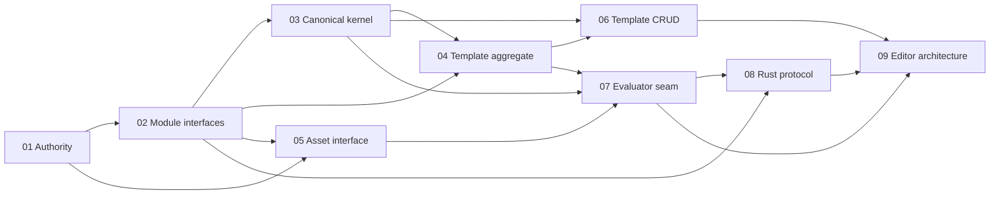

# RenderWeave Template v1 Implementation Plan

- 状态：`in_progress`；TV1-T01=`automated_verified`，下一 frontier 为 TV1-T02
- 日期：2026-08-17
- Approved delta：[`specs/changes/20260817-template-v1-implementation-authority.md`](../specs/changes/20260817-template-v1-implementation-authority.md)
- Frozen checkpoint：`0b485f4a13de9d754a81d07f464730776e13c14b`
- Code base anchor：`main@7848c821aa9b809dd8cadb2b5e28f40f6947a90e`
- Tracker：`.scratch/renderweave-template-v1-implementation/map.md`
- Branch/worktree：`feature/template-v1` / adjacent isolated worktree；worktree-local `core.autocrlf=false`
- Lifecycle：整个 Template v1 仍为 `planned/in_progress`；Editor、Renderer 与 release 均未 READY

## 1. 四维执行配置

```text
规模：project
自主：copilot
风险：standard（外部授权、生产、真实数据、Renderer 认证等局部 guarded）
协作：single-writer
```

该 effort 跨 Java/Web/Rust、合同、数据库与浏览器验收，需要可恢复的长期 DAG。当前没有原子 claim、CI 分支
保护或 A3，因此不启用并发写入；Wayfinder 子票的 `Status`/`Claimed by` 是调度事实源。确定性且可逆的票据可在
已批准语义内连续推进；产品语义必变、新外部授权、真实数据、付费、生产或难恢复动作仍由人决定。

## 2. Harness 能力与保证上限

```yaml
capabilities:
  evidence_capture: tool
  atomic_claim: none
  blocking_permission: human
  independent_verify: limited
  isolated_workspace: available
binding: generic + project-local tools/run-gate.ps1 + Wayfinder markdown tracker
```

| 能力 | 当前事实 | 调度影响 |
|---|---|---|
| evidence capture | gate 捕获 revision、diff hash、输入 manifest、原始输出与 exit | 普通结果上限 A1 |
| independent verify | Editor/SPEC_REGISTRY 与部分既有视觉证据有独立 Python replay | 只在 exact 输入范围内记 A2，不外推产品 |
| isolated workspace | Template 使用相邻 worktree，dirty main 不参与写入 | 允许 `feature/template-v1` 单 writer |
| atomic claim | 无；Markdown claim 非原子 | 同时只 claim 一个 frontier ticket |
| external hard gate | 无 CI/branch protection | 不存在 A3；release 另需外部门控 |

## 3. Phase、增量与退出门

| Phase | Tickets | 可观察增量 | 退出门 |
|---|---|---|---|
| TV1-P0 Authority | 01 | 隔离分支、additive spec、LF authority、离线 static gate 与恢复边界 | G-TV1-AUTHORITY：`template` + `fast` + Git/product-surface audit；A1，registry 范围 A2 |
| TV1-P1 Kernel | 02 → 03 | deep interface/依赖 ADR 后，最小 DesignDSL canonical kernel 和独立 vectors | G-TV1-KERNEL：focused TDD + Java primary/Python replay + `template`；不得登记 partial Profile available |
| TV1-P2 Aggregates | 04、05、06 | Template/Asset interface 决策；随后仅实现 Template create/read/save PostgreSQL 纵切 | G-TV1-TEMPLATE：server/Testcontainers/OpenAPI + contract/full；无占位 Asset 产品 |
| TV1-P3 Rendering seam | 07 → 08 | Evaluator/RenderDocument ownership 与独立 Rust process/certification protocol | G-TV1-RENDER-SEAM：closed protocol vectors、failure boundaries、supply-chain plan；不等于 Renderer READY |
| TV1-P4 Editor validation | 09 | 基于真实 Template/Rendering seam 的 throwaway Product Editor 状态原型结论 | G-TV1-EDITOR-ARCH：自动观察 A1/A2 + 人工 J1；不开放产品 route |
| TV1-P5+ Product completion | 待上述真实 seam 后另切票 | 完整 DSL、Asset、Evaluator、Renderer、Product Editor 与 formal registry records | 逐纵切 gate + product target/executor + J1/A3/物理 Linux 认证；当前未调度 |

## 4. 当前 ticket DAG



| Ticket | 类型 | 状态 | Blocked by | 本票退出事实 |
|---|---|---|---|---|
| 01 | task | `resolved` / `automated_verified` | none | 实施权威与反馈闭环；无产品代码 |
| 02 | grilling | `open` | 01 | 精确 module/interface/依赖 ADR 与 architecture test contract |
| 03 | task | `open` | 01, 02 | 最小 canonical kernel；TDD + independent replay |
| 04 | grilling | `open` | 02, 03 | Template aggregate/persistence seam；无 migration |
| 05 | grilling | `open` | 01, 02 | Asset admission/resolution deep interface |
| 06 | task | `open` | 03, 04 | Template create/read/save 真正 PostgreSQL 纵切 |
| 07 | grilling | `open` | 03, 04, 05 | Evaluator/RenderDocument seam |
| 08 | grilling | `open` | 02, 07 | Rust process protocol与外部认证计划 |
| 09 | prototype | `open` | 06, 07, 08 | Editor 状态/恢复/预览架构验证；不进产品 route |

每次只 claim 一个 unblocked ticket；一票 resolved 后才由其 `Blocked by` 关系产生下一 frontier。未知实现切片留在
map 的 `Not yet specified`，不为排满计划提前发明接口、migration 或 Profile identity。

## 5. TV1-T01 执行卡

- AC：AC-TV1-001..006。
- 允许影响：specs、governance、plans、tracker、frozen registry LF repair、gate scripts、evidence。
- 禁止影响：Java/Web/Rust 产品源码、OpenAPI、migration、产品 route/page/table、Profile available registration。
- 局部验证：PowerShell parse、frozen file hash、registry path/hash walker、product-surface inventory。
- 受影响验证：`tools/run-gate.ps1 -Gate template`、`-Gate fast`、`git diff --check`。
- 本票不运行：browser/E2E/runtime/Web service/J1/provider；`full` 已静态包含 template step，但不以本票越权启动。
- 保证等级：gate A1；SPEC_REGISTRY independent replay 对其 strict inputs 为 A2；无 A3/J1。
- 完成信号：Ticket 01 resolved、map 仅登记其上下文指针、Ticket 02 成为唯一 unblocked frontier、形成一个
  `agent-commit`，worktree clean；不 push/tag/PR。

## 6. Gate 与证据策略

`template` gate 顺序固定为 repository diff → 临时副本 Editor generator/independent/A2 → registry target refresh/
Node primary/Python independent/A2 → 全树 byte comparison → frozen counts/readiness assertions。任何命令失败或
相同输入生成 diff 都失败；仓库 authority 不被重写。

后续票据遵守 focused → affected → Phase → Goal。新增 Maven module、root POM、OpenAPI、lockfile、migration、
process protocol 或 `full` 组成变化属于共享面，必须提前扩大回归。自动 green 只把对应任务推进到
`automated_verified`；体验/业务选择是 J0/J1，独立机器 replay 是 A2，物理 Linux/CI policy 才可能形成外部门。

## 7. Version、恢复与熔断

- 每个已验证 Template ticket 在 `feature/template-v1` 独立提交；不 rewrite/cherry-pick 到 dirty main，不 push/tag/PR。
- Ticket 01 无数据或外部副作用，恢复为回退其单一提交或删除新 worktree；不得用 `reset --hard` 清理用户 worktree。
- 后续 migration 一律 forward-only，只有真实纵切接线时选择当时下一个版本，并用 PostgreSQL/Testcontainers 验证。
- provider/API key/真实数据/生产权限默认关闭。Renderer 的 hermetic build、ELF closure、portable tricky-font 与
  双物理 Linux CPU-family pixel replay未完成前持续 fail-closed。
- 触发熔断：authority replay diff、产品语义冲突、依赖循环、test-only bypass、partial Profile availability、
  migration/route placeholder、越界外部副作用或 readiness 夸大。停止受影响票，保留证据；其他安全 frontier 继续。

## 8. 当前边界

- Ticket 19 保持 open；Capacity formal records=0。
- Formal Editor Case/Oracle=0/0；47 个 EditorContentSource slots 仅 1 exact、46 UNBOUND。
- Template/Editor/Renderer 未 READY；静态 replay 不等于产品执行、浏览器观察、人工验收或外部认证。
