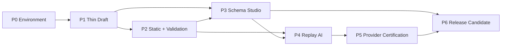

# RenderWeave v1 Phase 计划

- 状态：P1–P4 implementation complete；P5 T5-1–T5-11 已完成通路、质量实测与安全硬化；P6 T6-1 容量、性能和稳定性基线已完成 clean A1/独立 A2；所有 Profile 仍为 `EXPERIMENTAL`，全部 live authorization 均为 `CLOSED`
- 日期：2026-08-10
- Spec：[`specs/renderweave-v1.md`](../specs/renderweave-v1.md)
- 原型：`/prototype/schema-studio?variant=A|B|C`
- 当前 lifecycle：P0 `accepted`；P1–P4 `automated_verified`；P5 `live_canary_verified` / `live_independently_reviewed` / `decision_recorded`

## 1. 四维执行配置

```text
规模：project
自主：auto（P1–P4 确定性、可逆任务）；P5 guarded
风险：standard；P5 live AI、真实数据、恢复/发布操作局部 guarded
协作：single-writer；P5 safety 使用独立只读 reviewer
```

理由：v1 是多里程碑产品，需要跨会话维护 DSL、API、数据库和 Web 一致性。本地 gate 提供 A1；P5 live safety 已获得一次范围明确的独立 A2，但完整质量评测仍没有 A2，仓库也没有外部 CI hard gate A3 或 production permission。单写入者维护代码，独立 reviewer 只读复核高风险边界。

## 2. Phase 增量

| Phase | 用户可验证增量 | 风险优先级 | 回归范围 | 退出门控 |
|---|---|---|---|---|
| P0 环境与产品骨架 | 一条命令构建 Java/Web，打开三方案 Schema Studio 原型，API/PG health 可运行 | 工具链、Node24、合同/证据能力 | build + contract generation + container canary | G-P0-FULL；原型方向 J1 |
| P1 最薄 Draft 旅程 | 从 Web 创建含一个 text 字段的 Draft、保存 revision、刷新读取 | 身份、strict DSL、revision、手写 API/生成 client | unit + PG integration + one Playwright journey | G-P1-DRAFT |
| P2 不可变发布与验证 | 嵌套 Draft→Static 发布、下载内联 artifact、批量验证样本 | graph concurrency、compiler、decimal/time、snapshot immutability | property + fault + contract + E2E | G-P2-STATIC |
| P3 完整 Schema Studio | 完整类型/约束、历史/恢复/复制/删除、Form/Map/冲突/发布准备 | shared reducer、可访问性、256-field 性能 | reducer/component + browser E2E + axe | G-P3-STUDIO；UI J1 |
| P4 Replay AI 闭环 | 用固定 synthetic replay 完成 durable job、evidence review、create-only atomic Draft Bundle | Candidate/DSL 边界、lease、取消/恢复、zero partial write | replay eval + PG fault + tool manifest + E2E | G-P4-REPLAY |
| P5 Provider 与认证 | 经显式授权运行 DashScope adapter；60-case 分模式评测决定 Profile certified/experimental | 外部费用、隐私、prompt injection、模型漂移 | independent eval + safe live canary | G-P5-QUALITY（A2 + J1） |
| P6 发布候选 | 10-user/large dataset、浏览器/无障碍、Compose、备份恢复和全部主路径完成 | 性能、运维、恢复、scope drift | full + independent replay + human acceptance | G-V1-RELEASE |

每个 Phase 门控后执行 `RULE-ANCHOR-001`：对照 approved spec/delta、AC、非目标，确认没有引入 Template/Workspace/Renderer 或扩大 AI 权限。

## 3. 依赖 DAG



Phase 内任务只在真实前置依赖满足时并行。当前没有 atomic claim，默认由单写入者串行执行；migration、OpenAPI、package-lock、root POM 是共享写 lane。

## 4. 任务卡

### P0 — Environment / Preparation canary

#### T0-1：建立仓库真相源和版本化工程基线
- AC：AC-022, AC-023, AC-025
- 依赖：无
- 影响区域：root POM、modules、web package、AGENTS/CONSTITUTION/spec/ADR
- 局部验证：Maven reactor validate；Web dependency install/typecheck
- 回归升级：修改 root dependency management、lockfile 或 module DAG 时跑 full
- 证据保证：A1
- Review/ADR：ADR-0003/0006/0007
- 完成信号：目录、依赖方向、exact versions 和命令全部可机器执行

#### T0-2：建立 OpenAPI → generated client → API status canary
- AC：AC-022
- 依赖：T0-1
- 影响区域：`openapi/`, `web/src/api/generated`, `renderweave-app`
- 局部验证：OpenAPI generation + TypeScript compile + MockMvc/status contract
- 回归升级：任何 shared contract 变化跑 server+web
- 证据保证：A1
- 完成信号：同一 contract 驱动客户端并由服务端测试验证

#### T0-3：建立 PostgreSQL/Flyway/Testcontainers/Compose canary
- AC：AC-023, AC-024
- 依赖：T0-1
- 影响区域：app config、baseline migration、Compose
- 局部验证：Testcontainers context + Flyway history + DB health
- 回归升级：migration/infra 变化跑 server+compose smoke
- 证据保证：A1；release recovery A2/J1
- 完成信号：无 H2/SQLite，API 可只依赖 PostgreSQL 启动

#### T0-4：三方案 Schema Studio throwaway prototype
- AC：AC-013, AC-014, AC-017
- 依赖：T0-1
- 影响区域：`web/src/prototype`, page design override
- 局部验证：Node24 production build；手动切换 A/B/C 和键盘左右键
- 回归升级：N/A，原型不进入生产回归
- 证据保证：A1 build + J1 visual/interaction decision
- 完成信号：用户能比较三个结构差异；结论写入 ADR-0005/NOTES 后删除或吸收

#### T0-5：本地 gate、证据与 checkpoint canary
- AC：所有后续 AC 的执行能力
- 依赖：T0-2, T0-3, T0-4
- 影响区域：`tools/`, `.sdlc/`, env checklist, checkpoint
- 局部验证：故意失败探针能保留非零 exit；绿色 full gate 捕获 revision/diff/output
- 回归升级：gate script/CI config 变化跑自身 canary
- 证据保证：A1（不是 A2/A3）
- 完成信号：`plans/logs/ENV-001.md` 可定位原始证据和未满足能力

### P1 — Thin Draft vertical slice

#### T1-1：先用失败测试冻结 DSL envelope、key 与无 fieldId 契约
- 执行状态：`automated_verified`（A1，`plans/logs/P1-T1-1.md`）
- AC：AC-001, AC-002, AC-008
- 依赖：P0
- 影响区域：schema public/domain/test
- 局部验证：table/property unit tests
- 回归升级：DSL shared contract 变化跑 compiler/validation/contract
- 证据保证：A1；Phase gate independent A2 preferred
- 完成信号：合法单 text field 通过，unknown/duplicate/bad key/fieldId 均失败

#### T1-2：Draft create/save/revision PostgreSQL slice
- 执行状态：`automated_verified`（A1，`plans/logs/P1-T1-2.md`）
- AC：AC-001, AC-003, AC-023
- 依赖：T1-1
- 影响区域：schema application port、app SQL/migration
- 局部验证：Testcontainers create/save/stale expectedRevision tests
- 回归升级：migration/concurrency 命中 RULE-VAL-001，跑 server affected suite
- 证据保证：A1/A2
- 完成信号：revision 0→1；stale writer 409 且内容不变

#### T1-3：Draft REST + generated SDK + minimal editor journey
- 执行状态：`automated_verified`（A1，`plans/logs/P1-T1-3.md`）
- AC：AC-001, AC-013, AC-022
- 依赖：T1-2
- 影响区域：OpenAPI/controller/generated client/web route
- 局部验证：contract + component + Playwright create/save/reload
- 回归升级：OpenAPI 变化跑 server+web
- 证据保证：A1
- 完成信号：用户边界证明 persisted Draft，而非仅内部 unit 自洽

### P2 — Complete deterministic kernel

#### T2-1：完整 type/constraint/strict parser
- 执行状态：`automated_verified`（A1，`plans/logs/P2-T2-1.md`）
- AC：AC-008, AC-009, AC-011
- 依赖：P1
- 影响区域：schema DSL/validation parser
- 局部验证：type matrix + property fuzz + boundary goldens
- 回归升级：decimal/date/time/regex 修改跑 full deterministic suite
- 证据保证：A1/A2
- 完成信号：spec 中每个 constraint 有 positive/negative/boundary test

#### T2-2：引用图、删除/恢复/复制与并发锁
- 执行状态：`automated_verified`（A1，`plans/logs/P2-T2-2.md`）
- AC：AC-002–AC-005, AC-023
- 依赖：T2-1
- 影响区域：graph domain、projection SQL、transactions
- 局部验证：DAG property + concurrent Testcontainers + fault injection
- 回归升级：graph/migration/concurrency 直接跑 Phase integration
- 证据保证：A2 target
- 完成信号：悬空/环/竞态无一能提交，incoming delete blocker 稳定

#### T2-3：Static publication、system presets 与 inline compiler
- 执行状态：`automated_verified`（A1，`plans/logs/P2-T2-3.md`）
- AC：AC-006, AC-007, AC-010
- 依赖：T2-2
- 影响区域：publisher/compiler/migration/API
- 局部验证：byte goldens、mixed compiler versions、2 MiB rollback、no update/delete tests
- 回归升级：compiler/schema/migration 变更跑 Phase+contract
- 证据保证：A2 target
- 完成信号：叶→根发布和下载 journey 完整，旧 artifact byte-stable

#### T2-4：权威 RootDocument batch validator
- 执行状态：`automated_verified`（A1，`plans/logs/P2-T2-4.md`）
- AC：AC-011, AC-012
- 依赖：T2-1, T2-2
- 影响区域：validation module/API/web sample page
- 局部验证：strict duplicate/parser/property + ordered 100-problem golden
- 回归升级：DSL/graph/parser shared change 跑 Phase suite
- 证据保证：A1/A2
- 完成信号：Draft/Static batch target 都返回 frozen resolution snapshot

### P3 — Full Schema Studio

#### T3-1：EditorSession semantic action model
- 执行状态：`automated_verified`（A1，`plans/logs/P3-T3-1.md`）
- AC：AC-013
- 依赖：P1, prototype J1
- 影响区域：web editor reducer/components
- 局部验证：model/reducer tests for switch/undo/redo/dirty/restore
- 回归升级：shared editor action changes run map/form component suite
- 证据保证：A1
- 完成信号：form/map 对同 action trace 产生同 definition

#### T3-2：完整 form/map/reference/publish-prep interactions
- 执行状态：`automated_verified`（A1，`plans/logs/P3-T3-2.md`）
- AC：AC-006, AC-008, AC-009, AC-013, AC-014
- 依赖：T3-1, T2-3
- 影响区域：web routes/nodes/inspector/dialogs
- 局部验证：component + Playwright keyboard/no-drag path
- 回归升级：@xyflow/router/accessibility shared changes run E2E
- 证据保证：A1 + J1
- 完成信号：256-field representative schema 可在两模式完整操作

#### T3-3：history/delete/restore/copy/conflict/static/sample surfaces
- 执行状态：`automated_verified`
- AC：AC-003, AC-005, AC-007, AC-012, AC-014
- 依赖：T2-4, T3-1
- 影响区域：API/web pages/cache/SSE invalidation
- 局部验证：contract/component/E2E at 1024/1280/1440
- 回归升级：route/server state changes run affected journeys
- 证据保证：A1 + J1
- 完成信号：v1 四类页面可达且无未来占位入口

### P4 — Replay inference vertical slice

#### T4-1：输入归一化、BlobStore、durable job 与 lease
- 执行状态：`automated_verified`（A1，`plans/logs/P4-T4-1.md`）
- AC：AC-015, AC-019, AC-024
- 依赖：P2
- 影响区域：inference input/job、app adapters/migrations
- 局部验证：format bombs/limits/EXIF/failure cleanup + lease integration
- 回归升级：filesystem/migration/concurrency changes run Phase suite
- 证据保证：A2 target
- 完成信号：raw bytes 不保留，restart/cancel 不产生 partial state

#### T4-2：deterministic profiler、Candidate contracts 与 replay workflow
- 执行状态：`automated_verified`（A1，`plans/logs/P4-T4-2.md`）
- AC：AC-015, AC-016
- 依赖：T4-1
- 影响区域：inference domain/profile/replay fixtures
- 局部验证：image/json/combined contract goldens + injection cases
- 回归升级：prompt/output schema/budget changes run full eval
- 证据保证：A2 target
- 完成信号：unresolved/conflict 能安全进入 review，不能进入 DSL repository

#### T4-3：Candidate review editor 与 evidence overlay
- 执行状态：`automated_verified`
- AC：AC-017
- 依赖：T3-2, T4-2
- 影响区域：web review/candidate API
- 局部验证：candidate revision/component/E2E item resolution
- 回归升级：shared editor/evidence coordinate changes run review E2E
- 证据保证：A1 + J1
- 完成信号：无 confirm-all，key rename 后 evidence 仍稳定关联

#### T4-4：create-only materializer、atomic apply、SSE/recovery
- 执行状态：`automated_verified`（A1，`plans/logs/P4-T4-4.md`）
- AC：AC-018, AC-019, AC-020
- 依赖：T4-2, T4-3
- 影响区域：inference→schema application boundary、transactions、SSE
- 局部验证：tool manifest + conflict/fault/crash/replay integration
- 回归升级：权限/transaction/SSE changes run Phase E2E
- 证据保证：A2 target（当前为本地同 Agent A1）
- 完成信号：成功全包创建；所有失败零写；published rows 恒不变

### P5 — Guarded provider and quality certification

#### T5-1：DashScope provider-neutral port、Chat Completions adapter contract 与 versioned Profile
- 执行状态：`automated_verified`（A1；纳入 P5 safety A2 复核）
- AC：AC-020
- 依赖：P4
- 影响区域：provider adapter/profile resources/config
- 局部验证：fake transport proves JSON mode/thinking off/no tools/no remote URL/budgets/retries/safe logs
- 回归升级：provider/model/prompt/SDK changes run adapter+eval
- 证据保证：A2
- 完成信号：默认无 key/网络仍全绿，tool surface 不扩张

#### T5-2：真实上传、durable live worker 与审核 UI 纵切
- 执行状态：`automated_verified`（A1；纳入 P5 safety A2 复核）
- AC：AC-015, AC-018, AC-019, AC-020
- 依赖：T5-1
- 影响区域：input API、provider worker、attempt telemetry、OpenAPI/SDK、Inference UI
- 局部验证：fake provider drives image/json/combined through durable review；missing key/budget/retry/cancel/repair fail safely
- 回归升级：OpenAPI、job state、migration 或 provider request changes run server+web+real PG/browser
- 证据保证：A1 implementation；A2 target before live certification
- 完成信号：上传不触网；显式 synthetic/external-transfer confirmation 才启动；Candidate 进入既有逐项审核/create-only 路径

#### T5-3：60-case gold corpus、metrics 与 holdout runner
- 执行状态：`live_independently_reviewed`（v2 完整图 gold/metric/policy 为 A1 + A2；Flash、旧 Plus、Prompt v2 三轮 live 结果均已独立重建）
- AC：AC-016, AC-021
- 依赖：T4-2, T5-1
- 影响区域：eval fixtures/runner/reports
- 局部验证：metric unit goldens + replay full corpus
- 回归升级：Profile/eval/gold change always full eval
- 证据保证：A2 independent
- 完成信号：global/mode/holdout results reproducible and version-bound

#### T5-4：限定预算的双模型 synthetic live canary
- 执行状态：`live_canary_verified`（J1 + A1；2 attempts / ¥0.054017，授权账本已关闭）
- AC：AC-015, AC-020
- 依赖：T5-2, T5-3；J1 provider/cost/data authorization
- 影响区域：external DashScope side effect only
- 局部验证：exact profiles；只用仓库 synthetic input；两个模型合计最多 6 次 provider attempt、累计费用上限 ¥1；safe evidence
- 回归升级：任何 endpoint/model/profile/budget/input scope drift 需重新 J1
- 证据保证：A2 + J1
- 完成信号：只证明通路；不把 canary PASS 冒充 model quality PASS

#### T5-5：Profile certification decision
- 执行状态：`decision_recorded`（P5 safety A2 PASS；quality certification incomplete；`plans/logs/P5-T5-5.md`）
- AC：AC-021
- 依赖：T5-3, T5-4
- 影响区域：profile registry/release evidence
- 局部验证：independent full + holdout evaluation
- 回归升级：任何 profile identity change invalidates evidence
- 证据保证：A2 + policy J1
- 完成信号：已明确两个 Profile 均为 `EXPERIMENTAL`，AI default remains disabled；后续认证需新的 J1 与独立 60-case/holdout A2

#### T5-6：可恢复、身份绑定的 60-case live quality certification
- 执行状态：`live_independently_reviewed`（Flash / pinned Plus 均完成 J1 + A1 + independent A2；decision=`EXPERIMENTAL`；authorization=`CLOSED`；`plans/logs/P5-T5-6.md`）
- AC：AC-016, AC-021
- 依赖：T5-3, T5-5；新的 provider/cost/data J1
- 影响区域：v2 eval gold/whole-graph scorer/certification policy、test-only live harness、authorization/guard/journal、project gate
- 局部验证：60-case envelope 正反例、UNRESOLVED/CONFLICT 误断言负例、budget/recovery/identity drift tests、PROPOSED zero-write probe
- 回归升级：Profile/prompt/gold/evaluator/workflow/build 任一变化都会改变 evaluation identity，现有授权 fail-closed，必须重新提案/J1
- 证据保证：pre-live A1 + A2；真实执行为 J1 + A1，完成后由独立 A2 重建 journal、预算和全部指标
- 完成信号：Flash 与 pinned Plus 均在精确授权下完成 60/60，分别产出 global/mode/HOLDOUT 报告；policy 均为 `EXPERIMENTAL`，授权均立即 CLOSED

#### T5-7：Evidence-anchored Prompt/Profile v2 与独立认证方案
- 执行状态：`live_independently_reviewed`（J1 + A1 + independent A2 PASS；decision=`EXPERIMENTAL`；authorization=`CLOSED`；`plans/logs/P5-T5-7.md`）
- AC：AC-016, AC-021
- 依赖：T5-6 的 CLOSED Flash/Plus evidence
- 影响区域：不可变 prompt/profile、Candidate provider trust boundary、JSON evidence catalog、repair routing、evaluator diagnostics、OpenAPI/Web profile surface
- 局部验证：字段身份/JSON truth table golden、forged provenance 与 invented evidence 负例、parseable blocker repair workflow、旧 prompt/profile byte identity 回归
- 回归升级：prompt/profile/candidate/evaluator/workflow/OpenAPI 任一变化跑 server+web，并改变新的 certification evaluation identity
- 证据保证：pre-live A1 + 独立 A2；live 为 J1 + A1，结果经独立 A2 重建；本地 evidence 未签名，非 A3
- 完成信号：Prompt v2 完成 60/60，70 attempts / 256,153 tokens / ¥0.868772；exact pass 18→47、critical 51→10，但 policy 仍为 `EXPERIMENTAL`，ledger 已立即 CLOSED

#### T5-8：Grounded Pipeline v2 与受限视觉 Overlay 认证
- 执行状态：`live_independently_reviewed`（clean A1 + pre-live/live A2 PASS；60-case J1/A1 完成；decision=`EXPERIMENTAL`；authorization=`CLOSED`；`plans/logs/P5-T5-8.md`）
- AC：AC-016, AC-020, AC-021
- 依赖：T5-7 的 CLOSED Prompt v2 evidence；ADR-0011；新的 provider/cost/data J1
- 影响区域：JSON structural profile、deterministic Candidate、COMBINED visual composer、Prompt/Profile v3、live worker、OpenAPI/Web profile surface
- 局部验证：20 个 JSON_ONLY corpus case 全部 REVIEW_REQUIRED 且 provider/attempt/reservation/cost 为零；COMBINED overlay truth-preservation 与恶意图边界；旧 pipeline 回归
- 回归升级：grounding/composer/prompt/profile/evaluator/workflow/OpenAPI 任一变化均需 server+web clean A1，并产生新的 certification evaluation identity
- 证据保证：pre-live A1 + 独立 A2；真实 60-case 执行为精确 J1 + A1，完成后独立 A2 重建 journal、费用与指标；本地 evidence 未签名，非 A3
- 完成信号：精确 tracked ledger 已按 `b454b14` PROPOSED → `7ee817c` OPEN → `6733260` CLOSED 执行 60/60；80 attempts / 278,740 tokens / ¥0.908984，JSON_ONLY 与 COMBINED 各 20/20、IMAGE_ONLY 0/20，policy=`EXPERIMENTAL`；最终独立 A2 重建 PASS，0 Blocker / 0 High / 0 Medium

#### T5-9：不含载荷的 IMAGE_ONLY 尝试级问题分类
- 执行状态：`independently_reviewed`（clean server A1 + 独立 A2 PASS，0 Blocker / 0 High / 0 Medium；`plans/logs/P5-T5-9.md`）
- AC：AC-016, AC-021
- 依赖：T5-8 的 CLOSED Grounded evidence；ADR-0012
- 影响区域：Candidate strict codec、live worker attempt telemetry、replay attempt model、PostgreSQL V010、certification journal/report
- 局部验证：八类解码诊断、input-steering 负例、bounded/strict taxonomy、parsed Candidate validator code、V010 fresh migration、journal 1.1 CLOSED-only / 1.2 strict 兼容与 canary/certification/journal payload 排除
- 回归升级：codec/validator/worker/attempt store/journal/report 任一变化跑 server；未来真实归因必须形成新的 evaluation identity、PROPOSED ledger 与 J1
- 证据保证：离线 A1 + 独立只读 A2；本节点无 Provider side effect，不宣称 A3
- 完成信号：稳定 code/count 可在 attempt、PostgreSQL 与 report 中无损重放，历史行默认为空；`ec53b3d` 的 clean server A1 与独立 A2 已通过，所有 live gate 仍关闭；该结论不等于新的 Profile certification

#### T5-10：同一 Grounded Profile 的 IMAGE_ONLY 诊断评测方案
- 执行状态：`live_independently_reviewed`（20-case live、CLOSED、clean A1 与独立 A2 PASS；`plans/logs/P5-T5-10.md`）
- AC：AC-016, AC-020, AC-021
- 依赖：T5-8 CLOSED Grounded evidence；T5-9 payload-free taxonomy；ADR-0013
- 影响区域：live authorization assignment slice、journal assignment guard、certification/diagnostic report envelope、versioned ledger
- 局部验证：20 unique IMAGE_ONLY、60 settled attempts、197,321 tokens / ¥0.642106、时序预算重建、strict taxonomy、payload-free scan、CLOSED probe
- 回归升级：authorization/harness/journal/report 变化跑 server；任何未来 live 必须使用新的 evaluation identity、ledger、pre-live A1/A2 与 J1
- 证据保证：pre-live A1 + 独立 A2 + 精确 J1 + live 独立 A2；本地证据不是 A3
- 完成信号：J1 范围内执行并立即 CLOSED；独立重建确认 `CANDIDATE_DECODE_VALUE_INVALID=60`、`INCOMPLETE/DIAGNOSTIC_ONLY`，0 Blocker / 0 High / 0 Medium

#### T5-11：值级解码失败的 payload-free 细分归因
- 执行状态：`independently_reviewed`（clean server A1 + 独立 A2 PASS，0 Blocker / 0 High / 0 Medium；Provider attempts=0；`plans/logs/P5-T5-11.md`）
- AC：AC-016, AC-021
- 依赖：T5-10 CLOSED evidence；ADR-0012、ADR-0013
- 影响区域：Candidate strict codec diagnostic taxonomy、attempt telemetry、journal/report 与 adversarial contract tests
- 局部验证：将 enum/constructor/有限 contract-slot 分开且不保存原始值或动态路径；固定 Candidate owner、primitive/coercion/map-key collision 与 STRUCTURE/REPAIR 离线负例
- 回归升级：codec/taxonomy/journal/report 变化跑 server；Profile/Prompt 不在本任务中修改
- 证据保证：离线 A1 + 独立 A2；任何真实复验另建 identity/ledger/J1
- 完成信号：`b38aee1` clean server A1 与独立 A2 PASS；`VALUE_INVALID` 可被稳定、bounded、payload-free 地细分，历史证据保持只读，Provider attempt 为 0

### P6 — Release candidate

#### T6-1：容量、性能和稳定性基线
- 执行状态：`independently_reviewed`（clean server/capacity A1 + 独立 A2 PASS；Provider attempts=0；`plans/logs/P6-T6-1.md`）
- AC：AC-012, AC-019, AC-023, AC-024
- 依赖：P2, P4
- 影响区域：queries/indexes/concurrency config/measurement fixtures
- 局部验证：10 active sessions、2 AI workers、10k/100k/10k/10k dataset
- 回归升级：query/index/virtual-thread/worker changes run performance slice
- 证据保证：A2
- 完成信号：结果记录而非无依据 SLA；关键退化已修复或批准 delta

#### T6-2：browser/accessibility/visual acceptance
- 执行状态：`in_progress`（ADR-0014；先闭环 inference Candidate 产品旅程，再扩展浏览器矩阵）
- AC：AC-013, AC-014, AC-017
- 依赖：P3, P4
- 影响区域：web UI
- 局部验证：Chrome/Edge latest two、axe、keyboard、1024/1280/1440
- 回归升级：global tokens/router/components changes run all UI journeys
- 证据保证：A2 + J1
- 完成信号：无 serious/critical，核心键盘路径和视觉层级获批

执行切片：

1. T6-2a：Candidate reducer/表单补齐新增、删除、重排、类型约束与多图片 evidence，focused unit/component tests 先行。
2. T6-2b：启动与运行恢复体验补齐文件队列、四步进度、cancel/retry 和 readiness 呈现。
3. T6-2c：新增零 Provider 的 60-case offline eval gate，并重建 Playwright 1024/1280/1440、axe、键盘与 real PostgreSQL replay 旅程。
4. T6-2d：clean Web/E2E/eval/full A1、独立 A2 与人工 J1 结果分级记录。

#### T6-3：Compose、观测、备份/恢复与 storage failure drill
- AC：AC-024
- 依赖：P4
- 影响区域：deploy/config/ops docs
- 局部验证：fresh deploy、health、structured logs、DB+blob restore、missing artifact/storage full simulation
- 回归升级：infra/migration/storage changes run recovery slice
- 证据保证：A2 + J1 ops
- 完成信号：三类恢复分开报告，未把 Git 当数据库恢复

#### T6-4：最终 AC/非目标/安全能力审计
- AC：AC-001–AC-025
- 依赖：T6-1..3, T5-4
- 影响区域：whole repo/evidence/acceptance report
- 局部验证：full release gate + independent replay + route/table/tool inventory
- 回归升级：最后一次代码变化后重跑受影响和完整 gate
- 证据保证：A2；外部 hard gates 若存在为 A3；J1 pending 分开报告
- 完成信号：每个 AC 有证据/处置，生命周期状态如实更新

## 5. Gate 定义

| Gate | 必须满足 |
|---|---|
| G-P0-FULL | Maven/Web/contract/PG/Node24 canary 全绿；evidence capture 可定位；无产品功能伪实现 |
| G-P1-DRAFT | AC-001/002/003/013/022/023 thin slice；create/save/reload E2E |
| G-P2-STATIC | AC-004–012/023；graph concurrency、byte artifact、batch validator 与叶→根 journey |
| G-P3-STUDIO | AC-013/014 + relevant lifecycle UI；浏览器/axe 自动门 + J1 interaction |
| G-P4-REPLAY | AC-015–020 在零网络 replay 下通过；published rows=0；fault recovery 通过 |
| G-P5-QUALITY | AC-021 A2 report + explicit J1 live/policy；否则 Profile 保持 experimental/disabled |
| G-V1-RELEASE | AC-001–025 evidence matrix、五条 product journey、恢复、scope inventory、J1 gates |

## 6. 恢复与熔断

- 源码：record-only diff；不使用 destructive reset，不覆盖用户未提交文件。
- 数据：P1 起每个 migration task 定义 forward test、backup/restore 或补偿；Static 不通过 UPDATE 恢复。
- 外部副作用：live model call 不可撤销费用，只能停止后续 calls；production/deploy 尚未授权。
- 同一失败无新假设再次出现、必须撤销多个已验证任务、目标连续漂移或进入未授权 guarded 范围时进入 `auto_paused`。

## 7. Goal / Auto-ready 结论

当前 **P1–P4 Goal 实施范围已完成**：用户于 2026-08-08 接受原型推荐并授权按本计划推动实际落地。

1. P0 full gate 已由项目工具以 A1 通过；证据见 `plans/logs/ENV-001.md`。原型方向另有用户 J1，因此 P0 可报告 `accepted`，但这仍不是 A2/CI。
2. P1–P4 的 standard、可逆任务已连续执行完成；T4-4 通过 server/web/mocked-browser/real-PG-browser affected gates（A1），P4 恢复点为已验证节点提交。
3. 生产 UI 锁定为 A 默认 Form + B Map，共享 EditorSession；吸收 C 的 compiled preview、搜索、密度与可读性特征，不保留 C 为第三模式。
4. P5 获得的一次限定 J1 已用于仓库 synthetic 双模型 canary：2 次 attempt、¥0.054017、无真实业务数据；unused budget 不自动扩展为后续调用授权。
5. P5 live safety hardening 已由独立只读 reviewer 复核为 A2 PASS；范围只包括本节点授权、预算、重试、上传/响应上限、迁移账本和合同闭环，不涵盖完整质量认证。release hard gate 尚无外部 CI/branch protection，因此不存在 A3。
6. 授权账本已关闭，Compose live overlay 的 worker/upload 两门均保持 false；任何新增调用不得继承未使用的 attempt 或预算。
7. P5 已完成 Flash、旧 Plus 与 Prompt v2 三轮独立 60-case live 评测；三者均为 `EXPERIMENTAL`、默认关闭。新增 Profile/identity、真实业务数据、扩大费用或生产启用仍需新的精确 J1 与独立 A2。
8. T5-6 已把 60-case v2 whole-graph 评测、fail-closed policy、每批最多 5 case 的恢复账本与完整 repository evaluation identity 做成可执行闭环，并通过独立 A2；Flash/旧 Plus 授权均已 CLOSED，决定均为 `EXPERIMENTAL`。
9. T5-7 不复用旧质量结果：Prompt/Profile v2 修正 exact FieldKey、最小证据图、provider provenance、JSON evidence catalog 与三态 repair 路由；随后完成新的 60-case J1 与独立 A2。结果从旧 Plus 18/60 提升到 47/60、critical 51 降至 10，但 Evidence/DAG 退化且 IMAGE_ONLY 薄弱，故仍为 `EXPERIMENTAL`、默认关闭，授权已 CLOSED。
