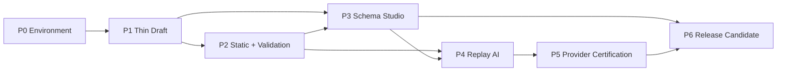

# RenderWeave v1 Phase 计划

- 状态：P1–P4 implementation complete；P5 T5-1–T5-11 已完成通路、质量实测与安全硬化；P6 T6-1 已独立复核，T6-2 四步 AI Schema 识别工作台已完成 clean A1/独立 A2、最终成品 J1 待确认；T6-3a 产品 live 已开放，T6-3a.1–a.8 已闭合产品输入、审核与串行视觉分析协议，其中 Product v3 的真实模型质量仍待新 authorization 验证；T6-3b 恢复演练待推进。历史评测 authorization 均为 `CLOSED`，四个产品 Profile 为 `EXPERIMENTAL` 且只在显式 product-live 部署中开放
- 日期：2026-08-10
- Spec：[`specs/renderweave-v1.md`](../specs/renderweave-v1.md)
- 原型：`/prototype/schema-studio?variant=A|B|C`
- 当前 lifecycle：P0 `accepted`；P1–P4 `automated_verified`；P5 `live_canary_verified` / `live_independently_reviewed` / `decision_recorded`；P6 T6-1 `independently_reviewed`、T6-2 `human_acceptance_pending`、T6-3a `automated_verified`
- 当前扩展 Goal：P6/T6-5 图片识别 vNext 为 `in_progress`；N0–N1、N3–N4、N6 已
  `automated_verified`，N2 为 `live_verified_mixed_a1_a2`，N5 为 `live_verified_not_promoted`。v27 三模型
  single-case 均 CLOSED/A2，但未形成可接受 Candidate。Flash/Plus v30 bounded live 的六次调用都停在 OBSERVE；
  其 fixed code 已驱动 pipeline 4.18/product-v31 的 bounded repeated-item SLOT owner repair、checkpoint、监控/审核
  UI 与独立 Profile verifier，并完成离线/real-PG/Web/E2E 验证。v31 clean full/Document Vision/live 尚未执行。
  最新 359 reservations 为 354 SETTLED、5 个历史 Plus RESERVED、0 BREACHED；三份 ledger CLOSED，Profile 继续
  `EXPERIMENTAL`。
  两次 J1 delta 将三个预算槽位累计 cap 提到 1.5M tokens，单 authorization、attempt/CNY/time 边界不变。
  final 20/60、最终 revision full、final independent verifier 与业务/视觉 J1 均未满足，详见
  `plans/renderweave-visual-recognition-vnext-plan.md`。

## 1. 四维执行配置

```text
规模：project
自主：auto（P1–P4 确定性、可逆任务）；P5 guarded
风险：standard；P5 live AI、真实数据、恢复/发布操作局部 guarded
协作：single-writer；P5 safety 使用独立只读 reviewer
```

理由：v1 是多里程碑产品，需要跨会话维护 DSL、API、数据库和 Web 一致性。本地 gate 提供 A1；P5 live safety 已获得一次范围明确的独立 A2，但完整质量评测仍没有 A2，仓库也没有外部 CI hard gate A3 或 production permission。单写入者维护代码，独立 reviewer 只读复核高风险边界。

## 2. Phase 增量

| Phase | 用户可验证增量 | 风险优先级 | 回归范围 | 退出门控 |
|---|---|---|---|---|
| P0 环境与产品骨架 | 一条命令构建 Java/Web，打开三方案 Schema Studio 原型，API/PG health 可运行 | 工具链、Node24、合同/证据能力 | build + contract generation + container canary | G-P0-FULL；原型方向 J1 |
| P1 最薄 Draft 旅程 | 从 Web 创建含一个 text 字段的 Draft、保存 revision、刷新读取 | 身份、strict DSL、revision、手写 API/生成 client | unit + PG integration + one Playwright journey | G-P1-DRAFT |
| P2 不可变发布与验证 | 嵌套 Draft→Static 发布、下载内联 artifact、批量验证样本 | graph concurrency、compiler、decimal/time、snapshot immutability | property + fault + contract + E2E | G-P2-STATIC |
| P3 完整 Schema Studio | 完整类型/约束、历史/恢复/复制/删除、Form/Map/冲突/发布准备 | shared reducer、可访问性、256-field 性能 | reducer/component + browser E2E + axe | G-P3-STUDIO；UI J1 |
| P4 Replay AI 闭环 | 用固定 synthetic replay 完成 durable job、evidence review、create-only atomic Draft Bundle | Candidate/DSL 边界、lease、取消/恢复、zero partial write | replay eval + PG fault + tool manifest + E2E | G-P4-REPLAY |
| P5 Provider 与认证 | 经显式授权运行 DashScope adapter；60-case 分模式评测决定 Profile certified/experimental | 外部费用、隐私、prompt injection、模型漂移 | independent eval + safe live canary | G-P5-QUALITY（A2 + J1） |
| P6 发布候选 | 10-user/large dataset、浏览器/无障碍、Compose、备份恢复和全部主路径完成 | 性能、运维、恢复、scope drift | full + independent replay + human acceptance | G-V1-RELEASE |

每个 Phase 门控后执行 `RULE-ANCHOR-001`：对照 approved spec/delta、AC、非目标，确认没有引入 Template/Workspace/Renderer 或扩大 AI 权限。

## 3. 依赖 DAG



Phase 内任务只在真实前置依赖满足时并行。当前没有 atomic claim，默认由单写入者串行执行；migration、OpenAPI、package-lock、root POM 是共享写 lane。

## 4. 任务卡

### P0 — Environment / Preparation canary

#### T0-1：建立仓库真相源和版本化工程基线
- AC：AC-022, AC-023, AC-025
- 依赖：无
- 影响区域：root POM、modules、web package、AGENTS/CONSTITUTION/spec/ADR
- 局部验证：Maven reactor validate；Web dependency install/typecheck
- 回归升级：修改 root dependency management、lockfile 或 module DAG 时跑 full
- 证据保证：A1
- Review/ADR：ADR-0003/0006/0007
- 完成信号：目录、依赖方向、exact versions 和命令全部可机器执行

#### T0-2：建立 OpenAPI → generated client → API status canary
- AC：AC-022
- 依赖：T0-1
- 影响区域：`openapi/`, `web/src/api/generated`, `renderweave-app`
- 局部验证：OpenAPI generation + TypeScript compile + MockMvc/status contract
- 回归升级：任何 shared contract 变化跑 server+web
- 证据保证：A1
- 完成信号：同一 contract 驱动客户端并由服务端测试验证

#### T0-3：建立 PostgreSQL/Flyway/Testcontainers/Compose canary
- AC：AC-023, AC-024
- 依赖：T0-1
- 影响区域：app config、baseline migration、Compose
- 局部验证：Testcontainers context + Flyway history + DB health
- 回归升级：migration/infra 变化跑 server+compose smoke
- 证据保证：A1；release recovery A2/J1
- 完成信号：无 H2/SQLite，API 可只依赖 PostgreSQL 启动

#### T0-4：三方案 Schema Studio throwaway prototype
- AC：AC-013, AC-014, AC-017
- 依赖：T0-1
- 影响区域：`web/src/prototype`, page design override
- 局部验证：Node24 production build；手动切换 A/B/C 和键盘左右键
- 回归升级：N/A，原型不进入生产回归
- 证据保证：A1 build + J1 visual/interaction decision
- 完成信号：用户能比较三个结构差异；结论写入 ADR-0005/NOTES 后删除或吸收

#### T0-5：本地 gate、证据与 checkpoint canary
- AC：所有后续 AC 的执行能力
- 依赖：T0-2, T0-3, T0-4
- 影响区域：`tools/`, `.sdlc/`, env checklist, checkpoint
- 局部验证：故意失败探针能保留非零 exit；绿色 full gate 捕获 revision/diff/output
- 回归升级：gate script/CI config 变化跑自身 canary
- 证据保证：A1（不是 A2/A3）
- 完成信号：`plans/logs/ENV-001.md` 可定位原始证据和未满足能力

### P1 — Thin Draft vertical slice

#### T1-1：先用失败测试冻结 DSL envelope、key 与无 fieldId 契约
- 执行状态：`automated_verified`（A1，`plans/logs/P1-T1-1.md`）
- AC：AC-001, AC-002, AC-008
- 依赖：P0
- 影响区域：schema public/domain/test
- 局部验证：table/property unit tests
- 回归升级：DSL shared contract 变化跑 compiler/validation/contract
- 证据保证：A1；Phase gate independent A2 preferred
- 完成信号：合法单 text field 通过，unknown/duplicate/bad key/fieldId 均失败

#### T1-2：Draft create/save/revision PostgreSQL slice
- 执行状态：`automated_verified`（A1，`plans/logs/P1-T1-2.md`）
- AC：AC-001, AC-003, AC-023
- 依赖：T1-1
- 影响区域：schema application port、app SQL/migration
- 局部验证：Testcontainers create/save/stale expectedRevision tests
- 回归升级：migration/concurrency 命中 RULE-VAL-001，跑 server affected suite
- 证据保证：A1/A2
- 完成信号：revision 0→1；stale writer 409 且内容不变

#### T1-3：Draft REST + generated SDK + minimal editor journey
- 执行状态：`automated_verified`（A1，`plans/logs/P1-T1-3.md`）
- AC：AC-001, AC-013, AC-022
- 依赖：T1-2
- 影响区域：OpenAPI/controller/generated client/web route
- 局部验证：contract + component + Playwright create/save/reload
- 回归升级：OpenAPI 变化跑 server+web
- 证据保证：A1
- 完成信号：用户边界证明 persisted Draft，而非仅内部 unit 自洽

### P2 — Complete deterministic kernel

#### T2-1：完整 type/constraint/strict parser
- 执行状态：`automated_verified`（A1，`plans/logs/P2-T2-1.md`）
- AC：AC-008, AC-009, AC-011
- 依赖：P1
- 影响区域：schema DSL/validation parser
- 局部验证：type matrix + property fuzz + boundary goldens
- 回归升级：decimal/date/time/regex 修改跑 full deterministic suite
- 证据保证：A1/A2
- 完成信号：spec 中每个 constraint 有 positive/negative/boundary test

#### T2-2：引用图、删除/恢复/复制与并发锁
- 执行状态：`automated_verified`（A1，`plans/logs/P2-T2-2.md`）
- AC：AC-002–AC-005, AC-023
- 依赖：T2-1
- 影响区域：graph domain、projection SQL、transactions
- 局部验证：DAG property + concurrent Testcontainers + fault injection
- 回归升级：graph/migration/concurrency 直接跑 Phase integration
- 证据保证：A2 target
- 完成信号：悬空/环/竞态无一能提交，incoming delete blocker 稳定

#### T2-3：Static publication、system presets 与 inline compiler
- 执行状态：`automated_verified`（A1，`plans/logs/P2-T2-3.md`）
- AC：AC-006, AC-007, AC-010
- 依赖：T2-2
- 影响区域：publisher/compiler/migration/API
- 局部验证：byte goldens、mixed compiler versions、2 MiB rollback、no update/delete tests
- 回归升级：compiler/schema/migration 变更跑 Phase+contract
- 证据保证：A2 target
- 完成信号：叶→根发布和下载 journey 完整，旧 artifact byte-stable

#### T2-4：权威 RootDocument batch validator
- 执行状态：`automated_verified`（A1，`plans/logs/P2-T2-4.md`）
- AC：AC-011, AC-012
- 依赖：T2-1, T2-2
- 影响区域：validation module/API/web sample page
- 局部验证：strict duplicate/parser/property + ordered 100-problem golden
- 回归升级：DSL/graph/parser shared change 跑 Phase suite
- 证据保证：A1/A2
- 完成信号：Draft/Static batch target 都返回 frozen resolution snapshot

### P3 — Full Schema Studio

#### T3-1：EditorSession semantic action model
- 执行状态：`automated_verified`（A1，`plans/logs/P3-T3-1.md`）
- AC：AC-013
- 依赖：P1, prototype J1
- 影响区域：web editor reducer/components
- 局部验证：model/reducer tests for switch/undo/redo/dirty/restore
- 回归升级：shared editor action changes run map/form component suite
- 证据保证：A1
- 完成信号：form/map 对同 action trace 产生同 definition

#### T3-2：完整 form/map/reference/publish-prep interactions
- 执行状态：`automated_verified`（A1，`plans/logs/P3-T3-2.md`）
- AC：AC-006, AC-008, AC-009, AC-013, AC-014
- 依赖：T3-1, T2-3
- 影响区域：web routes/nodes/inspector/dialogs
- 局部验证：component + Playwright keyboard/no-drag path
- 回归升级：@xyflow/router/accessibility shared changes run E2E
- 证据保证：A1 + J1
- 完成信号：256-field representative schema 可在两模式完整操作

#### T3-3：history/delete/restore/copy/conflict/static/sample surfaces
- 执行状态：`automated_verified`
- AC：AC-003, AC-005, AC-007, AC-012, AC-014
- 依赖：T2-4, T3-1
- 影响区域：API/web pages/cache/SSE invalidation
- 局部验证：contract/component/E2E at 1024/1280/1440
- 回归升级：route/server state changes run affected journeys
- 证据保证：A1 + J1
- 完成信号：v1 四类页面可达且无未来占位入口

### P4 — Replay inference vertical slice

#### T4-1：输入归一化、BlobStore、durable job 与 lease
- 执行状态：`automated_verified`（A1，`plans/logs/P4-T4-1.md`）
- AC：AC-015, AC-019, AC-024
- 依赖：P2
- 影响区域：inference input/job、app adapters/migrations
- 局部验证：format bombs/limits/EXIF/failure cleanup + lease integration
- 回归升级：filesystem/migration/concurrency changes run Phase suite
- 证据保证：A2 target
- 完成信号：raw bytes 不保留，restart/cancel 不产生 partial state

#### T4-2：deterministic profiler、Candidate contracts 与 replay workflow
- 执行状态：`automated_verified`（A1，`plans/logs/P4-T4-2.md`）
- AC：AC-015, AC-016
- 依赖：T4-1
- 影响区域：inference domain/profile/replay fixtures
- 局部验证：image/json/combined contract goldens + injection cases
- 回归升级：prompt/output schema/budget changes run full eval
- 证据保证：A2 target
- 完成信号：unresolved/conflict 能安全进入 review，不能进入 DSL repository

#### T4-3：Candidate review editor 与 evidence overlay
- 执行状态：`automated_verified`
- AC：AC-017
- 依赖：T3-2, T4-2
- 影响区域：web review/candidate API
- 局部验证：candidate revision/component/E2E item resolution
- 回归升级：shared editor/evidence coordinate changes run review E2E
- 证据保证：A1 + J1
- 完成信号：无 confirm-all，key rename 后 evidence 仍稳定关联

#### T4-4：create-only materializer、atomic apply、SSE/recovery
- 执行状态：`automated_verified`（A1，`plans/logs/P4-T4-4.md`）
- AC：AC-018, AC-019, AC-020
- 依赖：T4-2, T4-3
- 影响区域：inference→schema application boundary、transactions、SSE
- 局部验证：tool manifest + conflict/fault/crash/replay integration
- 回归升级：权限/transaction/SSE changes run Phase E2E
- 证据保证：A2 target（当前为本地同 Agent A1）
- 完成信号：成功全包创建；所有失败零写；published rows 恒不变

### P5 — Guarded provider and quality certification

#### T5-1：DashScope provider-neutral port、Chat Completions adapter contract 与 versioned Profile
- 执行状态：`automated_verified`（A1；纳入 P5 safety A2 复核）
- AC：AC-020
- 依赖：P4
- 影响区域：provider adapter/profile resources/config
- 局部验证：fake transport proves JSON mode/thinking off/no tools/no remote URL/budgets/retries/safe logs
- 回归升级：provider/model/prompt/SDK changes run adapter+eval
- 证据保证：A2
- 完成信号：默认无 key/网络仍全绿，tool surface 不扩张

#### T5-2：真实上传、durable live worker 与审核 UI 纵切
- 执行状态：`automated_verified`（A1；纳入 P5 safety A2 复核）
- AC：AC-015, AC-018, AC-019, AC-020
- 依赖：T5-1
- 影响区域：input API、provider worker、attempt telemetry、OpenAPI/SDK、Inference UI
- 局部验证：fake provider drives image/json/combined through durable review；missing key/budget/retry/cancel/repair fail safely
- 回归升级：OpenAPI、job state、migration 或 provider request changes run server+web+real PG/browser
- 证据保证：A1 implementation；A2 target before live certification
- 完成信号：上传不触网；显式 synthetic/external-transfer confirmation 才启动；Candidate 进入既有逐项审核/create-only 路径

#### T5-3：60-case gold corpus、metrics 与 holdout runner
- 执行状态：`live_independently_reviewed`（v2 完整图 gold/metric/policy 为 A1 + A2；Flash、旧 Plus、Prompt v2 三轮 live 结果均已独立重建）
- AC：AC-016, AC-021
- 依赖：T4-2, T5-1
- 影响区域：eval fixtures/runner/reports
- 局部验证：metric unit goldens + replay full corpus
- 回归升级：Profile/eval/gold change always full eval
- 证据保证：A2 independent
- 完成信号：global/mode/holdout results reproducible and version-bound

#### T5-4：限定预算的双模型 synthetic live canary
- 执行状态：`live_canary_verified`（J1 + A1；2 attempts / ¥0.054017，授权账本已关闭）
- AC：AC-015, AC-020
- 依赖：T5-2, T5-3；J1 provider/cost/data authorization
- 影响区域：external DashScope side effect only
- 局部验证：exact profiles；只用仓库 synthetic input；两个模型合计最多 6 次 provider attempt、累计费用上限 ¥1；safe evidence
- 回归升级：任何 endpoint/model/profile/budget/input scope drift 需重新 J1
- 证据保证：A2 + J1
- 完成信号：只证明通路；不把 canary PASS 冒充 model quality PASS

#### T5-5：Profile certification decision
- 执行状态：`decision_recorded`（P5 safety A2 PASS；quality certification incomplete；`plans/logs/P5-T5-5.md`）
- AC：AC-021
- 依赖：T5-3, T5-4
- 影响区域：profile registry/release evidence
- 局部验证：independent full + holdout evaluation
- 回归升级：任何 profile identity change invalidates evidence
- 证据保证：A2 + policy J1
- 完成信号：已明确两个 Profile 均为 `EXPERIMENTAL`，AI default remains disabled；后续认证需新的 J1 与独立 60-case/holdout A2

#### T5-6：可恢复、身份绑定的 60-case live quality certification
- 执行状态：`live_independently_reviewed`（Flash / pinned Plus 均完成 J1 + A1 + independent A2；decision=`EXPERIMENTAL`；authorization=`CLOSED`；`plans/logs/P5-T5-6.md`）
- AC：AC-016, AC-021
- 依赖：T5-3, T5-5；新的 provider/cost/data J1
- 影响区域：v2 eval gold/whole-graph scorer/certification policy、test-only live harness、authorization/guard/journal、project gate
- 局部验证：60-case envelope 正反例、UNRESOLVED/CONFLICT 误断言负例、budget/recovery/identity drift tests、PROPOSED zero-write probe
- 回归升级：Profile/prompt/gold/evaluator/workflow/build 任一变化都会改变 evaluation identity，现有授权 fail-closed，必须重新提案/J1
- 证据保证：pre-live A1 + A2；真实执行为 J1 + A1，完成后由独立 A2 重建 journal、预算和全部指标
- 完成信号：Flash 与 pinned Plus 均在精确授权下完成 60/60，分别产出 global/mode/HOLDOUT 报告；policy 均为 `EXPERIMENTAL`，授权均立即 CLOSED

#### T5-7：Evidence-anchored Prompt/Profile v2 与独立认证方案
- 执行状态：`live_independently_reviewed`（J1 + A1 + independent A2 PASS；decision=`EXPERIMENTAL`；authorization=`CLOSED`；`plans/logs/P5-T5-7.md`）
- AC：AC-016, AC-021
- 依赖：T5-6 的 CLOSED Flash/Plus evidence
- 影响区域：不可变 prompt/profile、Candidate provider trust boundary、JSON evidence catalog、repair routing、evaluator diagnostics、OpenAPI/Web profile surface
- 局部验证：字段身份/JSON truth table golden、forged provenance 与 invented evidence 负例、parseable blocker repair workflow、旧 prompt/profile byte identity 回归
- 回归升级：prompt/profile/candidate/evaluator/workflow/OpenAPI 任一变化跑 server+web，并改变新的 certification evaluation identity
- 证据保证：pre-live A1 + 独立 A2；live 为 J1 + A1，结果经独立 A2 重建；本地 evidence 未签名，非 A3
- 完成信号：Prompt v2 完成 60/60，70 attempts / 256,153 tokens / ¥0.868772；exact pass 18→47、critical 51→10，但 policy 仍为 `EXPERIMENTAL`，ledger 已立即 CLOSED

#### T5-8：Grounded Pipeline v2 与受限视觉 Overlay 认证
- 执行状态：`live_independently_reviewed`（clean A1 + pre-live/live A2 PASS；60-case J1/A1 完成；decision=`EXPERIMENTAL`；authorization=`CLOSED`；`plans/logs/P5-T5-8.md`）
- AC：AC-016, AC-020, AC-021
- 依赖：T5-7 的 CLOSED Prompt v2 evidence；ADR-0011；新的 provider/cost/data J1
- 影响区域：JSON structural profile、deterministic Candidate、COMBINED visual composer、Prompt/Profile v3、live worker、OpenAPI/Web profile surface
- 局部验证：20 个 JSON_ONLY corpus case 全部 REVIEW_REQUIRED 且 provider/attempt/reservation/cost 为零；COMBINED overlay truth-preservation 与恶意图边界；旧 pipeline 回归
- 回归升级：grounding/composer/prompt/profile/evaluator/workflow/OpenAPI 任一变化均需 server+web clean A1，并产生新的 certification evaluation identity
- 证据保证：pre-live A1 + 独立 A2；真实 60-case 执行为精确 J1 + A1，完成后独立 A2 重建 journal、费用与指标；本地 evidence 未签名，非 A3
- 完成信号：精确 tracked ledger 已按 `b454b14` PROPOSED → `7ee817c` OPEN → `6733260` CLOSED 执行 60/60；80 attempts / 278,740 tokens / ¥0.908984，JSON_ONLY 与 COMBINED 各 20/20、IMAGE_ONLY 0/20，policy=`EXPERIMENTAL`；最终独立 A2 重建 PASS，0 Blocker / 0 High / 0 Medium

#### T5-9：不含载荷的 IMAGE_ONLY 尝试级问题分类
- 执行状态：`independently_reviewed`（clean server A1 + 独立 A2 PASS，0 Blocker / 0 High / 0 Medium；`plans/logs/P5-T5-9.md`）
- AC：AC-016, AC-021
- 依赖：T5-8 的 CLOSED Grounded evidence；ADR-0012
- 影响区域：Candidate strict codec、live worker attempt telemetry、replay attempt model、PostgreSQL V010、certification journal/report
- 局部验证：八类解码诊断、input-steering 负例、bounded/strict taxonomy、parsed Candidate validator code、V010 fresh migration、journal 1.1 CLOSED-only / 1.2 strict 兼容与 canary/certification/journal payload 排除
- 回归升级：codec/validator/worker/attempt store/journal/report 任一变化跑 server；未来真实归因必须形成新的 evaluation identity、PROPOSED ledger 与 J1
- 证据保证：离线 A1 + 独立只读 A2；本节点无 Provider side effect，不宣称 A3
- 完成信号：稳定 code/count 可在 attempt、PostgreSQL 与 report 中无损重放，历史行默认为空；`ec53b3d` 的 clean server A1 与独立 A2 已通过，所有 live gate 仍关闭；该结论不等于新的 Profile certification

#### T5-10：同一 Grounded Profile 的 IMAGE_ONLY 诊断评测方案
- 执行状态：`live_independently_reviewed`（20-case live、CLOSED、clean A1 与独立 A2 PASS；`plans/logs/P5-T5-10.md`）
- AC：AC-016, AC-020, AC-021
- 依赖：T5-8 CLOSED Grounded evidence；T5-9 payload-free taxonomy；ADR-0013
- 影响区域：live authorization assignment slice、journal assignment guard、certification/diagnostic report envelope、versioned ledger
- 局部验证：20 unique IMAGE_ONLY、60 settled attempts、197,321 tokens / ¥0.642106、时序预算重建、strict taxonomy、payload-free scan、CLOSED probe
- 回归升级：authorization/harness/journal/report 变化跑 server；任何未来 live 必须使用新的 evaluation identity、ledger、pre-live A1/A2 与 J1
- 证据保证：pre-live A1 + 独立 A2 + 精确 J1 + live 独立 A2；本地证据不是 A3
- 完成信号：J1 范围内执行并立即 CLOSED；独立重建确认 `CANDIDATE_DECODE_VALUE_INVALID=60`、`INCOMPLETE/DIAGNOSTIC_ONLY`，0 Blocker / 0 High / 0 Medium

#### T5-11：值级解码失败的 payload-free 细分归因
- 执行状态：`independently_reviewed`（clean server A1 + 独立 A2 PASS，0 Blocker / 0 High / 0 Medium；Provider attempts=0；`plans/logs/P5-T5-11.md`）
- AC：AC-016, AC-021
- 依赖：T5-10 CLOSED evidence；ADR-0012、ADR-0013
- 影响区域：Candidate strict codec diagnostic taxonomy、attempt telemetry、journal/report 与 adversarial contract tests
- 局部验证：将 enum/constructor/有限 contract-slot 分开且不保存原始值或动态路径；固定 Candidate owner、primitive/coercion/map-key collision 与 STRUCTURE/REPAIR 离线负例
- 回归升级：codec/taxonomy/journal/report 变化跑 server；Profile/Prompt 不在本任务中修改
- 证据保证：离线 A1 + 独立 A2；任何真实复验另建 identity/ledger/J1
- 完成信号：`b38aee1` clean server A1 与独立 A2 PASS；`VALUE_INVALID` 可被稳定、bounded、payload-free 地细分，历史证据保持只读，Provider attempt 为 0

### P6 — Release candidate

#### T6-1：容量、性能和稳定性基线
- 执行状态：`independently_reviewed`（clean server/capacity A1 + 独立 A2 PASS；Provider attempts=0；`plans/logs/P6-T6-1.md`）
- AC：AC-012, AC-019, AC-023, AC-024
- 依赖：P2, P4
- 影响区域：queries/indexes/concurrency config/measurement fixtures
- 局部验证：10 active sessions、2 AI workers、10k/100k/10k/10k dataset
- 回归升级：query/index/virtual-thread/worker changes run performance slice
- 证据保证：A2
- 完成信号：结果记录而非无依据 SLA；关键退化已修复或批准 delta

#### T6-2：browser/accessibility/visual acceptance
- 执行状态：`human_acceptance_pending`（实现已完成 clean A1 + 独立 A2 PASS，0 Blocker / 0 High / 0 Medium；最终成品视觉 J1 待用户确认；`plans/logs/P6-T6-2.md`）
- AC：AC-013–AC-019, AC-022
- 依赖：P3, P4
- 影响区域：inference Web UI、recent-run summary API/index、offline eval 与 browser evidence harness
- 局部验证：Chromium、axe、keyboard、1024/1280/1440、1180 breakpoint、real PostgreSQL replay→atomic create、60-case offline eval
- 回归升级：global tokens/router/components changes run all UI journeys
- 证据保证：A1 + A2 已完成；Chrome/Edge 矩阵与最终视觉接受 J1 pending
- 完成信号：自动实现与独立复核已达成；用户确认最终成品后从 `human_acceptance_pending` 转 `accepted`

执行切片：

1. T6-2a：Candidate reducer/表单补齐新增、删除、重排、类型约束与多图片 evidence，focused unit/component tests 先行。
2. T6-2b：启动与运行恢复体验补齐文件队列、四步进度、cancel/retry 和 readiness 呈现。
3. T6-2c：新增零 Provider 的 60-case offline eval gate，并重建 Playwright 1024/1280/1440、axe、键盘与 real PostgreSQL replay 旅程。
4. T6-2d：clean Web/E2E/eval/full A1、独立 A2 与人工 J1 结果分级记录。
5. T6-2e：统一不可变 revision / StaticSchema 的字段树、字段表单与 DSL/compiled 只读视图；稳定深链侧栏、左对齐资源/识别面包屑并统一原生 select 视觉。clean Web/E2E A1 已完成，最终视觉 J1 仍随 T6-2 pending。

#### T6-3：Compose、观测、备份/恢复与 storage failure drill
- 执行状态：`in_progress`（T6-3a 产品 live 运行切片已 `automated_verified`；T6-3b 备份/恢复与 storage failure drill 待执行；`plans/logs/P6-T6-3.md`）
- AC：AC-015, AC-019, AC-020, AC-024
- 依赖：P4
- 影响区域：deploy/config/ops docs
- 局部验证：fresh deploy、health、structured logs、DB+blob restore、missing artifact/storage full simulation
- 回归升级：infra/migration/storage changes run recovery slice
- 证据保证：A2 + J1 ops
- 完成信号：三类恢复分开报告，未把 Git 当数据库恢复

执行切片：

1. T6-3a：四个产品 DashScope Profile、每任务可选累计成本限额、独立 product-live 预算命名空间、V013、显式 Compose live overlay 与完整零 Provider A1。
2. T6-3a.1：针对用户触发的 `assessment.evidence=null` 解码失败，将精确有限诊断送入 repair，冻结 Prompt 4 / Product Profile v2，并将四个产品 Profile 的单次保守预留上界统一为 2,000,000 micros CNY；clean server/web/e2e A1，未由 Agent 发起真实调用。
3. T6-3a.2：将 Nginx `/api/` 请求体上限设为 35 MiB，使 1–34 MiB multipart 进入 Spring 的稳定边界；网关自身 413 返回 JSON Problem，前端对任意非 JSON 错误 fail-readable；clean Web A1 与真实容器 1.25/36 MiB 零任务探针通过。
4. T6-3a.3：区分源图安全门与 4096 规范化目标；常见超大 PNG/JPEG 经有界 subsampling、高质量缩放、EXIF/sRGB/metadata 清理后进入任务，极端尺寸仍 fail-closed；clean Server/Web A1 与部署后 4097 像素零 Provider 探针通过。
5. T6-3a.4：对 IMAGE_ONLY 仅规范化非法技术 SchemaKey 与合法标量冗余 observedKinds，不处置语义不确定性；新增 payload-free execution log API 与审核页时间线；clean Server/Web/E2E A1，未调用 Provider。
6. T6-3a.5：对明确使用 artifact 像素的 IMAGE_ONLY bbox 家族换算到 0..10000，Web 兼容历史 Candidate；聚合重复诊断并优化单 Schema 导航与字段信息层级；clean Server/Web/E2E A1，未调用 Provider。
7. T6-3a.6：Candidate save 对旧客户端的已编辑 AI item 确定性归一 `RESOLVED_BY_EDIT`；智能识别拆成历史、新增、监控、结果四个深链版面，创建/重试先进入监控；clean Server/Web/E2E A1，未调用 Provider。
8. T6-3a.7：以历史任务为默认入口并移除跨页面卡片导航；Live 新增识别与零网络确定性样本拆成独立路由，新增页不再查询 Replay fixture；clean Web/E2E A1，未调用 Provider。
9. T6-3a.8：针对复杂站牌被压扁为标量数组的问题，发布 Product v3 串行视觉协议：元素盘点 → 层级规划 → 元素归属 → 数据定义；用严格中间契约和最终拓扑验证保留站牌 → 线路[] → 停靠站点[]、站点中英文名及温馨提示子 Schema。最多 5 次 Provider 调用、最多 1 次 repair、单次 ¥2 上界与可选任务累计限额不变；clean Server/Web/E2E A1，未调用 Provider，真实质量验证单独 pending。
10. T6-3a.9：定位真实 Product v3 运行的 `STRUCTURE` 两次精确 90 秒 deadline；发布不可变 Product v4，将单阶段 timeout 提升为 240 秒、调用前续租、区分 `DASHSCOPE_TIMEOUT`，并防止历史 v3 直接重试继续沿用旧时限；clean Server/Web/E2E A1 与部署零新调用探针通过。
11. T6-3a.10：运行中取消保持协作式语义，但受理后在监控/历史页立即显示“正在取消”并禁止重复提交；Provider 调用恰逢取消时，attempt telemetry、费用结算与 CANCELLED 状态原子保存；clean Server/Web/E2E A1 与部署零新调用探针通过。
12. T6-3b：数据库与 Blob 备份/恢复、missing artifact、storage full、结构化观测与操作员演练；未完成前 T6-3 不报告完成。

#### T6-4：最终 AC/非目标/安全能力审计
- AC：AC-001–AC-025
- 依赖：T6-1..3, T5-4
- 影响区域：whole repo/evidence/acceptance report
- 局部验证：full release gate + independent replay + route/table/tool inventory
- 回归升级：最后一次代码变化后重跑受影响和完整 gate
- 证据保证：A2；外部 hard gates 若存在为 A3；J1 pending 分开报告
- 完成信号：每个 AC 有证据/处置，生命周期状态如实更新

#### T6-5：图片识别数据结构 vNext 质量升级

- 执行状态：`in_progress`（用户 J1 + approved spec delta；N0–N1、N3–N4、N6 `automated_verified`，N2
  `live_verified_mixed_a1_a2`，N5 `live_verified_not_promoted`；N7 既有 reachability、三模型 v24、Flash/Plus
  v25–v26 与 Flash/Plus/Max v27 smoke 已 A2。Git-blob canonical identity `/2` 已完成 clean A1/A2；v28–v31
  bounded verifier、stage-local repair、real-PG tracer、独立 Profile verifier 与 payload-free UI 已通过。
  product-v30 clean full/Document Vision 和 Flash/Plus single-case 已 CLOSED/A2，但均止于 OBSERVE、未命中新
  normalization；Max v30 未调用。product-v31 尚未通过 clean full/Document Vision 或 live。final eval、最终
  revision full、final independent verifier 与业务/视觉 J1 均未满足）
- AC：AC-015..021、AC-VR-001..010
- 依赖：T6-3a.8/9、ADR-0020/0021；N2 live 依赖新的 stage-gold/harness/identity
- 影响区域：IMAGE_ONLY eval、visual contracts、worker/Profile/Prompt、OCR/layout adapter、review/monitor UI
- 局部验证：stage metric goldens、materializer/property、spatial/adversarial、PG recovery、Web/E2E、三模型 bounded live
- 回归升级：Profile/prompt/corpus/evaluator/workflow/model asset/OpenAPI/migration 任一变化均重算 identity 并跑受影响 gate
- 证据保证：deterministic 节点 A1；live J1 + A1 + 独立 verifier A2；不存在 A3
- 完成信号：best Profile 满足既有 AC-021 与新增 stage 门；其余诚实保持 EXPERIMENTAL；全部 ledger CLOSED
- 详细 DAG、预算、恢复和 N0–N7 节点：`plans/renderweave-visual-recognition-vnext-plan.md`

## 5. Gate 定义

| Gate | 必须满足 |
|---|---|
| G-P0-FULL | Maven/Web/contract/PG/Node24 canary 全绿；evidence capture 可定位；无产品功能伪实现 |
| G-P1-DRAFT | AC-001/002/003/013/022/023 thin slice；create/save/reload E2E |
| G-P2-STATIC | AC-004–012/023；graph concurrency、byte artifact、batch validator 与叶→根 journey |
| G-P3-STUDIO | AC-013/014 + relevant lifecycle UI；浏览器/axe 自动门 + J1 interaction |
| G-P4-REPLAY | AC-015–020 在零网络 replay 下通过；published rows=0；fault recovery 通过 |
| G-P5-QUALITY | AC-021 A2 report + explicit J1 live/policy；否则 Profile 保持 experimental/disabled |
| G-V1-RELEASE | AC-001–025 evidence matrix、五条 product journey、恢复、scope inventory、J1 gates |

## 6. 恢复与熔断

- 源码：record-only diff；不使用 destructive reset，不覆盖用户未提交文件。
- 数据：P1 起每个 migration task 定义 forward test、backup/restore 或补偿；Static 不通过 UPDATE 恢复。
- 外部副作用：live model call 不可撤销费用，只能停止后续 calls；本机单用户 product-live overlay 已获授权并运行。要关闭外发，应使用不含 live overlay 的基础 Compose 重新创建 API；不得把关停服务误报为费用回滚。
- 同一失败无新假设再次出现、必须撤销多个已验证任务、目标连续漂移或进入未授权 guarded 范围时进入 `auto_paused`。

## 7. Goal / Auto-ready 结论

当前 **P1–P4 Goal 实施范围已完成**：用户于 2026-08-08 接受原型推荐并授权按本计划推动实际落地。

1. P0 full gate 已由项目工具以 A1 通过；证据见 `plans/logs/ENV-001.md`。原型方向另有用户 J1，因此 P0 可报告 `accepted`，但这仍不是 A2/CI。
2. P1–P4 的 standard、可逆任务已连续执行完成；T4-4 通过 server/web/mocked-browser/real-PG-browser affected gates（A1），P4 恢复点为已验证节点提交。
3. 生产 UI 锁定为 A 默认 Form + B Map，共享 EditorSession；吸收 C 的 compiled preview、搜索、密度与可读性特征，不保留 C 为第三模式。
4. P5 获得的一次限定 J1 已用于仓库 synthetic 双模型 canary：2 次 attempt、¥0.054017、无真实业务数据；unused budget 不自动扩展为后续调用授权。
5. P5 live safety hardening 已由独立只读 reviewer 复核为 A2 PASS；范围只包括本节点授权、预算、重试、上传/响应上限、迁移账本和合同闭环，不涵盖完整质量认证。release hard gate 尚无外部 CI/branch protection，因此不存在 A3。
6. 历史 certification/canary 授权账本均已关闭，不能继承未使用的 attempt 或预算；基础 Compose 仍默认关闭 live。用户已另行批准本机产品运行，显式 product-live overlay 同时开启 worker/upload，并使用与 P5 账本隔离的 `product-live` reservation namespace。
7. P5 已完成 Flash、旧 Plus 与 Prompt v2 三轮独立 60-case live 评测；这些历史 Profile 仍为 `EXPERIMENTAL` 且不在产品目录展示。产品目录固定为 `qwen3.7-flash`、`qwen3.7-plus`、`qwen3.8-max`、`qwen3.7-max-2026-06-08`；每次上传仍需用户确认数据外发，成本限额可填或留空，留空只表示不增加任务累计费用门，不能解除 Profile 的三次调用和输出上界。
8. T5-6 已把 60-case v2 whole-graph 评测、fail-closed policy、每批最多 5 case 的恢复账本与完整 repository evaluation identity 做成可执行闭环，并通过独立 A2；Flash/旧 Plus 授权均已 CLOSED，决定均为 `EXPERIMENTAL`。
9. T5-7 不复用旧质量结果：Prompt/Profile v2 修正 exact FieldKey、最小证据图、provider provenance、JSON evidence catalog 与三态 repair 路由；随后完成新的 60-case J1 与独立 A2。结果从旧 Plus 18/60 提升到 47/60、critical 51 降至 10，但 Evidence/DAG 退化且 IMAGE_ONLY 薄弱，故仍为 `EXPERIMENTAL`、默认关闭，授权已 CLOSED。

## 8. T6-5 v27 checkpoint

`676180a`、`e1f1a9d`、`3a56af9` 已把 unique source-ancestor GROUP-owner fallback 做成版本化、可恢复且
payload-free 的 pipeline 4.14 候选：只有旧 enclosing 候选为零、source ancestor owner 唯一且满足 cardinality/
connection 才归一化；所有歧义继续 fail-closed。真实 PostgreSQL synthetic tracer 到达 `REVIEW_REQUIRED`，
监控/审核页展示固定 telemetry 而不展示 OCR、图片、Prompt、Candidate 或 Provider 原文。

首轮 server gate 发现预算 default overload 的事务代理绕过，`5ada0fa` 已修复并以 10 次并发回归验证。修复后
server `20260811-113412`、Node 24 web `20260811-113607`、E2E `20260811-113652`、runtime
`20260811-113726` 均 A1 PASS；本节点 Provider attempts=0、三份 ledger CLOSED。N6 保持
`automated_verified`，N7 保持 `in_progress`；隔离 clean full、v27 live、final eval/A2 与业务/视觉 J1 仍是硬门。

## 9. T6-5 v27 live checkpoint

revision `47f622b` 的隔离 clean full 9/9 A1 PASS。随后所有 live 均使用 identity `…960c965`、精确
product-v27 snapshot、仓库 synthetic `transit-board-v3`、单 case/单 wrapper 与独立
PROPOSED→负探针→OPEN→CLOSED lifecycle。Flash 首个 v27 ledger 因本地 OCR 属性漏传在 Provider 前
`DOCUMENT_VISION_DISABLED`，0 attempts 且未重开；重验 pinned runtime 后，Flash v27b 完成 5 attempts，
Plus/Max v27 各完成 3 attempts。

Flash 仍停在 OBSERVE；Plus/Max 均达到 accepted OBSERVE/HIERARCHY/BINDING，但 slot/binding matched 为 0，
且分别有 7/26 blockers、4/27 critical hallucinations；三模型都没有命中 source-ancestor telemetry。最终三份
current evidence 交叉独立 verifier A2 PASS、payload scan PASS。Goal 为 335 reservations（330 SETTLED、
5 历史 Plus RESERVED、0 BREACHED），三份 ledger CLOSED；CLOSED clean fast `20260811-121335` PASS。

T6-5 不晋级、不完成：product-v27 继续隐藏 `EXPERIMENTAL`，不能从三阶段可达推导质量 accepted。下一节点必须
先从 payload-free fixed code/metrics 形成新的 bounded 假设并完成离线/真实 PG/受影响 gate；final 20/60、最终
revision full、final independent verifier 与业务/视觉 J1 仍是硬门。

## 10. T6-5 evaluation identity `/2` checkpoint

`cded69e` 已把 evaluation identity 从 checkout-byte `/1` 升级为 Git-blob canonical `/2`：UTF-8 path、regular
mode 与 canonical blob bytes 被独立 framing；hidden index flags、non-regular/missing input、dirty/untracked 与
不稳定捕获全部 fail-closed。新 OPEN ledger 只接受 `/2`，独立 verifier 继续只读重算 CLOSED `/1` 历史证据。

exact-clean Java/Python `/2` 一致；server `.sdlc/evidence/20260811-123055-server` 与 fast
`.sdlc/evidence/20260811-123245-fast` A1 PASS，v27 三模型真实 CLOSED `/1` evidence 由新 verifier 再回放 PASS。
本节点 Provider attempts=0、预算不变、ledger 全 CLOSED。它关闭治理债务但不改变质量门：N6 仍
`automated_verified`、N7 仍 `in_progress`，Profile 仍 `EXPERIMENTAL`。

## 11. T6-5 v28 minimal entity ownership checkpoint

`76a0635` 新增 opt-in hierarchy/binding semantic policy：非根 entity 不得拥有 ROOT，同一 entity 不得同时拥有
祖先/后代 region，字段只能选择覆盖证据的唯一最小 spatial entity owner。`a96fec1` 发布 pipeline 4.15 与三模型
product-v28 immutable Profile；binding ambiguity 使用固定码回到最早 HIERARCHY，持久层仅对白名单精确单码
允许该逆向恢复，并保留已验证 OBSERVE inventory/grounding。`6a8a36f` 同步 monitor/review payload-free telemetry。

verifier/codec 27/27、inference 180/180、真实 PostgreSQL tracer 2/2、独立 Profile snapshot 1/1 PASS；Node 24
Web gate 73/73 + typecheck/lint/build PASS，evidence 为 `.sdlc/evidence/20260811-125512-web`，针对性 Playwright
1/1 PASS。本节点没有 Provider 调用，三份 ledger CLOSED，累计 tokens/attempts/CNY 不变。product-v28 仍隐藏
`EXPERIMENTAL`；只有 clean full、fresh `/2` identity/snapshot、预算/时限重算全部通过后，才允许从 Flash 单
case/最多 5 calls 开始新的受控 lifecycle。

## 12. T6-5 v28 full 与受控 live checkpoint

`0a3b90b` 的 isolated full 9/9 A1 PASS，Document Vision current-revision canary 19 lines PASS；fresh `/2`
identity 为 `…c669d172`。Flash 的 CRLF preflight 红生命周期保留并 CLOSED；LF replacement v28b 独立 A2
PASS，5 attempts / 44,335 tokens，全部停在 OBSERVE。

Plus 首个 v28 authorization 因调用配置 `timeout=120` 超出本地 1..60 秒合同，在 Provider 前以
`DOCUMENT_VISION_TIMEOUT_INVALID` 完成并 CLOSED，0 attempts；没有重开。独立 v28b lifecycle 使用 60 秒，
5 attempts / 36,204 tokens、A2/payload scan PASS：第二次 OBSERVE accepted，三次 HIERARCHY 均因
`VISUAL_HIERARCHY_V2_RELATIONSHIP_REGION_CARDINALITY_INVALID` fail-closed，未进入 BINDING，slot 仅
1/10 matched，final Candidate 未形成。

Max 的 v28 三阶段/质量门因此不成立，保持 CLOSED。Goal 现为 345 reservations（340 SETTLED、5 历史 Plus
RESERVED、0 BREACHED），Flash/Plus/Max 累计 tokens 为 685,591/936,770/491,919，各槽 cap 1,500,000。
T6-5 仍不晋级：N6=`automated_verified`、N7=`in_progress`、Profile=`EXPERIMENTAL`。下一节点先对 HIERARCHY
同码重复失败实现 bounded stage-local repair/no-progress 合同并完成 offline/real-PG/受影响 gate。

## 13. T6-5 v29 group-region cardinality checkpoint

`70da862`、`dd920cc`、`70e0f2c` 将 v28 HIERARCHY 同码重复失败前移为 OBSERVE 的双向
MANY GROUP↔REPEATED_GROUP ownership 不变量，发布 pipeline 4.16/product-v29、stage-local retry、独立
snapshot verifier 与 payload-free monitor/E2E。真实 PostgreSQL tracer 只重做最早 OBSERVE，随后通过
HIERARCHY/BINDING 到达 `REVIEW_REQUIRED`，OCR sentinel 未进入 checkpoint。

clean `70e0f2c` 的 fast/server/web/inference-e2e 全绿；Inference 182、App 213（6 gated skip）、Web 73、真实
replay→review→atomic Draft Apply 1/1。本节点零 Provider 调用，三份 ledger CLOSED，Goal 仍为 345
reservations 与 Flash/Plus/Max 685,591/936,770/491,919 exposed tokens。product-v29 保持 `EXPERIMENTAL`，
N6=`automated_verified`、N7=`in_progress`；只有 checkpoint 后 clean full、fresh identity/snapshot/budget/time
全过，才允许从 Flash 单 case lifecycle 继续。

## 14. T6-5 v29 bounded live checkpoint

clean full/Document Vision、双实现 identity、Profile snapshot 与 1.5M aggregate guard 通过后，Flash/Plus 分别
完成独立 PROPOSED→负探针→OPEN→唯一 wrapper→CLOSED lifecycle。首次 Flash 配置探针在 Provider 前以
`DOCUMENT_VISION_DISABLED` 结束并保持 0 attempts；显式启用本地能力后的 Flash v29b 为 5 次 OBSERVE 拒绝、
43,203 tokens/¥0.022207，Plus v29 为 3 次 OBSERVE 拒绝、21,000 tokens/¥0.093918，二者独立 verifier 与
payload scan 均 PASS、0 abandoned。CLOSED probes 对 Goal/evidence 零写入。

Goal 现为 353 reservations（348 SETTLED、5 历史 Plus RESERVED、0 BREACHED），Flash/Plus/Max 分别为
110/161/82 attempts 与 728,794/957,770/491,919 exposed tokens。v29 没有到达同版本 accepted
OBSERVE/HIERARCHY/BINDING，Max 保持 CLOSED、未调用；N6=`automated_verified`、N7=`in_progress`、Profile=
`EXPERIMENTAL`。下一节点先离线处理 OBSERVE enum、overlap、evidence-region fixed codes，不启动 final 20/60。

## 15. T6-5 v30 evidence-owner normalization checkpoint

`71ccbdf`、`d3fedf3`、`837c015` 将 Plus v29 的 evidence-outside-region 信号收窄为 pipeline 4.17 的原子
bounded normalization：只使用已验证 region forest 与 canonical evidence，且只有唯一最具体兼容 region 可被
采用；任何歧义、unknown、coverage mismatch 或 owner 上限都继续 fail-closed。三份 product-v30 Profile 仍隐藏
`EXPERIMENTAL`，旧 pipeline 不变。

真实 PostgreSQL tracer 以 OBSERVE→HIERARCHY→BINDING 三次 scripted call 到达 `REVIEW_REQUIRED`，只记录
`VISUAL_GROUNDING_ELEMENT_REGION_NORMALIZED`，OCR sentinel 未持久化。Inference 183/183、独立 snapshot
verifier、Node 24 Web 73/73/build、真实 replay 浏览器 Apply 1/1 与 diagnostics Playwright 1/1 PASS。本节点零
Provider 调用，Goal/用量仍为 353 reservations 与 Flash/Plus/Max 728,794/957,770/491,919 tokens，三 ledger
CLOSED。N6=`automated_verified`、N7/Goal=`in_progress`；文档 revision 的 clean full 与 fresh pre-live
identity/snapshot/budget/time 通过前不 OPEN，enum/overlap 不在本次修复范围，final 20/60 不启动。

## 16. T6-5 v30 full 与 bounded live checkpoint

clean `e5d1977` full 9/9 与 Document Vision 19-line canary PASS；fresh `/2` identity、Flash/Plus v30 snapshot、
1.5M aggregate guard 与时限在每次 live 前重算。Flash `ff3e5a4`→`4180ef8`→`5f99083` 完成 5 次
OBSERVE reject，42,946 tokens/¥0.021989；Plus `d82563f`→`7a8eade`→`ec0a307` 完成 1 次 OBSERVE
reject，7,352 tokens/¥0.034192，随后成本守卫在下一预留前停止。两次 PROPOSED 负探针、唯一 wrapper、立即
CLOSED 与独立 verifier/payload scan 均符合合同，0 abandoned；evidence-owner telemetry 均未命中。

Goal 最终为 359 reservations（354 SETTLED、5 历史 Plus RESERVED、0 BREACHED），Flash/Plus/Max 累计
tokens 为 771,740/965,122/491,919。v30 未接受 OBSERVE，Max 的同版本三阶段/质量门失败，保持 CLOSED、未
调用。T6-5 不晋级：N6=`automated_verified`、N7/Goal=`in_progress`、Profile=`EXPERIMENTAL`。下一节点只从
payload-free fixed code 建立新的 bounded 离线合同，不启动 final 20/60。

## 17. T6-5 v31 repeated-item SLOT owner checkpoint

`7e464df`、`791d4e9`、`f6cc529`、`eea8b3f` 将 Plus v30 的
`VISUAL_SEMANTIC_REPEATED_ITEM_FIELD_MISSING` 收窄为 pipeline 4.18 的原子 repair。它只用已验证 region forest 和
canonical evidence，把已有 SLOT 的粗 owner 改为每块 evidence 唯一最具体的非 ROOT region；每个缺字段 ITEM
必须都有证据，任何歧义、缺失、unknown/root-only 或 8-owner 上限均原样 fail-closed，不合成字段、topology、文字、
selected crop 或 Candidate。三份 product-v31 Profile 继续隐藏 `EXPERIMENTAL`。

Inference 184/184、真实 PostgreSQL OBSERVE→HIERARCHY→BINDING tracer 1/1、独立 snapshot verifier 1/1、Node 24
Web 73/73/build 与 1024px payload-free diagnostics Playwright 1/1 PASS；Web/E2E 证据为
`20260811-155052-web`、`20260811-155200-v31-diagnostics-e2e-results`。本节点零 Provider 调用，Goal/ledger/用量
保持 v30 最终值。最新 J1 将每模型累计 token cap 设为 1.5M 并允许 Plus，但 attempts/CNY/time 不变。N6 仍
`automated_verified`、N7/Goal 仍 `in_progress`；clean full、Document Vision、fresh identity/snapshot/budget/time
通过前不 OPEN，Max 与 final 20/60 不启动。

## 18. T6-5 v31 full 与 bounded live checkpoint

exact `e5b4994` 通过 clean full 9/9 与冻结 Document Vision 19-line canary；fresh `/2` identity 为
`578c631e…a2c0f3`，三份 v31 Profile snapshot 独立吻合。Flash lifecycle `4ed323f`→`cbda25d`→`d2fd1cf`
完成 5 次 OBSERVE reject，43,776 tokens/¥0.022675；Plus `58d5530`→`adeac0d`→`d538638` 完成 5 次调用，
首个 OBSERVE accepted，随后四次 HIERARCHY 均以 relationship-support-ids-empty fail-closed，34,770 tokens/
¥0.100380。两次唯一 wrapper、PROPOSED/CLOSED 负探针、立即 CLOSED、独立 verifier/payload scan 均符合合同，
0 abandoned。

Goal 最终为 369 reservations（364 SETTLED、5 历史 Plus RESERVED、0 BREACHED）；Flash/Plus/Max 为
120/167/82 attempts、815,516/999,892/491,919 exposed tokens、¥0.392962/¥3.836612/¥10.289316。三 ledger
CLOSED。v31 未接受 HIERARCHY/BINDING，Max 门失败且未调用，final 20/60 不启动；N6=`automated_verified`、
N7/Goal=`in_progress`、Profile=`EXPERIMENTAL`。下一实现只允许对 hierarchy support-id fixed code 建立 bounded、
不补造关系的本地 repair/no-progress 合同。

## 19. T6-5 v32 empty relationship support owner checkpoint

`212f468`、`7e4e70c`、`b892503`、`7404c7a` 将 Plus v31 的稳定
`VISUAL_HIERARCHY_V2_RELATIONSHIP_SUPPORT_IDS_EMPTY` 收窄为 pipeline 4.19 的原子 repair。它只消费已验证的
relationship region、父子 entity ownership 与 OBSERVE inventory：region 必须是连通的既有 container，且必须
恰有一个 kind/multiplicity 兼容的 GROUP owner；否则原 fixed code fail-closed。不得创建 relationship/topology、
修改 evidence、读取 OCR/模型文字、选择 rejected crop 或合成 Candidate。三份 product-v32 Profile 继续隐藏
`EXPERIMENTAL`，旧 v31 行为不变。

Inference 185/185、Profile/capability 3/3、独立 verifier 2/2、真实 PostgreSQL OBSERVE→HIERARCHY→BINDING
tracer 1/1、Web 73/73/build、1024px payload-free Playwright 1/1 PASS；Document Vision 仅一次，最终
`REVIEW_REQUIRED`，OCR sentinel 零持久化。本节点零 Provider 调用，Goal/ledger/累计用量保持 369 reservations
与 Flash/Plus/Max 815,516/999,892/491,919 tokens，三 ledger CLOSED。N6=`automated_verified`、N7/Goal=
`in_progress`；clean full/Document Vision 与 fresh identity/snapshot/aggregate guard 完成前不 OPEN，Max/final
20/60/最终独立 verifier/业务与视觉 J1 门不变。

## 20. T6-5 v32 full 与 bounded live checkpoint

exact `954792f` 的 clean full 9/9 与冻结 Document Vision 19-line canary PASS；Java/Python `/2`
identity 与三份 v32 Profile snapshot 精确一致。Flash 因 Goal 剩余费用低于标准 OBSERVE
reservation 而未调用。Plus 完成 `54bc798`→`a94810c`→`5d71b3f` 的
PROPOSED→负探针→OPEN→唯一 wrapper→CLOSED lifecycle；独立 A2/payload scan PASS，3 attempts /
21,316 tokens / ¥0.067226。OBSERVE accepted，两次 HIERARCHY 均为 support-element-unknown，
下一调用在 Provider 前因费用守卫停止，未到 BINDING。

Goal 为 372 reservations（367 SETTLED、5 历史 Plus RESERVED、0 BREACHED）；Flash/Plus/Max 为
120/170/82 attempts、815,516/1,021,208/491,919 tokens、¥0.392962/¥3.903838/¥10.289316。三
ledger CLOSED。v32 不满足同版本 accepted HIERARCHY/BINDING，Max/final 20/60 不启动，
N6=`automated_verified`、N7/Goal=`in_progress`、Profile=`EXPERIMENTAL`。

## 21. T6-5 v33 unknown relationship support owner checkpoint

`5951047`、`7ac4259`、`edd310d`、`94060a0` 将通用 support-element-unknown 信号收窄为 pipeline
4.20 的 opt-in bounded repair：仅当某 relationship 只有一个 unknown support ID，其已知 container
region 在父子 entity ownership 连线上且只有一个兼容 GROUP owner 时才原子替换。歧义、
non-container、disconnected 和多 unknown ID 仍 fail-closed；不生成字段、关系、证据、crop 或
Candidate。三份 product-v33 Profile 继续隐藏 `EXPERIMENTAL`。

contract 28/28、inference 186/186、Profile/capability 3/3、独立 snapshot verifier 2/2、真实
PostgreSQL tracer 1/1、Web 73/73 + lint/typecheck/build 与隔离 1024px Playwright 1/1 PASS。tracer 到达
`REVIEW_REQUIRED`，Document Vision 仅一次，OCR sentinel 未持久化；UI 仅显示 fixed code、中文解释
和数量。本节点 Provider attempts=0，Goal 用量不变。最终 revision clean gates、20/60 final eval、
final independent verifier 与业务/视觉 J1 仍未完成，因此 Goal 不完成。

## 22. T6-5 v4 cost guard 与 live 恢复

用户于 `2026-08-11T09:51:55Z` 为 Flash/Plus 各批准 ¥10 Goal 总 cap 与 24h 窗口；Max 仍为
¥18，1.5M tokens、180 attempts、单 authorization 500k、synthetic/CC0-only 与 payload-free 约束
不变。guard v4 以精确 v1/v2/v3 原子迁移保留全部历史 reservations，独立 verifier 对每版使用其
当时的 token/cost map。

当前先提交并验证治理 delta；随后在 fresh identity/Profile snapshot/budget/time/lock 下串行执行 v33
Flash、Plus 单 case lifecycle。只有同版本 OBSERVE/HIERARCHY/BINDING 和质量门成立才考虑 Max 与 final
20/60。此节点自身 Provider attempts=0，N6=`automated_verified`、N7/Goal=`in_progress`、Profile=
`EXPERIMENTAL`。

## 23. T6-5 v33 cost-restored bounded live checkpoint

exact-clean `15b5d00` 的 full 9/9、Document Vision 19-line canary、双实现 evaluation identity 与三份
v33 Profile snapshot 通过；Goal guard 原子迁移 v4。Flash lifecycle `f12e5af`→`69e8455`→`f50f591`
完成 4 次 OBSERVE fail-closed（37,181 tokens / ¥0.019870）；Plus `b0bceab`→`36c13db`→`f7a87b9`
完成 5 次（35,407 tokens / ¥0.159584），第五次接受 OBSERVE 后由 call cap 在 HIERARCHY 前停止。
两份 NOT_OPEN 负探针、唯一 wrapper、立即 CLOSED、独立 verifier 与 payload scan 均通过，0 abandoned。

Goal 为 381 reservations（376 SETTLED、5 历史 Plus RESERVED、0 BREACHED）；Flash/Plus/Max 为
124/175/82 attempts、852,697/1,056,615/491,919 exposed tokens、¥0.412832/¥4.063422/¥10.289316。
三 ledger CLOSED。v33 不满足同版本 HIERARCHY/BINDING，Max/final 20/60 不启动；N6=`automated_verified`、
N7/Goal=`in_progress`、Profile=`EXPERIMENTAL`。下一实现仅允许 unique-existing-parent 的 bounded OBSERVE
repair，enum/overlap/歧义保持 fail-closed。

## 24. T6-5 v34 unique-existing-parent 离线 checkpoint

`14e02b8`、`10f11b3`、`029277a`、`abb52a3`、`de18000` 完成 pipeline 4.21/product-v34：只在同
artifact、严格包含、kind/repeat-group 兼容且唯一最具体时，把已有非 ROOT region 的错误 parent link
归一化到已有容器；任何 ROOT/equal-box/zero-or-many/cycle/limit/forest failure 都原子回退。v34 保留 v30/v31
的 observation repairs，只暴露数量型 telemetry，不创建或持久化 payload。

real-PG lease-expiry 场景从 accepted OBSERVE checkpoint 继续 HIERARCHY/BINDING 到
`REVIEW_REQUIRED`，Provider OBSERVE 不重放；OCR 只在本地按 ephemeral 合同重算且 sentinel 零持久化。
inference 188/188、independent verifier 2/2、real-PG 57/57、Node 24 Web 73/73 + build、1024px
Playwright 1/1 PASS。本节点 Provider attempts=0，Goal/ledger 用量不变，三 ledger CLOSED。

N6=`automated_verified`、N7/Goal=`in_progress`、Profile=`EXPERIMENTAL`。下一步先提交本 checkpoint，
再在 exact-clean revision 上跑 full/Document Vision 并 fresh 重算 identity、v34 snapshots、Goal 与 J1；
优先 Flash bounded smoke，Plus 只剩 5 attempts，Max/final 20/60 的同版本三阶段、质量与最终验收门不变。

## 25. T6-5 v34 live 与 v35 empty-source-ancestor 离线 checkpoint

v34 在 exact-clean `751e412` 上通过 full/Document Vision 后完成两个独立 live lifecycle。Flash 5 次全在
OBSERVE fail-closed；Plus 首次接受 OBSERVE，随后三次 HIERARCHY 暴露 empty-support×1 与
support-not-group×2，第五次在 Provider 前由 authorization cost reservation 停止。两份 A2 verifier 与
payload scan PASS、0 abandoned。Goal 结算为 390 reservations：Flash/Plus/Max 为 129/179/82 attempts、
896,093/1,087,500/491,919 tokens、¥0.435196/¥4.159620/¥10.289316；三 ledger CLOSED。

`614359f`、`708522b`、`a2b8181`、`5c59ce3` 完成 pipeline 4.22/product-v35：只在 empty support、
已知后代关系区域、唯一严格祖先兼容 GROUP owner 且父子实体连接成立时归一化 support 与关系区域；
unknown/ambiguous/disconnected/non-ancestor 继续 fail-closed。real-PG lease recovery 不重放 OBSERVE，
HIERARCHY/BINDING 到 `REVIEW_REQUIRED`，OCR sentinel 零持久化；monitor/review 与 1024px E2E 展示
payload-free code、scope 和 earliest stage。

当前 contract 31/31、inference 189/189、snapshot verifier、real-PG、Web 73/73 与 Playwright 1/1 PASS。
N6=`automated_verified`、N7/Goal=`in_progress`、Profile=`EXPERIMENTAL`。v35 exact-clean full/Document
Vision、fresh preflight、bounded live、final 20/60、最终独立 verifier 与业务/视觉 J1 仍未完成。

## 26. T6-5 v35 exact-clean Flash live checkpoint

`0e52ec7` 通过 clean full 9/9 与冻结 Document Vision 19-line canary，双实现 identity 和三份 v35
snapshot 一致。Flash lifecycle `d2c2c3d`→NOT_OPEN→`b795f0a`→唯一 wrapper→`a4298f3`→NOT_OPEN
闭合；独立 verifier 与 payload scan PASS，5 attempts / 41,477 tokens / ¥0.020835 / 0 abandoned。

五次均停在 OBSERVE（invalid region kind 四次、parent kind 一次），结构计数全 0，未形成 v35 同版本
HIERARCHY/BINDING 或 Candidate 证据。Goal 为 395 reservations；三 ledger CLOSED。Plus 只剩 1 attempt，
Max/final 20/60 的三阶段与质量门未满足。N6=`automated_verified`、N7/Goal=`in_progress`、
Profile=`EXPERIMENTAL`；下一安全节点是 payload-free fixed-code 驱动的 bounded OBSERVE repair。

## 27. T6-5 v36 contract-unique region-kind 离线 checkpoint

`fdf7d44`、`86b6074`、`2076684`、`f395f90` 完成 pipeline 4.23/product-v36：仅当 typed region
shape 唯一决定 `ROOT`、`REPEATED_GROUP` 或 `ITEM` 时归一化 kind；SECTION/GROUP 歧义、缺失 repeat
事实、非法 topology 和完整 forest 校验失败全部保留旧 fixed code。三模型 Profile immutable，成功只暴露
数量型 telemetry，不记录 region ID、坐标、OCR、模型输出或 Candidate payload。

真实 PostgreSQL lease recovery 在 accepted OBSERVE 后只继续 HIERARCHY/BINDING 到 `REVIEW_REQUIRED`，
Provider OBSERVE 不重放且 OCR sentinel 零持久化。inference 190/190、independent snapshot verifier 1/1、
real-PG 1/1、Web 73/73、typecheck/lint 与 1024px Playwright 1/1 PASS；本机 Web 使用 Node 20，只是兼容
验证，正式 Node 24 与 exact-clean full 尚未运行。

本节点 Provider attempts=0，Goal 保持 395 reservations，三 ledger CLOSED。N6=`automated_verified`、
N7/Goal=`in_progress`、Profile=`EXPERIMENTAL`。下一步为 docs checkpoint 后的 exact-clean full/Document
Vision 与 fresh v36 identity/snapshot/budget/J1/process/lease preflight；仅 Flash 可优先 single-case，Plus
只剩 1 attempt 不调用，Max/final 20/60 的同版本三阶段、质量、独立复核与最终验收门不变。

### v36 Flash live disposition

exact-clean full/Document Vision 与 fresh identity/snapshot/budget/J1/process/lease preflight 均通过。Flash
按 `5a6bfc4`→NOT_OPEN→`220de94`→唯一 wrapper→`ab11a8b`→NOT_OPEN 闭合，A2 verifier 与
payload scan PASS：5 attempts、42,469 tokens、¥0.021607、0 abandoned。三次 invalid region-kind enum、
一次 sibling overlap、一次 parent kind 令五次全部停在 OBSERVE；三阶段与质量门未满足。

Goal 更新为 400 reservations；Flash 为 139 attempts/980,039 tokens/¥0.477638，Plus/Max 保持
179/82 attempts、1,087,500/491,919 tokens、¥4.159620/¥10.289316，三 ledger CLOSED。N6 仍
`automated_verified`，N7/Goal 仍 `in_progress`，v36 仍 `EXPERIMENTAL`。下一节点继续 bounded 离线
诊断/修复；Plus/Max/final 20/60 不在当前可执行 DAG 中。

## 28. T6-5 v37 constraint-unique GROUP kind 离线 checkpoint

`ebd0281`、`b5a4555`、`007afe6`、`e6682b4` 完成 pipeline 4.24/product-v37。只有 ONE GROUP
element 没有兼容 GROUP owner、owner refs 全部 distinct/known、且恰有一个 eligible unresolved singular
region 时才归一化 GROUP。两个候选、已有兼容 owner、MANY/SLOT、坏引用、root/repeat 或剩余 unknown
全部保留 enum fixed code；不读取 alias/payload，不改 topology、evidence 或 Candidate。

real-PG lease recovery 证明 OBSERVE checkpoint 不重放、恢复后完成 HIERARCHY/BINDING；OCR sentinel 零
持久化。inference 191/191、independent verifier 2/2、v36/v37 recovery 2/2、Web 73/73、typecheck/lint
与 Playwright 1/1 PASS。本节点 Provider=0，Goal/ledger 不变；N6=`automated_verified`、N7/Goal=
`in_progress`、v37=`EXPERIMENTAL`。下一 DAG 节点是 exact-clean gates 与 fresh live preflight。

### v37 Flash 首次 live 的 pre-provider 处置

exact-clean gates 与 fresh preflight 通过后，Flash 按 `99940ef`→NOT_OPEN→`045b5b9`→唯一 wrapper→
`c3223ee`→NOT_OPEN 关闭。A2 verifier/payload scan PASS，但 outcome 为
`DOCUMENT_VISION_ADAPTER_MISSING`，0 attempts/0 tokens；启动参数使用了非合同 `adapter` 键，正确 Spring
键是 `adapter-script`。Goal 仍为 400 reservations，三模型累计不变，三 ledger CLOSED。该结果不构成
OBSERVE/HIERARCHY/BINDING 质量证据；N6=`automated_verified`、N7/Goal=`in_progress`、v37=
`EXPERIMENTAL`。下一 DAG 节点只能在新授权和 fresh gates/preflight 下用正确键重试 Flash。

### v37b Flash live disposition

新授权使用正确 adapter-script，按 `9204a49`→NOT_OPEN→`0960c9f`→唯一 wrapper→`4d8e48b`→
NOT_OPEN 闭合。A2 verifier/payload scan PASS：5 attempts、42,691 tokens、¥0.021815；四次 invalid
region-kind 与一次 parent-containment 令所有调用停在 OBSERVE。Goal 为 405 reservations，Flash 累计
144 attempts/1,022,730 tokens/¥0.499453，Plus/Max 不变，三 ledger CLOSED。

三阶段门仍失败，N6=`automated_verified`、N7/Goal=`in_progress`、v37=`EXPERIMENTAL`；Plus/Max/final
20/60 不执行。下一 DAG 节点只允许从 parent-containment fixed code 与 repository synthetic 结构事实建立
bounded 离线 repair，不能读取或推断模型 payload。
